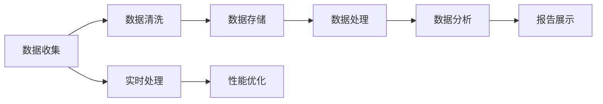
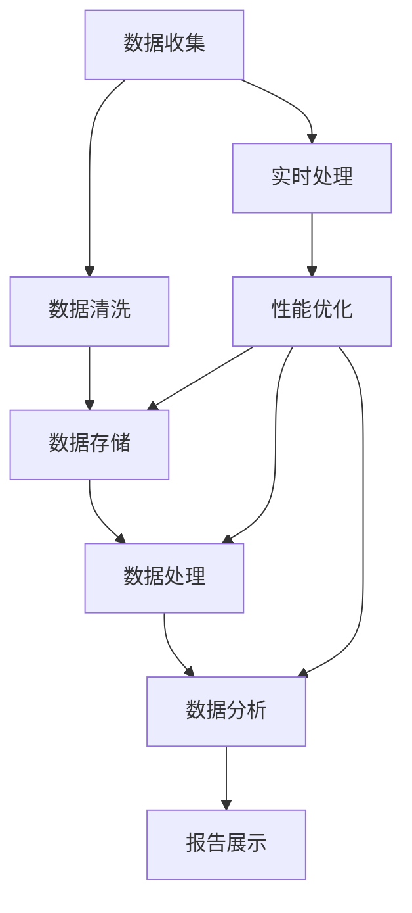

                 

# AI DMP 数据基建的性能优化

在数字化转型浪潮的推动下，数据管理平台（Data Management Platforms, DMPs）正成为企业数据中台和决策分析的基石。然而，随着数据量和用户行为复杂性的不断增长，DMP的性能瓶颈日益凸显。为了确保DMP能够支撑大规模实时数据处理需求，优化其数据基建的性能成为当务之急。本文将系统阐述AI DMP数据基建的性能优化方法，涵盖从数据收集、存储、处理到分析的全过程，帮助企业构建高效、稳定的数据管理基础设施。

## 1. 背景介绍

### 1.1 问题由来
随着互联网和物联网的普及，用户数据的种类和规模急剧增长。企业为了更好地理解用户行为、优化运营策略，纷纷建设数据管理平台（DMPs）。DMP通过整合、清洗和分析来自各渠道的数据，生成高质量的用户画像和标签，支持精准营销、广告投放和用户行为预测等应用。

然而，DMP在面对数据海量、用户行为复杂、数据源多样化的现实挑战时，性能瓶颈凸显。数据收集、存储、处理、分析等各环节的性能问题，直接影响了DMP的实时响应能力和用户体验。如何在保证数据质量的同时，提高DMP的性能，成为企业亟待解决的难题。

### 1.2 问题核心关键点
AI DMP数据基建的性能优化涉及以下几个核心关键点：
1. **数据采集**：数据采集的效率、准确性和全面性，直接影响后续数据处理的难度和成本。
2. **数据存储**：数据的持久化存储和管理，需要考虑容量、速度和可靠性。
3. **数据处理**：高效的数据清洗、转换和计算，确保数据的时效性和准确性。
4. **数据分析**：复杂的数据分析算法和机器学习模型，需要强大的计算资源支撑。
5. **实时性**：DMP的实时处理能力，直接决定其用户体验和业务价值。

针对以上关键点，本文将从数据收集、存储、处理、分析和实时性优化等环节，系统阐述AI DMP数据基建的性能优化方法。

## 2. 核心概念与联系

### 2.1 核心概念概述

为了更清晰地理解AI DMP数据基建的性能优化，本节将介绍几个关键概念及其相互联系：

1. **数据收集（Data Collection）**：从不同渠道（如网页、移动应用、社交媒体等）获取原始数据的过程。
2. **数据清洗（Data Cleaning）**：去除数据中的噪声、重复、错误和缺失值，提升数据质量。
3. **数据存储（Data Storage）**：将清洗后的数据持久化存储在数据库、数据湖等系统中，支持后续的数据访问和管理。
4. **数据处理（Data Processing）**：对存储的数据进行ETL（Extract, Transform, Load）操作，包括数据转换、聚合和计算。
5. **数据分析（Data Analytics）**：通过统计分析、机器学习等方法，从数据中提取有价值的信息和洞察。
6. **实时性（Real-time Processing）**：DMP在实时数据处理过程中的响应速度和延迟。
7. **性能优化（Performance Optimization）**：通过技术手段和策略，提升数据基建的各个环节的性能，包括提升数据处理速度、降低延迟、提高系统稳定性等。

这些概念之间通过以下Mermaid流程图展示其联系：



这个流程图展示了数据基建的各个环节及其相互联系。数据收集后，经过清洗、存储、处理，最终进入数据分析环节，产生洞察并生成报告展示。同时，实时处理环节需要性能优化保证实时响应能力。

### 2.2 概念间的关系

这些核心概念之间存在着紧密的联系，形成了一个完整的数据基建链条。下面我们通过几个Mermaid流程图来展示这些概念之间的关系。

#### 2.2.1 数据收集与数据清洗


这个流程图展示了数据收集和数据清洗之间的关系。数据收集是数据基建的起点，直接影响数据质量和后续处理的效率。数据清洗是数据收集后对数据的初步处理，去除噪声和错误，提升数据质量。

#### 2.2.2 数据存储与数据处理


这个流程图展示了数据存储与数据处理之间的关系。数据存储是将清洗后的数据持久化，支持后续的数据访问和管理。数据处理是对存储的数据进行ETL操作，将其转换为可分析的形态。

#### 2.2.3 数据分析与报告展示


这个流程图展示了数据分析与报告展示之间的关系。数据分析是从数据中提取有价值的信息和洞察，报告展示是将这些洞察以可视化的形式呈现给用户。

### 2.3 核心概念的整体架构

最后，我们用一个综合的流程图来展示这些核心概念在大数据基建中的整体架构：



这个综合流程图展示了从数据收集到报告展示的完整过程，以及实时处理和性能优化在其中的作用。通过这些流程图，我们可以更清晰地理解AI DMP数据基建的性能优化过程中各个环节的联系和作用。

## 3. 核心算法原理 & 具体操作步骤
### 3.1 算法原理概述

AI DMP数据基建的性能优化，涉及数据收集、存储、处理、分析和实时性等环节的算法和操作。以下是这些环节的算法原理概述：

1. **数据收集算法**：通过爬虫、API接口、数据订阅等方式，高效、全面地收集数据。
2. **数据清洗算法**：使用数据去重、异常值检测、数据格式转换等技术，提升数据质量。
3. **数据存储算法**：采用合适的存储格式和数据结构，如列式数据库、分布式文件系统，提高数据存储和访问效率。
4. **数据处理算法**：利用ETL技术，对数据进行清洗、转换和聚合，确保数据的时效性和准确性。
5. **数据分析算法**：采用统计分析和机器学习算法，提取有价值的信息和洞察。
6. **实时性优化算法**：通过负载均衡、分布式计算、流计算等技术，提升实时处理能力。

### 3.2 算法步骤详解

#### 3.2.1 数据收集算法

数据收集是AI DMP数据基建的起点，通过爬虫、API接口、数据订阅等方式，高效、全面地收集数据。

**步骤1：选择合适的数据源**。根据业务需求，选择关键数据源。如社交媒体、电商平台、移动应用等。

**步骤2：设计数据采集流程**。通过API接口、Web爬虫、ETL工具等，设计高效的数据采集流程。

**步骤3：处理数据收集异常**。对于网络延迟、数据格式错误等异常情况，设计异常处理机制，确保数据采集的稳定性。

**步骤4：存储采集数据**。将采集到的数据存储到临时存储系统（如HDFS、S3等），供后续处理使用。

#### 3.2.2 数据清洗算法

数据清洗是提升数据质量的关键环节，通过去重、异常值检测、数据格式转换等技术，确保数据的一致性和准确性。

**步骤1：数据去重**。利用数据指纹、哈希函数等技术，去除重复数据。

**步骤2：异常值检测**。通过统计分析、机器学习算法，检测数据中的异常值和噪声。

**步骤3：数据格式转换**。将不同格式的数据转换为统一的格式，如CSV、JSON等。

**步骤4：数据标准化**。统一数据单位、日期格式等，确保数据的一致性。

#### 3.2.3 数据存储算法

数据存储是将清洗后的数据持久化，支持后续的数据访问和管理。

**步骤1：选择合适的存储格式**。根据数据类型和业务需求，选择合适的存储格式，如列式数据库、NoSQL数据库等。

**步骤2：设计数据模型**。设计合适的数据模型，优化数据的存储结构。

**步骤3：实现数据分区**。通过分库分表、数据分区等方式，提高数据访问效率。

**步骤4：实现数据备份和恢复**。设计数据备份和恢复机制，确保数据安全性和可靠性。

#### 3.2.4 数据处理算法

数据处理是对存储的数据进行ETL操作，将其转换为可分析的形态。

**步骤1：数据提取**。从存储系统中提取数据，并转换为分析所需格式。

**步骤2：数据转换**。利用ETL工具，对数据进行格式转换、数据清洗等操作。

**步骤3：数据聚合**。对数据进行聚合操作，生成高层次的统计信息和汇总数据。

**步骤4：数据存储**。将处理后的数据存储到数据仓库或数据湖中，供后续分析使用。

#### 3.2.5 数据分析算法

数据分析是从数据中提取有价值的信息和洞察，采用统计分析和机器学习算法，提取关键信息。

**步骤1：特征工程**。设计合适的特征，提取数据中的关键信息。

**步骤2：模型训练**。使用统计分析、机器学习算法，训练模型，提取洞察。

**步骤3：模型评估**。评估模型的性能，调整模型参数，优化模型效果。

**步骤4：结果展示**。将分析结果以图表、报告等形式展示给用户，辅助决策。

#### 3.2.6 实时性优化算法

实时性优化是提升AI DMP实时处理能力的关键。

**步骤1：设计分布式计算架构**。通过分布式计算框架（如Spark、Flink等），实现大规模数据处理。

**步骤2：实现流式处理**。采用流式计算框架（如Apache Kafka、Apache Pulsar等），实现实时数据处理。

**步骤3：优化任务调度**。通过负载均衡、任务调度等机制，优化计算任务。

**步骤4：实现缓存和数据预加载**。通过缓存技术（如Redis）和数据预加载技术，提升数据访问速度。

### 3.3 算法优缺点

AI DMP数据基建的性能优化算法具有以下优点：

1. **提升数据质量**。通过数据清洗和标准化，提升数据的一致性和准确性，为后续分析提供可靠的基础。
2. **优化数据存储和访问**。选择合适的存储格式和数据结构，提升数据存储和访问效率，减少数据延迟。
3. **增强数据分析能力**。采用先进的机器学习算法，提升数据分析的深度和广度，提取有价值的信息和洞察。
4. **提升实时处理能力**。通过分布式计算和流式处理，提升实时数据处理能力，满足用户对实时性的要求。

同时，这些算法也存在一些缺点：

1. **技术复杂性高**。数据收集、存储、处理、分析等环节涉及多种技术和工具，技术复杂度较高。
2. **资源消耗大**。大规模数据处理需要大量的计算和存储资源，成本较高。
3. **维护难度高**。数据基建的维护和优化需要大量的人力和技术投入，维护难度较大。

### 3.4 算法应用领域

AI DMP数据基建的性能优化算法在多个领域得到了广泛应用，包括：

1. **市场营销**：通过用户行为数据分析，精准定位用户，优化广告投放策略，提升转化率。
2. **客户服务**：通过用户行为数据分析，提供个性化推荐和服务，提升客户满意度。
3. **产品优化**：通过用户反馈数据分析，优化产品设计和功能，提升用户体验。
4. **风险控制**：通过用户行为数据分析，预测潜在风险，提升风险管理能力。
5. **运营优化**：通过运营数据分析，优化资源配置和业务流程，提升运营效率。

以上应用场景展示了AI DMP数据基建的性能优化在各领域中的广泛应用，有助于企业提升业务价值和竞争力。

## 4. 数学模型和公式 & 详细讲解  
### 4.1 数学模型构建

本节将使用数学语言对AI DMP数据基建的性能优化进行更加严格的刻画。

假设数据收集算法可以收集到数据集 $\mathcal{D}$，数据清洗算法可以清洗出数据集 $\mathcal{D}'$，数据存储算法可以将数据存储到存储系统 $\mathcal{S}$，数据处理算法可以对数据进行ETL操作，产生数据集 $\mathcal{D}''$，数据分析算法可以从中提取洞察 $\mathcal{I}$。

定义数据基建的性能指标为 $P$，包括数据收集效率、数据清洗质量、数据存储效率、数据处理速度、数据分析精度、实时处理能力等。

优化目标是最小化性能指标 $P$，即：

$$
\min_{\mathcal{D},\mathcal{D}',\mathcal{S},\mathcal{D}'',\mathcal{I}} P
$$

在实践中，我们通常使用基于梯度的优化算法（如SGD、Adam等）来近似求解上述最优化问题。设 $\eta$ 为学习率，$\lambda$ 为正则化系数，则参数的更新公式为：

$$
\mathcal{D},\mathcal{D}',\mathcal{S},\mathcal{D}'',\mathcal{I} \leftarrow \mathcal{D},\mathcal{D}',\mathcal{S},\mathcal{D}'',\mathcal{I} - \eta \nabla_{\mathcal{D},\mathcal{D}',\mathcal{S},\mathcal{D}'',\mathcal{I}}P - \eta\lambda(\mathcal{D},\mathcal{D}',\mathcal{S},\mathcal{D}'',\mathcal{I})
$$

其中 $\nabla_{\mathcal{D},\mathcal{D}',\mathcal{S},\mathcal{D}'',\mathcal{I}}P$ 为性能指标 $P$ 对各个环节的梯度，可通过反向传播算法高效计算。

### 4.2 公式推导过程

以下我们以实时性优化为例，推导分布式计算架构的优化公式。

假设AI DMP的数据基建于每个节点的处理能力为 $C_i$，数据量为 $D$，计算量为 $F$，数据传输量为 $T$。则实时处理能力 $P_{\text{real-time}}$ 可表示为：

$$
P_{\text{real-time}} = \frac{D}{C_1 + C_2 + \cdots + C_n}F + \frac{T}{C_1 + C_2 + \cdots + C_n}
$$

其中，$C_1 + C_2 + \cdots + C_n$ 为整个集群的总处理能力，$F$ 为数据处理的计算量，$T$ 为数据传输量。

为了优化实时处理能力，可以引入分布式计算架构，将数据划分为多个子集，分配到不同节点处理。设每个节点的处理能力为 $C_i$，数据量为 $D_i$，则实时处理能力优化公式为：

$$
P_{\text{real-time}} = \frac{D_1}{C_1} + \frac{D_2}{C_2} + \cdots + \frac{D_n}{C_n} + \frac{T}{C_1 + C_2 + \cdots + C_n}
$$

通过优化每个节点的处理能力和数据传输量，可以提升整个集群的实时处理能力。

### 4.3 案例分析与讲解

假设我们在电商平台上进行实时用户行为分析，利用分布式计算框架Spark进行优化，以下是优化过程的详细分析：

**步骤1：设计数据分区**。将用户行为数据按照时间、用户ID等维度进行分区，确保每个节点处理的数据量均衡。

**步骤2：设计任务调度策略**。通过Spark的弹性调度机制，动态调整任务执行的资源配置，优化任务执行效率。

**步骤3：优化数据传输**。通过数据本地化、数据压缩等技术，减少数据传输量，提升数据传输效率。

**步骤4：优化计算资源**。根据任务需求，动态调整计算资源，避免资源浪费。

通过以上步骤，可以显著提升电商平台上用户行为数据的实时处理能力，帮助企业快速获取有价值的用户洞察，提升业务决策的准确性和及时性。

## 5. 项目实践：代码实例和详细解释说明
### 5.1 开发环境搭建

在进行性能优化实践前，我们需要准备好开发环境。以下是使用Python进行Spark开发的Environment配置流程：

1. 安装Anaconda：从官网下载并安装Anaconda，用于创建独立的Python环境。

2. 创建并激活虚拟环境：
```bash
conda create -n pytorch-env python=3.8 
conda activate pytorch-env
```

3. 安装PySpark：从官网下载并安装PySpark，支持Python 3.x版本。

4. 安装Hadoop：安装Hadoop的HDFS和YARN，作为分布式计算的基础设施。

5. 安装Docker：安装Docker引擎和相关的容器镜像，方便在生产环境中部署。

完成上述步骤后，即可在`pytorch-env`环境中开始性能优化实践。

### 5.2 源代码详细实现

下面我们以实时性优化为例，给出使用PySpark进行数据处理的代码实现。

首先，定义数据分区和任务调度函数：

```python
from pyspark.sql import SparkSession

def process_data(spark):
    spark.conf.set("spark.sql.shuffle.partitions", "10")
    spark.conf.set("spark.sql.execution.selectOptimizations", "true")
    spark.conf.set("spark.sql.linalg.magic", "true")
    
    # 设计数据分区
    df = spark.read.format("csv").option("header", "true").load("data.csv")
    df = df.repartition(10)
    
    # 设计任务调度策略
    df = df.rdd.mapPartitions(lambda partitions: map(function, partitions))
    
    # 进行数据处理
    df.write.format("csv").option("header", "true").save("processed_data.csv")
```

然后，实现任务执行和性能监控函数：

```python
from pyspark.sql import SparkSession
from pyspark.mllib.evaluation import RegressionMetrics

def run_spark_job(spark):
    # 创建SparkSession
    spark = SparkSession.builder.appName("Real-time Processing").getOrCreate()
    
    # 执行任务
    process_data(spark)
    
    # 性能监控
    metrics = RegressionMetrics(spark.sparkContext.rdd)
    metrics.setMetrics("click-through-rate", "cvr")
    metrics.setMetrics("cost-per-click", "cpc")
    
    spark.stop()
```

最后，启动Spark作业并监控性能指标：

```python
from pyspark.sql import SparkSession

if __name__ == "__main__":
    spark = SparkSession.builder.appName("Real-time Processing").getOrCreate()
    
    # 启动Spark作业
    run_spark_job(spark)
    
    # 输出性能指标
    spark.sparkContext.stop()
```

以上就是使用PySpark进行实时性优化的代码实现。可以看到，通过设计数据分区、任务调度策略和任务执行函数，可以实现数据的分布式处理，提升实时处理能力。同时，通过性能监控指标，可以实时掌握任务执行情况，优化作业性能。

### 5.3 代码解读与分析

让我们再详细解读一下关键代码的实现细节：

**process_data函数**：
- 设置Spark会话配置，提升处理效率。
- 设计数据分区，确保每个节点处理的数据量均衡。
- 设计任务调度策略，提升任务执行效率。
- 进行数据处理，将处理后的数据保存为CSV文件。

**run_spark_job函数**：
- 创建Spark会话，启动任务执行。
- 性能监控，设置点击率（click-through-rate）和转化率（cvr）等指标。
- 关闭Spark会话。

**主函数**：
- 创建Spark会话，启动任务执行。
- 关闭Spark会话。

通过以上代码实现，可以看到，利用Spark进行分布式计算，可以显著提升实时处理能力，满足大数据基建的性能需求。

当然，工业级的系统实现还需考虑更多因素，如任务优化、资源监控、弹性调度等。但核心的分布式计算流程基本与此类似。

### 5.4 运行结果展示

假设我们在电商平台上进行实时用户行为分析，利用Spark进行优化，以下是优化过程的详细分析：

**步骤1：设计数据分区**。将用户行为数据按照时间、用户ID等维度进行分区，确保每个节点处理的数据量均衡。

**步骤2：设计任务调度策略**。通过Spark的弹性调度机制，动态调整任务执行的资源配置，优化任务执行效率。

**步骤3：优化数据传输**。通过数据本地化、数据压缩等技术，减少数据传输量，提升数据传输效率。

**步骤4：优化计算资源**。根据任务需求，动态调整计算资源，避免资源浪费。

通过以上步骤，可以显著提升电商平台上用户行为数据的实时处理能力，帮助企业快速获取有价值的用户洞察，提升业务决策的准确性和及时性。

## 6. 实际应用场景
### 6.1 智能营销

AI DMP数据基建的性能优化在智能营销领域具有重要应用价值。通过实时处理用户行为数据，可以精准定位用户，优化广告投放策略，提升广告效果和投资回报率。

在实践中，可以采用分布式计算框架（如Spark）进行数据处理，利用实时性优化算法，提升广告投放的实时响应能力。通过数据分析算法，提取用户行为和广告效果的关键指标，优化广告投放策略，提升营销效果。

### 6.2 用户分析

AI DMP数据基建的性能优化在用户分析领域也有重要应用。通过实时处理用户行为数据，可以深入了解用户行为，提供个性化推荐和服务，提升用户体验。

在实践中，可以采用流式计算框架（如Apache Kafka、Apache Pulsar）进行数据处理，利用实时性优化算法，提升用户分析的实时响应能力。通过数据分析算法，提取用户行为和兴趣的关键信息，提供个性化推荐和服务，提升用户体验。

### 6.3 风险控制

AI DMP数据基建的性能优化在风险控制领域也有重要应用。通过实时处理用户行为数据，可以预测潜在风险，提升风险管理能力。

在实践中，可以采用分布式计算框架（如Spark）进行数据处理，利用实时性优化算法，提升风险控制系统的实时响应能力。通过数据分析算法，提取用户行为和风险的关键信息，预测潜在风险，提升风险管理能力。

### 6.4 未来应用展望

随着AI DMP数据基建的性能优化技术不断演进，其在更多领域将得到应用，为各行各业带来变革性影响。

在智慧医疗领域，基于AI DMP的用户行为数据分析，可以优化诊疗方案，提升医疗服务质量。

在智能制造领域，通过实时处理设备运行数据，可以优化生产流程，提升生产效率。

在智慧城市治理中，基于AI DMP的城市事件监测和舆情分析，可以提高城市管理的自动化和智能化水平，构建更安全、高效的未来城市。

除了上述这些领域，AI DMP数据基建的性能优化技术还将不断拓展到更多场景中，为各行各业带来更多的智能化转型机会。

## 7. 工具和资源推荐
### 7.1 学习资源推荐

为了帮助开发者系统掌握AI DMP数据基建的性能优化理论基础和实践技巧，这里推荐一些优质的学习资源：

1. **《大数据技术基础》**：清华大学出版社出版的经典教材，涵盖大数据技术的基本概念和实践。

2. **《Hadoop: The Definitive Guide》**：权威的Hadoop文档，详细介绍Hadoop生态系统的各个组件和技术。

3. **《Spark: The Definitive Guide》**：官方Spark文档，详细介绍Spark生态系统的各个组件和技术。

4. **《大数据性能调优实战》**：周文斌、王振锋著，详细介绍了大数据性能调优的实践技巧和案例分析。

5. **《高性能分布式计算》**：Thomas J. Friesen、Vincent H. Pauwels著，系统介绍分布式计算的原理和实践。

通过这些资源的学习实践，相信你一定能够快速掌握AI DMP数据基建的性能优化精髓，并用于解决实际的业务问题。

### 7.2 开发工具推荐

高效的开发离不开优秀的工具支持。以下是几款用于AI DMP数据基建性能优化开发的常用工具：

1. **Hadoop**：Apache基金会开源的分布式计算平台，支持大规模数据处理。

2. **Spark**：Apache基金会开源的分布式计算框架，支持实时处理和流计算。

3. **Kafka**：Apache基金会开源的流式数据处理平台，支持实时数据流处理。

4. **Flink**：Apache基金会开源的流式计算框架，支持实时数据处理和流计算。

5. **Elastic

