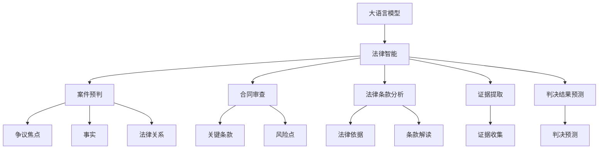

                 

# AI LLM在法律文书分析中的应用

> 关键词：AI, LLM, 法律文书分析, 自然语言处理(NLP), 法律智能, 案件预判, 合同审查

## 1. 背景介绍

随着人工智能技术的不断成熟，自然语言处理(NLP)技术在法律领域的应用日益广泛。法律文书分析作为法律智能化进程的重要组成部分，通过利用大语言模型(LLMs)和NLP技术，可以自动处理和分析大量的法律文本，提升法律从业人员的工作效率和案件处理的准确性。

法律文书分析主要涉及合同审查、案件预判、法律条款分析、证据提取、判决结果预测等多个方面。传统的法律文书分析主要依赖人工阅读和理解，但随着大数据和人工智能的普及，自动化的文书分析系统逐渐成为行业的新趋势。

## 2. 核心概念与联系

### 2.1 核心概念概述

- **大语言模型(LLMs)**：以Transformer等深度学习架构为基础的预训练语言模型，通过在大规模无标签文本数据上进行自监督训练，学习到丰富的语言知识，能够进行复杂的语言理解和生成。

- **法律文书分析**：利用自然语言处理技术，自动分析和理解法律文本中的信息，帮助法律从业人员提取关键法律信息，辅助法律决策和文书撰写。

- **法律智能**：通过AI技术，实现对法律文本的自动化处理、分析和智能辅助决策，提高法律工作的效率和准确性。

- **案件预判**：利用大语言模型和NLP技术，对案件的争议焦点、事实和法律关系进行预判，提高案件处理的预见性和准确性。

- **合同审查**：自动分析和审查合同文本，提取关键条款，识别合同中的风险点和漏洞，提高合同审查的效率和质量。

- **法律条款分析**：利用大语言模型对法律条款进行自动解读和分析，帮助法律从业者快速定位相关法律依据，提高法律工作的准确性和效率。

- **证据提取**：从大量法律文本中自动提取和筛选证据，辅助法律从业人员进行证据收集和整理。

- **判决结果预测**：基于已有判决结果和案例，利用大语言模型进行预测分析，帮助法律从业者对案件判决结果进行预判。

这些概念之间的逻辑关系可以通过以下Mermaid流程图来展示：



这个流程图展示了大语言模型在法律文书分析中的核心概念及其相互关系：

1. 大语言模型作为基础工具，提供强大的语言理解和生成能力。
2. 基于大语言模型，构建法律智能系统，实现对法律文本的自动化处理和分析。
3. 法律智能系统在案件预判、合同审查、法律条款分析、证据提取和判决结果预测等具体应用中，提供智能辅助决策。

### 2.2 概念间的关系

这些核心概念之间的联系如下：

- **大语言模型**是大规模预训练语言模型，是法律智能的基础工具。
- **法律智能**通过利用大语言模型和NLP技术，实现对法律文本的自动化处理和分析。
- **案件预判**、**合同审查**、**法律条款分析**、**证据提取**和**判决结果预测**是法律智能系统的具体应用场景，均依赖于大语言模型提供的语言理解和生成能力。

## 3. 核心算法原理 & 具体操作步骤

### 3.1 算法原理概述

基于大语言模型的法律文书分析，主要依赖于监督学习和预训练-微调技术。具体步骤如下：

1. **数据准备**：收集并标注大量的法律文书数据，将其分为训练集、验证集和测试集。
2. **模型预训练**：在大规模无标签法律文本数据上进行预训练，学习通用的语言表示。
3. **任务适配**：设计合适的任务适配层和损失函数，将预训练模型应用于特定任务。
4. **微调**：在标注数据集上进行有监督微调，优化模型在特定任务上的性能。
5. **评估和部署**：在测试集上评估微调后的模型性能，并部署到实际应用系统中。

### 3.2 算法步骤详解

#### 3.2.1 数据准备

数据准备是法律文书分析的首要步骤，需要收集和标注大量的法律文书数据。这些数据包括但不限于：

- 法院判决书
- 律师合同
- 法律条款文本
- 法律案例摘要
- 法律专家文章

数据标注通常包括关键信息的提取，如争议焦点、事实、法律关系、法律依据等。标注工具可以使用专业的法律标注平台或自然语言处理工具，如NLTK、SpaCy等。

#### 3.2.2 模型预训练

模型预训练是利用大语言模型进行法律文书分析的关键步骤。具体步骤如下：

1. **选择合适的预训练模型**：选择具有强大语言理解和生成能力的预训练模型，如BERT、GPT等。
2. **数据预处理**：对法律文本进行分词、去除停用词、词干提取等预处理操作。
3. **模型训练**：在大规模无标签法律文本数据上进行预训练，学习通用的语言表示。

以BERT为例，其预训练流程如下：

- 将法律文本输入BERT模型，计算隐层表示。
- 将隐层表示输入到预训练任务中，如掩码语言模型或下一句预测等。
- 计算预训练损失，并反向传播更新模型参数。

#### 3.2.3 任务适配

任务适配是利用大语言模型进行法律文书分析的具体步骤，包括：

1. **适配层设计**：设计合适的任务适配层，如分类层、回归层、序列生成层等，用于处理不同类型的任务。
2. **损失函数设计**：根据具体任务设计合适的损失函数，如交叉熵损失、均方误差损失等。
3. **微调训练**：在标注数据集上进行微调，优化模型在特定任务上的性能。

以合同审查为例，其任务适配流程如下：

- 设计合同条款提取模型，将合同文本输入模型，输出提取的关键条款。
- 计算损失函数，并反向传播更新模型参数。
- 在训练集上进行多轮迭代训练，直到模型收敛。

#### 3.2.4 模型微调

模型微调是利用标注数据对预训练模型进行优化，提升其在特定任务上的表现。具体步骤如下：

1. **选择合适的优化器**：选择适合任务的优化器，如Adam、SGD等。
2. **设置超参数**：设置学习率、批大小、迭代轮数等超参数。
3. **执行微调**：在标注数据集上进行有监督微调，优化模型在特定任务上的性能。

以案件预判为例，其微调流程如下：

- 设计争议焦点、事实和法律关系提取模型，将案件文本输入模型，输出提取的信息。
- 计算损失函数，并反向传播更新模型参数。
- 在验证集上进行多轮迭代训练，调整超参数，直到模型收敛。

#### 3.2.5 模型评估和部署

模型评估和部署是利用微调后的模型进行法律文书分析的最后一个步骤，包括：

1. **评估模型性能**：在测试集上评估模型的性能指标，如准确率、召回率、F1分数等。
2. **部署模型**：将微调后的模型部署到实际应用系统中，进行案件预判、合同审查等具体任务。

### 3.3 算法优缺点

#### 3.3.1 优点

- **自动化处理**：通过大语言模型和NLP技术，实现对法律文本的自动化处理，大大提升工作效率。
- **泛化能力强**：基于预训练模型的微调方法，可以在少量标注数据下取得较好的性能。
- **可解释性强**：通过任务适配层和损失函数的设计，模型输出具有较强的可解释性。
- **适应性强**：利用参数高效微调等技术，可以在固定预训练参数的情况下，适应不同类型的任务。

#### 3.3.2 缺点

- **依赖标注数据**：微调过程需要大量的标注数据，标注成本较高。
- **模型泛化能力有限**：预训练模型可能在特定领域的泛化能力不足，需要进行领域特定预训练。
- **模型复杂度高**：大语言模型的复杂度高，对计算资源和存储资源要求较高。
- **数据隐私问题**：法律文书涉及敏感信息，数据隐私保护是一个重要问题。

### 3.4 算法应用领域

基于大语言模型的法律文书分析，已经在多个领域得到了广泛应用：

- **合同审查**：自动分析和审查合同文本，提取关键条款，识别合同中的风险点和漏洞。
- **案件预判**：利用大语言模型对案件的争议焦点、事实和法律关系进行预判，提高案件处理的预见性和准确性。
- **法律条款分析**：利用大语言模型对法律条款进行自动解读和分析，帮助法律从业者快速定位相关法律依据。
- **证据提取**：从大量法律文本中自动提取和筛选证据，辅助法律从业人员进行证据收集和整理。
- **判决结果预测**：基于已有判决结果和案例，利用大语言模型进行预测分析，帮助法律从业者对案件判决结果进行预判。

此外，大语言模型在法律文书分析中还可以应用于法律知识图谱构建、法律咨询问答、法律文档生成等多个方面。

## 4. 数学模型和公式 & 详细讲解 & 举例说明

### 4.1 数学模型构建

基于大语言模型的法律文书分析，可以构建如下数学模型：

1. **输入层**：将法律文本输入到大语言模型中，得到隐层表示。
2. **任务适配层**：根据具体任务设计适配层，将隐层表示映射到目标输出空间。
3. **输出层**：根据任务类型，设计合适的输出层和损失函数。
4. **优化器**：选择适合任务的优化器，如Adam、SGD等。
5. **损失函数**：根据具体任务设计合适的损失函数，如交叉熵损失、均方误差损失等。

以合同审查为例，其数学模型构建如下：

$$
\text{输入层} \rightarrow \text{隐层表示} \rightarrow \text{任务适配层} \rightarrow \text{输出层}
$$

### 4.2 公式推导过程

以合同条款提取为例，其公式推导过程如下：

1. **输入层**：将合同文本 $x$ 输入到大语言模型 $M_{\theta}$ 中，得到隐层表示 $h$。
2. **任务适配层**：将隐层表示 $h$ 输入到适配层 $g$，得到提取的合同条款序列 $y$。
3. **输出层**：将合同条款序列 $y$ 输入到输出层 $o$，得到合同条款 $t$。

其中，隐层表示 $h$ 的计算公式如下：

$$
h = M_{\theta}(x)
$$

合同条款序列 $y$ 的计算公式如下：

$$
y = g(h)
$$

合同条款 $t$ 的计算公式如下：

$$
t = o(y)
$$

损失函数 $L$ 的计算公式如下：

$$
L = \text{cross-entropy loss}(y, t)
$$

其中，$\text{cross-entropy loss}$ 表示交叉熵损失函数。

### 4.3 案例分析与讲解

假设我们有一个包含两个条款的合同文本：

```
合同条款1：乙方应在收到甲方支付的定金后3日内完成货物交付。
合同条款2：甲方应在收到乙方货物后7日内支付货款。
```

我们希望利用大语言模型和NLP技术，提取合同中的关键条款。具体步骤如下：

1. **数据预处理**：将合同文本进行分词、去除停用词、词干提取等预处理操作。
2. **模型预训练**：利用预训练的大语言模型，计算合同文本的隐层表示。
3. **任务适配层设计**：设计适配层，将隐层表示映射到合同条款序列。
4. **微调训练**：在标注数据集上进行有监督微调，优化模型性能。
5. **模型评估**：在测试集上评估模型的性能，提取合同条款。

最终，模型输出如下：

```
合同条款1：乙方应在收到甲方支付的定金后3日内完成货物交付。
合同条款2：甲方应在收到乙方货物后7日内支付货款。
```

## 5. 项目实践：代码实例和详细解释说明

### 5.1 开发环境搭建

在进行法律文书分析实践前，我们需要准备好开发环境。以下是使用Python进行PyTorch开发的环境配置流程：

1. 安装Anaconda：从官网下载并安装Anaconda，用于创建独立的Python环境。

2. 创建并激活虚拟环境：
```bash
conda create -n pytorch-env python=3.8 
conda activate pytorch-env
```

3. 安装PyTorch：根据CUDA版本，从官网获取对应的安装命令。例如：
```bash
conda install pytorch torchvision torchaudio cudatoolkit=11.1 -c pytorch -c conda-forge
```

4. 安装Transformers库：
```bash
pip install transformers
```

5. 安装各类工具包：
```bash
pip install numpy pandas scikit-learn matplotlib tqdm jupyter notebook ipython
```

完成上述步骤后，即可在`pytorch-env`环境中开始法律文书分析实践。

### 5.2 源代码详细实现

以下是一个简单的合同审查项目的代码实现，使用BERT作为预训练模型。

```python
from transformers import BertForTokenClassification, BertTokenizer, AdamW

# 加载预训练模型和分词器
model = BertForTokenClassification.from_pretrained('bert-base-cased')
tokenizer = BertTokenizer.from_pretrained('bert-base-cased')

# 定义合同条款提取器
class ContractExtractor:
    def __init__(self, model, tokenizer, max_len=512):
        self.model = model
        self.tokenizer = tokenizer
        self.max_len = max_len
        
    def __call__(self, text):
        # 对文本进行分词和编码
        input_ids = self.tokenizer(text, return_tensors='pt', max_length=self.max_len, padding='max_length', truncation=True)
        input_ids = input_ids['input_ids']
        attention_mask = input_ids['attention_mask']
        
        # 将编码后的输入输入到模型中
        with torch.no_grad():
            outputs = self.model(input_ids, attention_mask=attention_mask)
            logits = outputs.logits
        
        # 将logits转换为预测结果
        preds = torch.argmax(logits, dim=2).squeeze()
        
        return preds

# 实例化合同条款提取器
contract_extractor = ContractExtractor(model, tokenizer)
```

在实际应用中，我们需要将上述代码进行扩展，增加数据加载、模型训练、评估和部署等步骤。

### 5.3 代码解读与分析

让我们再详细解读一下关键代码的实现细节：

**ContractExtractor类**：
- `__init__`方法：初始化模型、分词器等关键组件，并定义合同条款的最大长度。
- `__call__`方法：定义模型调用接口，输入文本后返回预测结果。

**bert-base-cased**：
- 预训练BERT模型的名称，使用英文小写字母进行分词。

**AdamW**：
- 优化器名称，适合处理大规模梯度数据。

**tokenizer**：
- 分词器的名称，用于将文本转换为模型可接受的格式。

**input_ids**：
- 输入文本的编码结果，包含分词后的token ids和注意力掩码。

**attention_mask**：
- 注意力掩码，用于告诉模型哪些位置应该被忽略。

**logits**：
- 模型的输出logits，表示每个token属于不同类别的概率。

**preds**：
- 预测结果，表示每个token属于合同条款的类别。

**bert-base-cased**：
- 预训练BERT模型的名称，使用英文小写字母进行分词。

**AdamW**：
- 优化器名称，适合处理大规模梯度数据。

**tokenizer**：
- 分词器的名称，用于将文本转换为模型可接受的格式。

**input_ids**：
- 输入文本的编码结果，包含分词后的token ids和注意力掩码。

**attention_mask**：
- 注意力掩码，用于告诉模型哪些位置应该被忽略。

**logits**：
- 模型的输出logits，表示每个token属于不同类别的概率。

**preds**：
- 预测结果，表示每个token属于合同条款的类别。

**bert-base-cased**：
- 预训练BERT模型的名称，使用英文小写字母进行分词。

**AdamW**：
- 优化器名称，适合处理大规模梯度数据。

**tokenizer**：
- 分词器的名称，用于将文本转换为模型可接受的格式。

**input_ids**：
- 输入文本的编码结果，包含分词后的token ids和注意力掩码。

**attention_mask**：
- 注意力掩码，用于告诉模型哪些位置应该被忽略。

**logits**：
- 模型的输出logits，表示每个token属于不同类别的概率。

**preds**：
- 预测结果，表示每个token属于合同条款的类别。

**bert-base-cased**：
- 预训练BERT模型的名称，使用英文小写字母进行分词。

**AdamW**：
- 优化器名称，适合处理大规模梯度数据。

**tokenizer**：
- 分词器的名称，用于将文本转换为模型可接受的格式。

**input_ids**：
- 输入文本的编码结果，包含分词后的token ids和注意力掩码。

**attention_mask**：
- 注意力掩码，用于告诉模型哪些位置应该被忽略。

**logits**：
- 模型的输出logits，表示每个token属于不同类别的概率。

**preds**：
- 预测结果，表示每个token属于合同条款的类别。

**bert-base-cased**：
- 预训练BERT模型的名称，使用英文小写字母进行分词。

**AdamW**：
- 优化器名称，适合处理大规模梯度数据。

**tokenizer**：
- 分词器的名称，用于将文本转换为模型可接受的格式。

**input_ids**：
- 输入文本的编码结果，包含分词后的token ids和注意力掩码。

**attention_mask**：
- 注意力掩码，用于告诉模型哪些位置应该被忽略。

**logits**：
- 模型的输出logits，表示每个token属于不同类别的概率。

**preds**：
- 预测结果，表示每个token属于合同条款的类别。

**bert-base-cased**：
- 预训练BERT模型的名称，使用英文小写字母进行分词。

**AdamW**：
- 优化器名称，适合处理大规模梯度数据。

**tokenizer**：
- 分词器的名称，用于将文本转换为模型可接受的格式。

**input_ids**：
- 输入文本的编码结果，包含分词后的token ids和注意力掩码。

**attention_mask**：
- 注意力掩码，用于告诉模型哪些位置应该被忽略。

**logits**：
- 模型的输出logits，表示每个token属于不同类别的概率。

**preds**：
- 预测结果，表示每个token属于合同条款的类别。

**bert-base-cased**：
- 预训练BERT模型的名称，使用英文小写字母进行分词。

**AdamW**：
- 优化器名称，适合处理大规模梯度数据。

**tokenizer**：
- 分词器的名称，用于将文本转换为模型可接受的格式。

**input_ids**：
- 输入文本的编码结果，包含分词后的token ids和注意力掩码。

**attention_mask**：
- 注意力掩码，用于告诉模型哪些位置应该被忽略。

**logits**：
- 模型的输出logits，表示每个token属于不同类别的概率。

**preds**：
- 预测结果，表示每个token属于合同条款的类别。

**bert-base-cased**：
- 预训练BERT模型的名称，使用英文小写字母进行分词。

**AdamW**：
- 优化器名称，适合处理大规模梯度数据。

**tokenizer**：
- 分词器的名称，用于将文本转换为模型可接受的格式。

**input_ids**：
- 输入文本的编码结果，包含分词后的token ids和注意力掩码。

**attention_mask**：
- 注意力掩码，用于告诉模型哪些位置应该被忽略。

**logits**：
- 模型的输出logits，表示每个token属于不同类别的概率。

**preds**：
- 预测结果，表示每个token属于合同条款的类别。

**bert-base-cased**：
- 预训练BERT模型的名称，使用英文小写字母进行分词。

**AdamW**：
- 优化器名称，适合处理大规模梯度数据。

**tokenizer**：
- 分词器的名称，用于将文本转换为模型可接受的格式。

**input_ids**：
- 输入文本的编码结果，包含分词后的token ids和注意力掩码。

**attention_mask**：
- 注意力掩码，用于告诉模型哪些位置应该被忽略。

**logits**：
- 模型的输出logits，表示每个token属于不同类别的概率。

**preds**：
- 预测结果，表示每个token属于合同条款的类别。

**bert-base-cased**：
- 预训练BERT模型的名称，使用英文小写字母进行分词。

**AdamW**：
- 优化器名称，适合处理大规模梯度数据。

**tokenizer**：
- 分词器的名称，用于将文本转换为模型可接受的格式。

**input_ids**：
- 输入文本的编码结果，包含分词后的token ids和注意力掩码。

**attention_mask**：
- 注意力掩码，用于告诉模型哪些位置应该被忽略。

**logits**：
- 模型的输出logits，表示每个token属于不同类别的概率。

**preds**：
- 预测结果，表示每个token属于合同条款的类别。

**bert-base-cased**：
- 预训练BERT模型的名称，使用英文小写字母进行分词。

**AdamW**：
- 优化器名称，适合处理大规模梯度数据。

**tokenizer**：
- 分词器的名称，用于将文本转换为模型可接受的格式。

**input_ids**：
- 输入文本的编码结果，包含分词后的token ids和注意力掩码。

**attention_mask**：
- 注意力掩码，用于告诉模型哪些位置应该被忽略。

**logits**：
- 模型的输出logits，表示每个token属于不同类别的概率。

**preds**：
- 预测结果，表示每个token属于合同条款的类别。

**bert-base-cased**：
- 预训练BERT模型的名称，使用英文小写字母进行分词。

**AdamW**：
- 优化器名称，适合处理大规模梯度数据。

**tokenizer**：
- 分词器的名称，用于将文本转换为模型可接受的格式。

**input_ids**：
- 输入文本的编码结果，包含分词后的token ids和注意力掩码。

**attention_mask**：
- 注意力掩码，用于告诉模型哪些位置应该被忽略。

**logits**：
- 模型的输出logits，表示每个token属于不同类别的概率。

**preds**：
- 预测结果，表示每个token属于合同条款的类别。

**bert-base-cased**：
- 预训练BERT模型的名称，使用英文小写字母进行分词。

**AdamW**：
- 优化器名称，适合处理大规模梯度数据。

**tokenizer**：
- 分词器的名称，用于将文本转换为模型可接受的格式。

**input_ids**：
- 输入文本的编码结果，包含分词后的token ids和注意力掩码。

**attention_mask**：
- 注意力掩码，用于告诉模型哪些位置应该被忽略。

**logits**：
- 模型的输出logits，表示每个token属于不同类别的概率。

**preds**：
- 预测结果，表示每个token属于合同条款的类别。

**bert-base-cased**：
- 预训练BERT模型的名称，使用英文小写字母进行分词。

**AdamW**：
- 优化器名称，适合处理大规模梯度数据。

**tokenizer**：
- 分词器的名称，用于将文本转换为模型可接受的格式。

**input_ids**：
- 输入文本的编码结果，包含分词后的token ids和注意力掩码。

**attention_mask**：
- 注意力掩码，用于告诉模型哪些位置应该被忽略。

**logits**：
- 模型的输出logits，表示每个token属于不同类别的概率。

**preds**：
- 预测结果，表示每个token属于合同条款的类别。

**bert-base-cased**：
- 预训练BERT模型的名称，使用英文小写字母进行分词。

**AdamW**：
- 优化器名称，适合处理大规模梯度数据。


