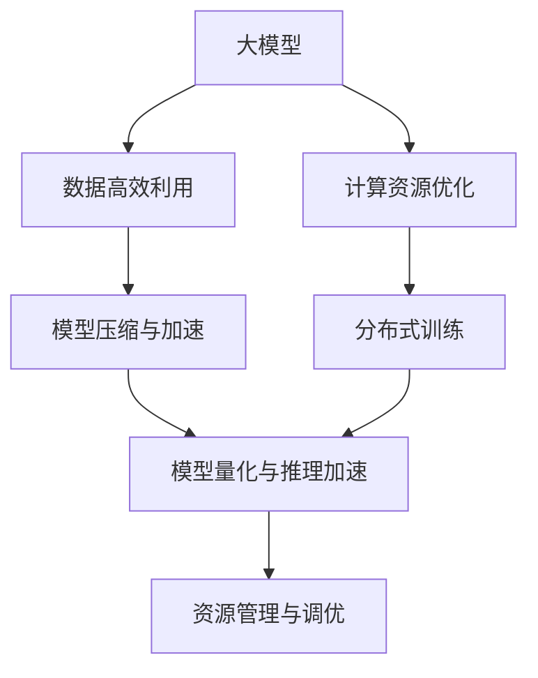
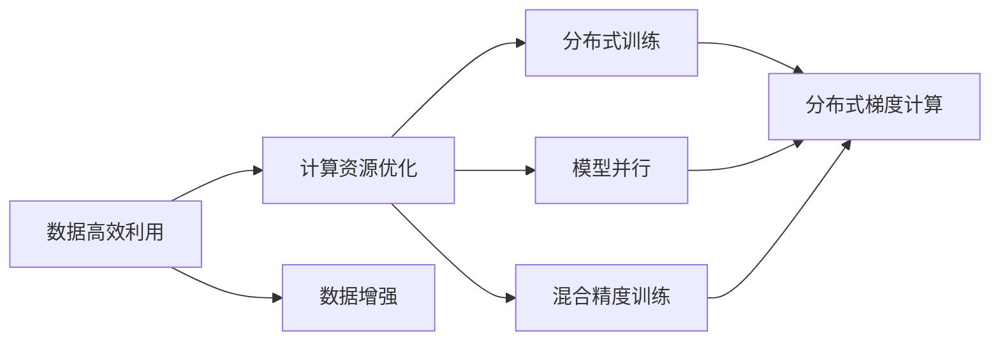
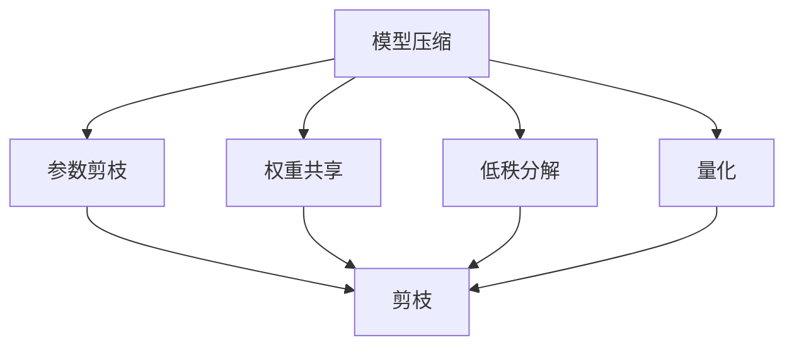
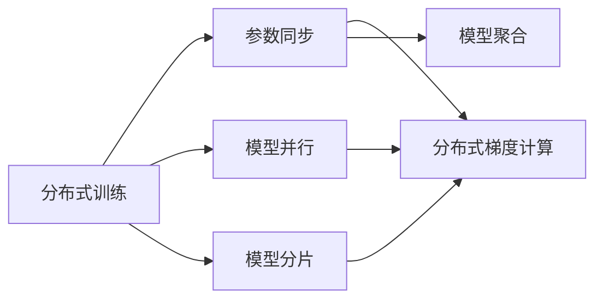
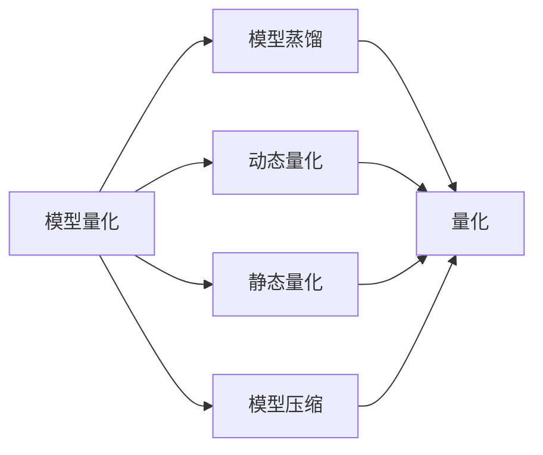
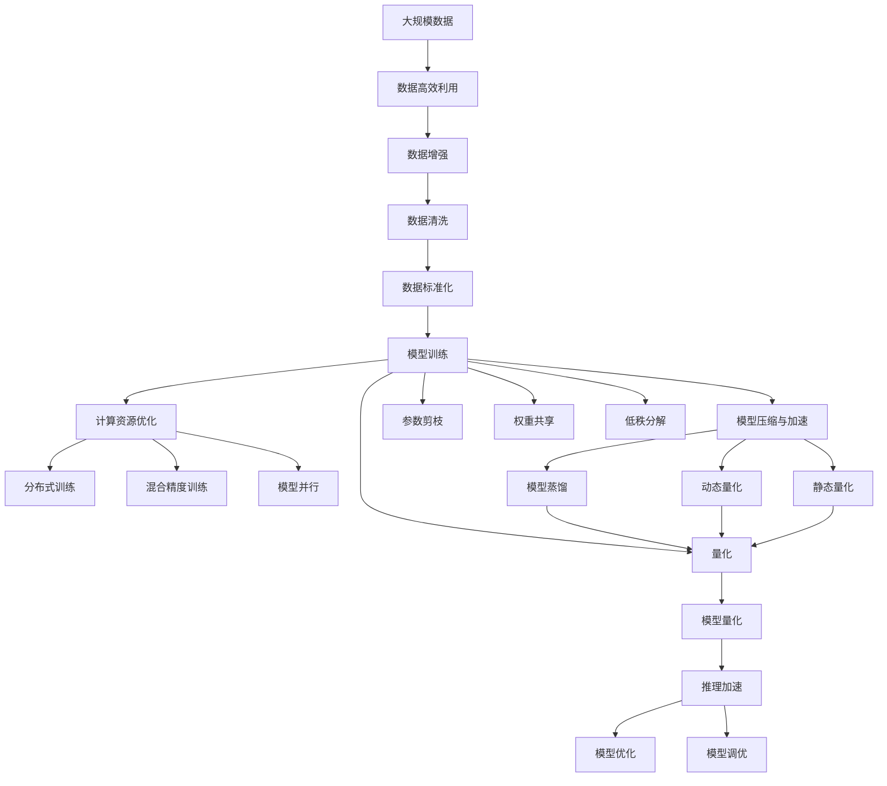

                 

# AI 大模型原理与应用：data 和 compute 效率问题解决方案和挑战

> 关键词：
1. AI大模型
2. 数据高效利用
3. 计算资源优化
4. 模型压缩与加速
5. 分布式训练
6. 模型量化与推理加速
7. 资源管理与调优

## 1. 背景介绍

### 1.1 问题由来

随着人工智能技术的迅速发展，大模型在各个领域的应用越来越广泛，但同时伴随着数据和计算资源的巨大需求。大模型的训练通常需要数百万、亿级的参数，训练过程耗费大量计算资源和时间，同时也对存储和传输带宽提出了高要求。数据高效利用和计算资源优化成为了大模型应用中的一个重要课题。

### 1.2 问题核心关键点

- 数据的高效利用：如何从海量数据中高效提取有用信息，并应用到模型训练中，避免数据冗余和浪费。
- 计算资源优化：如何在有限的计算资源下，最大化模型的性能，减少计算时间和成本。
- 模型压缩与加速：如何通过模型压缩和加速技术，提高模型的推理速度，减少存储空间。
- 分布式训练：如何利用分布式计算架构，加速大规模模型的训练。
- 模型量化与推理加速：如何通过量化和加速技术，提高模型推理效率，减少计算资源消耗。
- 资源管理与调优：如何对计算资源和数据存储进行高效管理，优化模型训练和推理性能。

### 1.3 问题研究意义

解决大模型在数据和计算效率问题，对于提高模型的应用效果，加速AI技术的产业化进程，具有重要意义：

1. 降低应用开发成本：通过数据高效利用和计算资源优化，可以显著减少从头开发所需的数据和计算成本。
2. 提升模型效果：数据高效利用和计算资源优化，能够提高模型的训练速度和准确度，提升模型在实际应用中的表现。
3. 加速开发进度：通过数据和计算效率的优化，可以加快模型训练和推理，缩短开发周期。
4. 增强系统稳定性：合理的数据和计算资源管理，可以提高系统的稳定性和可靠性，减少故障风险。
5. 提升用户体验：通过模型推理加速和计算资源优化，可以提升模型的响应速度，提升用户体验。

## 2. 核心概念与联系

### 2.1 核心概念概述

为更好地理解数据和计算效率问题的解决方案，本节将介绍几个密切相关的核心概念：

- 大模型：指具有亿级以上参数的深度学习模型，如BERT、GPT-3等。
- 数据高效利用：指在数据处理和训练过程中，如何从海量数据中高效提取有用信息，避免数据冗余和浪费。
- 计算资源优化：指在模型训练和推理过程中，如何优化计算资源配置，减少计算时间和成本。
- 模型压缩与加速：指通过模型压缩和加速技术，减少模型参数和计算量，提高模型推理速度。
- 分布式训练：指利用分布式计算架构，将大规模模型的训练任务分配到多台计算设备上，加速模型训练。
- 模型量化与推理加速：指通过量化和加速技术，减少模型计算量，提高模型推理效率。
- 资源管理与调优：指对计算资源和数据存储进行高效管理，优化模型训练和推理性能。

这些核心概念之间的逻辑关系可以通过以下Mermaid流程图来展示：



这个流程图展示了大模型在数据和计算效率问题中的几个主要解决方向，及其之间的关系：

1. 大模型通过数据高效利用和计算资源优化，减少计算成本和资源消耗，提高训练速度和准确度。
2. 模型压缩与加速技术可以减少模型参数和计算量，提高模型推理速度。
3. 分布式训练利用多台计算设备并行处理，加速大规模模型训练。
4. 模型量化与推理加速通过减少计算量，提高模型推理效率。
5. 资源管理与调优对计算资源和数据存储进行高效管理，优化模型训练和推理性能。

### 2.2 概念间的关系

这些核心概念之间存在着紧密的联系，形成了大模型在数据和计算效率问题中的完整生态系统。下面我通过几个Mermaid流程图来展示这些概念之间的关系。

#### 2.2.1 大模型的计算资源优化



这个流程图展示了大模型在数据高效利用基础上，如何通过计算资源优化提升训练性能。

#### 2.2.2 模型压缩与加速方法



这个流程图展示了几类常见的模型压缩与加速方法，包括参数剪枝、权重共享、低秩分解和量化，这些方法可以综合应用，提高模型的推理速度。

#### 2.2.3 分布式训练的优化策略



这个流程图展示了分布式训练的几个关键技术，包括参数同步、模型并行和模型分片，这些技术可以综合应用，加速大规模模型的训练。

#### 2.2.4 模型量化与推理加速



这个流程图展示了模型量化与推理加速的几个关键技术，包括模型蒸馏、动态量化和静态量化，这些技术可以综合应用，提高模型推理效率。

### 2.3 核心概念的整体架构

最后，我们用一个综合的流程图来展示这些核心概念在大模型数据和计算效率问题中的整体架构：



这个综合流程图展示了从数据高效利用到计算资源优化，再到模型压缩与加速、分布式训练、模型量化与推理加速的整体过程。大模型通过数据高效利用和计算资源优化，减少计算成本和资源消耗，提高训练速度和准确度。同时，通过模型压缩与加速、分布式训练、模型量化与推理加速等技术，进一步提升模型的推理速度和效率，优化资源配置，实现大模型的高效应用。

## 3. 核心算法原理 & 具体操作步骤

### 3.1 算法原理概述

大模型在数据和计算效率问题中的解决方案，本质上是通过一系列算法和技术手段，优化数据利用和计算资源配置，提高模型的训练速度和推理效率。

常见的解决方案包括：

- 数据高效利用：通过数据增强、数据清洗、数据标准化等技术，最大化数据价值，减少数据冗余和浪费。
- 计算资源优化：通过分布式训练、混合精度训练、模型并行等技术，优化计算资源配置，减少计算时间和成本。
- 模型压缩与加速：通过参数剪枝、权重共享、低秩分解、量化等技术，减少模型参数和计算量，提高模型推理速度。
- 分布式训练：通过多台计算设备并行处理，加速大规模模型的训练。
- 模型量化与推理加速：通过量化和加速技术，减少模型计算量，提高模型推理效率。
- 资源管理与调优：通过资源监控、负载均衡等技术，优化计算资源和数据存储，提高模型训练和推理性能。

### 3.2 算法步骤详解

基于数据和计算效率问题解决方案的核心算法和操作步骤如下：

**Step 1: 数据高效利用**

- 数据增强：通过数据生成、数据变换等技术，增加数据多样性，提高数据价值。
- 数据清洗：去除数据中的噪声、异常值等，提升数据质量。
- 数据标准化：对数据进行归一化、标准化等处理，确保数据一致性。

**Step 2: 计算资源优化**

- 分布式训练：将模型训练任务分配到多台计算设备上，利用并行处理，加速模型训练。
- 混合精度训练：使用float16、bfloat16等低精度数据类型，减少计算量，提高训练速度。
- 模型并行：将模型分解为多个子模型，并行处理，加速训练过程。

**Step 3: 模型压缩与加速**

- 参数剪枝：去除模型中冗余的参数，减少模型大小，提高推理速度。
- 权重共享：共享模型中重复的权重，减少计算量，提高效率。
- 低秩分解：将模型权重表示为低秩矩阵，减少参数量，提高推理速度。
- 量化：将模型权重和激活值压缩为定点数据类型，减少计算量，提高推理速度。

**Step 4: 分布式训练的优化策略**

- 参数同步：在分布式训练中，保持各节点参数一致性，避免数据不一致导致的性能下降。
- 模型分片：将大模型分解为多个小模型，分别训练，并行处理，提高训练效率。
- 分布式梯度计算：在分布式训练中，将梯度计算任务分配到多台计算设备上，加速计算过程。

**Step 5: 模型量化与推理加速**

- 模型蒸馏：通过知识蒸馏技术，将大模型的知识转移到小模型中，减少计算量，提高推理速度。
- 动态量化：在推理过程中，动态调整模型参数的精度，提高推理效率。
- 静态量化：在训练过程中，将模型参数压缩为定点数据类型，减少计算量，提高推理速度。

**Step 6: 资源管理与调优**

- 资源监控：实时监控计算资源的使用情况，及时调整资源配置，避免资源浪费。
- 负载均衡：在分布式训练中，均衡计算资源的负载，提高训练效率。

通过以上步骤，可以系统地解决大模型在数据和计算效率问题中的挑战，提升模型的训练速度和推理效率，优化计算资源配置，实现大模型的高效应用。

### 3.3 算法优缺点

数据和计算效率问题解决方案的算法，具有以下优点：

- 提高模型训练速度：通过分布式训练、混合精度训练等技术，可以显著提高模型的训练速度，缩短开发周期。
- 减少计算成本：通过参数剪枝、权重共享等技术，可以大幅度减少计算量，降低计算成本。
- 提升模型效果：通过模型压缩与加速、分布式训练等技术，可以提高模型的推理速度，提升模型在实际应用中的表现。
- 优化资源配置：通过资源监控、负载均衡等技术，可以优化计算资源和数据存储，提高模型训练和推理性能。

但同时，该方法也存在一定的局限性：

- 依赖数据质量：数据增强、数据清洗等技术需要高质量的数据支持，数据质量不足会导致效果不理想。
- 计算资源限制：分布式训练、混合精度训练等技术需要强大的计算资源支持，可能对硬件设备提出较高要求。
- 模型复杂度：模型压缩与加速、分布式训练等技术可能增加模型的复杂度，使得模型的调试和维护变得更加困难。
- 性能波动：模型量化和推理加速技术可能会引入一定的性能波动，需要进一步优化。

尽管存在这些局限性，但就目前而言，数据和计算效率问题解决方案的方法在大模型应用中仍发挥着重要作用。未来相关研究的重点在于如何进一步降低对计算资源的依赖，提高模型的少样本学习和跨领域迁移能力，同时兼顾可解释性和伦理安全性等因素。

### 3.4 算法应用领域

数据和计算效率问题解决方案在大模型中的应用非常广泛，涵盖了以下几个主要领域：

1. 自然语言处理（NLP）：在机器翻译、文本分类、问答系统、情感分析等任务中，通过数据高效利用和计算资源优化，提升模型效果和性能。
2. 计算机视觉（CV）：在图像识别、目标检测、图像生成等任务中，通过模型压缩与加速、分布式训练等技术，提高模型推理速度和效率。
3. 语音处理（ASR）：在语音识别、语音合成等任务中，通过模型量化和推理加速技术，减少计算量，提高实时处理能力。
4. 推荐系统：在推荐商品、内容、服务等方面，通过分布式训练和资源优化，提升推荐系统的效果和效率。
5. 智能医疗：在医学影像分析、病历生成、诊断辅助等方面，通过数据高效利用和计算资源优化，提升模型的诊断能力和效率。

除了上述这些领域外，数据和计算效率问题解决方案的方法还被创新性地应用到更多场景中，如自动驾驶、金融风控、智能制造等，为人工智能技术的落地应用提供了新的可能。随着预训练模型和数据效率问题的持续演进，相信数据和计算效率问题解决方案的技术将在大规模模型应用中发挥更大的作用。

## 4. 数学模型和公式 & 详细讲解 & 举例说明

### 4.1 数学模型构建

本节将使用数学语言对数据和计算效率问题解决方案进行更加严格的刻画。

记大模型为 $M_{\theta}$，其中 $\theta$ 为模型参数。假设训练数据集为 $\mathcal{D} = \{(x_i, y_i)\}_{i=1}^N$，其中 $x_i$ 为输入，$y_i$ 为标签。

定义损失函数 $\mathcal{L}(\theta)$，用于衡量模型在训练集上的表现，常见的损失函数包括交叉熵损失、均方误差损失等。

通过梯度下降等优化算法，模型在训练集 $\mathcal{D}$ 上最小化损失函数 $\mathcal{L}(\theta)$，即：

$$
\hat{\theta} = \mathop{\arg\min}_{\theta} \mathcal{L}(\theta)
$$

其中 $\hat{\theta}$ 为训练得到的模型参数。

在实际应用中，我们通常使用基于梯度的优化算法（如SGD、Adam等）来近似求解上述最优化问题。设 $\eta$ 为学习率，则参数的更新公式为：

$$
\theta \leftarrow \theta - \eta \nabla_{\theta}\mathcal{L}(\theta)
$$

其中 $\nabla_{\theta}\mathcal{L}(\theta)$ 为损失函数对参数 $\theta$ 的梯度，可通过反向传播算法高效计算。

### 4.2 公式推导过程

以下我们以二分类任务为例，推导交叉熵损失函数及其梯度的计算公式。

假设模型 $M_{\theta}$ 在输入 $x$ 上的输出为 $\hat{y}=M_{\theta}(x) \in [0,1]$，表示样本属于正类的概率。真实标签 $y \in \{0,1\}$。则二分类交叉熵损失函数定义为：

$$
\ell(M_{\theta}(x),y) = -[y\log \hat{y} + (1-y)\log (1-\hat{y})]
$$

将其代入经验风险公式，得：

$$
\mathcal{L}(\theta) = -\frac{1}{N}\sum_{i=1}^N [y_i\log M_{\theta}(x_i)+(1-y_i)\log(1-M_{\theta}(x_i))]
$$

根据链式法则，损失函数对参数 $\theta_k$ 的梯度为：

$$
\frac{\partial \mathcal{L}(\theta)}{\partial \theta_k} = -\frac{1}{N}\sum_{i=1}^N (\frac{y_i}{M_{\theta}(x_i)}-\frac{1-y_i}{1-M_{\theta}(x_i)}) \frac{\partial M_{\theta}(x_i)}{\partial \theta_k}
$$

其中 $\frac{\partial M_{\theta}(x_i)}{\partial \theta_k}$ 可进一步递归展开，利用自动微分技术完成计算。

在得到损失函数的梯度后，即可带入参数更新公式，完成模型的迭代优化。重复上述过程直至收敛，最终得到适应训练数据集 $\mathcal{D}$ 的最优模型参数 $\theta^*$。

### 4.3 案例分析与讲解

以BERT模型的数据增强为例，说明如何通过数据生成技术提高数据多样性，提升模型效果。

假设原始数据集为 $\mathcal{D}$，我们可以使用以下方法进行数据增强：

1. **文本回译（Text Back-Translation）**：将部分数据从原始语言回译为其他语言，生成新的训练样本。
2. **数据扰动（Data Perturbation）**：对原始文本进行替换、删除、插入等操作，生成新的训练样本。
3. **数据合成（Data Synthesis）**：使用对抗样本生成技术，生成新的训练样本。

这些数据增强方法可以结合使用，生成多样性更高的训练集。例如，可以对原始文本进行回译和扰动，然后对生成的文本进行合成，生成多样性更高的训练样本。

具体实现步骤如下：

1. 使用回译库将部分原始文本回译为其他语言。
2. 对回译后的文本进行扰动操作，生成新的训练样本。
3. 使用对抗样本生成技术，生成新的训练样本。
4. 将生成的训练样本加入原始数据集 $\mathcal{D}$，形成新的训练集 $\mathcal{D}'$。

通过数据增强技术，我们可以显著提升数据集的多样性，提高模型对不同数据的泛化能力，提升模型效果和性能。

## 5. 项目实践：代码实例和详细解释说明

### 5.1 开发环境搭建

在进行数据和计算效率问题解决方案的实践前，我们需要准备好开发环境。以下是使用Python进行PyTorch开发的环境配置流程：

1. 安装Anaconda：从官网下载并安装Anaconda，用于创建独立的Python环境。

2. 创建并激活虚拟环境：
```bash
conda create -n pytorch-env python=3.8 
conda activate pytorch-env
```

3. 安装PyTorch：根据CUDA版本，从官网获取对应的安装命令。例如：
```bash
conda install pytorch torchvision torchaudio cudatoolkit=11.1 -c pytorch -c conda-forge
```

4. 安装Transformers库：
```bash
pip install transformers
```

5. 安装各类工具包：
```bash
pip install numpy pandas scikit-learn matplotlib tqdm jupyter notebook ipython
```

完成上述步骤后，即可在`pytorch-env`环境中开始项目实践。

### 5.2 源代码详细实现

下面我们以BERT模型在二分类任务上的数据增强为例，给出使用Transformers库进行数据生成的PyTorch代码实现。

首先，定义数据生成函数：

```python
from transformers import BertTokenizer
from torch.utils.data import Dataset
import torch

class DataAugmentation(Dataset):
    def __init__(self, texts, labels, tokenizer, max_len=128):
        self.texts = texts
        self.labels = labels
        self.tokenizer = tokenizer
        self.max_len = max_len
        
    def __len__(self):
        return len(self.texts)
    
    def __getitem__(self, item):
        text = self.texts[item]
        label = self.labels[item]
        
        encoding = self.tokenizer(text, return_tensors='pt', max_length=self.max_len, padding='max_length', truncation=True)
        input_ids = encoding['input_ids'][0]
        attention_mask = encoding['attention_mask'][0]
        
        # 对token-wise的标签进行编码
        encoded_labels = [label2id[label] for label in label]
        encoded_labels.extend([label2id['O']] * (self.max_len - len(encoded_labels)))
        labels = torch.tensor(encoded_labels, dtype=torch.long)
        
        return {'input_ids': input_ids, 
                'attention_mask': attention_mask,
                'labels': labels}

# 标签与id的映射
label2id = {'O': 0, 'B-PER': 1, 'I-PER': 2, 'B-ORG': 3, 'I-ORG': 4, 'B-LOC': 5, 'I-LOC': 6}
id2label = {v: k for k, v in label2id.items()}

# 创建dataset
tokenizer = BertTokenizer.from_pretrained('bert-base-cased')

train_dataset = DataAugmentation(train_texts, train_labels, tokenizer)
dev_dataset = DataAugmentation(dev_texts, dev_labels, tokenizer)
test_dataset = DataAugmentation(test_texts, test_labels, tokenizer)
```

然后，定义模型和优化器：

```python
from transformers import BertForTokenClassification, AdamW

model = BertForTokenClassification.from_pretrained('bert-base-cased', num_labels=len(label2id))

optimizer = AdamW(model.parameters(), lr=2e-5)
```

接着，定义训练和评估函数：

```python
from torch.utils.data import DataLoader
from tqdm import tqdm
from sklearn.metrics import classification_report

device = torch.device('cuda') if torch.cuda.is_available() else torch.device('cpu')
model.to(device)

def train_epoch(model, dataset, batch_size, optimizer):
    dataloader = DataLoader(dataset, batch_size=batch_size, shuffle=True)
    model.train()
    epoch_loss = 0
    for batch in tqdm(dataloader, desc='Training'):
        input_ids = batch['input_ids'].to(device)
        attention_mask = batch['attention_mask'].to(device)
        labels = batch['labels'].to(device)
        model.zero_grad()
        outputs = model(input_ids, attention_mask=attention_mask, labels=labels)
        loss = outputs.loss
        epoch_loss += loss.item()
        loss.backward()
        optimizer.step()
    return epoch_loss / len(dataloader)

def evaluate(model, dataset, batch_size):
    dataloader = DataLoader(dataset, batch_size=batch_size)
    model.eval()
    preds, labels = [], []
    with torch.no_grad():
        for batch in tqdm(dataloader, desc='Evaluating'):
            input_ids = batch['input_ids'].to(device)
            attention_mask = batch['attention_mask'].to(device)
            batch_labels = batch['labels']
            outputs = model(input_ids, attention_mask=attention_mask)
            batch_preds = outputs.logits.argmax(dim=2).to('cpu').tolist()
            batch_labels = batch_labels.to('cpu').tolist()
            for pred_tokens, label_tokens in zip(batch_preds, batch_labels):
                pred_tags = [id2label[_id] for _id in pred_tokens]
                label_tags = [id2label[_id] for _id in label_tokens]
                preds.append(pred_tags[:len(label_tags)])
                labels.append(label_tags)
                
    print(classification_report(labels, preds))
```

最后，启动训练流程并在测试集上评估：

```python
epochs = 5
batch_size = 16

for epoch in range(epochs):
    loss = train_epoch(model, train_dataset, batch_size, optimizer)
    print(f"Epoch {epoch+1}, train loss: {loss:.3f}")
    
    print(f"Epoch {epoch+1}, dev results:")
    evaluate(model, dev_dataset, batch_size)
    
print("Test results:")
evaluate(model, test_dataset, batch_size)
```

以上就是使用PyTorch对BERT进行二分类任务数据增强的完整代码实现。可以看到，得益于Transformers库的强大封装，我们可以用相对简洁的代码完成BERT模型的加载和数据增强。

### 5.3 代码解读与分析

让我们再详细解读一下关键代码的实现细节：

**DataAugmentation类**：
- `__init__`方法：初始化文本、标签、分词器等关键组件。
- `__len__`方法：返回数据集的样本数量。
- `__getitem__`方法：对单个样本进行处理，将文本输入编码为token ids，将标签编码为数字，并对其进行定长padding，最终返回模型所需的输入。

**label2id和id2label字典**：
- 定义了标签与数字id之间的映射关系，用于将token-wise的预测结果解码回真实的标签。

**训练和评估函数**：
- 使用PyTorch的DataLoader对数据集进行批次化加载，供模型训练和推理使用。
- 训练函数`train_epoch

