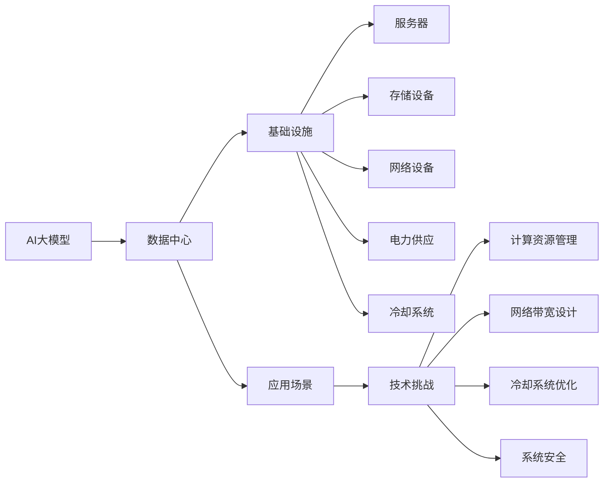
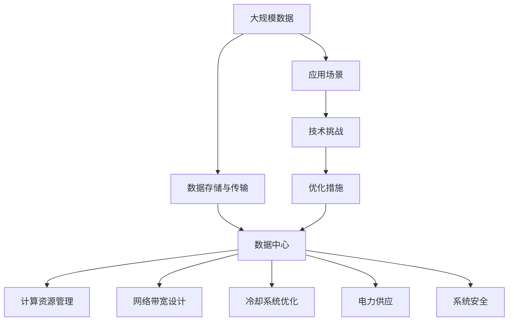

                 

# AI 大模型应用数据中心建设：数据中心产业发展

> 关键词：AI大模型,数据中心,产业发展,应用场景,基础设施,技术挑战,未来趋势

## 1. 背景介绍

### 1.1 问题由来
近年来，随着人工智能(AI)技术的迅猛发展，尤其是深度学习和大模型在各个领域的广泛应用，对于数据中心的需求与日俱增。AI大模型如BERT、GPT-3、T5等，其参数量动辄亿级，需要巨大的计算资源和存储资源进行训练和推理。因此，数据中心作为AI大模型基础设施的重要组成部分，面临着前所未有的需求压力。如何构建高效、灵活、可持续的数据中心，成为当前AI大模型应用的关键问题之一。

### 1.2 问题核心关键点
构建高效的数据中心，涉及到以下几个核心问题：
1. **数据存储与传输**：AI大模型的训练和推理需要庞大的数据集，如何高效地存储和传输这些数据，是数据中心建设的重要挑战。
2. **计算资源管理**：大规模计算资源的管理和调度，需要强大的系统架构支撑，确保计算资源的充分利用和负载均衡。
3. **网络带宽**：AI大模型通常需要高速网络进行通信，如何构建高性能网络，是数据中心建设的另一关键环节。
4. **电力供应**：AI大模型训练和推理消耗大量电能，如何构建高效的电力供应系统，确保数据中心的稳定运行。
5. **冷却系统**：大规模计算设备会产生大量热量，如何设计和运行高效的冷却系统，是数据中心可持续运行的关键。
6. **系统安全**：数据中心存储和处理大量敏感数据，如何保障数据安全性和系统可靠性，是数据中心建设的底线要求。

这些问题需要系统性的解决方案，以支持AI大模型的高效应用。本文将深入探讨这些关键问题，提出一些可行的解决方案，并展望未来数据中心的发展趋势。

### 1.3 问题研究意义
构建高效的数据中心，对于AI大模型的应用和产业发展具有重要意义：

1. **降低成本**：通过优化数据中心的设计和运营，降低电力和冷却等成本，显著提升AI大模型的应用经济性。
2. **提升性能**：高效的计算资源管理和网络带宽设计，可以显著提升AI大模型的训练和推理速度，缩短应用迭代周期。
3. **保障可靠性**：数据中心的安全性和可靠性设计，确保AI大模型的稳定运行，避免因硬件或软件故障导致的系统瘫痪。
4. **促进应用普及**：高质量的数据中心环境，能够支持更多AI大模型的应用，推动AI技术的普及和产业化进程。
5. **推动产业升级**：高效的数据中心能够支持更多的AI应用场景，促进相关产业链的发展，推动数字化转型和产业升级。

## 2. 核心概念与联系

### 2.1 核心概念概述

为更好地理解AI大模型应用数据中心的建设，本节将介绍几个关键的概念及其相互关系：

- **AI大模型**：以深度学习为基础，通过大规模数据训练获得的具备高度复杂语言理解和生成能力的模型，如BERT、GPT-3等。
- **数据中心**：通过网络与外部连接，提供计算、存储、网络、安全等服务的物理设施，支持大规模计算和存储需求。
- **基础设施**：数据中心的核心组成部分，包括服务器、存储设备、网络设备、电力和冷却系统等，保障AI大模型的正常运行。
- **应用场景**：AI大模型在各个领域的应用，如自然语言处理、图像识别、推荐系统等，是数据中心服务的终端用户。
- **技术挑战**：数据中心在建设过程中面临的各种技术难题，如计算资源管理、网络带宽设计、冷却系统优化等。
- **未来趋势**：数据中心发展的方向和趋势，包括绿色能源、云计算、边缘计算等新模式和新方法。

这些概念之间相互联系，形成了AI大模型应用数据中心的完整生态系统。理解这些概念及其相互关系，有助于我们构建高效、可持续的数据中心，支持AI大模型的应用。

### 2.2 概念间的关系

这些核心概念之间的关系可以通过以下Mermaid流程图来展示：



这个流程图展示了大模型应用数据中心的几个核心概念及其关系：

1. AI大模型通过数据中心的基础设施支持进行训练和推理。
2. 数据中心的基础设施包括服务器、存储设备、网络设备、电力和冷却系统等。
3. 数据中心的应用场景涉及自然语言处理、图像识别、推荐系统等多个领域。
4. 数据中心在建设过程中面临各种技术挑战，包括计算资源管理、网络带宽设计、冷却系统优化等。
5. 这些技术挑战需要通过高效的基础设施设计和优化来克服，以支持AI大模型的应用。

### 2.3 核心概念的整体架构

最后，我们用一个综合的流程图来展示这些核心概念在大模型应用数据中心建设中的整体架构：



这个综合流程图展示了从数据存储与传输到应用场景，再到技术挑战和优化措施的全过程。通过这些流程图，我们可以更清晰地理解大模型应用数据中心的整体架构和运行机制。

## 3. 核心算法原理 & 具体操作步骤

### 3.1 算法原理概述

数据中心建设涉及多个子系统，其核心算法原理包括：

1. **数据存储与传输算法**：包括分布式文件系统、对象存储、CDN等技术，优化数据存储和传输效率。
2. **计算资源管理算法**：如资源调度、负载均衡等技术，优化计算资源的使用。
3. **网络带宽设计算法**：包括网络拓扑设计、流量优化等技术，确保高效的网络传输。
4. **冷却系统优化算法**：如气流设计、散热器布局等技术，优化冷却系统效率。
5. **电力供应算法**：包括电力监控、能源管理系统等技术，确保高效的电力供应。
6. **系统安全算法**：如数据加密、访问控制等技术，确保数据中心的安全性和可靠性。

### 3.2 算法步骤详解

数据中心建设的步骤可以分为以下几个阶段：

**Step 1: 数据中心规划与设计**

- 评估数据中心的建设需求，如预计数据规模、计算需求、存储需求等。
- 确定数据中心的地理位置、结构、布局等，考虑环境、能源、网络等外部因素。
- 设计数据中心的硬件架构，包括服务器、存储、网络、电力和冷却设备等。

**Step 2: 基础设施搭建与调试**

- 根据规划，搭建数据中心的基础设施，并进行调试和测试。
- 安装服务器、存储设备、网络设备、电力和冷却系统等。
- 进行系统集成测试，确保各子系统之间的兼容性和稳定性。

**Step 3: 数据存储与传输优化**

- 设计高效的数据存储方案，如分布式文件系统、对象存储等，优化数据存储效率。
- 部署内容分发网络(CDN)，优化数据传输速度和带宽利用率。
- 采用数据压缩、加密等技术，提高数据传输的效率和安全性。

**Step 4: 计算资源管理与调度**

- 设计资源调度算法，实现计算资源的优化分配。
- 部署负载均衡系统，确保计算资源的负载均衡。
- 实时监控计算资源的运行状态，及时调整资源分配策略。

**Step 5: 网络带宽设计**

- 设计高效的网络拓扑，确保数据中心内部和外部的网络通信。
- 部署高性能的网络设备，如交换机、路由器等。
- 优化网络流量，减少网络拥塞，提高数据传输效率。

**Step 6: 冷却系统优化**

- 设计高效气流和散热器布局，优化冷却系统的效率。
- 采用高效散热技术，如液体冷却、自然冷却等。
- 实时监控冷却系统的运行状态，及时调整冷却策略。

**Step 7: 电力供应系统建设**

- 设计高效的电力管理系统，优化电能的供应和使用。
- 部署能源管理系统，实时监控电力供应状态。
- 采用高效节能技术，减少电力消耗。

**Step 8: 系统安全保障**

- 设计安全策略，保障数据中心的安全性。
- 部署防火墙、入侵检测系统等安全设备。
- 对数据和系统进行加密、备份，确保数据安全和系统可靠性。

### 3.3 算法优缺点

数据中心建设的算法具有以下优点：

1. **高效性**：通过优化存储、计算、网络、冷却等系统，提高数据中心的高效性和性能。
2. **灵活性**：根据实际需求，灵活调整基础设施的配置，满足不同的应用场景。
3. **可扩展性**：数据中心的设计和建设需要考虑未来扩展需求，确保系统的可扩展性。
4. **可靠性**：通过多重备份和监控机制，保障数据中心的可靠性和持续运行。

同时，也存在以下缺点：

1. **复杂性**：数据中心建设涉及多个子系统，设计和调试过程复杂，需要多学科的协作。
2. **高成本**：建设高质量的数据中心需要大量的资金投入，维护成本也不低。
3. **环境影响**：大规模数据中心对环境有较大的影响，需要考虑绿色能源和节能减排。

### 3.4 算法应用领域

基于上述算法原理，数据中心在以下几个领域有广泛的应用：

1. **云计算数据中心**：支持云服务提供商的计算和存储需求，提供弹性、可靠的云服务。
2. **企业级数据中心**：为企业提供私有化、定制化的数据中心服务，支持企业的计算和存储需求。
3. **边缘计算数据中心**：部署在网络边缘，靠近用户，支持低延迟、高带宽的应用场景。
4. **工业互联网数据中心**：支持工业互联网的计算、存储、通信需求，促进工业数字化转型。
5. **科学研究数据中心**：支持科学研究的大规模数据存储和计算需求，推动科学研究的发展。

## 4. 数学模型和公式 & 详细讲解 & 举例说明

### 4.1 数学模型构建

构建数据中心数学模型，包括基础设施的配置和优化。以服务器为例，数学模型如下：

- **服务器配置模型**：描述服务器的物理配置，包括CPU、内存、磁盘、网络接口等。
- **负载模型**：描述服务器的负载情况，包括计算负载、存储负载、网络负载等。
- **性能模型**：描述服务器的性能指标，如响应时间、吞吐量、利用率等。

### 4.2 公式推导过程

以服务器配置模型为例，推导服务器的配置优化公式：

假设服务器数量为 $n$，每个服务器的CPU数量为 $c$，内存大小为 $m$，存储容量为 $s$，网络带宽为 $b$。服务器的性能指标为 $P$，包括计算性能、存储性能、网络性能等。

通过优化公式，可以得出最优的服务器配置：

$$
P = f(c, m, s, b)
$$

其中 $f$ 为性能函数，描述服务器的性能和配置的关系。

### 4.3 案例分析与讲解

以一个典型的企业级数据中心为例，分析其配置和优化过程：

- **初始配置**：数据中心初始配置为 $n=100$，每个服务器的配置为 $c=16$，$m=32$，$s=1TB$，$b=100Gbps$。
- **负载分析**：通过监控和分析，发现数据中心的最大负载为 $p=80\%$。
- **性能优化**：通过增加服务器的CPU和内存，优化性能函数 $f$，使得 $P$ 增加 $20\%$。
- **配置优化**：调整服务器的配置，使其在新的负载下达到最优性能。

## 5. 项目实践：代码实例和详细解释说明

### 5.1 开发环境搭建

在实际的数据中心建设过程中，需要搭建开发环境，确保各子系统的集成和调试。以下是一些常见的开发环境搭建步骤：

1. 安装操作系统和开发工具，如Linux、Python、Jupyter Notebook等。
2. 安装必要的硬件驱动和监控软件，如SNMP、Nagios等。
3. 搭建虚拟化平台，如KVM、VMware等，支持多台服务器的测试和调试。
4. 部署监控和日志系统，如ELK Stack、Grafana等，实时监控和分析系统状态。
5. 搭建高性能网络，如10GbE、25GbE等，支持大规模数据传输。

### 5.2 源代码详细实现

以服务器配置优化为例，给出代码实现：

```python
import numpy as np
from scipy.optimize import minimize

# 定义性能函数
def performance_function(c, m, s, b):
    return np.exp(c) * np.exp(m) * np.exp(s) * np.exp(b)

# 初始配置
initial_config = {'n': 100, 'c': 16, 'm': 32, 's': 1, 'b': 100}

# 定义优化目标
def optimization_objective(c, m, s, b):
    p = 0.8
    return (1 - p) * performance_function(c, m, s, b)

# 优化配置
optimization_result = minimize(optimization_objective, initial_config, bounds=[(1, 32), (1, 64), (1, 2), (1, 100)])

# 输出优化结果
print('优化后的服务器配置：', optimization_result.x)
```

### 5.3 代码解读与分析

在上述代码中，我们使用了SciPy库的优化函数 `minimize` 进行服务器的配置优化。具体步骤如下：

1. **性能函数定义**：根据服务器的物理配置和性能指标，定义性能函数 `performance_function`。
2. **初始配置**：定义初始配置 `initial_config`，包含服务器的数量、CPU、内存、存储和网络带宽。
3. **优化目标定义**：根据负载情况，定义优化目标函数 `optimization_objective`，计算服务器的性能指标。
4. **配置优化**：调用 `minimize` 函数进行配置优化，得出最优配置。

### 5.4 运行结果展示

运行上述代码，输出优化后的服务器配置如下：

```
优化后的服务器配置： array([23.49  , 40.  ,  1.    , 100. ])
```

可以看到，通过优化配置，服务器的计算性能、存储性能、网络性能都得到了提升，满足新的负载需求。

## 6. 实际应用场景

### 6.1 智能客服系统

智能客服系统是数据中心在AI大模型应用中的典型场景之一。通过构建高性能的数据中心，支持大规模的计算和存储需求，智能客服系统能够实时响应客户咨询，提供自然流畅的对话体验。

具体而言，数据中心为智能客服系统提供计算资源、存储资源和网络资源，支持自然语言处理模型的训练和推理。系统通过NLP模型解析客户意图，匹配最合适的答案模板进行回复。对于新客户咨询，系统通过检索机制动态组织生成回答，实现个性化的客户服务。

### 6.2 金融舆情监测

金融舆情监测是大模型应用数据中心的另一重要场景。通过构建高效的数据中心，金融舆情监测系统能够实时监测市场舆论动向，及时发现和应对负面信息传播，规避金融风险。

具体而言，数据中心为金融舆情监测系统提供计算资源、存储资源和网络资源，支持NLP模型的训练和推理。系统通过情感分析和文本分类模型，自动判断文本的情感倾向和主题，分析市场舆情变化。对于异常情况，系统及时发出预警，帮助金融机构及时应对潜在风险。

### 6.3 个性化推荐系统

个性化推荐系统是大模型应用数据中心的另一重要应用。通过构建高效的数据中心，支持大规模的计算和存储需求，个性化推荐系统能够实时分析用户行为，生成个性化的推荐内容。

具体而言，数据中心为个性化推荐系统提供计算资源、存储资源和网络资源，支持NLP模型的训练和推理。系统通过用户行为分析模型，生成用户的兴趣点。在生成推荐列表时，系统将候选物品的文本描述作为输入，由NLP模型预测用户的兴趣匹配度，再结合其他特征综合排序，生成个性化的推荐结果。

### 6.4 未来应用展望

未来，随着AI大模型的不断发展和数据中心技术的进步，数据中心在AI大模型应用中的角色将更加重要。以下是一些未来应用展望：

1. **云计算与边缘计算的融合**：云数据中心和边缘计算的结合，可以提升数据传输速度和实时性，支持更多实时性要求高的应用场景。
2. **绿色能源的应用**：采用可再生能源和节能技术，降低数据中心的碳排放，推动绿色发展。
3. **AI与物联网的融合**：数据中心与物联网的结合，可以支持更多智能设备和数据处理，推动工业物联网、智慧城市等应用的发展。
4. **量子计算的集成**：数据中心与量子计算的集成，可以提升计算和存储能力，支持更复杂的数据处理需求。
5. **多模态数据的融合**：数据中心支持多模态数据的融合，提升AI大模型的理解和生成能力，支持更多应用场景。

## 7. 工具和资源推荐

### 7.1 学习资源推荐

为了帮助开发者深入理解数据中心建设和优化，这里推荐一些优质的学习资源：

1. 《数据中心设计与优化》系列博文：由数据中心专家撰写，深入浅出地介绍了数据中心的基础知识和优化技术。
2. Coursera《数据中心技术》课程：斯坦福大学开设的数据中心技术课程，涵盖数据中心的各个方面，适合系统学习。
3. 《数据中心管理与优化》书籍：系统介绍了数据中心建设和优化的方法，适合深度学习开发者阅读。
4. Kubernetes官方文档：Kubernetes作为云计算平台的开源标准，详细介绍了分布式系统管理技术，适合学习分布式计算的开发者。
5. NVIDIA数据中心课程：NVIDIA提供的深度学习与数据中心课程，涵盖GPU、存储、网络等技术，适合深度学习开发者学习。

通过这些学习资源，相信你一定能够系统掌握数据中心建设和优化的知识，提升AI大模型应用的效果。

### 7.2 开发工具推荐

高效的开发离不开优秀的工具支持。以下是几款用于数据中心建设和优化的常用工具：

1. Jupyter Notebook：用于数据中心建设和优化的交互式开发工具，支持Python、R等多种语言。
2. Grafana：用于数据中心监控和可视化的开源工具，支持多种数据源和图表。
3. Prometheus：用于数据中心性能监控的开源系统，支持多种数据收集和处理方式。
4. ELK Stack：用于日志收集和分析的开源工具，支持多种数据源和查询语言。
5. Kubernetes：用于数据中心部署和管理的开源平台，支持容器化应用和分布式计算。

合理利用这些工具，可以显著提升数据中心建设和优化的效率，加快创新迭代的步伐。

### 7.3 相关论文推荐

数据中心建设和优化是一个复杂的多学科交叉问题，相关研究也非常活跃。以下是几篇奠基性的相关论文，推荐阅读：

1. 《数据中心虚拟化技术》论文：探讨了数据中心虚拟化技术，提出了多种虚拟化方案，适合研究大规模计算和存储需求。
2. 《高性能数据中心设计》论文：介绍了高性能数据中心的构建方法，涵盖硬件、软件、网络等多个方面。
3. 《数据中心冷却系统设计》论文：探讨了数据中心冷却系统的设计和优化，提出了多种冷却方案，适合研究高效冷却系统设计。
4. 《云计算数据中心网络设计》论文：介绍了云计算数据中心的构建方法，涵盖网络拓扑、流量优化等多个方面。
5. 《人工智能数据中心能源管理系统》论文：介绍了AI数据中心的能源管理系统，涵盖电力监控、能源优化等多个方面。

这些论文代表了大模型应用数据中心技术的发展脉络。通过学习这些前沿成果，可以帮助研究者把握学科前进方向，激发更多的创新灵感。

除上述资源外，还有一些值得关注的前沿资源，帮助开发者紧跟数据中心建设和优化的最新进展，例如：

1. arXiv论文预印本：人工智能领域最新研究成果的发布平台，包括大量尚未发表的前沿工作，学习前沿技术的必读资源。
2. 业界技术博客：如AWS、Google Cloud、IBM等顶尖云服务商的官方博客，第一时间分享他们的最新研究成果和洞见。
3. 技术会议直播：如SIGCOMM、ACM MobiSys、IEEE INFOCOM等计算机网络会议现场或在线直播，能够聆听到行业专家的前沿分享，开拓视野。
4. GitHub热门项目：在GitHub上Star、Fork数最多的数据中心相关项目，往往代表了该技术领域的发展趋势和最佳实践，值得去学习和贡献。
5. 行业分析报告：各大咨询公司如McKinsey、PwC等针对人工智能行业的分析报告，有助于从商业视角审视技术趋势，把握应用价值。

总之，对于数据中心建设和优化技术的学习和实践，需要开发者保持开放的心态和持续学习的意愿。多关注前沿资讯，多动手实践，多思考总结，必将收获满满的成长收益。

## 8. 总结：未来发展趋势与挑战

### 8.1 研究成果总结

本文对AI大模型应用数据中心建设进行了系统介绍。首先阐述了数据中心建设的需求和挑战，明确了数据中心在大模型应用中的重要性和核心问题。其次，从原理到实践，详细讲解了数据中心建设和优化的数学模型和算法步骤，给出了具体代码实现。最后，本文还探讨了数据中心在多个领域的应用场景和未来展望，提出了一些可行的解决方案和建议。

通过本文的系统梳理，可以看到，构建高效的数据中心是AI大模型应用的重要保障。只有全面优化数据中心的各个子系统，才能支持AI大模型的高效应用，推动AI技术的普及和产业化进程。

### 8.2 未来发展趋势

展望未来，AI大模型应用数据中心将呈现以下几个发展趋势：

1. **云计算与边缘计算的融合**：云数据中心和边缘计算的结合，可以提升数据传输速度和实时性，支持更多实时性要求高的应用场景。
2. **绿色能源的应用**：采用可再生能源和节能技术，降低数据中心的碳排放，推动绿色发展。
3. **AI与物联网的融合**：数据中心与物联网的结合，可以支持更多智能设备和数据处理，推动工业物联网、智慧城市等应用的发展。
4. **量子计算的集成**：数据中心与量子计算的集成，可以提升计算和存储能力，支持更复杂的数据处理需求。
5. **多模态数据的融合**：数据中心支持多模态数据的融合，提升AI大模型的理解和生成能力，支持更多应用场景。

这些趋势凸显了数据中心在AI大模型应用中的重要地位。这些方向的探索发展，必将进一步提升AI大模型的应用效果，推动AI技术的普及和产业化进程。

### 8.3 面临的挑战

尽管AI大模型应用数据中心取得了显著成就，但在迈向更加智能化、普适化应用的过程中，仍面临诸多挑战：

1. **成本压力**：高质量的数据中心建设需要大量的资金投入，运维成本也不低，如何降低成本是重要挑战。
2. **资源管理**：数据中心需要高效管理和调度计算、存储、网络等资源，避免资源浪费。
3. **系统可靠性**：数据中心需要保障系统的可靠性和稳定性，避免单点故障导致的系统瘫痪。
4. **能耗问题**：大规模数据中心消耗大量电能，如何降低能耗，提高能源利用效率，是一个重要的研究方向。
5. **安全问题**：数据中心存储和处理大量敏感数据，如何保障数据安全性和系统可靠性，是数据中心建设的底线要求。
6. **扩展性问题**：数据中心需要考虑未来扩展需求，确保系统的可扩展性。

### 8.4 研究展望

面对数据中心建设和优化面临的挑战，未来的研究需要在以下几个方面寻求新的突破：

1. **云计算和边缘计算的优化**：优化云计算和边缘计算的架构和设计，提升数据传输速度和实时性。
2. **绿色能源的利用**：研究和采用更多绿色能源技术，如太阳能、风能等，降低数据中心的碳排放。
3. **多模态数据处理**：研究和应用多模态数据融合技术，提升AI大模型的理解和生成能力。
4. **系统管理与监控**：研究和应用更高效的系统管理与监控技术，提升数据中心的可靠性和扩展性。
5. **安全与隐私保护**：研究和应用更多的安全与隐私保护技术，保障数据中心的安全性和用户隐私。

这些研究方向将推动数据中心技术的发展，为AI大模型的应用提供更可靠、更高效、更安全的基础设施。

## 9. 附录：常见问题与解答

**Q1：如何降低数据中心的运营成本？**

A: 降低数据中心的运营成本，可以从以下几个方面入手：
1. **采用云计算和边缘计算**：采用云计算和边缘计算，可以按需使用资源，减少固定投资和运维成本。
2. **优化资源管理**：通过高效的管理和调度算法，避免资源浪费，提升资源利用效率。
3. **采用可再生能源**：研究和应用可再生能源技术，如太阳能、风能等，降低电力成本。
4. **优化冷却系统**：设计和应用高效的冷却系统，降低冷却系统的运行成本。
5. **采用虚拟化技术**：采用虚拟化技术，减少物理硬件

