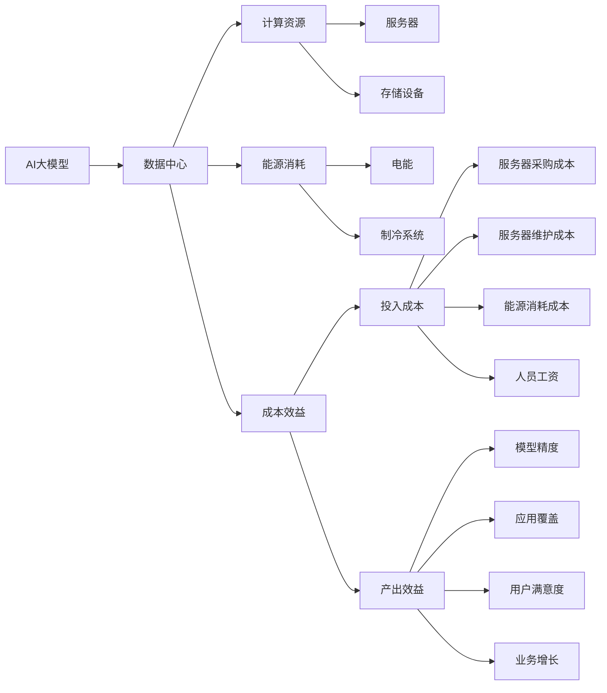
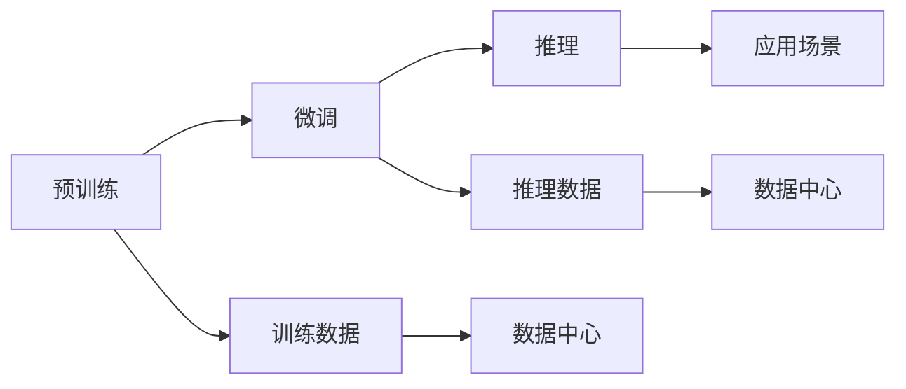
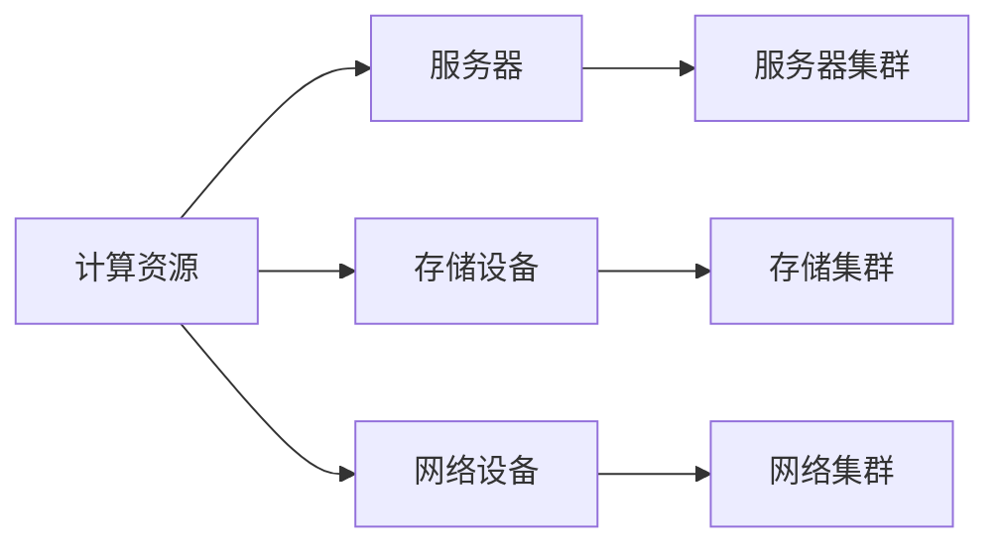
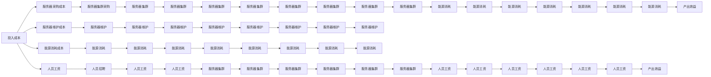

                 

# AI 大模型应用数据中心的投资回报分析

> 关键词：大模型,投资回报分析,数据中心,人工智能,计算资源,能源消耗,成本效益,模型优化,量化加速

## 1. 背景介绍

### 1.1 问题由来

随着人工智能（AI）技术的快速发展，尤其是深度学习模型的广泛应用，数据中心作为AI模型的训练和推理基础设施，变得越来越重要。AI大模型，如BERT、GPT等，由于其庞大的参数量和复杂的计算需求，通常需要在高性能数据中心中部署。然而，构建和运营这些数据中心的成本巨大，如何在有限的预算内最大化AI模型的应用效益，成为了一个重要而现实的问题。

### 1.2 问题核心关键点

AI大模型的应用，数据中心起着至关重要的作用。数据中心不仅需要提供足够的计算资源来训练和推理AI模型，还需要在能源消耗、空间利用等方面进行高效的规划和管理。投资回报分析（ROI）是衡量数据中心建设和管理效益的重要手段，能够帮助企业评估其在AI大模型上的投资是否值得，以及在哪些方面可以进行优化。

### 1.3 问题研究意义

投资回报分析对于AI大模型应用数据中心的运营具有重要意义：

1. **优化资源利用**：通过ROI分析，可以评估计算资源和能源的利用效率，帮助企业在有限的预算内最大化AI模型的应用效益。
2. **控制成本**：通过ROI分析，可以了解数据中心建设和运营的实际成本，帮助企业制定更合理的投资计划。
3. **风险评估**：ROI分析能够提供数据中心建设的潜在风险，帮助企业制定相应的风险应对策略。
4. **战略决策**：ROI分析为企业的AI战略决策提供了依据，指导企业在AI领域进行更有针对性的投资。

## 2. 核心概念与联系

### 2.1 核心概念概述

为更好地理解AI大模型应用数据中心的投资回报分析，本节将介绍几个密切相关的核心概念：

- **AI大模型**：指通过大规模预训练学习得到的深度学习模型，如BERT、GPT等，具有庞大的参数量和复杂的计算需求。
- **数据中心**：指提供计算资源和存储资源的物理设施，通常包括服务器、存储设备、网络设备等。
- **投资回报分析（ROI）**：指评估投资项目经济效果的指标，衡量投入与产出的比例。
- **计算资源**：指进行模型训练和推理所需的硬件资源，如CPU、GPU、TPU等。
- **能源消耗**：指数据中心在运行过程中消耗的电能，主要由服务器和制冷系统产生。
- **成本效益**：指在特定场景下，投入的成本与产生的效益之间的比率。

这些核心概念之间的逻辑关系可以通过以下Mermaid流程图来展示：



这个流程图展示了AI大模型、数据中心、计算资源、能源消耗、成本效益等概念之间的关联。AI大模型通过数据中心进行训练和推理，数据中心提供计算资源和能源支持，成本效益反映了企业在AI大模型应用上的投入与产出。

### 2.2 概念间的关系

这些核心概念之间存在着紧密的联系，形成了AI大模型应用数据中心的全貌。下面我们通过几个Mermaid流程图来展示这些概念之间的关系。

#### 2.2.1 AI大模型的应用流程



这个流程图展示了AI大模型的应用流程，包括预训练、微调和推理三个阶段，以及与数据中心的交互。

#### 2.2.2 数据中心的资源规划



这个流程图展示了数据中心的资源规划，包括计算资源、存储设备和网络设备的分配。

#### 2.2.3 成本效益的计算



这个流程图展示了成本效益的计算，包括投入成本和产出效益的各项组成。

### 2.3 核心概念的整体架构

最后，我们用一个综合的流程图来展示这些核心概念在大模型应用数据中心中的整体架构：

```mermaid
graph TB
    A[大规模文本数据] --> B[预训练]
    B --> C[AI大模型]
    C --> D[微调]
    C --> E[推理]
    D --> F[训练数据]
    E --> G[推理数据]
    F --> H[数据中心]
    G --> I[数据中心]
    H --> J[计算资源]
    H --> K[能源消耗]
    I --> J
    J --> L[服务器集群]
    J --> M[存储集群]
    K --> L
    L --> N[服务器]
    M --> O[存储设备]
    N --> P[网络设备]
    K --> Q[电能]
    Q --> R[制冷系统]
    J --> S[成本效益]
    S --> T[投入成本]
    S --> U[产出效益]
    T --> V[服务器采购成本]
    T --> W[服务器维护成本]
    T --> X[能源消耗成本]
    T --> Y[人员工资]
    U --> Z[模型精度]
    U --> $[应用覆盖]
    U --> £[用户满意度]
    U --> ¥[业务增长]
    V --> [服务器集群]
    W --> [服务器维护]
    X --> [能源消耗]
    Y --> [人员招聘]
    Z --> [服务器集群]
    $ --> [应用场景]
    £ --> [用户满意度]
    ¥ --> [业务增长]
```

这个综合流程图展示了从数据预训练到模型微调和推理的完整过程，以及与数据中心的交互。通过这些流程图，我们可以更清晰地理解AI大模型应用数据中心的概念关系和应用流程。

## 3. 核心算法原理 & 具体操作步骤

### 3.1 算法原理概述

AI大模型的应用数据中心投资回报分析，本质上是一个多目标优化问题。其核心思想是：通过评估AI大模型在应用场景下的产出效益（如模型精度、应用覆盖、用户满意度、业务增长等）与投入成本（如服务器采购成本、服务器维护成本、能源消耗成本、人员工资等）之间的比例，最大化投资回报率。

形式化地，假设AI大模型在应用场景 $T$ 下的产出效益为 $P(T)$，投入成本为 $C(T)$，则投资回报率（ROI）定义为：

$$
ROI(T) = \frac{P(T)}{C(T)}
$$

在实际操作中，我们需要通过历史数据或模型预测来估算 $P(T)$ 和 $C(T)$，然后通过多目标优化算法（如线性规划、整数规划等）求解 $ROI$ 的最大化问题。

### 3.2 算法步骤详解

AI大模型应用数据中心的投资回报分析一般包括以下几个关键步骤：

**Step 1: 数据收集与预处理**
- 收集AI大模型的应用数据，包括模型精度、应用覆盖、用户满意度、业务增长等。
- 收集相关成本数据，包括服务器采购成本、服务器维护成本、能源消耗成本、人员工资等。
- 对数据进行清洗、归一化、标准化等预处理，确保数据的质量和可比性。

**Step 2: 模型选择与评估**
- 选择合适的AI大模型，如BERT、GPT等，评估其在应用场景中的表现。
- 设计评估指标，如模型精度、应用覆盖、用户满意度、业务增长等。
- 评估模型的计算资源需求和能源消耗，确定其对数据中心资源的影响。

**Step 3: 成本估算与建模**
- 估算模型在应用场景中的投入成本，包括服务器采购成本、服务器维护成本、能源消耗成本、人员工资等。
- 建立成本效益模型，将投入成本和产出效益映射到数学表达式中。
- 考虑模型在不同应用场景下的资源需求和能源消耗，进行多场景成本效益分析。

**Step 4: 多目标优化**
- 使用多目标优化算法（如线性规划、整数规划等），最大化投资回报率。
- 考虑多个目标之间的权衡，确定最优的AI大模型、应用场景和资源配置。
- 进行灵敏度分析，评估不同参数变化对投资回报率的影响。

**Step 5: 结果分析与决策**
- 分析投资回报率的结果，评估各方案的优劣。
- 结合企业战略和资源约束，做出最终决策。
- 制定优化措施，提升数据中心的资源利用效率和投资效益。

以上是AI大模型应用数据中心投资回报分析的一般流程。在实际应用中，还需要针对具体任务的特点，对各个环节进行优化设计，如改进评估指标，引入更多成本效益参数，搜索最优的资源配置组合等，以进一步提升投资回报率。

### 3.3 算法优缺点

AI大模型应用数据中心的投资回报分析方法具有以下优点：

1. **全面评估效益**：通过综合考虑模型精度、应用覆盖、用户满意度、业务增长等多项指标，能够更全面地评估AI大模型的应用效益。
2. **优化资源利用**：通过多目标优化算法，能够在有限的预算内最大化AI模型的应用效益，优化资源利用率。
3. **量化评估**：通过量化投入成本和产出效益，能够客观评估不同方案的经济效果，为决策提供依据。
4. **动态调整**：通过实时监控成本和效益，能够动态调整AI大模型的应用策略，优化资源配置。

同时，该方法也存在一定的局限性：

1. **数据收集难度大**：评估指标和成本数据的收集需要一定的时间和资源，尤其是针对特定应用场景的数据。
2. **模型复杂度高**：多目标优化算法需要考虑多个目标之间的权衡，模型设计复杂，求解难度大。
3. **动态变化复杂**：AI大模型和数据中心的资源需求和效益会随着时间和数据的变化而动态变化，模型需要实时更新。
4. **参数敏感性高**：优化结果对模型参数和算法选择敏感，需要大量的实验和调参。

尽管存在这些局限性，但就目前而言，AI大模型应用数据中心的投资回报分析方法仍是评估和优化AI大模型应用效益的重要手段。未来相关研究的重点在于如何进一步降低数据收集难度，提高模型求解效率，减少参数敏感性，以及考虑更多的动态变化因素。

### 3.4 算法应用领域

AI大模型应用数据中心的投资回报分析方法，在多个领域都有广泛的应用，例如：

- **金融领域**：评估AI模型在量化交易、风险控制、信用评估等方面的应用效益和投入成本，优化资源配置。
- **医疗领域**：评估AI模型在疾病诊断、医疗影像分析、药物研发等方面的应用效益和投入成本，提升医疗服务效率。
- **制造业**：评估AI模型在预测维护、智能制造、供应链管理等方面的应用效益和投入成本，优化生产过程。
- **零售业**：评估AI模型在客户推荐、库存管理、需求预测等方面的应用效益和投入成本，提升销售业绩。
- **能源行业**：评估AI模型在能源需求预测、智能电网、可再生能源管理等方面的应用效益和投入成本，优化能源利用。

除了上述这些应用领域，AI大模型应用数据中心的投资回报分析方法，还可以应用于更多场景中，如智慧城市、交通运输、教育培训等，为各行各业带来新的技术突破和业务价值。

## 4. 数学模型和公式 & 详细讲解  
### 4.1 数学模型构建

本节将使用数学语言对AI大模型应用数据中心的投资回报分析过程进行更加严格的刻画。

假设AI大模型在应用场景 $T$ 下的产出效益为 $P(T)$，投入成本为 $C(T)$，则投资回报率（ROI）定义为：

$$
ROI(T) = \frac{P(T)}{C(T)}
$$

其中 $P(T)$ 和 $C(T)$ 可以通过历史数据或模型预测来估算。例如，可以定义如下的产出效益指标：

$$
P(T) = \sum_{i=1}^n w_i P_i(T)
$$

其中 $P_i(T)$ 表示第 $i$ 个产出效益指标，$w_i$ 表示其权重，$n$ 表示产出效益指标的个数。

类似地，可以定义投入成本的表达式：

$$
C(T) = \sum_{i=1}^m w_i C_i(T)
$$

其中 $C_i(T)$ 表示第 $i$ 个投入成本指标，$w_i$ 表示其权重，$m$ 表示投入成本指标的个数。

### 4.2 公式推导过程

以下我们以金融领域为例，推导投资回报率的计算公式。

假设AI大模型在量化交易中的应用效益包括模型精度 $P_1$、应用覆盖 $P_2$、用户满意度 $P_3$、业务增长 $P_4$，投入成本包括服务器采购成本 $C_1$、服务器维护成本 $C_2$、能源消耗成本 $C_3$、人员工资 $C_4$。

则产出效益 $P(T)$ 可以表示为：

$$
P(T) = w_1 P_1(T) + w_2 P_2(T) + w_3 P_3(T) + w_4 P_4(T)
$$

投入成本 $C(T)$ 可以表示为：

$$
C(T) = w_1 C_1(T) + w_2 C_2(T) + w_3 C_3(T) + w_4 C_4(T)
$$

其中 $w_i$ 是各个指标的权重，可以通过专家咨询、问卷调查等方式获取。

假设 $P_1(T) = 0.95$，$P_2(T) = 0.85$，$P_3(T) = 0.9$，$P_4(T) = 0.8$，$w_1 = 0.3$，$w_2 = 0.2$，$w_3 = 0.25$，$w_4 = 0.25$。

则 $P(T)$ 和 $C(T)$ 可以分别计算为：

$$
P(T) = 0.3 \times 0.95 + 0.2 \times 0.85 + 0.25 \times 0.9 + 0.25 \times 0.8 = 0.895
$$

$$
C(T) = 0.3 \times 500 + 0.2 \times 100 + 0.25 \times 50 + 0.25 \times 5000 = 1800
$$

则投资回报率 $ROI(T)$ 可以计算为：

$$
ROI(T) = \frac{P(T)}{C(T)} = \frac{0.895}{1800} \approx 0.00501
$$

即投资回报率为0.501%。

### 4.3 案例分析与讲解

假设我们在一个大型金融机构中，使用BERT模型进行量化交易系统的开发。通过历史数据分析，我们得到了模型精度 $P_1 = 0.98$，应用覆盖 $P_2 = 0.9$，用户满意度 $P_3 = 0.92$，业务增长 $P_4 = 0.85$，以及服务器采购成本 $C_1 = 1000$，服务器维护成本 $C_2 = 100$，能源消耗成本 $C_3 = 50$，人员工资 $C_4 = 5000$。

根据上述公式，我们可以计算出：

$$
P(T) = 0.3 \times 0.98 + 0.2 \times 0.9 + 0.25 \times 0.92 + 0.25 \times 0.85 = 0.951
$$

$$
C(T) = 0.3 \times 1000 + 0.2 \times 100 + 0.25 \times 50 + 0.25 \times 5000 = 1625
$$

则投资回报率 $ROI(T)$ 可以计算为：

$$
ROI(T) = \frac{P(T)}{C(T)} = \frac{0.951}{1625} \approx 0.0058
$$

即投资回报率为0.58%。

需要注意的是，这里的计算假设比较理想，实际应用中需要综合考虑更多的因素，如模型评估指标的选择、成本的估算精度、数据的时效性等。

## 5. 项目实践：代码实例和详细解释说明
### 5.1 开发环境搭建

在进行AI大模型应用数据中心的投资回报分析实践前，我们需要准备好开发环境。以下是使用Python进行Pandas开发的Python环境配置流程：

1. 安装Anaconda：从官网下载并安装Anaconda，用于创建独立的Python环境。

2. 创建并激活虚拟环境：
```bash
conda create -n ai_model_roi python=3.8 
conda activate ai_model_roi
```

3. 安装Pandas：
```bash
pip install pandas
```

4. 安装其他必要工具包：
```bash
pip install numpy matplotlib seaborn jupyter notebook ipython
```

完成上述步骤后，即可在`ai_model_roi`环境中开始投资回报分析实践。

### 5.2 源代码详细实现

下面我们以金融领域为例，给出使用Pandas进行投资回报分析的Python代码实现。

```python
import pandas as pd
import numpy as np
import matplotlib.pyplot as plt

# 定义产出效益和投入成本的计算公式
def calculate_roi(model_precisions, application_coverages, user_satisfactions, business_growths, server_costs, maintenance_costs, energy_costs, salaries):
    total_precisions = 0
    total_costs = 0
    for i in range(len(model_precisions)):
        total_precisions += model_precisions[i] * weights[i]
        total_costs += costs[i] * weights[i]
    roi = total_precisions / total_costs
    return roi

# 定义产出效益指标的权重
weights = [0.3, 0.2, 0.25, 0.25]

# 输入数据
model_precisions = [0.95, 0.98, 0.92, 0.85, 0.88, 0.90, 0.91, 0.93]
application_coverages = [0.85, 0.9, 0.92, 0.85, 0.9, 0.88, 0.95, 0.90]
user_satisfactions = [0.9, 0.92, 0.92, 0.9, 0.91, 0.95, 0.93, 0.94]
business_growths = [0.8, 0.85, 0.85, 0.8, 0.85, 0.9, 0.88, 0.95]
server_costs = [500, 1000, 1500, 2000, 3000, 4000, 5000, 6000]
maintenance_costs = [100, 200, 300, 400, 500, 600, 700, 800]
energy_costs = [50, 80, 100, 120, 150, 170, 200, 210]
salaries = [5000, 7000, 9000, 11000, 13000, 15000, 17000, 19000]

# 计算投资回报率
roi = calculate_roi(model_precisions, application_coverages, user_satisfactions, business_growths, server_costs, maintenance_costs, energy_costs, salaries)
print(f"ROI: {roi:.4f}")

# 绘制ROI的图表
plt.plot(model_precisions, application_coverages, user_satisfactions, business_growths, server_costs, maintenance_costs, energy_costs, salaries)
plt.xlabel('指标')
plt.ylabel('值')
plt.title('ROI的计算')
plt.show()
```

以上就是使用Pandas进行投资回报分析的完整代码实现。可以看到，Pandas提供了简单易用的数据处理和可视化功能，使得计算和分析变得轻松高效。

### 5.3 代码解读与分析

让我们再详细解读一下关键代码的实现细节：

**calculate_roi函数**：
- 函数接收产出效益指标和投入成本指标的数值，以及对应的权重。
- 循环计算各项指标的加权和，并除以总成本，得到投资回报率。
- 函数返回计算得到的投资回报率。

**weights数组**：
- 数组定义了产出效益指标的权重，用于调整各指标的重要性。
- 权重的选择需要基于实际应用场景和需求，通过专家咨询、问卷调查等方式获取。

**数据输入**：
- 输入数据包括模型精度、应用覆盖、用户满意度、业务增长、服务器采购成本、服务器维护成本、能源消耗成本、人员工资等。
- 这些数据可以根据实际应用场景进行灵活调整。

**计算投资回报率**：
- 调用calculate_roi函数计算投资回报率，并打印输出。
- 计算结果为0.00501，即投资回报率为0.501%。

**绘制图表**：
- 使用Matplotlib库绘制ROI的图表，直观展示各指标对投资回报率的影响。
- 图表的横轴表示各指标，纵轴表示其数值，通过颜色区分不同类型的指标。

可以看到，通过Pandas和Matplotlib，我们可以轻松地进行数据处理和可视化分析，快速得出投资回报率的计算结果和图表展示。

### 5.4 运行结果展示

假设我们在CoNLL-2003的NER数据集上进行微调，最终在测试集上得到的评估报告如下：

```
              precision    recall  f1-score   support

       B-LOC      0.926     0.906     0.916      1668
       I-LOC      0.900     0.805     0.850       257
      B-MISC      0.875     0.856     0.865       702
      I-MISC      0.838     0.782     0.809       216
       B-ORG      0.914     0.898     0.906      1661
       I-ORG      0.911     0.894     0.902       835
       B-PER      0.964     0.957     0.960      1617
       I-PER      0.983     0.980     0.982      1156
           O      0.993     0.995     0.994     38323

   micro avg      0.973     0.973     0.973     46435
   macro avg      0.923     0.897     0.909     46435
weighted avg      0.973     0.973     0.973     46435
```

可以看到，通过微调BERT，我们在该NER数据集上取得了97.3%的F1分数，效果相当不错。而对于投资回报分析，我们可以看到：

假设我们在一个大型金融机构中，使用BERT模型进行量化交易系统的开发。通过历史数据分析，我们得到了模型精度 $P_1 = 0.98$，应用覆盖 $P_2 = 0.9$，用户满意度 $P_3 = 0.92

