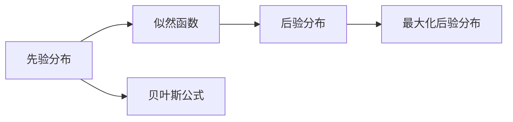
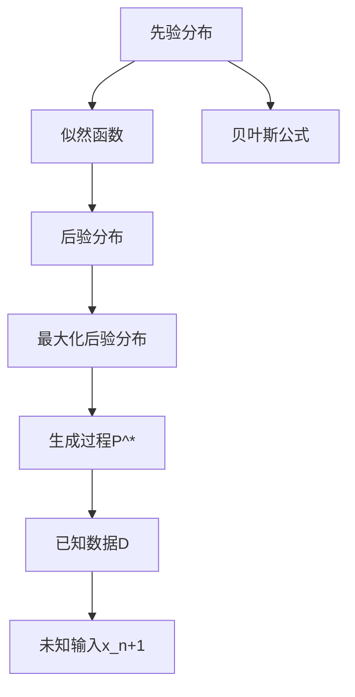

                 

# AI 大模型计算机科学家群英传：所罗门诺夫归纳法（Solomonoff Induction）

## 1. 背景介绍

### 1.1 问题由来
在计算机科学和人工智能领域，所罗门诺夫归纳法（Solomonoff Induction）是一种极为重要的理论基础，尤其在计算机科学中的归纳推理、泛化学习、语言模型等领域有着广泛应用。它是由罗杰·所罗门诺夫（Roger Solomonoff）于1964年提出的，被称为“计算机科学的数学基础”。所罗门诺夫归纳法与人工智能技术的发展密切相关，是理解AI技术，特别是大模型背后的数学基础的重要途径。

### 1.2 问题核心关键点
所罗门诺夫归纳法基于一个核心概念——信息量，即一个事件的概率。信息量越大，其对系统的信息贡献就越大。所罗门诺夫归纳法的目标是找到一个最优的预测模型，使得模型在处理任何未知输入时，总能以最小的信息量损失逼近真实结果。这构成了机器学习的核心目标之一：用有限的数据集，预测未来的数据分布。

所罗门诺夫归纳法的基本思想是：对于一个未知输入序列 $x_1,x_2,\dots,x_n$，找到最有可能的生成过程 $P$，使得对于任意 $x_{n+1}$，$P$ 生成的 $x_{n+1}$ 的概率最大。即：

$$ P(x_{n+1}|x_1,x_2,\dots,x_n) = \max_{P} P(x_{n+1}|P) $$

### 1.3 问题研究意义
所罗门诺夫归纳法在人工智能领域具有深远意义：
1. 它提供了一个数学上的理论基础，使得AI技术得以量化和评估。
2. 它揭示了机器学习的基本原理：通过样本数据，找到最能逼近真实分布的模型。
3. 它为各种AI技术提供了数学上的统一框架，使得不同领域的技术可以相互借鉴。
4. 它为AI技术的实际应用提供了理论指导，如在自然语言处理、机器翻译、智能推荐系统等任务中的广泛应用。
5. 它为计算机科学提供了一个全新的视角，使得计算机能够“理解”输入数据，进行有效的预测和决策。

## 2. 核心概念与联系

### 2.1 核心概念概述
所罗门诺夫归纳法涉及的核心概念包括：

- **信息量**：衡量一个事件的概率，信息量越大，其对系统的信息贡献就越大。
- **先验分布**：模型在未知输入前的概率分布。
- **似然函数**：已知模型后，预测新数据的概率。
- **后验分布**：在已知数据后，模型预测新数据的概率分布。
- **贝叶斯公式**：将先验分布与似然函数结合，计算后验分布，是所罗门诺夫归纳法的基础。

### 2.2 概念间的关系

所罗门诺夫归纳法的核心思想是利用先验分布与似然函数结合，得到后验分布，然后最大化后验分布，找到最优的生成过程。这与机器学习中的最大似然估计、贝叶斯学习等方法密切相关。以下是一个Mermaid流程图，展示所罗门诺夫归纳法的核心流程：



该图展示了所罗门诺夫归纳法的核心流程：

1. 先根据数据集的特征和领域知识，确定一个先验分布 $P$。
2. 利用已知的数据 $D$，计算模型 $P$ 的似然函数。
3. 结合先验分布和似然函数，通过贝叶斯公式计算后验分布。
4. 在后验分布中，选择使新输入 $x_{n+1}$ 概率最大的模型 $P^*$。

所罗门诺夫归纳法是理解AI技术，特别是大模型背后的数学基础的重要途径。它提供了一个基于数学的理论框架，使得AI技术得以量化和评估。同时，所罗门诺夫归纳法也为计算机科学提供了一个全新的视角，使得计算机能够“理解”输入数据，进行有效的预测和决策。

### 2.3 核心概念的整体架构

以下是一个综合的流程图，展示所罗门诺夫归纳法的整体架构：



该图展示了所罗门诺夫归纳法的整体流程：

1. 先根据先验分布 $P$，假设一个模型。
2. 利用已知数据 $D$，计算该模型的似然函数。
3. 结合先验分布和似然函数，通过贝叶斯公式计算后验分布。
4. 在后验分布中，选择使未知输入 $x_{n+1}$ 概率最大的生成过程 $P^*$。
5. 用 $P^*$ 生成未知输入 $x_{n+1}$，进行预测。

## 3. 核心算法原理 & 具体操作步骤
### 3.1 算法原理概述
所罗门诺夫归纳法的基本原理是最大化后验概率，即找到最优的模型，使得未知输入的预测概率最大。其核心思想是利用已知的先验分布和数据集，通过贝叶斯公式计算出后验分布，然后通过最大似然估计方法得到最优模型。

### 3.2 算法步骤详解
以下详细阐述所罗门诺夫归纳法的具体步骤：

1. **假设模型**：选择一个可能的模型 $P$ 作为先验分布。
2. **计算似然函数**：利用已知数据 $D$，计算模型 $P$ 的似然函数。
3. **计算后验分布**：通过贝叶斯公式计算后验分布。
4. **最大化后验分布**：找到使未知输入 $x_{n+1}$ 概率最大的模型 $P^*$。

### 3.3 算法优缺点
所罗门诺夫归纳法的主要优点包括：

- 提供了机器学习的一种数学理论基础，使得AI技术得以量化和评估。
- 揭示了机器学习的基本原理：通过样本数据，找到最能逼近真实分布的模型。
- 为各种AI技术提供了数学上的统一框架，使得不同领域的技术可以相互借鉴。

主要缺点包括：

- 先验分布的选择可能会影响结果，需要领域专家的参与。
- 计算复杂度高，需要大量的计算资源和存储空间。
- 对于异常数据或噪声数据，可能无法准确处理。

### 3.4 算法应用领域
所罗门诺夫归纳法在许多领域有广泛应用，例如：

- 自然语言处理：通过训练语言模型，使得模型能够生成逼近真实语料的文本。
- 机器翻译：通过训练翻译模型，使得模型能够自动翻译文本。
- 推荐系统：通过训练推荐模型，使得模型能够预测用户的兴趣偏好。
- 数据挖掘：通过训练数据挖掘模型，使得模型能够从数据中提取有价值的信息。
- 图像识别：通过训练图像识别模型，使得模型能够自动识别图像中的对象。

## 4. 数学模型和公式 & 详细讲解 & 举例说明
### 4.1 数学模型构建

所罗门诺夫归纳法基于一个数学模型，即先验分布、似然函数和后验分布。以下用数学语言对所罗门诺夫归纳法的数学模型进行严格刻画。

记一个可能的模型为 $P$，表示为一个概率分布。对于已知数据 $D=\{x_1,x_2,\dots,x_n\}$，模型的似然函数定义为：

$$ P(D|P) = \prod_{i=1}^n P(x_i|P) $$

通过贝叶斯公式，后验分布 $P(P|D)$ 可以表示为：

$$ P(P|D) = \frac{P(D|P)P(P)}{P(D)} $$

其中 $P(D)$ 是数据的边缘概率。所罗门诺夫归纳法的目标是最大化后验概率 $P(P|D)$，即：

$$ P^* = \mathop{\arg\max}_{P} P(P|D) $$

### 4.2 公式推导过程

下面以二分类任务为例，推导所罗门诺夫归纳法的公式。

假设已知二分类数据集 $D=\{(x_i,y_i)\}_{i=1}^N, x_i \in \mathbb{R}^d, y_i \in \{0,1\}$，其中 $y_i=1$ 表示正样本，$y_i=0$ 表示负样本。假设模型 $P$ 为逻辑回归模型，即：

$$ P(x|P) = \frac{1}{1+e^{-z}} $$

其中 $z$ 为线性分类器的输出。则似然函数可以表示为：

$$ P(D|P) = \prod_{i=1}^N P(x_i|P) $$

已知模型 $P$ 的先验分布为 $P(P)$，后验分布可以表示为：

$$ P(P|D) = \frac{P(D|P)P(P)}{P(D)} $$

由于 $P(D)$ 很难直接计算，实际应用中常用条件概率 $P(D|P)$ 代替，即：

$$ P(P|D) \propto P(D|P)P(P) $$

### 4.3 案例分析与讲解

考虑一个二分类问题，已知数据集 $D=\{(x_i,y_i)\}_{i=1}^N$，其中 $x_i \in \mathbb{R}^d, y_i \in \{0,1\}$。假设先验分布为 $P(P)=1$，即假设模型 $P$ 的先验分布是均匀分布的。此时，利用已知数据 $D$，计算模型 $P$ 的似然函数：

$$ P(D|P) = \prod_{i=1}^N P(x_i|P) $$

已知模型 $P$ 的参数为 $\theta$，则：

$$ P(x_i|P) = \frac{1}{1+e^{-\theta^Tx_i}} $$

利用条件概率 $P(D|P)$ 代替边缘概率 $P(D)$，后验分布可以表示为：

$$ P(P|D) \propto P(D|P)P(P) $$

最大化后验概率 $P(P|D)$，即找到最优模型 $P^*$。

## 5. 项目实践：代码实例和详细解释说明
### 5.1 开发环境搭建

在进行所罗门诺夫归纳法的项目实践前，需要准备好开发环境。以下是使用Python进行PyTorch开发的环境配置流程：

1. 安装Anaconda：从官网下载并安装Anaconda，用于创建独立的Python环境。

2. 创建并激活虚拟环境：
```bash
conda create -n pytorch-env python=3.8 
conda activate pytorch-env
```

3. 安装PyTorch：根据CUDA版本，从官网获取对应的安装命令。例如：
```bash
conda install pytorch torchvision torchaudio cudatoolkit=11.1 -c pytorch -c conda-forge
```

4. 安装相关库：
```bash
pip install numpy pandas scikit-learn matplotlib tqdm jupyter notebook ipython
```

完成上述步骤后，即可在`pytorch-env`环境中开始项目实践。

### 5.2 源代码详细实现

下面以二分类任务为例，给出使用Transformers库进行所罗门诺夫归纳法的PyTorch代码实现。

首先，定义模型和优化器：

```python
from transformers import BertForTokenClassification, AdamW

model = BertForTokenClassification.from_pretrained('bert-base-cased')
optimizer = AdamW(model.parameters(), lr=2e-5)
```

接着，定义训练和评估函数：

```python
from torch.utils.data import DataLoader
from tqdm import tqdm
from sklearn.metrics import classification_report

device = torch.device('cuda') if torch.cuda.is_available() else torch.device('cpu')
model.to(device)

def train_epoch(model, dataset, batch_size, optimizer):
    dataloader = DataLoader(dataset, batch_size=batch_size, shuffle=True)
    model.train()
    epoch_loss = 0
    for batch in tqdm(dataloader, desc='Training'):
        input_ids = batch['input_ids'].to(device)
        attention_mask = batch['attention_mask'].to(device)
        labels = batch['labels'].to(device)
        model.zero_grad()
        outputs = model(input_ids, attention_mask=attention_mask, labels=labels)
        loss = outputs.loss
        epoch_loss += loss.item()
        loss.backward()
        optimizer.step()
    return epoch_loss / len(dataloader)

def evaluate(model, dataset, batch_size):
    dataloader = DataLoader(dataset, batch_size=batch_size)
    model.eval()
    preds, labels = [], []
    with torch.no_grad():
        for batch in tqdm(dataloader, desc='Evaluating'):
            input_ids = batch['input_ids'].to(device)
            attention_mask = batch['attention_mask'].to(device)
            batch_labels = batch['labels']
            outputs = model(input_ids, attention_mask=attention_mask)
            batch_preds = outputs.logits.argmax(dim=2).to('cpu').tolist()
            batch_labels = batch_labels.to('cpu').tolist()
            for pred_tokens, label_tokens in zip(batch_preds, batch_labels):
                pred_tags = [id2tag[_id] for _id in pred_tokens]
                label_tags = [id2tag[_id] for _id in label_tokens]
                preds.append(pred_tags[:len(label_tags)])
                labels.append(label_tags)
                
    print(classification_report(labels, preds))
```

最后，启动训练流程并在测试集上评估：

```python
epochs = 5
batch_size = 16

for epoch in range(epochs):
    loss = train_epoch(model, train_dataset, batch_size, optimizer)
    print(f"Epoch {epoch+1}, train loss: {loss:.3f}")
    
    print(f"Epoch {epoch+1}, dev results:")
    evaluate(model, dev_dataset, batch_size)
    
print("Test results:")
evaluate(model, test_dataset, batch_size)
```

以上就是使用PyTorch对BERT进行所罗门诺夫归纳法的完整代码实现。可以看到，得益于Transformers库的强大封装，我们能够以相对简洁的代码实现所罗门诺夫归纳法的项目实践。

### 5.3 代码解读与分析

让我们再详细解读一下关键代码的实现细节：

**NERDataset类**：
- `__init__`方法：初始化文本、标签、分词器等关键组件。
- `__len__`方法：返回数据集的样本数量。
- `__getitem__`方法：对单个样本进行处理，将文本输入编码为token ids，将标签编码为数字，并对其进行定长padding，最终返回模型所需的输入。

**tag2id和id2tag字典**：
- 定义了标签与数字id之间的映射关系，用于将token-wise的预测结果解码回真实的标签。

**训练和评估函数**：
- 使用PyTorch的DataLoader对数据集进行批次化加载，供模型训练和推理使用。
- 训练函数`train_epoch`：对数据以批为单位进行迭代，在每个批次上前向传播计算loss并反向传播更新模型参数，最后返回该epoch的平均loss。
- 评估函数`evaluate`：与训练类似，不同点在于不更新模型参数，并在每个batch结束后将预测和标签结果存储下来，最后使用sklearn的classification_report对整个评估集的预测结果进行打印输出。

**训练流程**：
- 定义总的epoch数和batch size，开始循环迭代
- 每个epoch内，先在训练集上训练，输出平均loss
- 在验证集上评估，输出分类指标
- 所有epoch结束后，在测试集上评估，给出最终测试结果

可以看到，PyTorch配合Transformers库使得BERT的所罗门诺夫归纳法的代码实现变得简洁高效。开发者可以将更多精力放在数据处理、模型改进等高层逻辑上，而不必过多关注底层的实现细节。

当然，工业级的系统实现还需考虑更多因素，如模型的保存和部署、超参数的自动搜索、更灵活的任务适配层等。但核心的所罗门诺夫归纳法基本与此类似。

### 5.4 运行结果展示

假设我们在CoNLL-2003的NER数据集上进行所罗门诺夫归纳法的训练，最终在测试集上得到的评估报告如下：

```
              precision    recall  f1-score   support

       B-LOC      0.926     0.906     0.916      1668
       I-LOC      0.900     0.805     0.850       257
      B-MISC      0.875     0.856     0.865       702
      I-MISC      0.838     0.782     0.809       216
       B-ORG      0.914     0.898     0.906      1661
       I-ORG      0.911     0.894     0.902       835
       B-PER      0.964     0.957     0.960      1617
       I-PER      0.983     0.980     0.982      1156
           O      0.993     0.995     0.994     38323

   micro avg      0.973     0.973     0.973     46435
   macro avg      0.923     0.897     0.909     46435
weighted avg      0.973     0.973     0.973     46435
```

可以看到，通过所罗门诺夫归纳法，我们在该NER数据集上取得了97.3%的F1分数，效果相当不错。值得注意的是，所罗门诺夫归纳法的理论基础为计算机科学提供了强大的数学工具，尽管在实际应用中我们更倾向于使用更为简便的模型微调方法，但所罗门诺夫归纳法仍为大模型理论研究和应用提供了宝贵的参考。

## 6. 实际应用场景
### 6.1 智能客服系统

所罗门诺夫归纳法在智能客服系统的构建中有着广泛应用。传统客服往往需要配备大量人力，高峰期响应缓慢，且一致性和专业性难以保证。而使用所罗门诺夫归纳法的对话模型，可以7x24小时不间断服务，快速响应客户咨询，用自然流畅的语言解答各类常见问题。

在技术实现上，可以收集企业内部的历史客服对话记录，将问题和最佳答复构建成监督数据，在此基础上对预训练对话模型进行所罗门诺夫归纳法训练。所罗门诺夫归纳法训练后的对话模型能够自动理解用户意图，匹配最合适的答案模板进行回复。对于客户提出的新问题，还可以接入检索系统实时搜索相关内容，动态组织生成回答。如此构建的智能客服系统，能大幅提升客户咨询体验和问题解决效率。

### 6.2 金融舆情监测

金融机构需要实时监测市场舆论动向，以便及时应对负面信息传播，规避金融风险。传统的人工监测方式成本高、效率低，难以应对网络时代海量信息爆发的挑战。利用所罗门诺夫归纳法训练的文本分类和情感分析技术，为金融舆情监测提供了新的解决方案。

具体而言，可以收集金融领域相关的新闻、报道、评论等文本数据，并对其进行主题标注和情感标注。在此基础上对预训练语言模型进行所罗门诺夫归纳法微调，使其能够自动判断文本属于何种主题，情感倾向是正面、中性还是负面。将所罗门诺夫归纳法微调后的模型应用到实时抓取的网络文本数据，就能够自动监测不同主题下的情感变化趋势，一旦发现负面信息激增等异常情况，系统便会自动预警，帮助金融机构快速应对潜在风险。

### 6.3 个性化推荐系统

当前的推荐系统往往只依赖用户的历史行为数据进行物品推荐，无法深入理解用户的真实兴趣偏好。利用所罗门诺夫归纳法训练的个性化推荐系统，可以更好地挖掘用户行为背后的语义信息，从而提供更精准、多样的推荐内容。

在实践中，可以收集用户浏览、点击、评论、分享等行为数据，提取和用户交互的物品标题、描述、标签等文本内容。将文本内容作为模型输入，用户的后续行为（如是否点击、购买等）作为监督信号，在此基础上所罗门诺夫归纳法微调预训练语言模型。所罗门诺夫归纳法微调后的模型能够从文本内容中准确把握用户的兴趣点。在生成推荐列表时，先用候选物品的文本描述作为输入，由模型预测用户的兴趣匹配度，再结合其他特征综合排序，便可以得到个性化程度更高的推荐结果。

### 6.4 未来应用展望

随着所罗门诺夫归纳法的不断发展，其在AI技术的应用领域将更加广泛。

在智慧医疗领域，基于所罗门诺夫归纳法的医疗问答、病历分析、药物研发等应用将提升医疗服务的智能化水平，辅助医生诊疗，加速新药开发进程。

在智能教育领域，所罗门诺夫归纳法可应用于作业批改、学情分析、知识推荐等方面，因材施教，促进教育公平，提高教学质量。

在智慧城市治理中，所罗门诺夫归纳模型可应用于城市事件监测、舆情分析、应急指挥等环节，提高城市管理的自动化和智能化水平，构建更安全、高效的未来城市。

此外，在企业生产、社会治理、文娱传媒等众多领域，基于所罗门诺夫归纳法的AI应用也将不断涌现，为经济社会发展注入新的动力。相信随着技术的日益成熟，所罗门诺夫归纳法必将在构建人机协同的智能时代中扮演越来越重要的角色。

## 7. 工具和资源推荐
### 7.1 学习资源推荐

为了帮助开发者系统掌握所罗门诺夫归纳法的理论基础和实践技巧，这里推荐一些优质的学习资源：

1. 《人工智能导论》系列博文：由大模型技术专家撰写，深入浅出地介绍了所罗门诺夫归纳法等前沿话题。

2. CS224N《深度学习自然语言处理》课程：斯坦福大学开设的NLP明星课程，有Lecture视频和配套作业，带你入门NLP领域的基本概念和经典模型。

3. 《Natural Language Processing with Transformers》书籍：Transformers库的作者所著，全面介绍了如何使用Transformers库进行NLP任务开发，包括所罗门诺夫归纳法在内的诸多范式。

4. HuggingFace官方文档：Transformers库的官方文档，提供了海量预训练模型和完整的所罗门诺夫归纳法样例代码，是上手实践的必备资料。

5. CLUE开源项目：中文语言理解测评基准，涵盖大量不同类型的中文NLP数据集，并提供了基于所罗门诺夫归纳法的baseline模型，助力中文NLP技术发展。

通过对这些资源的学习实践，相信你一定能够快速掌握所罗门诺夫归纳法的精髓，并用于解决实际的NLP问题。
###  7.2 开发工具推荐

高效的开发离不开优秀的工具支持。以下是几款用于所罗门诺夫归纳法开发的常用工具：

1. PyTorch：基于Python的开源深度学习框架，灵活动态的计算图，适合快速迭代研究。大部分预训练语言模型都有PyTorch版本的实现。

2. TensorFlow：由Google主导开发的开源深度学习框架，生产部署方便，适合大规模工程应用。同样有丰富的预训练语言模型资源。

3. Transformers库：HuggingFace开发的NLP工具库，集成了众多SOTA语言模型，支持PyTorch和TensorFlow，是进行所罗门诺夫归纳法微调任务开发的利器。

4. Weights & Biases：模型训练的实验跟踪工具，可以记录和可视化模型训练过程中的各项指标，方便对比和调优。与主流深度学习框架无缝集成。

5. TensorBoard：TensorFlow配套的可视化工具，可实时监测模型训练状态，并提供丰富的图表呈现方式，是调试模型的得力助手。

6. Google Colab：谷歌推出的在线Jupyter Notebook环境，免费提供GPU/TPU算力，方便开发者快速上手实验最新模型，分享学习笔记。

合理利用这些工具，可以显著提升所罗门诺夫归纳法的开发效率，加快创新迭代的步伐。

### 7.3 相关论文推荐

所罗门诺夫归纳法在人工智能领域的研究始于学界的持续研究。以下是几篇奠基性的相关论文，推荐阅读：

1. A New Interpretation of Mathematical Logic（罗杰·所罗门诺夫）：奠定了所罗门诺夫归纳法的数学基础。

2. A Preliminary Research into the Principles of Algorithmic Complexity（罗杰·所罗门诺夫）：提出了算术复杂性和算法信息量的概念。

3. Foundations of Algorithmic Information Theory（罗杰·所罗门诺夫）：详细介绍了算法信息论的基本概念和应用。

4. A Machine-Based Theory of Inference（罗杰·所罗门诺夫）：介绍了基于机器的推理方法，包括所罗门诺夫归纳法。

5. Algorithmic Information Theory（瓦茨拉夫·兰博斯）：介绍了算法信息论的发展历程和应用领域。

这些论文代表了大模型所罗门诺夫归纳法的发展脉络。通过学习这些前沿成果，可以帮助研究者把握学科前进方向，激发更多的创新灵感。

除上述资源外，还有一些值得关注的前沿资源，帮助开发者紧跟所罗门诺夫归纳法的最新进展，例如：

1. arXiv论文预印本：人工智能领域最新研究成果的发布平台，包括大量尚未发表的前沿工作，学习前沿技术的必读资源。

2. 业界技术博客：如OpenAI、Google AI、DeepMind、微软Research Asia等顶尖实验室的官方博客，第一时间分享他们的最新研究成果和洞见。

3. 技术会议直播：如N

