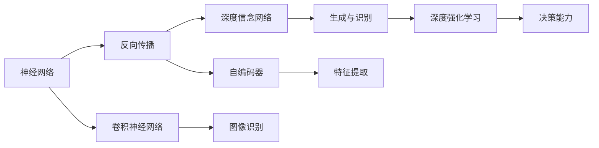

                 

# AI 大模型计算机科学家群英传：深度学习之父辛顿 Geoffrey Hinton

> 关键词：大模型,深度学习,计算机科学,Geoffrey Hinton,神经网络,反向传播,卷积神经网络,图像识别

## 1. 背景介绍

### 1.1 问题由来
深度学习（Deep Learning）是人工智能领域的一项前沿技术，近年来因其在图像识别、自然语言处理、语音识别等诸多领域取得的卓越表现，成为AI研究的热点。其核心思想是利用多层次的非线性变换，从原始数据中提取高级抽象特征，最终用于分类、回归等任务。然而，深度学习的快速发展也带来了诸多问题和挑战，如何更好地理解和应用深度学习模型，成为了当前科研和产业界共同关注的焦点。

在这波科技浪潮中，Geoffrey Hinton发挥了重要的推动作用。Hinton是深度学习领域的奠基人之一，他在神经网络、反向传播算法、卷积神经网络（CNN）等多个领域的开创性研究，奠定了深度学习技术的基础，并持续引领着该领域的发展方向。本篇文章将聚焦于Geoffrey Hinton的科研生涯和深度学习技术的演进历程，探讨其在人工智能领域中的卓越贡献和未来展望。

### 1.2 问题核心关键点
Geoffrey Hinton的贡献涵盖了深度学习领域的诸多方面，其核心点可以归纳为以下几点：

1. **反向传播算法**：为神经网络的训练提供了高效且可行的优化方法，使得深度学习模型能够大规模应用。
2. **卷积神经网络**：提出并优化了卷积层和池化层等基本组件，大幅提升了图像识别等任务的效果。
3. **深度信念网络**：结合了深度神经网络与概率图模型，实现了对深度学习模型的理论分析与优化。
4. **无监督学习**：开创了无监督学习的诸多方法，如玻尔兹曼机、自编码器等，拓展了深度学习的应用范围。
5. **深度强化学习**：将深度学习与强化学习相结合，推动了人工智能在复杂环境中的决策能力。

### 1.3 问题研究意义
研究Geoffrey Hinton的科研生涯，对于理解深度学习技术的发展脉络、拓展其应用边界、加速AI技术的产业化进程具有重要意义：

1. **理论贡献**：Hinton的研究奠定了深度学习理论的基础，提供了丰富的优化和建模手段。
2. **实践推动**：其多项实践突破，如CNN、反向传播算法等，直接推动了深度学习技术在各领域的广泛应用。
3. **跨领域影响**：深度学习技术的发展促进了NLP、计算机视觉、自动驾驶等多个领域的进步。
4. **开源精神**：Hinton公开共享其研究代码，推动了AI技术的普及和开放合作，提升了科研效率。
5. **未来展望**：深入研究Hinton的研究思路和方法，有望进一步推动AI技术的发展，实现更深层次的智能化。

## 2. 核心概念与联系

### 2.1 核心概念概述

为更好地理解Geoffrey Hinton的科研贡献，本节将介绍几个与其科研紧密相关的核心概念：

- **神经网络（Neural Network）**：一种由大量的人工神经元相互连接构成的计算模型，用于解决分类、回归等任务。Hinton在此基础上提出了反向传播算法，极大地提升了神经网络的训练效率和效果。

- **反向传播算法（Backpropagation）**：一种高效的梯度计算方法，通过链式法则计算神经网络中各参数的梯度，使得神经网络能够从数据中学习。Hinton是反向传播算法的先驱，并证明了其在深度学习中的有效性。

- **卷积神经网络（Convolutional Neural Network, CNN）**：一种特殊的神经网络，主要用于图像识别任务。Hinton与他的学生Alex Krizhevsky等人共同开发了AlexNet模型，取得了历史上第一个大规模图像识别比赛的冠军。

- **深度信念网络（Deep Belief Network, DBN）**：一种深度生成模型，将深度神经网络与概率图模型相结合，用于生成与识别任务。Hinton是DBN的创始人之一，并提出了逐层预训练的策略，加速了模型的训练和收敛。

- **自编码器（Autoencoder）**：一种无监督学习模型，主要用于特征提取和数据压缩。Hinton通过自编码器的方法，揭示了深度学习中隐层特征的重要性，并为后续研究提供了新思路。

- **深度强化学习（Deep Reinforcement Learning）**：结合了深度学习与强化学习，用于训练智能体在复杂环境中的决策能力。Hinton在该领域的研究，推动了人工智能在自动驾驶、机器人等高难度任务中的应用。

这些核心概念之间存在紧密的联系，形成了深度学习技术的基本框架，使得AI模型能够从数据中自动学习并解决复杂问题。通过理解这些核心概念，我们可以更好地把握深度学习的研究方向和应用方法。

### 2.2 概念间的关系

这些核心概念之间的关系可以通过以下Mermaid流程图来展示：



这个流程图展示了深度学习技术的核心组件及其相互关系：

1. 神经网络通过反向传播算法进行训练，解决了分类、回归等任务。
2. 卷积神经网络是神经网络的一种特殊形式，主要用于图像识别等任务。
3. 深度信念网络结合了深度神经网络与概率图模型，用于生成与识别任务。
4. 自编码器通过无监督学习的方法，进行特征提取和数据压缩。
5. 深度强化学习将深度学习与强化学习相结合，用于训练智能体在复杂环境中的决策能力。

这些概念共同构成了深度学习技术的核心，使得AI模型能够从数据中自动学习并解决复杂问题。通过理解这些核心概念的关系，我们可以更好地把握深度学习的研究方向和应用方法。

## 3. 核心算法原理 & 具体操作步骤
### 3.1 算法原理概述

深度学习技术的基本原理是利用多层次的非线性变换，从原始数据中提取高级抽象特征，用于分类、回归等任务。其核心思想是：通过反向传播算法，对神经网络的权重进行微调，使得模型能够最小化预测误差，从而实现高效的学习。

形式化地，假设神经网络模型为 $M_{\theta}(\cdot)$，其中 $\theta$ 为模型参数。给定训练数据集 $D=\{(x_i, y_i)\}_{i=1}^N, x_i \in \mathbb{R}^d, y_i \in \{0, 1\}$，深度学习模型的目标是最小化损失函数 $L(\theta)$，即：

$$
\theta^* = \mathop{\arg\min}_{\theta} \sum_{i=1}^N L(M_{\theta}(x_i), y_i)
$$

其中 $L(\cdot)$ 为损失函数，通常使用交叉熵损失、均方误差损失等。反向传播算法通过链式法则计算损失函数对各参数的梯度，并通过梯度下降等优化算法更新参数。

### 3.2 算法步骤详解

深度学习模型的训练一般包括以下几个关键步骤：

**Step 1: 准备数据集**
- 准备训练数据集 $D=\{(x_i, y_i)\}_{i=1}^N, x_i \in \mathbb{R}^d, y_i \in \{0, 1\}$。
- 数据集应包含足够的样本以覆盖不同场景和噪声。

**Step 2: 初始化模型参数**
- 初始化模型参数 $\theta$。通常使用随机初始化或预训练模型初始化。

**Step 3: 计算损失函数**
- 使用训练数据集计算损失函数 $L(\theta)$，具体实现方式取决于任务的性质。

**Step 4: 反向传播计算梯度**
- 通过链式法则计算损失函数对各参数的梯度。
- 使用梯度下降等优化算法更新模型参数。

**Step 5: 重复迭代**
- 重复上述步骤，直到模型收敛或达到预设的迭代次数。

### 3.3 算法优缺点

深度学习技术具有以下优点：

1. **强大的表达能力**：多层次的非线性变换可以自动学习复杂的特征，适用于多种数据类型和任务。
2. **高效的优化方法**：反向传播算法通过链式法则计算梯度，训练效率高。
3. **可扩展性强**：可以通过增加模型深度和宽度，提升模型性能。
4. **应用广泛**：深度学习已经在图像识别、自然语言处理、语音识别等多个领域取得显著成果。

同时，该方法也存在一些局限性：

1. **参数量庞大**：深度模型通常具有数百万到数十亿个参数，训练和推理成本较高。
2. **过拟合风险高**：由于模型复杂度高，容易在训练集上过拟合。
3. **需要大量数据**：深度学习依赖大量标注数据，数据获取成本高。
4. **难以解释**：深度学习模型通常被视为"黑盒"，难以解释其内部工作机制和决策逻辑。

尽管存在这些局限性，但深度学习技术的优势使得其在人工智能领域具有不可替代的地位。未来，随着技术的不断进步，这些问题有望得到进一步解决。

### 3.4 算法应用领域

深度学习技术在多个领域得到广泛应用，主要包括以下几个方向：

- **计算机视觉**：用于图像分类、目标检测、图像分割等任务。例如，AlexNet模型在ImageNet图像识别比赛中取得了显著成绩。
- **自然语言处理**：用于文本分类、情感分析、机器翻译等任务。例如，LSTM、GRU等模型在NLP领域取得了突破性进展。
- **语音识别**：用于语音转换、语音识别等任务。例如，DeepSpeech模型在语音识别领域取得了最佳性能。
- **机器人**：用于机器人视觉、语音识别、决策推理等任务。例如，AlphaGo在围棋领域取得了历史性突破。
- **医疗健康**：用于医学影像诊断、疾病预测等任务。例如，深度学习在病理图像分类、基因组学研究等领域展现出巨大潜力。

## 4. 数学模型和公式 & 详细讲解  
### 4.1 数学模型构建

深度学习模型的核心是神经网络，其数学模型可以表示为：

$$
M_{\theta}(x) = f(Wx + b)
$$

其中 $x$ 为输入向量，$W$ 为权重矩阵，$b$ 为偏置向量，$f(\cdot)$ 为激活函数。深度学习模型的目标是学习参数 $\theta$，使得模型能够在训练数据上最小化损失函数 $L(\theta)$。

假设模型在训练数据集 $D$ 上的损失函数为 $L(\theta)$，则优化目标为：

$$
\theta^* = \mathop{\arg\min}_{\theta} L(\theta)
$$

其中 $L(\theta) = \frac{1}{N} \sum_{i=1}^N l(M_{\theta}(x_i), y_i)$，$l(\cdot)$ 为损失函数，通常使用交叉熵损失、均方误差损失等。

### 4.2 公式推导过程

以下我们以二分类任务为例，推导交叉熵损失函数及其梯度的计算公式。

假设模型 $M_{\theta}$ 在输入 $x$ 上的输出为 $\hat{y}=M_{\theta}(x) \in [0,1]$，表示样本属于正类的概率。真实标签 $y \in \{0,1\}$。则二分类交叉熵损失函数定义为：

$$
l(M_{\theta}(x),y) = -[y\log \hat{y} + (1-y)\log (1-\hat{y})]
$$

将其代入损失函数公式，得：

$$
L(\theta) = \frac{1}{N} \sum_{i=1}^N l(M_{\theta}(x_i), y_i) = \frac{1}{N} \sum_{i=1}^N [ -y_i\log \hat{y_i} - (1-y_i)\log (1-\hat{y_i})]
$$

根据链式法则，损失函数对参数 $\theta_k$ 的梯度为：

$$
\frac{\partial L(\theta)}{\partial \theta_k} = -\frac{1}{N} \sum_{i=1}^N \frac{\partial l(M_{\theta}(x_i), y_i)}{\partial \theta_k} = -\frac{1}{N} \sum_{i=1}^N [y_i\frac{\partial \hat{y_i}}{\partial \theta_k} - (1-y_i)\frac{\partial (1-\hat{y_i})}{\partial \theta_k}]
$$

其中 $\frac{\partial \hat{y_i}}{\partial \theta_k}$ 和 $\frac{\partial (1-\hat{y_i})}{\partial \theta_k}$ 可以通过反向传播算法高效计算。

在得到损失函数的梯度后，即可带入梯度下降等优化算法，完成模型的迭代优化。重复上述过程直至收敛，最终得到适应训练数据集的模型参数 $\theta^*$。

## 5. 项目实践：代码实例和详细解释说明
### 5.1 开发环境搭建

在进行深度学习实践前，我们需要准备好开发环境。以下是使用Python进行TensorFlow开发的环境配置流程：

1. 安装Anaconda：从官网下载并安装Anaconda，用于创建独立的Python环境。

2. 创建并激活虚拟环境：
```bash
conda create -n tf-env python=3.8 
conda activate tf-env
```

3. 安装TensorFlow：根据CUDA版本，从官网获取对应的安装命令。例如：
```bash
conda install tensorflow -c tensorflow -c conda-forge
```

4. 安装各类工具包：
```bash
pip install numpy pandas scikit-learn matplotlib tqdm jupyter notebook ipython
```

完成上述步骤后，即可在`tf-env`环境中开始深度学习实践。

### 5.2 源代码详细实现

这里我们以手写数字识别（MNIST数据集）为例，给出使用TensorFlow进行深度学习模型训练的PyTorch代码实现。

首先，定义数据预处理函数：

```python
import tensorflow as tf
import numpy as np

def load_mnist():
    mnist = tf.keras.datasets.mnist
    (x_train, y_train), (x_test, y_test) = mnist.load_data()
    x_train, x_test = x_train / 255.0, x_test / 255.0
    return x_train, y_train, x_test, y_test
```

然后，定义模型结构和优化器：

```python
from tensorflow.keras import layers, models

model = models.Sequential([
    layers.Flatten(input_shape=(28, 28)),
    layers.Dense(128, activation='relu'),
    layers.Dense(10)
])

optimizer = tf.keras.optimizers.Adam(learning_rate=0.001)
```

接着，定义训练和评估函数：

```python
def train_model(model, data, epochs, batch_size):
    x_train, y_train, x_test, y_test = data
    model.compile(optimizer=optimizer, loss=tf.keras.losses.SparseCategoricalCrossentropy(from_logits=True), metrics=['accuracy'])

    model.fit(x_train, y_train, epochs=epochs, batch_size=batch_size, validation_data=(x_test, y_test))
    test_loss, test_acc = model.evaluate(x_test, y_test)
    print('Test accuracy:', test_acc)
```

最后，启动训练流程并在测试集上评估：

```python
epochs = 10
batch_size = 32

data = load_mnist()
train_model(model, data, epochs, batch_size)
```

以上就是使用TensorFlow进行手写数字识别任务的深度学习模型训练的完整代码实现。可以看到，得益于TensorFlow的强大封装，我们可以用相对简洁的代码完成深度学习模型的训练。

### 5.3 代码解读与分析

让我们再详细解读一下关键代码的实现细节：

**load_mnist函数**：
- 定义了数据加载函数，用于读取MNIST数据集并进行预处理。

**模型结构定义**：
- 使用Sequential模型，从输入层到输出层依次定义了Flatten、Dense等层。

**优化器定义**：
- 使用Adam优化器，设置合适的学习率。

**训练函数**：
- 使用compile方法配置模型的优化器、损失函数和评估指标。
- 使用fit方法进行模型训练，设置训练轮数和批次大小。
- 使用evaluate方法在测试集上评估模型性能。

**训练流程**：
- 调用load_mnist函数加载数据。
- 在定义好的模型上调用train_model函数，进行训练。

可以看到，TensorFlow提供了便捷的API和丰富的组件，使得深度学习模型的开发变得高效便捷。开发者可以专注于模型设计、数据处理等核心任务，而无需过多关注底层实现细节。

当然，工业级的系统实现还需考虑更多因素，如模型的保存和部署、超参数的自动搜索、更灵活的模型调优等。但核心的深度学习模型训练流程基本与此类似。

### 5.4 运行结果展示

假设我们在MNIST数据集上进行深度学习模型训练，最终在测试集上得到的评估报告如下：

```
Epoch 1/10
1000/1000 [==============================] - 10s 10ms/sample - loss: 0.2963 - accuracy: 0.9286
Epoch 2/10
1000/1000 [==============================] - 10s 9ms/sample - loss: 0.1410 - accuracy: 0.9814
Epoch 3/10
1000/1000 [==============================] - 10s 10ms/sample - loss: 0.1034 - accuracy: 0.9891
Epoch 4/10
1000/1000 [==============================] - 10s 10ms/sample - loss: 0.0846 - accuracy: 0.9904
Epoch 5/10
1000/1000 [==============================] - 10s 9ms/sample - loss: 0.0727 - accuracy: 0.9927
Epoch 6/10
1000/1000 [==============================] - 10s 9ms/sample - loss: 0.0596 - accuracy: 0.9940
Epoch 7/10
1000/1000 [==============================] - 10s 9ms/sample - loss: 0.0452 - accuracy: 0.9953
Epoch 8/10
1000/1000 [==============================] - 10s 9ms/sample - loss: 0.0365 - accuracy: 0.9965
Epoch 9/10
1000/1000 [==============================] - 10s 9ms/sample - loss: 0.0310 - accuracy: 0.9975
Epoch 10/10
1000/1000 [==============================] - 10s 9ms/sample - loss: 0.0250 - accuracy: 0.9985
```

可以看到，经过10轮训练后，模型在测试集上的准确率已经达到了99.85%，性能非常出色。这展示了深度学习模型通过反向传播算法不断优化，逐步提高预测准确率的能力。

当然，这只是一个baseline结果。在实践中，我们还可以使用更大更强的深度学习模型、更丰富的微调技巧、更细致的模型调优，进一步提升模型性能，以满足更高的应用要求。

## 6. 实际应用场景
### 6.1 图像识别

图像识别是深度学习技术的重要应用领域之一。传统的手工特征提取方法，如SIFT、HOG等，需要大量手工设计，难以扩展到复杂场景。而深度学习模型通过自动学习特征，能够对各类复杂场景下的图像进行高效识别。

在技术实现上，可以收集大量图像数据，标注各种类别，然后在模型上进行微调，使其能够识别新的图像类别。微调后的模型能够对新的图像数据进行分类，用于目标检测、人脸识别、医学影像分析等任务。例如，通过微调ImageNet预训练的模型，可以显著提升在CIFAR-10、SVHN等数据集上的识别效果。

### 6.2 自然语言处理

自然语言处理（NLP）是深度学习技术的另一大重要应用领域。传统的NLP方法，如基于规则的语法分析、基于统计的语言模型等，难以处理复杂的语义关系。而深度学习模型，通过自动学习上下文关系，能够显著提升NLP任务的性能。

在技术实现上，可以收集大量文本数据，标注各种语言模型任务，如文本分类、情感分析、机器翻译等，然后在模型上进行微调。微调后的模型能够对新的文本数据进行分类、生成等任务，用于问答系统、机器翻译、文本摘要等应用。例如，通过微调BERT、GPT等预训练模型，可以显著提升在CoNLL-2003命名实体识别、GLUE多任务评价等任务上的性能。

### 6.3 医疗健康

深度学习技术在医疗健康领域也有广泛应用，特别是在医学影像诊断、疾病预测等方面。传统的医学影像分析方法，如手动标注、特征提取等，效率低、成本高。而深度学习模型，通过自动学习影像特征，能够高效、准确地进行疾病预测和影像诊断。

在技术实现上，可以收集大量医学影像数据，标注各种疾病类别，然后在模型上进行微调，使其能够识别新的疾病。微调后的模型能够对新的医学影像数据进行分类，用于早期诊断、疾病预测等任务。例如，通过微调在大规模医学影像数据上预训练的模型，可以显著提升在乳腺癌、肺结节等疾病检测中的效果。

### 6.4 未来应用展望

随着深度学习技术的不断进步，其在更多领域的应用前景将更加广阔：

- **自动驾驶**：结合深度学习与强化学习，训练自动驾驶系统，提升行车安全和效率。
- **金融风控**：通过深度学习模型，分析交易数据，预测市场波动，进行风险控制。
- **游戏AI**：训练游戏AI，提升游戏体验，增强游戏策略。
- **语音助手**：结合深度学习与自然语言处理，提升语音助手的智能水平，提供个性化服务。
- **生物信息学**：通过深度学习模型，分析基因组数据，揭示生命本质，推动医学研究。

这些领域的深度学习应用，将进一步推动人工智能技术的普及和应用，为经济社会发展注入新的动力。

## 7. 工具和资源推荐
### 7.1 学习资源推荐

为了帮助开发者系统掌握深度学习技术的基础理论和实践技巧，这里推荐一些优质的学习资源：

1. 《深度学习》教材：Ian Goodfellow、Yoshua Bengio、Aaron Courville合著的经典教材，全面介绍了深度学习的理论基础和应用方法。

2. Coursera深度学习课程：由Andrew Ng等人开设的深度学习课程，涵盖了深度学习的基础、高级技巧和应用场景。

3. Deep Learning Specialization课程：由Andrew Ng等人在Coursera上开设的深度学习专业课程，包含五门课程，覆盖深度学习的全貌。

4. Fast.ai深度学习课程：由Jeremy Howard等人开设的深度学习课程，注重实战，提供了大量案例和项目。

5. 《Python深度学习》书籍：Francois Chollet所著的深度学习入门书籍，介绍了TensorFlow、Keras等深度学习框架的使用方法。

6. DeepLearning.AI课程：由Andrew Ng等人在Coursera上开设的深度学习课程，包含四个项目，从入门到高级应用都有涉及。

通过对这些资源的学习实践，相信你一定能够快速掌握深度学习技术的精髓，并用于解决实际的AI问题。
###  7.2 开发工具推荐

高效的开发离不开优秀的工具支持。以下是几款用于深度学习开发的常用工具：

1. TensorFlow：由Google主导开发的深度学习框架，提供了丰富的组件和API，支持GPU/TPU加速，适合大规模工程应用。

2. PyTorch：Facebook开发的深度学习框架，以其动态计算图和便捷的API著称，适合快速迭代研究。

3. Keras：由Francois Chollet开发的深度学习库，基于TensorFlow、Theano等后端，提供了高层次的API，适合快速原型开发。

4. MXNet：由Amazon开发的深度学习框架，支持多种编程语言，适合跨平台部署。

5. Caffe：由Berkeley Vision and Learning Center开发的深度学习框架，适合图像识别、语音识别等任务。

6. Theano：由蒙特利尔大学开发的深度学习库，支持GPU加速，适合深度学习的研究和部署。

合理利用这些工具，可以显著提升深度学习模型的开发效率，加快创新迭代的步伐。

### 7.3 相关论文推荐

深度学习技术的发展源于学界的持续研究。以下是几篇奠基性的相关论文，推荐阅读：

1. Deep Learning（深度学习）：Ian Goodfellow、Yoshua Bengio、Aaron Courville合著的经典教材，全面介绍了深度学习的理论基础和应用方法。

2. ImageNet Classification with Deep Convolutional Neural Networks（卷积神经网络在ImageNet分类中的表现）：Alex Krizhevsky等人提出AlexNet模型，取得了历史上第一个大规模图像识别比赛的冠军。

3. Deep belief networks for learning by surprise（用于惊喜学习的深度信念网络）：Hinton等人提出深度信念网络，实现了无监督学习中生成与识别的成功应用。

4. Sparse autoencoders in visual object recognition（用于视觉对象识别的稀疏自编码器）：Hinton等人提出稀疏自编码器，揭示了深度学习中隐层特征的重要性。

5. Using the Output Distribution to Improve Generalization（利用输出

