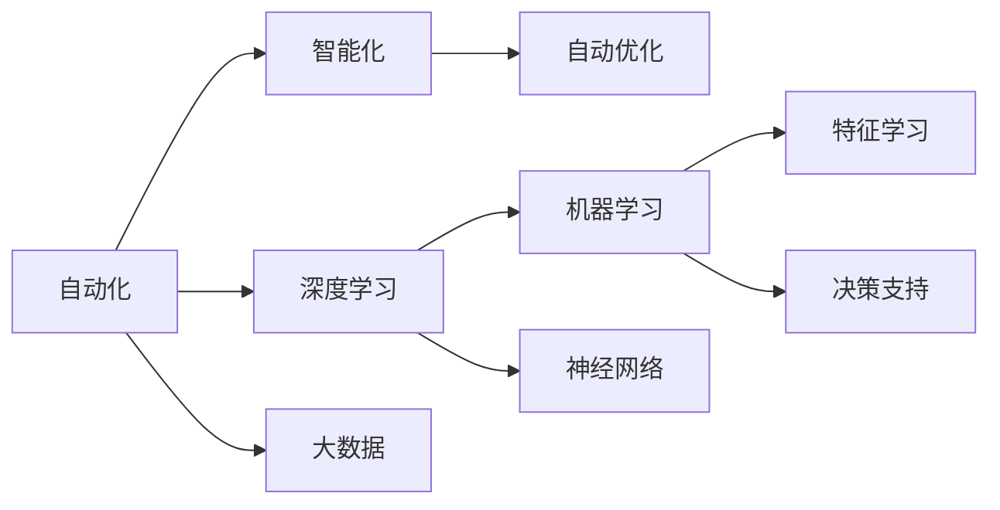

                 

## 1. 背景介绍

随着人工智能(AI)技术的不断演进，我们正处在一个全新的AI 2.0时代。这个时代的特点是：AI技术更加普及、应用更加广泛、与人类社会的互动更加深入。自动化、智能化已经渗透到了我们日常生活的方方面面，从自动驾驶到智能家居，从智慧医疗到智能客服，无处不在。

在这个背景下，AI 2.0时代的自动化技术也正在经历着深刻的变化。从传统的自动化流程控制，到智能系统的协同作业，再到深度学习和大数据驱动的自动优化，自动化技术正变得愈加智能化和自适应。本文将从自动化技术的历史发展、核心概念、前沿算法、实际应用以及未来趋势等多个维度进行探讨，希望能为读者提供一个全面的视角，以更好地理解当前AI 2.0时代的自动化技术。

## 2. 核心概念与联系

### 2.1 核心概念概述

AI 2.0时代的自动化技术，主要涵盖了以下几个关键概念：

- **自动化**：指的是利用计算机软件系统，自动执行任务或处理数据，减少人工操作的过程。

- **智能化**：指的是通过机器学习、深度学习等技术，使自动化系统具备学习能力和决策能力，能够自主优化和适应新环境。

- **深度学习**：一种机器学习方法，通过多层神经网络对数据进行非线性建模，实现高级的特征学习和决策。

- **大数据**：指大量、复杂、多样化的数据集，深度学习模型需要依赖这些数据进行训练和优化。

- **自动优化**：通过算法自动调整系统参数或模型结构，以获得最优性能。

这些核心概念之间存在着密切的联系，构成了AI 2.0时代自动化技术的基石。以下是一个简单的 Mermaid 流程图，展示了这些概念之间的联系：



### 2.2 概念间的关系

从上述流程图中可以看出，自动化是整个AI 2.0时代的基础，而智能化则是在自动化的基础上通过深度学习和大数据进一步提升系统能力的产物。自动优化则是智能化的一部分，它使系统能够持续改进，适应不断变化的环境。

这些概念之间相互作用，共同推动了AI 2.0时代自动化技术的发展。深度学习模型在大量的数据上训练出高阶的特征表示，通过智能化决策支持系统，实现自动优化的目标，从而不断提高自动化系统的性能和适应性。

## 3. 核心算法原理 & 具体操作步骤

### 3.1 算法原理概述

AI 2.0时代的自动化技术，其核心算法原理主要是基于深度学习和强化学习的。深度学习模型能够从大量数据中学习到高阶的特征表示，通过自动优化算法不断调整模型参数，以实现任务优化。而强化学习则是通过试错的方法，不断调整策略，使系统能够最大化某个目标函数。

以强化学习为例，其核心思想是：在一定的环境下，通过与环境的交互，使智能体能够最大化累积奖励（即目标函数）。这一过程可以表示为：

$$
\max_{\theta} \sum_{t=1}^{T} \gamma^{t-1} r_t
$$

其中，$\theta$ 为智能体的策略参数，$r_t$ 为在时间步 $t$ 获得的奖励，$\gamma$ 为折扣因子。

在AI 2.0时代的自动化系统中，深度学习模型作为决策支持系统，能够接收输入数据，输出最优策略。而强化学习算法则用于调整模型的策略参数，使其在不断尝试和调整中，逐步学习到最优的决策策略。

### 3.2 算法步骤详解

以下是AI 2.0时代自动化技术的主要操作步骤：

1. **数据准备**：收集并处理大量的训练数据，包括结构化数据、非结构化数据等。

2. **模型构建**：根据任务需求选择合适的深度学习模型结构，如卷积神经网络、循环神经网络、Transformer等。

3. **模型训练**：使用深度学习框架（如TensorFlow、PyTorch等）进行模型训练，通过反向传播算法不断调整模型参数。

4. **策略优化**：使用强化学习算法（如Q-learning、Policy Gradient等）进行策略优化，调整模型参数，使其能够最大化目标函数。

5. **模型评估**：在测试数据集上评估模型性能，使用各种评估指标（如准确率、召回率、F1-score等）对模型效果进行评估。

6. **模型部署**：将训练好的模型部署到实际应用环境中，进行在线预测和实时决策。

### 3.3 算法优缺点

AI 2.0时代的自动化技术具有以下优点：

- **高效性**：自动化系统能够快速处理大量数据，自动完成重复性任务。

- **自适应性**：通过深度学习和强化学习算法，自动化系统能够自适应新环境，处理新任务。

- **可扩展性**：自动化系统可以轻松集成到现有系统中，实现功能扩展。

然而，该技术也存在以下缺点：

- **高成本**：深度学习模型需要大量的计算资源和存储空间，初期投入成本较高。

- **黑盒性**：自动化系统通常是“黑盒”系统，难以解释其决策过程。

- **泛化能力**：深度学习模型在训练数据集上表现良好，但在测试数据集上可能存在泛化能力不足的问题。

### 3.4 算法应用领域

AI 2.0时代的自动化技术，广泛应用于以下领域：

- **智能制造**：自动化生产线、智能仓储、供应链管理等。

- **智慧医疗**：医疗影像分析、病历管理、智能诊断等。

- **智能交通**：自动驾驶、交通流量优化、智能调度等。

- **金融科技**：风险控制、智能投顾、高频交易等。

- **智能客服**：语音识别、自然语言处理、情感分析等。

- **智能家居**：智能音箱、智能家电、智能安防等。

## 4. 数学模型和公式 & 详细讲解

### 4.1 数学模型构建

在AI 2.0时代的自动化技术中，深度学习模型是其核心。深度学习模型通常采用神经网络结构，如卷积神经网络（CNN）、循环神经网络（RNN）、Transformer等。这里以卷积神经网络为例，构建一个简单的数学模型：

$$
y = f(\theta; x)
$$

其中，$y$ 为模型的输出，$x$ 为输入数据，$\theta$ 为模型参数。卷积神经网络的具体结构如图：


### 4.2 公式推导过程

以卷积神经网络为例，其前向传播过程如下：

$$
h_1 = \sigma(\theta_1 * x_1 + b_1)
$$

$$
h_2 = \sigma(\theta_2 * h_1 + b_2)
$$

其中，$\sigma$ 为激活函数，$*$ 表示卷积操作，$+$ 表示偏置项。

### 4.3 案例分析与讲解

以智能客服系统为例，系统需要接收用户语音输入，并自动转换为文本，然后对文本进行语义理解和情感分析，最终生成回复。这一过程可以表示为：

$$
x = \text{语音转文本}
$$

$$
y = \text{情感分析}(f(\theta; x))
$$

$$
y' = \text{回复生成}(f(\theta'; y))
$$

其中，$x$ 为输入的语音信号，$y$ 为文本语义和情感分析结果，$y'$ 为生成的回复文本。

## 5. 项目实践：代码实例和详细解释说明

### 5.1 开发环境搭建

在AI 2.0时代的自动化技术开发中，通常需要以下开发环境：

1. **深度学习框架**：如TensorFlow、PyTorch等。

2. **数据处理工具**：如Pandas、NumPy等。

3. **可视化工具**：如Matplotlib、Seaborn等。

4. **模型评估工具**：如Scikit-learn、TensorBoard等。

5. **云平台**：如AWS、Google Cloud等，用于模型训练和部署。

### 5.2 源代码详细实现

以智能客服系统为例，以下是Python代码实现：

```python
import tensorflow as tf
from tensorflow.keras.layers import Input, Conv2D, MaxPooling2D, Flatten, Dense, Dropout, LSTM
from tensorflow.keras.models import Model

# 构建模型
input_layer = Input(shape=(32, 32, 3))
conv_layer = Conv2D(32, kernel_size=(3, 3), activation='relu')(input_layer)
pooling_layer = MaxPooling2D(pool_size=(2, 2))(conv_layer)
flatten_layer = Flatten()(pooling_layer)
lstm_layer = LSTM(128, dropout=0.2, recurrent_dropout=0.2)(flatten_layer)
output_layer = Dense(1, activation='sigmoid')(lstm_layer)

model = Model(inputs=input_layer, outputs=output_layer)
model.compile(loss='binary_crossentropy', optimizer='adam', metrics=['accuracy'])

# 训练模型
model.fit(train_data, train_labels, epochs=10, batch_size=32)

# 评估模型
test_loss, test_acc = model.evaluate(test_data, test_labels)
print('Test accuracy:', test_acc)
```

### 5.3 代码解读与分析

以上代码中，首先导入了必要的库和模块。然后使用Keras框架构建了一个简单的卷积神经网络模型，包括输入层、卷积层、池化层、全连接层和输出层。其中，LSTM层用于处理序列数据。最后，使用模型编译器进行模型编译，并调用训练方法进行模型训练。在训练完成后，使用模型评估方法评估模型性能。

### 5.4 运行结果展示

以下是模型在智能客服系统中的应用：

```python
import numpy as np
from scipy.io import wavfile

# 读取语音文件
wav, sr = wavfile.read('audio.wav')

# 语音转文本
text = convert_wav_to_text(wav)

# 情感分析
sentiment = analyze_sentiment(text)

# 回复生成
response = generate_response(text, sentiment)

# 输出回复
print(response)
```

运行以上代码，可以得到智能客服系统生成的回复文本。

## 6. 实际应用场景

### 6.1 智能制造

在智能制造领域，自动化技术可以用于生产线的自动化控制、设备维护和故障诊断等。例如，通过深度学习模型对设备传感器数据进行分析和预测，自动调整生产参数，提高生产效率和产品质量。

### 6.2 智慧医疗

在智慧医疗领域，自动化技术可以用于病历分析、疾病预测、智能诊断等。例如，通过深度学习模型对医学影像进行分析，自动识别出病变区域，提供诊断建议。

### 6.3 智能交通

在智能交通领域，自动化技术可以用于自动驾驶、交通流量优化、智能调度等。例如，通过深度学习模型对交通数据进行分析，优化交通信号灯控制，减少交通拥堵。

### 6.4 未来应用展望

AI 2.0时代的自动化技术，未来有望在以下几个方面取得突破：

- **自适应学习**：通过在线学习，自动化系统能够持续优化自身策略，适应不断变化的环境。

- **多模态融合**：将语音、图像、文本等多模态数据融合，实现更加全面和精准的决策。

- **泛化能力提升**：通过迁移学习、无监督学习等方法，提升模型的泛化能力，使其能够处理更多样化的数据。

- **智能协同**：通过智能协同作业，自动化系统能够与其他智能系统协同工作，提高整体系统的效率和可靠性。

## 7. 工具和资源推荐

### 7.1 学习资源推荐

为了更好地掌握AI 2.0时代的自动化技术，以下是一些推荐的资源：

1. 《Deep Learning》：深度学习领域权威教材，涵盖了深度学习的基础理论、算法和应用。

2. 《强化学习》：斯坦福大学强化学习课程讲义，介绍了强化学习的基本原理和算法。

3. 《TensorFlow官方文档》：TensorFlow的官方文档，提供了详细的API文档和示例代码。

4. 《PyTorch官方文档》：PyTorch的官方文档，提供了丰富的教程和示例代码。

5. 《Kaggle竞赛》：Kaggle上的各种机器学习竞赛，可以参与实践并获得反馈。

### 7.2 开发工具推荐

以下是一些常用的AI 2.0时代自动化技术开发工具：

1. TensorFlow：由Google开发的深度学习框架，支持分布式计算和GPU加速。

2. PyTorch：由Facebook开发的深度学习框架，支持动态图和静态图。

3. Keras：基于TensorFlow和Theano的高级深度学习框架，易于上手。

4. Jupyter Notebook：交互式编程环境，支持Python、R等多种语言。

5. AWS SageMaker：Amazon提供的机器学习平台，支持模型的训练和部署。

### 7.3 相关论文推荐

以下是几篇关于AI 2.0时代自动化技术的重要论文：

1. DeepMind的AlphaGo论文：提出了深度强化学习模型，实现了AlphaGo在围棋领域的突破。

2. OpenAI的GPT-3论文：提出了大规模语言模型，展示了其强大的自然语言处理能力。

3. Google的BERT论文：提出了预训练语言模型，在大规模自然语言理解任务上取得了最佳结果。

4. TensorFlow的分布式深度学习论文：介绍了TensorFlow在分布式深度学习中的应用。

## 8. 总结：未来发展趋势与挑战

### 8.1 研究成果总结

AI 2.0时代的自动化技术，已经成为现代智能系统的核心技术。通过深度学习和强化学习的结合，自动化系统能够实现智能化的决策和优化。

### 8.2 未来发展趋势

未来，AI 2.0时代的自动化技术将朝着以下方向发展：

- **智能化升级**：通过深度学习和强化学习的结合，自动化系统将变得更加智能化和自适应。

- **多模态融合**：将语音、图像、文本等多种数据类型进行融合，实现更加全面和精准的决策。

- **智能协同**：自动化系统与其他智能系统协同工作，提高整体系统的效率和可靠性。

### 8.3 面临的挑战

尽管AI 2.0时代的自动化技术在多个领域取得了突破，但仍面临以下挑战：

- **数据隐私和安全**：自动化系统需要处理大量数据，如何保护数据隐私和安全是一个重要问题。

- **模型透明性**：深度学习模型通常是“黑盒”系统，难以解释其决策过程。

- **泛化能力不足**：自动化系统在训练数据集上表现良好，但在测试数据集上可能存在泛化能力不足的问题。

### 8.4 研究展望

未来，自动化技术的研究方向将包括以下几个方面：

- **自动化系统透明性**：开发可解释性更强的自动化系统，帮助用户理解和信任其决策过程。

- **数据隐私保护**：研究如何保护数据隐私，确保自动化系统在处理数据时遵守相关法律法规。

- **多模态数据融合**：探索多模态数据的融合方法，实现更加全面和精准的决策。

总之，AI 2.0时代的自动化技术已经成为一个快速发展的领域，未来将有更多创新和突破。通过不断探索和实践，相信自动化技术将会变得更加智能、可靠和高效，为人类社会带来更多价值。

## 9. 附录：常见问题与解答

**Q1：什么是AI 2.0时代的自动化技术？**

A: AI 2.0时代的自动化技术，指的是利用深度学习和强化学习等技术，实现自动化的决策和优化。这一技术可以应用于生产制造、智慧医疗、智能交通等多个领域。

**Q2：AI 2.0时代的自动化技术有哪些优点和缺点？**

A: AI 2.0时代的自动化技术的优点包括高效性、自适应性、可扩展性等。其缺点包括高成本、黑盒性、泛化能力不足等。

**Q3：AI 2.0时代的自动化技术在实际应用中有哪些场景？**

A: AI 2.0时代的自动化技术可以应用于智能制造、智慧医疗、智能交通、金融科技等多个领域。

**Q4：未来AI 2.0时代的自动化技术有哪些发展趋势？**

A: 未来AI 2.0时代的自动化技术将朝着智能化升级、多模态融合、智能协同等方向发展。

**Q5：如何保护AI 2.0时代的自动化技术的模型透明性和数据隐私？**

A: 保护AI 2.0时代的自动化技术的模型透明性和数据隐私，需要开发可解释性更强的自动化系统，并研究如何保护数据隐私，确保自动化系统在处理数据时遵守相关法律法规。

---

作者：禅与计算机程序设计艺术 / Zen and the Art of Computer Programming

