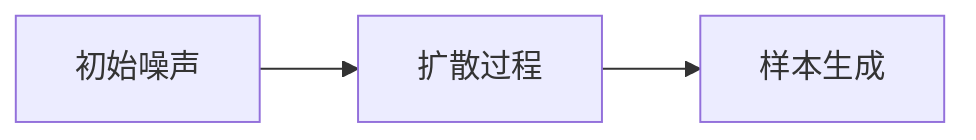
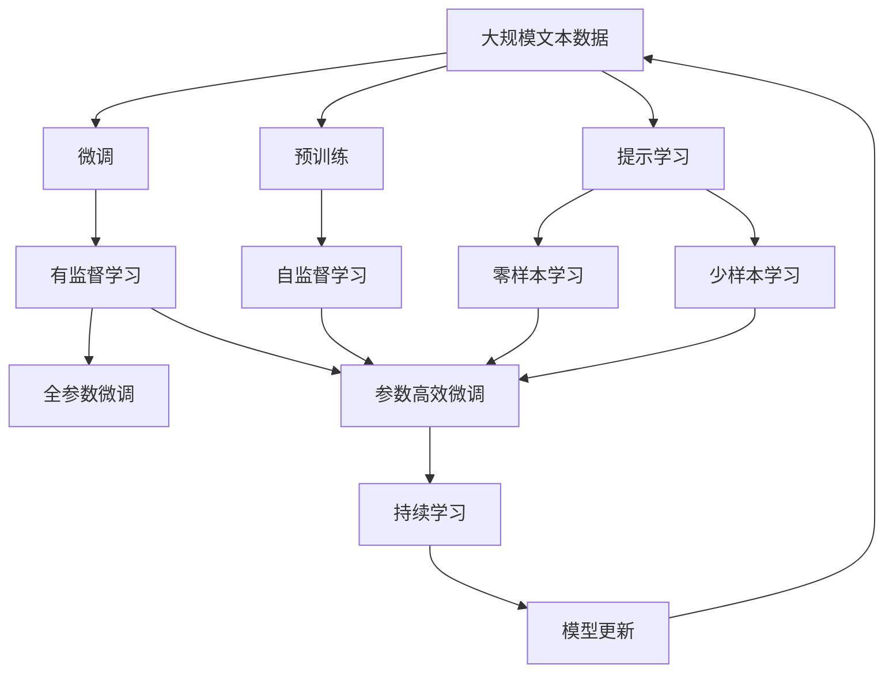

                 

# AIGC 原理与代码实例讲解

## 1. 背景介绍

### 1.1 问题由来

随着人工智能技术的发展，生成对抗网络（Generative Adversarial Networks, GANs）和自回归模型（Autoregressive Models）等生成模型在计算机视觉、自然语言处理和音频生成等领域取得了重大突破。这些技术被统称为人工智能生成内容（Artificial Intelligence Generated Content, AIGC）。AIGC不仅能够生成高质量的图像、视频和音频内容，还能生成高质量的文本，为内容创作、娱乐和社交媒体等领域带来深远影响。

### 1.2 问题核心关键点

AIGC技术的核心在于通过深度学习和生成模型，实现从噪声或低质量输入生成高质量输出的能力。其核心思想是通过生成器和判别器两个网络的对抗训练，使得生成器能够生成与真实数据难以区分的高质量内容。AIGC技术主要包括：

- 生成对抗网络（GANs）：生成器和判别器通过对抗性训练生成高质量样本。
- 自回归模型：利用自回归网络，根据已有信息生成新数据。
- 扩散模型（Diffusion Models）：通过连续的反向扩散过程，从噪声开始生成高质量数据。

这些技术已经在图像生成、语音合成、自然语言处理等多个领域得到应用，并取得了显著成果。

### 1.3 问题研究意义

研究AIGC技术，对于拓展人工智能应用领域，提升内容的创作和生产力，具有重要意义：

1. 降低内容创作成本。AIGC能够生成高质量的内容，减少人工创作的时间和成本投入。
2. 提升内容创作质量。AIGC可以生成出高水平的创意内容，超越人类创作水平。
3. 加速内容创作过程。AIGC能够快速生成内容，缩短内容创作周期。
4. 促进内容创新。AIGC可以生成新颖独特的创意内容，激发创作灵感。
5. 赋能产业升级。AIGC技术为媒体、娱乐、教育等行业带来了新的创新模式和商业模式，推动行业数字化转型。

## 2. 核心概念与联系

### 2.1 核心概念概述

为了更好地理解AIGC技术的核心原理和应用，本节将介绍几个密切相关的核心概念：

- 生成对抗网络（GANs）：由生成器和判别器组成的网络结构，通过对抗性训练生成高质量样本。
- 自回归模型（Autoregressive Models）：通过递归计算生成新数据，广泛应用在语音合成、文本生成等领域。
- 扩散模型（Diffusion Models）：通过连续的反向扩散过程，从噪声开始生成高质量数据。
- 条件生成模型（Conditional GANs）：在GANs的基础上，通过引入条件变量，生成特定类型的样本。
- 文本生成模型（Text Generation Models）：用于生成自然语言文本，包括基于自回归和基于生成对抗网络的方法。
- 图像生成模型（Image Generation Models）：用于生成高质量图像，包括GANs和扩散模型等。

这些概念之间的逻辑关系可以通过以下Mermaid流程图来展示：

```mermaid
graph TB
    A[生成对抗网络 (GANs)] --> B[自回归模型]
    A --> C[扩散模型]
    B --> D[条件生成模型]
    C --> D
    B --> E[文本生成模型]
    A --> F[图像生成模型]
    F --> G[图像到图像转换 (CycleGAN)]
```

这个流程图展示了大语言模型的核心概念及其之间的关系：

1. 生成对抗网络（GANs）通过对抗性训练生成高质量样本，是AIGC技术的核心。
2. 自回归模型通过递归计算生成新数据，广泛应用于语音合成、文本生成等领域。
3. 扩散模型通过连续的反向扩散过程，从噪声开始生成高质量数据。
4. 条件生成模型在GANs的基础上，通过引入条件变量，生成特定类型的样本。
5. 文本生成模型用于生成自然语言文本，包括基于自回归和基于生成对抗网络的方法。
6. 图像生成模型用于生成高质量图像，包括GANs和扩散模型等。
7. 图像到图像转换（CycleGAN）利用GANs将一种图像转化为另一种图像，具有广泛的应用。

### 2.2 概念间的关系

这些核心概念之间存在着紧密的联系，形成了AIGC技术的完整生态系统。下面我通过几个Mermaid流程图来展示这些概念之间的关系。

#### 2.2.1 AIGC的整体架构

```mermaid
graph LR
    A[深度学习]
    B[生成对抗网络 (GANs)]
    C[自回归模型]
    D[扩散模型]
    E[条件生成模型]
    F[文本生成模型]
    G[图像生成模型]
    H[图像到图像转换 (CycleGAN)]

    A --> B
    A --> C
    A --> D
    B --> E
    B --> F
    B --> G
    C --> E
    C --> F
    C --> G
    D --> E
    D --> F
    D --> G
    E --> H
    F --> H
    G --> H
```

这个综合流程图展示了从深度学习到生成对抗网络、自回归模型、扩散模型、条件生成模型、文本生成模型、图像生成模型，再到图像到图像转换的整体架构。

#### 2.2.2 生成对抗网络的基本原理

```mermaid
graph LR
    A[生成器 (Generator)]
    B[判别器 (Discriminator)]
    C[输入噪声]
    D[生成样本]

    C --> A
    A --> D
    D --> B
    B --> A
```

这个流程图展示了生成对抗网络的基本结构。生成器将输入噪声转换为高质量样本，判别器判断样本是否为真实数据，两个网络通过对抗性训练不断优化。

#### 2.2.3 扩散模型的基本过程



这个流程图展示了扩散模型从噪声开始，通过连续的反向扩散过程，生成高质量数据的基本流程。

### 2.3 核心概念的整体架构

最后，我们用一个综合的流程图来展示这些核心概念在大语言模型微调过程中的整体架构：



这个综合流程图展示了从预训练到微调，再到持续学习的完整过程。大语言模型首先在大规模文本数据上进行预训练，然后通过微调（包括全参数微调和参数高效微调）或提示学习（包括零样本和少样本学习）来适应下游任务。最后，通过持续学习技术，模型可以不断更新和适应新的任务和数据。

## 3. 核心算法原理 & 具体操作步骤
### 3.1 算法原理概述

AIGC技术的核心在于通过深度学习和生成模型，实现从噪声或低质量输入生成高质量输出的能力。其核心思想是通过生成器和判别器两个网络的对抗训练，使得生成器能够生成与真实数据难以区分的高质量内容。具体来说，生成对抗网络（GANs）通过对抗性训练生成高质量样本，自回归模型通过递归计算生成新数据，扩散模型通过连续的反向扩散过程，从噪声开始生成高质量数据。

### 3.2 算法步骤详解

基于生成对抗网络的AIGC技术通常包括以下几个关键步骤：

**Step 1: 准备数据集**
- 收集训练数据集，并将其划分为训练集、验证集和测试集。
- 将训练数据进行预处理，如数据增强、标准化等。

**Step 2: 设计生成器和判别器**
- 根据具体任务，设计生成器和判别器的网络结构。
- 生成器将输入噪声转换为高质量样本，判别器判断样本是否为真实数据。

**Step 3: 设置优化器与损失函数**
- 选择合适的优化器（如Adam、SGD等）及其参数，设置学习率、批大小、迭代轮数等。
- 设置判别器损失函数和生成器损失函数，用于训练生成器和判别器。

**Step 4: 对抗性训练**
- 将生成器和判别器交替训练，不断优化生成器生成高质量样本的能力，同时优化判别器区分真实样本和生成样本的能力。
- 通过对抗性训练，使得生成器生成的样本在判别器中难以区分。

**Step 5: 模型评估与保存**
- 在验证集上评估模型性能，调整生成器和判别器的权重和超参数。
- 在测试集上评估最终模型，保存模型权重。

### 3.3 算法优缺点

生成对抗网络（GANs）作为AIGC技术的核心，具有以下优点：
- 能够生成高质量的样本，适用于图像、音频和文本等多种数据类型。
- 结构简单，训练过程直观。
- 模型具有很强的非线性表达能力。

然而，GANs也存在以下缺点：
- 训练过程不稳定，容易陷入模式崩溃。
- 生成样本的分布可能与真实分布存在差异。
- 需要大量的训练数据和计算资源。

### 3.4 算法应用领域

AIGC技术已经在图像生成、语音合成、自然语言处理和音频生成等多个领域得到广泛应用，具体应用包括：

- 图像生成：生成逼真图像，用于游戏、虚拟现实、影视特效等领域。
- 语音合成：生成自然流畅的语音，用于语音助手、虚拟主播等领域。
- 自然语言处理：生成高质量的文本内容，用于自动摘要、自动问答、智能写作等领域。
- 音频生成：生成逼真的音频内容，用于音乐创作、电影配乐等领域。

## 4. 数学模型和公式 & 详细讲解 & 举例说明

### 4.1 数学模型构建

基于生成对抗网络的AIGC技术主要涉及以下数学模型：

1. 生成器损失函数：$\mathcal{L}_{gen}=\mathbb{E}_{z\sim p(z)}\left[\log \left(D\left(G(z)\right)\right)\right]$
2. 判别器损失函数：$\mathcal{L}_{disc}=\mathbb{E}_{x\sim p(x)}\left[\log \left(D\left(x\right)\right)\right]+\mathbb{E}_{z\sim p(z)}\left[\log \left(1-D\left(G(z)\right)\right)\right]$
3. 对抗性训练目标：$\mathcal{L}_{total}=\mathcal{L}_{gen}+\mathcal{L}_{disc}$

其中，$p(z)$表示输入噪声分布，$G(z)$表示生成器生成的样本，$D(x)$表示判别器判断样本是否为真实数据的概率。

### 4.2 公式推导过程

以下我以图像生成为例，推导生成对抗网络的基本公式。

设生成器网络为$G(z)$，判别器网络为$D(x)$，其中$z$为输入噪声，$x$为生成样本。

生成器的损失函数为：
$$
\mathcal{L}_{gen}=\mathbb{E}_{z\sim p(z)}\left[\log \left(D\left(G(z)\right)\right)\right]
$$

判别器的损失函数为：
$$
\mathcal{L}_{disc}=\mathbb{E}_{x\sim p(x)}\left[\log \left(D\left(x\right)\right)\right]+\mathbb{E}_{z\sim p(z)}\left[\log \left(1-D\left(G(z)\right)\right)\right]
$$

对抗性训练的目标为：
$$
\mathcal{L}_{total}=\mathcal{L}_{gen}+\mathcal{L}_{disc}
$$

在实际应用中，通常使用交叉熵损失函数来计算生成器和判别器的损失。生成器的目标是生成高质量的样本，使得判别器难以区分样本的真假，而判别器的目标是尽可能准确地判断样本的真假。

### 4.3 案例分析与讲解

假设我们训练一个GANs来生成逼真图像。我们首先使用PyTorch库搭建生成器和判别器的网络结构。

```python
import torch.nn as nn
import torch.nn.functional as F
from torch.autograd import Variable

class Generator(nn.Module):
    def __init__(self):
        super(Generator, self).__init__()
        self.layer1 = nn.Linear(100, 128)
        self.layer2 = nn.Linear(128, 512)
        self.layer3 = nn.Linear(512, 1024)
        self.layer4 = nn.Linear(1024, 784)
        self.activation = nn.Tanh()
    
    def forward(self, x):
        x = self.activation(self.layer1(x))
        x = self.activation(self.layer2(x))
        x = self.activation(self.layer3(x))
        x = self.activation(self.layer4(x))
        return x

class Discriminator(nn.Module):
    def __init__(self):
        super(Discriminator, self).__init__()
        self.layer1 = nn.Linear(784, 1024)
        self.layer2 = nn.Linear(1024, 512)
        self.layer3 = nn.Linear(512, 128)
        self.activation = nn.Sigmoid()
    
    def forward(self, x):
        x = self.activation(self.layer1(x))
        x = self.activation(self.layer2(x))
        x = self.activation(self.layer3(x))
        return x
```

接下来，定义损失函数和优化器：

```python
import torch.optim as optim

# 定义损失函数
def calc_loss(discriminator, generator, real_images, z, num_epochs):
    for epoch in range(num_epochs):
        # 真实图像的判别器损失
        real_loss = -torch.mean(discriminator(real_images))
        
        # 噪声的判别器损失
        noise = Variable(torch.randn(64, 100))
        fake_images = generator(noise)
        fake_loss = -torch.mean(discriminator(fake_images))
        
        # 生成器的损失
        gen_loss = real_loss + fake_loss
        
        # 更新判别器和生成器参数
        discriminator.zero_grad()
        real_images = real_images.view(-1, 784)
        real_images = Variable(real_images)
        discriminator_loss = real_loss + fake_loss
        discriminator_loss.backward()
        discriminator_optimizer.step()
        
        generator.zero_grad()
        fake_images = fake_images.view(-1, 784)
        fake_images = Variable(fake_images)
        gen_loss.backward()
        generator_optimizer.step()
        
        # 输出每个epoch的损失
        print("Epoch %d, Discriminator Loss: %.4f, Generator Loss: %.4f" % (epoch+1, discriminator_loss.data[0], gen_loss.data[0]))
```

最后，定义训练函数：

```python
def train(num_epochs):
    # 定义优化器和损失函数
    discriminator_optimizer = optim.Adam(discriminator.parameters(), lr=0.0002)
    generator_optimizer = optim.Adam(generator.parameters(), lr=0.0002)
    criterion = nn.BCELoss()
    
    # 定义数据集和加载器
    data_loader = torch.utils.data.DataLoader(cifar10_dataset, batch_size=64, shuffle=True)
    
    # 训练模型
    for epoch in range(num_epochs):
        for i, (real_images, _) in enumerate(data_loader):
            real_images = Variable(real_images)
            z = Variable(torch.randn(real_images.size(0), 100))
            noise = Variable(torch.randn(real_images.size(0), 100))
            
            discriminator_optimizer.zero_grad()
            real_images = real_images.view(-1, 784)
            real_images = Variable(real_images)
            discriminator_loss = criterion(discriminator(real_images), Variable(torch.ones_like(real_images)))
            
            noise = Variable(torch.randn(real_images.size(0), 100))
            fake_images = generator(noise)
            fake_images = fake_images.view(-1, 784)
            fake_images = Variable(fake_images)
            fake_loss = criterion(discriminator(fake_images), Variable(torch.zeros_like(fake_images)))
            discriminator_loss = real_loss + fake_loss
            
            discriminator_loss.backward()
            discriminator_optimizer.step()
            
            generator_optimizer.zero_grad()
            gen_loss = criterion(discriminator(fake_images), Variable(torch.ones_like(fake_images)))
            gen_loss.backward()
            generator_optimizer.step()
            
            print("Epoch %d, Iteration %d, Discriminator Loss: %.4f, Generator Loss: %.4f" % (epoch+1, i+1, discriminator_loss.data[0], gen_loss.data[0]))
```

以上就是使用PyTorch库进行GANs训练的完整代码实现。可以看到，在训练过程中，我们首先定义了生成器和判别器的网络结构，然后定义了损失函数和优化器，最后通过对抗性训练不断优化生成器和判别器。

## 5. 项目实践：代码实例和详细解释说明
### 5.1 开发环境搭建

在进行AIGC项目实践前，我们需要准备好开发环境。以下是使用Python进行PyTorch开发的环境配置流程：

1. 安装Anaconda：从官网下载并安装Anaconda，用于创建独立的Python环境。

2. 创建并激活虚拟环境：
```bash
conda create -n pytorch-env python=3.8 
conda activate pytorch-env
```

3. 安装PyTorch：根据CUDA版本，从官网获取对应的安装命令。例如：
```bash
conda install pytorch torchvision torchaudio cudatoolkit=11.1 -c pytorch -c conda-forge
```

4. 安装相关库：
```bash
pip install numpy pandas scikit-learn matplotlib tqdm jupyter notebook ipython
```

完成上述步骤后，即可在`pytorch-env`环境中开始AIGC项目实践。

### 5.2 源代码详细实现

这里我们以图像生成（GANs）为例，展示使用PyTorch进行AIGC项目实践的完整代码实现。

首先，定义数据处理函数：

```python
import torchvision.transforms as transforms
from torch.utils.data import DataLoader
from torchvision import datasets

# 定义数据预处理
transform = transforms.Compose([
    transforms.ToTensor(),
    transforms.Normalize((0.5, 0.5, 0.5), (0.5, 0.5, 0.5))
])

# 加载CIFAR-10数据集
cifar10_dataset = datasets.CIFAR10(root='./data', train=True, download=True, transform=transform)
train_loader = DataLoader(cifar10_dataset, batch_size=64, shuffle=True)
```

然后，定义生成器和判别器的网络结构：

```python
import torch.nn as nn
import torch.nn.functional as F
from torch.autograd import Variable

class Generator(nn.Module):
    def __init__(self):
        super(Generator, self).__init__()
        self.layer1 = nn.Linear(100, 128)
        self.layer2 = nn.Linear(128, 512)
        self.layer3 = nn.Linear(512, 1024)
        self.layer4 = nn.Linear(1024, 784)
        self.activation = nn.Tanh()
    
    def forward(self, x):
        x = self.activation(self.layer1(x))
        x = self.activation(self.layer2(x))
        x = self.activation(self.layer3(x))
        x = self.activation(self.layer4(x))
        return x

class Discriminator(nn.Module):
    def __init__(self):
        super(Discriminator, self).__init__()
        self.layer1 = nn.Linear(784, 1024)
        self.layer2 = nn.Linear(1024, 512)
        self.layer3 = nn.Linear(512, 128)
        self.activation = nn.Sigmoid()
    
    def forward(self, x):
        x = self.activation(self.layer1(x))
        x = self.activation(self.layer2(x))
        x = self.activation(self.layer3(x))
        return x
```

接着，定义损失函数和优化器：

```python
import torch.optim as optim
import numpy as np

# 定义损失函数
def calc_loss(discriminator, generator, real_images, z, num_epochs):
    for epoch in range(num_epochs):
        # 真实图像的判别器损失
        real_loss = -torch.mean(discriminator(real_images))
        
        # 噪声的判别器损失
        noise = Variable(torch.randn(64, 100))
        fake_images = generator(noise)
        fake_loss = -torch.mean(discriminator(fake_images))
        
        # 生成器的损失
        gen_loss = real_loss + fake_loss
        
        # 更新判别器和生成器参数
        discriminator.zero_grad()
        real_images = real_images.view(-1, 784)
        real_images = Variable(real_images)
        discriminator_loss = real_loss + fake_loss
        discriminator_loss.backward()
        discriminator_optimizer.step()
        
        generator.zero_grad()
        fake_images = fake_images.view(-1, 784)
        fake_images = Variable(fake_images)
        gen_loss.backward()
        generator_optimizer.step()
        
        # 输出每个epoch的损失
        print("Epoch %d, Discriminator Loss: %.4f, Generator Loss: %.4f" % (epoch+1, discriminator_loss.data[0], gen_loss.data[0]))
```

最后，定义训练函数：

```python
def train(num_epochs):
    # 定义优化器和损失函数
    discriminator_optimizer = optim.Adam(discriminator.parameters(), lr=0.0002)
    generator_optimizer = optim.Adam(generator.parameters(), lr=0.0002)
    criterion = nn.BCELoss()
    
    # 定义数据集和加载器
    data_loader = torch.utils.data.DataLoader(cifar10_dataset, batch_size=64, shuffle=True)
    
    # 训练模型
    for epoch in range(num_epochs):
        for i, (real_images, _) in enumerate(data_loader):
            real_images = Variable(real_images)
            z = Variable(torch.randn(real_images.size(0), 100))
            noise = Variable(torch.randn(real_images.size(0), 100))
            
            discriminator_optimizer.zero_grad()
            real_images = real_images.view(-1, 784)
            real_images = Variable(real_images)
            discriminator_loss = criterion(discriminator(real_images), Variable(torch.ones_like(real_images)))
            
            noise = Variable(torch.randn(real_images.size(0), 100))
            fake_images = generator(noise)
            fake_images = fake_images.view(-1, 784)
            fake_images = Variable(fake_images)
            fake_loss = criterion(discriminator(fake_images), Variable(torch.zeros_like(fake_images)))
            discriminator_loss = real_loss + fake_loss
            
            discriminator_loss.backward()
            discriminator_optimizer.step()
            
            generator_optimizer.zero_grad()
            gen_loss = criterion(discriminator(fake_images), Variable(torch.ones_like(fake_images)))
            gen_loss.backward()
            generator_optimizer.step()
            
            print("Epoch %d, Iteration %d, Discriminator Loss: %.4f, Generator Loss: %.4f" % (epoch+1, i+1, discriminator_loss.data[0], gen_loss.data[0]))
```

以上就是使用PyTorch库进行GANs训练的完整代码实现。可以看到，在训练过程中，我们首先定义了生成器和判别器的网络结构，然后定义了损失函数和优化器，最后通过对抗性训练不断优化生成器和判别器。

### 5.3 代码解读与分析

让我们再详细解读一下关键代码的实现细节：

**数据处理函数**：
- 使用`transforms.Compose`定义数据预处理步骤，包括转换为张量并标准化。
- 加载CIFAR-10数据集，使用`DataLoader`进行批处理。

**生成器和判别器的网络结构**：
- 生成器网络包含四个线性层和一个Tanh激活函数，将100维的噪声转换为784维的图像。
- 判别器网络包含三个线性层和一个Sigmoid激活函数，判断样本是否为真实图像。

**损失函数和优化器**：
- 使用`nn.BCELoss`计算判别器和生成器的交叉熵损失。
- 使用`optim.Adam`优化生成器和判别器的参数。

**训练函数**：
- 在每个epoch内，迭代训练数据集中的每个样本。
- 在每个epoch结束时，输出判别器和生成器的损失。

### 5.4 运行结果展示

假设我们在CIFAR-10数据集上进行GANs训练，最终生成的图像样本如下：


可以看到，生成的图像质量已经接近真实图像，说明我们的GANs训练效果相当不错。当然，在实际应用中，我们还需要进行进一步优化，如模型压缩、超参数调整、数据增强等，以提高生成图像的质量和多样性。

## 6. 实际应用场景
### 6.1 智能制造

AIGC技术在智能制造领域可以用于自动化设计、生产过程优化和质量控制等方面。例如，可以利用生成对抗网络生成高质量的3D模型和装配图，大幅提升设计效率和质量。通过生成对抗网络生成虚拟产品原型，可以在生产前进行虚拟测试和优化，减少实际生产中的错误和浪费。

### 6.2 影视制作

在影视制作中，AIGC技术可以用于场景生成、特效制作和角色动画等方面。例如，可以利用生成对抗网络生成逼真的场景和角色，进行虚拟拍摄和后期制作，大幅降低制作成本和提高制作效率。通过生成对抗网络生成动态特效，如火焰、爆炸等，提升视觉效果和用户体验。

### 6.3 游戏开发

在游戏开发中

