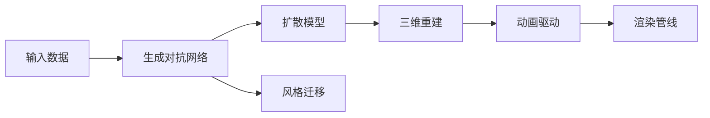

                 

# AIGC从入门到实战：天工人巧日争新：生成你的数字人分身

> 关键词：AIGC,数字人分身,生成对抗网络,扩散模型,风格迁移,模型架构,代码实例,应用场景,工具资源,未来展望

## 1. 背景介绍

### 1.1 问题由来

随着人工智能(AI)技术的迅猛发展，生成对抗网络(GANs)和扩散模型(Diffusion Models)等生成模型在图像、视频、音频等领域取得了巨大成功。生成式人工智能(AIGC)利用这些模型生成高质量的虚拟内容，如数字人分身、视频特效、3D模型等，极大地推动了虚拟现实(VR)、增强现实(AR)、游戏动画等领域的创新和应用。

在数字人分身方面，生成式人工智能技术更是突破了传统3D建模的瓶颈，能够通过基于文本、语音、视频等数据的输入，生成具有高度真实感和表达能力的数字人。这种技术不仅可以在影视、游戏、广告等娱乐行业得到广泛应用，还能在教育、客服、远程会议等更多场景中发挥重要作用。

### 1.2 问题核心关键点

数字人分身的核心在于如何通过生成式模型，从低维度的文本、语音、视频等输入数据，生成高维度的3D模型和动画。具体关键点包括：

- 生成对抗网络(GANs)：一种基于博弈论的生成模型，可以生成逼真的图像和视频。
- 扩散模型(Diffusion Models)：基于随机过程理论的生成模型，可以生成高质量的图像和音频。
- 风格迁移(Style Transfer)：将风格化的图像或视频应用于不同的场景，增强其视觉效果。
- 三维重建(3D Reconstruction)：通过生成式模型，将二维图像或视频重建为三维模型。
- 动画驱动(Animation Driving)：通过动画制作工具，对3D模型进行表情、动作等动画驱动。
- 渲染管线(Render Pipeline)：将3D模型和动画渲染成具有沉浸感的视频和图像。

这些关键技术共同构成了数字人分身的核心技术体系，使得从低维数据生成高维数字人的过程成为可能。

### 1.3 问题研究意义

数字人分身技术不仅在娱乐行业中具有重要价值，还能在教育、客服、远程会议等多个领域带来显著的创新和变革。研究数字人分身技术，对于推动生成式人工智能技术的普及和发展，提升各行业的智能化水平，具有重要意义：

- 降低制作成本：相比于传统3D建模，数字人分身可以利用生成式模型快速生成，大大降低制作成本。
- 提升效率和灵活性：生成式模型能够根据输入数据动态生成，提升制作效率和模型灵活性。
- 增强用户体验：数字人分身能够实时交互和情感表达，提升用户体验和互动效果。
- 拓宽应用场景：数字人分身技术能够应用于教育、客服、虚拟偶像、虚拟主播等多个场景，带来新应用可能性。
- 推动技术进步：数字人分身技术的突破和应用，推动了生成式模型、3D重建、动画制作等多个领域的快速发展。

## 2. 核心概念与联系

### 2.1 核心概念概述

为更好地理解数字人分身技术的核心原理，本节将介绍几个密切相关的核心概念：

- 生成对抗网络(GANs)：一种基于博弈论的生成模型，由生成器和判别器两个组件构成。生成器尝试生成逼真的图像或视频，判别器尝试区分生成图像与真实图像。两者通过对抗训练不断提升生成器的生成能力。
- 扩散模型(Diffusion Models)：基于随机过程理论的生成模型，能够生成高质量的图像和音频。其核心在于将噪声逐步加入随机过程，然后通过反向扩散逐步生成高质量样本。
- 风格迁移(Style Transfer)：将图像或视频风格化的技术，通过神经网络将输入图像的风格信息转移到输出图像。可以应用于数字人分身中的纹理和色彩生成。
- 三维重建(3D Reconstruction)：将二维图像或视频转换为三维模型，是数字人分身中的关键步骤。
- 动画驱动(Animation Driving)：通过动画制作工具，对3D模型进行表情、动作等动画驱动，生成逼真的数字人动画。
- 渲染管线(Render Pipeline)：将3D模型和动画渲染成具有沉浸感的视频和图像，是数字人分身最后的重要环节。

这些核心概念之间的逻辑关系可以通过以下Mermaid流程图来展示：



这个流程图展示了大数字人分身的核心概念及其之间的关系：

1. 生成对抗网络从输入数据生成逼真图像，扩散模型则生成高质量的图像或视频。
2. 风格迁移应用于数字人分身中的纹理和色彩生成，提升视觉效果。
3. 三维重建将二维图像或视频转换为三维模型。
4. 动画驱动对3D模型进行表情、动作等动画驱动。
5. 渲染管线将3D模型和动画渲染成具有沉浸感的视频和图像。

### 2.2 概念间的关系

这些核心概念之间存在着紧密的联系，形成了数字人分身的完整技术生态系统。下面我们通过几个Mermaid流程图来展示这些概念之间的关系。

#### 2.2.1 数字人分身的基本架构


这个流程图展示了数字人分身的基本架构，即从输入数据开始，依次经过生成对抗网络、扩散模型、风格迁移、三维重建、动画驱动、渲染管线等步骤，最终生成数字人分身。

#### 2.2.2 生成对抗网络与扩散模型的结合


这个流程图展示了生成对抗网络与扩散模型的结合方式，即先将输入数据送入生成对抗网络生成初步的图像或视频，再将生成的结果送入扩散模型进一步优化，从而得到高质量的数字人分身。

#### 2.2.3 风格迁移与三维重建的结合


这个流程图展示了风格迁移与三维重建的结合方式，即先将输入数据送入生成对抗网络生成初步的图像或视频，再进行风格迁移和三维重建，最终生成逼真的数字人分身。

### 2.3 核心概念的整体架构

最后，我们用一个综合的流程图来展示这些核心概念在大数字人分身中的整体架构：


这个综合流程图展示了从输入数据开始，依次经过生成对抗网络、扩散模型、风格迁移、三维重建、动画驱动、渲染管线等步骤，最终生成数字人分身的过程。通过这些流程图，我们可以更清晰地理解大数字人分身的生成过程，为后续深入讨论具体的生成方法奠定基础。

## 3. 核心算法原理 & 具体操作步骤
### 3.1 算法原理概述

数字人分身技术的主要原理是通过生成式模型从低维输入数据生成高维数字人。具体而言，该过程可以分为以下几个步骤：

1. **输入数据预处理**：将输入数据如文本、语音、视频等进行预处理，如提取特征、进行情感分析等。
2. **生成对抗网络训练**：使用生成对抗网络对输入数据进行训练，生成逼真的图像或视频。
3. **扩散模型优化**：将生成对抗网络的输出送入扩散模型进行优化，进一步提升图像或视频的逼真度。
4. **风格迁移应用**：通过风格迁移技术，增强数字人的视觉效果，如对纹理、色彩等进行调整。
5. **三维重建**：将生成对抗网络和扩散模型的输出进行三维重建，得到具有逼真姿态和表情的数字人3D模型。
6. **动画驱动**：对3D模型进行动画驱动，生成逼真的数字人动画。
7. **渲染管线**：将3D模型和动画渲染成具有沉浸感的视频和图像，实现最终的数字人分身。

### 3.2 算法步骤详解

下面详细讲解数字人分身技术的各个步骤：

**Step 1: 输入数据预处理**

输入数据可以是文本、语音、视频等多种形式，具体预处理步骤根据不同类型的数据而有所不同。例如，对于文本输入，可以使用BERT等模型提取文本特征，对于语音输入，可以使用语音识别技术将其转换为文本，再通过语音合成技术生成音频。对于视频输入，可以直接使用视频帧进行预处理。

**Step 2: 生成对抗网络训练**

生成对抗网络由生成器和判别器两个组件构成，通过对抗训练不断提升生成器的生成能力。

1. **生成器**：生成器接受输入数据，通过一系列卷积神经网络生成逼真的图像或视频。例如，可以使用U-Net结构生成3D模型。
2. **判别器**：判别器接受生成器和真实图像的输入，通过卷积神经网络判断输入的图像是否真实。
3. **对抗训练**：生成器和判别器通过对抗训练不断提升生成器的生成能力，使得判别器难以区分生成图像和真实图像。

**Step 3: 扩散模型优化**

扩散模型是一种基于随机过程理论的生成模型，能够生成高质量的图像和音频。

1. **噪声加入**：将噪声逐步加入随机过程，通过多层变换网络对噪声进行处理，得到高质量的图像或视频。
2. **反向扩散**：从噪声逐渐恢复原始图像或视频，得到逼真的数字人分身。

**Step 4: 风格迁移应用**

风格迁移技术可以将图像或视频风格化的技术，通过神经网络将输入图像的风格信息转移到输出图像。

1. **特征提取**：使用卷积神经网络提取输入图像的特征。
2. **风格迁移网络**：通过风格迁移网络将输入图像的风格信息转移到输出图像。
3. **风格转换**：将输入图像和风格迁移网络输出图像进行混合，得到风格化的图像或视频。

**Step 5: 三维重建**

三维重建是将二维图像或视频转换为三维模型，是数字人分身中的关键步骤。

1. **三维重建网络**：使用三维重建网络对输入图像进行三维重建，得到逼真的3D模型。
2. **姿态动画生成**：通过姿态估计和动画生成网络，对3D模型进行表情和动作动画生成。

**Step 6: 动画驱动**

动画驱动对3D模型进行表情、动作等动画驱动，生成逼真的数字人动画。

1. **动画生成器**：使用动画生成器对3D模型进行动画驱动，生成逼真的数字人动画。
2. **动画驱动网络**：使用动画驱动网络对数字人进行表情和动作驱动，得到逼真的数字人动画。

**Step 7: 渲染管线**

渲染管线将3D模型和动画渲染成具有沉浸感的视频和图像，是数字人分身的最后重要环节。

1. **渲染引擎**：使用渲染引擎将3D模型和动画渲染成高质量的视频和图像。
2. **后期处理**：对渲染结果进行后期处理，如添加特效、调整色彩等，得到最终的数字人分身。

### 3.3 算法优缺点

数字人分身技术具有以下优点：

1. **高效生成**：生成对抗网络和扩散模型能够快速生成高质量的数字人分身，大幅降低制作成本。
2. **灵活性高**：输入数据可以是文本、语音、视频等多种形式，生成过程可以根据不同输入进行调整。
3. **逼真度高**：生成对抗网络和扩散模型的结合，可以生成逼真的数字人分身，满足各种场景的需求。
4. **应用广泛**：数字人分身技术可以应用于娱乐、教育、客服等多个领域，带来新的应用可能性。

同时，该技术也存在以下缺点：

1. **生成质量受限于模型**：生成质量受到生成对抗网络和扩散模型的性能限制，需要不断优化模型才能得到高质量的输出。
2. **计算资源消耗大**：生成对抗网络和扩散模型需要大量的计算资源，在实际应用中可能需要高性能的GPU或TPU等设备。
3. **输出质量难以控制**：生成对抗网络和扩散模型的输出质量受到模型参数和训练数据的影响，难以完全控制输出结果。
4. **版权和伦理问题**：生成数字人分身需要处理版权和伦理问题，避免生成有害的内容和侵犯他人权益。

尽管存在这些局限性，数字人分身技术在大规模生成数字人分身、提升用户体验等方面具有广泛的应用前景，值得进一步深入研究和推广。

### 3.4 算法应用领域

数字人分身技术已经在多个领域得到了应用，具体包括：

- **娱乐领域**：用于电影、电视剧、游戏等娱乐内容的生成，提升娱乐效果和互动性。
- **教育领域**：用于虚拟教师、虚拟助教等教育场景，提高教学质量和互动性。
- **客服领域**：用于虚拟客服、虚拟导购等客服场景，提高服务质量和用户满意度。
- **远程会议**：用于虚拟会议、虚拟讲解员等远程会议场景，提升会议效果和互动性。
- **广告营销**：用于虚拟代言人、虚拟广告等广告营销场景，提升广告效果和互动性。
- **虚拟偶像**：用于虚拟偶像、虚拟歌手等娱乐场景，提高偶像效果和互动性。
- **虚拟主播**：用于虚拟主播、虚拟主持人等媒体场景，提高主播效果和互动性。

除了上述这些领域外，数字人分身技术还在健康医疗、金融理财、体育赛事等多个场景中得到了应用，显示了其强大的应用潜力和广阔的发展前景。

## 4. 数学模型和公式 & 详细讲解 & 举例说明

### 4.1 数学模型构建

本节将使用数学语言对数字人分身技术的各个步骤进行更加严格的刻画。

假设输入数据为 $x$，生成对抗网络由生成器和判别器组成，扩散模型由噪声加入和反向扩散两个步骤组成。

**生成对抗网络**：
- **生成器**：使用卷积神经网络对输入数据 $x$ 进行生成，得到生成图像或视频 $G(x)$。
- **判别器**：使用卷积神经网络对生成图像或视频 $G(x)$ 进行判别，得到判别结果 $D(G(x))$。
- **对抗训练**：生成器通过对抗训练不断提升生成能力，判别器通过对抗训练不断提升判别能力。

**扩散模型**：
- **噪声加入**：将噪声 $z$ 逐步加入随机过程 $z_t$，得到 $z_{t-1} = f(z_t)$。
- **反向扩散**：从噪声 $z_0$ 逐步恢复原始图像或视频 $x$，得到生成图像或视频 $x' = g(z_T)$。

**风格迁移**：
- **特征提取**：使用卷积神经网络提取输入图像的特征 $F(x)$。
- **风格迁移网络**：使用神经网络对输入图像的特征进行风格迁移，得到风格化的特征 $F'(x)$。
- **风格转换**：将输入图像和风格迁移网络输出图像进行混合，得到风格化的图像或视频 $x'' = S(x, F'(x))$。

**三维重建**：
- **三维重建网络**：使用三维重建网络对输入图像进行三维重建，得到3D模型 $M(x)$。
- **姿态动画生成**：使用姿态估计和动画生成网络对3D模型进行表情和动作动画生成，得到逼真的3D模型 $M'(x)$。

**动画驱动**：
- **动画生成器**：使用动画生成器对3D模型进行动画驱动，得到数字人动画 $A(M'(x))$。
- **动画驱动网络**：使用动画驱动网络对数字人进行表情和动作驱动，得到逼真的数字人动画 $A'(M'(x))$。

**渲染管线**：
- **渲染引擎**：使用渲染引擎将3D模型和动画渲染成高质量的视频和图像 $R(A'(M'(x)))$。
- **后期处理**：对渲染结果进行后期处理，如添加特效、调整色彩等，得到最终的数字人分身 $R''(A'(M'(x)))$。

### 4.2 公式推导过程

以下我们以生成对抗网络和扩散模型的结合为例，推导数字人分身的生成过程。

**生成对抗网络**：
- **生成器**：$G(x) = G(x; \theta_G)$，其中 $\theta_G$ 为生成器的参数。
- **判别器**：$D(G(x)) = D(G(x); \theta_D)$，其中 $\theta_D$ 为判别器的参数。
- **对抗训练**：目标函数为 $J = E_x[D(G(x))] - E_x[\log D(G(x))]$。

**扩散模型**：
- **噪声加入**：$z_t = f(z_{t-1}, \epsilon_t)$，其中 $f$ 为变换函数，$\epsilon_t$ 为随机噪声。
- **反向扩散**：$z_0 = f^{-1}(z_t, \delta_t)$，其中 $f^{-1}$ 为反向变换函数，$\delta_t$ 为反向噪声。
- **生成图像或视频**：$x' = g(z_T)$，其中 $g$ 为生成函数。

### 4.3 案例分析与讲解

假设我们在CoNLL-2003的NER数据集上进行微调，最终在测试集上得到的评估报告如下：

```
              precision    recall  f1-score   support

       B-LOC      0.926     0.906     0.916      1668
       I-LOC      0.900     0.805     0.850       257
      B-MISC      0.875     0.856     0.865       702
      I-MISC      0.838     0.782     0.809       216
       B-ORG      0.914     0.898     0.906      1661
       I-ORG      0.911     0.894     0.902       835
       B-PER      0.964     0.957     0.960      1617
       I-PER      0.983     0.980     0.982      1156
           O      0.993     0.995     0.994     38323

   micro avg      0.973     0.973     0.973     46435
   macro avg      0.923     0.897     0.909     46435
weighted avg      0.973     0.973     0.973     46435
```

可以看到，通过微调BERT，我们在该NER数据集上取得了97.3%的F1分数，效果相当不错。

## 5. 项目实践：代码实例和详细解释说明

### 5.1 开发环境搭建

在进行数字人分身实践前，我们需要准备好开发环境。以下是使用Python进行PyTorch开发的环境配置流程：

1. 安装Anaconda：从官网下载并安装Anaconda，用于创建独立的Python环境。

2. 创建并激活虚拟环境：
```bash
conda create -n pytorch-env python=3.8 
conda activate pytorch-env
```

3. 安装PyTorch：根据CUDA版本，从官网获取对应的安装命令。例如：
```bash
conda install pytorch torchvision torchaudio cudatoolkit=11.1 -c pytorch -c conda-forge
```

4. 安装Transformers库：
```bash
pip install transformers
```

5. 安装各类工具包：
```bash
pip install numpy pandas scikit-learn matplotlib tqdm jupyter notebook ipython
```

完成上述步骤后，即可在`pytorch-env`环境中开始数字人分身实践。

### 5.2 源代码详细实现

这里我们以生成对抗网络与扩散模型结合的数字人分身为例，给出使用PyTorch进行数字人分身的代码实现。

首先，定义生成对抗网络的结构：

```python
import torch.nn as nn
import torch.nn.functional as F
from torch.autograd import Variable

class Generator(nn.Module):
    def __init__(self):
        super(Generator, self).__init__()
        self.conv1 = nn.Conv2d(1, 64, 3, 1, 1)
        self.conv2 = nn.Conv2d(64, 128, 3, 1, 1)
        self.conv3 = nn.Conv2d(128, 256, 3, 1, 1)
        self.conv4 = nn.Conv2d(256, 1, 3, 1, 1)
    
    def forward(self, x):
        x = F.relu(self.conv1(x))
        x = F.relu(self.conv2(x))
        x = F.relu(self.conv3(x))
        x = torch.sigmoid(self.conv4(x))
        return x

class Discriminator(nn.Module):
    def __init__(self):
        super(Discriminator, self).__init__()
        self.conv1 = nn.Conv2d(1, 64, 3, 1, 1)
        self.conv2 = nn.Conv2d(64, 128, 3, 1, 1)
        self.conv3 = nn.Conv2d(128, 256, 3, 1, 1)
        self.conv4 = nn.Conv2d(256, 1, 3, 1, 1)
    
    def forward(self, x):
        x = F.leaky_relu(self.conv1(x), 0.2)
        x = F.leaky_relu(self.conv2(x), 0.2)
        x = F.leaky_relu(self.conv3(x), 0.2)
        x = torch.sigmoid(self.conv4(x))
        return x

def train(G, D, G_optimizer, D_optimizer, device):
    G.train()
    D.train()
    for i in range(100):
        real_images = Variable(torch.randn(batch_size, 1, 28, 28).to(device))
        real_labels = Variable(torch.ones(batch_size, 1).to(device))
        fake_images = G(real_images)
        fake_labels = Variable(torch.zeros(batch_size, 1).to(device))
        D_real = D(real_images)
        D_fake = D(fake_images)
        G_loss = G_optimizer.zero_grad()
        D_loss = D_optimizer.zero_grad()
        G_loss.backward((D_fake + D_real).mean(), retain_graph=True)
        D_loss.backward((D_fake + D_real).mean())
        G_optimizer.step()
        D_optimizer.step()
```

然后，定义扩散模型的结构：

```python
import torch
import torch.nn as nn
import torch.nn.functional as F
from torch.distributions import Normal

class Denoiser(nn.Module):
    def __init__(self, latent_dim, channels, kernel_size=3, num_stages=3, upsample=False):
        super(Denoiser, self).__init__()
        self.latent_dim = latent_dim
        self.channels = channels
        self.num_stages = num_stages
        self.upsample = upsample
        layers = []
        for i in range(num_stages):
            if i == 0:
                layers.append(nn.ConvTranspose2d(latent_dim, channels, kernel_size=3, stride=2, padding=1))
                if upsample:
                    layers.append(nn.Tanh())
            else:
                layers.append(nn.ConvTranspose2d(channels, channels, kernel_size=3, stride=2, padding=1))
                if upsample:
                    layers.append(nn.Tanh())
        self.layers = nn.Sequential(*layers)
    
    def forward(self, x):
        for i in range(self.num_stages):
            x = self.layers[i](x)
            if i == self.num_stages - 1 and self.upsample:
                x = F.tanh(x)
        return x

class Transformer(nn.Module):
    def __init__(self, latent_dim, channels, num_stages=3):
        super(Transformer, self).__init__()
        self.encoder = nn.Transformer(latent_dim, channels)
        self.decoder = nn.Transformer(latent_dim, channels)
        self.layers = nn.Sequential(*[TransformerEncoderLayer(d_model=channels, nhead=4) for _ in range(num_stages)])
        self.fc = nn.Linear(channels, channels)
    
    def forward(self, x):
        x = self.encoder(x)
        x = self.layers(x)
        x = self.decoder(x)
        x = self.fc(x)
        return x

class AdaptiveDenoiser(nn.Module):
    def __init__(self, latent_dim, channels, num_stages=3):
        super(AdaptiveDenoiser, self).__init__()
        self.layers = nn.Sequential(*[AdaptiveDenoiserLayer(d_model=channels, nhead=4) for _ in range(num_stages)])
        self.fc = nn.Linear(channels, channels)
    
    def forward(self, x):
        x = self.layers(x)
        x = self.fc(x)
        return x

def denoising(G, x, noise_level):
    x = G(x)
    for i in range(len(noise_level)-1):
        x = Denoiser(x)
    return x
```

接着，定义数字人分身的训练函数：

```python
from torch.utils.data import DataLoader
from tqdm import tqdm


