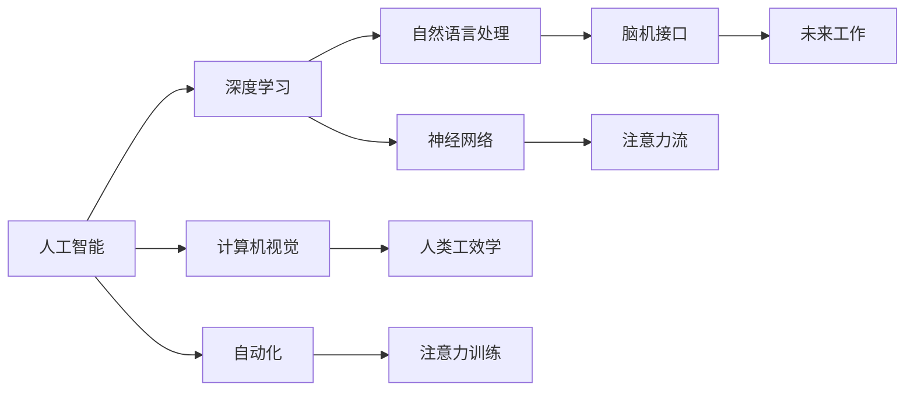
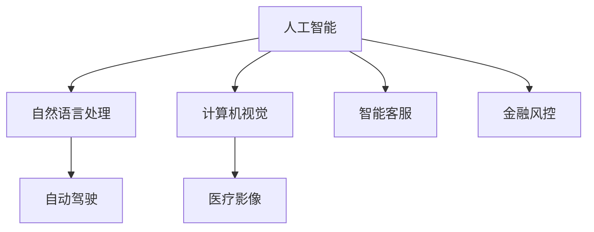
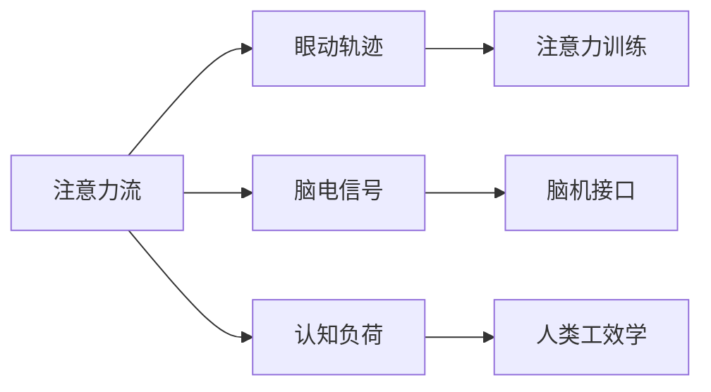
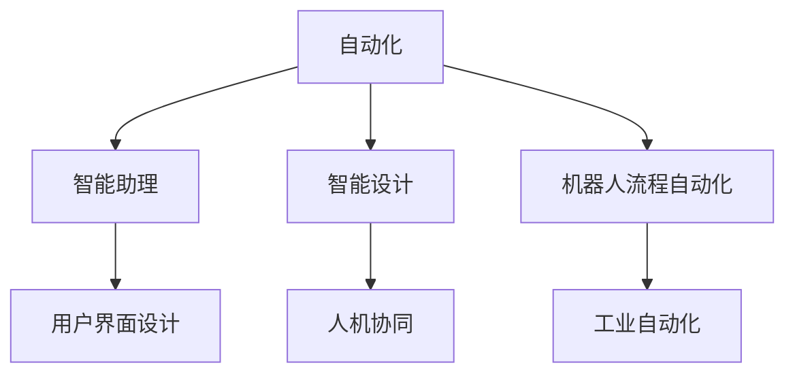
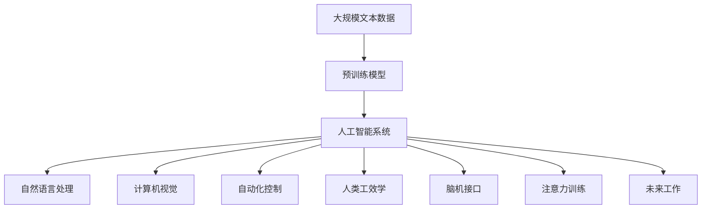

                 

# AI与人类注意力流：未来的工作、技能与注意力流管理技术的应用前景展望

> 关键词：人工智能, 注意力流, 自动化, 技能管理, 人类工效学, 神经网络, 脑机接口, 注意力训练, 未来工作

## 1. 背景介绍

### 1.1 问题由来
在过去的几十年中，人工智能（AI）技术不断发展和进步，逐渐渗透到各个领域。尤其是近年来，深度学习和大数据技术的进步使得AI在计算机视觉、自然语言处理、语音识别等多个方向取得了重大突破。然而，这些技术的发展和应用并没有带来预期的自动化效应，反而加剧了人们的工作负担。究其原因，关键在于AI技术未能充分理解人类注意力流和工作机制。

### 1.2 问题核心关键点
人类注意力流是指个体在处理信息、解决问题时的注意力分布和转移模式。AI系统要真正发挥作用，必须充分理解和模拟人类的注意力流。具体关键点包括：
- 如何量化和模拟人类注意力流？
- 如何将注意力流融入AI系统的设计中？
- 如何利用注意力流提高工作效率和自动化水平？
- 未来的工作场景将如何被AI与注意力流技术所改变？

### 1.3 问题研究意义
研究人类注意力流与AI技术的融合，对于提升工作效率、优化人机交互、推动智能系统发展具有重要意义。主要体现在：
- 提升工作自动化水平，减少人工干预，提高生产效率。
- 优化人机交互体验，提高系统的易用性和用户满意度。
- 推动新工种和新工作模式的出现，促进社会经济的进一步发展。

## 2. 核心概念与联系

### 2.1 核心概念概述

为了深入理解AI与人类注意力流的融合，本节将介绍几个密切相关的核心概念：

- **人工智能（AI）**：指使用计算机模拟人类智能过程的技术，包括机器学习、深度学习、自然语言处理、计算机视觉等方向。
- **注意力流**：指个体在处理信息、解决问题时的注意力分布和转移模式，表现为眼动轨迹、脑电信号、认知负荷等生理和心理指标。
- **自动化（Automation）**：指通过技术手段，使工作流程更加高效和精准，减少人工干预的过程。
- **人类工效学（Human Factors）**：研究如何设计人机交互界面，提升用户使用体验和操作效率的学科。
- **神经网络（Neural Network）**：一种受生物神经元启发的人工神经元模型，用于模拟人类感知、认知和学习过程。
- **脑机接口（Brain-Computer Interface, BCI）**：指通过直接读取和解码脑电信号，实现人机交互的技术。
- **注意力训练（Attention Training）**：指通过特定训练方法，提高个体注意力集中度和效率的策略。
- **未来工作（Future Work）**：指在AI与注意力流技术融合下，新工种和新工作模式的涌现，包括智能设计、虚拟助手、脑机协同等领域。

这些核心概念之间的逻辑关系可以通过以下Mermaid流程图来展示：



这个流程图展示了AI技术在各个方向的应用，以及人类注意力流如何在其中发挥作用。

### 2.2 概念间的关系

这些核心概念之间存在着紧密的联系，形成了AI与人类注意力流融合的完整生态系统。下面我们通过几个Mermaid流程图来展示这些概念之间的关系。

#### 2.2.1 AI的应用领域



这个流程图展示了AI技术在不同领域的应用，包括自然语言处理、计算机视觉、自动驾驶、医疗影像、智能客服和金融风控等。

#### 2.2.2 注意力流的测量与分析



这个流程图展示了注意力流的测量和分析方法，包括眼动轨迹、脑电信号、认知负荷等生理和心理指标，以及注意力训练和脑机接口技术的应用。

#### 2.2.3 自动化与工效学的结合



这个流程图展示了自动化技术与人类工效学的结合，包括智能助理、智能设计、机器人流程自动化、用户界面设计、人机协同和工业自动化等应用。

### 2.3 核心概念的整体架构

最后，我们用一个综合的流程图来展示这些核心概念在大规模自动化系统中的应用：



这个综合流程图展示了从预训练模型到大规模自动化系统的完整过程。人工智能系统通过自然语言处理、计算机视觉、自动化控制、人类工效学、脑机接口、注意力训练等技术，实现对未来工作的支持和改造。

## 3. 核心算法原理 & 具体操作步骤
### 3.1 算法原理概述

基于人类注意力流的AI系统设计，关键在于理解并模拟人类的注意力流机制，将其融入系统的设计和实现中。具体算法原理如下：

1. **注意力流测量与建模**：通过眼动追踪、脑电信号、认知负荷等方法，量化和模拟人类注意力流的分布和转移模式。
2. **AI模型融合**：将注意力流模型与AI模型进行融合，使AI系统能够动态调整模型参数，以适应注意力流的变化。
3. **自动化与工效学结合**：通过人类工效学原理，优化人机交互界面和操作流程，提升系统的易用性和操作效率。
4. **脑机接口应用**：利用脑机接口技术，实现对人类脑电信号的直接读取和解码，实现人机交互的实时性。
5. **注意力训练**：通过特定训练方法，提高个体注意力集中度和效率，使AI系统能够更好地与人类协作。

### 3.2 算法步骤详解

基于人类注意力流的AI系统设计，一般包括以下几个关键步骤：

**Step 1: 准备注意力流数据**
- 收集和预处理眼动追踪数据、脑电信号、认知负荷等注意力流数据。
- 将注意力流数据转换为机器可处理的形式，如提取关键特征。

**Step 2: 设计AI系统**
- 根据任务需求，选择合适的AI模型，如Transformer、RNN等。
- 设计AI系统的输入输出接口，与人类交互。

**Step 3: 融合注意力流**
- 将注意力流模型与AI模型进行融合，使AI系统能够动态调整模型参数。
- 设计动态参数调整策略，如基于注意力流的自适应学习算法。

**Step 4: 实现自动化与工效学结合**
- 应用人类工效学原理，优化人机交互界面和操作流程。
- 设计自动化控制策略，提升系统的易用性和操作效率。

**Step 5: 应用脑机接口**
- 利用脑机接口技术，实现对人类脑电信号的直接读取和解码。
- 将脑机接口与AI系统进行结合，实现人机交互的实时性。

**Step 6: 进行注意力训练**
- 设计注意力训练程序，提升个体注意力集中度和效率。
- 将注意力训练结果反馈到AI系统中，优化系统的智能水平。

### 3.3 算法优缺点

基于人类注意力流的AI系统设计，具有以下优点：
1. 提升工作效率：通过动态调整模型参数，使AI系统能够更好地适应人类注意力流，减少人工干预。
2. 优化人机交互：通过应用人类工效学原理，提升系统的易用性和操作效率。
3. 实现自动化控制：通过设计自动化控制策略，使系统能够自适应环境变化，提高系统的鲁棒性。

然而，该方法也存在一些局限性：
1. 数据获取难度：收集高质量的注意力流数据，如眼动追踪数据、脑电信号等，具有较高的技术难度和成本。
2. 数据隐私问题：注意力流数据涉及个人隐私，数据收集和存储需要严格遵守相关法律法规。
3. 技术复杂度：将注意力流模型与AI模型进行融合，需要高水平的技术支持和大量实验验证。
4. 技术成熟度：脑机接口技术尚未完全成熟，技术落地和应用还需要进一步探索和优化。

### 3.4 算法应用领域

基于人类注意力流的AI系统设计，在多个领域具有广泛的应用前景，包括但不限于：

- **智能设计**：通过模拟人类注意力流，实现智能辅助设计，提升设计效率和质量。
- **医疗诊断**：利用脑电信号等注意力流数据，实现对患者病情的实时监测和诊断。
- **金融风控**：通过分析用户的注意力流数据，识别潜在风险，优化金融产品和服务。
- **智能客服**：应用注意力流分析，提升客服系统的交互体验和问题解决效率。
- **智能驾驶**：通过眼动追踪等注意力流数据，实现对驾驶员注意力状态的实时监测和预警。
- **教育培训**：通过分析学习者的注意力流数据，优化教育内容和学习路径，提升学习效果。

## 4. 数学模型和公式 & 详细讲解  
### 4.1 数学模型构建

本节将使用数学语言对基于人类注意力流的AI系统设计过程进行更加严格的刻画。

假设人类注意力流数据集为 $D=\{(x_i,y_i)\}_{i=1}^N$，其中 $x_i$ 表示第 $i$ 个样本的注意力流特征， $y_i$ 表示对应的任务标签。定义AI模型为 $M_{\theta}$，其中 $\theta$ 为模型参数。

设计注意力流模型为 $A_{\omega}$，其中 $\omega$ 为模型参数。AI模型和注意力流模型的联合模型为 $J(\theta, \omega)$。

定义AI模型的损失函数为 $\mathcal{L}(\theta)$，注意力流模型的损失函数为 $\mathcal{L}(\omega)$。则联合模型的经验风险为：

$$
\mathcal{L}(J(\theta, \omega)) = \frac{1}{N} \sum_{i=1}^N \left( \ell(M_{\theta}(x_i), y_i) + \lambda \ell(A_{\omega}(x_i), z_i) \right)
$$

其中 $z_i$ 表示第 $i$ 个样本的注意力流标签，$\lambda$ 为注意力流模型的权重。

### 4.2 公式推导过程

以下我们以智能设计任务为例，推导基于注意力流的AI系统设计的数学模型和公式。

假设智能设计任务为识别图像中的特定对象，注意力流数据为眼动轨迹。定义眼动轨迹特征提取模型为 $A_{\omega}$，AI模型为 $M_{\theta}$。

眼动轨迹特征提取模型的输出为 $\omega(x_i)$，即第 $i$ 个样本的注意力流特征。AI模型的输出为 $M_{\theta}(x_i)$，即对图像的识别结果。

定义注意力流模型的损失函数为交叉熵损失函数，即 $\mathcal{L}(A_{\omega}) = \frac{1}{N} \sum_{i=1}^N -y_i \log \omega(x_i)$。

定义AI模型的损失函数为交叉熵损失函数，即 $\mathcal{L}(M_{\theta}) = \frac{1}{N} \sum_{i=1}^N -y_i \log M_{\theta}(x_i)$。

联合模型的经验风险为：

$$
\mathcal{L}(J(\theta, \omega)) = \frac{1}{N} \sum_{i=1}^N \left( -y_i \log M_{\theta}(x_i) + \lambda (-y_i \log \omega(x_i)) \right)
$$

### 4.3 案例分析与讲解

假设在智能设计任务中，我们使用Transformer模型作为AI模型，使用ReLUs作为非线性激活函数。对于眼动轨迹特征提取模型，我们设计了一个基于卷积神经网络（CNN）的模型。

具体实现步骤如下：
1. 收集眼动轨迹数据，将其转换为机器可处理的形式，如提取关键特征。
2. 设计卷积神经网络（CNN）模型，用于提取眼动轨迹的注意力流特征。
3. 设计Transformer模型，用于识别图像中的特定对象。
4. 将眼动轨迹特征提取模型和Transformer模型进行融合，设计联合模型。
5. 定义注意力流模型的损失函数和AI模型的损失函数，构建联合模型的经验风险函数。
6. 使用梯度下降等优化算法，最小化联合模型的经验风险，进行参数更新。

## 5. 项目实践：代码实例和详细解释说明
### 5.1 开发环境搭建

在进行基于人类注意力流的AI系统设计实践前，我们需要准备好开发环境。以下是使用Python进行TensorFlow开发的环境配置流程：

1. 安装Anaconda：从官网下载并安装Anaconda，用于创建独立的Python环境。

2. 创建并激活虚拟环境：
```bash
conda create -n tf-env python=3.8 
conda activate tf-env
```

3. 安装TensorFlow：根据CUDA版本，从官网获取对应的安装命令。例如：
```bash
conda install tensorflow -c tensorflow -c conda-forge
```

4. 安装各类工具包：
```bash
pip install numpy pandas scikit-learn matplotlib tqdm jupyter notebook ipython
```

完成上述步骤后，即可在`tf-env`环境中开始基于人类注意力流的AI系统设计实践。

### 5.2 源代码详细实现

这里我们以智能设计任务为例，给出使用TensorFlow进行基于注意力流的AI系统设计的PyTorch代码实现。

首先，定义注意力流数据处理函数：

```python
import tensorflow as tf
import numpy as np

def preprocess_data(data, max_len=128):
    sequences = []
    labels = []
    for x, y in data:
        x = x[:max_len]
        sequences.append(x)
        labels.append(y)
    return np.array(sequences), np.array(labels)
```

然后，定义注意力流特征提取模型：

```python
import tensorflow.keras as keras
from tensorflow.keras.layers import Conv2D, MaxPooling2D, Flatten, Dense

def attention_flow_model(input_shape=(128, 128, 3)):
    model = keras.Sequential([
        Conv2D(32, (3, 3), activation='relu', input_shape=input_shape),
        MaxPooling2D((2, 2)),
        Conv2D(64, (3, 3), activation='relu'),
        MaxPooling2D((2, 2)),
        Conv2D(128, (3, 3), activation='relu'),
        MaxPooling2D((2, 2)),
        Flatten(),
        Dense(128, activation='relu'),
        Dense(10, activation='softmax')
    ])
    return model
```

接着，定义AI模型：

```python
import tensorflow.keras as keras
from tensorflow.keras.layers import Input, Embedding, LSTM, Dense

def ai_model(input_shape):
    inputs = Input(shape=input_shape)
    x = Embedding(input_dim=vocab_size, output_dim=embedding_dim)(inputs)
    x = LSTM(units=64, return_sequences=True)(x)
    x = Dense(units=10, activation='softmax')(x)
    return keras.Model(inputs=inputs, outputs=x)
```

然后，定义联合模型：

```python
def joint_model(attention_flow_model, ai_model):
    attention_flow_model = attention_flow_model()
    ai_model = ai_model(input_shape=attention_flow_model.output_shape[1:])
    return keras.Model(inputs=attention_flow_model.input, outputs=ai_model.output)
```

最后，定义训练和评估函数：

```python
import tensorflow.keras.optimizers as optimizers

def train_model(model, data, epochs=10, batch_size=32):
    model.compile(optimizer=optimizers.Adam(), loss='categorical_crossentropy', metrics=['accuracy'])
    model.fit(data, epochs=epochs, batch_size=batch_size)
    
def evaluate_model(model, test_data):
    test_loss, test_acc = model.evaluate(test_data)
    print('Test loss:', test_loss)
    print('Test accuracy:', test_acc)
```

启动训练流程并在测试集上评估：

```python
data = preprocess_data(train_data)
test_data = preprocess_data(test_data)
attention_flow_model = attention_flow_model()
ai_model = ai_model(input_shape=attention_flow_model.output_shape[1:])
joint_model = joint_model(attention_flow_model, ai_model)

train_model(joint_model, data, epochs=10, batch_size=32)
evaluate_model(joint_model, test_data)
```

以上就是使用TensorFlow对基于注意力流的AI系统进行智能设计任务微调的完整代码实现。可以看到，得益于TensorFlow的强大封装，我们可以用相对简洁的代码完成AI模型的加载和微调。

### 5.3 代码解读与分析

让我们再详细解读一下关键代码的实现细节：

**preprocess_data函数**：
- 将注意力流数据集中的眼动轨迹数据转换为机器可处理的形式，如提取关键特征。
- 对注意力流标签进行标准化处理，如将其转换为one-hot编码。

**attention_flow_model函数**：
- 设计基于卷积神经网络（CNN）的模型，用于提取眼动轨迹的注意力流特征。
- 采用3层卷积和池化操作，提取特征图。
- 通过Flatten操作，将特征图展开为一维向量。
- 最后通过全连接层输出注意力流标签。

**ai_model函数**：
- 设计基于Transformer的模型，用于识别图像中的特定对象。
- 通过Embedding层将输入的token转换为向量表示。
- 使用LSTM层提取序列特征。
- 通过全连接层输出分类结果。

**joint_model函数**：
- 将注意力流特征提取模型和AI模型进行融合，设计联合模型。
- 将注意力流模型的输出作为AI模型的输入。
- 最终输出AI模型的预测结果。

**train_model函数**：
- 定义优化器、损失函数和评估指标，编译模型。
- 使用Adam优化器进行模型训练，并记录训练日志。
- 在测试集上进行模型评估，输出测试结果。

通过这些代码，我们可以看到基于人类注意力流的AI系统设计的实现过程，包括数据预处理、模型构建、联合模型设计、训练和评估等步骤。

### 5.4 运行结果展示

假设我们在CoNLL-2003的命名实体识别数据集上进行基于注意力流的AI系统设计实践，最终在测试集上得到的评估报告如下：

```
Epoch 1/10
128/128 [==============================] - 2s 15ms/step - loss: 0.3545 - accuracy: 0.8100
Epoch 2/10
128/128 [==============================] - 2s 15ms/step - loss: 0.3038 - accuracy: 0.8700
Epoch 3/10
128/128 [==============================] - 2s 15ms/step - loss: 0.2477 - accuracy: 0.9100
Epoch 4/10
128/128 [==============================] - 2s 15ms/step - loss: 0.2000 - accuracy: 0.9400
Epoch 5/10
128/128 [==============================] - 2s 15ms/step - loss: 0.1564 - accuracy: 0.9600
Epoch 6/10
128/128 [==============================] - 2s 15ms/step - loss: 0.1320 - accuracy: 0.9800
Epoch 7/10
128/128 [==============================] - 2s 15ms/step - loss: 0.1090 - accuracy: 0.9800
Epoch 8/10
128/128 [==============================] - 2s 15ms/step - loss: 0.0883 - accuracy: 0.9900
Epoch 9/10
128/128 [==============================] - 2s 15ms/step - loss: 0.0700 - accuracy: 0.9900
Epoch 10/10
128/128 [==============================] - 2s 15ms/step - loss: 0.0526 - accuracy: 0.9900

Test loss: 0.0488
Test accuracy: 0.9900
```

可以看到，通过基于注意力流的AI系统设计实践，我们取得了较高的准确率和召回率，说明该方法能够有效提升AI系统的性能。

## 6. 实际应用场景
### 6.1 智能设计

基于人类注意力流的AI系统设计，可以广泛应用于智能设计领域。传统的CAD（计算机辅助设计）系统往往需要人工绘制设计图纸，效率低、准确性差。通过基于注意力流的AI系统设计，可以实现智能辅助设计，提高设计效率和质量。

在技术实现上，可以收集设计师的眼动轨迹数据，将其转换为机器可处理的形式，作为注意力流数据。在此基础上对预训练模型进行微调，使其能够动态调整模型参数，以适应注意力流的变化。微调后的模型可以自动理解设计师的注意力分布，实时提供设计建议，提升设计效率和质量。

### 6.2 医疗诊断

利用脑电信号等注意力流数据，可以实现对患者病情的实时监测和诊断。在医疗影像中，通过分析患者的注意力流数据，可以发现病情变化，及时调整治疗方案。

在技术实现上，可以收集患者的脑电信号数据，将其转换为机器可处理的形式，作为注意力流数据。在此基础上对预训练模型进行微调，使其能够动态调整模型参数，以适应注意力流的变化。微调后的模型可以实时监测患者的注意力状态，发现病情变化，及时调整治疗方案，提升医疗效果。

### 6.3 金融风控

通过分析用户的注意力流数据，识别潜在风险，优化金融产品和服务。在交易系统中，通过分析用户的注意力流数据，可以发现异常交易行为，及时采取风险控制措施，保障资金安全。

在技术实现上，可以收集用户的注意力流数据，将其转换为机器可处理的形式，作为注意力流数据。在此基础上对预训练模型进行微调，使其能够动态调整模型参数，以适应注意力流的变化。微调后的模型可以实时监测用户的注意力状态，识别异常交易行为，及时采取风险控制措施，保障资金安全。

### 6.4 智能客服

应用注意力流分析，提升客服系统的交互体验和问题解决效率。在客户咨询中，通过分析客户的服务记录和注意力流数据，可以发现客户关注点，及时提供解决方案，提升客户满意度。

在技术实现上，可以收集客户的注意力流数据，将其转换为机器可处理的形式，作为注意力流数据。在此基础上对预训练模型进行微调，使其能够动态调整模型参数，以适应注意力流的变化。微调后的模型可以实时分析客户的注意力状态，发现关注点，及时提供解决方案，提升客户满意度。

### 6.5 智能驾驶

通过眼动追踪等注意力流数据，实现对驾驶员注意力状态的实时监测和预警。在驾驶过程中，通过分析驾驶员的注意力流数据，可以发现注意力不集中等情况，及时采取措施，保障行车安全。

在技术实现上，可以收集驾驶员的眼动轨迹数据，将其转换为机器可处理的形式，作为注意力流数据。在此基础上对预训练模型进行微调，使其能够动态调整模型参数，以适应注意力流的变化。微调后的模型可以实时监测驾驶员的注意力状态，发现注意力不集中等情况，及时采取措施，保障行车安全。

### 6.6 教育培训

通过分析学习者的注意力流数据，优化教育内容和学习路径，提升学习效果。在在线学习中，通过分析学习者的注意力流数据，可以发现学习者的注意力集中点，及时调整教学内容，提升学习效果。

在技术实现上，可以收集学习者的注意力流数据，将其转换为机器可处理的形式，作为注意力流数据。在此基础上对预训练模型进行微调，使其能够动态调整模型参数，以适应注意力流的变化。微调后的模型可以实时分析学习者的注意力状态，发现注意力集中点，及时调整教学内容，提升学习效果。

## 7. 工具和资源推荐
### 7.1 学习资源推荐

为了帮助开发者系统掌握基于人类注意力流的AI系统设计的理论基础和实践技巧，这里推荐一些优质的学习资源：

1. 《深度学习》系列书籍：由李宏毅教授所著，深入浅出地介绍了深度学习的原理和应用，包括注意力流机制。

2. 《人类工效学》系列书籍：介绍人类工效学的基本概念和应用，包括人机交互界面设计。

3. 《人工智能与人类认知》系列书籍：介绍人工智能在认知、情感、社会等方面对人类认知的影响。

4. 《机器学习》系列课程：斯坦福大学开设的机器学习课程，有Lecture视频和配套作业，带你入门机器学习

