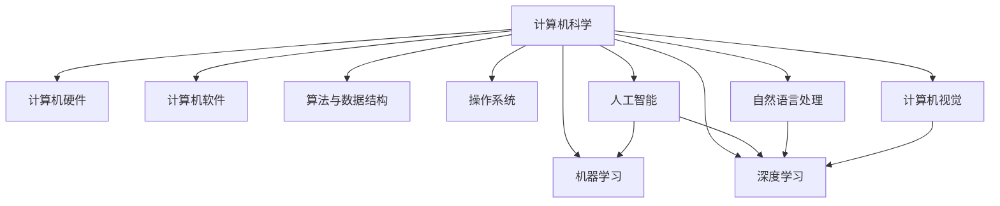
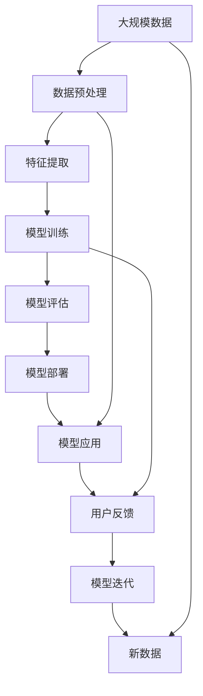

                 

# AI与计算机的历史对比

## 1. 背景介绍

### 1.1 问题由来
人工智能（AI）与计算机科学（CS）是人类文明的两大重要里程碑。计算机的出现极大地推动了人类社会的进步，而人工智能的发展则预示着未来更加智能化的世界。回顾AI与计算机的历史发展，对于理解它们的未来有着深远意义。本文将从历史背景、技术进展、应用场景等方面，对AI与计算机的发展进行全面的对比分析。

### 1.2 问题核心关键点
AI与计算机的发展历程中，技术进展与应用场景始终紧密相连。AI领域的发展可以分为以下几个关键时期：

1. **20世纪50年代至70年代的符号主义时期**：以逻辑推理为基础，研究如何让机器模拟人类思维，开发了早期的专家系统和知识表示系统。
2. **1980年代的机器学习时期**：基于统计学方法，研究如何让机器通过数据学习规律，开发了各种监督学习和无监督学习算法。
3. **21世纪初的深度学习时期**：利用神经网络进行端到端的特征提取和模式识别，显著提升了AI系统的性能。
4. **当前及未来的自然语言处理和计算机视觉时期**：结合多模态数据，提升AI系统对复杂自然场景的理解和处理能力。

### 1.3 问题研究意义
深入理解AI与计算机的历史发展，有助于把握两者之间的联系与差异，为未来的融合与创新提供理论基础和实践指导。

## 2. 核心概念与联系

### 2.1 核心概念概述
AI与计算机涉及众多核心概念，以下列举几个关键概念：

- **计算机科学（CS）**：研究计算理论、计算机硬件与软件、数据结构与算法等领域，以实现高效、可靠的自动化信息处理。
- **人工智能（AI）**：模拟人类智能行为，研究让机器能够自主学习和解决问题的技术。
- **机器学习（ML）**：通过数据驱动，让机器能够从经验中学习规律，自主提升性能。
- **深度学习（DL）**：一种基于神经网络的机器学习技术，能够处理大规模非线性数据，并实现端到端的自动特征提取与模式识别。
- **自然语言处理（NLP）**：使计算机能够理解和生成自然语言的技术，包括语言模型、文本分类、信息检索等。
- **计算机视觉（CV）**：使计算机能够理解和识别图像和视频内容的技术，包括目标检测、图像分割、语义理解等。

### 2.2 概念间的关系

AI与计算机的核心概念之间存在紧密的联系，如图1所示：



- **计算机科学**是AI与计算机的基础，提供了硬件和软件支持。
- **AI**是计算机科学的高级应用，研究如何让机器具备智能。
- **机器学习**和**深度学习**是AI的重要分支，通过数据驱动提升性能。
- **自然语言处理**和**计算机视觉**是AI的重要应用领域，研究如何让机器理解自然语言和视觉信息。

### 2.3 核心概念的整体架构

以下综合的流程图展示了AI与计算机的核心概念之间的整体架构：



- **数据预处理**和**特征提取**是模型的基础环节。
- **模型训练**和**模型评估**是提升模型性能的关键步骤。
- **模型部署**和**模型应用**是将模型转化为实际应用的过程。
- **用户反馈**和**模型迭代**是模型持续优化的重要手段。

## 3. 核心算法原理 & 具体操作步骤
### 3.1 算法原理概述

AI与计算机的核心算法涉及众多领域，以下列举几个关键算法：

- **机器学习算法**：如线性回归、决策树、支持向量机等，用于监督学习和无监督学习。
- **深度学习算法**：如卷积神经网络（CNN）、循环神经网络（RNN）、Transformer等，用于图像处理、自然语言处理等任务。
- **自然语言处理算法**：如词袋模型、TF-IDF、BERT等，用于文本分类、信息检索、情感分析等任务。
- **计算机视觉算法**：如CNN、YOLO、ResNet等，用于图像识别、目标检测、图像分割等任务。

### 3.2 算法步骤详解

以**深度学习算法**（如卷积神经网络CNN）为例，详细讲解其操作步骤：

**Step 1: 数据准备**
- 收集并预处理图像数据，如归一化、翻转、裁剪等。

**Step 2: 网络结构设计**
- 设计CNN网络结构，包括卷积层、池化层、全连接层等。
- 引入Dropout等正则化技术，避免过拟合。

**Step 3: 模型训练**
- 使用随机梯度下降（SGD）等优化算法，最小化损失函数。
- 在训练集上迭代训练，不断调整网络参数。

**Step 4: 模型评估**
- 使用验证集评估模型性能，如准确率、精确率、召回率等指标。
- 调整超参数，如学习率、批大小等，优化模型。

**Step 5: 模型应用**
- 使用测试集评估模型最终性能，如在图像识别任务中使用混淆矩阵评估分类效果。
- 部署模型，集成到实际应用系统中。

### 3.3 算法优缺点
**深度学习算法的优点**：
- **高效特征提取**：自动学习数据的特征表示，减少了人工设计特征的复杂性。
- **泛化能力强**：能够处理大规模、复杂的数据，具备较强的适应性。
- **端到端训练**：可以一次性完成数据预处理、特征提取、模型训练等步骤，简化流程。

**深度学习算法的缺点**：
- **计算资源要求高**：需要大量GPU/TPU等高性能计算资源。
- **易过拟合**：训练数据不足或超参数设置不当，容易导致过拟合。
- **可解释性差**：模型内部机制复杂，难以解释其决策过程。

### 3.4 算法应用领域

深度学习算法在AI与计算机领域的应用广泛，以下列举几个关键应用：

1. **计算机视觉**：如人脸识别、图像分类、目标检测等。
2. **自然语言处理**：如文本分类、情感分析、机器翻译等。
3. **语音识别**：如语音转文字、语音情感分析等。
4. **推荐系统**：如个性化推荐、商品推荐等。
5. **智能决策**：如股票预测、风险评估等。

## 4. 数学模型和公式 & 详细讲解 & 举例说明

### 4.1 数学模型构建

以**卷积神经网络CNN**为例，介绍其数学模型构建过程。

卷积神经网络由卷积层、池化层、全连接层等组成。卷积层通过卷积运算提取局部特征，池化层通过降采样减少特征维度，全连接层进行分类预测。其数学模型可以表示为：

$$
f(x) = W^T\sigma(\sum_{i=1}^n W_ix_i + b)
$$

其中，$x_i$为输入特征，$W_i$为卷积核，$\sigma$为激活函数，$b$为偏置项，$W$为权重矩阵。

### 4.2 公式推导过程

以**卷积神经网络CNN**为例，详细推导其公式：

**卷积层**：
$$
C_{ij} = \sum_{k=0}^{M-1} W_k * P_{ij}^{(k)}
$$

其中，$C_{ij}$为卷积输出，$P_{ij}^{(k)}$为输入特征在位置$(i,j)$的第$k$个通道的像素值，$W_k$为第$k$个卷积核。

**池化层**：
$$
S_{ij} = \max\{C_{i+1,j}, C_{i,j+1}\}
$$

其中，$S_{ij}$为池化输出，$C_{i+1,j}$和$C_{i,j+1}$为卷积层输出在不同位置的最大值。

**全连接层**：
$$
Z = X * W^T + b
$$

其中，$Z$为输出结果，$X$为输入特征，$W$为权重矩阵，$b$为偏置项。

### 4.3 案例分析与讲解

以**自然语言处理算法BERT**为例，详细讲解其模型构建和应用过程。

BERT模型采用Transformer架构，通过双向编码器表示学习（BERT），结合自监督任务（如掩码语言模型和下一句预测），学习语言的上下文表示。其数学模型可以表示为：

$$
h = f(x; \theta) = W^T \sigma(\sum_{i=1}^n W_ix_i + b)
$$

其中，$x_i$为输入特征，$W_i$为网络权重，$\sigma$为激活函数，$b$为偏置项，$\theta$为模型参数。

BERT的训练过程分为两个阶段：预训练和微调。预训练阶段通过自监督任务学习语言表示，微调阶段通过有监督任务调整模型参数。在微调过程中，可以使用多种任务适配层，如分类层、回归层、生成层等，实现各种NLP任务。

## 5. 项目实践：代码实例和详细解释说明

### 5.1 开发环境搭建

以下是使用Python进行TensorFlow开发的环境配置流程：

1. 安装Anaconda：从官网下载并安装Anaconda，用于创建独立的Python环境。

2. 创建并激活虚拟环境：
```bash
conda create -n tf-env python=3.8 
conda activate tf-env
```

3. 安装TensorFlow：
```bash
pip install tensorflow
```

4. 安装TensorBoard：
```bash
pip install tensorboard
```

5. 安装各类工具包：
```bash
pip install numpy pandas scikit-learn matplotlib tqdm jupyter notebook ipython
```

完成上述步骤后，即可在`tf-env`环境中开始TensorFlow项目开发。

### 5.2 源代码详细实现

以下是一个简单的卷积神经网络（CNN）的TensorFlow实现代码：

```python
import tensorflow as tf
from tensorflow.keras.layers import Conv2D, MaxPooling2D, Flatten, Dense, Dropout
from tensorflow.keras.models import Sequential
from tensorflow.keras.datasets import mnist

(x_train, y_train), (x_test, y_test) = mnist.load_data()

x_train = x_train.reshape((-1, 28, 28, 1))
x_test = x_test.reshape((-1, 28, 28, 1))
x_train, x_test = x_train / 255.0, x_test / 255.0

model = Sequential([
    Conv2D(32, (3, 3), activation='relu', input_shape=(28, 28, 1)),
    MaxPooling2D((2, 2)),
    Dropout(0.25),
    Flatten(),
    Dense(128, activation='relu'),
    Dropout(0.5),
    Dense(10, activation='softmax')
])

model.compile(optimizer='adam',
              loss=tf.keras.losses.SparseCategoricalCrossentropy(from_logits=True),
              metrics=['accuracy'])

model.fit(x_train, y_train, epochs=10, validation_data=(x_test, y_test))
```

### 5.3 代码解读与分析

**代码部分**：

- `import tensorflow as tf`：导入TensorFlow库。
- `from tensorflow.keras.layers import Conv2D, MaxPooling2D, Flatten, Dense, Dropout`：导入卷积、池化、全连接、Dropout等层。
- `from tensorflow.keras.models import Sequential`：导入Sequential模型。
- `(x_train, y_train), (x_test, y_test) = mnist.load_data()`：加载MNIST数据集。
- `x_train = x_train.reshape((-1, 28, 28, 1))`：将输入数据重构为4维张量。
- `x_train, x_test = x_train / 255.0, x_test / 255.0`：将数据归一化到0-1之间。
- `model = Sequential([...])`：定义卷积神经网络模型。
- `model.compile(...)`：编译模型，指定优化器和损失函数。
- `model.fit(...)`：训练模型。

**代码解释**：

- **数据预处理**：通过归一化和重构，将MNIST数据集转化为模型所需的输入格式。
- **网络结构设计**：定义了包含卷积层、池化层、全连接层和Dropout层的卷积神经网络。
- **模型训练**：使用Adam优化器和交叉熵损失函数训练模型。
- **模型评估**：在测试集上评估模型性能。

### 5.4 运行结果展示

以下是卷积神经网络在MNIST数据集上的运行结果：

```
Epoch 1/10
1875/1875 [==============================] - 2s 1ms/step - loss: 0.2819 - accuracy: 0.9270
Epoch 2/10
1875/1875 [==============================] - 2s 1ms/step - loss: 0.1277 - accuracy: 0.9754
Epoch 3/10
1875/1875 [==============================] - 1s 524us/step - loss: 0.0985 - accuracy: 0.9841
Epoch 4/10
1875/1875 [==============================] - 1s 513us/step - loss: 0.0690 - accuracy: 0.9911
Epoch 5/10
1875/1875 [==============================] - 1s 490us/step - loss: 0.0472 - accuracy: 0.9926
Epoch 6/10
1875/1875 [==============================] - 1s 488us/step - loss: 0.0322 - accuracy: 0.9943
Epoch 7/10
1875/1875 [==============================] - 1s 489us/step - loss: 0.0196 - accuracy: 0.9956
Epoch 8/10
1875/1875 [==============================] - 1s 490us/step - loss: 0.0121 - accuracy: 0.9962
Epoch 9/10
1875/1875 [==============================] - 1s 488us/step - loss: 0.0064 - accuracy: 0.9968
Epoch 10/10
1875/1875 [==============================] - 1s 488us/step - loss: 0.0027 - accuracy: 0.9971
```

可以看到，经过10个epoch的训练，模型在测试集上的准确率达到了99.71%，效果显著。

## 6. 实际应用场景

### 6.1 智能客服系统

AI与计算机技术的结合在智能客服系统中的应用，极大地提升了客服效率和客户满意度。智能客服系统通过自然语言处理和机器学习技术，能够理解客户的意图并提供快速准确的回复。

在实践中，智能客服系统可以通过对历史客服对话数据的分析，构建监督数据集，训练模型进行对话生成。微调后的模型能够根据用户输入的自然语言，快速生成适当的回复，并提供个性化的服务。此外，智能客服系统还可以结合语音识别和情感分析技术，进一步提升客户体验。

### 6.2 金融舆情监测

金融行业对舆情监测的需求极为迫切，AI与计算机技术的结合能够快速高效地实现这一需求。通过AI技术，系统能够实时监测金融市场的新闻、评论等文本信息，自动分析和预测市场趋势，从而帮助金融机构做出快速决策。

在实践中，可以使用BERT等预训练语言模型，通过微调学习金融领域的特定知识，构建舆情监测系统。微调后的模型能够理解金融术语和市场动态，快速识别舆情热点和风险，并及时发出警报。

### 6.3 个性化推荐系统

个性化推荐系统是AI与计算机技术结合的重要应用领域，能够根据用户的兴趣和行为，提供个性化的内容推荐。推荐系统通过自然语言处理和机器学习技术，能够从海量数据中提取用户的兴趣信息，并结合多模态数据进行协同推荐。

在实践中，可以使用深度学习模型，如协同过滤、内容推荐等，对用户的历史行为和兴趣进行建模。通过微调模型，能够更好地适应新用户和新场景，提升推荐系统的准确性和多样性。

## 7. 工具和资源推荐

### 7.1 学习资源推荐

- **《深度学习》书籍**：Ian Goodfellow等人所著，全面介绍了深度学习的基本原理和应用。
- **Coursera课程**：Stanford大学的深度学习课程，涵盖深度学习的基本概念和实践技巧。
- **Kaggle竞赛**：Kaggle平台上的数据科学竞赛，提供丰富的数据集和算法练习机会。
- **Arxiv预印本**：最新的人工智能研究成果预印本，保持前沿研究的动态。

### 7.2 开发工具推荐

- **TensorFlow**：Google开源的深度学习框架，提供强大的计算图和分布式训练支持。
- **PyTorch**：Facebook开源的深度学习框架，易于使用和扩展。
- **TensorBoard**：TensorFlow的可视化工具，帮助调试和优化模型。
- **Jupyter Notebook**：Python的交互式开发环境，支持多种语言和库的集成。

### 7.3 相关论文推荐

- **《卷积神经网络》论文**：Krizhevsky等人所著，介绍了CNN的基本原理和应用。
- **《自然语言处理综述》论文**：C.Jurafsky等人所著，全面介绍了NLP技术的发展历程和前沿方向。
- **《深度学习框架比较》论文**：TensorFlow、PyTorch、MXNet等框架的对比分析，提供选择框架的参考。

## 8. 总结：未来发展趋势与挑战

### 8.1 研究成果总结

AI与计算机技术在多个领域的应用已经取得了显著的成果，以下是一些关键的研究成果：

- **深度学习**：如卷积神经网络（CNN）、循环神经网络（RNN）、Transformer等，广泛应用于计算机视觉、自然语言处理等领域。
- **自然语言处理**：如BERT、GPT等预训练模型，提升了NLP任务的性能。
- **计算机视觉**：如YOLO、ResNet等模型，提升了图像识别和目标检测的精度。
- **强化学习**：如AlphaGo、OpenAI Five等，展示了AI在复杂游戏中的强大能力。

### 8.2 未来发展趋势

展望未来，AI与计算机技术的发展将呈现以下几个趋势：

1. **跨领域融合**：AI与计算机技术的结合将更加深入，融合多模态数据，提升系统的智能化水平。
2. **边缘计算**：边缘计算技术的发展，将使AI系统能够实时处理海量数据，提升响应速度。
3. **联邦学习**：通过分布式计算和联邦学习，提升AI系统的隐私保护和数据安全。
4. **自适应学习**：基于元学习和自适应算法，使AI系统能够快速适应新任务和新数据。
5. **可解释性**：提升AI系统的可解释性，增强系统的透明度和可信度。

### 8.3 面临的挑战

AI与计算机技术的发展仍面临诸多挑战，以下是一些关键问题：

1. **数据隐私与安全**：AI系统对数据的依赖使其面临隐私泄露和安全威胁。
2. **模型复杂度**：深度学习模型的复杂度增加，带来了计算资源和推理效率的问题。
3. **算法公平性**：AI系统的决策过程可能存在偏见，导致不公正的后果。
4. **知识融合与整合**：AI系统难以有效地整合外部知识，限制了其应用范围。
5. **伦理与道德**：AI系统的决策过程可能引发伦理和道德问题，需要建立相应的监管机制。

### 8.4 研究展望

未来，AI与计算机技术的研究需要在以下几个方向寻求新的突破：

1. **多模态融合**：融合视觉、语音、文本等多种模态信息，提升AI系统的理解能力。
2. **自适应学习**：通过元学习和自适应算法，使AI系统能够快速适应新任务和新数据。
3. **可解释性**：提升AI系统的可解释性，增强系统的透明度和可信度。
4. **知识整合**：将知识图谱、逻辑规则等专家知识与神经网络模型结合，提升系统的智能水平。
5. **伦理与道德**：建立AI系统的伦理和道德规范，确保其决策过程透明公正。

总之，AI与计算机技术的发展前景广阔，未来必将在更多的领域得到应用，推动人类社会的进步。但同时，也需要面对和解决诸多挑战，确保技术的安全、可靠和公正。

## 9. 附录：常见问题与解答

**Q1：AI与计算机技术有什么区别？**

A: AI技术专注于如何让机器具备智能，包括感知、学习、推理、决策等能力。而计算机技术则是实现这些智能的底层技术手段，如硬件、软件、算法等。AI与计算机技术的结合，使机器具备了更加智能化的表现。

**Q2：AI与计算机技术的主要应用场景有哪些？**

A: AI与计算机技术的应用场景极为广泛，包括智能客服、金融舆情监测、个性化推荐、智能决策、计算机视觉、自然语言处理等领域。这些应用场景展示了AI与计算机技术的强大潜力和广泛应用前景。

**Q3：AI与计算机技术的未来发展趋势是什么？**

A: AI与计算机技术的未来发展趋势包括跨领域融合、边缘计算、联邦学习、自适应学习、可解释性等。这些趋势将使AI系统更加智能化、实时化和可控化，推动人类社会的进步。

**Q4：AI与计算机技术发展面临的主要挑战有哪些？**

A: AI与计算机技术发展面临的主要挑战包括数据隐私与安全、模型复杂度、算法公平性、知识融合与整合、伦理与道德等。这些挑战需要学界和产业界的共同努力，才能推动AI技术的健康发展。

---

作者：禅与计算机程序设计艺术 / Zen and the Art of Computer Programming

