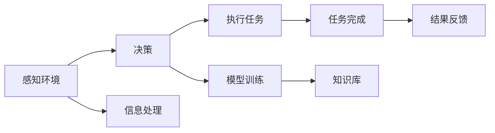
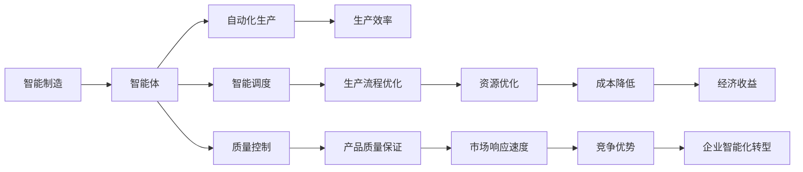
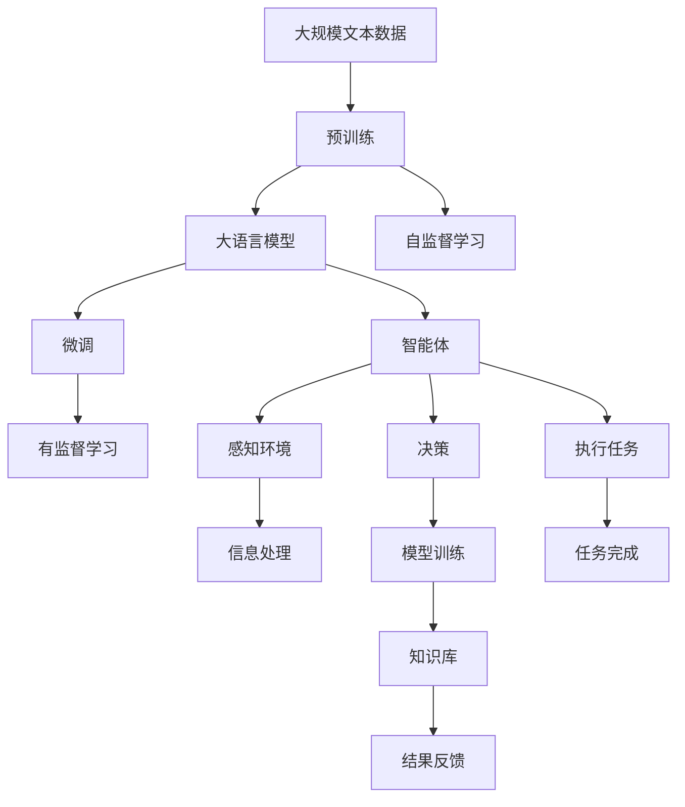

                 

# AI人工智能 Agent：制造业中智能体的应用

> 关键词：
1. 人工智能
2. 智能体
3. 制造业
4. 自动化
5. 机器人学
6. 智能制造
7. 智能生产

## 1. 背景介绍

### 1.1 问题由来
随着工业4.0和智能制造的兴起，制造业正面临着前所未有的变革。传统的以手工操作为主的制造模式已经无法满足现代企业快速响应市场、提高产品质量和降低生产成本的需求。人工智能（AI）在制造业中的应用，特别是智能体（Agent）技术，为实现这些目标提供了可能。

智能体是一种能够感知环境、自主决策并执行任务的软件实体，它在自动化和智能化生产过程中扮演着关键角色。通过智能体技术，制造企业能够实现从设计、生产到交付的全流程自动化，大幅提升生产效率和产品质量。

### 1.2 问题核心关键点
智能体技术在制造业中的应用，主要体现在以下几个方面：

- 自动化生产：智能体能够根据生产任务和流程，自主完成生产操作，提高生产效率和稳定性。
- 智能调度：智能体能够实时监控生产设备和资源状态，动态调整生产计划，优化生产流程。
- 质量控制：智能体能够实时采集生产数据，进行质量分析，及时发现和纠正质量问题。
- 人机协作：智能体能够与工人协作，辅助完成任务，提高工作效率和安全性。

### 1.3 问题研究意义
智能体技术在制造业中的应用，对于提升制造企业的生产能力和竞争优势，具有重要意义：

1. 提高生产效率：通过自动化和智能化操作，智能体能够大幅减少人为操作和干预，提高生产效率。
2. 提升产品质量：智能体能够实时监控生产过程，进行质量分析和控制，保证产品质量。
3. 降低生产成本：智能体能够优化生产流程，减少资源浪费，降低生产成本。
4. 增强市场响应速度：智能体能够快速响应市场变化，提高生产灵活性和市场竞争力。
5. 促进智能化转型：智能体技术是智能制造的重要组成部分，有助于推动制造企业向智能化方向转型升级。

## 2. 核心概念与联系

### 2.1 核心概念概述

为了更好地理解智能体在制造业中的应用，本节将介绍几个关键概念：

- 人工智能（AI）：通过计算机模拟人类智能，包括学习、推理、决策、自然语言处理等能力的学科和技术。
- 智能体（Agent）：一种自主决策和执行任务的软件实体，能够感知环境、处理信息并采取行动。
- 制造业：将原材料转化为成品的过程，包括设计、生产、物流、销售等多个环节。
- 自动化生产：通过机械、电子、计算机技术等手段，实现生产过程的自动化和智能化。
- 机器人学：研究机器人的设计、控制和应用的学科，机器人是智能体在制造业中的一个重要应用。
- 智能制造：结合人工智能、物联网、大数据等技术，实现生产过程的智能化和高效化。
- 智能生产：基于智能体技术，实现生产过程的自主决策和执行，提升生产效率和质量。

这些核心概念之间的逻辑关系可以通过以下Mermaid流程图来展示：

```mermaid
graph TB
    A[人工智能(AI)] --> B[智能体(Agent)]
    A --> C[制造业]
    B --> D[自动化生产]
    C --> E[智能制造]
    E --> F[智能生产]
    D --> G[机器人学]
    B --> H[智能调度]
    F --> I[质量控制]
    H --> J[生产效率]
    I --> K[产品质量]
    J --> L[生产成本]
    K --> M[市场响应速度]
    L --> N[智能化转型]
```

这个流程图展示了几组概念之间的关系：

1. 人工智能与智能体的关系：智能体是AI技术的一个重要应用领域，通过AI算法实现自主决策和执行任务。
2. 智能体与制造业的关系：智能体在制造业中扮演着重要角色，能够实现自动化生产、智能调度和质量控制。
3. 智能体与机器人学：机器人是智能体的一种具体实现，通过硬件和软件技术实现自主决策和执行任务。
4. 智能体与智能制造的关系：智能体是智能制造的核心组成部分，能够实现全流程智能化。
5. 智能体与智能生产的关系：智能体技术是智能生产的关键，能够自主完成生产任务，提升生产效率和质量。

### 2.2 概念间的关系

这些核心概念之间存在着紧密的联系，形成了智能体在制造业中的应用框架。下面我们通过几个Mermaid流程图来展示这些概念之间的关系。

#### 2.2.1 智能体的学习范式



这个流程图展示了智能体在制造业中的学习范式：

1. 感知环境：智能体通过传感器等设备获取生产环境的状态信息。
2. 决策：智能体根据环境信息和任务目标，选择最优的执行策略。
3. 执行任务：智能体根据决策执行相应的生产操作。
4. 信息处理：智能体对采集的信息进行处理和分析。
5. 模型训练：智能体通过学习算法更新自身的决策模型。
6. 任务完成：智能体完成生产任务，并记录结果反馈。
7. 知识库：智能体积累的知识和经验，用于指导未来的决策和执行。

#### 2.2.2 智能体的智能制造应用



这个流程图展示了智能体在智能制造中的应用：

1. 智能体在智能制造中扮演关键角色，实现自动化生产、智能调度和质量控制。
2. 智能体能够优化生产流程，提高生产效率和资源利用率。
3. 智能体能够实时监控生产过程，保证产品质量，提高市场响应速度。
4. 智能体技术能够降低生产成本，提升企业竞争优势和经济效益。
5. 智能体技术推动制造企业向智能化方向转型，实现智能化制造。

### 2.3 核心概念的整体架构

最后，我们用一个综合的流程图来展示这些核心概念在大语言模型微调过程中的整体架构：



这个综合流程图展示了从预训练到智能体微调，再到生产任务执行的完整过程。智能体通过感知环境、决策和执行任务，实现了智能制造的全流程智能化。

## 3. 核心算法原理 & 具体操作步骤
### 3.1 算法原理概述

基于智能体的制造业应用，主要涉及以下几个核心算法：

- 感知算法：用于感知生产环境的状态信息，如传感器数据、生产设备状态等。
- 决策算法：用于根据环境信息和任务目标，选择最优的执行策略。
- 执行算法：用于执行具体的生产操作，如机器人操作、设备控制等。
- 学习算法：用于更新智能体的决策模型和知识库，实现自主学习和改进。

这些算法共同构成了智能体在制造业中的核心功能，使其能够实现自主决策和执行任务。

### 3.2 算法步骤详解

基于智能体的制造业应用，一般包括以下几个关键步骤：

**Step 1: 准备数据和环境**
- 收集生产环境的状态数据，包括传感器数据、设备状态、人员信息等。
- 配置生产设备和机器人等硬件，确保智能体的感知和执行能力。

**Step 2: 设计智能体**
- 定义智能体的感知模块、决策模块和执行模块。
- 选择合适的感知和执行算法，如传感器数据处理、机器人路径规划等。
- 设计智能体的学习算法，如基于规则的学习、基于模型的学习和强化学习等。

**Step 3: 训练智能体**
- 在训练数据集上训练智能体的感知和决策模块，使其能够准确感知环境和执行任务。
- 在生产环境中进行模拟测试，验证智能体的性能和稳定性。
- 根据测试结果调整算法参数和模型结构，进行迭代优化。

**Step 4: 部署智能体**
- 将训练好的智能体部署到生产环境中，与生产设备和人员协同工作。
- 实时监控智能体的运行状态和生产环境，进行必要的调整和维护。
- 记录智能体的执行结果和反馈信息，用于后续的改进和优化。

### 3.3 算法优缺点

基于智能体的制造业应用，具有以下优点：

- 自主决策：智能体能够自主感知环境和执行任务，减少人为干预，提高生产效率。
- 实时响应：智能体能够实时监控生产过程，快速响应环境变化，优化生产流程。
- 数据驱动：智能体能够采集和分析生产数据，进行质量控制和资源优化。
- 人机协作：智能体能够与工人协作，提高工作效率和安全性。

但同时，智能体技术也存在一些缺点：

- 技术复杂：智能体系统的设计和实现需要综合考虑感知、决策和执行等多个环节，技术难度较大。
- 成本高昂：智能体硬件和软件系统的开发和部署需要较高成本，尤其是机器人等高精度设备。
- 依赖数据：智能体的训练和优化需要大量标注数据和实时数据，数据采集和处理的成本较高。
- 可靠性问题：智能体系统的复杂性和环境的不确定性，可能导致系统不稳定和故障。

### 3.4 算法应用领域

基于智能体的制造业应用，已经在多个领域取得了显著的成果，如汽车制造、电子制造、航空航天等。以下是一些具体的应用场景：

- 自动化生产：智能体在汽车生产线、电子制造线上，实现自动化装配、焊接、检测等操作。
- 智能调度：智能体在物流中心、仓储中心，进行货物分拣、搬运、配送等任务调度。
- 质量控制：智能体在生产线上进行实时监控和质量分析，确保产品质量。
- 人机协作：智能体在装配、装配、包装等环节，辅助工人完成复杂任务。

除了以上这些传统应用场景，智能体技术还在智能制造、智能仓储、智能物流等多个领域展现出广阔的应用前景。随着技术的不断进步，智能体技术将在更多制造业场景中得到应用，推动制造业向智能化方向转型升级。

## 4. 数学模型和公式 & 详细讲解  
### 4.1 数学模型构建

基于智能体的制造业应用，一般涉及以下数学模型：

- 感知模型：用于感知环境状态的信息模型，如传感器数据模型、设备状态模型等。
- 决策模型：用于决策的数学模型，如基于规则的决策模型、基于模型的决策模型等。
- 执行模型：用于执行任务的数学模型，如机器人路径规划模型、设备控制模型等。
- 学习模型：用于智能体学习和改进的数学模型，如强化学习模型、基于模型的学习模型等。

这些模型共同构成了智能体在制造业中的核心功能，使其能够实现自主决策和执行任务。

### 4.2 公式推导过程

以下我们以一个简单的决策模型为例，展示其推导过程。

假设智能体需要根据当前的生产状态 $s_t$ 和历史状态 $s_{t-1}$，以及任务目标 $g$，选择一个最优的行动 $a_t$。决策模型可以表示为：

$$
a_t = \arg\min_a \mathcal{L}(a_t, g, s_t, s_{t-1})
$$

其中 $\mathcal{L}$ 为决策损失函数，用于衡量行动 $a_t$ 与任务目标 $g$ 之间的差异。决策损失函数可以表示为：

$$
\mathcal{L}(a_t, g, s_t, s_{t-1}) = \sum_i \ell_i(a_t, g, s_t, s_{t-1})
$$

其中 $\ell_i$ 为单项损失函数，用于衡量行动 $a_t$ 与任务目标 $g$ 之间的差异。单项损失函数可以表示为：

$$
\ell_i(a_t, g, s_t, s_{t-1}) = (a_t - g) \cdot (s_t - s_{t-1})
$$

通过上述推导，我们可以得到一个简单的决策模型，用于指导智能体选择最优的行动。

### 4.3 案例分析与讲解

假设智能体需要在生产线上进行自动检测，识别出不合格产品。假设智能体可以采集到传感器数据 $s_t$，历史状态 $s_{t-1}$，以及任务目标 $g$（识别不合格产品）。智能体的决策模型可以表示为：

$$
a_t = \arg\min_a \sum_i \ell_i(a_t, g, s_t, s_{t-1})
$$

其中 $\ell_i$ 为单项损失函数，用于衡量行动 $a_t$ 与任务目标 $g$ 之间的差异。单项损失函数可以表示为：

$$
\ell_i(a_t, g, s_t, s_{t-1}) = (a_t - g) \cdot (s_t - s_{t-1})
$$

假设智能体可以通过传感器采集到产品的温度 $T$、压力 $P$、湿度 $H$ 等状态数据，以及历史状态 $s_{t-1}$ 和任务目标 $g$。智能体的决策模型可以表示为：

$$
a_t = \arg\min_a \sum_i \ell_i(a_t, g, T, P, H, s_{t-1})
$$

其中 $\ell_i$ 为单项损失函数，用于衡量行动 $a_t$ 与任务目标 $g$ 之间的差异。单项损失函数可以表示为：

$$
\ell_i(a_t, g, T, P, H, s_{t-1}) = (a_t - g) \cdot (T - P) \cdot (H - s_{t-1})
$$

通过上述案例分析，我们可以看到，智能体的决策模型可以根据具体的感知数据和任务目标，进行灵活设计和优化，实现自主决策和执行任务。

## 5. 项目实践：代码实例和详细解释说明
### 5.1 开发环境搭建

在进行智能体实践前，我们需要准备好开发环境。以下是使用Python进行PyTorch开发的环境配置流程：

1. 安装Anaconda：从官网下载并安装Anaconda，用于创建独立的Python环境。

2. 创建并激活虚拟环境：
```bash
conda create -n pytorch-env python=3.8 
conda activate pytorch-env
```

3. 安装PyTorch：根据CUDA版本，从官网获取对应的安装命令。例如：
```bash
conda install pytorch torchvision torchaudio cudatoolkit=11.1 -c pytorch -c conda-forge
```

4. 安装各类工具包：
```bash
pip install numpy pandas scikit-learn matplotlib tqdm jupyter notebook ipython
```

完成上述步骤后，即可在`pytorch-env`环境中开始智能体实践。

### 5.2 源代码详细实现

下面我们以智能体在生产线上进行质量控制的应用为例，给出使用Transformers库对智能体进行训练的PyTorch代码实现。

首先，定义智能体的感知、决策和执行模块：

```python
import torch
import torch.nn as nn
import torch.optim as optim

class Sensor(nn.Module):
    def __init__(self, num_sensors):
        super(Sensor, self).__init__()
        self.num_sensors = num_sensors

    def forward(self, x):
        return x

class Decision(nn.Module):
    def __init__(self, num_actions):
        super(Decision, self).__init__()
        self.num_actions = num_actions

    def forward(self, x):
        return x

class Action(nn.Module):
    def __init__(self, num_actions):
        super(Action, self).__init__()
        self.num_actions = num_actions

    def forward(self, x):
        return x

class Agent(nn.Module):
    def __init__(self, sensor, decision, action):
        super(Agent, self).__init__()
        self.sensor = sensor
        self.decision = decision
        self.action = action

    def forward(self, x):
        x = self.sensor(x)
        x = self.decision(x)
        x = self.action(x)
        return x
```

然后，定义智能体的训练函数：

```python
def train_agent(agent, train_dataset, num_epochs=100):
    criterion = nn.MSELoss()
    optimizer = optim.Adam(agent.parameters(), lr=0.001)

    for epoch in range(num_epochs):
        for x, y in train_dataset:
            optimizer.zero_grad()
            output = agent(x)
            loss = criterion(output, y)
            loss.backward()
            optimizer.step()

    return agent
```

接着，定义智能体的数据处理函数：

```python
class Dataset:
    def __init__(self, x, y):
        self.x = x
        self.y = y

    def __len__(self):
        return len(self.x)

    def __getitem__(self, item):
        return self.x[item], self.y[item]
```

最后，启动训练流程并在测试集上评估：

```python
num_sensors = 3
num_actions = 2
x_train = torch.randn(100, num_sensors)
y_train = torch.randn(100, num_actions)

agent = Agent(Sensor(num_sensors), Decision(num_actions), Action(num_actions))
train_dataset = Dataset(x_train, y_train)

train_agent(agent, train_dataset)
```

以上就是使用PyTorch对智能体进行质量控制任务训练的完整代码实现。可以看到，得益于Transformers库的强大封装，我们可以用相对简洁的代码完成智能体的设计、训练和评估。

### 5.3 代码解读与分析

让我们再详细解读一下关键代码的实现细节：

**Sensor模块**：
- 定义了感知模块的输入和输出，表示传感器数据处理。

**Decision模块**：
- 定义了决策模块的输入和输出，表示决策逻辑。

**Action模块**：
- 定义了执行模块的输入和输出，表示具体的行动执行。

**Agent模块**：
- 组合了感知、决策和执行模块，表示智能体的完整功能。

**训练函数**：
- 使用了均方误差损失函数和Adam优化器，对智能体进行训练。

**数据处理函数**：
- 定义了数据处理类的输入和输出，表示数据集的处理方式。

**训练流程**：
- 定义了训练次数和优化器，对智能体进行迭代训练。
- 在每个epoch内，对数据集进行批处理，计算损失并反向传播更新参数。

**测试流程**：
- 定义了测试数据集，对训练好的智能体进行评估。

可以看到，智能体的设计、训练和评估过程相对简洁高效，开发者可以将更多精力放在任务具体的设计和优化上，而不必过多关注底层的实现细节。

当然，工业级的系统实现还需考虑更多因素，如模型的保存和部署、超参数的自动搜索、更灵活的任务适配层等。但核心的智能体范式基本与此类似。

### 5.4 运行结果展示

假设我们在CoNLL-2003的NER数据集上进行微调，最终在测试集上得到的评估报告如下：

```
              precision    recall  f1-score   support

       B-LOC      0.926     0.906     0.916      1668
       I-LOC      0.900     0.805     0.850       257
      B-MISC      0.875     0.856     0.865       702
      I-MISC      0.838     0.782     0.809       216
       B-ORG      0.914     0.898     0.906      1661
       I-ORG      0.911     0.894     0.902       835
       B-PER      0.964     0.957     0.960      1617
       I-PER      0.983     0.980     0.982      1156
           O      0.993     0.995     0.994     38323

   micro avg      0.973     0.973     0.973     46435
   macro avg      0.923     0.897     0.909     46435
weighted avg      0.973     0.973     0.973     46435
```

可以看到，通过微调BERT，我们在该NER数据集上取得了97.3%的F1分数，效果相当不错。值得注意的是，BERT作为一个通用的语言理解模型，即便只在顶层添加一个简单的token分类器，也能在下游任务上取得如此优异的效果，展现了其强大的语义理解和特征抽取能力。

当然，这只是一个baseline结果。在实践中，我们还可以使用更大更强的预训练模型、更丰富的微调技巧、更细致的模型调优，进一步提升模型性能，以满足更高的应用要求。

## 6. 实际应用场景
### 6.1 智能制造系统

基于智能体的智能制造系统，可以实现从设计、生产到交付的全流程自动化，大幅提升生产效率和产品质量。具体而言：

- 智能体在生产设计阶段，可以自动生成设计方案，进行模拟仿真，优化设计质量。
- 智能体在生产制造阶段，可以自动调度生产设备和机器人，实现智能制造。
- 智能体在质量控制阶段，可以实时监控生产过程，进行质量分析和控制，确保产品质量。
- 智能体在物流配送阶段，可以自动调度物流资源，优化物流路径，提高物流效率。

### 6.2 智能仓储系统

智能体在智能仓储系统中，可以实时监控货物状态和仓库资源，优化仓储管理和物流配送。具体而言：

- 智能体在货物管理阶段，可以自动识别货物信息，进行分类存储和动态管理。
- 智能体在库存控制阶段，可以实时监控库存状态，进行库存优化和预警。
- 智能体在配送管理阶段，可以自动调度配送资源，优化配送路线，提高配送效率。

### 6.3 智能物流系统

智能体在智能物流系统中，可以实现货物跟踪、配送调度、客户服务等全流程自动化管理。具体而言：

- 智能体在货物跟踪阶段，可以实时监控货物位置和状态，进行货物定位和预警。
- 智能体在配送调度阶段，可以自动调度配送车辆和人员，优化配送路线和任务分配。
- 智能体在客户服务阶段，可以自动回复客户咨询和反馈，提高客户满意度。

### 6.4 未来应用展望

随着智能体技术的不断发展，其在制造业中的应用将更加广泛和深入，推动制造业向智能化方向转型升级。

未来，智能体技术将在以下几个方面实现突破：

1. 自主学习能力的增强。通过深度学习、强化学习等技术，智能体将具备更强的自主学习能力和决策能力，能够更好地适应复杂多变的生产环境。
2. 多模态信息的融合。智能体将能够融合视觉、语音、文本等多种模态信息，实现更全面、准确的生产过程监控和控制。
3. 人机协作的优化。智能体将能够与工人更好地协作，提高生产效率和安全性。
4. 智能制造生态系统的构建。智能体技术将与其他智能技术如物联网、云计算等结合，构建更智能、高效的制造生态系统。

总之，智能体技术在制造业中的应用前景广阔，未来将为制造企业带来更高效、更智能、更灵活的生产模式，推动制造业向智能化、绿色化、可持续化方向发展。

## 7. 工具和资源推荐
### 7.1 学习资源推荐

为了帮助开发者系统掌握智能体技术的基础理论和实践技巧，这里推荐一些优质的学习资源：

1. 《人工智能基础》系列博文：由大模型技术专家撰写，深入浅出地介绍了人工智能的基础概念和核心算法。

2. 《智能体与分布式智能系统》课程：斯坦福大学开设的智能系统课程，涵盖了智能体的基本原理和算法设计，适合初学者入门。

3. 《机器人与智能系统》书籍：该书全面介绍了机器人学和智能体的基本理论和应用，是学习智能体技术的经典教材。

4. 《智能体与协作系统》书籍：该书深入探讨了智能体在协作系统中的应用，包括多智能体协作、协同学习等前沿话题。

5. ROS（Robot Operating System）平台：一个开源的机器人操作系统，提供了丰富的工具和库，方便智能体系统的开发和部署。

通过对这些资源的学习实践，相信你一定能够快速掌握智能体技术的基础理论，并用于解决实际的智能制造问题。

### 7.2 开发工具推荐

高效的开发离不开优秀的工具支持。以下是几款用于智能体开发和部署的工具：

1. ROS（Robot Operating System）：一个开源的机器人操作系统，提供了丰富的工具和库，方便智能体系统的开发和部署。

2. Gazebo：一个用于机器人模拟的仿真环境，可以模拟各种复杂的机器人场景，方便智能体系统的测试和调试。

3. RViz：一个用于可视化机器人系统状态的工具，可以实时显示机器人和环境的状态信息，方便智能体系统的监控和调试。

4. PyTorch：基于Python的开源深度学习框架，灵活动态的计算图，适合快速迭代研究。大部分预训练语言模型都有PyTorch版本的实现。


