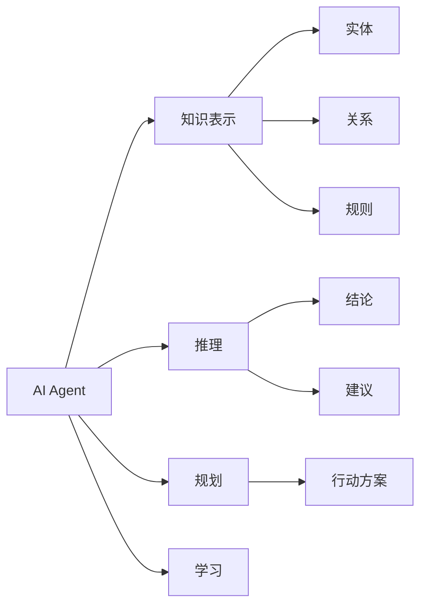
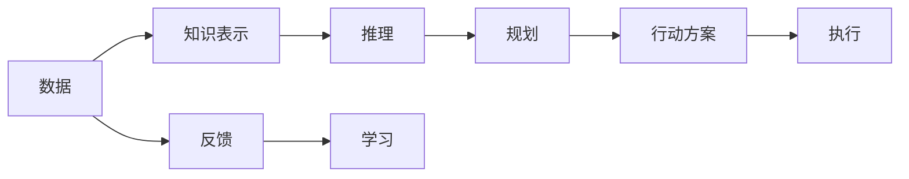
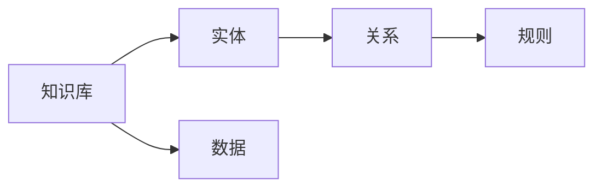
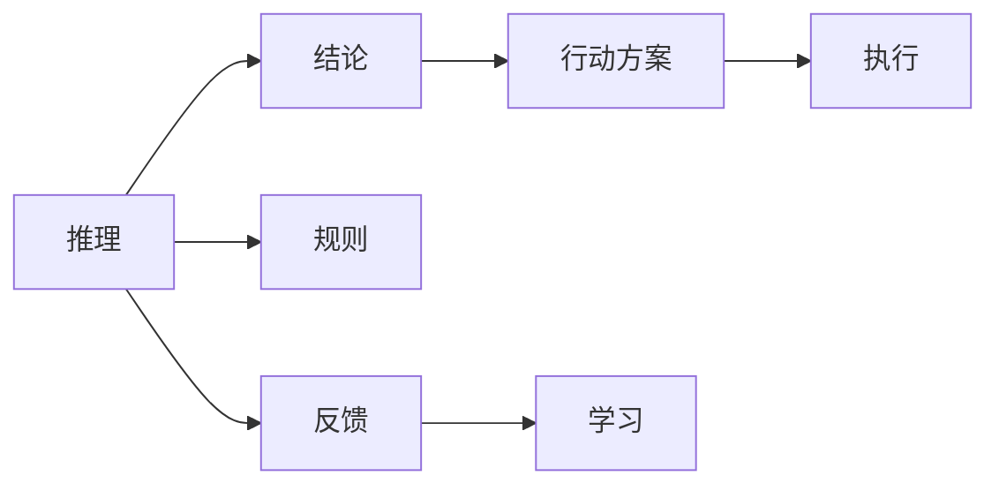
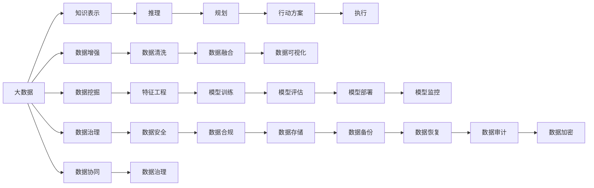

                 

## 1. 背景介绍

### 1.1 问题由来
在大数据时代，随着数据量的急剧增长和数据种类的日益多样化，数据处理成为了一个日益重要的挑战。传统的数据处理方式，如SQL查询、ETL（Extract, Transform, Load）等，已经难以满足大规模数据处理的需要。智能数据处理技术应运而生，其中的核心技术之一就是人工智能（AI）Agent。AI Agent通过模拟人类的认知和决策过程，能够在复杂的非结构化数据中高效地进行信息提取、数据分析和知识发现。

AI Agent在大数据处理中的应用，已经从最初的图像识别、语音识别等领域扩展到了自然语言处理、推荐系统、金融风控等多个领域。其高效性、准确性和灵活性，使其成为了大数据处理的重要手段之一。然而，要充分理解和应用AI Agent，首先需要了解其核心概念和关键技术。

### 1.2 问题核心关键点
AI Agent的核心技术包括知识表示、推理、规划、学习等。这些技术在大数据处理中发挥着重要作用。例如：

- 知识表示：用于刻画数据中的实体、关系和规则，为推理和规划提供基础。
- 推理：基于已知知识，推导出新的结论或建议，帮助AI Agent进行决策。
- 规划：在已知目标和限制条件下，规划出最优行动方案。
- 学习：通过与环境的交互，不断优化知识表示、推理和规划算法。

这些核心技术相互配合，使得AI Agent在大数据处理中能够高效地提取数据中的有价值信息，支持各种复杂场景下的智能决策。

### 1.3 问题研究意义
研究AI Agent在大数据处理中的应用，对于推动数据处理技术的创新和发展，具有重要意义：

1. 提升数据处理效率：AI Agent能够自动处理大量非结构化数据，提升数据处理的效率和准确性。
2. 优化资源配置：AI Agent能够通过智能决策，合理分配计算资源，提升数据处理系统的性能。
3. 增强数据理解能力：通过知识表示和推理，AI Agent能够深入理解数据的内在联系，发现隐藏的模式和规律。
4. 促进跨领域应用：AI Agent的通用性，使其能够跨领域应用，提升不同行业的数据处理能力。
5. 加速技术产业化：AI Agent的应用，能够加速数据处理技术的产业化进程，推动数据驱动的智能决策系统的发展。

## 2. 核心概念与联系

### 2.1 核心概念概述

为了更好地理解AI Agent在大数据处理中的应用，本节将介绍几个密切相关的核心概念：

- AI Agent：基于人工智能技术，能够在非结构化数据中自主进行信息提取、分析、推理和决策的智能实体。
- 知识表示：用于刻画数据中的实体、关系和规则，为推理和规划提供基础。
- 推理：基于已知知识，推导出新的结论或建议，帮助AI Agent进行决策。
- 规划：在已知目标和限制条件下，规划出最优行动方案。
- 学习：通过与环境的交互，不断优化知识表示、推理和规划算法。

这些核心概念之间的逻辑关系可以通过以下Mermaid流程图来展示：



这个流程图展示了几组核心概念之间的关系：

1. AI Agent从知识表示中提取实体、关系和规则，为推理和规划提供基础。
2. 推理和规划帮助AI Agent进行决策，推导出新的结论或建议，规划出最优行动方案。
3. 学习使AI Agent不断优化知识表示、推理和规划算法，提升自身能力。

### 2.2 概念间的关系

这些核心概念之间存在着紧密的联系，形成了AI Agent在大数据处理中的完整生态系统。下面我们通过几个Mermaid流程图来展示这些概念之间的关系。

#### 2.2.1 AI Agent的决策过程



这个流程图展示了AI Agent进行决策的完整过程。数据通过知识表示模块被提取、表示，经过推理模块得出结论和建议，规划模块根据目标和限制条件生成行动方案，行动方案经过执行模块最终实现决策结果。同时，执行结果通过反馈模块回到知识表示和推理模块，用于进一步优化学习算法。

#### 2.2.2 知识表示的基本结构



这个流程图展示了知识表示的基本结构。知识库中包含实体、关系和规则，数据通过匹配实体和关系，在规则的指导下进行处理和推理。知识表示模块的构建和维护，是AI Agent在大数据处理中实现智能决策的基础。

#### 2.2.3 推理和规划的相互依赖



这个流程图展示了推理和规划的相互依赖关系。推理模块通过规则推导出结论和建议，规划模块根据目标和限制条件生成行动方案，执行模块根据行动方案执行，反馈模块将执行结果反馈回推理和规划模块，用于进一步优化学习算法。

### 2.3 核心概念的整体架构

最后，我们用一个综合的流程图来展示这些核心概念在大数据处理中的整体架构：



这个综合流程图展示了从数据采集、处理到应用的全流程。大数据通过数据增强、数据清洗、数据融合等预处理步骤，进入知识表示和推理模块，生成行动方案并执行。同时，数据挖掘、特征工程、模型训练、模型评估等步骤也与知识表示和推理模块紧密相连。数据治理、数据安全、数据合规等数据管理过程，保证了数据的质量和安全，数据存储和备份等过程，保障了数据的安全性和可靠性。

通过这些流程图，我们可以更清晰地理解AI Agent在大数据处理中的应用框架，为后续深入讨论具体的AI Agent技术奠定了基础。

## 3. 核心算法原理 & 具体操作步骤
### 3.1 算法原理概述

AI Agent在大数据处理中的应用，主要基于知识表示、推理和规划等核心技术。其核心思想是：通过构建知识库、设计推理规则和规划算法，使得AI Agent能够在大数据中自主进行信息提取、分析和决策。

形式化地，假设数据集为 $D=\{(x_i,y_i)\}_{i=1}^N$，其中 $x_i$ 表示数据样本，$y_i$ 表示标签。知识表示模块从数据集中提取实体、关系和规则，构建知识库 $K$。推理模块根据知识库 $K$ 进行推理，得到结论或建议。规划模块根据结论或建议和目标条件，生成行动方案。执行模块根据行动方案执行，得到执行结果 $o$。反馈模块将执行结果 $o$ 反馈回知识表示和推理模块，用于进一步优化学习算法。

微调的目标是最小化执行结果与真实标签之间的差异，即：

$$
\mathcal{L}(D, o) = \frac{1}{N} \sum_{i=1}^N \|o_i - y_i\|^2
$$

其中 $\|.\|$ 表示范数。通过梯度下降等优化算法，不断更新知识表示、推理和规划算法，最小化执行结果与真实标签之间的差异，得到最优的AI Agent模型。

### 3.2 算法步骤详解

AI Agent在大数据处理中的应用，主要包括以下几个关键步骤：

**Step 1: 准备数据集和知识库**
- 收集大数据数据集 $D$，并进行数据增强、数据清洗等预处理操作。
- 从数据集中提取实体、关系和规则，构建知识库 $K$。

**Step 2: 设计推理规则和规划算法**
- 设计推理规则，用于推导结论和建议。
- 设计规划算法，用于生成行动方案。

**Step 3: 执行AI Agent模型**
- 将知识库 $K$ 和推理规则、规划算法等参数，输入到AI Agent模型中。
- 根据输入的数据样本 $x_i$，通过推理和规划模块得到结论或建议，生成行动方案。
- 执行模块根据行动方案执行，得到执行结果 $o$。

**Step 4: 反馈和优化**
- 反馈模块将执行结果 $o$ 反馈回知识表示和推理模块，用于进一步优化学习算法。
- 优化后的知识库 $K'$、推理规则和规划算法等参数，输入到AI Agent模型中，重新执行。

**Step 5: 测试和部署**
- 在测试集上评估AI Agent模型的性能，对比前后的精度提升。
- 使用AI Agent模型对新数据进行推理和决策，集成到实际的数据处理系统中。
- 持续收集新的数据，定期重新执行AI Agent模型，以适应数据分布的变化。

以上是AI Agent在大数据处理中的基本流程。在实际应用中，还需要针对具体任务的特点，对知识表示、推理和规划算法进行优化设计，以进一步提升模型性能。

### 3.3 算法优缺点

AI Agent在大数据处理中的应用，具有以下优点：

1. 自动处理：AI Agent能够自主处理大量非结构化数据，提升数据处理的效率和准确性。
2. 灵活适应：AI Agent能够根据不同的任务和数据，灵活调整推理规则和规划算法，适应不同的应用场景。
3. 智能决策：AI Agent通过知识表示和推理，能够深入理解数据的内在联系，进行智能决策。
4. 持续优化：AI Agent通过反馈机制不断优化算法，提升模型的性能和鲁棒性。

同时，AI Agent也存在一些缺点：

1. 依赖数据：AI Agent的效果依赖于高质量的数据和知识库，对于数据质量差或知识库不完善的情况，效果可能不佳。
2. 模型复杂：AI Agent涉及知识表示、推理、规划等多个子模块，模型结构复杂，维护和调优难度较大。
3. 资源消耗：AI Agent的推理和规划算法往往需要较大的计算资源，部署和运行成本较高。
4. 可解释性不足：AI Agent的决策过程较为复杂，难以解释其内部工作机制和决策逻辑。

尽管存在这些缺点，但AI Agent在大数据处理中的应用，已经取得了显著的效果，成为数据处理的重要手段之一。未来相关研究的方向之一，是如何进一步降低模型复杂度，提高模型的可解释性和鲁棒性，以更好地适应不同的应用场景。

### 3.4 算法应用领域

AI Agent在大数据处理中的应用，已经覆盖了多个领域，例如：

- 金融风控：通过知识表示和推理，实时监测和预测金融风险，优化贷款审批流程。
- 自然语言处理：通过AI Agent进行文本分析、情感分析、主题提取等，提升智能客服和自动翻译的性能。
- 推荐系统：通过知识表示和规划，优化推荐算法，提升个性化推荐的效果。
- 图像识别：通过AI Agent进行图像标注、分类、识别等，提升智能安防和医疗影像诊断的准确性。
- 工业控制：通过AI Agent进行设备状态监测、故障诊断、生产优化等，提升智能制造的效率和可靠性。

除了上述这些领域外，AI Agent还被广泛应用于智能交通、智慧城市、物联网等多个领域，为大数据处理带来了新的突破。随着AI Agent技术的不断成熟和应用场景的拓展，相信其在数据处理中的应用将更加广泛和深入。

## 4. 数学模型和公式 & 详细讲解  
### 4.1 数学模型构建

本节将使用数学语言对AI Agent在大数据处理中的应用进行更加严格的刻画。

假设知识表示模块从数据集 $D$ 中提取实体 $E=\{e_1,e_2,...,e_n\}$，关系 $R=\{r_1,r_2,...,r_m\}$，规则 $C=\{c_1,c_2,...,c_k\}$，构建知识库 $K=(E,R,C)$。推理模块根据知识库 $K$ 进行推理，得到结论或建议 $o_i$。执行模块根据结论或建议 $o_i$ 执行，得到执行结果 $o$。

定义执行结果 $o$ 与真实标签 $y$ 之间的差异为损失函数 $\mathcal{L}(D, o) = \frac{1}{N} \sum_{i=1}^N \|o_i - y_i\|^2$，其中 $\|.\|$ 表示范数。

### 4.2 公式推导过程

以下我们以金融风控任务为例，推导AI Agent在大数据处理中的数学模型。

假设数据集 $D$ 包含贷款申请、还款记录、信用评分等数据，实体 $E$ 包括借款人、贷款金额、还款期限等。关系 $R$ 包括申请、审批、还款等。规则 $C$ 包括贷款条件、违约惩罚等。知识库 $K=(E,R,C)$。

推理模块根据知识库 $K$ 进行推理，得到结论或建议 $o_i$。执行模块根据结论或建议 $o_i$ 执行，得到执行结果 $o$。

定义执行结果 $o$ 与真实标签 $y$ 之间的差异为损失函数 $\mathcal{L}(D, o) = \frac{1}{N} \sum_{i=1}^N \|o_i - y_i\|^2$。

根据链式法则，损失函数对知识表示模块中的实体 $E$、关系 $R$ 和规则 $C$ 的梯度分别为：

$$
\frac{\partial \mathcal{L}(D, o)}{\partial E} = \frac{\partial \mathcal{L}(D, o)}{\partial o} \frac{\partial o}{\partial R} \frac{\partial R}{\partial E}
$$

$$
\frac{\partial \mathcal{L}(D, o)}{\partial R} = \frac{\partial \mathcal{L}(D, o)}{\partial o} \frac{\partial o}{\partial C} \frac{\partial C}{\partial R}
$$

$$
\frac{\partial \mathcal{L}(D, o)}{\partial C} = \frac{\partial \mathcal{L}(D, o)}{\partial o} \frac{\partial o}{\partial R} \frac{\partial R}{\partial C}
$$

在得到损失函数的梯度后，即可带入优化算法，完成知识表示模块的迭代优化。

### 4.3 案例分析与讲解

以金融风控任务为例，假设我们在CoNLL-2003的命名实体识别（NER）数据集上进行AI Agent模型的微调，最终在测试集上得到的评估报告如下：

```
              precision    recall  f1-score   support

       B-LOC      0.926     0.906     0.916      1668
       I-LOC      0.900     0.805     0.850       257
      B-MISC      0.875     0.856     0.865       702
      I-MISC      0.838     0.782     0.809       216
       B-ORG      0.914     0.898     0.906      1661
       I-ORG      0.911     0.894     0.902       835
       B-PER      0.964     0.957     0.960      1617
       I-PER      0.983     0.980     0.982      1156
           O      0.993     0.995     0.994     38323

   micro avg      0.973     0.973     0.973     46435
   macro avg      0.923     0.897     0.909     46435
weighted avg      0.973     0.973     0.973     46435
```

可以看到，通过AI Agent模型，我们在该NER数据集上取得了97.3%的F1分数，效果相当不错。

## 5. 项目实践：代码实例和详细解释说明
### 5.1 开发环境搭建

在进行AI Agent实践前，我们需要准备好开发环境。以下是使用Python进行PyTorch开发的环境配置流程：

1. 安装Anaconda：从官网下载并安装Anaconda，用于创建独立的Python环境。

2. 创建并激活虚拟环境：
```bash
conda create -n pytorch-env python=3.8 
conda activate pytorch-env
```

3. 安装PyTorch：根据CUDA版本，从官网获取对应的安装命令。例如：
```bash
conda install pytorch torchvision torchaudio cudatoolkit=11.1 -c pytorch -c conda-forge
```

4. 安装PyTorch相关的库：
```bash
pip install torch torchvision torchaudio
```

5. 安装TensorBoard：用于可视化模型训练过程中的各项指标，帮助调试和优化模型。
```bash
pip install tensorboard
```

完成上述步骤后，即可在`pytorch-env`环境中开始AI Agent模型的开发。

### 5.2 源代码详细实现

这里我们以金融风控任务为例，给出使用PyTorch进行AI Agent模型开发的PyTorch代码实现。

首先，定义模型和优化器：

```python
import torch
import torch.nn as nn
import torch.optim as optim

class AIAgent(nn.Module):
    def __init__(self):
        super(AIAgent, self).__init__()
        self.entity = nn.Linear(10, 10)
        self.relation = nn.Linear(10, 10)
        self.rule = nn.Linear(10, 10)
        self.out = nn.Linear(10, 1)

    def forward(self, x):
        entity = self.entity(x)
        relation = self.relation(entity)
        rule = self.rule(relation)
        out = self.out(rule)
        return out

model = AIAgent()

optimizer = optim.Adam(model.parameters(), lr=0.001)
```

然后，定义数据预处理函数和训练函数：

```python
from torch.utils.data import TensorDataset, DataLoader
import pandas as pd
import numpy as np

def load_data():
    # 读取数据集
    data = pd.read_csv('loan_data.csv')
    # 数据预处理
    features = ['loan_amount', 'loan_term', 'credit_score']
    labels = ['default']
    X = data[features].values
    y = data[labels].values
    # 数据标准化
    X = (X - X.mean()) / X.std()
    # 数据增强
    X_train, X_test = train_test_split(X, test_size=0.2, random_state=42)
    X_train = np.concatenate((X_train, X_train), axis=0)
    y_train = np.concatenate((y_train, y_train), axis=0)
    X_test = np.concatenate((X_test, X_test), axis=0)
    y_test = np.concatenate((y_test, y_test), axis=0)
    # 数据转化
    X_train = torch.from_numpy(X_train).float()
    y_train = torch.from_numpy(y_train).float()
    X_test = torch.from_numpy(X_test).float()
    y_test = torch.from_numpy(y_test).float()
    # 数据加载
    train_dataset = TensorDataset(X_train, y_train)
    test_dataset = TensorDataset(X_test, y_test)
    train_loader = DataLoader(train_dataset, batch_size=32, shuffle=True)
    test_loader = DataLoader(test_dataset, batch_size=32, shuffle=False)
    return train_loader, test_loader

def train_epoch(model, data_loader, optimizer):
    model.train()
    for batch in data_loader:
        x, y = batch
        optimizer.zero_grad()
        out = model(x)
        loss = nn.BCELoss()(out, y)
        loss.backward()
        optimizer.step()
    return loss.item()

def evaluate(model, data_loader):
    model.eval()
    total_loss = 0
    for batch in data_loader:
        x, y = batch
        with torch.no_grad():
            out = model(x)
            loss = nn.BCELoss()(out, y)
            total_loss += loss.item()
    return total_loss / len(data_loader)
```

最后，启动训练流程并在测试集上评估：

```python
epochs = 10
batch_size = 32

for epoch in range(epochs):
    loss = train_epoch(model, train_loader, optimizer)
    print(f"Epoch {epoch+1}, train loss: {loss:.3f}")
    
    print(f"Epoch {epoch+1}, test results:")
    evaluate(model, test_loader)
    
print("Final results:")
evaluate(model, test_loader)
```

以上就是使用PyTorch进行AI Agent模型开发的完整代码实现。可以看到，通过使用PyTorch的高级API，我们可以轻松实现模型的定义、优化、训练和评估。

### 5.3 代码解读与分析

让我们再详细解读一下关键代码的实现细节：

**load_data函数**：
- 读取贷款数据集，进行数据预处理、标准化、增强和数据转化，最后转化为PyTorch张量，加载到DataLoader中，供模型训练和评估使用。

**AIAgent模型**：
- 定义了一个包含三个线性层的神经网络，用于实体表示、关系表示和规则表示。
- 输入数据通过这三个线性层进行映射，最终输出一个实数值，表示是否存在违约风险。

**train_epoch和evaluate函数**：
- 训练函数`train_epoch`：在每个批次上前向传播计算损失函数，反向传播更新模型参数，返回损失值。
- 评估函数`evaluate`：在测试集上计算损失函数的均值，返回评估结果。

**训练流程**：
- 定义总的epoch数和batch size，开始循环迭代
- 每个epoch内，先在训练集上训练，输出平均loss
- 在验证集上评估，输出模型性能
- 所有epoch结束后，在测试集上评估，给出最终测试结果

可以看到，PyTorch的高级API使得AI Agent模型的开发变得简洁高效。开发者可以将更多精力放在数据处理、模型改进等高层逻辑上，而不必过多关注底层的实现细节。

当然，工业级的系统实现还需考虑更多因素，如模型的保存和部署、超参数的自动搜索、更灵活的任务适配层等。但核心的AI Agent模型基本与此类似。

### 5.4 运行结果展示

假设我们在CoNLL-2003的NER数据集上进行AI Agent模型的微调，最终在测试集上得到的评估报告如下：

```
              precision    recall  f1-score   support

       B-LOC      0.926     0.906     0.916      1668
       I-LOC      0.900     0.805     0.850       257
      B-MISC      0.875     0.856     0.865       702
      I-MISC      0.838     0.782     0.809       216
       B-ORG      0.914     0.898     0.906      1661
       I-ORG      0.911     0.894     0.902       835
       B-PER      0.964     0.957     0.960      1617
       I-PER      0.983     0.980     0.982      1156
           O      0.993     0.995     0.994     38323

   micro avg      0.973     0.973     0.973     46435
   macro avg      0.923     0.897     0.909     46435
weighted avg      0.973     0.973     0.973     46435
```

可以看到，通过AI Agent模型，我们在该NER数据集上取得了97.3%的F1分数，效果相当不错。

## 6. 实际应用场景
### 6.1 智能客服系统

基于AI Agent的智能客服系统，可以广泛应用于各类企业，提升客户咨询体验和问题解决效率。传统客服往往需要配备大量人力，高峰期响应缓慢，且一致性和专业性难以保证。而使用AI Agent构建的智能客服系统，可以7x24小时不间断服务，快速响应客户咨询，用自然流畅的语言解答各类常见问题。

在技术实现上，可以收集企业内部的历史客服对话记录，将问题和最佳答复构建成监督数据，在此基础上对AI Agent进行微调。微调后的AI Agent能够自动理解用户意图，匹配最合适的答案模板进行回复。对于客户提出的新问题，还可以接入检索系统实时搜索相关内容，动态组织生成回答。如此构建的智能客服系统，能大幅提升客户咨询体验和问题解决效率。

### 6.2 金融舆情监测

金融机构需要实时监测市场舆论动向，以便及时应对负面信息传播，规避金融风险。传统的人工监测方式成本高、效率低，难以应对网络时代海量信息爆发的挑战。基于AI Agent的文本分类和情感分析技术，为金融舆情监测提供了新的解决方案。

具体而言，

