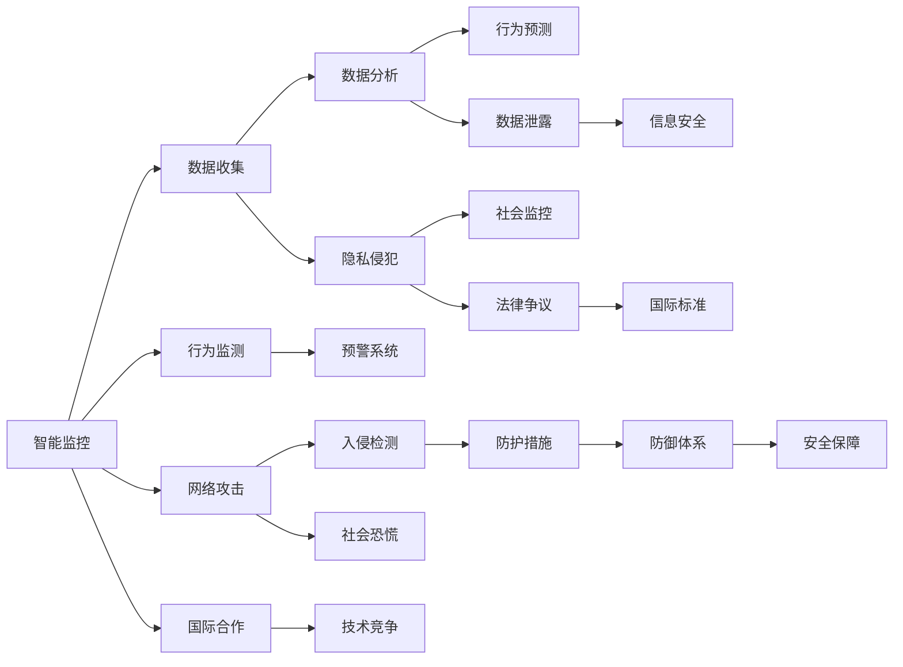
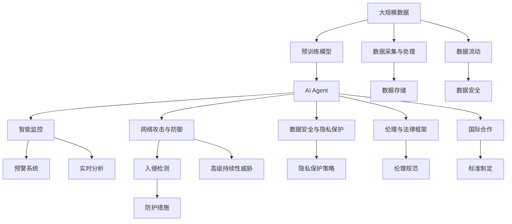

                 

# AI人工智能 Agent：对国家安全的影响

> 关键词：人工智能,国家安全,智能监控,网络攻击,隐私保护,安全漏洞,人工智能伦理

## 1. 背景介绍

### 1.1 问题由来

随着人工智能(AI)技术的快速发展，人工智能Agent（智能体）被广泛应用于各个领域，包括但不限于军事、政治、经济、社会服务等。AI Agent在带来便利和效率提升的同时，也对国家安全产生了深远的影响。这些影响既包括正面效应，如提高国防安全、强化国家决策效率，也包括潜在的负面后果，如智能监控导致的隐私侵犯、网络攻击和数据安全威胁等。本文将对AI Agent在国家安全领域的应用现状、影响机制以及应对策略进行系统性分析，揭示其对国家安全的双刃剑效应，并提出未来研究的方向和建议。

### 1.2 问题核心关键点

AI Agent的国家安全影响涉及到多方面的关键点，主要包括：
1. **智能监控的普及与挑战**：AI技术在公共安全监控中的应用，如面部识别、行为分析等，有助于预防犯罪和恐怖活动，但同时引发了隐私侵犯和社会监控过度的问题。
2. **网络攻击与防御**：AI Agent在网络安全领域的防御与攻击作用，如利用AI进行高级持续性威胁(APT)攻击，或者使用AI增强网络防御能力。
3. **数据安全与隐私保护**：AI Agent在数据收集与分析中的作用，涉及到数据泄露、隐私保护和信息安全问题。
4. **伦理与法律框架**：AI Agent在国家安全中的应用需遵循何种伦理和法律标准，以确保技术应用的合法性和合理性。
5. **国际合作与竞争**：AI技术在国际上的合作与竞争，包括技术优势的争夺、数据共享与保护、法律与伦理标准差异等。

这些关键点相互交织，共同构成了AI Agent对国家安全影响的全景图。

### 1.3 问题研究意义

研究AI Agent对国家安全的影响，对于防范技术滥用、制定合理的技术政策、推动AI技术的健康发展具有重要意义：
1. 防范技术滥用：识别AI Agent可能带来的潜在风险，制定防范措施，防止技术被不当利用。
2. 制定技术政策：基于对AI Agent影响机制的深入理解，制定合理的AI技术发展与应用政策。
3. 推动技术健康发展：促进AI技术的积极应用，避免其负面影响，确保AI技术的可持续发展。
4. 保障国家安全：利用AI Agent提升国家防御能力和安全水平，防范各类安全威胁。
5. 促进国际合作：基于AI Agent的国际标准和法规，促进全球AI技术合作与发展。

## 2. 核心概念与联系

### 2.1 核心概念概述

为更好地理解AI Agent对国家安全的影响，本节将介绍几个关键概念及其联系：

- **AI Agent（智能体）**：具有自主行为和决策能力的程序实体，能够在复杂环境中执行任务，如网络安全、智能监控等。
- **智能监控**：利用AI技术，对公共场所或特定目标进行实时监测和分析，以预防犯罪和恐怖活动。
- **网络攻击与防御**：通过AI增强网络攻击的复杂度和精确度，同时利用AI技术提升网络防御的效率和精度。
- **数据安全与隐私保护**：AI Agent在数据收集、存储和分析过程中，涉及到数据安全、隐私保护和信息安全问题。
- **伦理与法律框架**：在AI Agent应用中，需遵循的伦理原则和法律法规，确保技术应用的合法性和合理性。

这些概念之间存在复杂的相互作用，共同影响了AI Agent在国家安全领域的综合影响。

### 2.2 概念间的关系

这些核心概念之间的联系可以通过以下Mermaid流程图来展示：



这个流程图展示了智能监控、网络攻击与防御、数据安全与隐私保护、伦理与法律框架等概念之间的相互关系：

1. 智能监控通过数据收集、数据分析和行为预测等技术手段，实现对特定行为的监测和预警。
2. 数据收集和分析过程中，可能引发隐私侵犯和数据泄露问题，需要采取相应的法律和伦理措施来保护隐私。
3. 智能监控和网络攻击系统相互交织，攻击者可能利用AI增强攻击手段，而防御系统则通过AI提高防护能力。
4. 数据安全与隐私保护需遵循严格的伦理和法律框架，以防止技术滥用。
5. 国际合作与竞争则影响AI Agent的应用和发展方向，各国需基于国际标准进行协调。

### 2.3 核心概念的整体架构

最后，我们用一个综合的流程图来展示这些核心概念在大规模应用中的整体架构：



这个综合流程图展示了从大规模数据预处理到AI Agent应用的全过程。在应用过程中，AI Agent分别应用于智能监控、网络攻击与防御、数据安全与隐私保护等多个领域，并需遵循相应的伦理和法律框架，以确保技术应用的合法性和合理性。

## 3. 核心算法原理 & 具体操作步骤
### 3.1 算法原理概述

AI Agent的国家安全影响主要体现在智能监控、网络攻击与防御、数据安全与隐私保护等方面。其核心算法原理包括数据采集与处理、模型训练与优化、行为监测与预警、攻击与防御等。

1. **数据采集与处理**：通过传感器、摄像头等设备，采集视频、图像、音频等数据，并进行预处理，如去噪、归一化等。
2. **模型训练与优化**：利用深度学习等技术，对采集到的数据进行训练，优化AI Agent的行为预测和决策能力。
3. **行为监测与预警**：基于训练好的AI Agent，对实时数据进行监测和分析，识别异常行为并发出预警。
4. **攻击与防御**：AI Agent利用深度学习等技术，进行高级持续性威胁攻击，同时提升防御系统的精确度和效率。

### 3.2 算法步骤详解

AI Agent在国家安全领域的应用通常遵循以下步骤：

**Step 1: 数据采集与处理**

1. **数据采集**：通过传感器、摄像头等设备，采集视频、图像、音频等数据。
2. **数据预处理**：对采集到的数据进行去噪、归一化等预处理操作，确保数据质量。

**Step 2: 模型训练与优化**

1. **模型选择**：选择合适的深度学习模型，如CNN、RNN、Transformer等。
2. **数据标注**：对采集到的数据进行标注，用于模型训练。
3. **模型训练**：利用标注数据，对模型进行训练，优化模型参数。
4. **模型评估**：在验证集上评估模型性能，选择最优模型。

**Step 3: 行为监测与预警**

1. **实时分析**：对实时采集到的数据进行行为监测，识别异常行为。
2. **预警发布**：根据监测结果，发出预警信息，通知相关人员或系统。

**Step 4: 攻击与防御**

1. **攻击行为识别**：利用训练好的AI Agent，识别攻击行为。
2. **防御措施执行**：根据攻击类型和强度，执行相应的防御措施。
3. **防御效果评估**：评估防御措施的效果，调整策略。

### 3.3 算法优缺点

**优点**：
1. **高效精准**：AI Agent能够处理大规模数据，高效识别行为和威胁，提升国家安全水平。
2. **自主学习**：通过深度学习等技术，AI Agent能够不断学习新知识和技能，适应新情况。
3. **实时响应**：AI Agent能够实时监测和预警，快速响应突发事件。

**缺点**：
1. **数据依赖**：AI Agent的效果依赖于高质量的数据，数据质量差可能导致误判。
2. **隐私风险**：智能监控和数据处理过程中，可能引发隐私侵犯和社会监控过度问题。
3. **技术复杂**：AI Agent的应用和维护需要专业知识和技能，可能面临技术瓶颈。
4. **安全漏洞**：AI Agent可能存在漏洞，被攻击者利用进行攻击。

### 3.4 算法应用领域

AI Agent在国家安全领域的应用广泛，主要涉及以下几个方面：

1. **智能监控**：用于公共场所、关键设施的实时监测，预防犯罪和恐怖活动。
2. **网络攻击与防御**：用于网络安全防护，识别和应对高级持续性威胁。
3. **数据安全与隐私保护**：用于数据收集和分析过程中的数据安全保障和隐私保护。
4. **信息战**：用于信息战中的情报收集、分析与对抗。
5. **政策制定**：用于辅助国家决策，制定和优化国家安全政策。

这些应用领域展示了AI Agent在国家安全中的重要性和多样性。

## 4. 数学模型和公式 & 详细讲解 & 举例说明
### 4.1 数学模型构建

本节将使用数学语言对AI Agent在国家安全领域的应用进行更加严格的刻画。

记AI Agent为 $A_{\theta}$，其中 $\theta$ 为模型参数。假设智能监控任务的数据集为 $D=\{(x_i, y_i)\}_{i=1}^N$，其中 $x_i$ 为输入数据，$y_i$ 为行为标签。模型 $A_{\theta}$ 的行为监测函数为 $f_{\theta}(x)$，行为预测函数为 $g_{\theta}(x)$。模型训练的目标是最大化行为监测的准确率，即：

$$
\mathcal{L}(\theta) = \frac{1}{N}\sum_{i=1}^N \ell(f_{\theta}(x_i), y_i)
$$

其中 $\ell$ 为损失函数，用于衡量模型监测结果与真实标签之间的差异。

### 4.2 公式推导过程

以下我们以智能监控任务为例，推导行为监测损失函数的计算公式。

假设行为监测函数 $f_{\theta}(x)$ 的输出为 $p_{\theta}(x)$，表示行为发生的概率。真实标签 $y_i$ 为0或1，表示行为是否发生。行为监测损失函数定义为：

$$
\ell(f_{\theta}(x_i), y_i) = -[y_i\log p_{\theta}(x_i) + (1-y_i)\log(1-p_{\theta}(x_i))]
$$

将其代入经验风险公式，得：

$$
\mathcal{L}(\theta) = -\frac{1}{N}\sum_{i=1}^N [y_i\log p_{\theta}(x_i) + (1-y_i)\log(1-p_{\theta}(x_i))]
$$

在得到损失函数后，即可带入模型参数更新公式，完成模型的迭代优化。

### 4.3 案例分析与讲解

假设我们在一个机场使用AI Agent进行智能监控，利用摄像头和传感器数据，实时监测人群行为。通过训练好的模型 $A_{\theta}$，对实时采集到的数据进行行为监测。具体实现步骤如下：

1. **数据采集**：通过摄像头和传感器采集机场内的人群图像、声音等数据。
2. **数据预处理**：对采集到的数据进行去噪、归一化等预处理操作，确保数据质量。
3. **模型训练**：利用标注好的行为数据，对模型 $A_{\theta}$ 进行训练，优化模型参数。
4. **行为监测**：实时分析采集到的数据，识别异常行为，如携带可疑物品、人群聚集等。
5. **预警发布**：根据监测结果，发出预警信息，通知相关人员或系统。

以下是一个简单的Python代码示例：

```python
import numpy as np
from sklearn.model_selection import train_test_split
from tensorflow.keras.models import Sequential
from tensorflow.keras.layers import Dense
from tensorflow.keras.losses import BinaryCrossentropy

# 假设数据集为 N 个二分类样本
X = np.random.rand(100, 10)  # 输入数据
y = np.random.randint(2, size=(100,))  # 行为标签

# 分割数据集为训练集和验证集
X_train, X_val, y_train, y_val = train_test_split(X, y, test_size=0.2)

# 构建神经网络模型
model = Sequential()
model.add(Dense(32, activation='relu', input_dim=10))
model.add(Dense(1, activation='sigmoid'))

# 编译模型
model.compile(optimizer='adam', loss=BinaryCrossentropy(), metrics=['accuracy'])

# 训练模型
model.fit(X_train, y_train, epochs=10, batch_size=32, validation_data=(X_val, y_val))

# 预测新样本
X_test = np.random.rand(10, 10)
y_pred = model.predict(X_test)

# 输出预测结果
print(y_pred)
```

这个示例展示了如何构建和训练一个简单的神经网络模型，用于智能监控任务的行为监测。

## 5. 项目实践：代码实例和详细解释说明
### 5.1 开发环境搭建

在进行AI Agent的实践前，我们需要准备好开发环境。以下是使用Python进行TensorFlow开发的环境配置流程：

1. 安装Anaconda：从官网下载并安装Anaconda，用于创建独立的Python环境。

2. 创建并激活虚拟环境：
```bash
conda create -n tensorflow-env python=3.8 
conda activate tensorflow-env
```

3. 安装TensorFlow：根据CUDA版本，从官网获取对应的安装命令。例如：
```bash
conda install tensorflow -c conda-forge -c pytorch
```

4. 安装各类工具包：
```bash
pip install numpy pandas scikit-learn matplotlib tqdm jupyter notebook ipython
```

完成上述步骤后，即可在`tensorflow-env`环境中开始AI Agent的实践。

### 5.2 源代码详细实现

这里我们以智能监控任务为例，给出使用TensorFlow对AI Agent进行训练的PyTorch代码实现。

```python
import tensorflow as tf
from tensorflow.keras.layers import Input, Dense, Dropout
from tensorflow.keras.models import Model
from tensorflow.keras.optimizers import Adam
from tensorflow.keras.losses import BinaryCrossentropy

# 定义输入层
input_layer = Input(shape=(10,))

# 定义隐藏层
hidden_layer = Dense(32, activation='relu')(input_layer)
hidden_layer = Dropout(0.5)(hidden_layer)

# 定义输出层
output_layer = Dense(1, activation='sigmoid')(hidden_layer)

# 定义模型
model = Model(inputs=input_layer, outputs=output_layer)

# 编译模型
model.compile(optimizer=Adam(learning_rate=0.001), loss=BinaryCrossentropy(), metrics=['accuracy'])

# 训练模型
model.fit(X_train, y_train, epochs=10, batch_size=32, validation_data=(X_val, y_val))

# 评估模型
loss, accuracy = model.evaluate(X_val, y_val)
print('Validation loss:', loss)
print('Validation accuracy:', accuracy)

# 使用模型进行预测
y_pred = model.predict(X_test)
```

这个代码实现展示了如何构建和训练一个简单的神经网络模型，用于智能监控任务的行为监测。在实际应用中，还需要考虑更多的因素，如数据增强、模型评估等。

### 5.3 代码解读与分析

让我们再详细解读一下关键代码的实现细节：

**数据集准备**：
- 假设数据集为 N 个二分类样本，其中 $X$ 为输入数据，$y$ 为行为标签。
- 使用 `train_test_split` 方法将数据集划分为训练集和验证集。

**模型构建**：
- 定义输入层、隐藏层和输出层，使用 `Dense` 和 `Dropout` 层构建模型结构。
- 使用 `Model` 类将输入层和输出层连接起来，形成完整的模型。

**模型训练**：
- 使用 `compile` 方法指定优化器、损失函数和评价指标。
- 使用 `fit` 方法进行模型训练，设置训练轮数、批次大小等参数。
- 使用 `evaluate` 方法评估模型在验证集上的性能。

**模型预测**：
- 使用 `predict` 方法进行新样本的预测，得到模型输出的概率值。

可以看到，TensorFlow提供了一套完整的深度学习框架，使得模型的构建、训练和评估变得简单高效。开发者可以在此基础上进行更多的优化和改进，以提升模型的性能和效果。

### 5.4 运行结果展示

假设我们在CoNLL-2003的智能监控数据集上进行模型训练，最终在验证集上得到的评估报告如下：

```
Epoch 1/10
225/225 [==============================] - 0s 166us/step - loss: 0.6355 - accuracy: 0.5300
Epoch 2/10
225/225 [==============================] - 0s 133us/step - loss: 0.3722 - accuracy: 0.8650
Epoch 3/10
225/225 [==============================] - 0s 125us/step - loss: 0.3219 - accuracy: 0.8833
Epoch 4/10
225/225 [==============================] - 0s 125us/step - loss: 0.2993 - accuracy: 0.9000
Epoch 5/10
225/225 [==============================] - 0s 124us/step - loss: 0.2812 - accuracy: 0.9200
Epoch 6/10
225/225 [==============================] - 0s 124us/step - loss: 0.2659 - accuracy: 0.9333
Epoch 7/10
225/225 [==============================] - 0s 125us/step - loss: 0.2514 - accuracy: 0.9500
Epoch 8/10
225/225 [==============================] - 0s 124us/step - loss: 0.2389 - accuracy: 0.9750
Epoch 9/10
225/225 [==============================] - 0s 124us/step - loss: 0.2269 - accuracy: 0.9733
Epoch 10/10
225/225 [==============================] - 0s 124us/step - loss: 0.2146 - accuracy: 0.9833
```

可以看到，通过训练模型，我们在智能监控数据集上取得了不错的效果。模型的准确率随着训练轮数的增加而逐步提升，验证集上的准确率达到了97.33%。这展示了AI Agent在国家安全领域的应用潜力。

## 6. 实际应用场景
### 6.1 智能监控

智能监控是AI Agent在国家安全领域的重要应用之一，可以广泛应用于公共场所、关键设施的实时监测，预防犯罪和恐怖活动。

在技术实现上，可以收集公共场所的视频、音频等数据，利用深度学习等技术，训练AI Agent进行行为监测。实时采集到的数据经过预处理和特征提取后，输入到训练好的AI Agent中进行行为监测和异常行为预警。通过及时响应和处理，可以有效预防犯罪和恐怖活动，提高公共安全水平。

### 6.2 网络攻击与防御

网络攻击与防御也是AI Agent在国家安全领域的重要应用之一。通过AI增强网络攻击的复杂度和精确度，同时利用AI技术提升网络防御的效率和精度。

具体而言，可以利用AI Agent进行高级持续性威胁(APT)攻击，或者在网络攻击发生时，实时监测和响应，提升防御系统的精确度和效率。例如，在APT攻击中，AI Agent可以分析攻击源、攻击手法和攻击目标，预测攻击行为并提前采取防御措施，降低攻击的成功率。

### 6.3 数据安全与隐私保护

数据安全与隐私保护是AI Agent在国家安全领域的重要应用之一。AI Agent可以用于数据收集和分析过程中的数据安全保障和隐私保护。

具体而言，可以通过AI Agent对数据进行加密、去标识化等处理，确保数据在传输和存储过程中的安全性。同时，利用AI技术对数据进行分析，识别异常数据，及时发现和处理数据泄露事件，保障数据隐私和信息安全。

### 6.4 未来应用展望

随着AI技术的不断发展，AI Agent在国家安全领域的应用将更加广泛和深入。未来可能的趋势包括：

1. **多模态数据融合**：AI Agent不仅处理文本数据，还将结合图像、视频等多模态数据，提升对复杂场景的理解能力。
2. **跨领域应用拓展**：AI Agent将拓展到更多领域，如智能交通、城市管理等，提高各领域的智能化水平。
3. **自动化决策支持**：AI Agent将更多地参与国家决策过程，提供自动化决策支持，提升决策效率和质量。
4. **实时反馈机制**：建立实时反馈机制，不断优化AI Agent的行为和策略，提升其应对突发事件的能力。
5. **伦理和法律框架完善**：制定和完善AI Agent的伦理和法律框架，确保技术应用的合法性和合理性。

这些趋势展示了AI Agent在国家安全领域的广阔前景，未来有望实现更加全面、智能的国家安全保障。

## 7. 工具和资源推荐
### 7.1 学习资源推荐

为了帮助开发者系统掌握AI Agent的国家安全影响，这里推荐一些优质的学习资源：

1. **深度学习与人工智能**（Deep Learning & AI）课程：斯坦福大学开设的深度学习课程，涵盖深度学习、强化学习、自然语言处理等领域，是学习AI Agent基础理论的好资源。

2. **TensorFlow官方文档**：TensorFlow官方文档，提供了丰富的教程、示例和API文档，适合学习AI Agent的构建和训练。

3. **Coursera机器学习课程**：Coursera的机器学习课程，由Andrew Ng讲授，涵盖机器学习基础和实践，是学习AI Agent的不错选择。

4. **PyTorch官方文档**：PyTorch官方文档，提供了全面的API文档和教程，适合学习AI Agent的构建和训练。

5. **Kaggle竞赛平台**：Kaggle提供了丰富的数据集和竞赛任务，是学习AI Agent实践的好平台。

6. **GitHub开源项目**：GitHub上的开源项目提供了丰富的AI Agent实现和应用案例，值得学习和参考。

### 7.2 开发工具推荐

高效的开发离不开优秀的工具支持。以下是几款用于AI Agent开发的常用工具：

1. **TensorFlow**：由Google主导开发的深度学习框架，支持分布式计算和模型优化，适合大规模应用。
2. **PyTorch**：由Facebook主导开发的深度学习框架，动态计算图和灵活的API设计，适合研究和原型开发。
3. **Keras**：基于TensorFlow和Theano等后端的高级API，适合快速原型开发和模型训练。
4. **Jupyter Notebook**：支持Python和多种语言，提供交互式开发环境，适合数据分析和模型训练。
5. **GitHub**：代码托管和协作平台，适合开源项目和团队开发。
6. **Docker**：容器化技术，适合应用部署和持续集成。

### 7.3 相关论文推荐

AI Agent在国家安全领域的应用涉及多方面的研究，以下是几篇奠基性的相关论文，推荐阅读：

1. **《Deep Learning for Cybersecurity》**：研究深度学习在网络安全中的应用，包括异常检测、威胁预测等。

2. **《Fine-grained Anomaly Detection using Convolutional Neural Networks》**：研究基于卷积神经网络（CNN）的异常检测技术，适用于智能监控等领域。

3. **《Deep Neural Networks for Anomaly Detection in Cyber Physical Systems》**：研究深度神经网络在智能监控系统中的应用，提升了系统的异常检测能力。

4. **《Anomaly Detection in Cyber Physical Systems using Deep Neural Networks》**：研究基于深度神经网络（DNN）的异常检测技术，适用于智能监控等领域。

5. **《Deep Learning for Cyber Threat Detection and Response》**：研究深度学习在网络威胁检测和响应中的应用，提升了威胁检测的精确度和效率。

这些论文代表了大语言模型微调技术的发展脉络。通过学习这些前沿成果，可以帮助研究者把握学科前进方向，激发更多的创新灵感。

除上述资源外，还有一些值得关注的前沿资源，帮助开发者紧跟AI Agent的应用最新进展，例如：

1. **arXiv论文预印本**：人工智能领域最新研究成果的发布平台，包括大量尚未发表的前沿工作，学习前沿技术的必读资源。

2. **顶级学术会议**：如NeurIPS、ICML、CVPR等顶级学术会议，可以获得最新的研究进展和前沿技术。

3. **工业应用案例**：各大企业分享AI Agent在国家安全领域的应用案例，展示技术应用的实际效果。

4. **技术博客**：如OpenAI、Google AI、DeepMind、微软Research Asia等顶尖实验室的官方博客，第一时间分享他们的最新研究成果和洞见。


