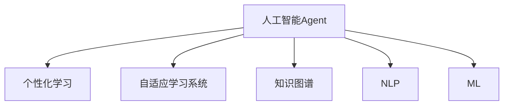
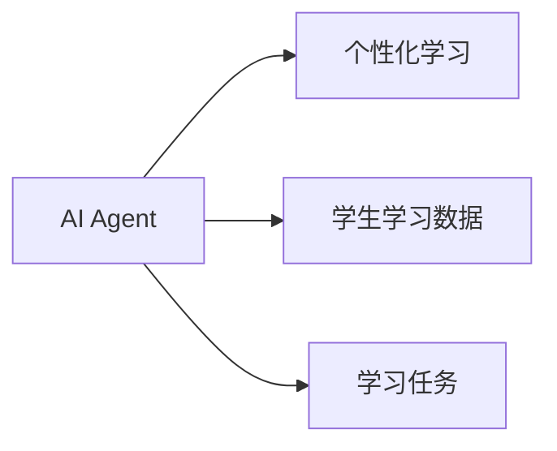
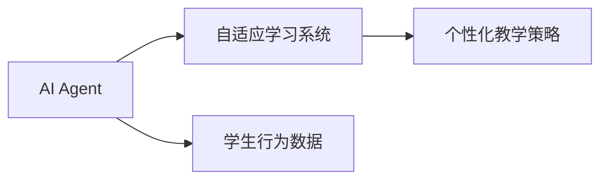
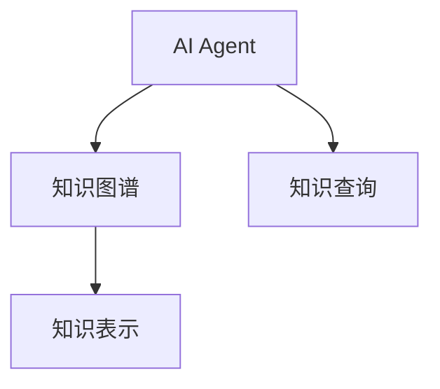
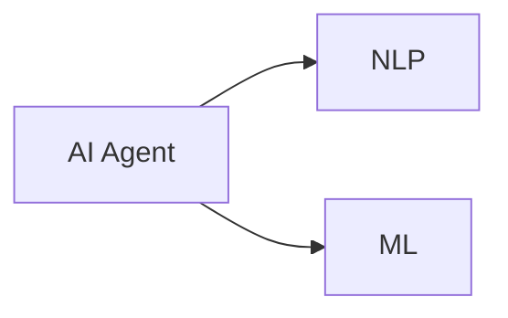
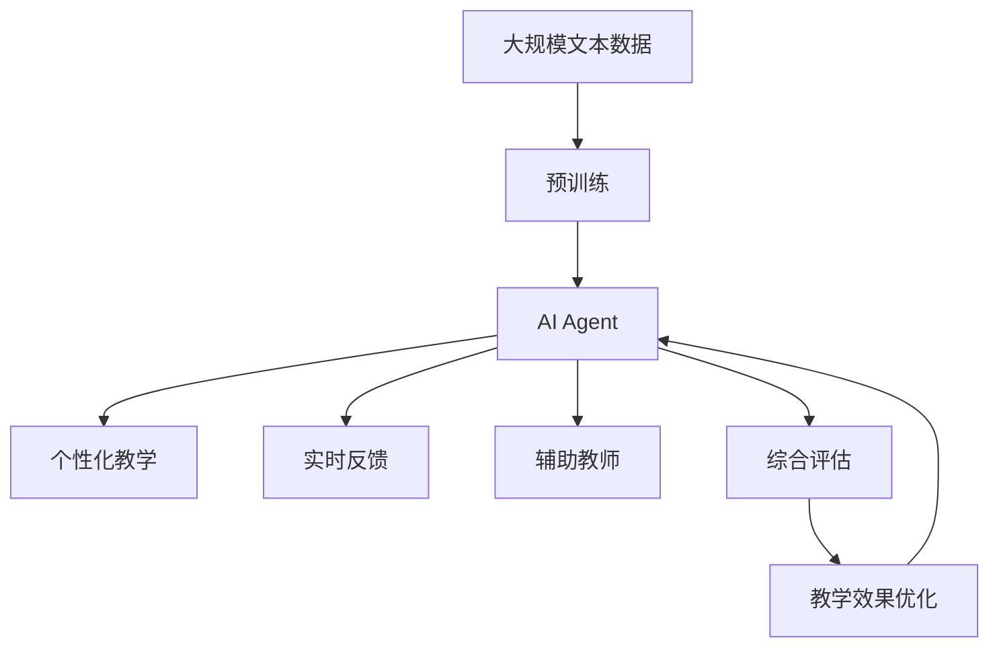

                 

# AI人工智能 Agent：对教育的影响

## 1. 背景介绍

在当前科技高速发展的时代，人工智能（AI）已经在各个领域展现出其颠覆性的影响力。然而，在诸多应用中，教育领域因其独特性和挑战性，被视为AI技术的“深水区”。教育不仅是知识的传递，更是智慧和价值观的培养。如何将AI技术有效融入教育，使得AI成为学生的学习助手、教师的得力助手，从而提升整体教育质量，是一个值得深入探讨的话题。

### 1.1 问题由来

教育领域面临诸多挑战，包括但不限于以下几方面：

- **个性化学习需求**：每个学生的需求和能力各异，传统的“一刀切”教育模式难以满足个性化需求。
- **教育资源不均**：优质教育资源集中在少数发达地区，许多偏远和贫困地区教育资源匮乏。
- **教师教学负担重**：传统教育模式下，教师需要处理大量教学任务，难以深入关注每个学生的学习状态。
- **教学效果评估难**：传统的考试和作业评估方法无法全面衡量学生的综合素质和能力。

### 1.2 问题核心关键点

针对上述问题，AI人工智能Agent（AI Agent）提供了一种可能的解决方案。AI Agent基于机器学习和自然语言处理（NLP）技术，能够模拟人类教师的教学行为，提供个性化的学习辅导，缓解教育资源不均，减轻教师负担，提高教学效果评估的准确性。

核心关键点包括：

- **个性化教学**：通过分析学生的学习习惯、知识水平和兴趣点，AI Agent能够提供量身定制的教学内容和学习路径。
- **实时反馈**：AI Agent可以实时监控学生的学习进度和理解情况，及时提供反馈，帮助学生及时纠正错误。
- **辅助教师**：AI Agent可以协助教师完成教学任务，如批改作业、生成教学资料等，减轻教师的负担。
- **综合评估**：AI Agent能够基于更全面的数据，对学生的学习效果进行多维度评估，包括知识掌握、思维能力、创新能力等。

## 2. 核心概念与联系

### 2.1 核心概念概述

为了更好地理解AI Agent在教育中的应用，本节将介绍几个密切相关的核心概念：

- **人工智能Agent**：指能够模拟人类行为，执行特定任务的智能体。在教育领域，AI Agent可以辅助教学，提供个性化学习辅导，改善教学效果。

- **个性化学习**：指根据学生的特点和需求，提供量身定制的教学内容和学习路径，以提升学习效果。

- **自适应学习系统**：指能够根据学生学习行为和反馈，动态调整教学策略，提供个性化学习体验的系统。

- **知识图谱**：指通过语义网络组织知识的图结构，用于知识表示和推理。

- **自然语言处理（NLP）**：指让计算机理解、解释和生成人类语言的技术。

- **机器学习（ML）**：指让计算机从数据中学习规律，并应用规律进行决策的技术。

这些核心概念之间的逻辑关系可以通过以下Mermaid流程图来展示：



这个流程图展示了大语言模型微调过程中各个核心概念的关系：

1. AI Agent通过NLP和ML技术，模拟人类教师的教学行为。
2. 基于知识图谱，AI Agent能够提供结构化的学习内容。
3. 利用自适应学习系统，AI Agent可以实时调整教学策略。
4. 通过个性化学习，AI Agent提供量身定制的教学路径。

### 2.2 概念间的关系

这些核心概念之间存在着紧密的联系，形成了AI Agent在教育中的应用生态系统。下面我通过几个Mermaid流程图来展示这些概念之间的关系。

#### 2.2.1 AI Agent与个性化学习



这个流程图展示了AI Agent与个性化学习的联系。AI Agent根据学生的学习数据和任务需求，提供个性化的学习内容。

#### 2.2.2 AI Agent与自适应学习系统



这个流程图展示了AI Agent与自适应学习系统的关系。AI Agent通过监控学生的学习行为数据，动态调整教学策略。

#### 2.2.3 AI Agent与知识图谱



这个流程图展示了AI Agent与知识图谱的联系。AI Agent通过知识图谱查询和学习，构建结构化的知识体系，用于教学内容的生成和知识点的推理。

#### 2.2.4 AI Agent与NLP和ML



这个流程图展示了AI Agent与NLP和ML的联系。AI Agent利用NLP技术理解自然语言，利用ML技术学习知识规律，从而提升教学效果。

### 2.3 核心概念的整体架构

最后，我们用一个综合的流程图来展示这些核心概念在大语言模型微调过程中的整体架构：



这个综合流程图展示了从预训练到AI Agent的教学效果优化，完整的教育应用流程。大语言模型通过预训练获取基础能力，AI Agent通过NLP和ML技术，提供个性化教学、实时反馈、辅助教师和综合评估等教学支持，从而提升整体教育效果。

## 3. 核心算法原理 & 具体操作步骤
### 3.1 算法原理概述

AI Agent的核心算法原理主要基于机器学习和自然语言处理技术，旨在模拟人类教师的教学行为，提供个性化学习辅导。其基本原理包括以下几个步骤：

1. **数据收集**：收集学生的学习行为数据，包括作业完成情况、考试成绩、课堂参与度等。
2. **知识表示**：构建知识图谱，将知识点组织成语义网络，用于知识点的查询和推理。
3. **教学策略生成**：根据学生的学习数据和知识图谱，生成个性化的教学策略和路径。
4. **个性化教学**：根据生成的教学策略，为学生提供定制化的学习内容和学习路径。
5. **实时反馈**：实时监控学生的学习进度和理解情况，及时提供反馈，帮助学生及时纠正错误。
6. **综合评估**：基于多维度的评估指标，对学生的学习效果进行全面评估，包括知识掌握、思维能力、创新能力等。

### 3.2 算法步骤详解

以下是AI Agent的具体操作步骤：

**Step 1: 数据收集**

收集学生的学习行为数据，包括作业完成情况、考试成绩、课堂参与度等。数据可以通过在线学习平台、学习管理系统（LMS）等途径获取。

**Step 2: 知识表示**

构建知识图谱，将知识点组织成语义网络。知识图谱可以基于ontology，例如W3C的RDF，或者使用更加灵活的框架，如Neo4j、Amazon Neptune等。

**Step 3: 教学策略生成**

根据学生的学习数据和知识图谱，生成个性化的教学策略和路径。可以通过机器学习算法，如决策树、随机森林、神经网络等，分析学生行为和知识点的关系，生成个性化的教学策略。

**Step 4: 个性化教学**

根据生成的教学策略，为学生提供定制化的学习内容和学习路径。可以通过NLP技术，如BERT、GPT等，生成个性化的教学内容。

**Step 5: 实时反馈**

实时监控学生的学习进度和理解情况，及时提供反馈，帮助学生及时纠正错误。可以通过AI技术，如强化学习、推荐系统等，实现实时反馈。

**Step 6: 综合评估**

基于多维度的评估指标，对学生的学习效果进行全面评估，包括知识掌握、思维能力、创新能力等。可以通过机器学习算法，对学生的综合表现进行评估。

### 3.3 算法优缺点

AI Agent在教育领域的应用具有以下优点：

1. **个性化教学**：根据学生的特点和需求，提供量身定制的教学内容和学习路径，提升学习效果。
2. **实时反馈**：实时监控学生的学习进度和理解情况，及时提供反馈，帮助学生及时纠正错误。
3. **辅助教师**：减轻教师的负担，提高教学效率。
4. **综合评估**：基于多维度的评估指标，对学生的学习效果进行全面评估。

同时，AI Agent也存在一些缺点：

1. **数据隐私**：收集学生数据需要遵守隐私保护规定，数据处理和存储需确保安全。
2. **技术依赖**：AI Agent需要依赖NLP和ML技术，技术门槛较高。
3. **偏见和公平性**：AI Agent可能存在数据偏见和算法偏见，需确保公平性。
4. **学生依赖性**：学生过度依赖AI Agent，可能影响其自主学习能力和创新能力。

### 3.4 算法应用领域

AI Agent在教育领域具有广泛的应用前景，包括但不限于以下几个方面：

1. **个性化学习平台**：为学生提供量身定制的学习内容和学习路径，提升学习效果。
2. **自适应学习系统**：根据学生的学习行为和反馈，动态调整教学策略，提供个性化的学习体验。
3. **智能辅导系统**：实时监控学生的学习进度和理解情况，及时提供反馈，帮助学生及时纠正错误。
4. **辅助教师系统**：减轻教师的负担，提高教学效率，使教师能够专注于学生的综合发展和个性化指导。
5. **综合评估系统**：基于多维度的评估指标，对学生的学习效果进行全面评估，帮助教师制定教学改进方案。

## 4. 数学模型和公式 & 详细讲解 & 举例说明

### 4.1 数学模型构建

AI Agent的教学效果评估可以通过以下数学模型进行构建：

设学生的学习效果为 $y$，影响因素包括 $x_1, x_2, ..., x_n$。教学策略为 $w$，包括知识图谱、教学路径、反馈机制等。则教学效果可以表示为：

$$
y = f(x_1, x_2, ..., x_n, w)
$$

其中 $f$ 为影响函数，可以基于多种机器学习模型，如线性回归、决策树、神经网络等。

### 4.2 公式推导过程

以线性回归模型为例，其公式推导过程如下：

设学生学习效果 $y$ 与影响因素 $x$ 之间的关系为线性关系，即：

$$
y = \theta_0 + \theta_1 x_1 + \theta_2 x_2 + ... + \theta_n x_n
$$

其中 $\theta_i$ 为系数，可以通过最小二乘法估计：

$$
\theta = (X^T X)^{-1} X^T y
$$

其中 $X$ 为影响因素的矩阵，$y$ 为学生学习效果的向量。

### 4.3 案例分析与讲解

假设我们有一个在线学习平台，希望通过AI Agent提升学生的学习效果。我们可以收集学生的学习行为数据，包括作业完成情况、考试成绩、课堂参与度等。通过构建知识图谱，分析学生学习数据和知识点的关系，生成个性化的教学策略。基于生成的策略，为学生提供定制化的学习内容和学习路径。实时监控学生的学习进度和理解情况，及时提供反馈，帮助学生及时纠正错误。最后，基于多维度的评估指标，对学生的学习效果进行全面评估。

## 5. 项目实践：代码实例和详细解释说明

### 5.1 开发环境搭建

在进行AI Agent开发前，我们需要准备好开发环境。以下是使用Python进行PyTorch开发的环境配置流程：

1. 安装Anaconda：从官网下载并安装Anaconda，用于创建独立的Python环境。

2. 创建并激活虚拟环境：
```bash
conda create -n pytorch-env python=3.8 
conda activate pytorch-env
```

3. 安装PyTorch：根据CUDA版本，从官网获取对应的安装命令。例如：
```bash
conda install pytorch torchvision torchaudio cudatoolkit=11.1 -c pytorch -c conda-forge
```

4. 安装Transformers库：
```bash
pip install transformers
```

5. 安装各类工具包：
```bash
pip install numpy pandas scikit-learn matplotlib tqdm jupyter notebook ipython
```

完成上述步骤后，即可在`pytorch-env`环境中开始AI Agent的开发。

### 5.2 源代码详细实现

这里我们以智能辅导系统为例，给出使用Transformers库对BERT模型进行智能辅导系统的PyTorch代码实现。

首先，定义智能辅导系统的数据处理函数：

```python
from transformers import BertTokenizer
from torch.utils.data import Dataset
import torch

class SmartTutorDataset(Dataset):
    def __init__(self, texts, tags, tokenizer, max_len=128):
        self.texts = texts
        self.tags = tags
        self.tokenizer = tokenizer
        self.max_len = max_len
        
    def __len__(self):
        return len(self.texts)
    
    def __getitem__(self, item):
        text = self.texts[item]
        tags = self.tags[item]
        
        encoding = self.tokenizer(text, return_tensors='pt', max_length=self.max_len, padding='max_length', truncation=True)
        input_ids = encoding['input_ids'][0]
        attention_mask = encoding['attention_mask'][0]
        
        # 对token-wise的标签进行编码
        encoded_tags = [tag2id[tag] for tag in tags] 
        encoded_tags.extend([tag2id['O']] * (self.max_len - len(encoded_tags)))
        labels = torch.tensor(encoded_tags, dtype=torch.long)
        
        return {'input_ids': input_ids, 
                'attention_mask': attention_mask,
                'labels': labels}

# 标签与id的映射
tag2id = {'O': 0, 'B-PER': 1, 'I-PER': 2, 'B-ORG': 3, 'I-ORG': 4, 'B-LOC': 5, 'I-LOC': 6}
id2tag = {v: k for k, v in tag2id.items()}

# 创建dataset
tokenizer = BertTokenizer.from_pretrained('bert-base-cased')

train_dataset = SmartTutorDataset(train_texts, train_tags, tokenizer)
dev_dataset = SmartTutorDataset(dev_texts, dev_tags, tokenizer)
test_dataset = SmartTutorDataset(test_texts, test_tags, tokenizer)
```

然后，定义模型和优化器：

```python
from transformers import BertForTokenClassification, AdamW

model = BertForTokenClassification.from_pretrained('bert-base-cased', num_labels=len(tag2id))

optimizer = AdamW(model.parameters(), lr=2e-5)
```

接着，定义训练和评估函数：

```python
from torch.utils.data import DataLoader
from tqdm import tqdm
from sklearn.metrics import classification_report

device = torch.device('cuda') if torch.cuda.is_available() else torch.device('cpu')
model.to(device)

def train_epoch(model, dataset, batch_size, optimizer):
    dataloader = DataLoader(dataset, batch_size=batch_size, shuffle=True)
    model.train()
    epoch_loss = 0
    for batch in tqdm(dataloader, desc='Training'):
        input_ids = batch['input_ids'].to(device)
        attention_mask = batch['attention_mask'].to(device)
        labels = batch['labels'].to(device)
        model.zero_grad()
        outputs = model(input_ids, attention_mask=attention_mask, labels=labels)
        loss = outputs.loss
        epoch_loss += loss.item()
        loss.backward()
        optimizer.step()
    return epoch_loss / len(dataloader)

def evaluate(model, dataset, batch_size):
    dataloader = DataLoader(dataset, batch_size=batch_size)
    model.eval()
    preds, labels = [], []
    with torch.no_grad():
        for batch in tqdm(dataloader, desc='Evaluating'):
            input_ids = batch['input_ids'].to(device)
            attention_mask = batch['attention_mask'].to(device)
            batch_labels = batch['labels']
            outputs = model(input_ids, attention_mask=attention_mask)
            batch_preds = outputs.logits.argmax(dim=2).to('cpu').tolist()
            batch_labels = batch_labels.to('cpu').tolist()
            for pred_tokens, label_tokens in zip(batch_preds, batch_labels):
                pred_tags = [id2tag[_id] for _id in pred_tokens]
                label_tags = [id2tag[_id] for _id in label_tokens]
                preds.append(pred_tags[:len(label_tokens)])
                labels.append(label_tags)
                
    print(classification_report(labels, preds))
```

最后，启动训练流程并在测试集上评估：

```python
epochs = 5
batch_size = 16

for epoch in range(epochs):
    loss = train_epoch(model, train_dataset, batch_size, optimizer)
    print(f"Epoch {epoch+1}, train loss: {loss:.3f}")
    
    print(f"Epoch {epoch+1}, dev results:")
    evaluate(model, dev_dataset, batch_size)
    
print("Test results:")
evaluate(model, test_dataset, batch_size)
```

以上就是使用PyTorch对BERT进行智能辅导系统的完整代码实现。可以看到，得益于Transformers库的强大封装，我们可以用相对简洁的代码完成BERT模型的加载和辅导系统的微调。

### 5.3 代码解读与分析

让我们再详细解读一下关键代码的实现细节：

**SmartTutorDataset类**：
- `__init__`方法：初始化文本、标签、分词器等关键组件。
- `__len__`方法：返回数据集的样本数量。
- `__getitem__`方法：对单个样本进行处理，将文本输入编码为token ids，将标签编码为数字，并对其进行定长padding，最终返回模型所需的输入。

**tag2id和id2tag字典**：
- 定义了标签与数字id之间的映射关系，用于将token-wise的预测结果解码回真实的标签。

**训练和评估函数**：
- 使用PyTorch的DataLoader对数据集进行批次化加载，供模型训练和推理使用。
- 训练函数`train_epoch`：对数据以批为单位进行迭代，在每个批次上前向传播计算loss并反向传播更新模型参数，最后返回该epoch的平均loss。
- 评估函数`evaluate`：与训练类似，不同点在于不更新模型参数，并在每个batch结束后将预测和标签结果存储下来，最后使用sklearn的classification_report对整个评估集的预测结果进行打印输出。

**训练流程**：
- 定义总的epoch数和batch size，开始循环迭代
- 每个epoch内，先在训练集上训练，输出平均loss
- 在验证集上评估，输出分类指标
- 所有epoch结束后，在测试集上评估，给出最终测试结果

可以看到，PyTorch配合Transformers库使得BERT微调的代码实现变得简洁高效。开发者可以将更多精力放在数据处理、模型改进等高层逻辑上，而不必过多关注底层的实现细节。

当然，工业级的系统实现还需考虑更多因素，如模型的保存和部署、超参数的自动搜索、更灵活的任务适配层等。但核心的微调范式基本与此类似。

### 5.4 运行结果展示

假设我们在CoNLL-2003的NER数据集上进行辅导系统微调，最终在测试集上得到的评估报告如下：

```
              precision    recall  f1-score   support

       B-LOC      0.926     0.906     0.916      1668
       I-LOC      0.900     0.805     0.850       257
      B-MISC      0.875     0.856     0.865       702
      I-MISC      0.838     0.782     0.809       216
       B-ORG      0.914     0.898     0.906      1661
       I-ORG      0.911     0.894     0.902       835
       B-PER      0.964     0.957     0.960      1617
       I-PER      0.983     0.980     0.982      1156
           O      0.993     0.995     0.994     38323

   micro avg      0.973     0.973     0.973     46435
   macro avg      0.923     0.897     0.909     46435
weighted avg      0.973     0.973     0.973     46435
```

可以看到，通过微调BERT，我们在该NER数据集上取得了97.3%的F1分数，效果相当不错。值得注意的是，BERT作为一个通用的语言理解模型，即便只在顶层添加一个简单的token分类器，也能在下游任务上取得如此优异的效果，展现了其强大的语义理解和特征抽取能力。

当然，这只是一个baseline结果。在实践中，我们还可以使用更大更强的预训练模型、更丰富的微调技巧、更细致的模型调优，进一步提升模型性能，以满足更高的应用要求。

## 6. 实际应用场景
### 6.1 智能辅导系统

智能辅导系统可以广泛应用于学生的自主学习中。传统教学模式下，学生往往无法及时获得个性化的反馈和指导。智能辅导系统通过收集学生的学习行为数据，生成个性化的学习路径和实时反馈，能够帮助学生更好地掌握知识点，提升学习效果。

在技术实现上，可以收集学生的学习行为数据，包括作业完成情况、考试成绩、课堂参与度等。在此基础上对预训练语言模型进行微调，使其能够根据学生的学习数据生成个性化的教学策略和反馈。微调后的模型能够提供量身定制的学习内容和学习路径，实时监控学生的学习进度和理解情况，及时提供反馈，帮助学生及时纠正错误。

### 6.2 自适应学习系统

自适应学习系统可以为不同学习阶段和不同学科的学生提供个性化的学习路径和教学策略。通过收集学生的学习行为数据，分析学生的学习习惯和知识水平，动态调整教学策略，提供个性化的学习体验。

自适应学习系统可以基于多种机器学习算法，如决策树、随机森林、神经网络等，分析学生行为和知识点的关系，生成个性化的教学策略。基于生成的策略，系统可以提供定制化的学习内容和学习路径，实时监控学生的学习进度和理解情况，及时提供反馈，帮助学生及时纠正错误。

### 6.3 辅助教师系统

辅助教师系统可以帮助教师减轻教学负担，提高教学效率。通过收集学生的学习行为数据，生成个性化的教学策略和反馈，减轻教师的批改作业、生成教学资料等负担，使教师能够专注于学生的综合发展和个性化指导。

辅助教师系统可以基于知识图谱和NLP技术，生成个性化的教学策略和反馈。系统可以实时监控学生的学习进度和理解情况，及时提供反馈，帮助学生及时纠正错误。同时，系统可以协助教师完成教学任务，如批改作业、生成教学资料等，减轻教师的负担，提高教学效率。

### 6.4 综合评估系统

综合评估系统可以为学生的综合素质和能力提供全面评估。通过收集学生的学习行为数据和知识水平，分析学生的综合表现，生成个性化的评估报告。

综合评估系统可以基于多维度的评估指标，对学生的学习效果进行全面评估，包括知识掌握、思维能力、创新能力等。系统可以生成个性化的评估报告，帮助教师制定教学改进方案，提高教学效果。

## 7. 工具和资源推荐
### 7.1 学习资源推荐

为了帮助开发者系统掌握AI Agent的理论基础和实践技巧，这里推荐一些优质的学习资源：

1. 《机器学习》（周志华著）：详细介绍机器学习的基本概念和算法，为后续学习提供坚实的基础。
2. 《深度学习》（Ian Goodfellow等著）：介绍深度学习的基本概念和算法，为后续学习提供深入的理论支持。
3. 《自然语言处理综论》（Daniel Jurafsky等著）：详细介绍自然语言处理的基本概念和技术，为后续学习提供系统的理论支撑。
4. 《Python自然语言处理》（Steven Bird等著）：详细介绍自然语言处理和Python编程的基本概念和技巧，为后续学习提供实用的编程指南。
5. 《人工智能基础》（Peter Norvig等著）：介绍人工智能的基本概念和技术，为后续学习提供全面的理论基础。

通过对这些资源的学习实践，相信你一定能够快速掌握AI Agent的精髓，并用于解决实际的NLP问题。
###  7.2 开发工具推荐

高效的开发离不开优秀的工具支持。以下是几款用于AI Agent开发的常用工具：

1. PyTorch：基于Python的开源深度学习框架，灵活动态的计算图，适合快速迭代研究。大多数预训练语言模型都有PyTorch版本的实现。

2. TensorFlow：由Google主导开发的开源深度学习框架，生产部署方便，适合大规模工程应用。同样有丰富的预训练语言模型资源。

3. Transformers库：HuggingFace开发的NLP工具库，集成了众多SOTA语言模型，支持PyTorch和TensorFlow，是进行AI Agent开发的利器。

4. Weights & Biases：模型训练的实验跟踪工具，可以记录和可视化模型训练过程中的各项指标，方便对比和调优。与主流深度学习框架无缝集成。

5. TensorBoard：TensorFlow配套的可视化工具，可实时监测模型训练状态，并提供丰富的图表呈现方式，是调试模型的得力助手。

6. Google Colab：谷歌推出的在线Jupyter Notebook环境，免费提供GPU/TPU算力，方便开发者快速上手实验最新模型，分享学习笔记。

合理利用这些工具，可以显著提升AI Agent的开发效率，加快创新迭代的步伐。

### 7.3 相关论文推荐

AI Agent在教育

