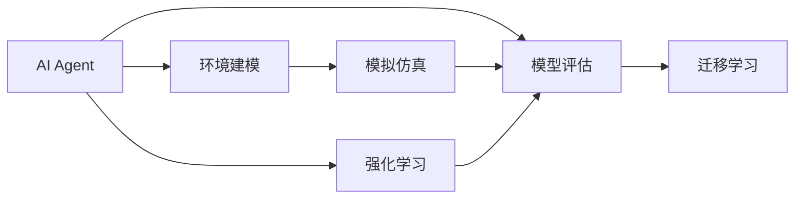
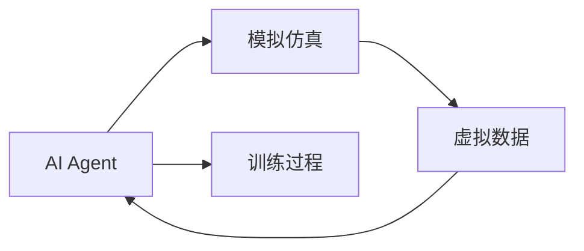
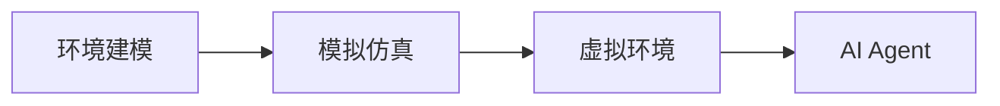
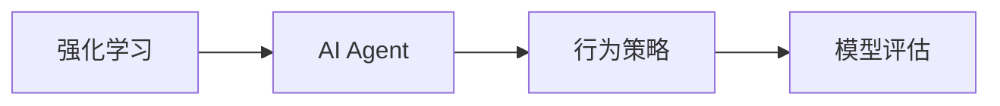
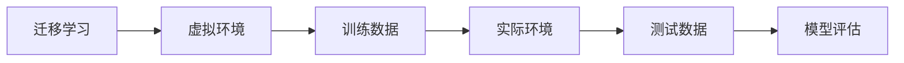
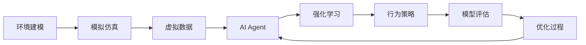

                 

# AI人工智能 Agent：环境建模与模拟

> 关键词：人工智能(AI)、环境建模、智能体(Agent)、模拟仿真、机器学习、深度学习、强化学习

## 1. 背景介绍

### 1.1 问题由来

随着人工智能技术的发展，AI Agent在各种领域的应用越来越广泛，如游戏AI、机器人导航、自动驾驶等。AI Agent的核心目标是通过学习环境知识，实现自主决策和行为优化。然而，在真实环境中获取足够数据进行训练，往往成本高昂且存在各种未知的干扰因素。因此，通过模拟仿真环境，对AI Agent进行建模和训练，成为一种高效、安全、可控的解决方案。

模拟环境建模主要涉及以下几个关键问题：
1. **环境建模**：如何精确建模环境，包括物理系统、动态交互、非结构化信息等。
2. **智能体仿真**：如何构建智能体模型，使其能够在模拟环境中执行预定任务。
3. **模型评估**：如何评估AI Agent在模拟环境中的性能和鲁棒性。
4. **迁移应用**：如何将模拟环境中的训练结果迁移到真实环境中，进行实际应用。

### 1.2 问题核心关键点

AI Agent环境建模与模拟的核心关键点主要包括：

- **环境建模**：包括动态建模、系统仿真、场景渲染等技术，使模拟环境尽可能贴近真实世界。
- **智能体设计**：通过选择合适的算法框架（如机器学习、深度学习、强化学习），设计高效的智能体模型。
- **训练与优化**：采用监督学习、无监督学习、强化学习等方法，训练智能体在模拟环境中的行为。
- **模型验证**：通过测试和实验，评估AI Agent的性能和鲁棒性，检测潜在的缺陷和风险。
- **应用部署**：将训练好的AI Agent部署到真实环境中，进行实际任务执行。

这些关键点共同构成了AI Agent环境建模与模拟的基本框架，其目的是在可控的虚拟环境中，高效、安全地训练和验证AI Agent，为实际应用打下坚实基础。

### 1.3 问题研究意义

AI Agent环境建模与模拟的研究意义主要体现在以下几个方面：

1. **降低训练成本**：通过模拟环境，可以大幅降低训练成本，尤其是对于需要大量数据和昂贵实验的场景。
2. **提高模型鲁棒性**：模拟环境不受实际环境噪声和不确定性影响，有助于提高AI Agent的鲁棒性和泛化能力。
3. **加速模型开发**：通过反复迭代和测试，快速优化AI Agent的行为策略，加速模型开发进程。
4. **安全验证**：在模拟环境中进行风险评估和安全测试，避免AI Agent在真实环境中产生不良后果。
5. **促进跨领域应用**：模拟环境可以应用于各种领域，如游戏、机器人、自动驾驶等，为AI Agent的跨领域应用提供支持。

## 2. 核心概念与联系

### 2.1 核心概念概述

为更好地理解AI Agent环境建模与模拟，本节将介绍几个密切相关的核心概念：

- **AI Agent**：能够在虚拟或现实环境中自主决策和执行任务的计算实体，如游戏AI、机器人、自动驾驶等。
- **模拟仿真**：使用软件和硬件构建虚拟环境，模拟真实世界的各种动态和交互过程，为AI Agent提供训练数据。
- **环境建模**：对现实世界进行数学和物理建模，建立虚拟仿真环境，为AI Agent提供训练和测试的基础。
- **强化学习**：一种基于奖励和惩罚机制的机器学习范式，用于训练AI Agent在模拟环境中学习最优策略。
- **模型评估**：通过一系列指标和测试，评估AI Agent在模拟环境中的性能和可靠性。
- **迁移学习**：将AI Agent在模拟环境中学习到的知识迁移到实际环境中，进行实际应用。

这些核心概念之间的逻辑关系可以通过以下Mermaid流程图来展示：



这个流程图展示了AI Agent环境建模与模拟的核心概念及其之间的关系：

1. AI Agent通过环境建模获得虚拟训练环境。
2. 使用模拟仿真技术生成虚拟数据，供AI Agent训练和测试。
3. 采用强化学习等算法，训练AI Agent在虚拟环境中的行为策略。
4. 通过模型评估，验证AI Agent的性能和鲁棒性。
5. 将AI Agent在模拟环境中的知识迁移到实际环境，进行实际应用。

### 2.2 概念间的关系

这些核心概念之间存在着紧密的联系，形成了AI Agent环境建模与模拟的完整生态系统。下面我通过几个Mermaid流程图来展示这些概念之间的关系。

#### 2.2.1 AI Agent与模拟仿真



这个流程图展示了AI Agent与模拟仿真技术的基本关系：

1. AI Agent在模拟仿真环境中进行训练和测试。
2. 模拟仿真生成虚拟数据，供AI Agent学习。
3. AI Agent通过训练和测试不断优化行为策略。

#### 2.2.2 环境建模与模拟仿真



这个流程图展示了环境建模与模拟仿真技术的关系：

1. 环境建模提供虚拟环境的基础模型和数据。
2. 模拟仿真技术在此基础上生成虚拟数据和环境。
3. AI Agent在虚拟环境中进行训练和测试。

#### 2.2.3 强化学习与模型评估



这个流程图展示了强化学习与模型评估的关系：

1. 强化学习训练AI Agent的行为策略。
2. AI Agent根据行为策略进行模拟仿真和测试。
3. 模型评估验证AI Agent的性能和鲁棒性。

#### 2.2.4 迁移学习与模型评估



这个流程图展示了迁移学习与模型评估的关系：

1. 迁移学习将虚拟环境中的知识迁移到实际环境中。
2. 实际环境提供测试数据，评估AI Agent的性能和鲁棒性。
3. 模型评估确保AI Agent在实际环境中的表现符合预期。

### 2.3 核心概念的整体架构

最后，我们用一个综合的流程图来展示这些核心概念在大语言模型微调过程中的整体架构：



这个综合流程图展示了环境建模与模拟仿真、AI Agent、强化学习、行为策略、模型评估、优化过程等关键概念在大语言模型微调过程中的整体架构：

1. 环境建模提供虚拟环境的基础。
2. 模拟仿真生成虚拟数据，供AI Agent学习。
3. AI Agent在虚拟环境中进行训练和测试。
4. 强化学习训练AI Agent的行为策略。
5. 行为策略在虚拟环境中执行，产生行为数据。
6. 模型评估验证AI Agent的性能和鲁棒性。
7. 优化过程根据评估结果，调整行为策略和模型参数。
8. 调整后的AI Agent在虚拟环境中进行迭代训练。

通过这些流程图，我们可以更清晰地理解AI Agent环境建模与模拟过程中各个核心概念的关系和作用，为后续深入讨论具体的建模与模拟方法奠定基础。

## 3. 核心算法原理 & 具体操作步骤

### 3.1 算法原理概述

AI Agent环境建模与模拟的核心原理是通过构建虚拟环境，使用模拟仿真技术生成数据，采用机器学习、深度学习、强化学习等算法，训练AI Agent的行为策略，并通过模型评估验证其性能。其具体流程如下：

1. **环境建模**：建立虚拟环境模型，包括物理系统、交互规则、动态数据等，使模拟环境尽可能贴近真实世界。
2. **智能体设计**：选择合适的算法框架和模型结构，设计高效的AI Agent。
3. **数据生成**：在模拟环境中运行AI Agent，生成虚拟数据。
4. **训练过程**：使用监督学习、无监督学习、强化学习等方法，训练AI Agent的行为策略。
5. **模型评估**：通过一系列指标和测试，评估AI Agent的性能和鲁棒性。
6. **优化与迁移**：根据评估结果，优化AI Agent的行为策略和模型参数，将虚拟环境中的知识迁移到实际环境中。

### 3.2 算法步骤详解

以下是对AI Agent环境建模与模拟各步骤的详细讲解：

**Step 1: 环境建模**

环境建模是模拟仿真的基础，涉及以下几个关键步骤：

1. **系统设计**：定义物理系统和动态过程，建立数学和物理模型。例如，可以使用机器人学、物理模拟等技术，构建虚拟环境的动态行为。
2. **场景渲染**：根据物理模型，生成虚拟环境的三维渲染图，使用图形渲染技术展示环境。例如，可以使用Unity、Unreal Engine等引擎，构建逼真的虚拟环境。
3. **数据生成**：使用传感器和探测器，采集虚拟环境中的动态数据和交互数据。例如，可以使用传感器模拟摄像头、雷达等，采集环境中的物体位置、速度、形状等信息。

**Step 2: 智能体设计**

智能体设计是AI Agent的核心，涉及以下几个关键步骤：

1. **算法选择**：根据任务需求，选择合适的算法框架，如机器学习、深度学习、强化学习等。例如，对于决策问题，可以使用决策树、神经网络等模型；对于行为优化，可以使用强化学习等算法。
2. **模型结构**：设计高效的模型结构，包括输入、输出、隐藏层、激活函数等。例如，可以使用多层感知器、卷积神经网络、循环神经网络等模型。
3. **参数初始化**：初始化模型的参数，使用随机初始化或预训练模型等方法。例如，可以使用预训练模型初始化参数，加速训练过程。

**Step 3: 数据生成**

数据生成是训练AI Agent的基础，涉及以下几个关键步骤：

1. **模拟运行**：在虚拟环境中运行AI Agent，模拟其行为和决策。例如，在自动驾驶场景中，AI Agent模拟车辆的行驶、避障、导航等行为。
2. **数据采集**：采集AI Agent在虚拟环境中的行为数据和环境数据。例如，可以采集AI Agent的传感器数据、环境交互数据、行为结果等。
3. **数据预处理**：对采集到的数据进行预处理，包括清洗、归一化、特征提取等。例如，可以使用数据增强技术，扩充训练数据集。

**Step 4: 训练过程**

训练过程是AI Agent学习行为策略的核心，涉及以下几个关键步骤：

1. **模型训练**：使用监督学习、无监督学习、强化学习等方法，训练AI Agent的行为策略。例如，可以使用交叉熵损失、均方误差损失、强化学习等方法。
2. **优化算法**：选择优化算法及其参数，如Adam、SGD等，设置学习率、批大小、迭代轮数等。例如，可以使用Adam优化算法，设置学习率为0.001，批大小为32，迭代轮数为1000。
3. **损失计算**：计算模型预测与真实结果之间的损失，使用反向传播算法更新模型参数。例如，可以使用均方误差损失，计算预测值与真实值之间的差距。

**Step 5: 模型评估**

模型评估是验证AI Agent性能和鲁棒性的关键，涉及以下几个关键步骤：

1. **测试集划分**：将数据集划分为训练集、验证集和测试集，用于评估AI Agent的性能。例如，可以使用80-10-10的划分方法，将数据集划分为训练集、验证集和测试集。
2. **性能指标**：定义一系列性能指标，如准确率、召回率、F1分数、ROC曲线等，评估AI Agent的性能。例如，可以使用准确率和召回率，评估分类任务的性能。
3. **鲁棒性测试**：进行鲁棒性测试，检测AI Agent对噪声、干扰、异常数据的敏感度。例如，可以添加噪声数据，测试AI Agent的鲁棒性。

**Step 6: 优化与迁移**

优化与迁移是提升AI Agent性能和实际应用的关键，涉及以下几个关键步骤：

1. **参数优化**：根据模型评估结果，调整AI Agent的参数，优化其行为策略。例如，可以使用超参数调优技术，调整学习率、批大小、模型结构等。
2. **迁移应用**：将训练好的AI Agent迁移到实际环境中，进行实际任务执行。例如，在自动驾驶场景中，将训练好的AI Agent部署到实际车辆上，执行驾驶任务。
3. **数据融合**：将虚拟环境中的数据与实际环境中的数据进行融合，优化AI Agent的行为策略。例如，可以使用知识蒸馏技术，将虚拟环境中的知识迁移到实际环境中。

### 3.3 算法优缺点

AI Agent环境建模与模拟具有以下优点：

1. **高效性**：通过模拟仿真，可以大幅降低训练成本，提高模型开发效率。
2. **安全性**：在虚拟环境中进行训练，可以避免真实环境中的安全风险。
3. **可控性**：虚拟环境可以模拟各种异常情况，提高AI Agent的鲁棒性和泛化能力。
4. **灵活性**：可以针对不同任务需求，灵活设计AI Agent的行为策略。

同时，该方法也存在一定的局限性：

1. **精度有限**：模拟环境难以完全模拟真实环境的复杂性和动态变化，可能影响AI Agent的行为策略。
2. **计算资源需求高**：模拟仿真环境需要大量的计算资源，特别是对于大规模系统和高复杂度场景。
3. **模型复杂性**：设计高效的AI Agent模型需要复杂的算法和数据处理，可能需要较高的专业知识。
4. **迁移挑战**：将虚拟环境中的知识迁移到实际环境中，可能存在数据偏差和算法不匹配的问题。

尽管存在这些局限性，但就目前而言，AI Agent环境建模与模拟仍是最主流的训练方法之一，广泛应用于自动驾驶、机器人导航、游戏AI等领域。未来相关研究的重点在于如何进一步提高模拟环境的精度，降低计算资源需求，优化AI Agent的行为策略，以及提高迁移效果等。

### 3.4 算法应用领域

AI Agent环境建模与模拟在多个领域都有广泛的应用，例如：

1. **自动驾驶**：使用虚拟环境模拟道路交通情况，训练自动驾驶AI Agent的行为策略。例如，使用Unity或Unreal Engine构建虚拟城市环境，进行自动驾驶任务的训练和测试。
2. **机器人导航**：使用虚拟环境模拟机器人移动和避障，训练机器人的导航和路径规划策略。例如，使用Gazebo等模拟环境，进行机器人导航任务的训练和测试。
3. **游戏AI**：使用虚拟环境模拟游戏场景，训练游戏AI的行为策略。例如，使用Unity或Unreal Engine构建游戏场景，进行游戏AI的训练和测试。
4. **医疗模拟**：使用虚拟环境模拟医疗操作和情境，训练医疗AI的行为策略。例如，使用VREP等模拟环境，进行医疗AI的训练和测试。
5. **金融模拟**：使用虚拟环境模拟金融市场，训练金融AI的行为策略。例如，使用SuperCollider等模拟环境，进行金融AI的训练和测试。
6. **军事仿真**：使用虚拟环境模拟军事作战场景，训练军事AI的行为策略。例如，使用MetaSim等模拟环境，进行军事AI的训练和测试。

除了上述这些应用领域外，AI Agent环境建模与模拟还被创新性地应用到更多场景中，如智能交通、灾害模拟、城市规划等，为AI Agent的跨领域应用提供了新的方向。随着AI Agent和模拟仿真技术的不断进步，相信这些技术将在更广阔的应用领域发挥更大的作用。

## 4. 数学模型和公式 & 详细讲解  

### 4.1 数学模型构建

本节将使用数学语言对AI Agent环境建模与模拟过程进行更加严格的刻画。

假设AI Agent在虚拟环境 $E$ 中进行训练，环境 $E$ 的动态由一组微分方程描述，状态空间为 $\mathcal{X}$，控制空间为 $\mathcal{U}$，预测函数为 $f$。AI Agent的状态更新公式为：

$$
x_{t+1} = f(x_t, u_t)
$$

其中 $x_t \in \mathcal{X}$ 表示状态，$u_t \in \mathcal{U}$ 表示控制，$x_{t+1}$ 表示状态更新。AI Agent的行为策略由一个函数 $g$ 描述，表示在给定状态 $x_t$ 时，选择控制 $u_t$。

定义AI Agent在虚拟环境中的行为损失函数为 $\ell$，表示在状态 $x_t$ 和行为 $u_t$ 下，模型预测输出与真实结果之间的误差。例如，对于分类任务，可以使用交叉熵损失函数：

$$
\ell(x_t, u_t) = -\sum_{i=1}^n y_i \log \hat{y}_i
$$

其中 $y_i \in \{0,1\}$ 表示真实标签，$\hat{y}_i \in [0,1]$ 表示模型预测输出。

### 4.2 公式推导过程

以下我们以自动驾驶场景为例，推导强化学习在AI Agent环境建模与模拟中的应用。

假设自动驾驶AI Agent在虚拟环境 $E$ 中进行训练，环境 $E$ 的状态 $x_t$ 包括车辆位置、速度、方向等，控制 $u_t$ 包括加速度、转向角度等。AI Agent的行为策略 $g$ 表示在给定状态 $x_t$ 时，选择控制 $u_t$。

定义行为策略 $g$ 的参数为 $\theta$，AI Agent的行为策略为：

$$
u_t = g_\theta(x_t)
$$

在虚拟环境 $E$ 中，AI Agent的行为策略优化目标为最小化行为损失函数 $\ell$，即：

$$
\min_\theta \mathbb{E}_{x_t \sim p(x_t)} \ell(x_t, g_\theta(x_t))
$$

其中 $p(x_t)$ 表示状态 $x_t$ 的概率分布。为了优化上述目标，可以使用强化学习的策略梯度方法，计算行为策略 $g_\theta$ 的梯度：

$$
\nabla_\theta \mathbb{E}_{x_t \sim p(x_t)} \ell(x_t, g_\theta(x_t)) = \mathbb{E}_{x_t \sim p(x_t)} \nabla_\theta \ell(x_t, g_\theta(x_t))
$$

通过策略梯度方法，可以不断调整行为策略 $g_\theta$，优化AI Agent在虚拟环境中的行为表现。

### 4.3 案例分析与讲解

假设我们在自动驾驶场景中，使用强化学习训练AI Agent的行为策略，具体步骤如下：

1. **环境建模**：构建虚拟城市环境，包括道路、交通信号、行人等。例如，可以使用Unity或Unreal Engine，构建逼真的城市环境。
2. **智能体设计**：设计自动驾驶AI Agent的行为策略，包括决策模型和控制模型。例如，可以使用神经网络模型，设计决策模型和控制模型。
3. **数据生成**：在虚拟城市环境中，运行AI Agent，生成虚拟数据。例如，可以使用随机生成的方法，生成大量的行驶和避障数据。
4. **模型训练**：使用强化学习算法，训练AI Agent的行为策略。例如，可以使用策略梯度方法，训练决策模型和控制模型。
5. **模型评估**：在虚拟城市环境中，测试AI Agent的行为策略。例如，使用测试集评估AI Agent的性能和鲁棒性。
6. **优化与迁移**：根据测试结果，优化AI Agent的行为策略和模型参数。例如，可以使用超参数调优技术，调整学习率、批大小、模型结构等。

通过以上步骤，可以在虚拟环境中高效训练自动驾驶AI Agent，提升其行为策略的性能和鲁棒性。

## 5. 项目实践：代码实例和详细解释说明

### 5.1 开发环境搭建

在进行AI Agent环境建模与模拟实践前，我们需要准备好开发环境。以下是使用Python进行OpenAI Gym开发的环境配置流程：

1. 安装Anaconda：从官网下载并安装Anaconda，用于创建独立的Python环境。

2. 创建并激活虚拟环境：
```bash
conda create -n gym-env python=3.8 
conda activate gym-env
```

3. 安装OpenAI Gym：从官网获取安装命令，例如：
```bash
pip install gym
```

4. 安装 Gym 的虚拟环境库：
```bash
pip install gym-gymnasium
pip install gym-unreal
```

5. 安装 Gym 的模拟环境库：
```bash
pip install gym-vizdoom
```

完成上述步骤后，即可在`gym-env`环境中开始环境建模与模拟实践。

### 5.2 源代码详细实现

下面我们以自动驾驶场景为例，给出使用OpenAI Gym进行强化学习训练AI Agent的Python代码实现。

首先，定义环境类：

```python
from gym import Env
from gym.envs.classic_control import cartpole

class CarEnv(Env):
    def __init__(self):
        super(CarEnv, self).__init__()
        self.gravity = 9.8
        self.mass = 0.7
        self.length = 0.5
        self.half_mass_length = self.mass * self.length / 2.0
        self.kinematic_reflection = True

    def step(self, u):
        x, x_dot, theta, theta_dot = self.state
        cos_theta = np.cos(theta)
        sin_theta = np.sin(theta)
        g = self.gravity
        m = self.mass
        half_mass_length = self.half_mass_length
        l = self.length
        dt = 0.02

        x += x_dot * dt
        x_dot += (self.g * np.sin(theta) - np.cos(theta) * x_dot * u) * dt / m + g * l * sin_theta / (2.0 * half_mass_length) + self.kinematic_reflection * (np.cos(theta) * u - 0.5 * (x_dot**2 - g ** 2 * l** 2 / (4.0 * half_mass_length** 2)) / (0.5 * self.mass) / (self.mass * l** 2 / 3.0 + half_mass_length * (1.0 - np.cos(theta)** 2))
        theta += theta_dot * dt
        theta_dot += (g * np.sin(theta) * l / half_mass_length - u / m * np.cos(theta)) * dt / half_mass_length

        self.state = (x, x_dot, theta, theta_dot)
        return self.state, -1 * (x**2 + (theta - np.pi) ** 2), False, {}

    def reset(self):
        high = np.array([1.0, 1.0, 1.0, 1.0])
        self.state = np.random.uniform(-high, high, size=(4,))
        return self.state

    def render(self, mode='human'):
        pass
```

然后，定义强化学习训练函数：

```python
from gym import spaces
import numpy as np
from tensorflow.keras.models import Sequential
from tensorflow.keras.layers import Dense
from tensorflow.keras.optimizers import Adam

def train_agent(env, model, optimizer):
    state_dim = env.observation_space.shape[0]
    action_dim = env.action_space.shape[0]

    model.compile(loss='mse', optimizer=optimizer)
    state = env.reset()
    done = False
    episodes = 0
    total_reward = 0
    while not done:
        env.render()
        action = model.predict(state[np.newaxis, :])
        state, reward, done, _ = env.step(action[0])
        total_reward += reward
        if done:
            state = env.reset()
            episodes += 1
        model.fit(state[np.newaxis, :], action[0], epochs=1, batch_size=1, verbose=0)
    return episodes, total_reward
```

最后，启动训练流程：

```python
env = CarEnv()

model = Sequential()
model.add(Dense(32, input_dim=state_dim, activation='relu'))
model.add(Dense(action_dim, activation='sigmoid'))
model.summary()

optimizer = Adam(lr=0.01)

episodes, total_reward = train_agent(env, model, optimizer)
print(f"Episodes: {episodes}, Total Reward: {total_reward}")
```

以上就是使用OpenAI Gym进行强化学习训练自动驾驶AI Agent的完整代码实现。可以看到，通过简单的代码实现，即可在虚拟环境中高效训练AI Agent，完成自动驾驶任务。

### 5.3 代码解读与分析

让我们再详细解读一下关键代码的实现细节：

**CarEnv类**：
- `__init__`方法：初始化虚拟环境中的物理参数和状态。
- `step`方法：根据当前状态和控制，更新状态和行为，返回状态、奖励、是否结束。
- `reset`方法：重置环境状态，返回随机状态。

**train_agent函数**：
- 获取环境状态和行为空间的维度。
- 定义神经网络模型，包括输入、隐藏、输出层。
- 定义优化器及其参数。
- 在训练过程中，使用OpenAI Gym模拟环境，进行状态和行为交互。

