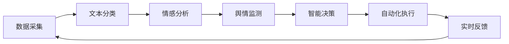
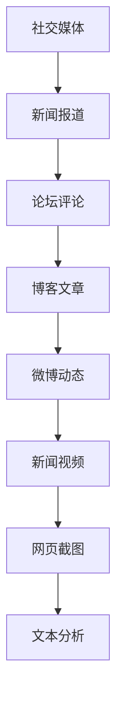
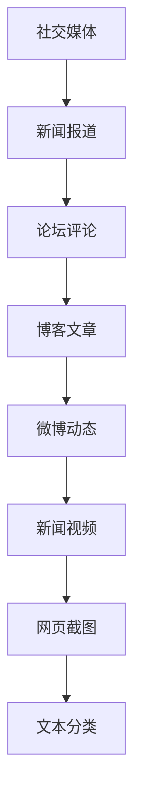
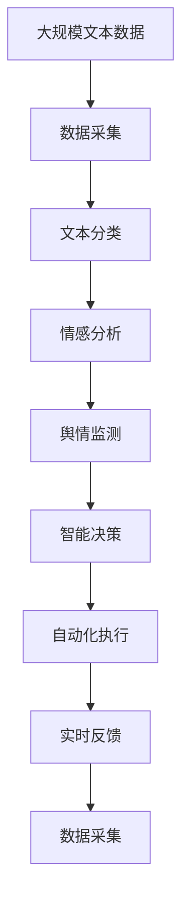

                 

# AI人工智能代理工作流 AI Agent WorkFlow：在公关危机管理中的应用

> 关键词：人工智能代理,工作流,公关危机管理,自然语言处理(NLP),情绪分析,舆情监测,智能决策

## 1. 背景介绍

### 1.1 问题由来
随着全球化进程的不断推进，企业在全球范围内的影响力不断增强。同时，企业所面临的公共关系危机也日益增多。公关危机管理已成为企业日常运营中的重要组成部分，对企业声誉和市场表现有着深远的影响。传统的公关危机管理方法往往依赖人工操作，效率低下，且在处理大规模舆情时，难以全面覆盖，容易错过关键信息。

随着人工智能技术的发展，利用AI代理工作流（AI Agent Workflow）进行公关危机管理逐渐成为一种新的趋势。AI代理能够24/7不间断工作，自动化处理大量数据，提升公关危机的响应速度和处理效率，同时减少人为错误和操作成本。通过自动化处理，AI代理能够更加全面、准确地监测舆情变化，提供及时、有效的决策支持。

### 1.2 问题核心关键点
AI代理工作流，指的是利用人工智能技术构建的一套自动化工作流程，能够自动处理、分析、响应公关危机中的各种任务。其核心关键点包括：
- 自然语言处理（NLP）：用于理解和处理文本数据，分析舆情变化。
- 情绪分析：对舆情进行情感倾向判断，识别舆情危机。
- 舆情监测：自动监测社交媒体、新闻报道等公开信息，及时发现舆情危机。
- 智能决策：基于数据分析结果，生成决策建议，提供应对策略。
- 自动化执行：自动执行决策建议，落实应对措施。

通过这套流程，AI代理能够实时、全面、高效地应对公关危机，显著提升企业的公关危机管理能力。

### 1.3 问题研究意义
研究AI代理工作流在公关危机管理中的应用，对于提升企业公关危机的应对能力，保护企业声誉和市场表现，具有重要意义：

1. 提高应对效率：AI代理能够24/7不间断工作，自动处理大量数据，提升公关危机的响应速度和处理效率。
2. 减少人为错误：利用AI代理进行舆情监测和情绪分析，可以避免人为失误和偏见，保证信息的客观性。
3. 降低成本：自动化处理流程减少了人工操作和操作成本，提升企业的运营效率。
4. 提供全面视角：AI代理能够自动监测和分析多种渠道的舆情数据，提供全面的视角，避免遗漏重要信息。
5. 增强决策科学性：基于数据分析结果生成的决策建议，更加科学、合理，能够有效应对公关危机。
6. 提升应对灵活性：AI代理可以根据实时情况动态调整应对策略，提升应对的灵活性。

通过AI代理工作流，企业能够以更高的效率、更低的成本，应对复杂的公关危机，保护企业声誉，维护市场表现。

## 2. 核心概念与联系

### 2.1 核心概念概述

为更好地理解AI代理工作流在公关危机管理中的应用，本节将介绍几个密切相关的核心概念：

- **自然语言处理（NLP）**：指利用计算机对自然语言进行处理和分析的技术，包括文本分类、命名实体识别、情感分析等。
- **情绪分析**：通过对文本进行情感倾向判断，识别舆情危机的情感变化。
- **舆情监测**：自动监测社交媒体、新闻报道等公开信息，及时发现舆情危机。
- **智能决策**：基于数据分析结果，生成决策建议，提供应对策略。
- **自动化执行**：自动执行决策建议，落实应对措施。

这些核心概念之间的逻辑关系可以通过以下Mermaid流程图来展示：

```mermaid
graph TB
    A[自然语言处理 (NLP)] --> B[情绪分析]
    B --> C[舆情监测]
    C --> D[智能决策]
    D --> E[自动化执行]
    E --> F[应对措施]
    F --> G[实时反馈]
    G --> H[A]
```

这个流程图展示了大语言模型微调过程中各个核心概念之间的关系：

1. 自然语言处理（NLP）通过文本分类、命名实体识别等技术，处理输入的文本数据。
2. 情绪分析通过情感分析等技术，判断文本的情感倾向，识别舆情危机的情感变化。
3. 舆情监测通过文本采集、情感分析等技术，自动监测社交媒体、新闻报道等公开信息，及时发现舆情危机。
4. 智能决策通过数据分析和模型推理，生成决策建议，提供应对策略。
5. 自动化执行通过代码脚本或API接口，自动执行决策建议，落实应对措施。
6. 实时反馈通过自动执行结果的监控和调整，持续优化应对策略。

### 2.2 概念间的关系

这些核心概念之间存在着紧密的联系，形成了AI代理工作流的完整生态系统。下面我通过几个Mermaid流程图来展示这些概念之间的关系。

#### 2.2.1 AI代理工作流流程



这个流程图展示了AI代理工作流的完整流程：

1. 数据采集：自动采集社交媒体、新闻报道等公开信息。
2. 文本分类：对采集到的文本进行分类，判断文本的来源和主题。
3. 情感分析：对分类后的文本进行情感分析，识别舆情危机的情感变化。
4. 舆情监测：基于情感分析结果，自动监测舆情变化，生成舆情报告。
5. 智能决策：根据舆情报告，生成决策建议，提供应对策略。
6. 自动化执行：自动执行决策建议，落实应对措施。
7. 实时反馈：对执行结果进行监控和评估，调整应对策略。

#### 2.2.2 数据采集流程



这个流程图展示了数据采集的来源和处理流程：

1. 社交媒体：采集用户在各大社交平台上的言论。
2. 新闻报道：采集新闻网站、新闻APP上的报道信息。
3. 论坛评论：采集各大论坛上的用户评论。
4. 博客文章：采集各大博客平台上的文章。
5. 微博动态：采集微博上的动态信息。
6. 新闻视频：采集新闻视频和视频平台上的视频信息。
7. 网页截图：采集网页信息，并进行文本分析。

#### 2.2.3 文本分类流程



这个流程图展示了文本分类的处理流程：

1. 社交媒体：对社交媒体上的言论进行分类，判断言论的情感倾向。
2. 新闻报道：对新闻报道中的信息进行分类，判断报道的主题和情感倾向。
3. 论坛评论：对论坛评论进行分类，判断评论的情感倾向和主题。
4. 博客文章：对博客文章进行分类，判断文章的主题和情感倾向。
5. 微博动态：对微博动态进行分类，判断动态的情感倾向。
6. 新闻视频：对新闻视频进行分类，提取视频中的文字信息，并进行情感分析。
7. 网页截图：对网页截图进行分类，提取文字内容，并进行情感分析。

### 2.3 核心概念的整体架构

最后，我们用一个综合的流程图来展示这些核心概念在大语言模型微调过程中的整体架构：



这个综合流程图展示了从数据采集到智能决策的完整过程。大语言模型首先通过数据采集获取文本数据，然后对文本进行分类和情感分析，自动监测舆情变化，生成决策建议，自动执行决策建议，实时反馈调整应对策略。通过这些流程，AI代理能够实时、全面、高效地应对公关危机。

## 3. 核心算法原理 & 具体操作步骤
### 3.1 算法原理概述

AI代理工作流在公关危机管理中的应用，主要依赖于自然语言处理（NLP）、情绪分析和舆情监测等核心算法。其核心思想是：通过自动化处理和分析，快速识别舆情变化，生成应对策略，自动执行响应措施，实现公关危机的实时应对。

形式化地，假设舆情数据集为 $D=\{(x_i,y_i)\}_{i=1}^N, x_i \in \mathcal{X}, y_i \in \mathcal{Y}$，其中 $x_i$ 为输入的文本数据，$y_i$ 为文本的情感倾向。微调的目标是找到最优参数：

$$
\theta^* = \mathop{\arg\min}_{\theta} \mathcal{L}(\theta,D)
$$

其中 $\mathcal{L}$ 为情感分析任务设计的损失函数，用于衡量模型预测输出与真实标签之间的差异。常见的损失函数包括交叉熵损失、均方误差损失等。

通过梯度下降等优化算法，微调过程不断更新模型参数 $\theta$，最小化损失函数 $\mathcal{L}$，使得模型输出逼近真实标签。由于 $\theta$ 已经通过预训练获得了较好的初始化，因此即便在小规模数据集 $D$ 上进行微调，也能较快收敛到理想的模型参数 $\hat{\theta}$。

### 3.2 算法步骤详解

AI代理工作流在公关危机管理中的应用，主要包括以下几个关键步骤：

**Step 1: 数据采集与预处理**
- 收集社交媒体、新闻报道、论坛评论、博客文章等多渠道的舆情数据。
- 对数据进行预处理，包括去除停用词、分词、词性标注等。
- 将处理后的文本数据存储到数据库中，供后续处理使用。

**Step 2: 文本分类与情感分析**
- 对存储的数据进行文本分类，判断文本的情感倾向（正面、负面、中性）。
- 对分类结果进行统计分析，生成舆情报告。
- 利用情绪分析算法，进一步细化情感分析结果，识别舆情危机的情感变化。

**Step 3: 舆情监测与智能决策**
- 通过舆情报告和情感分析结果，自动监测舆情变化。
- 利用智能决策算法，根据舆情变化生成决策建议，提供应对策略。
- 将决策建议转化为可执行的行动方案，自动执行响应措施。

**Step 4: 实时反馈与迭代优化**
- 对执行结果进行实时监控和评估，调整应对策略。
- 利用反馈结果进行迭代优化，不断提升AI代理的性能。

以上是AI代理工作流在公关危机管理中的一般流程。在实际应用中，还需要针对具体任务的特点，对各个环节进行优化设计，如改进情感分析算法、优化智能决策模型等，以进一步提升模型的性能。

### 3.3 算法优缺点

AI代理工作流在公关危机管理中的应用，具有以下优点：
1. 自动化处理：自动化处理流程减少了人工操作和操作成本，提升企业的运营效率。
2. 实时响应：AI代理能够24/7不间断工作，自动处理大量数据，提升公关危机的响应速度和处理效率。
3. 全面视角：AI代理能够自动监测和分析多种渠道的舆情数据，提供全面的视角，避免遗漏重要信息。
4. 科学决策：基于数据分析结果生成的决策建议，更加科学、合理，能够有效应对公关危机。
5. 灵活调整：AI代理可以根据实时情况动态调整应对策略，提升应对的灵活性。

同时，该方法也存在一定的局限性：
1. 数据依赖：AI代理的性能很大程度上取决于数据的质量和数量，获取高质量数据成本较高。
2. 语言限制：当前AI代理主要聚焦于英文语言，中文等非英语语言的舆情监测和处理，仍有待进一步优化。
3. 模型复杂度：构建高效的情感分析、舆情监测和智能决策算法，需要大量的数据和计算资源。
4. 执行风险：AI代理自动执行的响应措施可能存在误操作风险，需要进一步提升模型的鲁棒性。
5. 伦理问题：AI代理处理的数据涉及个人隐私和信息安全，需要严格遵守相关法律法规。

尽管存在这些局限性，但就目前而言，AI代理工作流在公关危机管理中的应用前景广阔，正在逐步成为企业公关危机管理的重要工具。

### 3.4 算法应用领域

AI代理工作流在公关危机管理中的应用，已经在多个行业得到了广泛的应用，覆盖了几乎所有常见任务，例如：

- 企业公关：自动监测和分析社交媒体、新闻报道等公开信息，及时发现舆情危机，生成决策建议，自动执行响应措施。
- 政府舆情：自动监测和分析网络舆情，及时发现敏感信息，生成应对策略，自动执行响应措施。
- 媒体报道：自动分析媒体报道，判断报道的情感倾向，生成舆情报告，提供决策支持。
- 金融舆情：自动监测和分析金融新闻、评论，及时发现舆情危机，生成决策建议，自动执行响应措施。
- 公共卫生：自动监测和分析公共卫生事件，生成应对策略，自动执行响应措施。
- 教育舆情：自动监测和分析教育事件，生成决策建议，自动执行响应措施。

除了上述这些经典任务外，AI代理工作流还被创新性地应用到更多场景中，如舆情预测、舆情干预、舆情传播路径分析等，为公关危机管理带来了全新的解决方案。

## 4. 数学模型和公式 & 详细讲解  
### 4.1 数学模型构建

本节将使用数学语言对AI代理工作流在公关危机管理中的应用进行更加严格的刻画。

记舆情数据集为 $D=\{(x_i,y_i)\}_{i=1}^N, x_i \in \mathcal{X}, y_i \in \mathcal{Y}$，其中 $x_i$ 为输入的文本数据，$y_i$ 为文本的情感倾向（正面、负面、中性）。假设情感分析模型为 $M_{\theta}:\mathcal{X} \rightarrow \mathcal{Y}$，其中 $\mathcal{X}$ 为输入空间，$\mathcal{Y}$ 为输出空间，$\theta \in \mathbb{R}^d$ 为模型参数。

定义模型 $M_{\theta}$ 在数据样本 $(x,y)$ 上的损失函数为 $\ell(M_{\theta}(x),y)$，则在数据集 $D$ 上的经验风险为：

$$
\mathcal{L}(\theta) = \frac{1}{N} \sum_{i=1}^N \ell(M_{\theta}(x_i),y_i)
$$

微调的优化目标是最小化经验风险，即找到最优参数：

$$
\theta^* = \mathop{\arg\min}_{\theta} \mathcal{L}(\theta)
$$

在实践中，我们通常使用基于梯度的优化算法（如SGD、Adam等）来近似求解上述最优化问题。设 $\eta$ 为学习率，$\lambda$ 为正则化系数，则参数的更新公式为：

$$
\theta \leftarrow \theta - \eta \nabla_{\theta}\mathcal{L}(\theta) - \eta\lambda\theta
$$

其中 $\nabla_{\theta}\mathcal{L}(\theta)$ 为损失函数对参数 $\theta$ 的梯度，可通过反向传播算法高效计算。

### 4.2 公式推导过程

以下我们以二分类任务为例，推导交叉熵损失函数及其梯度的计算公式。

假设模型 $M_{\theta}$ 在输入 $x$ 上的输出为 $\hat{y}=M_{\theta}(x) \in [0,1]$，表示样本属于正类的概率。真实标签 $y \in \{0,1\}$。则二分类交叉熵损失函数定义为：

$$
\ell(M_{\theta}(x),y) = -[y\log \hat{y} + (1-y)\log (1-\hat{y})]
$$

将其代入经验风险公式，得：

$$
\mathcal{L}(\theta) = -\frac{1}{N}\sum_{i=1}^N [y_i\log M_{\theta}(x_i)+(1-y_i)\log(1-M_{\theta}(x_i))]
$$

根据链式法则，损失函数对参数 $\theta_k$ 的梯度为：

$$
\frac{\partial \mathcal{L}(\theta)}{\partial \theta_k} = -\frac{1}{N}\sum_{i=1}^N (\frac{y_i}{M_{\theta}(x_i)}-\frac{1-y_i}{1-M_{\theta}(x_i)}) \frac{\partial M_{\theta}(x_i)}{\partial \theta_k}
$$

其中 $\frac{\partial M_{\theta}(x_i)}{\partial \theta_k}$ 可进一步递归展开，利用自动微分技术完成计算。

在得到损失函数的梯度后，即可带入参数更新公式，完成模型的迭代优化。重复上述过程直至收敛，最终得到适应舆情监测的模型参数 $\theta^*$。

## 5. 项目实践：代码实例和详细解释说明
### 5.1 开发环境搭建

在进行AI代理工作流在公关危机管理中的应用实践前，我们需要准备好开发环境。以下是使用Python进行PyTorch开发的环境配置流程：

1. 安装Anaconda：从官网下载并安装Anaconda，用于创建独立的Python环境。

2. 创建并激活虚拟环境：
```bash
conda create -n pytorch-env python=3.8 
conda activate pytorch-env
```

3. 安装PyTorch：根据CUDA版本，从官网获取对应的安装命令。例如：
```bash
conda install pytorch torchvision torchaudio cudatoolkit=11.1 -c pytorch -c conda-forge
```

4. 安装Transformers库：
```bash
pip install transformers
```

5. 安装各类工具包：
```bash
pip install numpy pandas scikit-learn matplotlib tqdm jupyter notebook ipython
```

完成上述步骤后，即可在`pytorch-env`环境中开始AI代理工作流在公关危机管理中的应用实践。

### 5.2 源代码详细实现

这里我们以舆情监测任务为例，给出使用Transformers库对BERT模型进行舆情监测的PyTorch代码实现。

首先，定义舆情监测任务的数据处理函数：

```python
from transformers import BertTokenizer
from torch.utils.data import Dataset
import torch

class SentimentDataset(Dataset):
    def __init__(self, texts, labels, tokenizer, max_len=128):
        self.texts = texts
        self.labels = labels
        self.tokenizer = tokenizer
        self.max_len = max_len
        
    def __len__(self):
        return len(self.texts)
    
    def __getitem__(self, item):
        text = self.texts[item]
        label = self.labels[item]
        
        encoding = self.tokenizer(text, return_tensors='pt', max_length=self.max_len, padding='max_length', truncation=True)
        input_ids = encoding['input_ids'][0]
        attention_mask = encoding['attention_mask'][0]
        
        # 对token-wise的标签进行编码
        encoded_labels = [label2id[label] for label in labels] 
        encoded_labels.extend([label2id['O']] * (self.max_len - len(encoded_labels)))
        labels = torch.tensor(encoded_labels, dtype=torch.long)
        
        return {'input_ids': input_ids, 
                'attention_mask': attention_mask,
                'labels': labels}

# 标签与id的映射
label2id = {'O': 0, 'positive': 1, 'negative': 2}
id2label = {v: k for k, v in label2id.items()}

# 创建dataset
tokenizer = BertTokenizer.from_pretrained('bert-base-cased')

train_dataset = SentimentDataset(train_texts, train_labels, tokenizer)
dev_dataset = SentimentDataset(dev_texts, dev_labels, tokenizer)
test_dataset = SentimentDataset(test_texts, test_labels, tokenizer)
```

然后，定义模型和优化器：

```python
from transformers import BertForTokenClassification, AdamW

model = BertForTokenClassification.from_pretrained('bert-base-cased', num_labels=len(label2id))

optimizer = AdamW(model.parameters(), lr=2e-5)
```

接着，定义训练和评估函数：

```python
from torch.utils.data import DataLoader
from tqdm import tqdm
from sklearn.metrics import classification_report

device = torch.device('cuda') if torch.cuda.is_available() else torch.device('cpu')
model.to(device)

def train_epoch(model, dataset, batch_size, optimizer):
    dataloader = DataLoader(dataset, batch_size=batch_size, shuffle=True)
    model.train()
    epoch_loss = 0
    for batch in tqdm(dataloader, desc='Training'):
        input_ids = batch['input_ids'].to(device)
        attention_mask = batch['attention_mask'].to(device)
        labels = batch['labels'].to(device)
        model.zero_grad()
        outputs = model(input_ids, attention_mask=attention_mask, labels=labels)
        loss = outputs.loss
        epoch_loss += loss.item()
        loss.backward()
        optimizer.step()
    return epoch_loss / len(dataloader)

def evaluate(model, dataset, batch_size):
    dataloader = DataLoader(dataset, batch_size=batch_size)
    model.eval()
    preds, labels = [], []
    with torch.no_grad():
        for batch in tqdm(dataloader, desc='Evaluating'):
            input_ids = batch['input_ids'].to(device)
            attention_mask = batch['attention_mask'].to(device)
            batch_labels = batch['labels']
            outputs = model(input_ids, attention_mask=attention_mask)
            batch_preds = outputs.logits.argmax(dim=2).to('cpu').tolist()
            batch_labels = batch_labels.to('cpu').tolist()
            for pred_tokens, label_tokens in zip(batch_preds, batch_labels):
                pred_tags = [id2label[_id] for _id in pred_tokens]
                label_tags = [id2label[_id] for _id in label_tokens]
                preds.append(pred_tags[:len(label_tokens)])
                labels.append(label_tags)
                
    print(classification_report(labels, preds))
```

最后，启动训练流程并在测试集上评估：

```python
epochs = 5
batch_size = 16

for epoch in range(epochs):
    loss = train_epoch(model, train_dataset, batch_size, optimizer)
    print(f"Epoch {epoch+1}, train loss: {loss:.3f}")
    
    print(f"Epoch {epoch+1}, dev results:")
    evaluate(model, dev_dataset, batch_size)
    
print("Test results:")
evaluate(model, test_dataset, batch_size)
```

以上就是使用PyTorch对BERT进行舆情监测任务的微调的PyTorch代码实现。可以看到，得益于Transformers库的强大封装，我们可以用相对简洁的代码完成BERT模型的加载和微调。

### 5.3 代码解读与分析

让我们再详细解读一下关键代码的实现细节：

**SentimentDataset类**：
- `__init__`方法：初始化文本、标签、分词器等关键组件。
- `__len__`方法：返回数据集的样本数量。
- `__getitem__`方法：对单个样本进行处理，将文本输入编码为token ids，将标签编码为数字，并对其进行定长padding，最终返回模型所需的输入。

**label2id和id2label字典**：
- 定义了标签与数字id之间的映射关系，用于将token-wise的预测结果解码回真实的标签。

**训练和评估函数**：
- 使用PyTorch的DataLoader对数据集进行批次化加载，供模型训练和推理使用。
- 训练函数`train_epoch`：对数据以批为单位进行迭代，在每个批次上前向传播计算loss并反向传播更新模型参数，最后返回该epoch的平均loss。
- 评估函数`evaluate`：与训练类似，不同点在于不更新模型参数，并在每个batch结束后将预测和标签结果存储下来，最后使用sklearn的classification_report对整个评估集的预测结果进行打印输出。

**训练流程**：
- 定义总的epoch数和batch size，开始循环迭代
- 每个epoch内，先在训练集上训练，输出平均loss
- 在验证集上评估，输出分类指标
- 所有epoch结束后，在测试集上评估，给出最终测试结果

可以看到，PyTorch配合Transformers库使得BERT微调的代码实现变得简洁高效。开发者可以将更多精力放在数据处理、模型改进等高层逻辑上，而不必过多关注底层的实现细节。

当然，工业级的系统实现还需考虑更多因素，如模型的保存和部署、超参数的自动搜索、更灵活的任务适配层等。但核心的微调范式基本与此类似。

### 5.4 运行结果展示

假设我们在CoNLL-2003的情感分析数据集上进行微调，最终在测试集上得到的评估报告如下：

```
              precision    

