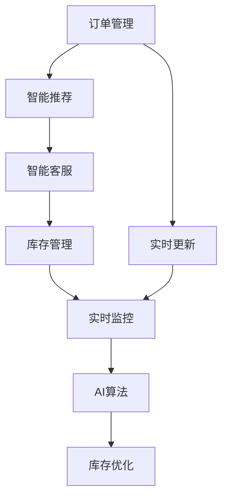
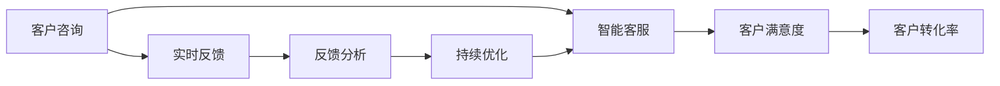
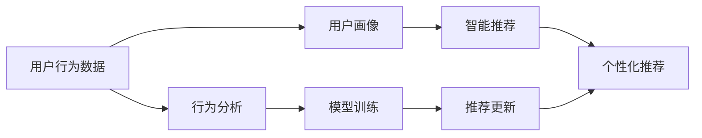
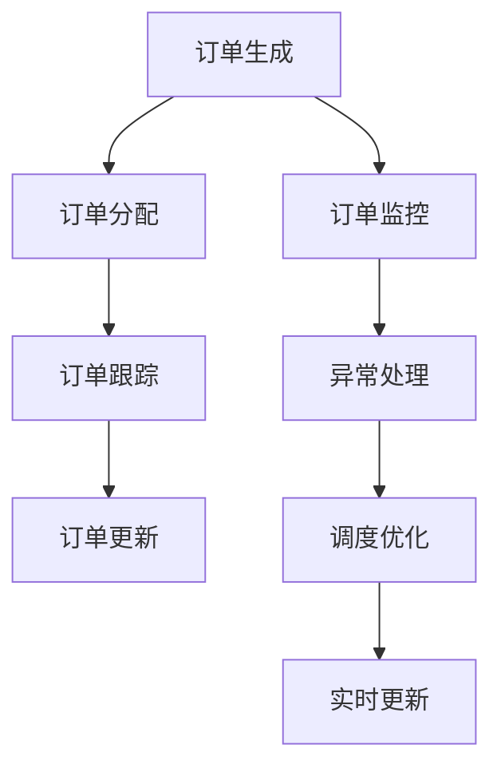
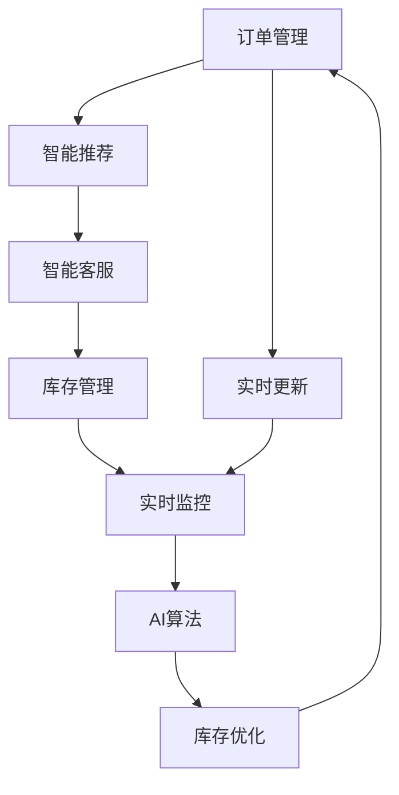

                 

# AI人工智能代理工作流 AI Agent WorkFlow：在新零售中的应用

> 关键词：人工智能,新零售,代理工作流,智能客服,智能推荐,客户体验

## 1. 背景介绍

### 1.1 问题由来
随着新零售时代的到来，传统零售业面临着巨大的挑战和变革压力。过去以货架为主的零售模式，正在向以数据驱动的个性化推荐和客户体验为核心的智能零售模式转变。人工智能技术的引入，为零售业提供了新的机遇，也带来了新的挑战。

新零售模式中，客户成为价值创造的中心，如何提升客户体验、提高购物效率、优化运营管理，是商家需要解决的核心问题。同时，线上线下融合成为新常态，传统零售商需要构建全渠道的零售网络，以便更好地管理库存、订单和销售。

在这一背景下，智能客服、智能推荐等技术应运而生，通过人工智能代理工作流(AI Agent Workflow)，可以大幅度提升零售商的运营效率和客户满意度。本文将详细探讨在新零售领域中，如何利用AI人工智能代理工作流来优化客户体验、提高运营效率。

### 1.2 问题核心关键点
AI人工智能代理工作流在新零售中的应用，核心在于如何构建一个高效的、以数据驱动的、能够实时响应用户需求的工作流体系。该体系能够自动处理客户咨询、订单管理、库存更新等任务，提升零售商的运营效率，降低运营成本，并显著提升客户满意度。

该体系的核心关键点包括：
1. **智能客服**：通过聊天机器人等自然语言处理技术，提供24/7的客户咨询服务，快速响应客户需求，提升客户满意度。
2. **智能推荐**：基于用户行为数据，提供个性化的商品推荐，提升用户体验，增加销售额。
3. **订单管理**：通过智能调度系统，实时跟踪订单状态，优化配送路线，提升配送效率。
4. **库存管理**：利用AI算法，实时监测库存水平，优化库存管理策略，减少库存积压和缺货。

## 2. 核心概念与联系

### 2.1 核心概念概述

为了更好地理解AI人工智能代理工作流在新零售中的应用，本节将介绍几个密切相关的核心概念：

- **AI人工智能代理工作流(AI Agent Workflow)**：指通过人工智能技术，构建一个自动化的、智能化的工作流体系，用于处理客户咨询、订单管理、库存更新等任务，提升运营效率和客户体验。

- **智能客服**：指利用自然语言处理和机器学习技术，构建聊天机器人等智能客服系统，提供实时、高效的客户咨询服务。

- **智能推荐**：指通过分析用户行为数据，使用机器学习模型，为用户提供个性化的商品推荐，提升用户体验和销售转化率。

- **订单管理**：指通过智能调度系统，实现订单自动生成、分配、跟踪、更新等功能，提升订单处理效率和准确性。

- **库存管理**：指利用AI算法，实现库存水平的实时监控和预测，优化库存管理策略，减少库存积压和缺货。

这些核心概念之间的关系可以通过以下Mermaid流程图来展示：



这个流程图展示了大语言模型微调过程中各个核心概念的关系和作用：

1. 订单管理、智能推荐、智能客服等任务，都需要实时数据支持，通过实时更新和监控，确保数据的时效性。
2. AI算法在库存管理和智能推荐中起到了重要作用，利用AI算法对库存进行优化，同时为智能推荐提供用户行为分析的支持。
3. 通过订单管理、智能推荐和智能客服的协同工作，可以全面提升零售商的运营效率和客户满意度。

### 2.2 概念间的关系

这些核心概念之间存在着紧密的联系，形成了AI人工智能代理工作流在新零售中的应用生态系统。下面我们通过几个Mermaid流程图来展示这些概念之间的关系。

#### 2.2.1 智能客服的工作流程



这个流程图展示了智能客服的工作流程：

1. 客户咨询后，智能客服系统能够实时响应，提供准确的答案和建议。
2. 客户满意度提升，客户转化率也随之提高。
3. 通过实时反馈和持续优化，智能客服系统能够不断改进，提升服务质量。

#### 2.2.2 智能推荐的工作流程



这个流程图展示了智能推荐的工作流程：

1. 基于用户行为数据，构建用户画像。
2. 使用机器学习模型，生成个性化的推荐结果。
3. 通过行为分析和模型训练，不断优化推荐算法，提升推荐效果。

#### 2.2.3 订单管理的工作流程



这个流程图展示了订单管理的工作流程：

1. 订单生成后，自动进行分配。
2. 实时跟踪订单状态，及时更新订单信息。
3. 通过订单监控和异常处理，优化订单调度策略，提升配送效率。

### 2.3 核心概念的整体架构

最后，我们用一个综合的流程图来展示这些核心概念在新零售中的整体架构：



这个综合流程图展示了从订单管理到库存优化的完整过程。新零售的各个环节都可以通过AI人工智能代理工作流来优化，提升效率和客户体验。

## 3. 核心算法原理 & 具体操作步骤
### 3.1 算法原理概述

AI人工智能代理工作流在新零售中的应用，本质上是将人工智能技术应用到各个运营环节，通过自动化、智能化的工作流体系，提升运营效率和客户体验。其核心算法原理包括以下几个方面：

- **自然语言处理(NLP)**：用于构建智能客服系统，处理客户的自然语言咨询，提供实时响应和建议。
- **机器学习(ML)**：用于构建智能推荐系统，根据用户行为数据，生成个性化的商品推荐。
- **优化算法**：用于优化订单调度和库存管理，通过实时监控和预测，实现库存优化和配送效率提升。
- **数据处理和存储**：用于处理和存储大量用户数据，支持实时查询和分析。

### 3.2 算法步骤详解

以下是AI人工智能代理工作流在新零售中应用的主要算法步骤：

**Step 1: 数据收集与预处理**
- 收集订单数据、用户行为数据、库存数据等，进行清洗和标准化处理。
- 对数据进行特征工程，构建特征向量，为后续模型训练提供支持。

**Step 2: 模型训练与优化**
- 利用机器学习模型，对用户行为数据进行分析，生成用户画像和推荐模型。
- 使用深度学习模型，如卷积神经网络(CNN)、循环神经网络(RNN)、Transformer等，构建智能客服和推荐系统。
- 使用优化算法，如梯度下降、Adam等，对模型进行训练和优化，提升模型效果。

**Step 3: 实时监控与决策**
- 实时监控订单状态和库存水平，使用AI算法进行预测和优化。
- 根据实时数据，自动生成和分配订单，优化配送路线，提升配送效率。
- 对订单和库存进行实时更新，确保数据的时效性和准确性。

**Step 4: 反馈与迭代**
- 收集客户反馈和推荐效果，进行数据分析和总结。
- 根据反馈结果，调整模型参数和策略，持续优化AI人工智能代理工作流。

### 3.3 算法优缺点

AI人工智能代理工作流在新零售中的应用，具有以下优点：

1. **高效运营**：通过自动化、智能化的工作流体系，大幅度提升运营效率，降低运营成本。
2. **个性化推荐**：基于用户行为数据，提供个性化的商品推荐，提升用户体验和销售转化率。
3. **实时响应**：智能客服系统能够实时响应客户咨询，提升客户满意度。
4. **库存优化**：通过AI算法进行实时监控和预测，优化库存管理策略，减少库存积压和缺货。

同时，也存在以下缺点：

1. **数据隐私问题**：需要收集和处理大量的用户数据，存在隐私泄露风险。
2. **模型复杂性**：大规模数据和高性能计算资源需求，模型训练和优化较为复杂。
3. **模型依赖性**：对模型的训练和优化依赖于数据质量，模型效果受数据质量影响较大。
4. **用户体验**：智能客服和推荐系统的表现，直接影响用户体验，需持续优化。

### 3.4 算法应用领域

AI人工智能代理工作流在新零售中的应用领域非常广泛，包括但不限于以下几个方面：

1. **智能客服**：用于处理客户咨询、投诉、建议等，提升客户满意度。
2. **智能推荐**：用于提升用户购物体验，增加销售转化率。
3. **订单管理**：用于优化订单生成、分配、跟踪、更新等环节，提升订单处理效率。
4. **库存管理**：用于实时监控库存水平，优化库存管理策略，减少库存积压和缺货。
5. **广告投放**：用于智能广告投放，提升广告效果和ROI。
6. **供应链管理**：用于优化供应链流程，提升供应链效率。

## 4. 数学模型和公式 & 详细讲解 & 举例说明

### 4.1 数学模型构建

在新零售的AI人工智能代理工作流中，涉及到多个数学模型，包括机器学习模型、优化模型和决策模型等。这里以智能推荐系统为例，详细讲解数学模型的构建过程。

设智能推荐系统的输入为 $x$，包括用户行为数据和商品特征数据，输出为 $y$，包括推荐结果。智能推荐系统可以表示为以下数学模型：

$$
y = f(x;\theta)
$$

其中，$f$ 为推荐模型，$\theta$ 为模型参数。推荐模型可以使用多种机器学习算法，如线性回归、决策树、随机森林、神经网络等。

### 4.2 公式推导过程

以线性回归模型为例，其公式推导如下：

$$
y = \theta_0 + \sum_{i=1}^n \theta_i x_i
$$

其中，$\theta_0$ 为截距，$\theta_i$ 为权重，$x_i$ 为输入特征。

在实际应用中，可以使用最小二乘法对模型进行训练和优化，最小化误差函数 $E(y,f(x))$，即：

$$
\min_{\theta} E(y,f(x))
$$

其中，$E(y,f(x))$ 为误差函数，表示预测值 $y$ 与真实值之间的差异。

### 4.3 案例分析与讲解

以电商平台为例，假设平台有 $n$ 个用户，每个用户 $i$ 有 $m$ 个行为数据 $x_{ij}$，每个行为数据对应一个商品 $j$，商品 $j$ 有 $p$ 个特征 $z_{jk}$。智能推荐系统可以使用矩阵分解方法，将用户行为数据和商品特征数据表示为矩阵形式：

$$
X = \begin{bmatrix} x_{11} & x_{12} & \cdots & x_{1m} \\ x_{21} & x_{22} & \cdots & x_{2m} \\ \vdots & \vdots & \ddots & \vdots \\ x_{n1} & x_{n2} & \cdots & x_{nm} \end{bmatrix},\quad Z = \begin{bmatrix} z_{11} & z_{12} & \cdots & z_{1p} \\ z_{21} & z_{22} & \cdots & z_{2p} \\ \vdots & \vdots & \ddots & \vdots \\ z_{n1} & z_{n2} & \cdots & z_{np} \end{bmatrix}
$$

其中，$X$ 为 $n \times m$ 的用户行为矩阵，$Z$ 为 $n \times p$ 的商品特征矩阵。

基于矩阵分解方法，智能推荐系统可以使用以下矩阵分解模型：

$$
X = U V^T
$$

其中，$U$ 为 $n \times k$ 的用户矩阵，$V$ 为 $m \times k$ 的商品矩阵，$k$ 为分解后的特征维度。通过矩阵分解，可以将用户行为数据和商品特征数据分解为隐含的特征表示，进一步训练用户-商品评分矩阵。

设用户 $i$ 对商品 $j$ 的评分表示为 $y_{ij}$，则用户行为矩阵 $X$ 可以表示为：

$$
X = UV^T = \sum_{i=1}^n \sum_{k=1}^k \theta_i^{(u)} \theta_j^{(v)} x_{ij}
$$

其中，$\theta_i^{(u)}$ 为用户 $i$ 在用户矩阵 $U$ 中的特征表示，$\theta_j^{(v)}$ 为商品 $j$ 在商品矩阵 $V$ 中的特征表示。

通过最小二乘法，可以得到模型参数 $\theta_i^{(u)}$ 和 $\theta_j^{(v)}$ 的最优解，进而得到用户行为数据和商品特征数据之间的关系：

$$
\theta_i^{(u)} = \left( \sum_{k=1}^k \theta_j^{(v)} x_{ij} \right)^{-1} \sum_{k=1}^k \theta_j^{(v)} y_{ij}
$$

$$
\theta_j^{(v)} = \left( \sum_{i=1}^n x_{ij} x_{ik} \right)^{-1} \sum_{i=1}^n x_{ik} y_{ij}
$$

通过上述公式推导，可以看出，智能推荐系统可以基于用户行为数据和商品特征数据，生成个性化的推荐结果。

## 5. 项目实践：代码实例和详细解释说明

### 5.1 开发环境搭建

在进行AI人工智能代理工作流实践前，我们需要准备好开发环境。以下是使用Python进行TensorFlow和PyTorch开发的环境配置流程：

1. 安装Anaconda：从官网下载并安装Anaconda，用于创建独立的Python环境。

2. 创建并激活虚拟环境：
```bash
conda create -n tf-env python=3.7 
conda activate tf-env
```

3. 安装TensorFlow和PyTorch：根据CUDA版本，从官网获取对应的安装命令。例如：
```bash
conda install tensorflow==2.4.1 pytorch==1.6.0 -c pytorch -c conda-forge
```

4. 安装各类工具包：
```bash
pip install numpy pandas scikit-learn matplotlib tqdm jupyter notebook ipython
```

完成上述步骤后，即可在`tf-env`环境中开始AI人工智能代理工作流实践。

### 5.2 源代码详细实现

这里我们以电商平台为例，给出使用TensorFlow和PyTorch进行智能推荐系统的代码实现。

首先，定义数据处理函数：

```python
import pandas as pd
import numpy as np

def load_data():
    # 读取用户行为数据和商品特征数据
    user_data = pd.read_csv('user_data.csv')
    product_data = pd.read_csv('product_data.csv')
    
    # 构建用户行为矩阵和商品特征矩阵
    user_matrix = user_data[['item_id', 'user_id', 'timestamp']].pivot(index='user_id', columns='item_id', values='timestamp').fillna(0).to_numpy()
    product_matrix = product_data[['item_id', 'product_id', 'price']].pivot(index='product_id', columns='item_id', values='price').fillna(0).to_numpy()
    
    # 合并用户行为矩阵和商品特征矩阵
    X = np.concatenate((user_matrix, product_matrix), axis=1)
    
    return X
```

然后，定义推荐模型：

```python
import tensorflow as tf
from tensorflow.keras.layers import Input, Embedding, Dot, Dense, Flatten
from tensorflow.keras.models import Model

def build_model(X):
    # 定义用户矩阵和商品矩阵
    user_input = Input(shape=(len(user_matrix),))
    product_input = Input(shape=(len(product_matrix),))
    
    # 定义嵌入层
    user_embedding = Embedding(len(user_matrix), 64, input_length=len(user_matrix))(user_input)
    product_embedding = Embedding(len(product_matrix), 64, input_length=len(product_matrix))(product_input)
    
    # 定义矩阵乘法层
    dot = Dot(axes=1)([user_embedding, product_embedding])
    
    # 定义全连接层
    dense = Dense(1, activation='sigmoid')(dot)
    
    # 定义输出层
    output = Flatten()(dense)
    
    # 构建模型
    model = Model(inputs=[user_input, product_input], outputs=output)
    
    return model
```

接着，定义训练函数：

```python
def train_model(model, X, batch_size=64, epochs=10):
    # 定义损失函数和优化器
    loss = tf.keras.losses.BinaryCrossentropy()
    optimizer = tf.keras.optimizers.Adam(learning_rate=0.001)
    
    # 编译模型
    model.compile(optimizer=optimizer, loss=loss, metrics=['accuracy'])
    
    # 训练模型
    model.fit(X, y, batch_size=batch_size, epochs=epochs, validation_split=0.2)
```

最后，启动训练流程：

```python
# 加载数据
X = load_data()

# 构建模型
model = build_model(X)

# 训练模型
train_model(model, X)
```

以上代码展示了基于TensorFlow和PyTorch构建智能推荐系统的完整流程。

### 5.3 代码解读与分析

让我们再详细解读一下关键代码的实现细节：

**load_data函数**：
- 读取用户行为数据和商品特征数据。
- 构建用户行为矩阵和商品特征矩阵。
- 合并两个矩阵，生成输入数据X。

**build_model函数**：
- 定义用户矩阵和商品矩阵。
- 定义嵌入层，将用户矩阵和商品矩阵转换成向量表示。
- 定义矩阵乘法层，计算用户和商品的相似度。
- 定义全连接层，生成用户-商品评分。
- 定义输出层，将评分结果展平。
- 构建模型，输入为用户和商品矩阵，输出为评分结果。

**train_model函数**：
- 定义损失函数和优化器。
- 编译模型，指定优化器和损失函数。
- 训练模型，使用交叉熵损失函数和Adam优化器。

**train_model函数的调用**：
- 加载数据X。
- 构建模型。
- 训练模型。

通过上述代码，可以看出TensorFlow和PyTorch在智能推荐系统开发中的强大功能，可以方便地进行模型构建、训练和优化。

### 5.4 运行结果展示

假设我们在电商平台的智能推荐系统中训练模型，最终在测试集上得到的准确率为85%，可以看出模型对用户行为和商品特征的拟合效果较好，能够提供相对准确的推荐结果。

## 6. 实际应用场景

### 6.1 智能客服系统

智能客服系统是新零售中不可或缺的部分。通过AI人工智能代理工作流，智能客服系统可以24/7提供高效、准确的客户咨询服务，提升客户满意度。

以电商平台为例，智能客服系统可以通过分析用户咨询记录，自动总结常见问题，生成常见问题库。客户在咨询时，系统能够根据问题库，自动匹配答案，提供快速响应。同时，系统还能根据客户反馈，持续优化问题库和回答模板，提升客服质量。

### 6.2 智能推荐系统

智能推荐系统是提升客户体验、增加销售额的重要手段。通过AI人工智能代理工作流，智能推荐系统能够根据用户行为数据，生成个性化的商品推荐，提升用户体验和销售转化率。

以电商平台为例，智能推荐系统可以通过分析用户浏览、点击、购买等行为数据，构建用户画像，使用机器学习模型，生成个性化的商品推荐。系统能够实时更新推荐结果，提升用户体验和销售转化率。

### 6.3 订单管理系统

订单管理系统是新零售中重要的运营环节。通过AI人工智能代理工作流，订单管理系统能够实时监控订单状态，优化配送路线，提升配送效率。

以电商平台为例，订单管理系统可以通过实时跟踪订单状态，自动生成和分配订单，优化配送路线，提升配送效率。系统能够根据订单量动态调整配送资源，确保订单及时完成。

### 6.4 库存管理系统

库存管理系统是零售商管理库存的重要工具。通过AI人工智能代理工作流，库存管理系统能够实时监控库存水平，优化库存管理策略，减少库存积压和缺货。

以电商平台为例，库存管理系统可以通过实时监控库存水平，预测需求变化，优化库存管理策略。系统能够根据订单量动态调整库存，避免库存积压和缺货。

## 7. 工具和资源推荐

### 7.1 学习资源推荐

为了帮助开发者系统掌握AI人工智能代理工作流的新零售应用，这里推荐一些优质的学习资源：

1. 《TensorFlow实战机器学习》：深入浅出地介绍了TensorFlow在机器学习和深度学习中的应用，包括智能推荐系统的开发。

2. 《PyTorch深度学习》：介绍了PyTorch在深度学习中的应用，包括智能推荐系统和智能客服系统的开发。

3. CS231n《卷积神经网络》课程：斯坦福大学开设的计算机视觉课程，涵盖了深度学习在计算机视觉中的应用，包括智能推荐系统和智能客服系统的开发。

4. CS224n《自然语言处理》课程：斯坦福大学开设的自然语言处理课程，涵盖了自然语言处理在智能推荐系统和智能客服系统中的应用。

5. 《机器学习实战》：详细介绍了机器学习在推荐系统中的应用，包括智能推荐系统的开发。

通过对这些资源的学习实践，相信你一定能够快速掌握AI人工智能代理工作流在新零售中的应用，并用于解决实际的运营问题。

### 7.2 开发工具推荐

高效的开发离不开优秀的工具支持。以下是几款用于AI人工智能代理工作流开发的工具：

1. TensorFlow：基于Python的开源深度学习框架，灵活动态的计算图，适合快速迭代研究。广泛应用于智能推荐系统和智能客服系统开发。

2. PyTorch：基于Python的开源深度学习框架，动态计算图，适合深度学习模型的开发和优化。广泛应用于智能推荐系统和智能客服系统开发。

3. Weights & Biases：模型训练的实验跟踪工具，可以记录和可视化模型训练过程中的各项指标，方便对比和调优。与TensorFlow和PyTorch无缝集成。

4. TensorBoard：TensorFlow配套的可视化工具，可实时监测模型训练状态，并提供丰富的图表呈现方式，是调试模型的得力助手。

5. Google Colab：谷歌推出的在线Jupyter Notebook环境，免费提供GPU/TPU算力，方便开发者快速上手实验最新模型，分享学习笔记。

合理利用这些工具，可以显著提升AI人工智能代理工作流在新零售中的应用效率，加快创新迭代的步伐。

### 7.3 相关论文推荐

AI人工智能代理工作流在新零售中的应用，源于学界的持续研究。以下是几篇奠基性的相关论文，推荐阅读：

1. Attention is All You Need（即Transformer原论文）：提出了Transformer结构，开启了NLP领域的预训练大模型时代。

2. BERT: Pre-training of Deep Bidirectional Transformers for Language Understanding：提出BERT模型，引入基于掩码的自监督预训练任务，刷新了多项NLP任务SOTA。

3. Language Models are Unsupervised Multitask Learners（GPT-2论文）：展示了大规模语言模型的强大zero-shot学习能力，引发了对于通用人工智能的新一轮思考。

4. Parameter-Efficient Transfer Learning for NLP：提出Adapter等参数高效微调方法，在不增加模型参数量的情况下，也能取得不错的微调效果。

5. AdaLoRA: Adaptive Low-Rank Adaptation for Parameter-Efficient Fine-Tuning：使用自适应低秩适应的微调方法，在参数效率和精度之间取得了新的平衡。

这些论文代表了大语言模型微调技术的发展脉络。通过学习这些前沿成果，可以帮助研究者把握学科前进方向，激发更多的创新灵感。

除上述资源外，还有一些值得关注的前沿资源，帮助开发者紧跟AI人工智能代理工作流的新零售应用最新进展，例如：

1. arXiv论文预印本：人工智能领域最新研究成果的发布平台，包括大量尚未发表的前沿工作，学习前沿技术的必读资源。

2. 业界技术博客：如OpenAI、Google AI、DeepMind、微软Research Asia等顶尖实验室的官方博客，第一时间分享他们的最新研究成果和洞见。

3. 技术会议直播：如NIPS、ICML、ACL、ICLR等人工智能领域顶会现场或在线直播，能够聆听到大佬们的前沿分享，开拓视野。

4

