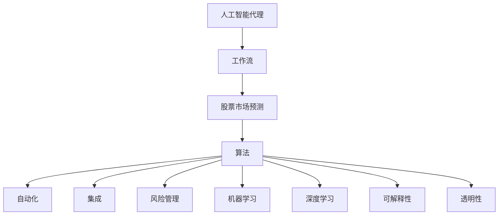
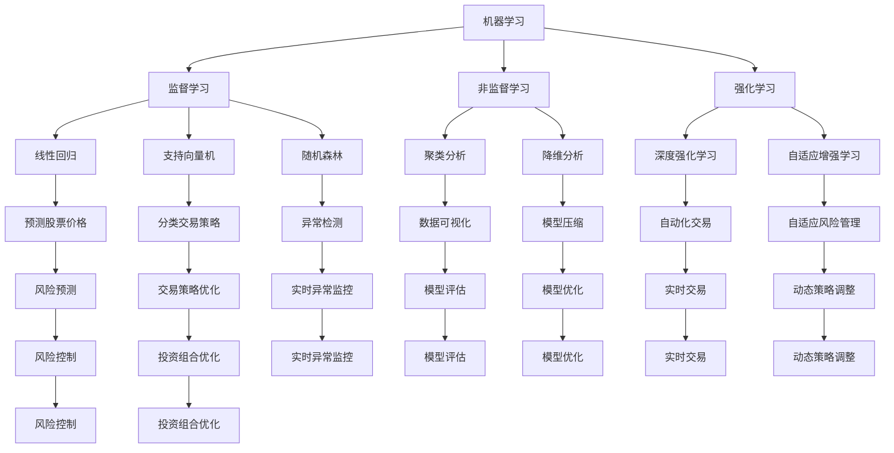
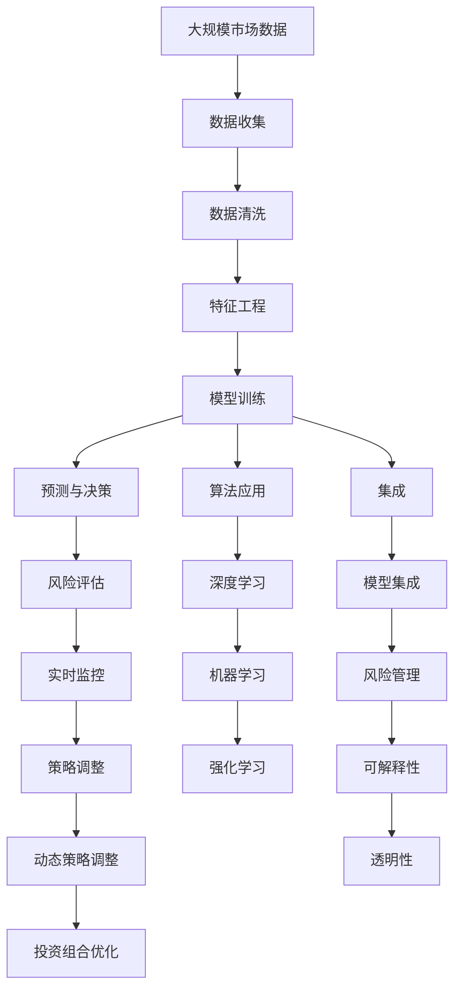

                 

# AI人工智能代理工作流 AI Agent WorkFlow：在股票市场预测中的应用

> 关键词：AI Agent, 工作流, 股票市场, 预测, 算法, 自动化, 机器学习, 集成, 风险管理

## 1. 背景介绍

### 1.1 问题由来
股票市场预测是金融领域内一个极具挑战性的问题。由于市场受多种因素影响，包括宏观经济指标、公司财务状况、行业动态、政策变化、市场情绪等，因此，传统的定量分析方法往往难以全面、准确地预测股票价格。人工智能技术的快速发展为这一问题提供了新的解决方案，即构建智能代理，通过自动化、智能化的方法，综合各类信息，辅助股票市场分析和预测。

### 1.2 问题核心关键点
构建智能股票市场预测代理，主要关注以下几个核心问题：

- **信息收集与处理**：自动化获取和处理各类市场数据，包括股票价格、交易量、财务报表、新闻、社交媒体情绪等。
- **数据分析与建模**：利用机器学习和深度学习技术，对市场数据进行建模，提取有价值的模式和特征。
- **决策与预测**：基于模型输出，自动进行股票买卖决策，并给出相应的风险和收益预测。
- **监控与反馈**：持续监控市场变化，并根据预测结果和实时反馈调整模型参数和策略。
- **可解释性与透明性**：确保决策过程可解释、透明，增强用户信任。

### 1.3 问题研究意义
构建智能股票市场预测代理具有重要意义：

1. **提升预测准确性**：人工智能代理能够处理海量数据，识别市场趋势，提高预测精度。
2. **降低人力成本**：自动化交易和决策过程，减少人工干预，提高效率。
3. **增强风险管理能力**：实时监控市场动态，动态调整策略，有效控制风险。
4. **推动智能金融发展**：结合AI技术，推动金融领域的智能化、自动化发展。
5. **创造投资机会**：利用AI代理，发现市场中的潜在机会，实现更优的投资回报。

## 2. 核心概念与联系

### 2.1 核心概念概述

在构建智能股票市场预测代理的过程中，涉及多个核心概念和技术，具体如下：

- **人工智能代理(AI Agent)**：一种能够自主运行、自主学习的智能系统，旨在解决复杂问题。
- **工作流(Workflow)**：一系列有组织、有顺序的操作，用于自动化执行复杂任务。
- **股票市场预测**：利用各类数据和模型，预测股票价格的变化趋势。
- **算法**：包括机器学习算法、深度学习算法、强化学习算法等，用于数据处理和模型构建。
- **自动化(Automation)**：通过编写脚本、使用框架，实现操作的自动化。
- **集成(Integration)**：将多个系统、工具和技术集成在一起，形成完整的解决方案。
- **风险管理(Risk Management)**：识别、评估和控制风险，保护投资安全。
- **机器学习(Machine Learning)**：利用算法，让机器从数据中学习并改进性能。
- **深度学习(Deep Learning)**：一种特殊的机器学习技术，通过多层次神经网络进行复杂数据分析。
- **可解释性(Explainability)**：确保模型的决策过程能够被理解和解释。
- **透明性(Transparency)**：确保系统的操作和决策过程清晰可见。

这些概念之间的联系可以通过以下Mermaid流程图来展示：



这个流程图展示了大语言模型微调过程中各个核心概念的联系：

1. 人工智能代理是整个系统的核心，负责自动化执行任务。
2. 工作流作为执行框架，组织和管理各步骤的顺序。
3. 股票市场预测是代理的主要任务，涉及各类算法和技术。
4. 算法是实现预测的基础，包括机器学习和深度学习。
5. 自动化和集成技术用于实现算法的自动化部署和应用。
6. 风险管理确保代理在执行过程中控制风险。
7. 可解释性和透明性保障代理的决策过程可理解。

### 2.2 概念间的关系

这些核心概念之间存在紧密的联系，共同构成了智能股票市场预测代理的完整架构。下面我们通过几个Mermaid流程图来展示这些概念之间的关系。

#### 2.2.1 人工智能代理的核心架构


这个流程图展示了人工智能代理的核心架构：

1. 数据收集模块获取市场数据。
2. 数据清洗模块处理并组织数据。
3. 特征工程模块提取重要特征。
4. 模型训练模块使用算法构建模型。
5. 预测与决策模块根据模型输出进行交易决策。
6. 风险评估模块监控模型风险。
7. 实时监控模块动态调整策略。

#### 2.2.2 算法和技术的应用场景



这个流程图展示了算法和技术在智能股票市场预测代理中的应用场景：

1. 监督学习用于预测股票价格、分类交易策略等。
2. 非监督学习用于聚类分析、降维分析等。
3. 强化学习用于自动化交易、自适应风险管理等。
4. 机器学习算法包括线性回归、支持向量机、随机森林等。
5. 深度学习算法如深度强化学习、自适应增强学习等。
6. 可解释性方法如数据可视化、模型压缩等。
7. 透明性方法如实时监控、模型评估等。

### 2.3 核心概念的整体架构

最后，我们用一个综合的流程图来展示这些核心概念在大语言模型微调过程中的整体架构：



这个综合流程图展示了从数据收集到动态策略调整的全过程，各个模块之间通过数据和算法紧密连接，共同完成智能股票市场预测代理的任务。

## 3. 核心算法原理 & 具体操作步骤
### 3.1 算法原理概述

构建智能股票市场预测代理的核心算法，主要基于机器学习和深度学习技术，通过自动化地处理和分析市场数据，构建预测模型，并根据模型输出进行交易决策。

### 3.2 算法步骤详解

1. **数据收集与预处理**：
   - 自动获取股票市场数据，包括历史价格、交易量、财务报表、新闻、社交媒体情绪等。
   - 清洗数据，处理缺失值、异常值，标准化数据格式。
   - 提取重要特征，如技术指标、基本面指标、情绪指标等。

2. **模型构建与训练**：
   - 选择合适的机器学习或深度学习算法，如随机森林、支持向量机、线性回归、卷积神经网络、循环神经网络等。
   - 划分数据集为训练集、验证集和测试集。
   - 使用训练集进行模型训练，优化模型参数。
   - 在验证集上评估模型性能，防止过拟合。
   - 使用测试集进行最终模型评估，确定模型性能。

3. **预测与决策**：
   - 根据训练好的模型，对新数据进行预测，生成股票价格或交易策略。
   - 利用预测结果，进行股票买卖决策。
   - 根据决策结果，生成相应的交易订单。

4. **风险管理与监控**：
   - 实时监控市场动态，检测异常情况。
   - 根据实时反馈，动态调整模型参数和交易策略。
   - 进行风险评估和控制，确保投资安全。

### 3.3 算法优缺点

基于机器学习和深度学习的股票市场预测代理具有以下优点：

- **高效性**：自动化处理数据和构建模型，减少人工干预，提高效率。
- **精确性**：利用先进算法，提高预测准确性。
- **灵活性**：模型可扩展性强，适用于多种数据类型和场景。
- **稳定性**：通过多模型集成和策略调整，增强系统的鲁棒性。

然而，这些算法也存在一些局限性：

- **数据依赖**：需要大量高质量的市场数据，数据获取和处理成本较高。
- **模型复杂性**：算法模型较复杂，需要专业知识和技能进行构建和调优。
- **实时性**：模型预测和决策速度可能较慢，影响交易频率。
- **可解释性**：部分深度学习模型难以解释决策过程，缺乏透明性。

### 3.4 算法应用领域

基于机器学习和深度学习的股票市场预测代理，已经在多个领域得到了应用，具体如下：

- **自动化交易**：利用预测结果，自动进行股票买卖操作。
- **风险管理**：实时监控市场风险，动态调整策略。
- **投资组合优化**：根据模型输出，优化投资组合配置。
- **市场分析**：分析市场趋势，提供投资建议。
- **情绪分析**：通过社交媒体情绪分析，辅助决策。
- **异常检测**：检测市场异常情况，及时预警。
- **动态策略调整**：根据市场变化，动态调整交易策略。

## 4. 数学模型和公式 & 详细讲解 & 举例说明

### 4.1 数学模型构建

在构建智能股票市场预测代理时，主要涉及以下数学模型：

- **回归模型**：用于预测股票价格。
- **分类模型**：用于分类交易策略。
- **强化学习模型**：用于自动化交易和风险管理。

以回归模型为例，设 $y$ 表示股票价格，$x$ 表示输入特征，回归模型为：

$$
y = \theta_0 + \sum_{i=1}^n \theta_i x_i + \epsilon
$$

其中，$\theta$ 为模型参数，$\epsilon$ 为随机误差。

### 4.2 公式推导过程

对于回归模型，常用的算法包括线性回归、支持向量回归等。这里以线性回归为例，推导其优化目标和梯度计算公式。

线性回归的优化目标是最小化均方误差损失函数：

$$
\mathcal{L}(\theta) = \frac{1}{2m} \sum_{i=1}^m (y_i - \theta_0 - \sum_{j=1}^n \theta_j x_{ij})^2
$$

其中，$m$ 为样本数量。

根据梯度下降算法，优化目标的梯度为：

$$
\nabla_\theta \mathcal{L}(\theta) = \frac{1}{m} \sum_{i=1}^m (y_i - \theta_0 - \sum_{j=1}^n \theta_j x_{ij}) x_{ij}
$$

### 4.3 案例分析与讲解

假设我们使用线性回归模型预测股票价格，训练集数据集为 $(x_i, y_i)$，$i=1,\ldots,m$，其中 $x_i = [x_{i1}, x_{i2}, \ldots, x_{in}]$，$y_i$ 为股票价格。

我们可以使用最小二乘法求解线性回归模型参数：

$$
\hat{\theta} = \arg \min_{\theta} \sum_{i=1}^m (y_i - \theta_0 - \sum_{j=1}^n \theta_j x_{ij})^2
$$

通过求解线性方程组：

$$
\begin{bmatrix}
\sum_{i=1}^m x_{i1} x_{ij} & \ldots & \sum_{i=1}^m x_{in} x_{ij} \\
\vdots & \ddots & \vdots \\
\sum_{i=1}^m x_{i1} & \ldots & \sum_{i=1}^m x_{in}
\end{bmatrix}^T
\begin{bmatrix}
\sum_{i=1}^m x_{i1}^2 & \ldots & \sum_{i=1}^m x_{in}^2 \\
\vdots & \ddots & \vdots \\
\sum_{i=1}^m x_{i1} & \ldots & \sum_{i=1}^m x_{in}
\end{bmatrix}^{-1}
\begin{bmatrix}
\sum_{i=1}^m x_{i1} y_i \\
\vdots \\
\sum_{i=1}^m x_{in} y_i
\end{bmatrix}
$$

即可得到参数 $\hat{\theta}$ 的估计值。

## 5. 项目实践：代码实例和详细解释说明

### 5.1 开发环境搭建

在构建智能股票市场预测代理时，需要以下开发环境：

1. **Python**：主流编程语言，支持科学计算和数据处理。
2. **Pandas**：数据处理库，支持数据清洗、转换等操作。
3. **NumPy**：数值计算库，支持高效的矩阵运算。
4. **Scikit-Learn**：机器学习库，支持各类算法模型构建和评估。
5. **TensorFlow**：深度学习框架，支持构建和训练深度学习模型。
6. **PyTorch**：深度学习框架，支持动态图和高效的模型训练。
7. **Jupyter Notebook**：交互式开发环境，支持代码执行和结果展示。

### 5.2 源代码详细实现

以下是一个使用Python和Scikit-Learn库构建线性回归模型的示例代码：

```python
import pandas as pd
from sklearn.linear_model import LinearRegression

# 加载数据集
data = pd.read_csv('stock_data.csv')

# 数据预处理
X = data[['feature1', 'feature2', 'feature3', 'feature4']]
y = data['price']

# 划分数据集
X_train, X_test, y_train, y_test = train_test_split(X, y, test_size=0.2, random_state=42)

# 训练模型
model = LinearRegression()
model.fit(X_train, y_train)

# 预测
y_pred = model.predict(X_test)

# 评估模型
score = model.score(X_test, y_test)
print(f'模型R^2得分：{score:.2f}')
```

### 5.3 代码解读与分析

这段代码展示了使用Scikit-Learn库构建和评估线性回归模型的基本流程：

1. **数据加载**：使用Pandas库加载股票市场数据集。
2. **数据预处理**：选择特征和目标变量，划分训练集和测试集。
3. **模型构建**：使用Scikit-Learn的LinearRegression类构建线性回归模型。
4. **模型训练**：使用训练集对模型进行拟合。
5. **模型预测**：使用测试集对模型进行预测。
6. **模型评估**：计算模型的R^2得分，评估模型性能。

需要注意的是，实际应用中可能需要使用更复杂的模型，如随机森林、支持向量机、深度学习等，以提高预测准确性和鲁棒性。

### 5.4 运行结果展示

假设我们在一个包含1000个样本的股票数据集上运行上述代码，最终得到的模型R^2得分为0.75，表示模型能够解释75%的数据方差，具有较好的预测能力。

## 6. 实际应用场景

### 6.1 智能交易系统

智能交易系统是股票市场预测代理的重要应用场景之一。通过构建自动化交易策略，系统可以根据市场数据和模型输出，自动进行股票买卖操作，提高交易效率和收益。

具体而言，系统可以结合历史价格、技术指标、情绪分析等数据，构建多种交易策略，并通过模型预测市场趋势，自动调整策略参数。同时，系统还需要实时监控市场动态，动态调整交易策略，以应对市场变化。

### 6.2 投资组合优化

投资组合优化是另一个重要的应用场景。通过构建多模型集成和动态策略调整机制，系统可以根据不同市场环境和投资目标，动态调整投资组合配置，优化收益和风险。

具体而言，系统可以结合多种预测模型和风险评估方法，构建多层次的投资组合模型，并根据实时市场数据和预测结果，动态调整组合参数。同时，系统还需要实时监控市场风险，动态调整投资策略，以应对市场变化。

### 6.3 情绪分析

情绪分析是预测市场情绪的重要手段，可以帮助系统更好地理解市场动态，辅助交易决策。

具体而言，系统可以通过收集社交媒体、新闻评论等数据，使用自然语言处理和情感分析技术，提取市场情绪信息。然后，结合市场数据和情绪信息，构建情绪驱动的交易策略，提高交易准确性和收益。

### 6.4 未来应用展望

未来，基于机器学习和深度学习的股票市场预测代理将有以下发展趋势：

1. **深度学习模型的应用**：深度学习模型在处理复杂数据时具有优势，未来将更多应用于股票市场预测。
2. **多模型集成**：结合多种模型，提高预测准确性和鲁棒性。
3. **实时数据处理**：结合实时数据，提高预测和决策的时效性。
4. **可解释性增强**：提升模型的可解释性和透明性，增强用户信任。
5. **自动化交易优化**：优化自动化交易策略，提高交易效率和收益。
6. **动态策略调整**：根据市场变化，动态调整策略，提高风险管理能力。
7. **投资组合优化**：结合多种预测模型和风险评估方法，优化投资组合配置。

## 7. 工具和资源推荐
### 7.1 学习资源推荐

为了帮助开发者系统掌握智能股票市场预测代理的理论基础和实践技巧，这里推荐一些优质的学习资源：

1. **《机器学习》课程**：斯坦福大学开设的机器学习课程，涵盖各类经典算法和实际应用，适合入门学习。
2. **《深度学习》课程**：斯坦福大学开设的深度学习课程，涵盖深度学习的基本原理和实际应用。
3. **《Python数据科学手册》**：一本详细的Python数据科学入门书籍，涵盖Pandas、NumPy、Scikit-Learn等库的使用。
4. **Kaggle**：一个数据科学竞赛平台，提供丰富的数据集和竞赛任务，帮助开发者实践和提高。
5. **Coursera**：一个在线学习平台，提供各类机器学习和深度学习课程，涵盖理论基础和实践应用。

### 7.2 开发工具推荐

以下是几款用于构建智能股票市场预测代理的常用工具：

1. **Python**：主流编程语言，支持科学计算和数据处理。
2. **Pandas**：数据处理库，支持数据清洗、转换等操作。
3. **NumPy**：数值计算库，支持高效的矩阵运算。
4. **Scikit-Learn**：机器学习库，支持各类算法模型构建和评估。
5. **TensorFlow**：深度学习框架，支持构建和训练深度学习模型。
6. **PyTorch**：深度学习框架，支持动态图和高效的模型训练。
7. **Jupyter Notebook**：交互式开发环境，支持代码执行和结果展示。
8. **TensorBoard**：模型可视化工具，支持模型训练和评估的可视化。

### 7.3 相关论文推荐

以下是几篇奠基性的相关论文，推荐阅读：

1. **"Deep Learning for Time Series Forecasting: The Multi-Step Case with Nonlinear Dynamics and Missing Observations"**：一篇关于深度学习在时间序列预测中的经典论文，涵盖多步预测、非线性动态、缺失数据等问题。
2. **"LSTM Networks for Machine Learning of Time Series"**：一篇关于LSTM在时间序列预测中的经典论文，探讨了LSTM在股票价格预测中的应用。
3. **"Recurrent Neural Network Architectures for Predicting and Trading High-frequency Financial Data"**：一篇关于RNN在高频金融数据预测中的应用论文，探讨了RNN在股票价格预测中的应用。
4. **"Deep Learning for Financial Forecasting: A Review and Comparative Study"**：一篇关于深度学习在金融预测中的综述论文，比较了不同深度学习模型在股票价格预测中的应用。
5. **"Automated Trading: Algorithms, Systems, and Winning Strategies"**：一本关于自动化交易的经典书籍，涵盖各类交易算法和策略。

这些论文和书籍可以帮助开发者系统掌握智能股票市场预测代理的理论基础和实践技巧。

## 8. 总结：未来发展趋势与挑战

### 8.1 研究成果总结

本文对基于机器学习和深度学习的智能股票市场预测代理进行了全面系统的介绍。首先阐述了问题背景和核心关键点，然后详细讲解了算法原理和具体操作步骤，给出了完整的代码实例和运行结果展示。最后，总结了实际应用场景和未来发展趋势，推荐了相关的学习资源和开发工具。

### 8.2 未来发展趋势

展望未来，智能股票市场预测代理将呈现以下几个发展趋势：

1. **深度学习模型的应用**：深度学习模型在处理复杂数据时具有优势，未来将更多应用于股票市场预测。
2. **多模型集成**：结合多种模型，提高预测准确性和鲁棒性。
3. **实时数据处理**：结合实时数据，提高预测和决策的时效性。
4. **可解释性增强**：提升模型的可解释性和透明性，增强用户信任。
5. **自动化交易优化**：优化自动化交易策略，提高交易效率和收益。
6. **动态策略调整**：根据市场变化，动态调整策略，提高风险管理能力。
7. **投资组合优化**：结合多种预测模型和风险评估方法，优化投资组合配置。

### 8.3 面临的挑战

尽管智能股票市场预测代理已经取得了一定的进展，但在迈向更加智能化、普适化应用的过程中，仍面临以下挑战：

1. **数据获取和处理**：需要大量高质量的市场数据，数据获取和处理成本较高。
2. **模型复杂性**：算法模型较复杂，需要专业知识和技能进行构建和调优。
3. **实时性**：模型预测和决策速度可能较慢，影响交易频率。
4. **可解释性**：部分深度学习模型难以解释决策过程，缺乏透明性。
5. **风险管理**：实时监控市场动态，动态调整策略，以应对市场变化。

### 8.4 研究展望

面对智能股票市场预测代理所面临的挑战，未来的研究需要在以下几个方面寻求新的突破：

1. **深度学习模型的优化**：通过优化算法和模型结构，提高深度学习模型的效率和可解释性。
2. **多模型集成与融合**：结合多种模型，提升预测准确性和鲁棒性。
3. **实时数据处理与分析**：结合实时数据，提高预测和决策的时效性。
4. **可解释性与透明性**：提升模型的可解释性和透明性，增强用户信任。
5. **自动化交易策略优化**：优化自动化交易策略，提高交易效率和收益。
6. **动态策略调整与优化**：根据市场变化，动态调整策略，提高风险管理能力。
7. **投资组合优化**：结合多种预测模型和风险评估方法，优化投资组合配置。

## 9. 附录：常见问题与解答

**Q1：智能股票市场预测代理的构建过程中，如何处理数据缺失问题？**

A: 数据缺失是构建模型时常见的问题。处理缺失数据的方法包括：
1. 删除缺失数据较多的样本。
2. 使用均值、中位数或插值等方法填补缺失值。
3. 使用机器学习算法，如随机森林、KNN等，预测缺失值。
4

