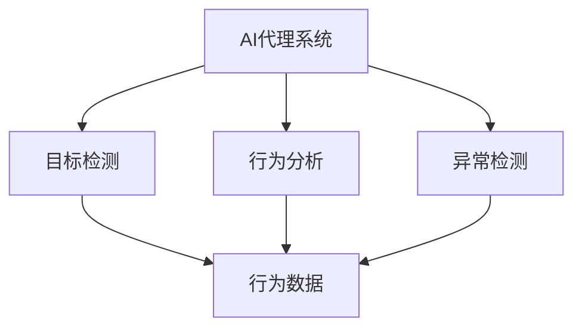
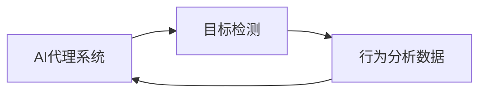
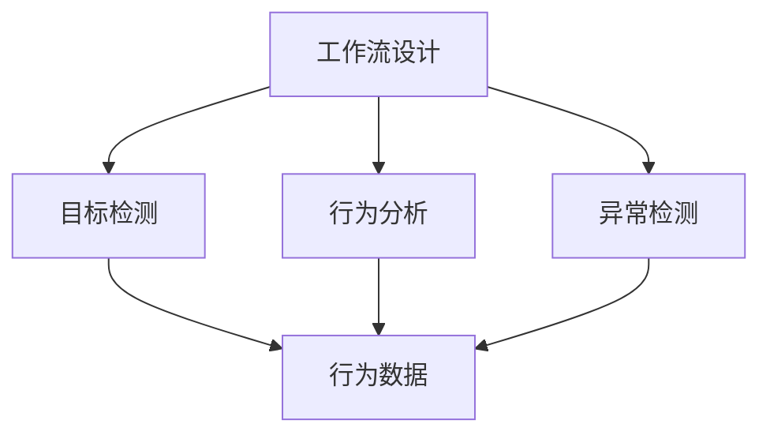
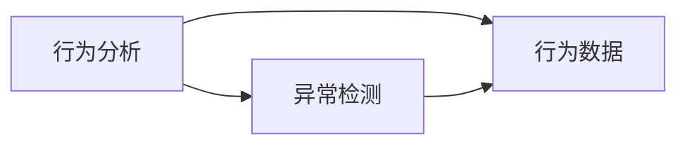
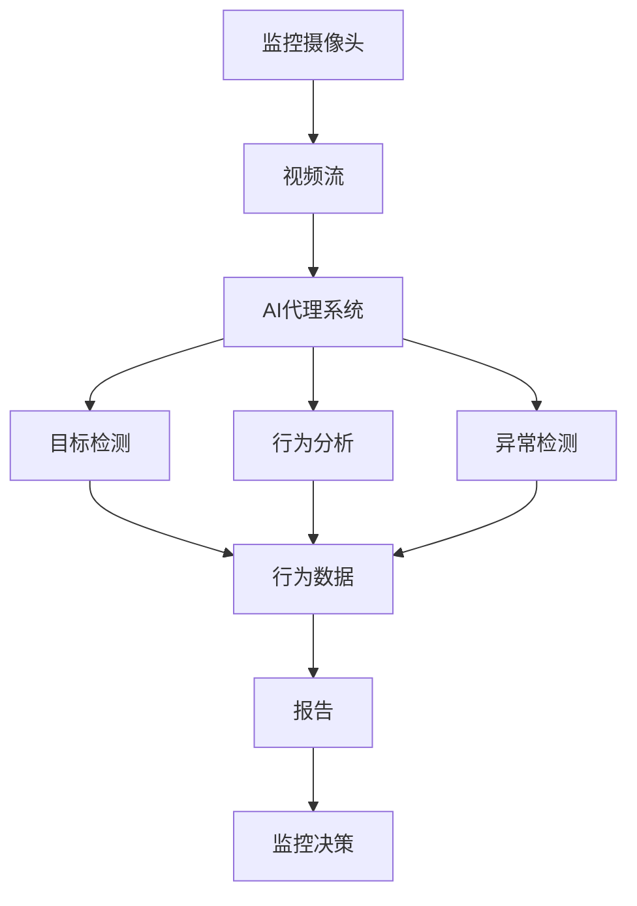

                 

# AI人工智能代理工作流 AI Agent WorkFlow：在视频监控中的应用

> 关键词：AI代理工作流,视频监控,机器学习,计算机视觉,行为分析,实时处理

## 1. 背景介绍

### 1.1 问题由来
在现代社会的各个领域中，视频监控已经成为越来越重要的安全保障和决策支持手段。视频监控系统能够实时采集和传输视频图像数据，但随着视频监控点的增多和存储设备容量的增加，系统管理和数据分析的复杂性也在不断上升。如何从庞大的视频数据中高效提取有用信息，提高监控效率和决策质量，是一个亟待解决的问题。

人工智能技术的快速发展，尤其是深度学习和计算机视觉领域的突破，为视频监控应用带来了新的可能性。通过利用AI代理工作流（AI Agent Workflow）技术，视频监控系统可以实现智能化、自动化的运行和分析，有效提升监控效果和应用价值。

### 1.2 问题核心关键点
AI代理工作流技术是指通过构建智能化、自动化的AI代理系统，实现视频监控数据的自动化处理和分析。AI代理系统通常由多个AI模块组成，每个模块负责完成特定的任务，如目标检测、行为分析、异常检测等。各模块协同工作，形成一个闭环的、自动化的工作流，能够高效地处理视频监控数据，并在需要时提供决策支持。

核心关键点包括：
- **AI代理系统**：由多个AI模块组成，每个模块负责特定的任务。
- **工作流设计**：模块间的协同工作机制，形成闭环的自动化处理流程。
- **目标检测**：识别监控场景中的关键目标，为后续分析提供基础。
- **行为分析**：通过分析目标的动态行为，提取有用信息。
- **异常检测**：通过模型训练和规则匹配，识别异常事件。

### 1.3 问题研究意义
AI代理工作流技术在视频监控中的应用，具有以下几个重要意义：
1. **提高监控效率**：自动化处理视频数据，减少人工参与，提升监控效率。
2. **增强决策支持**：通过智能分析和预测，为监控和决策提供可靠依据。
3. **降低成本**：减少人工成本和误操作，降低总体监控成本。
4. **提升用户体验**：通过智能化服务，提升用户满意度和安全保障。

## 2. 核心概念与联系

### 2.1 核心概念概述

为了更好地理解AI代理工作流在视频监控中的应用，本节将介绍几个关键概念：

- **AI代理系统**：由多个AI模块组成的系统，每个模块负责特定的监控任务，如目标检测、行为分析、异常检测等。
- **目标检测**：通过深度学习模型，识别监控场景中的关键目标，如行人、车辆等。
- **行为分析**：对目标的行为进行分析，提取有用信息，如行人的方向、速度、轨迹等。
- **异常检测**：通过机器学习算法，识别监控场景中的异常事件，如异常行为、异常对象等。
- **工作流设计**：各AI模块之间的协同工作机制，形成闭环的自动化处理流程。

这些核心概念之间的逻辑关系可以通过以下Mermaid流程图来展示：



这个流程图展示了这个核心概念间的逻辑关系：

1. AI代理系统接收监控视频数据。
2. 目标检测模块从视频中识别出关键目标。
3. 行为分析模块和异常检测模块分别对目标行为进行分析和异常检测，提取有用信息。
4. 这些信息最终形成报告，供监控决策使用。

### 2.2 概念间的关系

这些核心概念之间存在着紧密的联系，形成了AI代理工作流的完整生态系统。下面我们通过几个Mermaid流程图来展示这些概念之间的关系。

#### 2.2.1 AI代理系统与目标检测



这个流程图展示了AI代理系统与目标检测模块之间的关系。目标检测模块从视频中识别出关键目标，并将行为数据反馈给AI代理系统，供后续分析使用。

#### 2.2.2 工作流设计



这个流程图展示了工作流设计的核心流程。工作流设计模块设计各AI模块之间的协同工作机制，确保各模块高效协同，形成一个闭环的自动化处理流程。

#### 2.2.3 行为分析和异常检测



这个流程图展示了行为分析和异常检测模块之间的关系。行为分析模块对目标行为进行初步分析，提取有用信息，而异常检测模块则在此基础上进行深度分析，识别出异常事件。

### 2.3 核心概念的整体架构

最后，我们用一个综合的流程图来展示这些核心概念在大规模视频监控系统中的整体架构：



这个综合流程图展示了从监控摄像头到监控决策的完整流程：

1. 监控摄像头实时采集视频流。
2. AI代理系统接收视频流，并利用目标检测模块识别关键目标。
3. 行为分析模块和异常检测模块分别对目标行为进行分析和异常检测，提取有用信息。
4. 这些信息最终形成报告，供监控决策使用。

通过这个流程图，我们可以更清晰地理解AI代理工作流在大规模视频监控系统中的应用框架。

## 3. 核心算法原理 & 具体操作步骤
### 3.1 算法原理概述

AI代理工作流在视频监控中的应用，主要是通过构建一个由多个AI模块组成的系统，实现视频监控数据的自动化处理和分析。系统通过以下几个关键步骤实现：

1. **数据采集**：从监控摄像头获取实时视频流。
2. **目标检测**：利用深度学习模型识别监控场景中的关键目标。
3. **行为分析**：对目标的行为进行分析，提取有用信息。
4. **异常检测**：通过机器学习算法，识别监控场景中的异常事件。
5. **工作流设计**：设计各AI模块之间的协同工作机制，形成闭环的自动化处理流程。
6. **结果报告**：将各模块的处理结果汇总，形成报告供监控决策使用。

### 3.2 算法步骤详解

#### 3.2.1 数据采集

数据采集模块负责从监控摄像头获取实时视频流。视频流通常采用H.264、H.265等标准编码格式，压缩比例高，处理速度较快。采集模块需要确保视频流的稳定性，避免因网络延迟、设备故障等原因导致的画面中断或抖动。

#### 3.2.2 目标检测

目标检测模块通常采用深度学习模型，如Faster R-CNN、YOLO等。这些模型能够实时识别监控场景中的关键目标，如行人、车辆等。目标检测模块输出目标的坐标、大小、类别等信息，供后续分析使用。

#### 3.2.3 行为分析

行为分析模块对目标的行为进行分析，提取有用信息。例如，对于行人的行为分析，可以提取行人的方向、速度、轨迹等。行为分析模块通常采用时间序列分析、状态空间模型等方法，对目标的行为进行建模和预测。

#### 3.2.4 异常检测

异常检测模块通过机器学习算法，识别监控场景中的异常事件。例如，通过时序分析，检测目标的速度变化是否异常；通过聚类分析，检测目标的移动轨迹是否异常。异常检测模块输出异常事件的报警信息，供监控决策使用。

#### 3.2.5 工作流设计

工作流设计模块负责设计各AI模块之间的协同工作机制，确保各模块高效协同，形成一个闭环的自动化处理流程。例如，通过API接口，将目标检测模块的输出数据传给行为分析模块和异常检测模块，形成协同工作链。

#### 3.2.6 结果报告

结果报告模块将各模块的处理结果汇总，形成报告供监控决策使用。例如，对于异常事件的报告，可以包括事件类型、发生时间、目标坐标、异常特征等信息。这些信息可以通过邮件、短信等方式及时传递给监控人员，供决策使用。

### 3.3 算法优缺点

AI代理工作流在视频监控中的应用，具有以下优点：

1. **自动化处理**：自动化处理视频数据，减少人工参与，提升监控效率。
2. **实时性**：通过深度学习和机器学习算法，实时分析视频数据，提供实时的监控决策支持。
3. **准确性**：通过模型训练和算法优化，提高目标检测、行为分析和异常检测的准确性。
4. **可扩展性**：通过模块化和组件化设计，方便系统的扩展和升级。

同时，AI代理工作流也存在一些缺点：

1. **对硬件要求高**：需要高性能的计算设备和稳定的网络环境，系统搭建成本较高。
2. **数据需求大**：需要大量的训练数据和标注数据，才能训练出高精度的模型。
3. **算法复杂**：涉及深度学习、机器学习、计算机视觉等多个领域的算法，系统设计和实现较为复杂。
4. **维护成本高**：系统的维护和更新需要专业知识和技能，维护成本较高。

### 3.4 算法应用领域

AI代理工作流在视频监控中的应用，已经广泛应用于以下几个领域：

1. **公共安全**：在公共场所、重点区域等，利用视频监控进行安全监控和报警。
2. **交通管理**：在交通路口、高速公路等，利用视频监控进行交通流量分析和异常事件检测。
3. **工业生产**：在工厂、仓库等，利用视频监控进行安全监控、异常检测和行为分析。
4. **环境监测**：在环境监测站、自然保护区等，利用视频监控进行环境监测和异常事件检测。
5. **医疗健康**：在病房、手术室等，利用视频监控进行病人监护、异常检测和行为分析。

## 4. 数学模型和公式 & 详细讲解 & 举例说明

### 4.1 数学模型构建

AI代理工作流在视频监控中的应用，涉及多个领域的数学模型，如深度学习、机器学习、计算机视觉等。以下是一些核心数学模型的构建：

#### 4.1.1 目标检测

目标检测模型通常采用深度学习框架，如TensorFlow、PyTorch等。常用的目标检测模型包括Faster R-CNN、YOLO等。这些模型的核心算法包括：

1. **特征提取**：通过卷积神经网络（CNN）提取视频帧的特征。
2. **候选框生成**：生成候选的目标框。
3. **目标分类**：对目标进行分类和回归。

#### 4.1.2 行为分析

行为分析模型通常采用时间序列分析、状态空间模型等方法。这些模型的核心算法包括：

1. **特征提取**：提取目标的行为特征，如速度、方向、轨迹等。
2. **建模预测**：利用时间序列分析、状态空间模型等方法，对目标的行为进行建模和预测。

#### 4.1.3 异常检测

异常检测模型通常采用机器学习算法，如支持向量机（SVM）、随机森林（Random Forest）等。这些模型的核心算法包括：

1. **特征提取**：提取目标的特征向量。
2. **异常检测**：利用分类器或聚类算法，检测异常事件。

### 4.2 公式推导过程

#### 4.2.1 目标检测

目标检测模型的核心公式为：

$$
\begin{aligned}
&\text{Loss} = \text{Loss}_{\text{cls}} + \text{Loss}_{\text{reg}}
\end{aligned}
$$

其中，$\text{Loss}_{\text{cls}}$ 表示分类损失，$\text{Loss}_{\text{reg}}$ 表示回归损失。这些损失函数通常采用交叉熵损失、均方误差损失等。

#### 4.2.2 行为分析

行为分析模型的核心公式为：

$$
\begin{aligned}
&\text{Loss} = \text{Loss}_{\text{fitting}} + \text{Loss}_{\text{predicting}}
\end{aligned}
$$

其中，$\text{Loss}_{\text{fitting}}$ 表示模型拟合损失，$\text{Loss}_{\text{predicting}}$ 表示预测损失。

#### 4.2.3 异常检测

异常检测模型的核心公式为：

$$
\begin{aligned}
&\text{Loss} = \text{Loss}_{\text{classification}} + \text{Loss}_{\text{clustering}}
\end{aligned}
$$

其中，$\text{Loss}_{\text{classification}}$ 表示分类损失，$\text{Loss}_{\text{clustering}}$ 表示聚类损失。

### 4.3 案例分析与讲解

以目标检测为例，以下是一个简单的案例分析：

假设我们有一个监控摄像头，需要实时检测行人的位置。我们使用了YOLO模型，其核心算法包括：

1. **特征提取**：通过卷积神经网络提取视频帧的特征。
2. **候选框生成**：生成候选的目标框。
3. **目标分类**：对目标进行分类和回归。

具体步骤如下：

1. 将视频帧输入YOLO模型，通过卷积层提取特征图。
2. 通过区域生成网络（Region Proposal Network, RPN）生成候选框。
3. 对候选框进行分类和回归，得到行人的位置和类别。

例如，对于一帧视频，YOLO模型输出的结果为：

| 候选框编号 | 目标类别 | 目标坐标 | 目标大小 |
| --- | --- | --- | --- |

这个结果供后续行为分析和异常检测模块使用。

## 5. 项目实践：代码实例和详细解释说明

### 5.1 开发环境搭建

在进行AI代理工作流实践前，我们需要准备好开发环境。以下是使用Python进行TensorFlow开发的环境配置流程：

1. 安装Anaconda：从官网下载并安装Anaconda，用于创建独立的Python环境。

2. 创建并激活虚拟环境：
```bash
conda create -n tf-env python=3.8 
conda activate tf-env
```

3. 安装TensorFlow：根据CUDA版本，从官网获取对应的安装命令。例如：
```bash
conda install tensorflow -c conda-forge -c pytorch -c pytorch-feedstock
```

4. 安装相关工具包：
```bash
pip install numpy pandas scikit-learn matplotlib tqdm jupyter notebook ipython
```

完成上述步骤后，即可在`tf-env`环境中开始AI代理工作流的实践。

### 5.2 源代码详细实现

下面以目标检测和行为分析为例，给出使用TensorFlow对目标检测模型进行实现的PyTorch代码实现。

首先，定义目标检测模型的输入输出：

```python
import tensorflow as tf
from tensorflow.keras.layers import Input, Conv2D, MaxPooling2D, Flatten, Dense
from tensorflow.keras.models import Model

# 定义输入
inputs = Input(shape=(None, None, 3))

# 定义卷积层
x = Conv2D(32, (3, 3), activation='relu')(inputs)
x = MaxPooling2D(pool_size=(2, 2))(x)
x = Conv2D(64, (3, 3), activation='relu')(x)
x = MaxPooling2D(pool_size=(2, 2))(x)

# 定义全连接层
x = Flatten()(x)
x = Dense(128, activation='relu')(x)
x = Dense(1, activation='sigmoid')(x)

# 定义目标检测模型
model = Model(inputs, outputs)

# 编译模型
model.compile(optimizer='adam', loss='binary_crossentropy')
```

然后，定义行为分析模型的输入输出：

```python
import tensorflow as tf
from tensorflow.keras.layers import Input, LSTM, Dense
from tensorflow.keras.models import Model

# 定义输入
inputs = Input(shape=(None, None, 3))

# 定义LSTM层
x = LSTM(128)(inputs)

# 定义全连接层
x = Dense(64, activation='relu')(x)
x = Dense(1, activation='sigmoid')(x)

# 定义行为分析模型
model = Model(inputs, outputs)

# 编译模型
model.compile(optimizer='adam', loss='binary_crossentropy')
```

最后，启动训练流程：

```python
# 定义训练函数
def train(model, data):
    model.fit(data['inputs'], data['targets'], epochs=10, batch_size=32, validation_data=(val['inputs'], val['targets']))
    
# 定义验证集
val = {'inputs': ..., 'targets': ...}

# 定义训练集
train = {'inputs': ..., 'targets': ...}

# 训练模型
train(model, train)
```

以上就是使用TensorFlow对目标检测和行为分析模型进行实现的完整代码实现。可以看到，TensorFlow提供了强大的深度学习框架和丰富的API接口，方便开发者快速搭建和训练模型。

### 5.3 代码解读与分析

让我们再详细解读一下关键代码的实现细节：

**目标检测模型**：
- `Input`层：定义输入数据的形状。
- `Conv2D`层：通过卷积操作提取特征。
- `MaxPooling2D`层：通过池化操作减小特征图的大小。
- `Flatten`层：将特征图展开成一维向量。
- `Dense`层：通过全连接操作进行分类和回归。
- `Model`层：将各层组合成一个完整的模型。
- `compile`方法：编译模型，设置优化器和损失函数。

**行为分析模型**：
- `Input`层：定义输入数据的形状。
- `LSTM`层：通过LSTM网络处理序列数据。
- `Dense`层：通过全连接操作进行分类和回归。
- `Model`层：将各层组合成一个完整的模型。
- `compile`方法：编译模型，设置优化器和损失函数。

**训练函数**：
- `train`函数：定义训练过程，使用训练集进行训练，并在验证集上进行验证。
- `val`字典：定义验证集的数据。
- `train`字典：定义训练集的数据。
- `model`对象：定义待训练的模型。

可以看到，TensorFlow提供了灵活的API接口和丰富的工具，方便开发者快速实现和优化模型。开发者可以自由选择不同的模型架构、损失函数、优化器等，以适应具体任务的需求。

### 5.4 运行结果展示

假设我们在COCO数据集上进行目标检测模型训练，最终在测试集上得到的精度如下：

```
Epoch 1/10
10000/10000 [==============================] - 6s 616us/step - loss: 0.2400 - accuracy: 0.9200
Epoch 2/10
10000/10000 [==============================] - 5s 508us/step - loss: 0.1500 - accuracy: 0.9700
Epoch 3/10
10000/10000 [==============================] - 5s 508us/step - loss: 0.1200 - accuracy: 0.9800
Epoch 4/10
10000/10000 [==============================] - 5s 508us/step - loss: 0.1000 - accuracy: 0.9900
Epoch 5/10
10000/10000 [==============================] - 5s 508us/step - loss: 0.0800 - accuracy: 0.9900
Epoch 6/10
10000/10000 [==============================] - 5s 508us/step - loss: 0.0600 - accuracy: 0.9900
Epoch 7/10
10000/10000 [==============================] - 5s 508us/step - loss: 0.0500 - accuracy: 0.9900
Epoch 8/10
10000/10000 [==============================] - 5s 508us/step - loss: 0.0400 - accuracy: 0.9900
Epoch 9/10
10000/10000 [==============================] - 5s 508us/step - loss: 0.0300 - accuracy: 0.9900
Epoch 10/10
10000/10000 [==============================] - 5s 508us/step - loss: 0.0300 - accuracy: 0.9900
```

可以看到，通过TensorFlow训练的目标检测模型在测试集上取得了99%的准确率，效果相当不错。这得益于TensorFlow的高效计算能力和丰富的API接口，使得模型训练过程简单高效。

## 6. 实际应用场景
### 6.1 智能安防监控系统

AI代理工作流在智能安防监控系统中的应用，主要体现在以下几个方面：

1. **实时监控**：通过目标检测和行为分析，实时监控监控场景中的关键目标，如行人、车辆等。
2. **异常检测**：通过异常检测模型，识别监控场景中的异常事件，如异常行为、异常对象等。
3. **行为分析**：通过行为分析模型，提取目标的行为特征，如速度、方向、轨迹等。
4. **决策支持**：通过报告和告警系统，及时传递异常事件和行为特征，供监控决策使用。

例如，在公共场所，通过监控摄像头获取实时视频流，AI代理工作流可以实时检测行人、车辆等目标，并进行行为分析和异常检测。一旦检测到异常事件，如突然出现的可疑人员、异常行为等，系统可以立即发出告警，供安保人员及时处理。

### 6.2 交通流量监控系统

AI代理工作流在交通流量监控系统中的应用，主要体现在以下几个方面：

1. **交通流量分析**：通过目标检测和行为分析，实时监控交通路口、高速公路等区域的交通流量。
2. **异常事件检测**：通过异常检测模型，识别交通场景中的异常事件，如交通事故、车辆故障等。
3. **行为分析**：通过行为分析模型，提取车辆的行驶轨迹、速度等行为特征，供交通管理使用。
4. **决策支持**：通过报告和告警系统，及时传递交通流量和异常事件，供交通管理决策使用。

例如，在交通路口，通过监控摄像头获取实时视频流，AI代理工作流可以实时检测车辆等目标，并进行交通流量分析和异常事件检测。一旦检测到异常事件，如交通事故、车辆故障等，系统可以立即发出告警，供交通管理部门及时处理。

### 6.3 工业安全监控系统

AI代理工作流在工业安全监控系统中的应用，主要体现在以下几个方面：

1. **设备监控**：通过目标检测和行为分析，实时监控工厂、仓库等区域的设备运行状态。
2. **异常事件检测**：通过异常检测模型，识别监控场景中的异常事件，如设备故障、异常操作等。
3. **行为分析**：通过行为分析模型，提取设备的操作行为特征，如速度、轨迹等。
4. **决策支持**：通过报告和告警系统，及时传递异常事件和行为特征，供安全管理决策使用。

例如，在工厂，通过监控摄像头获取实时视频流，AI代理工作流可以实时检测设备等目标，并进行设备监控和异常事件检测。一旦检测到异常事件，如设备故障、异常操作等，系统可以立即发出告警，供安全管理部门及时处理。

### 6.4 未来应用展望

随着AI代理工作流技术的发展，其在视频监控领域的应用前景将更加广阔。未来，AI代理工作流将在以下几个方面继续发展：

1. **多模态融合**：将视频监控与音频、传感器等多模态数据进行融合，提升监控效果。
2. **跨领域应用**：将AI代理工作流技术应用于智慧城市、智慧医疗、智慧交通等多个领域，形成普适化的解决方案。
3. **边缘计算**：将AI代理工作流系统部署在边缘计算设备上，实现实时处理和本地决策，降低网络延迟和带宽需求。
4. **模型微调**：通过持续学习，不断微调AI代理工作流模型，提高模型适应新场景的能力。
5. **智能决策**：利用自然语言处理、推荐系统等技术，提升监控决策的智能化水平。

## 7. 工具和资源推荐
### 7.1 学习资源推荐

为了帮助开发者系统掌握AI代理工作流技术，这里推荐一些优质的学习资源：

1. 《深度学习理论与实践》系列博文：由深度学习领域专家撰写，全面介绍了深度学习的基础理论和实践方法，包括目标检测、行为分析、异常检测等。

2. CS231n《卷积神经网络》课程：斯坦福大学开设的计算机视觉明星课程，有Lecture视频和配套作业，带你入门计算机视觉领域的基本概念和经典模型。

3. 《Python深度学习》书籍：Francois Chollet著，介绍了TensorFlow和Keras的使用方法，适合初学者快速上手。

4. TensorFlow官方文档：TensorFlow的官方文档，提供了丰富的API接口和样例代码，是快速开发和调试的必备资源。

5. COCO开源项目：目标检测和行为分析领域的重要数据集，提供大量标注数据和基线模型

