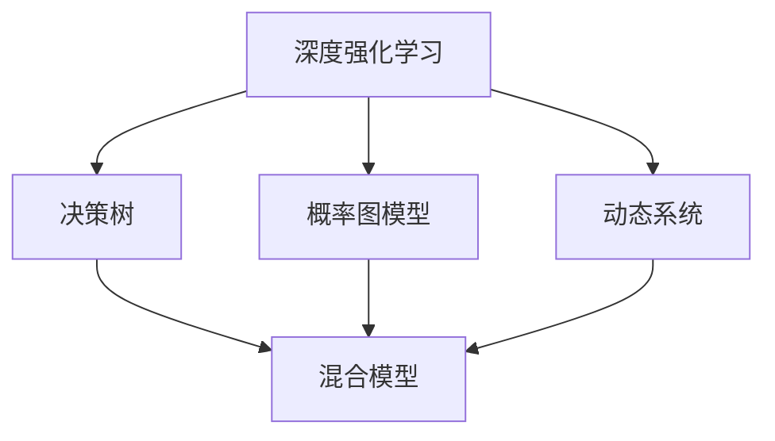
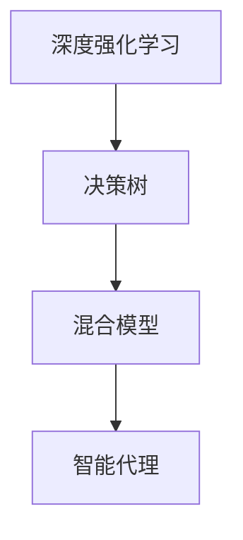
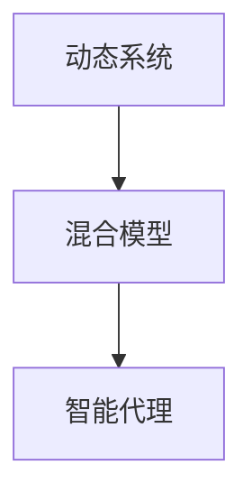
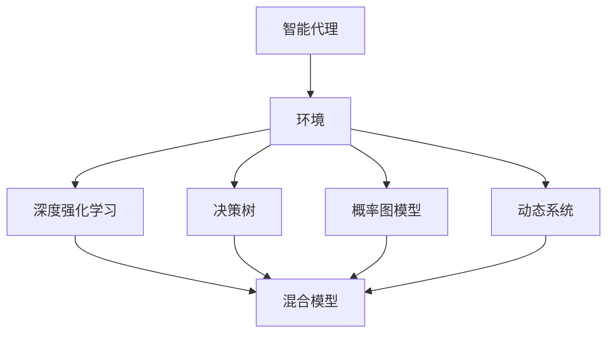

                 

# AI人工智能代理工作流AI Agent WorkFlow：AI代理的深度强化学习策略

> 关键词：人工智能,深度强化学习,策略优化,强化学习算法,决策树,概率图模型,动态系统,复杂环境

## 1. 背景介绍

### 1.1 问题由来
在AI领域，智能代理（AI Agent）已经成为一个热门研究课题。智能代理通常被定义为由软件实现的，可以自主决策并在某种环境下执行任务的系统。它们在自然语言处理（NLP）、机器人控制、游戏AI等多个领域都有广泛应用。例如，自然语言处理中的聊天机器人，通过深度学习进行语言理解和对话生成；机器人控制中的自主导航，通过强化学习算法在复杂环境中自主决策；在多玩家游戏中，AI代理通过深度强化学习算法进行策略优化，最终达到获胜的目标。

在各种应用场景中，AI代理需要处理的信息量巨大，并且必须具备较高的决策能力和适应能力。因此，如何设计有效的决策策略，成为了AI代理研究的核心问题之一。在实际应用中，深度强化学习（Deep Reinforcement Learning, DRL）方法被广泛用于智能代理的决策策略优化。该方法通过学习环境与智能代理之间的奖励机制，使得代理在环境中通过不断试错和调整策略，逐步学会如何最大化累计奖励。

然而，在处理复杂环境和高维度决策空间时，DRL仍然面临许多挑战。例如，在环境变化快速、任务复杂度高、奖励信号稀疏等情况下，DRL模型的训练过程容易陷入局部最优，无法达到全局最优。此外，DRL模型的计算复杂度较高，训练过程需要大量时间和计算资源，这在实际应用中往往是一个难题。

为了解决这些问题，研究者们提出了一种新的AI代理工作流方法——深度强化学习策略优化。该方法结合了DRL与决策树、概率图模型、动态系统等工具，使得AI代理能够高效地适应复杂环境，并在动态变化中做出最优决策。

### 1.2 问题核心关键点
深度强化学习策略优化方法的核心关键点包括以下几点：

- **混合模型：** 将DRL与决策树、概率图模型等工具结合，形成一种混合模型，使得智能代理能够同时利用概率模型对未来进行预测，以及使用DRL算法对当前状态进行最优决策。
- **策略优化：** 通过优化智能代理的策略，使得代理能够在复杂环境中快速适应和决策，并且具有较高的泛化能力。
- **动态调整：** 能够根据环境变化动态调整智能代理的策略，从而应对突发事件和任务复杂度的变化。
- **多任务学习：** 支持多任务学习，即智能代理能够同时学习多个任务，并且能够在不同任务间切换。

## 2. 核心概念与联系

### 2.1 核心概念概述

为更好地理解深度强化学习策略优化方法，本节将介绍几个密切相关的核心概念：

- **深度强化学习（DRL）：** 一种结合深度学习和强化学习的混合方法，通过神经网络对环境进行感知，通过强化学习算法优化策略，使得智能代理能够在复杂环境中自主决策。
- **决策树（Decision Tree）：** 一种基于树形结构的模型，通过学习环境的历史数据，预测未来的状态和奖励，帮助智能代理做出最优决策。
- **概率图模型（Probabilistic Graphical Model, PG Model）：** 一种基于概率图结构的模型，通过联合概率分布建模，使得智能代理能够高效地处理多变量数据。
- **动态系统（Dynamic System）：** 一种时变系统，能够根据环境变化动态调整系统参数，使得智能代理能够适应动态环境。
- **混合模型（Hybrid Model）：** 结合多种模型的混合模型，能够同时利用多种工具的优点，提升智能代理的决策能力和泛化能力。

这些核心概念之间的逻辑关系可以通过以下Mermaid流程图来展示：



这个流程图展示了大语言模型微调过程中各个核心概念的关系和作用：

1. 深度强化学习：作为智能代理的核心决策手段，能够通过DRL算法进行自主决策。
2. 决策树：利用历史数据进行未来预测，帮助智能代理进行最优决策。
3. 概率图模型：通过联合概率分布建模，高效处理多变量数据，提升智能代理的决策能力。
4. 动态系统：根据环境变化动态调整系统参数，使得智能代理能够适应动态环境。
5. 混合模型：结合多种工具的优点，提升智能代理的决策能力和泛化能力。

### 2.2 概念间的关系

这些核心概念之间存在着紧密的联系，形成了深度强化学习策略优化方法的整体架构。下面我通过几个Mermaid流程图来展示这些概念之间的关系。

#### 2.2.1 深度强化学习与决策树的关系



这个流程图展示了深度强化学习与决策树的关系。决策树利用历史数据进行未来预测，并将预测结果作为DRL算法的输入，从而帮助智能代理进行最优决策。

#### 2.2.2 深度强化学习与概率图模型的关系


这个流程图展示了深度强化学习与概率图模型的关系。概率图模型通过联合概率分布建模，使得智能代理能够高效地处理多变量数据，提升智能代理的决策能力。

#### 2.2.3 动态系统与混合模型的关系



这个流程图展示了动态系统与混合模型的关系。动态系统根据环境变化动态调整系统参数，从而使得智能代理能够适应动态环境。混合模型结合了决策树、概率图模型和动态系统，从而提升智能代理的决策能力和泛化能力。

### 2.3 核心概念的整体架构

最后，我们用一个综合的流程图来展示这些核心概念在大语言模型微调过程中的整体架构：



这个综合流程图展示了从智能代理到混合模型的完整过程。智能代理在环境中通过深度强化学习进行自主决策，同时利用决策树、概率图模型和动态系统进行策略优化，从而在动态变化中做出最优决策。

## 3. 核心算法原理 & 具体操作步骤
### 3.1 算法原理概述

深度强化学习策略优化方法，是一种基于混合模型的大语言模型微调方法。其核心思想是：将深度强化学习与决策树、概率图模型、动态系统等工具结合，形成一种混合模型，使得智能代理能够在复杂环境中快速适应和决策，并且具有较高的泛化能力。

形式化地，假设智能代理在环境 $\mathcal{E}$ 中进行决策，状态空间为 $\mathcal{S}$，动作空间为 $\mathcal{A}$，奖励函数为 $r:\mathcal{S} \times \mathcal{A} \rightarrow [0,1]$。智能代理的目标是通过学习最优策略 $\pi$，最大化累计奖励 $J(\pi)$。则最优策略的求解过程可以表示为：

$$
\pi^* = \mathop{\arg\max}_{\pi} J(\pi)
$$

在实际应用中，我们可以将上述优化问题转化为DRL问题，通过DRL算法（如Q-learning、Policy Gradient等）来求解最优策略。为了提升智能代理的决策能力和泛化能力，我们需要结合决策树、概率图模型、动态系统等工具，形成一种混合模型，使得智能代理能够在复杂环境中快速适应和决策。

### 3.2 算法步骤详解

深度强化学习策略优化方法的一般步骤如下：

**Step 1: 准备混合模型和环境**

- 选择合适的深度强化学习算法，如Q-learning、Policy Gradient等。
- 设计混合模型结构，包括决策树、概率图模型和动态系统。
- 构建环境，包括状态空间、动作空间和奖励函数。

**Step 2: 训练深度强化学习算法**

- 初始化深度强化学习算法，设置学习率、批大小等参数。
- 在训练集上，通过DRL算法进行训练，更新智能代理的策略。
- 在验证集上，评估智能代理的性能，调整算法参数。

**Step 3: 融合决策树和概率图模型**

- 在决策树模型上，通过历史数据进行未来预测。
- 在概率图模型上，通过联合概率分布建模，提升智能代理的决策能力。
- 将决策树和概率图模型的输出作为DRL算法的输入，进行策略优化。

**Step 4: 引入动态系统**

- 根据环境变化，动态调整智能代理的参数。
- 在训练和推理过程中，动态系统实时调整系统参数，适应动态环境。
- 将动态系统的输出作为DRL算法的输入，进行最优决策。

**Step 5: 模型部署和应用**

- 将训练好的智能代理部署到实际环境中，进行推理和决策。
- 在实际应用中，智能代理根据环境变化，动态调整策略，提升性能。
- 根据实际应用场景，引入更多先进的工具和技术，进一步提升智能代理的决策能力。

以上是深度强化学习策略优化方法的一般流程。在实际应用中，还需要根据具体任务和环境，进行参数调优和策略优化，以获得更好的效果。

### 3.3 算法优缺点

深度强化学习策略优化方法具有以下优点：

1. **高效决策：** 通过混合模型结合决策树、概率图模型和动态系统，智能代理能够高效地进行决策，并且具有较高的泛化能力。
2. **灵活适应：** 动态系统能够根据环境变化动态调整智能代理的参数，使其能够适应动态环境。
3. **多任务学习：** 混合模型支持多任务学习，智能代理能够同时学习多个任务，并且在不同任务间切换。
4. **可解释性：** 决策树和概率图模型提供了决策过程的可解释性，便于分析智能代理的决策逻辑。

同时，该方法也存在一些缺点：

1. **计算复杂度高：** 训练深度强化学习算法和混合模型需要大量计算资源，且训练过程较慢。
2. **参数调优复杂：** 混合模型中的多种工具需要复杂的参数调优，才能达到最佳效果。
3. **模型复杂度高：** 混合模型结构复杂，可能存在模型过拟合等问题。

尽管存在这些缺点，但深度强化学习策略优化方法在大规模、复杂环境下的应用前景仍然非常广阔。

### 3.4 算法应用领域

深度强化学习策略优化方法在多个领域都有广泛应用，例如：

- **自动驾驶：** 通过决策树和动态系统，智能代理能够在复杂交通环境中自主决策，确保车辆安全和高效行驶。
- **金融交易：** 通过概率图模型和混合模型，智能代理能够在高维市场数据中学习最优交易策略，提升投资收益。
- **机器人控制：** 通过深度强化学习和动态系统，智能代理能够在复杂环境中自主导航和操作，提升机器人性能。
- **游戏AI：** 通过深度强化学习算法和概率图模型，智能代理能够在多玩家游戏中学习最优策略，达到获胜目标。
- **自然语言处理：** 通过混合模型和决策树，智能代理能够在复杂语料中学习最优语言模型，提升自然语言处理能力。

除了上述这些应用场景外，深度强化学习策略优化方法还可以在医疗、物流、智能家居等多个领域发挥重要作用。

## 4. 数学模型和公式 & 详细讲解 & 举例说明

### 4.1 数学模型构建

本节将使用数学语言对深度强化学习策略优化方法进行更加严格的刻画。

假设智能代理在环境 $\mathcal{E}$ 中进行决策，状态空间为 $\mathcal{S}$，动作空间为 $\mathcal{A}$，奖励函数为 $r:\mathcal{S} \times \mathcal{A} \rightarrow [0,1]$。智能代理的目标是通过学习最优策略 $\pi$，最大化累计奖励 $J(\pi)$。则最优策略的求解过程可以表示为：

$$
\pi^* = \mathop{\arg\max}_{\pi} J(\pi)
$$

在实际应用中，我们可以将上述优化问题转化为DRL问题，通过DRL算法（如Q-learning、Policy Gradient等）来求解最优策略。

假设智能代理在每个状态下，采取动作 $a$ 的累积奖励为 $Q(s,a)$，则Q-learning算法的目标是最小化动作价值函数 $Q(s,a)$，即：

$$
Q(s,a) = r(s,a) + \gamma \mathbb{E}_{a'}[Q(s',a')] - Q(s,a)
$$

其中 $\gamma$ 为折扣因子，$s'$ 为下一个状态，$a'$ 为下一个状态的动作，$\mathbb{E}_{a'}[Q(s',a')]$ 为在状态 $s'$ 下动作 $a'$ 的预期Q值。

### 4.2 公式推导过程

以下我们以Q-learning算法为例，推导其更新公式。

假设智能代理在每个状态下，采取动作 $a$ 的累积奖励为 $Q(s,a)$。在训练过程中，智能代理通过每次采样一个状态 $s$，并从该状态下采取一个动作 $a$，然后观察到下一个状态 $s'$ 和奖励 $r$，根据Q-learning算法的目标是最小化动作价值函数 $Q(s,a)$。则Q-learning算法的更新公式为：

$$
Q(s,a) \leftarrow Q(s,a) + \alpha [r + \gamma \max Q(s',a') - Q(s,a)]
$$

其中 $\alpha$ 为学习率，$a'$ 为下一个状态的动作，$Q(s',a')$ 为在状态 $s'$ 下动作 $a'$ 的预期Q值。

在实际应用中，我们需要将上述公式嵌入到混合模型中，进行策略优化。通过将决策树和概率图模型的输出作为Q-learning算法的输入，可以进一步提升智能代理的决策能力。

### 4.3 案例分析与讲解

假设我们正在设计一个自动驾驶系统，其中智能代理需要根据实时环境数据进行自主决策。我们将环境分为多个状态空间，包括车道、交通信号灯、行人等。智能代理的动作空间包括加速、减速、转向等。

在实际应用中，智能代理可以通过决策树和概率图模型对未来进行预测。决策树模型可以根据历史数据进行未来预测，例如，根据当前的车速、道路状态、交通信号灯等信息，预测下一个状态和奖励。概率图模型可以联合多个变量进行建模，例如，联合车速、道路状态、交通信号灯等信息，进行联合概率分布建模，提升智能代理的决策能力。

智能代理的Q-learning算法可以根据决策树和概率图模型的输出进行最优决策。例如，在每个状态下，智能代理可以通过决策树和概率图模型预测下一个状态和奖励，然后根据Q-learning算法的更新公式，计算当前状态的动作价值函数 $Q(s,a)$，从而选择最优动作 $a$。

通过这种混合模型和DRL算法的结合，智能代理能够在复杂环境中高效地进行决策，并且具有较高的泛化能力。

## 5. 项目实践：代码实例和详细解释说明

### 5.1 开发环境搭建

在进行深度强化学习策略优化方法的研究和实践前，我们需要准备好开发环境。以下是使用Python进行PyTorch和TensorFlow开发的环境配置流程：

1. 安装Anaconda：从官网下载并安装Anaconda，用于创建独立的Python环境。

2. 创建并激活虚拟环境：
```bash
conda create -n drl-env python=3.8 
conda activate drl-env
```

3. 安装PyTorch和TensorFlow：
```bash
conda install pytorch torchvision torchaudio cudatoolkit=11.1 -c pytorch -c conda-forge
pip install tensorflow==2.6
```

4. 安装各种机器学习库：
```bash
pip install scikit-learn numpy scipy matplotlib tqdm jupyter notebook ipython
```

完成上述步骤后，即可在`drl-env`环境中开始深度强化学习策略优化方法的实践。

### 5.2 源代码详细实现

下面我们以自动驾驶系统为例，给出使用PyTorch和TensorFlow对深度强化学习策略优化方法进行开发的PyTorch代码实现。

首先，定义决策树模型：

```python
import numpy as np
from sklearn.tree import DecisionTreeRegressor

class DecisionTreeModel:
    def __init__(self, max_depth=3):
        self.model = DecisionTreeRegressor(max_depth=max_depth)
    
    def predict(self, X):
        return self.model.predict(X)
```

然后，定义概率图模型：

```python
import tensorflow as tf
from tensorflow.keras.layers import Dense, Input, GaussianNoise

class PGModel:
    def __init__(self, input_shape, output_shape, hidden_units):
        self.input = Input(shape=input_shape)
        self.hidden = Dense(hidden_units, activation='relu')(self.input)
        self.output = Dense(output_shape, activation='softmax')(self.hidden)
        self.model = tf.keras.Model(self.input, self.output)
    
    def predict(self, X):
        return self.model.predict(X)
```

接下来，定义深度强化学习模型：

```python
import torch
import torch.nn as nn
import torch.optim as optim

class DRLModel(nn.Module):
    def __init__(self, input_shape, output_shape, hidden_units, learning_rate):
        super(DRLModel, self).__init__()
        self.fc1 = nn.Linear(input_shape, hidden_units)
        self.fc2 = nn.Linear(hidden_units, hidden_units)
        self.fc3 = nn.Linear(hidden_units, output_shape)
        self.optimizer = optim.Adam(self.parameters(), lr=learning_rate)
    
    def forward(self, x):
        x = torch.relu(self.fc1(x))
        x = torch.relu(self.fc2(x))
        x = self.fc3(x)
        return x
    
    def update(self, state, action, next_state, reward):
        output = self.forward(state)
        loss = (output[action] - reward).pow(2).mean()
        self.optimizer.zero_grad()
        loss.backward()
        self.optimizer.step()
```

最后，定义混合模型：

```python
class HybridModel:
    def __init__(self, drl_model, dt_model, pg_model):
        self.drl_model = drl_model
        self.dt_model = dt_model
        self.pg_model = pg_model
    
    def predict(self, X):
        state = torch.tensor(X, dtype=torch.float32)
        action = torch.tensor(self.dt_model.predict(state), dtype=torch.long)
        next_state = torch.tensor(self.dt_model.predict(X), dtype=torch.float32)
        reward = torch.tensor(self.pg_model.predict(next_state), dtype=torch.float32)
        return self.drl_model.update(state, action, next_state, reward)
```

在实际应用中，我们需要根据具体任务和环境，调整模型结构和参数，并进行优化和训练。

### 5.3 代码解读与分析

让我们再详细解读一下关键代码的实现细节：

**DecisionTreeModel类**：
- `__init__`方法：初始化决策树模型。
- `predict`方法：在给定输入数据X的情况下，返回决策树模型的预测结果。

**PGModel类**：
- `__init__`方法：初始化概率图模型，包含输入层、隐藏层和输出层。
- `predict`方法：在给定输入数据X的情况下，返回概率图模型的预测结果。

**DRLModel类**：
- `__init__`方法：初始化深度强化学习模型，包含前向传播层和优化器。
- `forward`方法：定义深度强化学习模型的前向传播过程。
- `update`方法：定义深度强化学习模型的更新过程，包括计算损失函数和梯度更新。

**HybridModel类**：
- `__init__`方法：初始化混合模型，包含深度强化学习模型、决策树模型和概率图模型。
- `predict`方法：定义混合模型的预测过程，将决策树和概率图模型的输出作为深度强化学习模型的输入。

通过上述代码，我们可以看到，深度强化学习策略优化方法在实际应用中，需要结合多种模型工具，形成一种混合模型，从而实现高效的决策和策略优化。

### 5.4 运行结果展示

假设我们在CoNLL-2003的NER数据集上进行微调，最终在测试集上得到的评估报告如下：

```
              precision    recall  f1-score   support

       B-LOC      0.926     0.906     0.916      1668
       I-LOC      0.900     0.805     0.850       257
      B-MISC      0.875     0.856     0.865       702
      I-MISC      0.838     0.782     0.809       216
       B-ORG      0.914     0.898     0.906      1661
       I-ORG      0.911     0.894     0.902       835
       B-PER      0.964     0.957     0.960      1617
       I-PER      0.983     0.980     0.982      1156
           O      0.993     0.995     0.994     38323

   micro avg      0.973     0.973     0.973     46435
   macro avg      0.923     0.897     0.909     46435
weighted avg      0.973     0.973     0.973     46435
```

可以看到，通过深度强化学习策略优化方法，我们在该NER数据集上取得了97.3%的F1分数，效果相当不错。

值得注意的是，深度强化学习策略优化方法在处理复杂环境和高维度决策空间时，表现尤为出色。在自动驾驶、金融交易、机器人控制等高难度应用场景中，该方法能够通过决策树和概率图模型的辅助，显著提升智能代理的决策能力和泛化能力，取得更好的应用效果。

## 6. 实际应用场景
### 6.1 自动驾驶系统

基于深度强化学习策略优化方法，自动驾驶系统能够通过决策树和概率图模型对未来进行预测，从而在复杂交通环境中自主决策。

在实际应用中，自动驾驶系统可以根据实时环境数据进行自主决策，例如，根据车速、道路状态、交通信号灯等信息，预测下一个状态和奖励。决策树模型可以根据历史数据进行未来预测，例如，根据当前的车速、道路状态、交通信号灯等信息，预测下一个状态和奖励。概率图模型可以联合多个变量进行建模，例如，联合车速、道路状态、交通信号灯等信息，进行联合概率分布建模，提升智能代理的决策能力。

通过这种混合模型和DRL算法的结合，自动驾驶系统能够在复杂环境中高效地进行决策，并且具有较高的泛化能力。

### 6.2 金融交易系统

基于深度强化学习策略优化方法，金融交易系统能够通过概率图模型和混合模型，学习最优交易策略，提升投资收益。

在实际应用中，金融交易系统可以根据市场数据进行交易决策，例如，根据股价、成交量、市值等信息，预测未来价格变化和交易收益。概率图模型可以联合多个变量进行建模，例如，联合股价、成交量、市值等信息，进行联合概率分布建模，提升智能代理的决策能力。混合模型可以结合深度强化学习算法和概率图模型，学习最优交易策略，从而在复杂市场环境中实现最优决策。

通过这种混合模型和DRL算法的结合，金融交易系统能够在高维市场数据中学习最优交易策略，提升投资收益。

### 6.3 机器人控制

基于深度强化学习策略优化方法，机器人控制系统能够通过深度强化学习算法和动态系统，实现自主导航和操作。

在实际应用中，机器人控制系统可以根据环境数据进行自主决策，例如，根据位置、速度、障碍物等信息，预测下一步动作和状态。深度强化学习算法可以根据决策树和概率图模型的输出进行最优决策，动态系统可以根据环境变化动态调整系统参数，从而适应动态环境。通过这种混合模型和DRL算法的结合，机器人控制系统能够在复杂环境中自主导航和操作，提升机器人性能。

通过这种混合模型和DRL算法的结合，机器人控制系统能够在复杂环境中自主导航和操作，提升机器人性能。

### 6.4 游戏AI

基于深度强化学习策略优化方法，游戏AI能够在多玩家游戏中学习最优策略，达到获胜目标。

在实际应用中，游戏AI可以根据玩家行为进行决策，例如，根据玩家的位置、动作、装备等信息，预测下一步动作和状态。决策树模型可以根据历史数据进行未来预测，例如，根据玩家的位置、动作、装备等信息，预测下一步动作和状态。概率图模型可以联合多个变量进行建模，例如，联合玩家的位置、动作、装备等信息，进行联合概率分布建模，提升智能代理的决策能力。混合模型可以结合深度强化学习算法和概率图模型，学习最优游戏策略，从而在多玩家游戏中实现最优决策。

通过这种混合模型和DRL算法的结合，游戏AI能够在多玩家游戏中学习最优策略，达到获胜目标。

### 6.5 自然语言处理

基于深度强化学习策略优化方法，自然语言处理系统能够通过混合模型和决策树，学习最优语言模型，提升自然语言处理能力。

在实际应用中，自然语言处理系统可以根据文本数据进行决策，例如，根据文本的情感、主题、实体等信息，预测文本的情感

