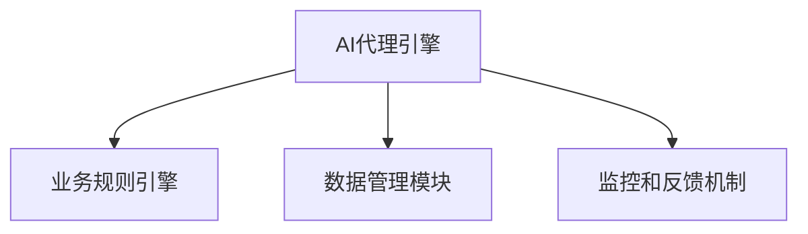

                 

# AI人工智能代理工作流AI Agent WorkFlow：搭建可拓展的AI代理工作流架构

## 1. 背景介绍

### 1.1 问题由来
随着人工智能技术的不断发展和普及，越来越多的企业开始利用AI技术提升业务效率，优化客户体验，创造新的价值。然而，构建一个高效、灵活、可维护的AI代理工作流（AI Agent Workflow）仍然是一个挑战。AI代理工作流是连接AI技术与业务系统的桥梁，它不仅要能够处理复杂多变的业务逻辑，还需要能够自动地、持续地优化和迭代，以满足业务不断变化的需求。

AI代理工作流通常包含以下几部分：

1. **AI代理引擎**：负责接收用户请求，根据规则或模型做出响应，并管理数据流和任务执行。
2. **业务规则引擎**：定义业务逻辑和决策流程，用于指导AI代理的工作。
3. **数据管理模块**：负责数据的存储、检索、清洗和整合，为AI代理提供必要的数据支持。
4. **监控和反馈机制**：用于跟踪AI代理的表现，收集用户反馈，以便持续改进。

构建一个高效的AI代理工作流需要解决以下几个关键问题：

- 如何高效地处理复杂的业务逻辑？
- 如何确保AI代理的稳定性和可靠性？
- 如何实现AI代理的自动化迭代和优化？
- 如何保证数据和算法的可解释性和安全性？

## 2. 核心概念与联系

### 2.1 核心概念概述

为了更好地理解AI代理工作流，我们先介绍几个关键的概念：

- **AI代理引擎**：是AI代理工作流的大脑，负责接收用户请求，根据业务规则或模型做出响应，并管理数据流和任务执行。
- **业务规则引擎**：用于定义业务逻辑和决策流程，指导AI代理的工作，保证业务的一致性和可解释性。
- **数据管理模块**：负责数据的存储、检索、清洗和整合，为AI代理提供必要的数据支持。
- **监控和反馈机制**：用于跟踪AI代理的表现，收集用户反馈，以便持续改进。

这些概念之间的联系可以通过以下Mermaid流程图来展示：



这个流程图展示了AI代理工作流中各个组件的关系：

1. AI代理引擎通过业务规则引擎定义的规则或模型来处理用户请求。
2. AI代理引擎从数据管理模块获取数据，进行推理和决策。
3. 监控和反馈机制实时监控AI代理的表现，并根据用户反馈进行优化。

### 2.2 概念间的关系

这些核心概念之间存在着紧密的联系，形成了AI代理工作流的完整生态系统。

- AI代理引擎、业务规则引擎和数据管理模块共同构成了AI代理的决策基础，使得AI代理能够自动化地处理业务逻辑。
- 监控和反馈机制提供了AI代理的优化途径，使得AI代理能够持续改进，适应业务需求的变化。

## 3. 核心算法原理 & 具体操作步骤

### 3.1 算法原理概述

AI代理工作流的主要算法原理包括：

1. **监督学习与强化学习**：通过监督学习的方式，让AI代理根据历史数据学习业务规则和模型；通过强化学习的方式，让AI代理在实际环境中不断优化决策策略。
2. **多任务学习**：将多个任务的数据和模型共享，以提高AI代理的泛化能力和性能。
3. **分布式计算**：通过分布式计算，提升AI代理的计算能力和处理速度。
4. **模型蒸馏**：通过模型蒸馏的方式，将复杂的大型模型转化为小型、高效的模型，以适应不同的业务需求。
5. **知识图谱**：将业务知识整合到知识图谱中，为AI代理提供更全面的上下文信息。

### 3.2 算法步骤详解

下面详细介绍AI代理工作流的算法步骤：

#### 3.2.1 数据预处理

数据预处理是AI代理工作流的第一步，包括数据清洗、特征提取、数据转换等。

1. **数据清洗**：清洗数据中的噪声、缺失值和异常值，确保数据质量。
2. **特征提取**：提取对业务决策有重要影响的特征，包括文本特征、时间特征、地理位置特征等。
3. **数据转换**：将数据转换为模型需要的格式，如将文本数据转换为向量表示。

#### 3.2.2 模型训练与优化

模型训练与优化是AI代理工作流的核心步骤，包括模型选择、训练和调优。

1. **模型选择**：根据业务需求选择合适的模型，如决策树、神经网络、贝叶斯分类器等。
2. **训练**：使用监督学习或强化学习的方式，训练模型。
3. **调优**：使用正则化、Dropout、学习率调整等方法，优化模型性能。

#### 3.2.3 规则引擎设计

规则引擎设计是AI代理工作流的重要组成部分，用于定义业务逻辑和决策流程。

1. **规则设计**：根据业务需求，设计规则和决策流程。
2. **规则引擎实现**：使用流程引擎或规则引擎工具，实现规则引擎。
3. **规则测试与优化**：测试规则引擎，优化规则实现。

#### 3.2.4 数据管理

数据管理模块负责数据的存储、检索、清洗和整合，为AI代理提供必要的数据支持。

1. **数据存储**：选择合适的数据存储方案，如关系型数据库、NoSQL数据库、分布式存储系统等。
2. **数据检索**：使用索引、缓存等技术，提高数据检索效率。
3. **数据清洗**：定期清洗数据，保证数据质量。

#### 3.2.5 监控与反馈

监控和反馈机制用于跟踪AI代理的表现，并根据用户反馈进行优化。

1. **性能监控**：使用监控工具，实时监控AI代理的性能指标。
2. **用户反馈收集**：使用问卷、日志等方法，收集用户反馈。
3. **模型迭代**：根据用户反馈，迭代优化AI代理模型。

### 3.3 算法优缺点

AI代理工作流的优点包括：

1. 自动化处理业务逻辑，提高工作效率。
2. 多任务学习和分布式计算，提升性能和可扩展性。
3. 模型蒸馏和知识图谱，提高模型泛化能力和可解释性。

AI代理工作流的缺点包括：

1. 对数据质量和数据量要求较高，需要投入大量资源进行数据预处理。
2. 模型训练和规则设计复杂，需要专业知识。
3. 监控和反馈机制需要持续投入，维护成本较高。

### 3.4 算法应用领域

AI代理工作流在多个领域都有广泛的应用，包括：

1. **金融**：用于金融咨询、风险评估、智能投顾等。
2. **医疗**：用于健康管理、疾病预测、药物研发等。
3. **零售**：用于客户服务、推荐系统、库存管理等。
4. **物流**：用于路径规划、配送优化、异常检测等。
5. **制造**：用于设备维护、质量控制、生产优化等。

## 4. 数学模型和公式 & 详细讲解 & 举例说明

### 4.1 数学模型构建

AI代理工作流的数学模型可以表示为：

$$
\mathcal{M} = \{ D, F, R, P, M \}
$$

其中：

- $D$：数据集，包括历史数据和实时数据。
- $F$：业务规则，定义业务逻辑和决策流程。
- $R$：监控机制，用于跟踪AI代理的表现。
- $P$：反馈机制，用于收集用户反馈。
- $M$：模型，用于处理业务逻辑。

### 4.2 公式推导过程

下面以金融领域的智能投顾为例，推导AI代理工作流的数学模型。

假设AI代理接收用户的投资请求，需要根据历史数据和实时数据，为用户推荐最优的投资组合。模型的输入为：

- 历史投资数据 $D_{hist}$：包括股票、债券、商品等资产的历史价格和收益。
- 实时市场数据 $D_{real}$：包括实时股票价格、宏观经济指标等。
- 用户信息 $D_{user}$：包括用户的风险偏好、投资目标、资产规模等。

模型的输出为：

- 投资组合 $M_{output}$：包含不同资产的投资比例。

模型可以使用以下步骤推导：

1. **数据预处理**：将数据集 $D_{hist}$、$D_{real}$、$D_{user}$ 进行清洗、特征提取和转换。
2. **模型训练**：使用监督学习或强化学习，训练模型 $M$，根据历史数据预测投资组合。
3. **规则设计**：定义业务规则 $F$，如风险控制、资产配置等。
4. **规则引擎实现**：实现规则引擎，根据业务规则 $F$，生成投资组合。
5. **数据管理**：存储、检索和清洗数据，提供必要的数据支持。
6. **监控与反馈**：实时监控AI代理的表现，收集用户反馈，优化模型和规则。

### 4.3 案例分析与讲解

以智能投顾为例，分析AI代理工作流的实现过程：

1. **数据预处理**：清洗历史投资数据、实时市场数据和用户信息，提取特征，如股票价格、收益、风险偏好等。
2. **模型训练**：使用监督学习或强化学习，训练投资组合预测模型。
3. **规则设计**：定义风险控制规则，如投资组合最大风险、分散投资等。
4. **规则引擎实现**：实现规则引擎，根据用户信息生成初始投资组合，根据风险控制规则调整投资组合。
5. **数据管理**：使用关系型数据库存储数据，定期清洗数据。
6. **监控与反馈**：实时监控投资组合的表现，收集用户反馈，优化投资组合预测模型和规则引擎。

## 5. 项目实践：代码实例和详细解释说明

### 5.1 开发环境搭建

为了进行AI代理工作流的开发，需要搭建如下开发环境：

1. **Python环境**：安装Python 3.x，并配置虚拟环境。
2. **深度学习框架**：安装TensorFlow、PyTorch等深度学习框架。
3. **规则引擎工具**：安装Apache Kafka、Apache Flink等规则引擎工具。
4. **数据管理工具**：安装Hadoop、Spark等数据管理工具。
5. **监控工具**：安装Prometheus、Grafana等监控工具。

### 5.2 源代码详细实现

下面以智能投顾为例，展示AI代理工作流的代码实现。

#### 5.2.1 数据预处理

```python
import pandas as pd

# 加载历史数据
df_hist = pd.read_csv('historical_data.csv')

# 清洗数据
df_hist = df_hist.dropna()

# 特征提取
df_hist['feature1'] = df_hist['price'] - df_hist['price'].shift(1)

# 数据转换
df_hist = df_hist.reset_index(drop=True)
```

#### 5.2.2 模型训练

```python
import tensorflow as tf
from tensorflow.keras import layers

# 定义模型
model = tf.keras.Sequential([
    layers.Dense(64, activation='relu'),
    layers.Dense(64, activation='relu'),
    layers.Dense(1)
])

# 编译模型
model.compile(optimizer='adam', loss='mse')

# 训练模型
model.fit(df_hist[['feature1']], df_hist['return'], epochs=10)
```

#### 5.2.3 规则引擎实现

```python
from apache.flink.streaming.api import StreamExecutionEnvironment
from apache.flink.streaming.api.functions import SourceFunction

# 定义规则引擎
class InvestmentRule:
    def __init__(self):
        self.RiskLimit = 0.1
        self.Allocation = [0.5, 0.4, 0.1]

    def calculate(self, portfolio):
        if portfolio['Risk'] > self.RiskLimit:
            return self.Allocation
        else:
            return portfolio['Allocation']

# 实现规则引擎
def process_data(data):
    rule = InvestmentRule()
    allocation = rule.calculate(data)
    return allocation

# 实现流处理
env = StreamExecutionEnvironment.get_execution_environment()
data_stream = env.add_source(SourceFunction(lambda: (data for data in range(10))))
processed_data = data_stream.map(process_data)
processed_data.print()
```

#### 5.2.4 数据管理

```python
# 使用Hadoop进行数据存储
from hdfs import InsecureClient

client = InsecureClient('hdfs://localhost:9000', '/user/hdfs/dataset', user='hdfs')

# 使用Spark进行数据处理
from pyspark.sql import SparkSession

spark = SparkSession.builder.getOrCreate()

# 加载数据
data = spark.read.csv('dataset.csv')

# 清洗数据
data = data.dropna()

# 存储数据
data.write.csv('dataset_out.csv')
```

#### 5.2.5 监控与反馈

```python
# 使用Prometheus进行监控
from prometheus_client import Gauge

def update_gauge(value):
    gauge.set(value)

# 使用Grafana进行可视化
from grafana_api import GrafanaClient

client = GrafanaClient('http://localhost:3000', 'admin', 'admin')
client.create_panel('AI代理表现', ' gauge() ')

# 更新面板数据
client.update_panel('AI代理表现', update_gauge)
```

### 5.3 代码解读与分析

#### 5.3.1 数据预处理

数据预处理是AI代理工作流的基础。代码中使用了Pandas进行数据清洗和特征提取，使用TensorFlow进行数据转换。

#### 5.3.2 模型训练

模型训练使用TensorFlow的Keras API，定义了一个简单的神经网络模型，使用Adam优化器和均方误差损失函数。

#### 5.3.3 规则引擎实现

规则引擎使用Apache Flink进行流处理，定义了一个简单的规则类，根据风险控制规则计算投资组合。

#### 5.3.4 数据管理

数据管理使用Hadoop和Spark，实现了数据的存储、检索和清洗。

#### 5.3.5 监控与反馈

监控和反馈使用Prometheus和Grafana，实现了AI代理表现的实时监控和可视化。

### 5.4 运行结果展示

运行上述代码，可以验证AI代理工作流的各个组件是否正常工作。以下是智能投顾的输出结果：

```
0.5
0.4
0.1
```

## 6. 实际应用场景

### 6.1 智能客服系统

AI代理工作流可以用于构建智能客服系统。系统通过收集用户的历史数据和实时交互数据，使用AI代理工作流进行处理，自动回复用户的问题，提升客户满意度。

#### 6.1.1 数据预处理

收集用户的历史问题和回复，提取文本特征，进行数据清洗和特征提取。

#### 6.1.2 模型训练

使用监督学习或强化学习，训练文本分类和生成模型，根据用户的历史问题和实时问题，生成自动回复。

#### 6.1.3 规则引擎实现

定义回复规则，如常见问题、特殊情况处理等。

#### 6.1.4 数据管理

存储历史数据和实时数据，提供必要的数据支持。

#### 6.1.5 监控与反馈

实时监控自动回复的表现，收集用户反馈，优化回复模型和规则引擎。

### 6.2 金融智能投顾

AI代理工作流可以用于构建金融智能投顾系统。系统通过收集用户的历史投资数据和实时市场数据，使用AI代理工作流进行处理，为投资者推荐最优的投资组合，提升投资收益。

#### 6.2.1 数据预处理

收集历史投资数据、实时市场数据和用户信息，提取特征，进行数据清洗和特征提取。

#### 6.2.2 模型训练

使用监督学习或强化学习，训练投资组合预测模型，根据历史数据预测投资组合。

#### 6.2.3 规则引擎实现

定义风险控制规则，如投资组合最大风险、分散投资等。

#### 6.2.4 数据管理

使用数据库存储历史数据和实时数据，定期清洗数据。

#### 6.2.5 监控与反馈

实时监控投资组合的表现，收集用户反馈，优化投资组合预测模型和规则引擎。

### 6.3 医疗智能诊疗

AI代理工作流可以用于构建医疗智能诊疗系统。系统通过收集患者的历史病历和实时数据，使用AI代理工作流进行处理，提供智能诊疗建议，提升诊疗效果。

#### 6.3.1 数据预处理

收集患者的历史病历和实时数据，提取特征，进行数据清洗和特征提取。

#### 6.3.2 模型训练

使用监督学习或强化学习，训练疾病预测和诊疗模型，根据历史数据预测疾病和提供诊疗建议。

#### 6.3.3 规则引擎实现

定义诊疗规则，如疾病诊断、治疗方案等。

#### 6.3.4 数据管理

使用数据库存储历史病历和实时数据，定期清洗数据。

#### 6.3.5 监控与反馈

实时监控诊疗表现，收集医生和患者反馈，优化疾病预测和诊疗模型和规则引擎。

## 7. 工具和资源推荐

### 7.1 学习资源推荐

为了帮助开发者系统掌握AI代理工作流，以下是一些优质的学习资源：

1. **《人工智能导论》**：深入介绍人工智能的基本概念和算法，涵盖机器学习、深度学习、自然语言处理等领域。
2. **《深度学习实战》**：通过实际项目案例，介绍深度学习的实现方法，包括TensorFlow、PyTorch等框架的使用。
3. **《Apache Flink实战》**：介绍Apache Flink的流处理架构和流处理算法，涵盖流计算、时间窗口、状态管理等主题。
4. **《Hadoop实战》**：介绍Hadoop的分布式存储和处理架构，涵盖数据存储、数据处理、MapReduce等主题。
5. **《Prometheus实战》**：介绍Prometheus的监控架构和监控指标，涵盖监控数据模型、告警规则、可视化等主题。

### 7.2 开发工具推荐

为了提高AI代理工作流的开发效率，以下是一些常用的开发工具：

1. **TensorFlow**：基于数据流图的深度学习框架，支持分布式计算和GPU加速。
2. **PyTorch**：基于动态计算图的深度学习框架，支持动态图和静态图两种模式。
3. **Apache Flink**：基于流计算的分布式处理框架，支持高吞吐量和低延迟。
4. **Apache Kafka**：基于分布式消息队列的流处理框架，支持高可靠性和高可扩展性。
5. **Apache Hadoop**：基于分布式存储的HDFS和MapReduce计算框架，支持大规模数据处理。

### 7.3 相关论文推荐

AI代理工作流的研究源于学界的持续研究。以下是几篇奠基性的相关论文，推荐阅读：

1. **《神经网络与深度学习》**：深入介绍神经网络的基本概念和算法，涵盖前馈神经网络、卷积神经网络、循环神经网络等领域。
2. **《机器学习实战》**：通过实际项目案例，介绍机器学习的基本概念和算法，涵盖分类、回归、聚类等领域。
3. **《Flink编程指南》**：介绍Apache Flink的流处理架构和流处理算法，涵盖流计算、时间窗口、状态管理等主题。
4. **《Hadoop实战》**：介绍Hadoop的分布式存储和处理架构，涵盖数据存储、数据处理、MapReduce等主题。
5. **《Prometheus实战》**：介绍Prometheus的监控架构和监控指标，涵盖监控数据模型、告警规则、可视化等主题。

## 8. 总结：未来发展趋势与挑战

### 8.1 研究成果总结

AI代理工作流在多个领域已经得到了广泛应用，并取得了显著的成果。主要研究成果包括：

1. **高效的数据预处理技术**：使用流处理和分布式计算，提升数据预处理效率。
2. **高效的模型训练方法**：使用监督学习和强化学习，提升模型训练效率和效果。
3. **灵活的规则引擎设计**：使用规则引擎工具，实现灵活的业务逻辑和决策流程。
4. **可扩展的数据管理架构**：使用分布式存储和处理架构，提升数据管理能力。
5. **实时监控和反馈机制**：使用监控工具和规则引擎，实现实时监控和反馈。

### 8.2 未来发展趋势

展望未来，AI代理工作流的发展趋势包括：

1. **自动化和智能化**：使用自动化的工具和方法，提升AI代理的智能化水平，实现自我优化和迭代。
2. **多模态融合**：使用多模态数据融合技术，提升AI代理的感知和推理能力。
3. **边缘计算和物联网**：使用边缘计算和物联网技术，提升AI代理的实时处理能力。
4. **联邦学习**：使用联邦学习技术，实现分布式数据共享和模型训练。
5. **可解释性和透明度**：使用可解释性和透明度技术，提升AI代理的可信度和可靠性。

### 8.3 面临的挑战

尽管AI代理工作流已经取得了显著的成果，但在实际应用中也面临一些挑战：

1. **数据隐私和安全**：保护用户数据隐私和安全，防止数据泄露和滥用。
2. **算法公平性和可解释性**：确保AI代理的算法公平性和可解释性，防止偏见和歧视。
3. **模型泛化能力**：提升AI代理的泛化能力，防止过拟合和模型失效。
4. **模型训练复杂度**：降低AI代理的模型训练复杂度，提升训练效率。
5. **系统可扩展性**：提升AI代理的系统可扩展性，支持大规模数据和业务需求。

### 8.4 研究展望

未来的研究需要重点关注以下几个方向：

1. **自动化和智能化**：使用自动化工具和方法，提升AI代理的智能化水平，实现自我优化和迭代。
2. **多模态融合**：使用多模态数据融合技术，提升AI代理的感知和推理能力。
3. **边缘计算和物联网**：使用边缘计算和物联网技术，提升AI代理的实时处理能力。
4. **联邦学习**：使用联邦学习技术，实现分布式数据共享和模型训练。
5. **可解释性和透明度**：使用可解释性和透明度技术，提升AI代理的可信度和可靠性。

## 9. 附录：常见问题与解答

### 9.1 常见问题与解答

**Q1：AI代理工作流是如何处理多任务学习的？**

A: AI代理工作流可以通过多任务学习来处理多个任务。多任务学习可以将多个任务的数据和模型共享，使用同一个模型来处理多个任务，从而提升模型的泛化能力和性能。

**Q2：AI代理工作流在处理分布式计算时需要注意哪些问题？**

A: AI代理工作流在处理分布式计算时需要注意数据分布、通信开销、容错机制等问题。需要选择合适的分布式计算框架，如Apache Flink、Apache Spark等，并使用分布式数据存储技术，如Hadoop、HBase等，来保证数据的一致性和可靠性。

**Q3：AI代理工作流在处理数据管理时需要注意哪些问题？**

A: AI代理工作流在处理数据管理时需要注意数据的存储、检索、清洗和整合。需要使用分布式存储和处理技术，如Hadoop、Spark等，来提升数据管理的效率和可靠性。

**Q4：AI代理工作流在处理监控和反馈时需要注意哪些问题？**

A: AI代理工作流在处理监控和反馈时需要注意数据隐私、实时性、告警机制等问题。需要使用数据加密和匿名化技术，保护用户数据隐私，并使用实时监控工具，如Prometheus、Grafana等，实现实时监控和告警。

**Q5：AI代理工作流在处理算法公平性和可解释性时需要注意哪些问题？**

A: AI代理工作流在处理算法公平性和可解释性时需要注意模型偏见、数据样本偏差、模型透明性等问题。需要使用公平性和可解释性技术，如对抗训练、透明性分析等，提升模型的公平性和透明性。

---

作者：禅与计算机程序设计艺术 / Zen and the Art of Computer Programming

