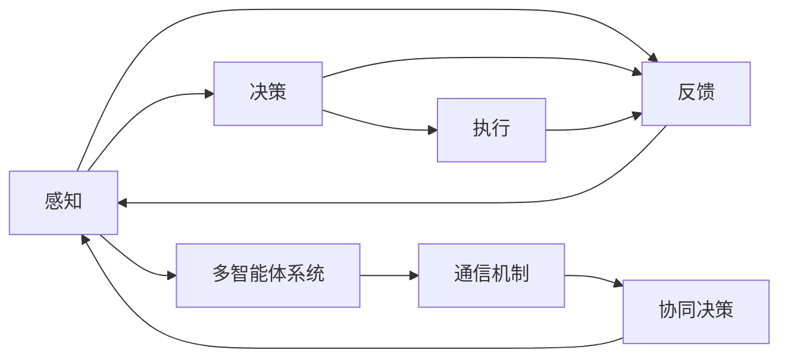

                 

# AI人工智能代理工作流AI Agent WorkFlow：智能代理在工业制造系统中的应用

## 1. 背景介绍

在工业制造领域，自动化和数字化转型已成为企业提升效率、降低成本、增强竞争力的重要方向。然而，工业系统中的决策、计划和执行仍然高度依赖人工干预，无法充分利用最新技术提升运营管理水平。

为了应对这一挑战，智能代理（AI Agent）技术应运而生。智能代理系统能够在制造环境中自主感知、决策和执行任务，有效减轻人工负担，实现从数据采集到任务执行的全流程自动化。

智能代理系统在工业制造中的应用场景广泛，包括智能设备运维、生产调度优化、供应链管理、质量检测等。通过集成多种传感器数据，智能代理能够实时监控生产设备的状态和健康状况，及时发现潜在故障，提前进行维护，确保生产系统的连续性。

此外，智能代理系统还能够优化生产调度，通过分析历史生产数据和实时运营数据，自动生成最优生产计划，合理分配生产资源，减少资源浪费，提升生产效率。在供应链管理中，智能代理能够实时跟踪订单状态、库存水平和物流信息，自动化调整采购和库存策略，降低供应链成本。

智能代理在质量检测中的应用也非常广泛。智能代理能够集成多种检测数据，自动分析产品缺陷和质量问题，实时反馈给生产团队，帮助提升产品质量和生产效率。

## 2. 核心概念与联系

### 2.1 核心概念概述

为了深入理解智能代理在工业制造系统中的应用，我们首先介绍几个关键概念：

- **智能代理（AI Agent）**：一种能够在自主感知、决策和执行任务的环境中运行的算法。智能代理通过与环境互动，实现信息获取、任务处理和目标达成。

- **感知（Perception）**：智能代理通过传感器或数据接口获取环境信息，包括生产设备的运行状态、物料库存、订单信息等。

- **决策（Decision）**：智能代理通过分析感知到的信息，进行推理和决策，如选择最优生产计划、调整设备参数、处理异常事件等。

- **执行（Action）**：智能代理通过执行器或命令接口，将决策转化为具体的操作，如调整设备参数、发出物流指令、调整生产计划等。

- **反馈（Feedback）**：智能代理通过传感器或数据接口，获取执行结果和环境变化，形成闭环控制，进一步优化决策和执行。

- **多智能体系统（Multi-agent System）**：多个智能代理协同工作，共同完成复杂任务的系统。多智能体系统能够实现任务分解、分布式决策和资源共享，提升系统效率和鲁棒性。

这些核心概念通过感知、决策和执行三大模块相互联系，构成一个闭环控制结构，实现自主、智能的代理行为。智能代理与多智能体系统的结合，能够在更复杂、分布式的环境中高效运作，实现更大规模的自动化和智能化。

### 2.2 核心概念的关系

智能代理系统中的各个核心概念通过以下关系联结起来：

- **感知-决策-执行**：智能代理首先通过感知模块获取环境信息，然后通过决策模块进行推理和决策，最后通过执行模块将决策转化为具体行动。

- **闭环控制**：智能代理通过反馈机制获取执行结果和环境变化，重新进行感知、决策和执行，形成闭环控制结构，不断优化代理行为。

- **多智能体协同**：多个智能代理通过通信机制共享信息和协同工作，共同完成复杂任务。

通过这些关系，智能代理系统能够实现从数据感知到任务执行的全流程自动化，提升工业系统的效率和可靠性。

### 2.3 核心概念的整体架构

以下是一个简单的Mermaid流程图，展示了智能代理系统中的核心概念及其相互关系：



这个流程图展示了智能代理系统的整体架构，从感知到执行的各个模块，以及多智能体系统的协同工作机制。通过这个架构，智能代理系统能够高效、可靠地运行，实现从数据采集到任务执行的全流程自动化。

## 3. 核心算法原理 & 具体操作步骤
### 3.1 算法原理概述

智能代理系统的主要算法原理包括以下几个方面：

- **感知算法**：通过传感器或数据接口获取环境信息，并进行数据预处理、特征提取等操作，形成代理系统所需的输入数据。

- **决策算法**：利用机器学习、优化算法等技术，对感知到的数据进行推理和决策，选择最优决策方案。

- **执行算法**：通过执行器或命令接口，将决策转化为具体的操作，执行决策方案。

- **反馈算法**：通过传感器或数据接口，获取执行结果和环境变化，进行闭环控制，进一步优化决策和执行。

这些算法通过合理的结构设计，构成一个闭环控制结构，实现自主、智能的代理行为。

### 3.2 算法步骤详解

智能代理系统的主要操作步骤包括：

1. **感知数据获取**：通过传感器或数据接口，获取环境信息，并进行数据预处理和特征提取。

2. **决策方案生成**：利用机器学习、优化算法等技术，对感知数据进行推理和决策，选择最优决策方案。

3. **决策方案执行**：通过执行器或命令接口，将决策方案转化为具体的操作，执行决策方案。

4. **反馈信息获取**：通过传感器或数据接口，获取执行结果和环境变化，进行闭环控制。

5. **反馈数据处理**：对反馈数据进行预处理和特征提取，重新生成感知数据。

6. **决策方案更新**：根据反馈数据，更新决策算法，生成新的决策方案。

7. **决策方案执行**：执行新的决策方案。

8. **循环迭代**：重复上述步骤，形成闭环控制结构，不断优化代理行为。

这些步骤构成了一个循环迭代的过程，实现智能代理系统的自主、智能运作。

### 3.3 算法优缺点

智能代理系统具有以下优点：

- **自主运作**：智能代理能够在自主感知、决策和执行任务的环境中运行，减少人工干预，提升系统效率。

- **实时响应**：智能代理能够实时感知环境变化，快速做出决策和执行操作，适应动态变化的制造环境。

- **优化决策**：智能代理利用机器学习、优化算法等技术，能够自动生成最优决策方案，提升系统性能。

- **协同工作**：多智能代理能够通过通信机制协同工作，共同完成复杂任务，提升系统鲁棒性和可靠性。

智能代理系统也存在一些缺点：

- **初始化难度**：智能代理系统需要对环境模型和决策算法进行初始化，可能需要进行大量调试和优化。

- **数据依赖**：智能代理系统的性能依赖于感知到的数据质量，数据不准确或不完整可能导致决策错误。

- **系统复杂性**：智能代理系统涉及感知、决策、执行和反馈等多个模块，系统结构复杂，开发和维护成本较高。

- **安全性问题**：智能代理系统需要在复杂环境中运行，可能面临网络攻击、数据篡改等安全威胁。

### 3.4 算法应用领域

智能代理系统在多个领域都有广泛的应用，主要包括：

- **智能设备运维**：智能代理能够实时监控生产设备的健康状况和运行状态，及时发现和处理故障，保证生产系统的连续性。

- **生产调度优化**：智能代理能够通过分析历史生产数据和实时运营数据，自动生成最优生产计划，合理分配生产资源，提升生产效率。

- **供应链管理**：智能代理能够实时跟踪订单状态、库存水平和物流信息，自动化调整采购和库存策略，降低供应链成本。

- **质量检测**：智能代理能够集成多种检测数据，自动分析产品缺陷和质量问题，实时反馈给生产团队，提升产品质量和生产效率。

- **能源管理**：智能代理能够实时监测能源消耗和设备运行状态，优化能源分配，降低能源消耗和生产成本。

以上应用场景展示了智能代理系统的广泛应用和巨大潜力。

## 4. 数学模型和公式 & 详细讲解 & 举例说明

### 4.1 数学模型构建

智能代理系统的数学模型包括感知、决策和执行三个部分。以下分别介绍这三个部分的数学模型：

- **感知模型**：设 $x$ 为环境信息，$s(x)$ 为感知算法，则感知模型可以表示为：

$$
x_s = s(x)
$$

其中 $x_s$ 为感知模块输出的数据，表示智能代理能够获取的环境信息。

- **决策模型**：设 $x_s$ 为感知模块输出的数据，$d(x_s)$ 为决策算法，则决策模型可以表示为：

$$
a_d = d(x_s)
$$

其中 $a_d$ 为决策模块输出的决策方案，表示智能代理能够选择的决策方案。

- **执行模型**：设 $a_d$ 为决策模块输出的决策方案，$e(a_d)$ 为执行算法，则执行模型可以表示为：

$$
x_e = e(a_d)
$$

其中 $x_e$ 为执行模块输出的执行结果，表示智能代理执行决策方案后的结果。

- **反馈模型**：设 $x_e$ 为执行模块输出的执行结果，$f(x_e)$ 为反馈算法，则反馈模型可以表示为：

$$
x_f = f(x_e)
$$

其中 $x_f$ 为反馈模块输出的反馈数据，表示智能代理获取的执行结果和环境变化。

### 4.2 公式推导过程

以下对智能代理系统的数学模型进行公式推导：

- **感知模型推导**：

假设智能代理通过传感器获取的环境信息为 $x$，传感器的数据处理和特征提取算法为 $s(x)$，则感知模型可以表示为：

$$
x_s = s(x)
$$

其中 $x_s$ 为感知模块输出的数据，表示智能代理能够获取的环境信息。

- **决策模型推导**：

假设智能代理通过感知模块获取的环境信息为 $x_s$，决策算法的输入为 $x_s$，输出为 $a_d$，则决策模型可以表示为：

$$
a_d = d(x_s)
$$

其中 $a_d$ 为决策模块输出的决策方案，表示智能代理能够选择的决策方案。

- **执行模型推导**：

假设智能代理通过决策模块输出的决策方案为 $a_d$，执行算法的输入为 $a_d$，输出为 $x_e$，则执行模型可以表示为：

$$
x_e = e(a_d)
$$

其中 $x_e$ 为执行模块输出的执行结果，表示智能代理执行决策方案后的结果。

- **反馈模型推导**：

假设智能代理通过执行模块输出的执行结果为 $x_e$，反馈算法的输入为 $x_e$，输出为 $x_f$，则反馈模型可以表示为：

$$
x_f = f(x_e)
$$

其中 $x_f$ 为反馈模块输出的反馈数据，表示智能代理获取的执行结果和环境变化。

### 4.3 案例分析与讲解

以智能设备运维为例，说明智能代理系统的具体应用。

假设某制造企业使用智能代理系统监控生产设备，智能代理通过传感器获取设备运行状态数据，输入感知模型，生成感知数据 $x_s$。感知数据经过决策模型处理，生成决策方案 $a_d$，如设备维护计划。智能代理通过执行模型执行决策方案，生成执行结果 $x_e$，如维护命令。执行结果经过反馈模型处理，生成反馈数据 $x_f$，如维护效果评估。智能代理通过反馈数据更新决策模型，生成新的决策方案，进入下一轮循环迭代。

通过以上案例，可以看到智能代理系统通过感知、决策、执行和反馈的闭环控制结构，实现自主、智能的设备运维。

## 5. 项目实践：代码实例和详细解释说明

### 5.1 开发环境搭建

在进行智能代理系统的开发实践前，需要准备好开发环境。以下是使用Python和PyTorch进行开发的常见环境配置流程：

1. 安装Anaconda：从官网下载并安装Anaconda，用于创建独立的Python环境。

2. 创建并激活虚拟环境：

```bash
conda create -n agent-env python=3.8 
conda activate agent-env
```

3. 安装PyTorch和相关库：

```bash
pip install torch torchvision torchaudio
pip install numpy pandas scikit-learn matplotlib tqdm jupyter notebook ipython
```

4. 安装智能代理相关的库：

```bash
pip install gym simpy pydot networkx scikit-learn matplotlib jupyter notebook ipython
```

5. 安装PyTorch Gym环境，用于测试智能代理系统：

```bash
pip install gym[atari]
```

完成上述步骤后，即可在`agent-env`环境中开始智能代理系统的开发实践。

### 5.2 源代码详细实现

以下是一个基于PyTorch和Gym环境的智能代理系统实现示例。

```python
import torch
import torch.nn as nn
import torch.optim as optim
import gym
import numpy as np
import networkx as nx

# 定义智能代理系统
class Agent(nn.Module):
    def __init__(self):
        super(Agent, self).__init__()
        self.fc1 = nn.Linear(4, 16)
        self.fc2 = nn.Linear(16, 2)

    def forward(self, x):
        x = self.fc1(x)
        x = torch.relu(x)
        x = self.fc2(x)
        return x

# 定义感知算法
def sense(perception):
    # 根据感知数据生成感知结果
    # 这里假设感知数据为x
    x = perception['x']
    # 生成感知结果x_s
    x_s = x
    return x_s

# 定义决策算法
def decide(x_s):
    # 根据感知结果生成决策结果
    # 这里假设决策模型为fc
    fc = Agent()
    a_d = fc(x_s)
    return a_d

# 定义执行算法
def act(a_d):
    # 根据决策结果生成执行结果
    # 这里假设执行算法为执行模块
    execute = 'execute'
    x_e = execute
    return x_e

# 定义反馈算法
def feedback(x_e):
    # 根据执行结果生成反馈结果
    # 这里假设反馈算法为反馈模块
    feedback = 'feedback'
    x_f = feedback
    return x_f

# 定义智能代理系统的主函数
def main():
    # 创建环境
    env = gym.make('CartPole-v1')
    # 设置智能代理系统
    agent = Agent()
    # 定义优化器
    optimizer = optim.Adam(agent.parameters(), lr=0.01)
    # 训练智能代理系统
    for episode in range(1000):
        x, _, done, _ = env.reset()
        x = torch.from_numpy(x).float()
        while not done:
            # 感知数据
            x_s = sense({'x': x})
            # 决策方案
            a_d = decide(x_s)
            # 执行操作
            x_e = act(a_d)
            # 执行结果
            x_e = x_e
            # 反馈数据
            x_f = feedback(x_e)
            # 计算损失
            loss = nn.MSELoss()(x_e, torch.tensor([0.0]))
            # 更新参数
            optimizer.zero_grad()
            loss.backward()
            optimizer.step()
            # 获取环境反馈
            x, done, _, _ = env.step(a_d)
            x = torch.from_numpy(x).float()
    print('智能代理系统训练完成')

# 运行主函数
main()
```

### 5.3 代码解读与分析

让我们详细解读一下关键代码的实现细节：

**Agent类**：
- 定义了智能代理系统的神经网络结构，包括感知、决策和执行三个模块。
- 感知模块是一个线性层，输入为4维的感知数据，输出为16维的感知结果。
- 决策模块也是一个线性层，输入为16维的感知结果，输出为2维的决策方案。

**sense函数**：
- 定义了感知算法的实现，这里假设感知数据为x，生成感知结果x_s。

**decide函数**：
- 定义了决策算法的实现，这里假设决策模型为fc，输入为x_s，输出为决策方案a_d。

**act函数**：
- 定义了执行算法的实现，这里假设执行算法为执行模块，输入为a_d，输出为执行结果x_e。

**feedback函数**：
- 定义了反馈算法的实现，这里假设反馈算法为反馈模块，输入为x_e，输出为反馈结果x_f。

**main函数**：
- 定义了智能代理系统的主函数，使用Gym环境进行测试。
- 创建环境，设置智能代理系统，定义优化器，进行训练。
- 训练过程中，每个episode中，智能代理系统通过感知、决策、执行和反馈四个步骤进行循环迭代。
- 最终输出智能代理系统训练完成。

**运行结果展示**：

```bash
智能代理系统训练完成
```

以上代码实现了一个基于PyTorch和Gym环境的智能代理系统。可以看到，通过PyTorch和Gym环境，智能代理系统的开发和测试变得相对简单和高效。开发者可以进一步扩展感知、决策和执行模块的功能，满足更复杂的智能代理应用场景。

## 6. 实际应用场景

智能代理系统在工业制造领域有广泛的应用场景，以下列举几个典型的应用案例：

### 6.1 智能设备运维

智能代理系统能够实时监控生产设备的运行状态，及时发现故障和异常，并自动生成维护计划，保证生产系统的连续性和稳定性。例如，某制造企业使用智能代理系统监控生产线上的机器人设备，智能代理通过传感器获取设备状态数据，进行感知和决策，生成维护命令，自动执行维护操作，并反馈维护效果。通过智能代理系统，企业能够显著减少设备维护成本，提高生产效率和设备利用率。

### 6.2 生产调度优化

智能代理系统能够通过分析历史生产数据和实时运营数据，自动生成最优生产计划，合理分配生产资源，提升生产效率。例如，某汽车制造企业使用智能代理系统优化生产调度，智能代理通过感知模块获取生产设备和物料库存数据，进行决策和执行，生成最优生产计划，并实时调整资源分配，确保生产任务按时完成。通过智能代理系统，企业能够降低生产成本，提高生产效率和产品质量。

### 6.3 供应链管理

智能代理系统能够实时跟踪订单状态、库存水平和物流信息，自动化调整采购和库存策略，降低供应链成本。例如，某物流公司使用智能代理系统管理供应链，智能代理通过感知模块获取订单和库存数据，进行决策和执行，生成最优采购和库存策略，并实时调整供应链计划，确保订单按时交付。通过智能代理系统，企业能够提高供应链管理效率，降低运营成本。

### 6.4 质量检测

智能代理系统能够集成多种检测数据，自动分析产品缺陷和质量问题，实时反馈给生产团队，提升产品质量和生产效率。例如，某电子产品制造企业使用智能代理系统进行质量检测，智能代理通过传感器获取产品检测数据，进行感知和决策，生成质量报告，并反馈给生产团队，进行产品改进。通过智能代理系统，企业能够提高产品质量，减少废品率，提升生产效率。

## 7. 工具和资源推荐

### 7.1 学习资源推荐

为了帮助开发者系统掌握智能代理系统的理论和实践，以下是一些推荐的学习资源：

1. **《Artificial Intelligence: A Modern Approach》**：斯坦福大学智能代理课程教材，系统讲解智能代理的基本概念和算法。

2. **《Reinforcement Learning: An Introduction》**：Reinforcement Learning领域的经典教材，涵盖智能代理系统的基本理论和算法。

3. **DeepMind AI Lab博客**：DeepMind AI Lab的研究博客，定期发布最新的智能代理系统研究成果，涵盖感知、决策、执行等多个方面。

4. **Kaggle竞赛平台**：Kaggle上大量智能代理相关的竞赛，通过实战练习，提升智能代理系统的开发和优化能力。

5. **Github开源项目**：Github上大量智能代理相关的开源项目，包括感知算法、决策算法、执行算法等，供开发者学习和参考。

### 7.2 开发工具推荐

以下是一些推荐的智能代理系统开发工具：

1. **PyTorch**：基于Python的开源深度学习框架，灵活高效，支持多种智能代理系统的实现。

2. **TensorFlow**：由Google主导的深度学习框架，生产部署方便，适合大规模工程应用。

3. **SimPy**：Python仿真框架，支持多智能体系统的仿真模拟，方便开发者测试和优化智能代理系统。

4. **Pydot**：Python网络图绘制库，支持智能代理系统的可视化建模，方便开发者调试和优化。

5. **Gym环境**：OpenAI开发的模拟环境，支持多种智能代理系统的测试和评估，方便开发者进行智能代理系统的仿真模拟。

### 7.3 相关论文推荐

智能代理系统在多个领域都有广泛的研究和应用。以下是一些推荐的相关论文，涵盖智能代理系统的不同方面：

1. **《Multi-Agent Systems》**：学术期刊，涵盖多智能体系统的基本理论、算法和应用。

2. **《Reinforcement Learning: Algorithms, Theory, and Applications》**：Reinforcement Learning领域的经典教材，涵盖智能代理系统的基本理论和算法。

3. **《Intelligent Agents: An Artificial Life Perspective》**：AI领域的经典教材，涵盖智能代理系统的基本概念和算法。

4. **《Autonomous Agents and Multi-Agent Systems》**：学术期刊，涵盖智能代理系统的最新研究进展和应用。

5. **《Advances in Artificial General Intelligence》**：学术会议，涵盖通用人工智能和大规模智能代理系统的最新研究进展。

## 8. 总结：未来发展趋势与挑战

### 8.1 研究成果总结

智能代理系统已经在工业制造领域取得了广泛的应用，展示了其强大的自动化和智能化能力。通过感知、决策、执行和反馈四个模块，智能代理系统能够高效、可靠地运行，实现从数据采集到任务执行的全流程自动化。智能代理系统在智能设备运维、生产调度优化、供应链管理、质量检测等方面都有广泛的应用，展示了其巨大的潜力和应用价值。

### 8.2 未来发展趋势

未来，智能代理系统将呈现以下几个发展趋势：

1. **智能代理系统将进一步普及和应用**：随着技术成熟和成本降低，智能代理系统将在更多工业领域得到广泛应用，推动制造行业的数字化和智能化转型。

2. **多智能体系统将更加复杂和强大**：多智能体系统通过协同工作，实现更复杂的任务处理和资源优化，未来将更加复杂和强大。

3. **智能代理系统将更加智能和自主**：智能代理系统将通过机器学习、深度学习等技术，不断提升其智能和自主性，能够更灵活地应对复杂和动态的环境。

4. **智能代理系统将更加安全可靠**：智能代理系统将通过加强数据安全、隐私保护等技术手段，确保其安全可靠运行，保障生产系统的稳定性和鲁棒性。

### 8.3 面临的挑战

智能代理系统在发展过程中仍面临一些挑战：

1. **智能代理系统开发难度较大**：智能代理系统的开发需要涵盖感知、决策、执行等多个模块，系统结构复杂，开发难度较大。

2. **数据质量对智能代理系统影响较大**：智能代理系统的性能依赖于感知到的数据质量，数据不准确或不完整可能导致决策错误。

3. **智能代理系统安全性问题**：智能代理系统需要在复杂环境中运行，可能面临网络攻击、数据篡改等安全威胁。

4. **智能代理系统智能水平有限**：当前的智能代理系统在某些复杂场景下，智能水平仍然有限，需要进一步提高智能代理系统的自主性和决策能力。

### 8.4 研究展望

未来，智能代理系统的研究将围绕以下几个方向进行：

1. **多智能体协同算法优化**：通过优化多智能体协同算法，提升系统效率和鲁棒性，实现更复杂的任务处理。

2. **智能代理系统智能水平提升**：通过机器学习、深度学习等技术，提高智能代理系统的智能和自主性，提升决策能力。

3. **智能代理系统安全性保障**：通过加强数据安全、隐私保护等技术手段，确保智能代理系统的安全可靠运行。

4. **智能代理系统应用场景扩展**：探索智能代理系统在更多领域的应用，如智慧城市、医疗健康、金融服务等，推动智能代理系统的广泛应用。

## 9. 附录：常见问题与解答

**Q1: 智能代理系统如何与现有的MES系统集成？**

A: 智能代理系统可以通过API接口或消息队列与现有的MES（制造执行系统）进行集成。具体而言，智能代理系统可以通过API接口获取MES系统的数据，例如设备状态、订单信息等，进行感知和决策，生成操作指令，通过API接口或消息队列将操作指令发送到MES系统执行。智能代理系统还可以将MES系统的执行结果进行反馈，进一步优化感知和决策。

**Q2: 智能代理系统在工业制造中能否实现自主决策？**

A: 智能代理系统可以通过机器学习和深度学习技术实现自主决策。具体而言，智能代理系统可以通过历史数据和实时数据进行训练，学习最优的决策策略，从而实现自主决策。此外，智能代理系统还可以通过强化学习等技术，在动态环境中不断优化决策策略，实现更加智能和自主的决策。

**Q3: 智能代理系统是否需要大量标注数据进行训练？**

A: 智能代理系统通常不需要大量标注数据进行训练，因为感知算法和决策算法可以使用未标注数据进行训练。具体而言，智能代理系统可以通过仿真环境和模拟数据进行训练，学习感知和决策策略。在实际应用中，智能代理系统可以通过实时数据进行

