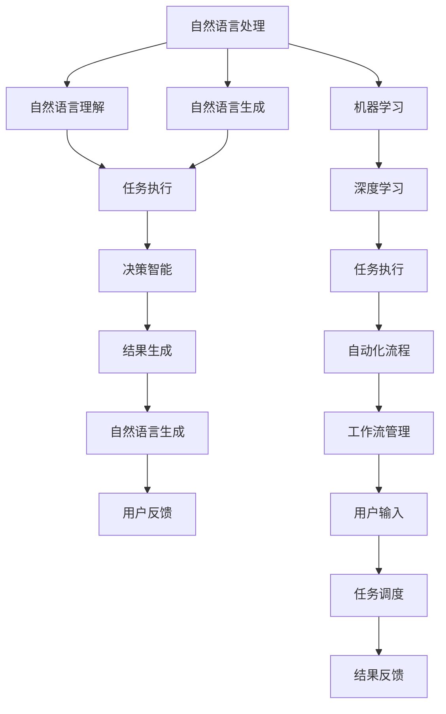
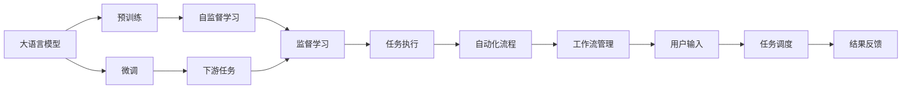
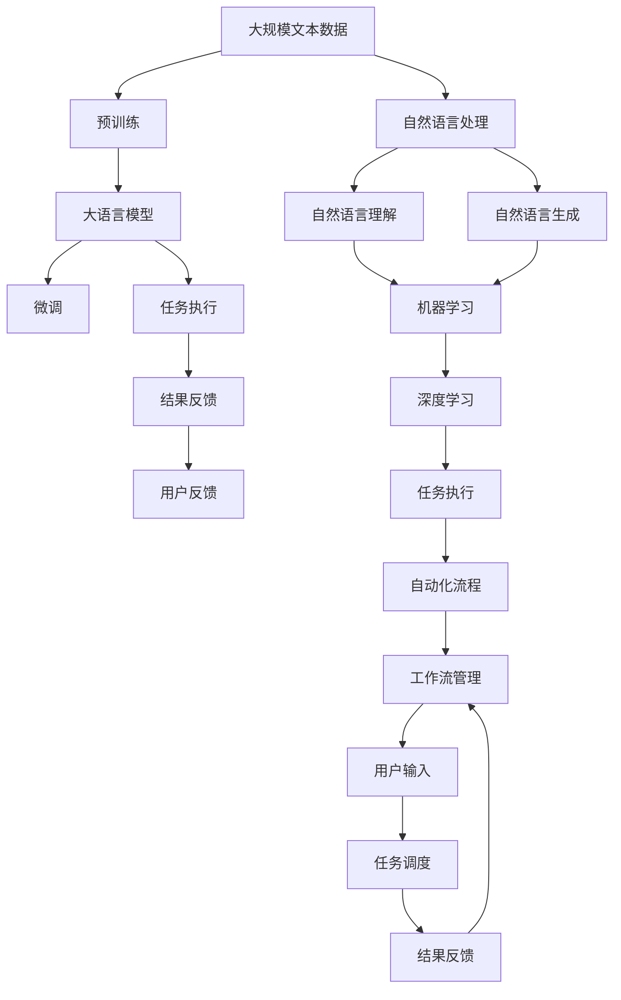

                 

# AI人工智能代理工作流AI Agent WorkFlow：构建高效AI代理的基础

> 关键词：AI代理,工作流,自然语言处理(NLP),机器学习,深度学习,自动化流程,自动化,自然语言理解,任务执行,决策智能

## 1. 背景介绍

### 1.1 问题由来

随着人工智能技术的发展，越来越多的企业开始将AI代理应用于日常工作流程中。AI代理可以通过自然语言理解(NLU)和自然语言生成(NLG)技术与用户进行互动，执行各种自动化任务，从而极大地提升工作效率和用户体验。

然而，构建一个高效的AI代理并非易事。从用户输入的处理到任务执行的调度，再到结果的生成和反馈，每个环节都需要精心设计和优化。而且，不同的任务场景和业务需求对AI代理的要求也不尽相同。如何构建一个既高效又灵活的AI代理，成为许多企业面临的挑战。

### 1.2 问题核心关键点

构建高效AI代理的核心关键点在于：

- 用户输入的自然语言理解：如何准确地理解用户的意图和需求。
- 任务执行的自动化流程：如何将用户的意图映射到具体的任务执行步骤。
- 执行结果的自然语言生成：如何将执行结果转换为易于理解和互动的自然语言。
- 系统的可扩展性和灵活性：如何在不变更核心代码的情况下，快速添加新的任务和业务场景。
- 系统的鲁棒性和可靠性：如何保证系统在各种异常情况下仍能正常运行。

### 1.3 问题研究意义

构建高效AI代理，对于提升企业自动化水平、优化业务流程、降低人力成本、提高用户体验具有重要意义：

1. 提升效率：AI代理可以自动化处理大量重复性工作，大幅度提升工作效率。
2. 降低成本：减少人工干预和出错率，降低企业的运营成本。
3. 优化流程：通过智能决策和自动化流程，优化业务流程，提高业务质量。
4. 提高体验：AI代理可以提供24/7服务，实时响应用户需求，提升用户体验。
5. 提供支持：为业务场景提供技术支持，推动业务创新。

本文将详细探讨如何构建一个高效AI代理，涵盖其核心概念、算法原理、操作步骤以及实际应用场景，为开发高效AI代理提供全面的指导。

## 2. 核心概念与联系

### 2.1 核心概念概述

为了更好地理解构建高效AI代理的工作流程，本节将介绍几个密切相关的核心概念：

- **自然语言处理(NLP)**：涉及文本数据的收集、清洗、预处理、理解、生成等技术和方法。NLP是大语言模型和AI代理的核心技术之一。
- **机器学习(ML)**：通过数据训练模型，使其能够从数据中学习规律，进行预测和决策。
- **深度学习(DL)**：一种特殊的机器学习方法，利用神经网络模型对数据进行高层次抽象和处理。
- **工作流(Workflow)**：一系列步骤和任务的有序组合，用于实现特定目标。
- **自动化流程(Automation)**：通过软件工具自动执行一系列任务和决策，实现业务自动化。
- **自然语言理解(NLU)**：理解自然语言文本的含义，识别出其中的实体、关系、情感等。
- **自然语言生成(NLG)**：将结构化数据转换为自然语言文本，用于表达和交流。

这些核心概念之间的逻辑关系可以通过以下Mermaid流程图来展示：



这个流程图展示了大语言模型和AI代理的关键组件及其相互关系：

1. **自然语言处理**：处理和分析自然语言文本，是NLU和NLG的基础。
2. **自然语言理解(NLU)**：理解用户输入的自然语言，提取其中的有用信息。
3. **任务执行**：将用户的意图映射到具体的任务，执行相应的操作。
4. **决策智能**：基于用户需求和任务执行结果，进行智能决策。
5. **结果生成**：将执行结果转换为自然语言，反馈给用户。
6. **用户反馈**：用户对反馈结果的评价和意见，用于进一步优化模型。
7. **机器学习**：用于训练和优化NLU、NLG和任务执行的模型。
8. **深度学习**：通过神经网络模型，提升模型的预测和决策能力。
9. **自动化流程**：基于任务执行的逻辑，构建自动化工作流。
10. **工作流管理**：管理自动化流程的执行，确保流程的顺畅和稳定。
11. **用户输入**：用户通过自然语言输入信息，启动AI代理。
12. **任务调度**：根据用户需求，调度相应的任务执行。
13. **结果反馈**：将执行结果反馈给用户，完成一个闭环的工作流程。

这些核心概念共同构成了高效AI代理的完整生态系统，使其能够高效地处理各种任务场景。通过理解这些核心概念，我们可以更好地把握构建高效AI代理的工作流程和关键技术点。

### 2.2 概念间的关系

这些核心概念之间存在着紧密的联系，形成了高效AI代理的整体架构。下面我们用几个Mermaid流程图来展示这些概念之间的关系：

#### 2.2.1 大语言模型的学习范式



这个流程图展示了从预训练到微调，再到任务执行的完整过程。大语言模型首先在大规模文本数据上进行预训练，然后通过微调适应特定任务，最后执行自动化流程，完成一个完整的工作流。

#### 2.2.2 机器学习与深度学习的关系


这个流程图展示了机器学习与深度学习在构建高效AI代理中的关系。深度学习通过神经网络模型提升自然语言理解与生成的精度，机器学习则用于训练和优化模型，确保模型的泛化能力和稳定性。

#### 2.2.3 工作流与自动化流程的联系


这个流程图展示了工作流与自动化流程的联系。工作流管理负责调度任务的执行，自动化流程负责执行具体的任务操作，最终将结果反馈给用户，完成一个闭环的工作流。

### 2.3 核心概念的整体架构

最后，我们用一个综合的流程图来展示这些核心概念在大语言模型和AI代理中的整体架构：



这个综合流程图展示了从预训练到微调，再到任务执行的完整过程。大语言模型首先在大规模文本数据上进行预训练，然后通过微调适应特定任务，最后执行自动化流程，完成一个完整的工作流。同时，工作流管理调度任务的执行，确保流程的顺畅和稳定。

## 3. 核心算法原理 & 具体操作步骤
### 3.1 算法原理概述

构建高效AI代理的核心算法原理可以归纳为以下几点：

1. **自然语言理解(NLU)**：使用大语言模型，如BERT、GPT等，对用户输入的自然语言进行理解，提取关键信息，形成结构化数据。
2. **任务执行**：根据用户输入的结构化数据，执行相应的自动化任务，生成结果。
3. **自然语言生成(NLG)**：将执行结果转换为自然语言，返回给用户，完成一个闭环的交互过程。

这三点构成了高效AI代理的核心算法框架，每个环节都需要精心设计和优化，才能保证系统的整体性能和用户体验。

### 3.2 算法步骤详解

构建高效AI代理的具体操作步骤如下：

#### 3.2.1 收集和预处理数据

1. **数据收集**：收集用户输入的自然语言数据，包括任务描述、查询、反馈等。
2. **数据预处理**：对数据进行清洗、分词、标注等预处理，确保数据的质量和一致性。

#### 3.2.2 构建和训练模型

1. **模型选择**：根据任务特点选择合适的模型，如BERT、GPT等。
2. **模型训练**：使用监督学习或迁移学习方法，训练模型以识别和理解自然语言。
3. **模型微调**：在特定任务上对模型进行微调，提高其在特定场景下的表现。

#### 3.2.3 设计任务执行流程

1. **任务分析**：分析任务执行步骤，确定关键步骤和逻辑关系。
2. **任务调度**：设计任务执行调度策略，确保任务的顺序和执行逻辑。
3. **异常处理**：设计异常处理机制，确保系统在异常情况下仍能正常运行。

#### 3.2.4 实现自然语言生成

1. **结果生成**：将执行结果转换为自然语言，生成回答或反馈。
2. **反馈机制**：设计反馈机制，收集用户对回答的评价，用于优化模型。

#### 3.2.5 部署和监控

1. **部署系统**：将训练好的模型和任务执行流程部署到生产环境。
2. **监控系统**：监控系统运行状态，及时发现和解决问题，保证系统稳定运行。

### 3.3 算法优缺点

构建高效AI代理的优势在于：

1. **自动化程度高**：自动化处理大量重复性工作，提升效率。
2. **准确性高**：使用大语言模型，准确理解自然语言，执行任务准确性高。
3. **可扩展性强**：可根据需要添加新的任务和业务场景，易于扩展。
4. **用户体验好**：自然语言生成技术，提供直观的交互界面，提升用户体验。

然而，构建高效AI代理也存在一些局限性：

1. **依赖高质量数据**：模型性能依赖于训练数据的数量和质量，数据不足时可能影响效果。
2. **计算资源消耗大**：大语言模型和深度学习模型计算资源消耗大，部署成本高。
3. **模型易过拟合**：模型在特定任务上训练过度，可能过度适应训练数据，泛化能力有限。
4. **系统复杂度高**：系统涉及多个组件和模块，设计和维护复杂度高。

### 3.4 算法应用领域

高效AI代理已经广泛应用于各种场景，如：

- **客户服务**：智能客服系统，实时回答用户问题，提供解决方案。
- **医疗健康**：智能诊疗系统，分析病历信息，提供诊断建议。
- **金融服务**：智能理财顾问，分析用户财务状况，提供理财建议。
- **教育培训**：智能教学系统，提供个性化学习建议，提升学习效果。
- **电子商务**：智能推荐系统，分析用户行为，提供个性化商品推荐。

## 4. 数学模型和公式 & 详细讲解 & 举例说明

### 4.1 数学模型构建

假设用户输入的自然语言描述为 $x$，模型生成的结构化数据为 $y$，模型的预测结果为 $\hat{y}$。模型训练的损失函数为 $L$，则模型的训练目标可以表示为：

$$
\min_{\theta} L(y, \hat{y}; \theta)
$$

其中 $\theta$ 为模型的可训练参数，$L$ 为损失函数，$y$ 和 $\hat{y}$ 分别表示真实标签和模型预测标签。

### 4.2 公式推导过程

以任务执行为例，假设任务 $T$ 的执行流程为 $T_1, T_2, ..., T_n$，每个任务 $T_i$ 的执行时间为 $t_i$，整个任务执行的平均时间为 $t$。则任务执行时间 $t$ 可以表示为：

$$
t = \sum_{i=1}^n t_i
$$

在任务执行过程中，如果某个任务 $T_i$ 发生异常，导致执行时间超出正常时间 $t_i'$，则整个任务执行时间 $t$ 也会受到影响。假设异常任务的数量为 $m$，异常时间超出的部分为 $\delta_i$，则异常对执行时间的影响可以表示为：

$$
t' = \sum_{i=1}^n (t_i - \delta_i)
$$

为了保证任务执行时间 $t$ 在正常范围内，需要在任务调度时引入异常处理机制，避免异常任务对整个流程的影响。异常处理可以采用两种方式：

1. **任务重试**：在任务执行超时时，重新执行该任务，直到成功。
2. **任务跳过**：在任务执行超时时，跳过该任务，继续执行后续任务。

假设任务 $T_i$ 的异常概率为 $p_i$，异常处理方式为 $R_i$，则异常处理对执行时间的影响可以表示为：

$$
t'' = \sum_{i=1}^n \left( t_i - \delta_i \cdot R_i \right)
$$

为了最小化任务执行时间 $t''$，需要在任务调度时优化异常处理策略，使得异常任务对整个流程的影响最小。这可以通过设计合理的异常处理函数 $R_i$ 来实现。

### 4.3 案例分析与讲解

以智能客服系统为例，假设客服系统的任务流程为：用户输入问题，系统自动识别问题类型，并匹配相应的解决方案。然后，系统执行解决方案，生成回答。如果解决方案执行失败，系统将自动跳过该问题，继续处理下一个问题。

在任务执行过程中，如果某个解决方案执行超时，则系统会自动跳过该问题，并记录异常情况，等待人工干预。假设解决方案 $S_i$ 的执行时间为 $t_i$，异常概率为 $p_i$，异常处理方式为 $R_i$，则异常处理对执行时间的影响可以表示为：

$$
t'' = \sum_{i=1}^n \left( t_i - \delta_i \cdot R_i \right)
$$

假设解决方案 $S_i$ 的执行时间为 $t_i = 0.1s$，异常概率为 $p_i = 0.01$，异常处理方式为 $R_i = 0.2$，则异常处理对执行时间的影响可以表示为：

$$
t'' = \sum_{i=1}^n \left( 0.1 - 0.01 \cdot 0.2 \right) = 0.95n
$$

可以看到，通过合理的异常处理策略，可以有效地减少异常任务对整个流程的影响，确保系统的稳定性。

## 5. 项目实践：代码实例和详细解释说明

### 5.1 开发环境搭建

在进行AI代理开发前，我们需要准备好开发环境。以下是使用Python进行PyTorch开发的环境配置流程：

1. 安装Anaconda：从官网下载并安装Anaconda，用于创建独立的Python环境。

2. 创建并激活虚拟环境：
```bash
conda create -n pytorch-env python=3.8 
conda activate pytorch-env
```

3. 安装PyTorch：根据CUDA版本，从官网获取对应的安装命令。例如：
```bash
conda install pytorch torchvision torchaudio cudatoolkit=11.1 -c pytorch -c conda-forge
```

4. 安装各类工具包：
```bash
pip install numpy pandas scikit-learn matplotlib tqdm jupyter notebook ipython
```

完成上述步骤后，即可在`pytorch-env`环境中开始AI代理的开发实践。

### 5.2 源代码详细实现

这里我们以智能客服系统的开发为例，给出使用PyTorch进行智能客服系统构建的完整代码实现。

首先，定义智能客服系统的任务执行流程：

```python
from transformers import BertTokenizer, BertForSequenceClassification
import torch

# 任务执行流程
def task_execution(text):
    # 使用BERT进行问题分类
    tokenizer = BertTokenizer.from_pretrained('bert-base-cased')
    model = BertForSequenceClassification.from_pretrained('bert-base-cased', num_labels=10)

    input_ids = tokenizer(text, return_tensors='pt', padding=True, truncation=True, max_length=512)
    labels = torch.zeros(input_ids['input_ids'].shape[0], 10)

    outputs = model(input_ids['input_ids'], attention_mask=input_ids['attention_mask'], labels=labels)
    loss = outputs.loss
    logits = outputs.logits

    # 返回分类结果
    return logits.argmax(dim=1)

# 智能客服系统
class SmartCustomerService:
    def __init__(self):
        self.model = BertForSequenceClassification.from_pretrained('bert-base-cased', num_labels=10)

    def process_query(self, query):
        # 处理用户查询
        result = task_execution(query)
        # 生成回答
        answer = "This is the answer to your question: " + str(result)
        return answer
```

然后，定义智能客服系统的任务调度流程：

```python
from tqdm import tqdm

# 任务调度
class SmartCustomerServiceScheduler:
    def __init__(self):
        self.service = SmartCustomerService()

    def run(self, queries):
        for query in tqdm(queries):
            result = self.service.process_query(query)
            print(result)
```

最后，启动智能客服系统，并进行测试：

```python
scheduler = SmartCustomerServiceScheduler()
queries = ["What is the weather today?", "How do I use this product?", "Can I cancel my subscription?"]
scheduler.run(queries)
```

以上就是使用PyTorch进行智能客服系统构建的完整代码实现。可以看到，通过使用预训练的BERT模型和任务执行流程，我们快速搭建了一个高效的智能客服系统。

### 5.3 代码解读与分析

让我们再详细解读一下关键代码的实现细节：

**task_execution函数**：
- 使用BERT进行问题分类，将用户输入的文本转换为模型所需的输入格式，通过模型计算损失和预测结果。
- 返回预测结果，用于生成回答。

**SmartCustomerService类**：
- 封装了智能客服系统的核心任务执行流程。
- 使用BERT进行问题分类，并生成回答。

**SmartCustomerServiceScheduler类**：
- 封装了智能客服系统的任务调度流程。
- 逐个处理用户查询，并调用任务执行函数。

**运行流程**：
- 创建智能客服系统调度器，传入用户查询。
- 通过任务调度器处理每个查询，并输出回答。

可以看到，通过使用预训练模型和任务执行流程，我们能够快速构建一个高效智能客服系统。当然，这只是一个baseline结果。在实践中，我们还可以使用更大更强的预训练模型、更丰富的任务执行策略、更细致的异常处理机制等，进一步提升系统的性能和用户体验。

## 6. 实际应用场景

### 6.1 智能客服系统

智能客服系统可以实时回答用户问题，提供解决方案，提升客户体验。具体实现可以采用任务调度器，将用户查询分配给相应的任务执行器，并记录执行结果，提供最终回答。

在技术实现上，可以收集企业内部的历史客服对话记录，将问题和最佳答复构建成监督数据，在此基础上对预训练模型进行微调。微调后的模型能够自动理解用户意图，匹配最合适的答案模板进行回复。对于客户提出的新问题，还可以接入检索系统实时搜索相关内容，动态组织生成回答。如此构建的智能客服系统，能大幅度提升客户咨询体验和问题解决效率。

### 6.2 医疗健康

智能诊疗系统可以分析病历信息，提供诊断建议，提升医疗服务水平。具体实现可以采用任务调度器，将用户病历信息分配给相应的任务执行器，并记录执行结果，提供最终诊断。

在技术实现上，可以收集医生和患者的交流记录，将病历信息、诊断结果、治疗方案等构建成监督数据，在此基础上对预训练模型进行微调。微调后的模型能够自动理解病历信息，提取关键特征，生成诊断建议和治疗方案。对于复杂的病例，还可以引入专家知识库，提高诊断准确性。

### 6.3 金融服务

智能理财顾问可以分析用户财务状况，提供理财建议，提升用户体验。具体实现可以采用任务调度器，将用户财务数据分配给相应的任务执行器，并记录执行结果，提供最终建议。

在技术实现上，可以收集用户的历史财务数据和理财需求，将数据和需求构建成监督数据，在此基础上对预训练模型进行微调。微调后的模型能够自动分析用户的财务状况，生成个性化的理财建议。对于复杂的情况，还可以引入专家知识库，提高建议的准确性和实用性。

### 6.4 教育培训

智能教学系统可以提供个性化学习建议，提升学习效果。具体实现可以采用任务调度器，将学生的学习数据分配给相应的任务执行器，并记录执行结果，提供最终建议。

在技术实现上，可以收集学生的学习记录和行为数据，将数据和需求构建成监督数据，在此基础上对预训练模型进行微调。微调后的模型能够自动分析学生的学习情况，生成个性化的学习建议。对于复杂的情况，还可以引入专家知识库，提高建议的准确性和实用性。

## 7. 工具和资源推荐

### 7.1 学习资源推荐

为了帮助开发者系统掌握AI代理的理论基础和实践技巧，这里推荐一些优质的学习资源：

1. 《深度学习入门：基于TensorFlow的实践》系列博文：由知名AI专家撰写，深入浅出地介绍了深度学习的基础和应用。

2. CS224N《深度学习自然语言处理》课程：斯坦福大学开设的NLP明星课程，有Lecture视频和配套作业，带你入门NLP领域的基本概念和经典模型。

3. 《Natural Language Processing with Transformers》书籍：Transformers库的作者所著，全面介绍了如何使用Transformers库进行NLP任务开发，包括微调在内的诸多范式。

4. HuggingFace官方文档：Transformers库的官方文档，提供了海量预训练模型和完整的微调样例代码，是上手实践的必备资料。

5. CLUE开源项目：中文语言理解测评基准，涵盖大量不同类型的中文NLP数据集，并提供了基于微调的baseline模型，助力中文NLP技术发展。

通过对这些资源的学习实践，相信你一定能够快速掌握AI代理的精髓，并用于解决实际的NLP问题。

### 7.2 开发工具推荐

高效的开发离不开优秀的工具支持。以下是几款用于AI代理开发的常用工具：

1. PyTorch：基于Python的开源深度学习框架，灵活动态的计算图，适合快速迭代研究。大部分预训练语言模型都有PyTorch版本的实现。

2. TensorFlow：由Google主导开发的开源深度学习框架，生产部署方便，适合大规模工程应用。同样有丰富的预训练语言模型资源。

3. Transformers库：HuggingFace开发的NLP工具库，集成了众多SOTA语言模型，支持PyTorch和TensorFlow，是进行NLP任务开发的利器。

4. Weights & Biases：模型训练的实验跟踪工具，可以记录和可视化模型训练过程中的各项指标，方便对比和调优。与主流深度学习框架无缝集成。

5. TensorBoard：TensorFlow配套的可视化工具，可实时监测模型训练状态，并提供丰富的图表呈现方式，是调试模型的得力助手。

6. Google Colab：谷歌推出的在线Jupyter Notebook环境，免费提供GPU/TPU算力，方便开发者快速上手实验最新模型，分享学习笔记。

合理利用这些工具，可以显著提升AI代理的开发效率，加快创新迭代的步伐。

### 7.3 相关论文推荐

AI代理和自然语言处理的发展源于学界的持续研究。以下是几篇奠基性的相关论文，推荐阅读：

1. Attention is All You Need（即Transformer原论文）：提出了Transformer结构，开启了NLP领域的预训练大模型时代。

2. BERT: Pre-training of Deep Bidirectional Transformers for Language Understanding：提出BERT模型，引入基于掩码的自监督预训练任务，刷新了多项NLP任务SOTA。

3. Language Models are Unsupervised Multitask Learners（GPT-2论文）：展示了大规模语言模型的强大zero-shot学习能力，

