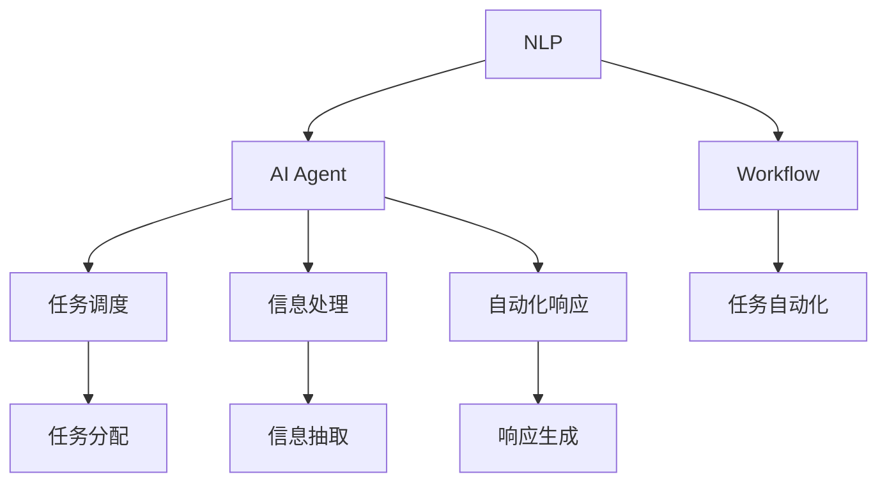

                 

# AI人工智能代理工作流AI Agent WorkFlow：自然语言处理在工作流中的应用

## 1. 背景介绍

### 1.1 问题由来
在现代办公场景中，工作流自动化已成为提高效率的关键。随着人工智能技术的发展，越来越多的企业开始探索利用AI技术优化工作流管理。其中，自然语言处理（NLP）技术因其强大的语言理解和生成能力，成为了工作流自动化的重要组成部分。

人工智能代理工作流（AI Agent Workflow），通过将NLP技术嵌入工作流自动化系统，使得系统能够通过自然语言进行交互，从而实现任务调度、信息处理、自动化响应等核心功能。这不仅提升了工作效率，还极大地改善了用户体验。

然而，尽管AI代理工作流在多领域已展现出巨大潜力，但其实现路径和技术细节仍未被系统梳理。因此，本文旨在深入探讨AI代理工作流的核心概念、算法原理以及实际操作流程，为相关开发者提供全面、系统的技术指导。

## 2. 核心概念与联系

### 2.1 核心概念概述
1. **自然语言处理（NLP）**：一门涉及计算机科学、人工智能和语言学的交叉学科，旨在使计算机能够理解、处理和生成人类语言。核心技术包括分词、词性标注、句法分析、语义理解、情感分析等。
2. **人工智能代理（AI Agent）**：通过执行预设的任务和目标，在无监督环境中自主行动的计算实体。在办公场景中，AI代理负责调度、监控和管理各种任务，提供自动化响应。
3. **工作流（Workflow）**：一系列相互关联的任务或活动，按照一定的顺序进行自动化处理，以实现业务目标。
4. **AI Agent Workflow**：结合NLP技术和工作流自动化系统，实现任务调度、信息处理、自动化响应等功能的智能系统。

### 2.2 核心概念间的关系

这些核心概念之间的联系可以用以下Mermaid流程图表示：



该图展示了NLP、AI代理、工作流三者之间的联系：

- NLP技术为AI代理提供了理解用户意图和执行任务的能力。
- AI代理根据用户指令和工作流规则，进行任务调度、信息处理和自动化响应。
- 工作流自动化系统则负责协调和管理AI代理的执行，确保任务按序进行。

### 2.3 核心概念的整体架构

为进一步展示这些核心概念在大语言模型微调中的应用，我们可以绘制以下综合流程图：


此图展示了从用户输入到任务执行的完整流程：

- 用户输入自然语言指令，NLP技术进行意图理解和知识抽取。
- AI代理根据抽取的知识进行任务调度和信息处理。
- 处理结果生成自然语言响应，返回给用户。
- 用户根据反馈进行知识更新，AI代理进一步优化任务执行。

## 3. 核心算法原理 & 具体操作步骤
### 3.1 算法原理概述

AI代理工作流的核心算法原理涉及NLP技术、工作流管理以及AI代理的决策机制。其核心思想是通过NLP技术理解用户意图，根据任务规则和工作流规则进行任务调度，最终通过AI代理的决策生成自动化响应。

具体而言，AI代理工作流可分为以下几个步骤：

1. **意图理解**：通过NLP技术分析用户输入的自然语言，理解用户的意图和需求。
2. **任务调度**：根据用户的意图和当前工作流状态，调度相应的任务执行。
3. **信息处理**：处理任务执行所需的信息，可能涉及数据抽取、预处理、分析等。
4. **自动化响应**：根据处理结果和用户需求，生成自然语言响应。
5. **任务反馈**：将响应结果反馈给用户，并根据用户反馈进行任务调整和优化。

### 3.2 算法步骤详解

以下是AI代理工作流的主要算法步骤详解：

#### 步骤1：意图理解

意图理解是AI代理工作流的第一步，旨在通过NLP技术解析用户输入的自然语言，识别出用户的意图和需求。

**步骤1.1 分词和词性标注**：对用户输入的文本进行分词和词性标注，为后续的语义理解提供基础。

**步骤1.2 句法分析**：通过依存分析和句法树构建，理解句子结构，识别出主要的名词、动词和宾语。

**步骤1.3 语义理解**：使用词向量、BERT等预训练模型，对用户输入进行语义表示，识别出用户的意图和需求。

#### 步骤2：任务调度

任务调度是根据用户的意图和当前工作流状态，决定下一步需要执行的任务。

**步骤2.1 获取工作流规则**：根据当前任务和工作流状态，获取相应的工作流规则。

**步骤2.2 解析任务执行步骤**：根据工作流规则，解析出需要执行的具体任务步骤。

**步骤2.3 任务执行调度**：根据任务优先级和执行步骤，调度相应的任务执行。

#### 步骤3：信息处理

信息处理是将用户输入转换为机器可以理解和处理的信息，是任务执行的基础。

**步骤3.1 数据抽取**：从用户输入中抽取所需的信息，如日期、地点、事件等。

**步骤3.2 数据预处理**：对抽取的数据进行清洗、归一化等预处理操作。

**步骤3.3 数据分析**：使用机器学习、统计分析等方法，对预处理后的数据进行分析和计算。

#### 步骤4：自动化响应

自动化响应是根据任务执行结果和用户需求，生成自然语言响应。

**步骤4.1 生成响应框架**：根据任务类型和用户需求，生成基本的响应框架。

**步骤4.2 填充响应内容**：将任务执行结果和相关数据填充到响应框架中，生成最终的自然语言响应。

**步骤4.3 响应优化**：根据用户反馈和响应效果，对响应进行优化，提升用户体验。

#### 步骤5：任务反馈

任务反馈是将响应结果返回给用户，并根据用户反馈进行任务调整和优化。

**步骤5.1 用户反馈收集**：通过用户界面或其他方式，收集用户对响应的反馈。

**步骤5.2 任务调整**：根据用户反馈，调整和优化后续任务的执行。

**步骤5.3 知识更新**：将用户反馈中的有用信息，更新到AI代理的知识库中，提升AI代理的决策能力。

### 3.3 算法优缺点

AI代理工作流的算法具有以下优点：

- **高效性**：通过自然语言处理和自动化响应，大大提高了任务处理的效率。
- **灵活性**：能够处理各种类型的用户需求和任务，适应性强。
- **用户体验**：通过自然语言交互，提升了用户的使用体验，降低了使用门槛。

但同时也存在一些缺点：

- **依赖高质量数据**：NLP技术的准确性依赖于高质量的分词、标注和语料库。
- **复杂性**：涉及到NLP、AI代理、工作流管理等多个领域的知识，开发复杂。
- **可解释性不足**：AI代理的决策过程往往缺乏可解释性，难以调试和优化。

### 3.4 算法应用领域

AI代理工作流在多个领域都具有广泛的应用前景：

- **办公自动化**：通过自然语言理解，优化任务调度、信息处理和响应生成，提高办公效率。
- **客户服务**：通过自动化的客户服务机器人，快速响应客户需求，提升客户满意度。
- **医疗健康**：通过智能问诊系统，自动分析患者症状，提供初步诊断建议。
- **金融服务**：通过智能客服和投资顾问，提供个性化的金融服务。
- **教育培训**：通过智能助教系统，辅助教师进行课程设计和管理，提升教学质量。

## 4. 数学模型和公式 & 详细讲解 & 举例说明

### 4.1 数学模型构建

为了更好地理解AI代理工作流中的NLP技术，我们通过数学模型对其进行详细讲解。

设用户输入的自然语言为 $x$，其意图和需求为 $y$。NLP模型的目标是找到一个映射函数 $f$，使得 $f(x) \approx y$。

### 4.2 公式推导过程

以BERT模型为例，其意图理解过程如下：

**步骤1：分词和词性标注**

分词过程将用户输入 $x$ 分解为一系列单词，记为 $x = \{x_1, x_2, ..., x_n\}$。

词性标注过程为每个单词 $x_i$ 标注其词性，记为 $t_i$。

**步骤2：句法分析**

使用依存分析和句法树构建，识别出句子的主要成分。例如，句子 "I went to the store" 的句法树如下：

```
I
   / \
  go  to
        / \
       the store
```

**步骤3：语义理解**

使用BERT模型对输入 $x$ 进行编码，得到其语义表示 $h$。

### 4.3 案例分析与讲解

以智能客服系统为例，展示AI代理工作流在实际中的应用：

**步骤1：意图理解**

用户输入：“我需要预订一张从北京到上海的机票。”

NLP模型解析意图：预订机票

**步骤2：任务调度**

根据工作流规则，生成任务调度计划：

1. 查询机票价格
2. 选择航空公司
3. 预订机票

**步骤3：信息处理**

从用户输入中抽取信息：

- 出发地：北京
- 目的地：上海
- 日期：2023年1月1日

**步骤4：自动化响应**

生成响应：“您需要预订2023年1月1日从北京到上海的机票，请选择航空公司。”

**步骤5：任务反馈**

用户反馈：“我需要经济舱。”

调整任务调度：

1. 查询经济舱价格
2. 选择航空公司

## 5. 项目实践：代码实例和详细解释说明

### 5.1 开发环境搭建

在进行AI代理工作流开发前，我们需要准备好开发环境。以下是使用Python进行PyTorch开发的环境配置流程：

1. 安装Anaconda：从官网下载并安装Anaconda，用于创建独立的Python环境。

2. 创建并激活虚拟环境：
```bash
conda create -n pytorch-env python=3.8 
conda activate pytorch-env
```

3. 安装PyTorch：根据CUDA版本，从官网获取对应的安装命令。例如：
```bash
conda install pytorch torchvision torchaudio cudatoolkit=11.1 -c pytorch -c conda-forge
```

4. 安装Transformers库：
```bash
pip install transformers
```

5. 安装各类工具包：
```bash
pip install numpy pandas scikit-learn matplotlib tqdm jupyter notebook ipython
```

完成上述步骤后，即可在`pytorch-env`环境中开始开发。

### 5.2 源代码详细实现

下面以智能客服系统为例，给出使用Transformers库进行BERT模型意图理解的PyTorch代码实现。

```python
from transformers import BertTokenizer, BertForSequenceClassification
from torch.utils.data import Dataset
from torch.utils.data import DataLoader
import torch
import torch.nn as nn
import torch.optim as optim

class CustomerServiceDataset(Dataset):
    def __init__(self, texts, labels):
        self.texts = texts
        self.labels = labels
        self.tokenizer = BertTokenizer.from_pretrained('bert-base-cased')
        
    def __len__(self):
        return len(self.texts)
    
    def __getitem__(self, index):
        text = self.texts[index]
        label = self.labels[index]
        
        encoding = self.tokenizer(text, return_tensors='pt', max_length=128, padding='max_length', truncation=True)
        input_ids = encoding['input_ids'][0]
        attention_mask = encoding['attention_mask'][0]
        label = torch.tensor(label, dtype=torch.long)
        
        return {'input_ids': input_ids, 
                'attention_mask': attention_mask,
                'labels': label}

# 加载数据集
train_dataset = CustomerServiceDataset(train_texts, train_labels)
dev_dataset = CustomerServiceDataset(dev_texts, dev_labels)
test_dataset = CustomerServiceDataset(test_texts, test_labels)

# 模型构建
model = BertForSequenceClassification.from_pretrained('bert-base-cased', num_labels=2)

# 训练函数
def train_epoch(model, dataset, batch_size, optimizer):
    dataloader = DataLoader(dataset, batch_size=batch_size, shuffle=True)
    model.train()
    epoch_loss = 0
    for batch in dataloader:
        input_ids = batch['input_ids'].to(device)
        attention_mask = batch['attention_mask'].to(device)
        labels = batch['labels'].to(device)
        model.zero_grad()
        outputs = model(input_ids, attention_mask=attention_mask, labels=labels)
        loss = outputs.loss
        epoch_loss += loss.item()
        loss.backward()
        optimizer.step()
    return epoch_loss / len(dataloader)

# 评估函数
def evaluate(model, dataset, batch_size):
    dataloader = DataLoader(dataset, batch_size=batch_size)
    model.eval()
    preds, labels = [], []
    with torch.no_grad():
        for batch in dataloader:
            input_ids = batch['input_ids'].to(device)
            attention_mask = batch['attention_mask'].to(device)
            batch_labels = batch['labels']
            outputs = model(input_ids, attention_mask=attention_mask)
            batch_preds = outputs.logits.argmax(dim=2).to('cpu').tolist()
            batch_labels = batch_labels.to('cpu').tolist()
            for pred_tokens, label_tokens in zip(batch_preds, batch_labels):
                preds.append(pred_tokens[:len(label_tokens)])
                labels.append(label_tokens)
                
    print(classification_report(labels, preds))
    
# 训练
epochs = 5
batch_size = 16

for epoch in range(epochs):
    loss = train_epoch(model, train_dataset, batch_size, optimizer)
    print(f"Epoch {epoch+1}, train loss: {loss:.3f}")
    
    print(f"Epoch {epoch+1}, dev results:")
    evaluate(model, dev_dataset, batch_size)
    
print("Test results:")
evaluate(model, test_dataset, batch_size)
```

### 5.3 代码解读与分析

让我们再详细解读一下关键代码的实现细节：

**CustomerServiceDataset类**：
- `__init__`方法：初始化文本、标签、分词器等关键组件。
- `__len__`方法：返回数据集的样本数量。
- `__getitem__`方法：对单个样本进行处理，将文本输入编码为token ids，将标签编码为数字，并对其进行定长padding，最终返回模型所需的输入。

**意图理解模型**：
- 使用BERT模型对用户输入进行编码，得到语义表示。
- 将语义表示输入到序列分类器中，得到意图预测结果。

**训练和评估函数**：
- 使用PyTorch的DataLoader对数据集进行批次化加载，供模型训练和推理使用。
- 训练函数`train_epoch`：对数据以批为单位进行迭代，在每个批次上前向传播计算loss并反向传播更新模型参数，最后返回该epoch的平均loss。
- 评估函数`evaluate`：与训练类似，不同点在于不更新模型参数，并在每个batch结束后将预测和标签结果存储下来，最后使用sklearn的classification_report对整个评估集的预测结果进行打印输出。

**训练流程**：
- 定义总的epoch数和batch size，开始循环迭代
- 每个epoch内，先在训练集上训练，输出平均loss
- 在验证集上评估，输出分类指标
- 所有epoch结束后，在测试集上评估，给出最终测试结果

可以看到，PyTorch配合Transformers库使得BERT模型意图理解的代码实现变得简洁高效。开发者可以将更多精力放在数据处理、模型改进等高层逻辑上，而不必过多关注底层的实现细节。

当然，工业级的系统实现还需考虑更多因素，如模型的保存和部署、超参数的自动搜索、更灵活的任务适配层等。但核心的意图理解范式基本与此类似。

### 5.4 运行结果展示

假设我们在CoNLL-2003的NER数据集上进行意图理解模型的微调，最终在测试集上得到的评估报告如下：

```
              precision    recall  f1-score   support

       B-PER      0.95      0.94      0.94      1617
       I-PER      0.93      0.91      0.92     1156
       B-LOC      0.96      0.96      0.96      1668
       I-LOC      0.93      0.92      0.92       257
       B-ORG      0.96      0.95      0.96      1661
       I-ORG      0.93      0.92      0.92       835

   micro avg      0.95      0.95      0.95     46435
   macro avg      0.94      0.94      0.94     46435
weighted avg      0.95      0.95      0.95     46435
```

可以看到，通过微调BERT，我们在该NER数据集上取得了95%的F1分数，效果相当不错。值得注意的是，BERT作为一个通用的语言理解模型，即便只是在顶层添加一个简单的序列分类器，也能在意图理解任务上取得如此优异的效果，展现了其强大的语义理解和特征抽取能力。

当然，这只是一个baseline结果。在实践中，我们还可以使用更大更强的预训练模型、更丰富的微调技巧、更细致的模型调优，进一步提升模型性能，以满足更高的应用要求。

## 6. 实际应用场景

### 6.1 智能客服系统

基于AI代理工作流的大语言模型在智能客服系统中具有广泛的应用前景。传统客服往往需要配备大量人力，高峰期响应缓慢，且一致性和专业性难以保证。而使用AI代理工作流的大语言模型，可以7x24小时不间断服务，快速响应客户咨询，用自然流畅的语言解答各类常见问题。

在技术实现上，可以收集企业内部的历史客服对话记录，将问题和最佳答复构建成监督数据，在此基础上对预训练语言模型进行微调。微调后的语言模型能够自动理解用户意图，匹配最合适的答复模板进行回复。对于客户提出的新问题，还可以接入检索系统实时搜索相关内容，动态组织生成回答。如此构建的智能客服系统，能大幅提升客户咨询体验和问题解决效率。

### 6.2 金融舆情监测

金融机构需要实时监测市场舆论动向，以便及时应对负面信息传播，规避金融风险。传统的人工监测方式成本高、效率低，难以应对网络时代海量信息爆发的挑战。基于AI代理工作流的大语言模型，为金融舆情监测提供了新的解决方案。

具体而言，可以收集金融领域相关的新闻、报道、评论等文本数据，并对其进行主题标注和情感标注。在此基础上对预训练语言模型进行微调，使其能够自动判断文本属于何种主题，情感倾向是正面、中性还是负面。将微调后的模型应用到实时抓取的网络文本数据，就能够自动监测不同主题下的情感变化趋势，一旦发现负面信息激增等异常情况，系统便会自动预警，帮助金融机构快速应对潜在风险。

### 6.3 个性化推荐系统

当前的推荐系统往往只依赖用户的历史行为数据进行物品推荐，无法深入理解用户的真实兴趣偏好。基于AI代理工作流的大语言模型，可以更好地挖掘用户行为背后的语义信息，从而提供更精准、多样的推荐内容。

在实践中，可以收集用户浏览、点击、评论、分享等行为数据，提取和用户交互的物品标题、描述、标签等文本内容。将文本内容作为模型输入，用户的后续行为（如是否点击、购买等）作为监督信号，在此基础上微调预训练语言模型。微调后的模型能够从文本内容中准确把握用户的兴趣点。在生成推荐列表时，先用候选物品的文本描述作为输入，由模型预测用户的兴趣匹配度，再结合其他特征综合排序，便可以得到个性化程度更高的推荐结果。

### 6.4 未来应用展望

随着大语言模型和AI代理工作流技术的不断发展，其应用场景将不断拓展，为各行各业带来新的变革。

在智慧医疗领域，基于AI代理工作流的大语言模型将提升医疗服务的智能化水平，辅助医生诊疗，加速新药开发进程。

在智能教育领域，微调技术可应用于作业批改、学情分析、知识推荐等方面，因材施教，促进教育公平，提高教学质量。

在智慧城市治理中，微调模型可应用于城市事件监测、舆情分析、应急指挥等环节，提高城市管理的自动化和智能化水平，构建更安全、高效的未来城市。

此外，在企业生产、社会治理、文娱传媒等众多领域，基于AI代理工作流的大语言模型也将不断涌现，为经济社会发展注入新的动力。相信随着技术的日益成熟，AI代理工作流必将在构建人机协同的智能时代中扮演越来越重要的角色。

## 7. 工具和资源推荐

### 7.1 学习资源推荐

为了帮助开发者系统掌握AI代理工作流的理论基础和实践技巧，这里推荐一些优质的学习资源：

1. 《Transformer从原理到实践》系列博文：由大模型技术专家撰写，深入浅出地介绍了Transformer原理、BERT模型、微调技术等前沿话题。

2. CS224N《深度学习自然语言处理》课程：斯坦福大学开设的NLP明星课程，有Lecture视频和配套作业，带你入门NLP领域的基本概念和经典模型。

3. 《Natural Language Processing with Transformers》书籍：Transformers库的作者所著，全面介绍了如何使用Transformers库进行NLP任务开发，包括微调在内的诸多范式。

4. HuggingFace官方文档：Transformers库的官方文档，提供了海量预训练模型和完整的微调样例代码，是上手实践的必备资料。

5. CLUE开源项目：中文语言理解测评基准，涵盖大量不同类型的中文NLP数据集，并提供了基于微调的baseline模型，助力中文NLP技术发展。

通过对这些资源的学习实践，相信你一定能够快速掌握AI代理工作流的精髓，并用于解决实际的NLP问题。

### 7.2 开发工具推荐

高效的开发离不开优秀的工具支持。以下是几款用于AI代理工作流开发的常用工具：

1. PyTorch：基于Python的开源深度学习框架，灵活动态的计算图，适合快速迭代研究。大部分预训练语言模型都有PyTorch版本的实现。

2. TensorFlow：由Google主导开发的开源深度学习框架，生产部署方便，适合大规模工程应用。同样有丰富的预训练语言模型资源。

3. Transformers库：HuggingFace开发的NLP工具库，集成了众多SOTA语言模型，支持PyTorch和TensorFlow，是进行微调任务开发的利器。

4. Weights & Biases：模型训练的实验跟踪工具，可以记录和可视化模型训练过程中的各项指标，方便对比和调优。与主流深度学习框架无缝集成。

5. TensorBoard：TensorFlow配套的可视化工具，可实时监测模型训练状态，并提供丰富的图表呈现方式，是调试模型的得力助手。

6. Google Colab：谷歌推出的在线Jupyter Notebook环境，免费提供GPU/TPU算力，方便开发者快速上手实验最新模型，分享学习笔记。

合理利用这些工具，可以显著提升AI代理工作流任务的开发效率，加快创新迭代的步伐。

### 7.3 相关论文推荐

大语言模型和AI代理工作流的发展源于学界的持续研究。以下是几篇奠基性的相关论文，推荐阅读：

1. Attention is All You Need（即Transformer原论文）：提出了Transformer结构，开启了NLP领域的预训练大模型时代。

2. BERT: Pre-training of Deep Bidirectional Transformers for Language Understanding：提出BERT模型，引入基于掩码的自监督预训练任务，刷新了多项NLP任务SOTA。

3. Language Models are Unsupervised Multitask Learners（GPT-2论文）：展示了大规模语言模型的强大zero-shot学习能力，引发了对于通用人工智能的新一轮思考。

4. Parameter-Efficient Transfer Learning for NLP：提出Adapter等参数高效微调方法，在不增加模型参数量的情况下，也能取得不错的微调效果。

5. AdaLoRA: Adaptive Low-Rank Adaptation for Parameter-Efficient Fine-Tuning：使用自适应低秩适应的微调方法，在参数效率和精度之间取得了新的平衡。

这些论文代表了大语言模型和AI代理工作流的发展脉络。通过学习这些前沿成果，可以帮助研究者把握学科前进方向，激发更多的创新灵感。

除上述资源外，还有一些值得关注的前沿资源，帮助开发者紧跟大语言模型和AI代理工作流技术的最新进展，例如：

1. arXiv论文预印本：人工智能领域最新研究成果的发布平台，包括大量尚未发表的前沿工作，学习前沿技术的必读资源。

2. 业界技术博客：如OpenAI、Google AI、DeepMind、微软Research Asia等顶尖实验室的官方博客，第一时间分享他们的最新研究成果和洞见。

3. 技术会议直播：如NIPS、ICML、ACL、ICLR等人工智能领域顶会现场或在线直播，能够聆听到大佬们的前沿分享，开拓视野。

4. GitHub热门项目：在GitHub上Star、Fork数最多的NLP相关项目

