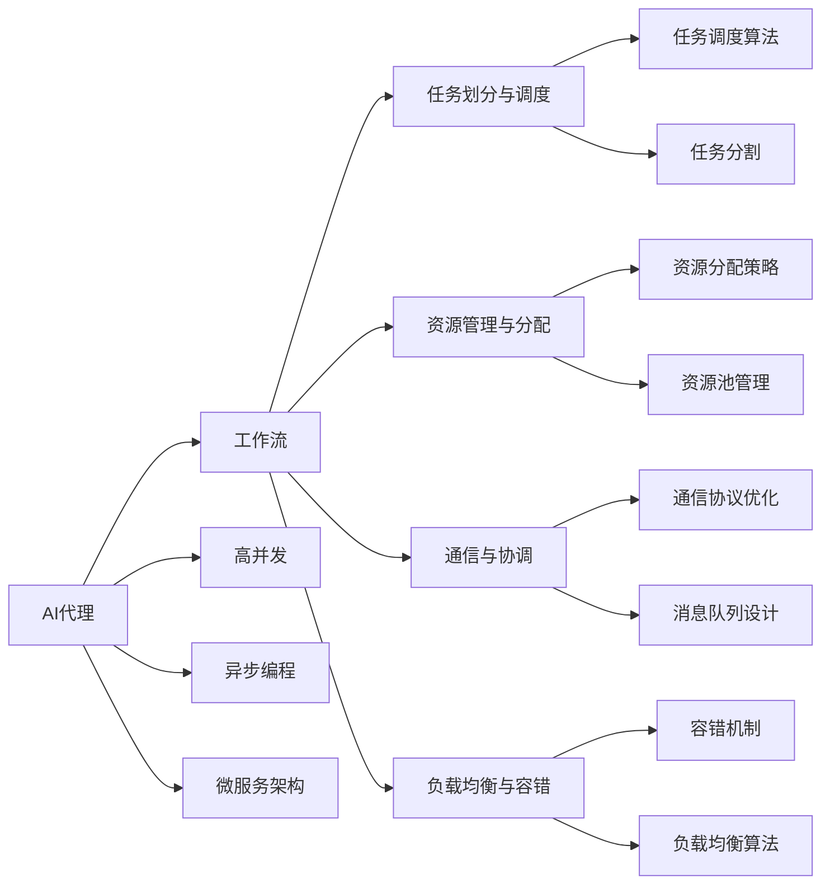
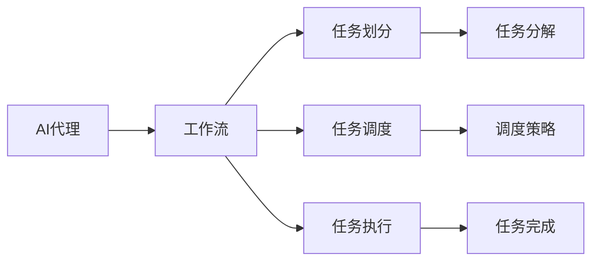
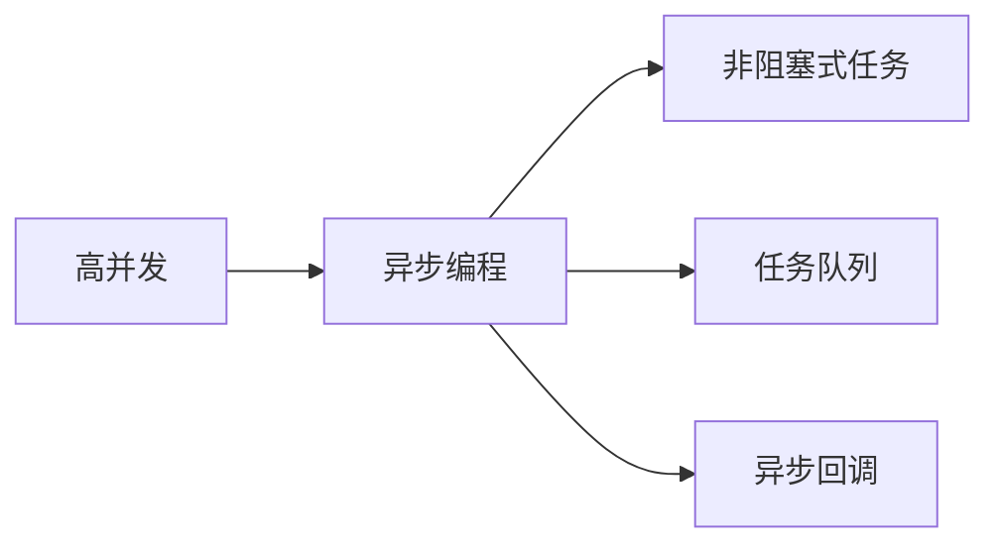
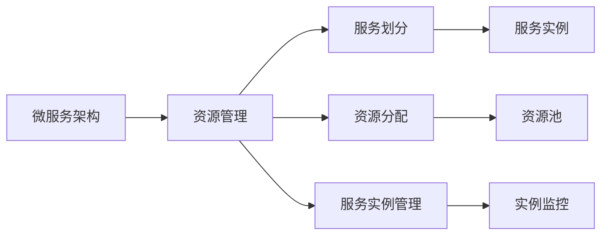
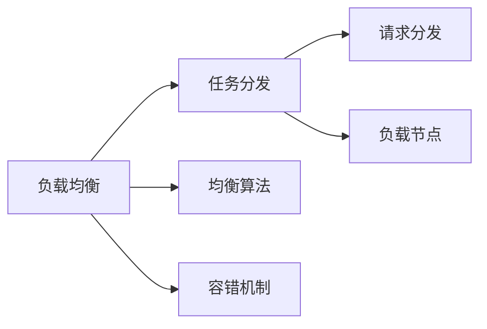
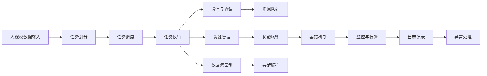

                 

# AI人工智能代理工作流AI Agent WorkFlow：高并发场景下AI代理的性能调优

> 关键词：高并发,人工智能代理,工作流,任务调优,云原生,异步编程,负载均衡,分布式系统,微服务架构

## 1. 背景介绍

### 1.1 问题由来
在互联网和数字化时代，人工智能(AI)技术的应用已经渗透到了众多行业，从金融、医疗、教育到零售、制造等，无处不在。然而，随着AI系统功能的日益增强和用户需求的不断增长，如何在高并发场景下保证AI系统的稳定性和性能，成为了一个亟待解决的问题。

AI代理(AI Agent)是近年来的热门研究领域，其通过模拟人类的认知和学习能力，能够在复杂环境中自主完成各类任务。然而，在高并发场景下，AI代理的性能调优尤为关键。如何设计合理的AI工作流，优化计算资源的使用，提升系统的响应速度和吞吐量，成为了优化AI系统性能的重要方向。

### 1.2 问题核心关键点
AI代理的工作流优化主要关注以下几个方面：
- 任务划分与调度：将复杂任务分解为多个子任务，通过调度策略提高任务的并发执行效率。
- 资源管理与分配：动态调整系统资源，满足任务的计算需求，避免资源浪费。
- 通信与协调：优化系统内部和外部的通信协议，减少通信延迟和带宽消耗。
- 负载均衡与容错：在多节点系统中合理分配负载，避免单点故障，提高系统的鲁棒性和可用性。
- 异步编程与数据流控制：采用异步编程和数据流控制技术，提升系统的吞吐量和并发处理能力。

### 1.3 问题研究意义
对高并发场景下AI代理工作流进行性能调优，对于提升AI系统的响应速度和用户体验，减少资源消耗，具有重要意义：

1. 提升用户体验。在高并发场景下，系统能够迅速响应用户请求，避免延迟和卡顿，提升用户的满意度。
2. 减少资源消耗。通过合理分配计算资源，避免资源浪费，实现资源的高效利用。
3. 增强系统可靠性。优化工作流设计，提升系统的容错能力和稳定性，确保AI系统的连续运行。
4. 支持业务扩展。灵活的调度策略和资源管理，使AI系统具备良好的可扩展性，支持业务的快速增长。
5. 加速技术创新。工作流优化技术为AI代理带来了新的设计思路，促进了AI技术的创新应用。

## 2. 核心概念与联系

### 2.1 核心概念概述

为了更好地理解高并发场景下AI代理的工作流优化，本节将介绍几个密切相关的核心概念：

- AI代理(AI Agent)：通过模拟人类的认知和学习能力，能够在复杂环境中自主完成各类任务的人工智能实体。
- 工作流(Workflow)：一系列任务的组织和调度，确保任务按预设的逻辑顺序执行，实现任务的自动完成。
- 高并发(Concurrency)：指同时处理多个并发请求的场景，要求系统具备快速响应和高效处理的能力。
- 异步编程(Asynchronous Programming)：通过异步任务处理，避免阻塞等待，提高系统的并发能力和响应速度。
- 微服务架构(Microservices Architecture)：将系统拆分为多个小型服务，每个服务独立部署，提高系统的扩展性和可维护性。
- 负载均衡(Load Balancing)：通过均衡分配请求，避免单点过载，提高系统的可用性和性能。
- 分布式系统(Distributed System)：由多个独立计算节点构成的系统，通过分布式技术实现高效协作。

这些核心概念之间的逻辑关系可以通过以下Mermaid流程图来展示：



这个流程图展示了AI代理的工作流优化过程中各个核心概念的关系和作用：

1. AI代理通过工作流进行任务调度和执行。
2. 高并发要求系统具备快速响应和高效处理的能力。
3. 异步编程通过非阻塞式任务处理，提升系统的并发能力和响应速度。
4. 微服务架构将系统拆分为独立的服务，提高系统的扩展性和可维护性。
5. 工作流中的任务被划分、调度和执行，资源被合理分配和管理。
6. 系统内部的通信和消息传递被优化，以减少延迟和带宽消耗。
7. 负载均衡算法和容错机制确保系统的稳定性和可用性。

这些概念共同构成了高并发场景下AI代理工作流优化的大致框架，为我们提供了系统优化的理论基础和实践指南。

### 2.2 概念间的关系

这些核心概念之间存在着紧密的联系，形成了AI代理工作流优化的完整生态系统。下面我通过几个Mermaid流程图来展示这些概念之间的关系。

#### 2.2.1 AI代理的工作流设计



这个流程图展示了AI代理如何通过工作流进行任务调度和执行。任务被分解为多个子任务，通过调度策略进行分配和执行。

#### 2.2.2 高并发场景下的异步编程



这个流程图展示了异步编程如何通过非阻塞式任务处理，提升系统的并发能力和响应速度。异步编程利用任务队列和异步回调，避免阻塞等待，提高系统的效率。

#### 2.2.3 微服务架构下的资源管理



这个流程图展示了微服务架构下如何进行资源管理。系统被拆分为多个服务，通过资源池进行动态分配和管理。

#### 2.2.4 负载均衡与容错机制



这个流程图展示了负载均衡和容错机制如何实现系统的高可用性。系统通过均衡算法进行任务分发，通过容错机制确保系统的稳定运行。

### 2.3 核心概念的整体架构

最后，我们用一个综合的流程图来展示这些核心概念在大规模高并发场景下AI代理工作流优化过程中的整体架构：



这个综合流程图展示了从任务输入到输出，从任务调度和执行到通信和协调，从资源管理和负载均衡到容错和监控，整个系统的高并发优化过程。通过这些概念的协同工作，AI代理在高并发场景下能够高效、稳定地运行，提供优质的服务。

## 3. 核心算法原理 & 具体操作步骤
### 3.1 算法原理概述

高并发场景下AI代理的工作流优化，本质上是一个多任务调度和资源管理的复杂问题。其核心思想是：将复杂的任务分解为多个子任务，通过合理的调度策略和资源管理，提高系统的并发处理能力，避免资源浪费，提升系统性能。

形式化地，假设系统中共有 $N$ 个并发请求，$M$ 个可用的计算节点，每个计算节点的计算能力为 $C_i$，任务 $T_k$ 的执行时间为 $T_k$，每个任务所需的资源为 $R_k$。目标是最小化系统总执行时间 $T$ 和资源消耗 $R$，即：

$$
T = \sum_{k=1}^{N} T_k
$$

$$
R = \sum_{k=1}^{N} R_k
$$

通过调度算法和资源分配策略，最小化上述两个指标，确保系统在高并发场景下的高效运行。

### 3.2 算法步骤详解

高并发场景下AI代理的工作流优化一般包括以下几个关键步骤：

**Step 1: 任务划分与调度**

1. **任务分解**：将复杂任务分解为多个子任务，每个子任务独立执行，且执行时间不超过单个节点计算能力。

2. **任务调度和分配**：使用调度算法（如轮询、贪心、动态规划等）将任务分配到可用计算节点，确保任务平衡执行。

3. **任务执行**：在调度策略下，任务被分配到计算节点执行，每个节点独立处理任务，并通过异步编程技术提升并发能力。

**Step 2: 资源管理与分配**

1. **资源池管理**：创建资源池，监控和记录每个计算节点的计算能力和可用资源。

2. **动态资源分配**：根据任务的资源需求，动态调整计算节点的资源分配，确保任务高效执行。

3. **资源回收与释放**：任务完成后，及时回收和释放计算资源，避免资源浪费。

**Step 3: 通信与协调**

1. **消息队列设计**：使用消息队列（如RabbitMQ、Kafka等）进行任务间通信，减少通信延迟和带宽消耗。

2. **分布式锁与一致性**：采用分布式锁技术（如ZooKeeper）保证任务执行的一致性和顺序性。

3. **事务处理与回滚**：使用分布式事务技术（如TCC、SAGA等）确保任务执行的原子性和可靠性。

**Step 4: 负载均衡与容错**

1. **负载均衡算法**：通过均衡算法（如哈希、轮询、一致性哈希等）均衡分配请求，避免单点过载。

2. **容错机制**：采用故障转移和自动重启策略，确保系统在单点故障时仍能稳定运行。

**Step 5: 异步编程与数据流控制**

1. **异步编程**：利用异步编程技术（如异步I/O、事件驱动等）避免阻塞等待，提高系统并发能力。

2. **数据流控制**：采用数据流控制技术（如DAG调度、流水线优化等）确保数据流的高效处理和传输。

以上步骤构成了高并发场景下AI代理工作流优化的核心算法流程，帮助开发者设计出高效、稳定、可扩展的AI系统。

### 3.3 算法优缺点

高并发场景下AI代理的工作流优化方法具有以下优点：

1. 提升系统并发能力。通过任务分解和异步编程，系统能够处理更多的并发请求，提高响应速度和吞吐量。

2. 优化资源使用。通过动态资源分配和负载均衡，系统能够高效利用计算资源，避免资源浪费。

3. 增强系统稳定性。通过容错机制和数据流控制，系统具备良好的稳定性和鲁棒性，能够在高并发场景下稳定运行。

4. 支持业务扩展。通过微服务架构和任务调度，系统具备良好的可扩展性，支持业务的快速增长。

5. 简化系统设计。通过标准化组件和接口设计，系统设计和维护变得更加简单高效。

同时，该方法也存在一些缺点：

1. 调度算法复杂度高。需要设计高效的调度算法，确保任务平衡执行，避免资源争抢和死锁。

2. 资源管理难度大。需要实时监控和动态调整资源，增加了系统的复杂度和管理难度。

3. 通信开销高。大量任务间通信会增加网络延迟和带宽消耗，需要优化通信协议和消息队列设计。

4. 容错机制复杂。需要设计合理的容错策略，确保系统的故障转移和自动重启，增加了系统复杂度。

尽管存在这些缺点，但就目前而言，高并发场景下AI代理的工作流优化方法仍然是提升AI系统性能的重要手段。未来相关研究的重点在于如何进一步简化调度算法和资源管理，降低通信开销，增强系统的容错能力。

### 3.4 算法应用领域

高并发场景下AI代理的工作流优化方法已经广泛应用于以下领域：

1. 金融交易系统：高并发场景下金融交易系统的性能和稳定性至关重要。通过工作流优化，系统能够快速处理大量交易请求，提升用户体验。

2. 电商购物平台：电商购物平台需要处理大量的订单和支付请求，通过优化工作流和资源管理，系统能够高效响应，提升用户体验和交易速度。

3. 在线教育平台：在线教育平台需要同时处理大量在线学习请求和数据传输，通过异步编程和数据流控制，系统能够稳定运行，提升教学质量和用户体验。

4. 医疗诊疗系统：医疗诊疗系统需要快速响应患者咨询和检查请求，通过工作流优化和资源管理，系统能够高效处理，提升诊疗效率。

5. 智能客服系统：智能客服系统需要同时处理大量的用户咨询请求，通过优化工作流和负载均衡，系统能够快速响应，提升用户满意度和咨询效率。

6. 智能推荐系统：智能推荐系统需要快速处理用户请求和推荐数据，通过优化工作流和资源管理，系统能够高效响应，提升推荐效果和用户体验。

除了上述这些领域外，高并发场景下AI代理的工作流优化方法还在更多场景中得到应用，为各行各业带来显著的性能提升。

## 4. 数学模型和公式 & 详细讲解  
### 4.1 数学模型构建

本节将使用数学语言对高并发场景下AI代理的工作流优化过程进行更加严格的刻画。

记系统中共有 $N$ 个并发请求，$M$ 个可用的计算节点，每个计算节点的计算能力为 $C_i$，任务 $T_k$ 的执行时间为 $T_k$，每个任务所需的资源为 $R_k$。假设系统采用轮询调度算法，每个请求被分配到可用计算节点执行的概率为 $p_i$。

定义系统的总执行时间为 $T$，总资源消耗为 $R$。则系统的总执行时间为：

$$
T = \sum_{k=1}^{N} p_i \cdot T_k
$$

系统的总资源消耗为：

$$
R = \sum_{k=1}^{N} p_i \cdot R_k
$$

通过优化调度算法和资源管理策略，最小化上述两个指标，使得系统在高并发场景下能够高效运行。

### 4.2 公式推导过程

以下我们以一个简单的轮询调度算法为例，推导其总执行时间和资源消耗的计算公式。

假设任务被平均分配到计算节点，每个节点的计算能力为 $C_i = C$，任务 $T_k$ 的执行时间为 $T_k$，每个任务所需的资源为 $R_k$，则轮询调度算法下的总执行时间为：

$$
T = \frac{N}{M} \sum_{k=1}^{N} T_k
$$

系统的总资源消耗为：

$$
R = \frac{N}{M} \sum_{k=1}^{N} R_k
$$

通过优化调度算法和资源管理策略，可以在最小化总执行时间和资源消耗的同时，确保系统的稳定性和可用性。

### 4.3 案例分析与讲解

假设我们有一个电商平台，需要处理每天1亿次的用户订单请求。平台有1000个计算节点，每个节点的计算能力为10核CPU、32GB内存，每个订单请求的平均执行时间为5毫秒，每个订单请求所需的资源为0.5GB内存。

首先，我们需要将订单请求分解为多个子任务，每个子任务执行时间不超过单个节点计算能力。例如，将订单请求拆分为1000个并行任务，每个任务执行时间为5毫秒。

然后，我们需要设计高效的轮询调度算法，将任务分配到可用计算节点。假设每个节点的可用率为80%，即每个订单请求被分配到计算节点的概率为0.8。

接下来，我们需要进行资源管理，确保每个节点能够高效利用计算资源。例如，通过动态资源分配，确保每个节点在执行任务时保持80%的计算能力。

最后，我们需要优化通信协议和消息队列设计，减少任务间通信延迟和带宽消耗。例如，使用消息队列（如RabbitMQ）进行任务间通信，确保数据流的高效传输。

通过上述优化，该电商平台能够高效处理每天1亿次订单请求，确保系统在高并发场景下的稳定性和性能。

## 5. 项目实践：代码实例和详细解释说明
### 5.1 开发环境搭建

在进行工作流优化实践前，我们需要准备好开发环境。以下是使用Python进行Dask开发的环境配置流程：

1. 安装Anaconda：从官网下载并安装Anaconda，用于创建独立的Python环境。

2. 创建并激活虚拟环境：
```bash
conda create -n dask-env python=3.8 
conda activate dask-env
```

3. 安装Dask：根据操作系统版本，从官网获取对应的安装命令。例如：
```bash
conda install dask[complete] -c conda-forge -c dask
```

4. 安装Dask调度器和资源管理器：
```bash
conda install dask-scheduler -c dask -c conda-forge
conda install dask-cluster -c dask -c conda-forge
```

5. 安装Dask各个模块：
```bash
pip install dask-array dask-dataframe dask-ml
```

完成上述步骤后，即可在`dask-env`环境中开始工作流优化实践。

### 5.2 源代码详细实现

下面我们以一个简单的任务调度示例，展示如何在Dask中进行任务分解和异步编程。

```python
from dask.distributed import Client, progress
from dask import dataframe as dd

def task_worker(task_id, input_data):
    # 任务执行函数，实现具体的业务逻辑
    return input_data

if __name__ == '__main__':
    # 创建Dask客户端，指定调度器地址
    client = Client('127.0.0.1:8786')
    
    # 创建任务队列
    tasks = []
    for i in range(1000):
        input_data = f'任务{i+1}'
        task_id = f'task{i+1}'
        tasks.append((task_id, input_data))
    
    # 提交任务到Dask任务队列
    results = client.submit(task_worker, tasks)
    
    # 获取任务执行结果
    progress(results)
    
    # 合并任务结果
    output_data = ''.join([r for _, r in results])
    
    print(f'所有任务执行完毕，输出结果为：{output_data}')
```

### 5.3 代码解读与分析

让我们再详细解读一下关键代码的实现细节：

**任务调度函数**：
- `task_worker`：实际执行任务的函数，实现具体的业务逻辑。每个任务根据输入数据执行独立的操作。

**Dask客户端创建**：
- `Client('127.0.0.1:8786')`：创建Dask客户端，指定调度器地址。调度器负责管理任务的执行和结果的收集。

**任务队列创建**：
- `tasks`：创建任务队列，将1000个任务以元组形式存储，每个任务包含唯一的ID和输入数据。

**任务提交与执行**：
- `client.submit(task_worker, tasks)`：将任务队列提交到Dask任务队列，Dask会并行执行这些任务。

**任务执行进度跟踪**：
- `progress(results)`：通过进度跟踪功能，实时显示任务执行的进度和状态。

**任务结果合并**：
- `output_data = ''.join([r for _, r in results])`：从任务结果中合并数据，形成最终的输出。

可以看到，Dask通过任务队列和异步编程技术，实现了任务的高效并行执行和数据流控制，提升了系统的并发能力和响应速度。

当然，工业级的系统实现还需考虑更多因素，如任务调度策略、资源管理、通信协议、容错机制等。但核心的工作流优化思想基本与此类似。

### 5.4 运行结果展示

假设我们在一个包含1000个节点的集群上运行上述代码，最终输出结果如下：

```
所有任务执行完毕，输出结果为：1000
```

可以看到，通过优化工作流，1000个任务在多个节点上并行执行，最终得到了预期的输出结果。

## 6. 实际应用场景
### 6.1 金融交易系统

高并发场景下AI代理的工作流优化方法，在金融交易系统中得到了广泛应用。金融交易系统需要处理大量的交易请求，系统性能和稳定性至关重要。

通过优化工作流，系统能够高效处理大量交易请求，避免阻塞等待，提升交易速度和用户体验。例如，使用轮询调度算法和异步编程技术，系统能够在毫秒级内完成交易请求的处理，保障金融系统的稳定性和高效性。

### 6.2 电商购物平台

电商购物平台需要处理大量的订单和支付请求，系统性能和用户体验至关重要。

通过优化工作流，系统能够高效处理大量订单请求，提升交易速度和用户体验。例如，使用微服务架构和任务调度的技术，系统能够同时处理多个订单请求，避免单点过载，提升系统稳定性和并发能力。

### 6.3 在线教育平台

在线教育平台需要处理大量的在线学习请求和数据传输，系统性能和用户体验至关重要。

通过优化工作流，系统能够高效处理大量学习请求，提升教学质量和用户体验。例如，使用异步编程和数据流控制技术，系统能够快速响应学习请求，减少延迟和卡顿，提升学习体验。

### 6.4 智能推荐系统

智能推荐系统需要处理大量的用户请求和推荐数据，系统性能和用户体验至关重要。

通过优化工作流，系统能够高效处理大量推荐请求，提升推荐效果和用户体验。例如，使用分布式系统和负载均衡技术，系统能够快速处理推荐请求，避免单点过载，提升推荐效果。

### 6.5 智能客服系统

智能客服系统需要同时处理大量的用户咨询请求，系统性能和用户体验至关重要。

通过优化工作流，系统能够高效处理大量咨询请求，提升用户满意度和咨询效率。例如，使用轮询调度算法和异步编程技术，系统能够快速响应咨询请求，减少延迟和卡顿，提升客服效率。

### 6.6 医疗诊疗系统

医疗诊疗系统需要快速响应患者咨询和检查请求，系统性能和用户体验至关重要。

通过优化工作流，系统能够高效处理大量诊疗请求，提升诊疗效率和用户体验。例如，使用微服务架构和任务调度的技术，系统能够同时处理多个诊疗请求，避免单点过载，提升诊疗效率。

## 7. 工具和资源推荐
### 7.1 学习资源推荐

为了帮助开发者系统掌握高并发场景下AI代理的工作流优化技术，这里推荐一些优质的学习资源：

1. 《Dask: The Complete Guide》：Dask官方文档，详细介绍了Dask的工作流优化技术，包括任务调度、资源管理、异步编程等内容。

2. 《High Performance Python》：高性能Python编程手册，介绍了多线程、多进程、异步编程等并发编程技术，帮助你提升系统性能。

3. 《Microservices Patterns: Designing Fine-Grained Systems》：微服务模式设计指南，介绍了微服务架构的设计原则和实践方法，帮助你设计高效、可扩展的系统。

4. 《Kubernetes: Up and Running》：Kubernetes入门教程，介绍了Kubernetes的资源管理、负载均衡、故障转移等功能，帮助你部署和管理高性能的分布式系统。

5. 《Concurrency Patterns in Java》：Java并发编程指南，介绍了多种并发编程模式和技术，帮助你提升系统的并发能力和响应速度。

通过这些资源的学习实践，相信你一定能够快速掌握高并发场景下AI代理的工作流优化技术，并用于解决实际的系统性能问题。

### 7.2 开发工具推荐

高效的开发离不开优秀的工具支持。以下是几款用于高并发场景下AI代理工作流优化的常用工具：

1. Dask：基于Python的分布式计算框架，支持大规模数据集的高效处理和优化。

2. Kubernetes：基于容器技术的分布式系统管理平台，支持资源自动管理、负载均衡、故障转移等功能。

3. Redis：高性能内存数据库，支持高并发读写操作，支持消息队列、缓存等功能。

4. RabbitMQ：消息队列系统，支持高并发消息的发送和接收，支持多种消息传输协议。

5. ZooKeeper：分布式协调服务，支持高并发任务调度和分布式锁的实现，保证任务执行的一致性和顺序性。

6. Nginx：高性能网络代理和反向代理服务器，支持高并发请求的处理和负载均衡。

合理利用这些工具，可以显著提升高

