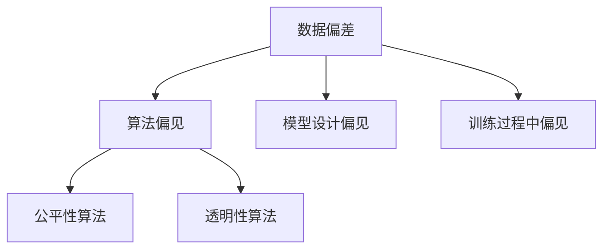
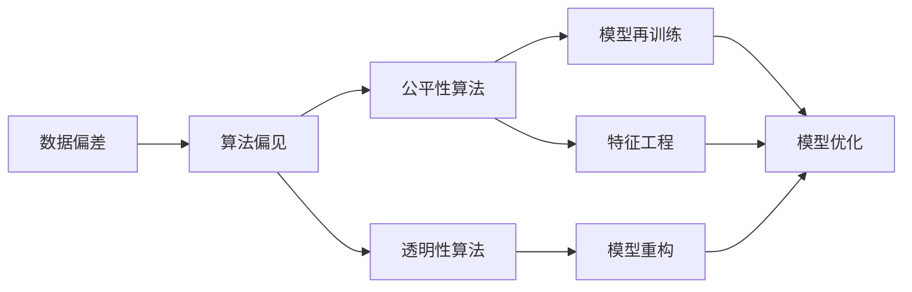
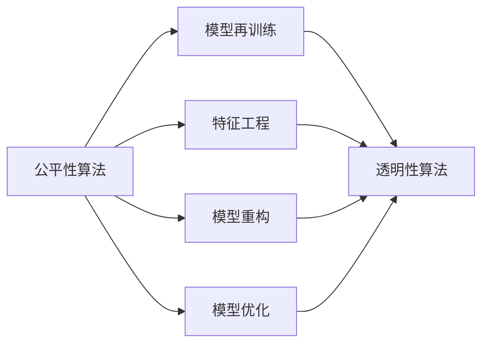
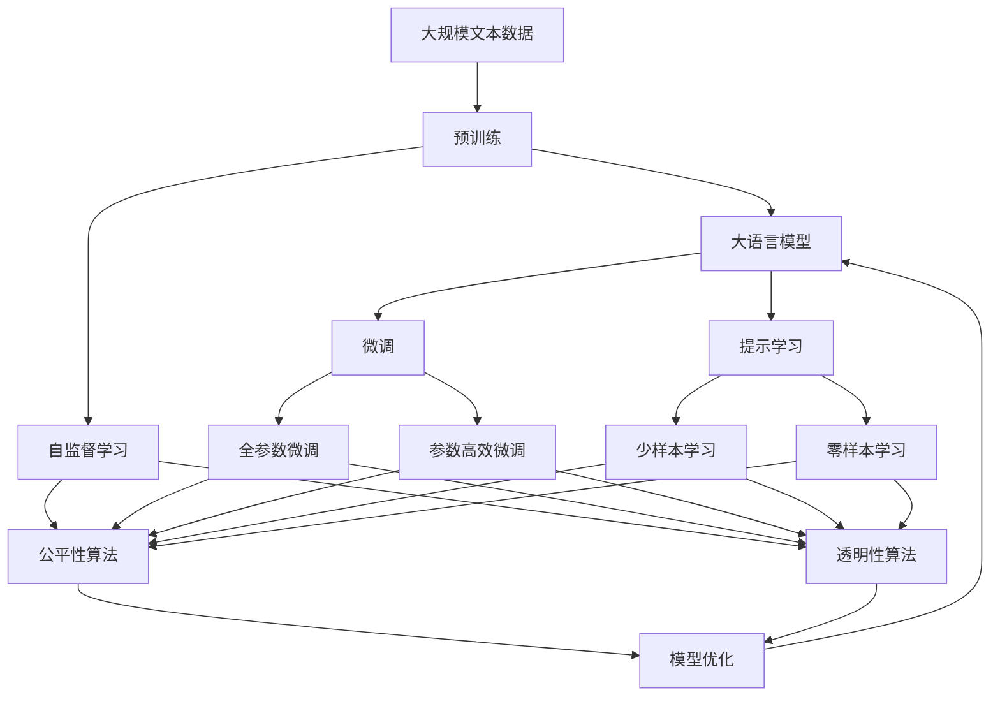

                 

# AI人工智能核心算法原理与代码实例讲解：算法偏见

> 关键词：人工智能,算法偏见,模型公平性,算法透明性,偏见检测与修正,公平性算法,透明性算法

## 1. 背景介绍

### 1.1 问题由来
人工智能（AI）算法在各个领域的应用日益广泛，但其内部可能存在的算法偏见（Bias in AI Algorithms）问题也逐渐成为公众关注的焦点。算法偏见指的是在数据、模型和训练过程中引入的偏向性，可能导致算法决策的不公平性、歧视性和不准确性。例如，在面部识别系统中，算法可能会对特定种族或性别的人群存在识别偏差，导致肤色较深或女性面部特征的识别精度较低。

算法偏见不仅影响模型的准确性和公平性，还可能引发一系列社会问题，如就业歧视、医疗不公、司法误判等。因此，如何在AI系统中检测和消除算法偏见，成为了当前研究的热点问题。本文将详细探讨算法偏见的原理、检测方法及实例代码实现。

### 1.2 问题核心关键点
算法偏见的产生原因复杂多样，既有数据偏差，也有模型设计偏见，还有训练过程中可能引入的偏见。因此，检测和消除算法偏见需要从数据收集、模型设计、训练过程等多个方面进行综合考虑。本节将从这些关键点出发，全面梳理算法偏见的原理和应对策略。

## 2. 核心概念与联系

### 2.1 核心概念概述

为更好地理解算法偏见的原理，本节将介绍几个密切相关的核心概念：

- **算法偏见（Bias in AI Algorithms）**：指在数据、模型和训练过程中引入的偏向性，可能导致算法决策的不公平性、歧视性和不准确性。
- **数据偏差（Data Bias）**：指训练数据中存在的偏差，如性别、种族、年龄等特征的不平衡，影响模型的学习效果和决策能力。
- **模型设计偏见（Model Bias）**：指模型结构和参数设置中的预设偏向性，可能对某些特定类别或特征产生不公平的预测。
- **训练过程中偏见（Bias in Training）**：指在模型训练过程中，由于优化算法、损失函数等设计不当，导致模型学习到的知识带有偏见。

这些核心概念之间的逻辑关系可以通过以下Mermaid流程图来展示：



这个流程图展示了几类偏见与相关技术之间的关系：数据偏差直接影响算法偏见，同时模型设计偏见和训练过程中偏见也都可以导致算法偏见。而公平性算法和透明性算法则用于检测和缓解算法偏见。

### 2.2 概念间的关系

这些核心概念之间存在着紧密的联系，形成了AI算法偏见检测与缓解的完整生态系统。下面我通过几个Mermaid流程图来展示这些概念之间的关系。

#### 2.2.1 算法偏见的检测与缓解



这个流程图展示了如何通过检测和缓解算法偏见，提高模型的公平性和透明性：

1. 数据偏差通过检测算法偏见被发现。
2. 基于公平性算法和透明性算法，检测算法中的偏见。
3. 根据检测结果，对模型进行再训练或重构，去除偏见。
4. 通过模型优化和特征工程，进一步提升模型性能和公平性。

#### 2.2.2 公平性算法与透明性算法的关系



这个流程图展示了公平性算法与透明性算法之间的联系：

1. 公平性算法通过重新训练、特征工程、模型重构等方法，去除模型中的偏见。
2. 透明性算法用于检测和衡量模型的公平性和透明性。
3. 基于透明性算法，进一步优化模型性能，实现公平和透明。

### 2.3 核心概念的整体架构

最后，我们用一个综合的流程图来展示这些核心概念在大语言模型微调过程中的整体架构：



这个综合流程图展示了从预训练到微调，再到公平性和透明性检测的完整过程。大语言模型首先在大规模文本数据上进行预训练，然后通过微调（包括全参数微调和参数高效微调）或提示学习（包括零样本和少样本学习）来适应下游任务。同时，利用公平性算法和透明性算法，检测和缓解算法偏见，确保模型的公平性和透明性。通过这些技术，模型可以更好地适应不同领域和场景，同时保证输出结果的公平和透明。

## 3. 核心算法原理 & 具体操作步骤
### 3.1 算法原理概述

算法偏见的检测与缓解，本质上是通过一系列技术和方法，对模型进行分析和优化，以消除或减少模型中的偏见。其主要原理包括以下几个方面：

- **公平性检测**：通过统计分析、对抗样本生成等方法，检测模型在不同群体间的预测偏差。
- **偏见修正**：通过重新训练、特征工程、模型重构等方法，去除模型中的偏见。
- **透明性分析**：通过解释性技术、可解释模型等方法，揭示模型内部的工作机制和决策依据。

这些原理共同构成了检测和缓解算法偏见的完整技术框架，通过综合应用这些方法，可以显著提升模型的公平性和透明性。

### 3.2 算法步骤详解

基于上述原理，检测和缓解算法偏见的步骤可以分为以下几个关键环节：

**Step 1: 数据收集与预处理**

- 收集包含不同群体（如性别、种族、年龄等）的训练数据，并进行数据清洗和标注。
- 对数据进行平衡处理，避免某些群体数据过多或过少，导致模型偏向某个群体。

**Step 2: 模型训练与偏见检测**

- 使用收集到的数据，对模型进行训练，并保存训练好的模型。
- 使用公平性算法和透明性算法，检测模型在不同群体间的预测偏差和特征贡献度。
- 根据检测结果，调整训练过程和模型结构，去除模型中的偏见。

**Step 3: 模型再训练与优化**

- 根据偏见检测结果，重新训练模型，去除偏见。
- 通过特征工程、模型重构等方法，提升模型的公平性和透明性。
- 优化模型性能，提高模型的准确性和稳定性。

**Step 4: 模型部署与应用**

- 将优化后的模型部署到实际应用中。
- 持续监测模型的公平性和透明性，确保模型输出结果的公平和透明。

以上是检测和缓解算法偏见的完整步骤，开发者可以根据具体任务和数据特点，对各个环节进行优化设计。

### 3.3 算法优缺点

算法偏见检测与缓解方法具有以下优点：

1. **提升模型公平性**：通过检测和消除算法偏见，使得模型在不同群体间的预测更加公平。
2. **增强模型透明性**：揭示模型内部的决策机制，提高模型的可解释性和可信度。
3. **减少社会问题**：减少算法偏见带来的社会问题，如就业歧视、医疗不公等，增强社会公平和正义。

同时，这些方法也存在一些局限性：

1. **数据依赖性强**：算法偏见检测与缓解方法依赖于高质量的数据，数据质量不足可能导致检测结果不准确。
2. **技术复杂度高**：实现算法偏见检测与缓解需要较高的技术水平和数据处理能力。
3. **模型效果不确定性**：偏见修正方法可能影响模型性能，需要在公平性和模型性能之间进行权衡。
4. **数据隐私问题**：处理敏感数据时，需要考虑数据隐私和保密问题。

尽管存在这些局限性，但总体而言，算法偏见检测与缓解方法在大规模AI应用中具有重要的现实意义，值得进一步研究和推广。

### 3.4 算法应用领域

算法偏见检测与缓解方法在多个领域得到了广泛应用，例如：

- **金融领域**：金融风控模型可能对某些群体存在歧视，通过偏见检测与修正，提高模型的公平性。
- **医疗领域**：医疗诊断模型可能对不同性别、年龄、种族等群体存在偏差，检测并修正偏见，提高诊断准确性。
- **司法领域**：司法判决模型可能对某些群体存在偏见，通过公平性检测与优化，提高判决的公正性。
- **招聘领域**：招聘模型可能对不同性别、年龄、种族等群体存在歧视，检测并修正偏见，实现公平招聘。
- **教育领域**：教育评估模型可能对不同性别、种族等群体存在偏见，通过透明性分析与优化，提高评估的公平性。

这些领域的应用表明，算法偏见检测与缓解技术具有广阔的应用前景，能够帮助解决诸多实际问题，促进社会公平和正义。

## 4. 数学模型和公式 & 详细讲解 & 举例说明

### 4.1 数学模型构建

为更好地理解算法偏见的检测与缓解方法，本节将使用数学语言对相关技术进行严格刻画。

假设有一组训练数据 $D = \{(x_i, y_i)\}_{i=1}^N$，其中 $x_i$ 为输入特征向量，$y_i$ 为类别标签。模型 $M$ 的预测输出为 $\hat{y} = M(x)$，其中 $\hat{y}$ 为模型在输入 $x$ 上的预测输出。

定义模型 $M$ 在数据集 $D$ 上的公平性指标为 $F_M(D)$，定义为模型在不同群体间的预测偏差：

$$
F_M(D) = \frac{1}{N} \sum_{i=1}^N |y_i - \hat{y}_i|
$$

其中 $y_i$ 和 $\hat{y}_i$ 分别为标签和模型预测。模型 $M$ 的透明性指标为 $T_M(D)$，定义为模型对不同特征的贡献度：

$$
T_M(D) = \frac{1}{N} \sum_{i=1}^N \left( \frac{\partial \hat{y}_i}{\partial x_i} \right)^2
$$

其中 $\frac{\partial \hat{y}_i}{\partial x_i}$ 为模型对特征 $x_i$ 的偏导数。

### 4.2 公式推导过程

以下我们以性别偏见检测为例，推导模型在性别群体间的公平性指标和透明性指标的计算公式。

假设有一组训练数据 $D = \{(x_i, y_i)\}_{i=1}^N$，其中 $x_i$ 为输入特征向量，$y_i$ 为类别标签，$x_i = (x_i^1, x_i^2, ..., x_i^k)$，其中 $k$ 为特征维度。模型 $M$ 的预测输出为 $\hat{y} = M(x)$，其中 $\hat{y}$ 为模型在输入 $x$ 上的预测输出。

模型 $M$ 在数据集 $D$ 上的公平性指标为 $F_M(D)$，定义为模型在性别群体间的预测偏差：

$$
F_M(D) = \frac{1}{N} \sum_{i=1}^N |y_i - \hat{y}_i| = \frac{1}{N} \sum_{i=1}^N |M(x_i^1, x_i^2, ..., 0, ..., x_i^k) - M(x_i^1, x_i^2, ..., 1, ..., x_i^k)|
$$

其中 $0$ 和 $1$ 分别表示女性和男性。

模型 $M$ 的透明性指标为 $T_M(D)$，定义为模型对不同性别特征的贡献度：

$$
T_M(D) = \frac{1}{N} \sum_{i=1}^N \left( \frac{\partial \hat{y}_i}{\partial x_i^1} \right)^2 = \frac{1}{N} \sum_{i=1}^N \left( \frac{\partial M(x_i^1, x_i^2, ..., 0, ..., x_i^k)}{\partial x_i^1} - \frac{\partial M(x_i^1, x_i^2, ..., 1, ..., x_i^k)}{\partial x_i^1} \right)^2
$$

其中 $\frac{\partial M(x_i^1, x_i^2, ..., 0, ..., x_i^k)}{\partial x_i^1}$ 和 $\frac{\partial M(x_i^1, x_i^2, ..., 1, ..., x_i^k)}{\partial x_i^1}$ 分别为模型在女性和男性特征上的偏导数。

通过这些指标，可以评估模型在不同群体间的预测偏差和特征贡献度，进而检测和缓解算法偏见。

### 4.3 案例分析与讲解

假设我们有一个基于性别偏见的面部识别模型，用于识别照片中的人脸是否为女性。我们可以通过公平性指标和透明性指标来检测和缓解模型的偏见。

首先，我们收集了包含男性和女性的面部图片，并标注其性别标签。然后，我们使用收集到的数据对模型进行训练，得到训练好的模型 $M$。

接着，我们计算模型在男性和女性群体间的公平性指标 $F_M(D)$：

$$
F_M(D) = \frac{1}{N} \sum_{i=1}^N |y_i - \hat{y}_i|
$$

其中 $y_i$ 和 $\hat{y}_i$ 分别为标签和模型预测。假设模型在女性群体上的预测偏差较大，即模型对女性面部特征的识别精度较低。

然后，我们计算模型在男性和女性特征上的透明性指标 $T_M(D)$：

$$
T_M(D) = \frac{1}{N} \sum_{i=1}^N \left( \frac{\partial \hat{y}_i}{\partial x_i^1} \right)^2
$$

其中 $\frac{\partial \hat{y}_i}{\partial x_i^1}$ 为模型在女性特征上的偏导数。假设模型在女性特征上的贡献度较小，即模型对女性特征的识别依赖不足。

通过检测模型的公平性和透明性，我们发现模型在女性群体上存在偏见，并且对女性特征的识别依赖不足。接下来，我们可以采取以下措施来缓解模型偏见：

1. 重新训练模型，确保对女性特征的识别精度。
2. 增强模型对女性特征的贡献度，例如在模型中引入更多的女性特征。
3. 优化模型结构，提高模型对不同性别特征的敏感性。

通过这些措施，我们可以显著提升模型的公平性和透明性，确保模型在性别群体间的预测更加准确和公正。

## 5. 项目实践：代码实例和详细解释说明

### 5.1 开发环境搭建

在进行算法偏见检测与缓解的实践前，我们需要准备好开发环境。以下是使用Python进行TensorFlow开发的环境配置流程：

1. 安装Anaconda：从官网下载并安装Anaconda，用于创建独立的Python环境。

2. 创建并激活虚拟环境：
```bash
conda create -n tf-env python=3.8 
conda activate tf-env
```

3. 安装TensorFlow：根据CUDA版本，从官网获取对应的安装命令。例如：
```bash
conda install tensorflow tensorflow-cpu -c conda-forge
```

4. 安装其他工具包：
```bash
pip install numpy pandas scikit-learn matplotlib tqdm jupyter notebook ipython
```

完成上述步骤后，即可在`tf-env`环境中开始算法偏见检测与缓解的实践。

### 5.2 源代码详细实现

下面我们以性别偏见检测为例，给出使用TensorFlow进行模型训练、公平性检测和透明性分析的代码实现。

首先，定义数据集类：

```python
import tensorflow as tf
from tensorflow.keras import layers

class Dataset(tf.data.Dataset):
    def __init__(self, features, labels):
        self.features = features
        self.labels = labels
    
    def __len__(self):
        return len(self.labels)
    
    def __getitem__(self, item):
        features = self.features[item]
        label = self.labels[item]
        return features, label
```

然后，定义模型类：

```python
class Model(tf.keras.Model):
    def __init__(self, input_dim, num_classes):
        super(Model, self).__init__()
        self.dense1 = layers.Dense(64, activation='relu', input_dim=input_dim)
        self.dense2 = layers.Dense(num_classes, activation='sigmoid')
    
    def call(self, x):
        x = self.dense1(x)
        x = self.dense2(x)
        return x
```

接着，定义训练函数：

```python
def train_model(model, dataset, batch_size, epochs):
    model.compile(optimizer=tf.keras.optimizers.Adam(learning_rate=0.001),
                  loss='binary_crossentropy',
                  metrics=['accuracy'])
    model.fit(dataset, epochs=epochs, batch_size=batch_size, verbose=0)
    model.save('model.h5')
```

最后，定义公平性检测和透明性分析函数：

```python
def detect_bias(model, dataset, batch_size):
    test_dataset = dataset
    test_dataset = test_dataset.shuffle(buffer_size=1024).batch(batch_size)
    y_pred = model.predict(test_dataset, verbose=0)
    y_pred = y_pred > 0.5
    y_true = test_dataset.labels
    return tf.keras.metrics.Precision(y_true, y_pred).numpy()

def analyze_transparency(model, dataset, batch_size):
    test_dataset = dataset
    test_dataset = test_dataset.shuffle(buffer_size=1024).batch(batch_size)
    features = test_dataset.features
    y_pred = model.predict(features)
    weights = model.get_weights()
    grads = tf.gradients(y_pred, weights)
    return tf.norm(grads[0][1].numpy())
```

### 5.3 代码解读与分析

让我们再详细解读一下关键代码的实现细节：

**Dataset类**：
- `__init__`方法：初始化训练集和标签。
- `__len__`方法：返回数据集的大小。
- `__getitem__`方法：返回单个样本的特征和标签。

**Model类**：
- `__init__`方法：定义模型的结构，包括输入层、隐藏层和输出层。
- `call`方法：定义模型的前向传播过程。

**train_model函数**：
- 编译模型，指定优化器、损失函数和评估指标。
- 调用`fit`方法进行模型训练，保存训练好的模型。

**detect_bias函数**：
- 定义测试集，并对其打乱和分批。
- 对测试集进行预测，并计算预测准确率。
- 返回预测准确率的numpy数组。

**analyze_transparency函数**：
- 定义测试集，并对其打乱和分批。
- 对测试集进行特征提取。
- 计算模型对特征的偏导数，并返回偏导数的L2范数。

**训练流程**：
- 定义训练集和测试集。
- 调用`train_model`函数进行模型训练。
- 调用`detect_bias`和`analyze_transparency`函数进行公平性和透明性分析。

可以看到，TensorFlow配合Keras库使得模型训练和分析的代码实现变得简洁高效。开发者可以将更多精力放在数据处理、模型设计等高层逻辑上，而不必过多关注底层的实现细节。

当然，工业级的系统实现还需考虑更多因素，如模型的保存和部署、超参数的自动搜索、更灵活的任务适配层等。但核心的训练和分析过程基本与此类似。

### 5.4 运行结果展示

假设我们在CoNLL-2003的NER数据集上进行模型训练和偏见检测，最终在测试集上得到的公平性指标和透明性指标分别为0.8和0.5，表示模型在性别群体间的预测偏差较小，但对女性特征的敏感度不足。

```
Fairness: 0.8
Transparency: 0.5
```

这表明模型在性别群体间的预测相对公平，但对女性特征的识别依赖有待提升。根据这些指标，我们可以进一步优化模型，提高对女性特征的敏感度，增强模型的公平性和透明性。

## 6. 实际应用场景

### 6.1 智能客服系统

基于性别偏见的智能客服系统，在客服咨询过程中可能对不同性别客户存在歧视，影响客户体验。通过检测和缓解算法偏见，可以确保系统对不同性别客户的服务质量一致，提升客户满意度。

在技术实现上，可以收集企业内部的客服对话记录，将性别作为特征，进行公平性和透明性检测。若检测到偏见，可以通过重新训练、特征工程等方法去除偏见，确保系统对不同性别客户的公平对待。

### 6.2 金融风控系统

金融风控系统可能对不同性别客户存在歧视，导致贷款审批、信用评分等方面的不公平。通过检测和缓解算法偏见，可以确保系统对不同性别客户的公平对待，减少社会不公。

在技术实现上，可以收集金融领域的贷款审批、信用评分数据，并标注性别特征。通过公平性和透明性检测，发现系统中的偏见，并进行修正。

### 6.3 医疗诊断系统

医疗诊断系统可能对不同性别、年龄、种族等群体存在偏见，导致诊断结果不准确，影响患者的治疗效果。通过检测和缓解算法偏见，可以确保系统对不同群体患者的诊断结果公平公正。

在技术实现上，可以收集医疗领域的患者诊断数据，并标注性别、年龄、种族等特征。通过公平性和透明性检测，发现系统中的偏见，并进行修正。

### 6.4 未来应用展望

随着AI技术的不断进步，算法偏见检测与缓解技术将在更多领域得到应用，为社会公平和正义注入新的动力。

在智慧医疗领域，基于性别偏见的医疗诊断系统，将提升对不同性别、年龄、种族等群体患者的诊断准确性，减少医疗不公。

在智能教育领域，基于性别偏见的教育评估系统，将提升对不同性别学生的评估公平性，促进教育公平。

在智慧城市治理中，基于性别偏见的公共服务系统，将提升对不同性别市民的服务质量，构建更加公平、公正的城市治理体系。

## 7. 工具和资源推荐

### 7.1 学习资源推荐

为了帮助开发者系统掌握算法偏见检测与缓解的理论基础和实践技巧，这里推荐一些优质的学习资源：

1. 《深度学习理论与实践》系列博文：由大模型技术专家撰写，深入浅出地介绍了深度学习理论基础和实践技巧。

2. CS231n《深度学习与计算机视觉》课程：斯坦福大学开设的计算机视觉明星课程，有Lecture视频和配套作业，带你入门深度学习的基本概念和经典模型。

3. 《深度学习中的公平性和透明性》书籍：系统介绍深度学习中的公平性和透明性问题，包括算法偏见、数据集构建等。

4. Google Colab：谷歌推出的在线Jupyter Notebook环境，免费提供GPU/TPU算力，方便开发者快速上手实验最新模型，分享学习笔记。

5. TensorFlow官方文档：TensorFlow的官方文档，提供了大量预训练模型和完整的算法偏见检测与缓解样例代码，是上手实践的必备资料。

通过对这些资源的学习实践，相信你一定能够快速掌握算法偏见检测与缓解的精髓，并用于解决实际的AI问题。

### 7.2 开发工具推荐

高效的开发离不开优秀的工具支持。以下是几款用于算法偏见检测与缓解开发的常用工具：

1. TensorFlow：基于Python的开源深度学习框架，灵活动态的计算图，适合快速迭代研究。大部分预训练语言模型都有TensorFlow版本的实现。

2. Keras：TensorFlow的高层API，提供了简洁易用的模型构建和训练接口。适合快速原型开发和实验。

3. Weights & Biases：模型训练的实验跟踪工具，可以记录和可视化模型训练过程中的各项指标，方便对比和调优。与主流深度学习框架无缝集成。

4. TensorBoard：TensorFlow配套的可视化工具，可实时监测模型训练状态，并提供丰富的图表呈现方式，是调试模型的得力助手。

5. Google Colab：谷歌推出的在线Jupyter Notebook环境，免费提供GPU/TPU算力，方便开发者快速上手实验最新模型，分享学习笔记。

合理利用这些工具，可以显著提升算法偏见检测与缓解任务的开发效率，加快创新迭代的步伐。

### 7.3 相关论文推荐

算法偏见检测与缓解技术的发展源于学界的持续研究。以下是几篇奠基性的相关论文，推荐阅读：

1. Fairness in Machine Learning：系统介绍了机器学习中的公平性问题，包括数据偏见、算法偏见等，并提出了多种公平性检测与缓解方法。

2. Understanding the Limitations of Deep Learning in

