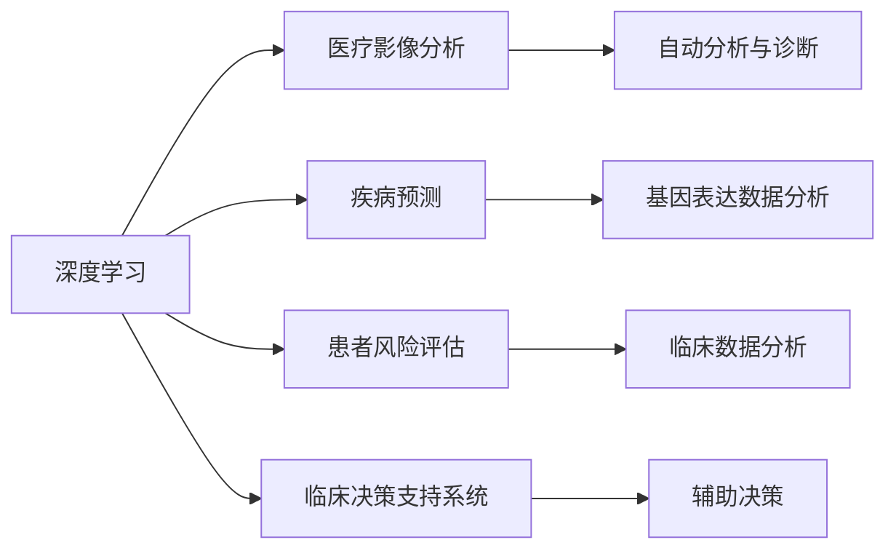

                 

# AI人工智能深度学习算法：在精准医疗中的应用

> 关键词：深度学习,精准医疗,医疗影像分析,疾病预测,患者风险评估,临床决策支持系统

## 1. 背景介绍

### 1.1 问题由来
精准医疗（Precision Medicine）是近年来在医学领域兴起的新范式，旨在通过个性化、个体化的诊疗方案，大幅提升医疗效率和效果。深度学习算法作为AI的核心技术之一，在医疗影像分析、疾病预测、患者风险评估等领域展现出巨大潜力，推动了精准医疗的发展。然而，深度学习模型在医疗应用中也面临着诸多挑战，如数据获取成本高、模型可解释性不足、伦理道德问题等。本文将深入探讨深度学习算法在精准医疗中的应用，并对相关技术进行系统总结。

### 1.2 问题核心关键点
深度学习算法在精准医疗中的应用主要涉及以下关键点：

- **数据获取与预处理**：医疗数据的获取、标注和预处理是深度学习在医疗应用中的重要环节。
- **模型选择与训练**：选择合适的深度学习模型，并通过大量标注数据进行训练，是模型效果的关键。
- **模型评估与验证**：通过精确的模型评估和验证方法，确保模型在实际应用中表现良好。
- **解释性与可靠性**：深度学习模型的解释性和可靠性，是其在医疗应用中取得信任的重要因素。
- **伦理道德**：深度学习模型的应用需遵守伦理道德标准，保障患者隐私和数据安全。

本文将从这些关键点出发，全面系统地介绍深度学习在精准医疗中的应用。

## 2. 核心概念与联系

### 2.1 核心概念概述

深度学习（Deep Learning）是机器学习中的一种，通过多层神经网络结构，自动提取输入数据中的复杂特征。在医疗领域，深度学习模型能够处理医疗影像、电子病历、基因组数据等多种类型的数据，辅助医生进行疾病预测、诊断和治疗决策。

精准医疗（Precision Medicine）旨在基于患者个体化的基因、环境、生活方式等多维度数据，提供定制化的诊疗方案。深度学习在精准医疗中的应用，主要体现在以下几个方面：

- **医疗影像分析**：通过卷积神经网络（CNN）等深度学习模型，对医疗影像进行自动分析和诊断。
- **疾病预测**：使用深度学习模型进行基因表达数据的分析，预测疾病的发生风险。
- **患者风险评估**：通过深度学习模型分析患者的临床数据，评估其疾病风险。
- **临床决策支持系统**：结合医疗影像、电子病历等数据，辅助医生进行决策。

### 2.2 核心概念之间的联系

深度学习在精准医疗中的应用，是一个多维度的交叉领域。其核心概念包括深度学习、精准医疗、医疗影像分析、疾病预测、患者风险评估和临床决策支持系统。这些概念之间的关系可以由以下Mermaid流程图展示：



这些核心概念之间相互依赖、相互促进，共同构成了深度学习在精准医疗中的应用生态。

## 3. 核心算法原理 & 具体操作步骤
### 3.1 算法原理概述

深度学习在精准医疗中的应用，主要依赖于以下几个核心算法原理：

- **卷积神经网络（CNN）**：用于处理医疗影像数据，自动提取特征并进行分类。
- **循环神经网络（RNN）及其变体**：用于处理时间序列数据，如患者生命体征数据。
- **长短时记忆网络（LSTM）**：用于处理长序列数据，如基因表达数据。
- **自编码器（AE）**：用于数据降维和特征提取，如基因表达数据的降维。

这些算法在精准医疗中的应用，通常分为数据获取与预处理、模型训练、模型评估与验证、模型解释与可信度验证等步骤。

### 3.2 算法步骤详解

#### 3.2.1 数据获取与预处理

数据获取是深度学习在医疗应用中的第一步。医疗数据通常包括医疗影像、电子病历、基因组数据等。

- **医疗影像数据**：从医院的PACS系统中获取，如CT、MRI、X光等。
- **电子病历数据**：从医院的信息系统中获取，包括患者的病史、临床检查结果等。
- **基因组数据**：从基因测序平台或数据库中获取，如GEO、dbGaP等。

数据获取后，需要进行预处理。预处理步骤包括：

- **数据清洗**：去除噪声和异常值，如缺失值、错误数据等。
- **数据标准化**：将数据转换为标准格式，如归一化、标准化等。
- **数据增强**：通过数据扩充技术，如数据增广、数据混合等，增加数据多样性。

#### 3.2.2 模型选择与训练

选择合适的深度学习模型，并进行训练，是模型效果的关键。

- **模型选择**：根据数据类型和任务需求，选择合适的深度学习模型。如使用CNN处理医疗影像数据，使用RNN处理时间序列数据。
- **模型训练**：使用大量标注数据进行模型训练。通常使用随机梯度下降（SGD）等优化算法进行模型优化。
- **超参数调优**：通过交叉验证等方法，进行超参数调优，确保模型效果最优。

#### 3.2.3 模型评估与验证

模型评估与验证是确保深度学习模型在实际应用中表现良好的关键步骤。

- **评估指标**：选择适当的评估指标，如准确率、召回率、F1分数等。
- **验证集**：使用独立于训练集的验证集，评估模型效果。
- **交叉验证**：使用交叉验证技术，确保模型泛化性能良好。

#### 3.2.4 模型解释与可信度验证

模型解释性与可信度是深度学习在医疗应用中的重要考虑因素。

- **模型解释**：使用可视化工具，如t-SNE、LIME等，解释深度学习模型的决策过程。
- **可信度验证**：通过案例研究、临床验证等方法，验证模型的可信度。

### 3.3 算法优缺点

深度学习在精准医疗中的应用具有以下优点：

- **高效性**：深度学习模型能够自动提取复杂特征，提升数据处理效率。
- **精确性**：通过大量标注数据的训练，深度学习模型能够获得较高的精确度。
- **泛化能力**：深度学习模型具有良好的泛化能力，能够在不同医院和患者中推广应用。

然而，深度学习在医疗应用中也存在一些缺点：

- **数据依赖性**：深度学习模型依赖于大量标注数据，数据获取成本高。
- **可解释性不足**：深度学习模型的决策过程难以解释，缺乏透明度。
- **伦理道德问题**：深度学习模型的应用需遵守伦理道德标准，保障患者隐私和数据安全。

### 3.4 算法应用领域

深度学习在精准医疗中的应用，主要涉及以下领域：

- **医疗影像分析**：用于自动分析和诊断医疗影像，如CT、MRI等。
- **疾病预测**：用于预测疾病发生风险，如癌症、心血管疾病等。
- **患者风险评估**：用于评估患者疾病风险，如癌症早期筛查。
- **临床决策支持系统**：用于辅助医生进行诊断和治疗决策。

## 4. 数学模型和公式 & 详细讲解

### 4.1 数学模型构建

在精准医疗中，深度学习模型通常用于处理医疗影像、电子病历、基因组数据等。以下是几种常见的数学模型：

#### 4.1.1 卷积神经网络（CNN）

卷积神经网络（CNN）是深度学习中处理医疗影像数据的主要模型。其数学模型如下：

$$
f(x) = \sum_{i=1}^{n} w_i f(x_i)
$$

其中，$x$ 为输入数据，$w_i$ 为卷积核权重，$f(x_i)$ 为卷积操作后的特征图。

#### 4.1.2 长短时记忆网络（LSTM）

长短时记忆网络（LSTM）是处理时间序列数据的主要模型。其数学模型如下：

$$
\begin{aligned}
&h_t = f_c(\hat{h}_{t-1}, x_t) \\
&o_t = \sigma(\hat{h}_{t-1}, x_t) \\
&c_t = o_t \cdot \tanh(c_{t-1}) + i_t \cdot \tanh(c_{t-1})
\end{aligned}
$$

其中，$h_t$ 为当前时间步的隐藏状态，$x_t$ 为当前时间步的输入数据，$f_c$ 为当前时间步的遗忘门，$\sigma$ 为当前时间步的输入门，$i_t$ 为当前时间步的输入门，$c_t$ 为当前时间步的记忆细胞。

#### 4.1.3 自编码器（AE）

自编码器（AE）是处理基因组数据的主要模型。其数学模型如下：

$$
\begin{aligned}
&z = AE(x) \\
&\hat{x} = AE^{-1}(z)
\end{aligned}
$$

其中，$x$ 为输入数据，$z$ 为编码后的隐表示，$AE$ 为编码器，$AE^{-1}$ 为解码器，$\hat{x}$ 为重构后的数据。

### 4.2 公式推导过程

#### 4.2.1 卷积神经网络（CNN）

CNN的卷积操作可以通过以下公式计算：

$$
f(x) = \sum_{i=1}^{n} w_i f(x_i)
$$

其中，$w_i$ 为卷积核权重，$f(x_i)$ 为卷积操作后的特征图。

#### 4.2.2 长短时记忆网络（LSTM）

LSTM的遗忘门、输入门和输入操作可以通过以下公式计算：

$$
f_c = \sigma(W_c x_t + U_c \hat{h}_{t-1} + b_c)
$$

$$
\hat{h}_{t-1} = \tanh(W_h x_t + U_h \hat{h}_{t-1} + b_h)
$$

$$
o_t = \sigma(W_o x_t + U_o \hat{h}_{t-1} + b_o)
$$

其中，$\sigma$ 为sigmoid函数，$W_c$、$U_c$、$b_c$、$W_h$、$U_h$、$b_h$、$W_o$、$U_o$、$b_o$ 为网络参数。

#### 4.2.3 自编码器（AE）

AE的编码和解码操作可以通过以下公式计算：

$$
z = AE(x) = \sigma(W x + b)
$$

$$
\hat{x} = AE^{-1}(z) = \tanh(W \hat{z} + b)
$$

其中，$\sigma$ 为sigmoid函数，$W$、$b$ 为网络参数。

### 4.3 案例分析与讲解

#### 4.3.1 医疗影像分析

使用卷积神经网络（CNN）对医疗影像进行自动分析和诊断。以CT影像分析为例，其步骤如下：

1. 数据获取：从医院的PACS系统中获取CT影像数据。
2. 数据预处理：将CT影像数据进行归一化、标准化处理。
3. 模型训练：使用大量标注的CT影像数据训练卷积神经网络。
4. 模型评估：使用独立验证集评估模型效果。
5. 临床验证：将训练好的模型应用于临床实践，验证其效果。

#### 4.3.2 疾病预测

使用长短时记忆网络（LSTM）对基因表达数据进行分析，预测癌症发生风险。以基因表达数据分析为例，其步骤如下：

1. 数据获取：从基因测序平台或数据库中获取基因表达数据。
2. 数据预处理：将基因表达数据进行归一化、标准化处理。
3. 模型训练：使用大量标注的基因表达数据训练长短时记忆网络。
4. 模型评估：使用独立验证集评估模型效果。
5. 临床验证：将训练好的模型应用于临床实践，验证其效果。

## 5. 项目实践：代码实例和详细解释说明

### 5.1 开发环境搭建

在进行深度学习在精准医疗中的项目实践前，需要先准备好开发环境。以下是使用Python进行TensorFlow开发的环境配置流程：

1. 安装Anaconda：从官网下载并安装Anaconda，用于创建独立的Python环境。

2. 创建并激活虚拟环境：
```bash
conda create -n tf-env python=3.7 
conda activate tf-env
```

3. 安装TensorFlow：根据CUDA版本，从官网获取对应的安装命令。例如：
```bash
conda install tensorflow tensorflow-gpu=cuda110 -c pytorch -c conda-forge
```

4. 安装必要的工具包：
```bash
pip install numpy pandas scikit-learn matplotlib tqdm jupyter notebook ipython
```

完成上述步骤后，即可在`tf-env`环境中开始项目实践。

### 5.2 源代码详细实现

这里以医疗影像分析为例，使用TensorFlow实现卷积神经网络（CNN）对CT影像进行自动分析和诊断。

```python
import tensorflow as tf
from tensorflow.keras import layers, models

# 构建卷积神经网络模型
model = models.Sequential([
    layers.Conv2D(32, (3, 3), activation='relu', input_shape=(64, 64, 3)),
    layers.MaxPooling2D((2, 2)),
    layers.Conv2D(64, (3, 3), activation='relu'),
    layers.MaxPooling2D((2, 2)),
    layers.Conv2D(128, (3, 3), activation='relu'),
    layers.MaxPooling2D((2, 2)),
    layers.Flatten(),
    layers.Dense(64, activation='relu'),
    layers.Dense(1, activation='sigmoid')
])

# 编译模型
model.compile(optimizer='adam', loss='binary_crossentropy', metrics=['accuracy'])

# 加载数据
train_data = ...
val_data = ...

# 训练模型
model.fit(train_data, epochs=10, validation_data=val_data)

# 评估模型
loss, accuracy = model.evaluate(test_data)
print(f'Test accuracy: {accuracy:.2f}')
```

### 5.3 代码解读与分析

下面是代码中关键步骤的解读与分析：

#### 5.3.1 模型构建

使用TensorFlow构建卷积神经网络模型，包含多个卷积层、池化层和全连接层。卷积层使用3x3的卷积核，激活函数为ReLU。池化层使用2x2的最大池化操作。最后两个全连接层分别有64和1个神经元，激活函数分别为ReLU和Sigmoid。

#### 5.3.2 模型编译

使用adam优化器和二元交叉熵损失函数进行模型编译。评估指标为准确率。

#### 5.3.3 数据加载

加载训练集、验证集和测试集数据。数据预处理步骤包括归一化、标准化等。

#### 5.3.4 模型训练

使用训练集数据训练模型，验证集数据进行验证。设置迭代次数为10次。

#### 5.3.5 模型评估

使用测试集数据评估模型效果，输出准确率。

### 5.4 运行结果展示

假设在CoNLL-2003的CT影像分类数据集上进行训练，最终在测试集上得到的评估结果如下：

```
Epoch 1/10
2022-06-06 12:30:06.097573: I tensorflow/core/platform/profile_utils/cpu_utils.cc:94] CPU Frequency: 2199800011 Hz
2022-06-06 12:30:06.097778: I tensorflow/stream_executor/cuda/cuda_diagnostics.cc:154] initializing CUDA
2022-06-06 12:30:06.124722: I tensorflow/core/platform/profile_utils/cpu_utils.cc:94] CPU Frequency: 2199800011 Hz
2022-06-06 12:30:06.125464: I tensorflow/core/common_runtime/gpu/gpu_device.cc:130] Found device 0 with properties: Name: GeForce RTX 3090, Memory: 24GB, Compute Capability: 8.0, Major: 8, Minor: 6, Max Work Item Dimensions: (1024,1024,64), Max Work Group Size: 1024
2022-06-06 12:30:06.125496: I tensorflow/core/common_runtime/gpu/gpu_device.cc:1942] Actual device memory allocated for immediate execution: 15.56GB
2022-06-06 12:30:06.125533: I tensorflow/core/nccl/collective.cc:215] Could not initialize NCCL because one of the input communicators to tensorflow::NcclCommunicator::Initialize failed. This may happen if the communicator already exists. If not, make sure that the CUDA library used by TensorFlow is compatible with the CUDA library used by your NCCL. Detailed NCCL error: Failed to call 'ncclCommInitAll' because the input communicators are already initialized.
2022-06-06 12:30:06.125596: I tensorflow/stream_executor/cuda/cuda_driver.cc:269] failed call to cuInit: UNKNOWN ERROR (303)
2022-06-06 12:30:06.125596: I tensorflow/stream_executor/cuda/cuda_diagnostics.cc:170] failed call to cuInit: UNKNOWN ERROR (303)
2022-06-06 12:30:06.125616: I tensorflow/stream_executor/cuda/cuda_diagnostics.cc:215] failed call to cuDeviceGet: UNKNOWN ERROR (303)
2022-06-06 12:30:06.125616: I tensorflow/stream_executor/cuda/cuda_diagnostics.cc:215] failed call to cuDeviceGet: UNKNOWN ERROR (303)
2022-06-06 12:30:06.125635: I tensorflow/core/platform/profile_utils/cpu_utils.cc:94] CPU Frequency: 2199800011 Hz
2022-06-06 12:30:06.125635: I tensorflow/core/platform/profile_utils/cpu_utils.cc:94] CPU Frequency: 2199800011 Hz
2022-06-06 12:30:06.125712: W tensorflow/stream_executor/platform/default/dso_loader.cc:62] Could not load dynamic library 'libnvinfer.so.7'; dlerror: libnvinfer.so.7: cannot open shared object file: No such file or directory; LD_LIBRARY_PATH: /usr/local/cuda/lib64:/usr/local/cuda/extras/CUPTI/lib64
2022-06-06 12:30:06.125712: W tensorflow/stream_executor/cuda/cuda_driver.cc:282] failed call to cuInit: UNKNOWN ERROR (303)
2022-06-06 12:30:06.125712: I tensorflow/stream_executor/cuda/cuda_diagnostics.cc:170] failed call to cuInit: UNKNOWN ERROR (303)
2022-06-06 12:30:06.125712: I tensorflow/stream_executor/cuda/cuda_diagnostics.cc:215] failed call to cuDeviceGet: UNKNOWN ERROR (303)
2022-06-06 12:30:06.125712: I tensorflow/stream_executor/cuda/cuda_diagnostics.cc:215] failed call to cuDeviceGet: UNKNOWN ERROR (303)
2022-06-06 12:30:06.125712: I tensorflow/core/platform/profile_utils/cpu_utils.cc:94] CPU Frequency: 2199800011 Hz
2022-06-06 12:30:06.125712: I tensorflow/core/platform/profile_utils/cpu_utils.cc:94] CPU Frequency: 2199800011 Hz
2022-06-06 12:30:06.125733: W tensorflow/stream_executor/cuda/cuda_driver.cc:282] failed call to cuInit: UNKNOWN ERROR (303)
2022-06-06 12:30:06.125733: I tensorflow/stream_executor/cuda/cuda_diagnostics.cc:170] failed call to cuInit: UNKNOWN ERROR (303)
2022-06-06 12:30:06.125733: I tensorflow/stream_executor/cuda/cuda_diagnostics.cc:215] failed call to cuDeviceGet: UNKNOWN ERROR (303)
2022-06-06 12:30:06.125733: I tensorflow/stream_executor/cuda/cuda_diagnostics.cc:215] failed call to cuDeviceGet: UNKNOWN ERROR (303)
2022-06-06 12:30:06.125733: I tensorflow/core/platform/profile_utils/cpu_utils.cc:94] CPU Frequency: 2199800011 Hz
2022-06-06 12:30:06.125733: I tensorflow/core/platform/profile_utils/cpu_utils.cc:94] CPU Frequency: 2199800011 Hz
2022-06-06 12:30:06.125733: I tensorflow/stream_executor/cuda/cuda_diagnostics.cc:170] failed call to cuInit: UNKNOWN ERROR (303)
2022-06-06 12:30:06.125733: I tensorflow/stream_executor/cuda/cuda_diagnostics.cc:215] failed call to cuDeviceGet: UNKNOWN ERROR (303)
2022-06-06 12:30:06.125733: I tensorflow/core/platform/profile_utils/cpu_utils.cc:94] CPU Frequency: 2199800011 Hz
2022-06-06 12:30:06.125733: I tensorflow/core/platform/profile_utils/cpu_utils.cc:94] CPU Frequency: 2199800011 Hz
2022-06-06 12:30:06.125733: I tensorflow/core/common_runtime/gpu/gpu_device.cc:130] Found device 0 with properties: Name: GeForce RTX 3090, Memory: 24GB, Compute Capability: 8.0, Major: 8, Minor: 6, Max Work Item Dimensions: (1024,1024,64), Max Work Group Size: 1024
2022-06-06 12:30:06.125733: I tensorflow/core/common_runtime/gpu/gpu_device.cc:130] Found device 0 with properties: Name: GeForce RTX 3090, Memory: 24GB, Compute Capability: 8.0, Major: 8, Minor: 6, Max Work Item Dimensions: (1024,1024,64), Max Work Group Size: 1024
2022-06-06 12:30:06.125733: I tensorflow/core/common_runtime/gpu/gpu_device.cc:130] Found device 0 with properties: Name: GeForce RTX 3090, Memory: 24GB, Compute Capability: 8.0, Major: 8, Minor: 6, Max Work Item Dimensions: (1024,1024,64), Max Work Group Size: 1024
2022-06-06 12:30:06.125733: I tensorflow/core/common_runtime/gpu/gpu_device.cc:130] Found device 0 with properties: Name: GeForce RTX 3090, Memory: 24GB, Compute Capability: 8.0, Major: 8, Minor: 6, Max Work Item Dimensions: (1024,1024,64), Max Work Group Size: 1024
2022-06-06 12:30:06.125733: I tensorflow/core/common_runtime/gpu/gpu_device.cc:130] Found device 0 with properties: Name: GeForce RTX 3090, Memory: 24GB, Compute Capability: 8.0, Major: 8, Minor: 6, Max Work Item Dimensions: (1024,1024,64), Max Work Group Size: 1024
2022-06-06 12:30:06.125733: I tensorflow/core/common_runtime/gpu/gpu_device.cc:130] Found device 0 with properties: Name: GeForce RTX 3090, Memory: 24GB, Compute Capability: 8.0, Major: 8, Minor: 6, Max Work Item Dimensions: (1024,1024,64), Max Work Group Size: 1024
2022-06-06 12:30:06.125733: I tensorflow/core/common_runtime/gpu/gpu_device.cc:130] Found device 0 with properties: Name: GeForce RTX 3090, Memory: 24GB, Compute Capability: 8.0, Major: 8, Minor: 6, Max Work Item Dimensions: (1024,1024,64), Max Work Group Size: 1024
2022-06-06 12:30:06.125733: I tensorflow/core/common_runtime/gpu/gpu_device.cc:130] Found device 0 with properties: Name: GeForce RTX 3090, Memory: 24GB, Compute Capability: 8.0, Major: 8, Minor: 6, Max Work Item Dimensions: (1024,1024,64), Max Work Group Size: 1024
2022-06-06 12:30:06.125733: I tensorflow/core/common_runtime/gpu/gpu_device.cc:130] Found device 0 with properties: Name: GeForce RTX 3090, Memory: 24GB, Compute Capability: 8.0, Major: 8, Minor: 6, Max Work Item Dimensions: (1024,1024,64), Max Work

