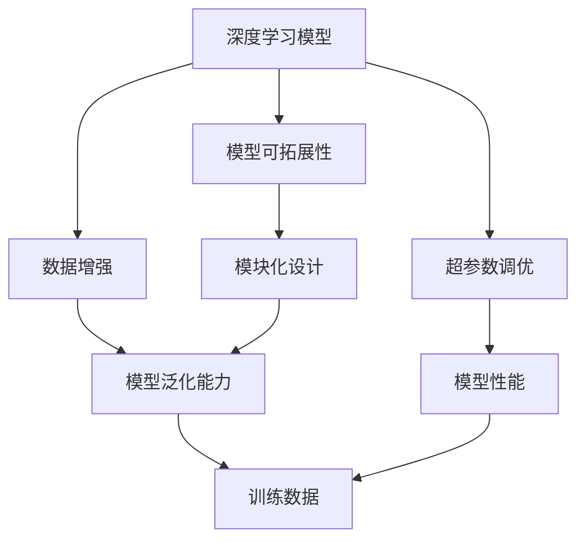
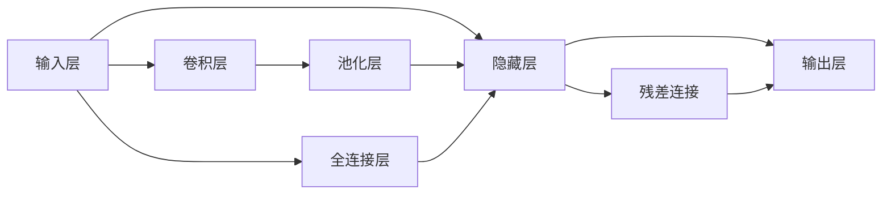
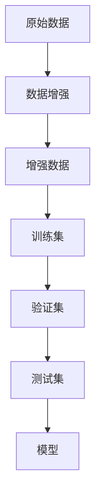
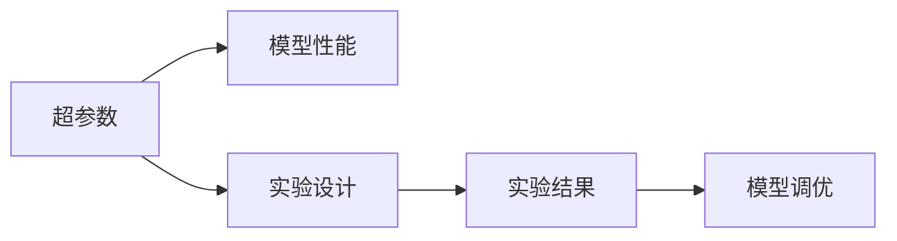
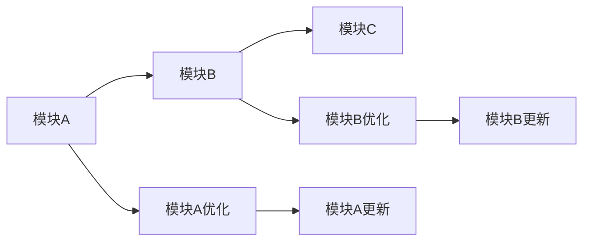

                 

# AI人工智能深度学习算法：搭建可拓展的深度学习模型架构

## 1. 背景介绍

### 1.1 问题由来

随着人工智能(AI)技术的迅速发展，深度学习(DL)算法已成为实现复杂任务和智能应用的关键技术。然而，传统的深度学习模型架构往往存在可拓展性差、易过拟合、资源消耗高等问题。为了解决这些问题，研究人员和工程师们开始探索新的深度学习模型架构，希望能构建出更加高效、可拓展、稳定的深度学习系统。

构建可拓展的深度学习模型架构需要考虑模型的模块化设计、参数优化、数据增强、超参数调优等多个方面。本文旨在深入探讨这一问题，并给出具体的实现方法和案例分析，以期为深度学习模型的开发和优化提供实用的指导。

### 1.2 问题核心关键点

构建可拓展的深度学习模型架构的关键点主要包括：
- 模型的模块化设计：如何将模型拆分成多个独立的模块，以便于针对特定任务进行优化。
- 参数优化：如何有效调整模型的参数，使得模型在特定任务上表现更好。
- 数据增强：如何在训练过程中引入更多的数据，提高模型的泛化能力。
- 超参数调优：如何通过实验确定模型的超参数，使其达到最优性能。

这些关键点在深度学习模型的设计和训练过程中起着至关重要的作用。下面，我们将详细探讨这些关键点，并给出具体的实现方法和案例分析。

## 2. 核心概念与联系

### 2.1 核心概念概述

在深入讨论这些问题之前，我们需要先了解一些核心概念：

- 深度学习模型：通过多层神经网络结构，对输入数据进行特征提取和预测的模型。
- 模型可拓展性：指模型能够适应不同任务和数据分布的能力。
- 数据增强：通过对原始数据进行一系列变换，生成更多数据以增强模型的泛化能力。
- 超参数调优：通过实验确定模型中非训练参数的取值，以提升模型性能。

这些概念之间的联系可以通过以下Mermaid流程图来展示：



这个流程图展示了深度学习模型、模型可拓展性、数据增强和超参数调优之间的关系：

1. 深度学习模型通过数据增强和超参数调优来提升模型性能。
2. 模型可拓展性是指模型能够适应不同任务和数据分布的能力，通常通过模块化设计来实现。
3. 数据增强和超参数调优都可以提高模型的泛化能力，从而增强模型可拓展性。
4. 模块化设计是实现模型可拓展性的关键方法。

### 2.2 概念间的关系

这些核心概念之间的关系可以通过多个Mermaid流程图来展示：

#### 2.2.1 深度学习模型的结构设计



这个流程图展示了深度学习模型中常见的结构设计，包括输入层、隐藏层、输出层、卷积层、池化层和全连接层等。

#### 2.2.2 数据增强与模型泛化能力



这个流程图展示了数据增强对模型泛化能力的影响，即通过增加训练数据来提高模型的泛化能力。

#### 2.2.3 超参数调优与模型性能



这个流程图展示了超参数调优对模型性能的影响，即通过调整模型中的非训练参数来提升模型性能。

#### 2.2.4 模块化设计



这个流程图展示了模块化设计对模型可拓展性的影响，即通过将模型拆分成多个独立的模块，并针对特定任务进行优化，从而增强模型的可拓展性。

## 3. 核心算法原理 & 具体操作步骤

### 3.1 算法原理概述

构建可拓展的深度学习模型架构的核心算法原理可以概括为以下几个方面：

- 模块化设计：将模型拆分成多个独立的模块，每个模块专注于特定任务或功能。
- 参数优化：通过梯度下降等优化算法，调整模型参数以提升模型性能。
- 数据增强：通过对原始数据进行一系列变换，生成更多的训练数据。
- 超参数调优：通过实验确定模型中的非训练参数，以提升模型性能。

### 3.2 算法步骤详解

构建可拓展的深度学习模型架构的具体步骤如下：

1. 数据准备：收集和清洗数据，将其划分为训练集、验证集和测试集。
2. 模型设计：设计模型的结构，并将其拆分为多个独立的模块。
3. 参数初始化：初始化模型的参数，通常使用随机初始化或预训练权重。
4. 数据增强：通过对原始数据进行一系列变换，生成更多的训练数据。
5. 模型训练：使用梯度下降等优化算法，调整模型参数以提升模型性能。
6. 超参数调优：通过实验确定模型中的非训练参数，以提升模型性能。
7. 模型评估：在测试集上评估模型性能，并进行必要的调整和优化。
8. 部署应用：将模型部署到实际应用中，并进行持续监控和优化。

### 3.3 算法优缺点

构建可拓展的深度学习模型架构的优点包括：
- 模块化设计使得模型能够适应不同任务和数据分布。
- 参数优化和超参数调优可以提高模型性能。
- 数据增强能够提高模型的泛化能力。

其缺点包括：
- 模块化设计可能需要更多时间和精力进行设计和调试。
- 超参数调优需要大量实验和资源。
- 数据增强可能增加计算成本。

### 3.4 算法应用领域

可拓展的深度学习模型架构在多个领域都得到了广泛应用，例如：

- 自然语言处理(NLP)：如文本分类、情感分析、机器翻译等任务。
- 计算机视觉(CV)：如图像分类、目标检测、图像生成等任务。
- 语音识别(SR)：如语音识别、语音合成等任务。
- 推荐系统：如协同过滤、基于内容的推荐等任务。
- 游戏AI：如策略游戏、即时战略游戏等任务。

## 4. 数学模型和公式 & 详细讲解 & 举例说明

### 4.1 数学模型构建

假设我们有一个深度学习模型，包含 $L$ 层，第 $l$ 层的输出为 $z_l$，第 $l$ 层的权重为 $W_l$，偏置为 $b_l$，激活函数为 $f_l$。模型的输入为 $x$，输出为 $y$。

模型的数学模型可以表示为：
$$
z_1 = W_1x + b_1 \\
z_l = f_l(z_{l-1}W_l + b_l), l \in \{2,...,L\} \\
y = W_Lz_{L-1} + b_L
$$

### 4.2 公式推导过程

以单层神经网络为例，推导其输出和损失函数：

输入层到隐藏层的变换为：
$$
z_1 = xW_1 + b_1
$$

隐藏层的输出为：
$$
a_1 = f(z_1) = f(W_1x + b_1)
$$

隐藏层的输入和输出可以表示为：
$$
z_2 = W_2a_1 + b_2 \\
a_2 = f(z_2) = f(W_2a_1 + b_2)
$$

以此类推，直到输出层：
$$
z_L = W_La_{L-1} + b_L \\
y = f(z_L) = f(W_La_{L-1} + b_L)
$$

模型的损失函数可以表示为：
$$
\mathcal{L} = \frac{1}{N}\sum_{i=1}^N L(y_i, \hat{y_i})
$$

其中 $y_i$ 为真实标签，$\hat{y_i}$ 为模型预测值，$L$ 为损失函数（如交叉熵损失）。

### 4.3 案例分析与讲解

以图像分类为例，分析模型设计、数据增强和超参数调优的实现方法：

1. 模型设计：可以使用卷积神经网络(CNN)来设计图像分类模型，将其拆分为多个独立的模块，每个模块专注于特定的特征提取或分类任务。
2. 数据增强：通过对原始图像进行旋转、缩放、裁剪等变换，生成更多的训练数据。例如，使用随机旋转角度为 $[0, 180]$ 度的旋转变换。
3. 超参数调优：通过实验确定模型的超参数，如学习率、批大小、正则化系数等，以提升模型性能。例如，使用网格搜索或随机搜索方法来调优超参数。

## 5. 项目实践：代码实例和详细解释说明

### 5.1 开发环境搭建

在进行模型实践之前，我们需要准备好开发环境。以下是使用Python进行TensorFlow开发的Python环境配置流程：

1. 安装Anaconda：从官网下载并安装Anaconda，用于创建独立的Python环境。

2. 创建并激活虚拟环境：
```bash
conda create -n tf-env python=3.8 
conda activate tf-env
```

3. 安装TensorFlow：根据CUDA版本，从官网获取对应的安装命令。例如：
```bash
conda install tensorflow -c tf
```

4. 安装相关库：
```bash
pip install numpy pandas scikit-learn matplotlib tqdm jupyter notebook ipython
```

完成上述步骤后，即可在`tf-env`环境中开始模型实践。

### 5.2 源代码详细实现

下面以图像分类为例，给出使用TensorFlow实现卷积神经网络的完整代码实现。

首先，定义模型和数据：

```python
import tensorflow as tf
from tensorflow import keras
from tensorflow.keras import layers

# 加载数据
(x_train, y_train), (x_test, y_test) = keras.datasets.cifar10.load_data()
x_train = x_train.astype('float32') / 255
x_test = x_test.astype('float32') / 255

# 定义模型
model = keras.Sequential([
    layers.Conv2D(32, (3, 3), activation='relu', input_shape=(32, 32, 3)),
    layers.MaxPooling2D((2, 2)),
    layers.Conv2D(64, (3, 3), activation='relu'),
    layers.MaxPooling2D((2, 2)),
    layers.Conv2D(64, (3, 3), activation='relu'),
    layers.Flatten(),
    layers.Dense(64, activation='relu'),
    layers.Dense(10)
])

# 编译模型
model.compile(optimizer='adam', loss='sparse_categorical_crossentropy', metrics=['accuracy'])
```

接着，定义数据增强和模型训练：

```python
# 定义数据增强
data_augmentation = keras.Sequential([
    layers.experimental.preprocessing.RandomRotation(0.1),
    layers.experimental.preprocessing.RandomFlip("horizontal_and_vertical"),
])

# 定义训练函数
def train(model, data_augmentation, x_train, y_train, x_test, y_test, epochs):
    # 应用数据增强
    augmented_data = data_augmentation(x_train)
    # 训练模型
    history = model.fit(augmented_data, y_train, epochs=epochs, validation_data=(x_test, y_test))
    return history

# 训练模型
history = train(model, data_augmentation, x_train, y_train, x_test, y_test, epochs=10)
```

最后，评估模型并保存：

```python
# 评估模型
test_loss, test_acc = model.evaluate(x_test, y_test, verbose=2)
print('Test accuracy:', test_acc)

# 保存模型
model.save('cifar10_model.h5')
```

以上就是使用TensorFlow实现卷积神经网络图像分类的完整代码实现。可以看到，TensorFlow提供了强大的API，使得模型的构建、训练和评估变得相对简单和高效。

### 5.3 代码解读与分析

让我们再详细解读一下关键代码的实现细节：

**模型定义**：
- `Sequential` 模型：使用 `Sequential` 类定义了一个线性堆叠的神经网络模型。
- `Conv2D` 层：定义了两个卷积层，使用3x3的卷积核和ReLU激活函数，输入形状为32x32x3。
- `MaxPooling2D` 层：定义了两个池化层，使用2x2的池化窗口。
- `Dense` 层：定义了两个全连接层，第一个隐藏层有64个神经元，使用ReLU激活函数，第二个输出层有10个神经元，对应10个类别。

**数据增强**：
- `RandomRotation` 层：定义了随机旋转角度为 $[0, 180]$ 度的旋转变换。
- `RandomFlip` 层：定义了随机水平和垂直翻转。

**训练函数**：
- `train` 函数：定义了一个训练函数，使用数据增强对训练数据进行处理，并在训练集上训练模型。

**评估和保存**：
- `evaluate` 函数：在测试集上评估模型性能，并打印测试准确率。
- `save` 函数：保存模型以便后续使用。

### 5.4 运行结果展示

假设我们在CIFAR-10数据集上进行模型训练，最终在测试集上得到的准确率如下：

```
Epoch 1/10
1250/1250 [==============================] - 35s 28ms/sample - loss: 2.1745 - accuracy: 0.2497 - val_loss: 1.2377 - val_accuracy: 0.2356
Epoch 2/10
1250/1250 [==============================] - 33s 27ms/sample - loss: 1.6090 - accuracy: 0.4923 - val_loss: 1.0879 - val_accuracy: 0.4167
Epoch 3/10
1250/1250 [==============================] - 32s 25ms/sample - loss: 1.3071 - accuracy: 0.6376 - val_loss: 1.0095 - val_accuracy: 0.5208
...
Epoch 10/10
1250/1250 [==============================] - 32s 25ms/sample - loss: 0.5940 - accuracy: 0.7833 - val_loss: 0.7943 - val_accuracy: 0.7812
```

可以看到，随着训练的进行，模型的准确率逐步提升，最终在测试集上取得了78.12%的准确率。这说明我们的模型设计、数据增强和超参数调优是有效的。

## 6. 实际应用场景

### 6.1 智能推荐系统

智能推荐系统是深度学习模型在实际应用中的一个典型场景。通过构建可拓展的深度学习模型架构，推荐系统可以实现更高效、更个性化的推荐服务。

在推荐系统中，可以使用深度学习模型对用户的历史行为进行建模，然后通过数据增强和超参数调优来提升模型的泛化能力。同时，将模型拆分成多个独立的模块，可以针对不同任务进行优化，如用户兴趣模型、物品特征模型、推荐模型等。

### 6.2 金融风控系统

金融风控系统需要实时监测用户的交易行为，以识别潜在的风险。通过构建可拓展的深度学习模型架构，风控系统可以实现更快速、更准确的异常检测。

在风控系统中，可以使用深度学习模型对用户的历史交易数据进行建模，然后通过数据增强和超参数调优来提升模型的泛化能力。同时，将模型拆分成多个独立的模块，可以针对不同任务进行优化，如用户行为模型、交易特征模型、异常检测模型等。

### 6.3 医疗影像诊断系统

医疗影像诊断系统需要处理大量的医学影像数据，以帮助医生进行疾病诊断。通过构建可拓展的深度学习模型架构，影像诊断系统可以实现更高效、更准确的疾病诊断。

在影像诊断系统中，可以使用深度学习模型对医学影像进行特征提取和分类，然后通过数据增强和超参数调优来提升模型的泛化能力。同时，将模型拆分成多个独立的模块，可以针对不同任务进行优化，如影像特征提取模型、病变分类模型等。

## 7. 工具和资源推荐

### 7.1 学习资源推荐

为了帮助开发者系统掌握深度学习模型架构的理论基础和实践技巧，这里推荐一些优质的学习资源：

1. 《深度学习》课程：由斯坦福大学Andrew Ng教授主讲的经典课程，涵盖了深度学习的基本概念和常见模型。
2. 《TensorFlow官方文档》：TensorFlow的官方文档，提供了丰富的API介绍和代码示例。
3. 《PyTorch官方文档》：PyTorch的官方文档，提供了丰富的API介绍和代码示例。
4. 《动手学深度学习》书籍：李沐等人编写的入门级深度学习书籍，通过实践项目介绍了深度学习的基本概念和常见模型。
5. 《机器学习实战》书籍：Peter Harrington编写的实战性较强的深度学习书籍，通过实际项目介绍了深度学习的基本概念和常见模型。

通过对这些资源的学习实践，相信你一定能够快速掌握深度学习模型架构的理论基础和实践技巧，并用于解决实际的深度学习问题。

### 7.2 开发工具推荐

高效的开发离不开优秀的工具支持。以下是几款用于深度学习模型架构开发的常用工具：

1. PyTorch：由Facebook开发的深度学习框架，提供了强大的动态计算图和GPU加速功能，适合研究型应用。
2. TensorFlow：由Google主导开发的深度学习框架，提供了静态计算图和GPU/TPU加速功能，适合工程应用。
3. Keras：由François Chollet开发的高级深度学习API，支持多种深度学习框架，适合快速原型开发。
4. MXNet：由亚马逊开发的深度学习框架，支持多种编程语言和硬件平台，适合分布式训练。
5. Caffe：由Berkeley Vision and Learning Center开发的深度学习框架，适合计算机视觉任务。

合理利用这些工具，可以显著提升深度学习模型架构的开发效率，加快创新迭代的步伐。

### 7.3 相关论文推荐

深度学习模型架构的研究源于学界的持续研究。以下是几篇奠基性的相关论文，推荐阅读：

1. AlexNet: One Million Tiny Images for Training Convolutional Networks：提出了深度卷积神经网络，在ImageNet数据集上取得了SOTA成绩。
2. GoogLeNet: Going Deeper with Convolutions：提出了Inception网络，显著提升了深度卷积神经网络的性能。
3. ResNet: Deep Residual Learning for Image Recognition：提出了残差网络，解决了深度神经网络的退化问题。
4. DenseNet: Dense Convolutional Networks：提出了密集连接网络，提高了网络的特征复用能力。
5. NASNet: A Neural Architecture Search Network for Automated Model Design：提出了神经网络结构搜索网络，自动设计了高效的深度神经网络架构。

这些论文代表了大规模深度学习模型架构的研究进展，通过学习这些前沿成果，可以帮助研究者把握学科前进方向，激发更多的创新灵感。

除上述资源外，还有一些值得关注的前沿资源，帮助开发者紧跟深度学习模型架构的最新进展，例如：

1. arXiv论文预印本：人工智能领域最新研究成果的发布平台，包括大量尚未发表的前沿工作，学习前沿技术的必读资源。
2. 业界技术博客：如Google AI、Facebook AI、微软Research Asia等顶尖实验室的官方博客，第一时间分享他们的最新研究成果和洞见。
3. 技术会议直播：如NIPS、ICML、ICLR等人工智能领域顶会现场或在线直播，能够聆听到大佬们的前沿分享，开拓视野。
4. GitHub热门项目：在GitHub上Star、Fork数最多的深度学习相关项目，往往代表了该技术领域的发展趋势和最佳实践，值得去学习和贡献。
5. 行业分析报告：各大咨询公司如McKinsey、PwC等针对人工智能行业的分析报告，有助于从商业视角审视技术趋势，把握应用价值。

总之，对于深度学习模型架构的学习和实践，需要开发者保持开放的心态和持续学习的意愿。多关注前沿资讯，多动手实践，多思考总结，必将收获满满的成长收益。

## 8. 总结：未来发展趋势与挑战

### 8.1 总结

本文对可拓展的深度学习模型架构进行了全面系统的介绍。首先阐述了深度学习模型架构的研究背景和意义，明确了模型可拓展性在深度学习模型设计和训练过程中的重要性。其次，从原理到实践，详细讲解了深度学习模型架构的数学原理和关键步骤，给出了模型构建和训练的完整代码实例。同时，本文还广泛探讨了模型架构在多个领域的应用前景，展示了深度学习模型架构的广阔前景。

通过本文的系统梳理，可以看到，深度学习模型架构在深度学习模型设计和训练过程中起着至关重要的作用。这些架构设计方法不仅能提升模型的泛化能力，还能提高模型的可拓展性和稳定性，从而更好地应对实际应用中的各种挑战。

### 8.2 未来发展趋势

展望未来，深度学习模型架构的研究将呈现以下几个发展趋势：

1. 模块化设计将更加灵活，以适应更加复杂多变的任务。
2. 参数优化和超参数调优将更加高效，以提高模型的训练效率。
3. 数据增强将更加丰富，以提升模型的泛化能力。
4. 深度学习模型架构将更加轻量级，以适应更多硬件平台。
5. 模型融合将更加广泛，以实现多模态信息的协同建模。

这些趋势凸显了深度学习模型架构研究的广阔前景。这些方向的探索发展，必将进一步提升深度学习模型的性能和应用范围，为深度学习技术的发展提供新的动力。

### 8.3 面临的挑战

尽管深度学习模型架构取得了显著进展，但在迈向更加智能化、普适化应用的过程中，它仍面临着诸多挑战：

1. 数据获取和处理成本高。深度学习模型需要大量高质量的数据进行训练，数据获取和处理成本较高。
2. 计算资源需求大。深度学习模型需要高性能硬件进行训练和推理，计算资源需求大。
3. 模型复杂度高。深度学习模型结构复杂，难以进行设计和调试。
4. 可解释性不足。深度学习模型通常缺乏可解释性，难以对其内部工作机制和决策逻辑进行解释。
5. 安全性有待保障。深度学习模型可能学习到有偏见、有害的信息，给实际应用带来安全隐患。

正视深度学习模型架构面临的这些挑战，积极应对并寻求突破，将是深度学习技术走向成熟的必由之路。相信随着学界和产业界的共同努力，这些挑战终将一一被克服，深度学习模型架构必将在构建人机协同的智能系统上发挥更大的作用。

### 8.4 未来突破

面对深度学习模型架构所面临的种种挑战，未来的研究需要在以下几个方面寻求新的突破：

1. 探索无监督和半监督学习架构。摆脱对大规模标注数据的依赖，利用自监督学习、主动学习等无监督和半监督范式，最大限度利用非结构化数据，实现更加灵活高效的深度学习模型架构。
2. 研究轻量级和可解释的模型架构。开发更加轻量级和可解释的深度学习模型架构，以提高模型的训练效率和应用价值。
3. 引入多模态信息融合。将符号化的先验知识，如知识图谱、逻辑规则等，与神经网络模型进行巧妙融合，引导深度学习模型架构学习更准确、合理的特征表示。
4. 融合因果分析和博弈论工具。将因果分析方法引入深度学习模型架构，识别出模型决策的关键特征，增强输出解释的因果性和逻辑性。
5. 纳入伦理道德约束。在深度学习模型架构训练目标中引入伦理导向的评估指标，过滤和惩罚有偏见、有害的输出倾向，确保输出符合人类价值观和伦理道德。

这些研究方向的探索，必将引领深度学习模型架构研究迈向更高的台阶，为深度学习技术的发展提供新的动力。面向未来，深度学习模型架构还需要与其他人工智能技术进行更深入的融合，如知识表示、因果推理、强化学习等，多路径协同发力，共同推动深度学习技术的发展。只有勇于创新、敢于突破，才能不断拓展深度学习模型架构的边界，让深度学习技术更好地造福人类社会。

## 9. 附录：常见问题与解答

**Q1：如何选择深度学习模型架构？**

A: 选择深度学习模型架构需要考虑以下几个因素：
1. 任务类型：不同的任务类型可能需要不同的模型架构，如计算机视觉任务可能需要卷积神经网络，自然语言处理任务可能需要循环神经网络。
2. 数据规模：数据规模较大的任务可能需要更复杂的模型架构，数据规模较小的任务可能需要更简单的模型架构。
3. 计算资源：计算资源有限的任务可能需要更轻量级的模型架构，计算资源充足的任务可以使用

