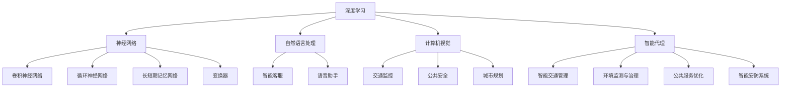
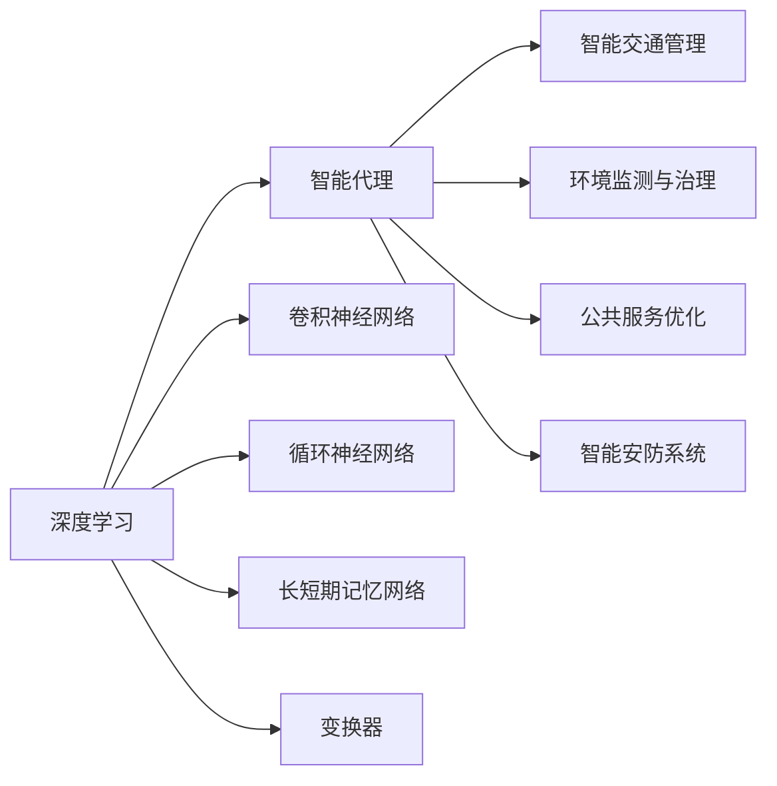
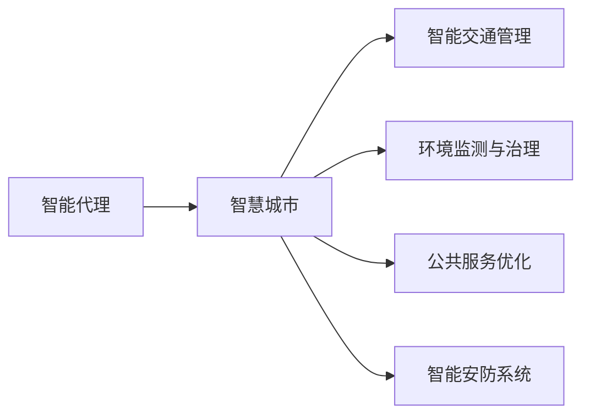
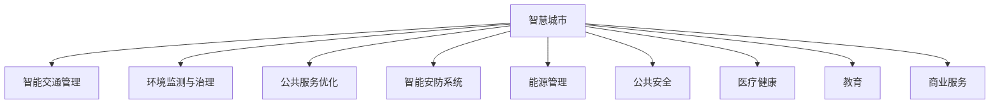
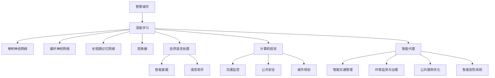

                 

# AI人工智能深度学习算法：智能深度学习代理在智慧城市中的实践

## 1. 背景介绍

### 1.1 问题由来
智慧城市是近年来全球范围内蓬勃发展的新型城市发展模式，它通过现代信息技术，特别是人工智能(AI)和深度学习技术，对城市基础设施、公共服务、环境监测、交通管理等领域进行智能化、高效化改造，从而提升城市的运营效率和生活质量。

深度学习，作为人工智能的重要分支，通过构建多层次的神经网络模型，能够对复杂数据进行高效、准确的特征提取和模式识别，具备强大的自主学习能力和泛化能力。随着深度学习技术的不断突破，其广泛应用于图像识别、语音处理、自然语言处理、推荐系统等领域，成为推动智慧城市建设的重要技术手段。

### 1.2 问题核心关键点
深度学习在智慧城市建设中的应用，主要体现在以下几个方面：

1. **数据驱动决策**：通过收集城市各类数据（如交通流量、环境质量、能源消耗等），构建数据驱动的智慧城市决策模型，提高城市管理和服务的智能化水平。

2. **智能交通管理**：利用深度学习技术对交通数据进行实时分析和预测，优化交通信号灯控制、交通流量预测和路径规划，提升城市交通的效率和安全性。

3. **环境监测与治理**：通过深度学习模型分析环境监测数据，识别环境污染源和污染趋势，制定更科学的环境治理措施，保护城市生态环境。

4. **公共服务优化**：深度学习模型可应用于医疗、教育、公共安全等领域，提高公共服务的质量和效率，增强居民的获得感和幸福感。

5. **智能安防系统**：结合图像处理和视频分析技术，深度学习模型在智慧安防中可实现面部识别、异常行为检测等应用，提升城市安全水平。

### 1.3 问题研究意义
深度学习在智慧城市中的应用，有助于构建高效、智能的城市基础设施，优化城市管理和服务，提升城市运行效率和生活质量。其研究意义主要体现在以下几个方面：

1. **推动智慧城市建设**：深度学习技术能够从海量数据中挖掘有价值的信息，为智慧城市建设提供强有力的技术支撑。

2. **提升城市管理效率**：通过智能分析和预测，深度学习技术可优化城市资源的配置和利用，提高城市管理的智能化水平。

3. **改善居民生活体验**：深度学习技术能够提供个性化的公共服务，提升居民的生活质量和社会满意度。

4. **促进经济社会发展**：智慧城市中的深度学习应用，有助于提升产业竞争力，推动经济社会的高质量发展。

## 2. 核心概念与联系

### 2.1 核心概念概述

为更好地理解深度学习在智慧城市中的应用，本节将介绍几个密切相关的核心概念：

- **深度学习**：一种基于神经网络的机器学习方法，通过多层次的非线性变换，自动提取数据特征，用于模式识别、分类、回归等任务。深度学习模型包括卷积神经网络(CNN)、循环神经网络(RNN)、长短期记忆网络(LSTM)、变换器(Transformer)等。

- **智慧城市**：利用信息通信技术(ICT)和大数据技术，整合城市资源和公共服务，实现城市管理的智能化、高效化和精准化，提升城市运营效率和生活质量。

- **智能代理**：一种自主学习、自主决策的智能系统，能够在复杂环境中完成特定的任务或目标，广泛应用于智慧城市中的各个领域。

- **神经网络**：一种由大量神经元节点组成的计算模型，能够对数据进行高效、并行的处理和分析，是深度学习的重要组成部分。

- **自然语言处理(NLP)**：研究计算机如何理解、处理和生成人类语言的技术，在智慧城市中广泛应用于智能客服、语音助手等领域。

- **计算机视觉**：研究如何让计算机识别、理解并生成图像和视频的技术，在智慧城市中应用于交通监控、公共安全、城市规划等。

这些核心概念之间的逻辑关系可以通过以下Mermaid流程图来展示：



这个流程图展示了深度学习在智慧城市中的核心应用，以及与智能代理、自然语言处理、计算机视觉等技术的紧密联系。

### 2.2 概念间的关系

这些核心概念之间存在着紧密的联系，形成了智慧城市中的深度学习应用框架。下面通过几个Mermaid流程图来展示这些概念之间的关系。

#### 2.2.1 深度学习与智能代理的关系



这个流程图展示了深度学习如何通过构建卷积神经网络、循环神经网络、长短期记忆网络和变换器等模型，对智慧城市中的各个领域进行智能化改造。

#### 2.2.2 智能代理与智慧城市的关系



这个流程图展示了智能代理在智慧城市中的各种应用，通过自主学习和自主决策，实现对智慧城市各个方面的高效管理和服务。

#### 2.2.3 深度学习在智慧城市中的应用领域



这个综合流程图展示了深度学习在智慧城市中的应用领域，通过不同类型的网络模型，实现对各个领域的高效管理和服务。

### 2.3 核心概念的整体架构

最后，我们用一个综合的流程图来展示这些核心概念在智慧城市中的整体架构：



这个综合流程图展示了深度学习在智慧城市中的应用过程，从数据获取、模型构建、领域应用到智能代理的各个环节，展示了一个完整的智慧城市深度学习应用体系。

## 3. 核心算法原理 & 具体操作步骤
### 3.1 算法原理概述

深度学习在智慧城市中的应用，通常涉及以下关键步骤：

1. **数据收集与预处理**：从各个城市基础设施和公共服务领域收集数据，进行清洗、去重、标准化等预处理操作，为模型训练提供高质量的数据集。

2. **模型构建与训练**：基于收集到的数据集，选择合适的深度学习模型（如CNN、RNN、LSTM、Transformer等），构建智慧城市相关的任务模型，并进行参数优化训练。

3. **模型评估与部署**：在训练完成后，通过在测试集上的评估，选择性能最优的模型，将其部署到智慧城市系统中，进行实时应用和业务集成。

### 3.2 算法步骤详解

基于深度学习的智慧城市应用一般包括以下几个关键步骤：

**Step 1: 数据收集与预处理**

1. **数据收集**：收集城市基础设施、公共服务、环境监测、交通管理等领域的各类数据，包括视频监控数据、交通流量数据、环境质量数据、能耗数据等。

2. **数据预处理**：对收集到的数据进行清洗、去重、标准化等预处理操作，保证数据的质量和一致性。例如，对视频数据进行帧同步、尺度归一化等操作，对文本数据进行分词、去停用词、词性标注等操作。

3. **数据增强**：对部分数据进行增强处理，以扩充数据集，提高模型的泛化能力。例如，对视频数据进行旋转、平移、缩放等操作，对文本数据进行同义词替换、语序调整等操作。

**Step 2: 模型构建与训练**

1. **选择模型架构**：根据任务类型和数据特点，选择合适的深度学习模型。例如，对于图像识别任务，可以选择卷积神经网络(CNN)；对于序列数据处理任务，可以选择循环神经网络(RNN)或长短期记忆网络(LSTM)；对于自然语言处理任务，可以选择变换器(Transformer)等。

2. **设计损失函数**：根据任务类型，设计合适的损失函数。例如，对于分类任务，可以采用交叉熵损失函数；对于回归任务，可以采用均方误差损失函数。

3. **设定训练参数**：根据任务特点，设定合适的学习率、批大小、迭代轮数等训练参数。

4. **模型训练**：使用深度学习框架（如TensorFlow、PyTorch等）进行模型训练，通过反向传播算法计算梯度并更新模型参数。

**Step 3: 模型评估与部署**

1. **模型评估**：在测试集上评估模型性能，包括精度、召回率、F1分数等指标，判断模型是否达到预期效果。

2. **模型优化**：根据模型评估结果，对模型进行优化调整，如调整网络结构、增加正则化项、调整学习率等。

3. **模型部署**：将优化后的模型部署到智慧城市系统中，进行实时应用和业务集成。

### 3.3 算法优缺点

基于深度学习的智慧城市应用具有以下优点：

1. **高效准确**：深度学习模型能够对复杂数据进行高效、准确的特征提取和模式识别，提升智慧城市管理的智能化水平。

2. **泛化能力强**：通过大规模数据训练，深度学习模型具备较强的泛化能力，能够应对各种不同的场景和数据。

3. **实时性好**：深度学习模型能够实时处理数据，实现对城市基础设施和公共服务的即时监测和决策。

4. **可扩展性强**：深度学习模型可方便地进行分布式训练和部署，适用于大规模智慧城市系统的构建。

同时，深度学习在智慧城市中的应用也存在以下缺点：

1. **数据依赖性强**：深度学习模型的性能高度依赖于数据的质量和数量，数据收集和预处理难度较大。

2. **计算资源消耗大**：深度学习模型参数量大，计算复杂度高，需要大量的计算资源和存储空间。

3. **可解释性差**：深度学习模型通常被视为"黑盒"系统，其内部工作机制和决策逻辑难以解释和理解。

4. **稳定性差**：深度学习模型容易过拟合，在实际应用中可能面临数据偏差、模型鲁棒性不足等问题。

### 3.4 算法应用领域

深度学习在智慧城市中的应用领域非常广泛，涵盖各个方面的智能化改造。以下是一些主要的应用领域：

1. **智能交通管理**：通过深度学习模型对交通流量、车辆行驶轨迹等数据进行实时分析和预测，优化交通信号灯控制、交通流量预测和路径规划，提升城市交通的效率和安全性。

2. **环境监测与治理**：利用深度学习模型分析环境监测数据，识别环境污染源和污染趋势，制定更科学的环境治理措施，保护城市生态环境。

3. **公共服务优化**：深度学习模型可应用于医疗、教育、公共安全等领域，提高公共服务的质量和效率，增强居民的获得感和幸福感。

4. **智能安防系统**：结合图像处理和视频分析技术，深度学习模型在智慧安防中可实现面部识别、异常行为检测等应用，提升城市安全水平。

5. **能源管理**：通过深度学习模型对城市能源消耗数据进行分析和预测，优化能源的分配和利用，降低能耗，提高能源利用效率。

6. **公共安全**：利用深度学习模型对视频监控数据进行分析，实现对异常行为、事件发生的实时监测和预警，保障城市安全。

7. **医疗健康**：通过深度学习模型对医疗数据进行分析，辅助医生进行诊断和治疗，提高医疗服务质量和效率。

8. **教育**：利用深度学习模型对学生学习行为进行分析和预测，制定个性化教学方案，提高教育质量和效果。

## 4. 数学模型和公式 & 详细讲解 & 举例说明

### 4.1 数学模型构建

假设输入数据为 $x$，深度学习模型为 $f(x; \theta)$，其中 $\theta$ 为模型参数。模型在训练集 $D=\{(x_i, y_i)\}_{i=1}^N$ 上进行训练，目标是最小化损失函数 $\mathcal{L}(\theta)$。

定义模型在输入 $x_i$ 上的预测输出为 $f(x_i; \theta)$，实际输出为 $y_i$，则损失函数为：

$$
\mathcal{L}(\theta) = \frac{1}{N} \sum_{i=1}^N \ell(f(x_i; \theta), y_i)
$$

其中 $\ell$ 为损失函数，常见的损失函数包括交叉熵损失、均方误差损失等。

### 4.2 公式推导过程

以二分类任务为例，假设模型输出为 $f(x; \theta) \in [0,1]$，实际输出为 $y \in \{0,1\}$。二分类交叉熵损失函数定义为：

$$
\ell(f(x; \theta), y) = -[y\log f(x; \theta) + (1-y)\log(1-f(x; \theta))]
$$

将其代入损失函数公式，得：

$$
\mathcal{L}(\theta) = -\frac{1}{N}\sum_{i=1}^N [y_i\log f(x_i; \theta) + (1-y_i)\log(1-f(x_i; \theta))]
$$

在训练过程中，使用梯度下降算法更新模型参数 $\theta$：

$$
\theta \leftarrow \theta - \eta \nabla_{\theta}\mathcal{L}(\theta)
$$

其中 $\eta$ 为学习率，$\nabla_{\theta}\mathcal{L}(\theta)$ 为损失函数对模型参数的梯度，可通过反向传播算法计算。

### 4.3 案例分析与讲解

以智能交通管理为例，深度学习模型可以通过对交通流量数据的分析，实现交通信号灯的智能控制。假设交通流量数据为 $x$，模型输出为 $f(x; \theta)$，实际输出为 $y$，则损失函数为：

$$
\mathcal{L}(\theta) = \frac{1}{N} \sum_{i=1}^N \ell(f(x_i; \theta), y_i)
$$

其中 $\ell$ 为损失函数，例如均方误差损失：

$$
\ell(f(x; \theta), y) = \frac{1}{2} \| f(x; \theta) - y \|^2
$$

通过反向传播算法计算梯度：

$$
\frac{\partial \mathcal{L}(\theta)}{\partial \theta} = \frac{1}{N} \sum_{i=1}^N \frac{\partial \ell(f(x_i; \theta), y_i)}{\partial f(x_i; \theta)} \frac{\partial f(x_i; \theta)}{\partial \theta}
$$

其中：

$$
\frac{\partial \ell(f(x; \theta), y)}{\partial f(x; \theta)} = f(x; \theta) - y
$$

通过梯度下降算法更新模型参数：

$$
\theta \leftarrow \theta - \eta \nabla_{\theta}\mathcal{L}(\theta)
$$

## 5. 项目实践：代码实例和详细解释说明

### 5.1 开发环境搭建

在进行深度学习项目开发前，需要准备好开发环境。以下是使用Python进行TensorFlow开发的环境配置流程：

1. 安装Anaconda：从官网下载并安装Anaconda，用于创建独立的Python环境。

2. 创建并激活虚拟环境：
```bash
conda create -n tf-env python=3.8 
conda activate tf-env
```

3. 安装TensorFlow：根据CUDA版本，从官网获取对应的安装命令。例如：
```bash
conda install tensorflow tensorflow-gpu -c conda-forge
```

4. 安装各类工具包：
```bash
pip install numpy pandas scikit-learn matplotlib tqdm jupyter notebook ipython
```

完成上述步骤后，即可在`tf-env`环境中开始深度学习项目开发。

### 5.2 源代码详细实现

这里我们以智能交通管理为例，给出使用TensorFlow进行深度学习模型训练的代码实现。

首先，定义模型和优化器：

```python
import tensorflow as tf

model = tf.keras.Sequential([
    tf.keras.layers.Conv2D(32, (3,3), activation='relu', input_shape=(None, None, 3)),
    tf.keras.layers.MaxPooling2D((2,2)),
    tf.keras.layers.Flatten(),
    tf.keras.layers.Dense(128, activation='relu'),
    tf.keras.layers.Dense(2, activation='softmax')
])

optimizer = tf.keras.optimizers.Adam(learning_rate=0.001)
```

然后，定义训练和评估函数：

```python
def train_model(model, dataset, batch_size, epochs):
    model.compile(optimizer=optimizer, loss='categorical_crossentropy', metrics=['accuracy'])
    model.fit(dataset, batch_size=batch_size, epochs=epochs, validation_split=0.2)
    
def evaluate_model(model, test_dataset, batch_size):
    model.evaluate(test_dataset, batch_size=batch_size)
```

接着，加载和处理数据集：

```python
import numpy as np
from tensorflow.keras.preprocessing.image import ImageDataGenerator

train_data_dir = 'train/'
test_data_dir = 'test/'
datagen = ImageDataGenerator(rescale=1./255)

train_generator = datagen.flow_from_directory(
    train_data_dir,
    target_size=(128, 128),
    batch_size=32,
    class_mode='categorical'
)

test_generator = datagen.flow_from_directory(
    test_data_dir,
    target_size=(128, 128),
    batch_size=32,
    class_mode='categorical'
)
```

最后，启动训练流程并在测试集上评估：

```python
epochs = 10
batch_size = 32

train_model(model, train_generator, batch_size, epochs)
evaluate_model(model, test_generator, batch_size)
```

以上就是使用TensorFlow进行智能交通管理深度学习模型训练的完整代码实现。可以看到，TensorFlow的Keras API提供了非常便捷的模型构建和训练功能，大大简化了深度学习模型的开发过程。

### 5.3 代码解读与分析

让我们再详细解读一下关键代码的实现细节：

**Sequential模型**：
- 利用Keras API构建顺序模型，通过添加卷积层、池化层、全连接层等组件，实现对交通流量数据的特征提取和分类。

**Conv2D层**：
- 定义卷积层，使用3x3大小的卷积核，提取输入图像的特征。

**MaxPooling2D层**：
- 定义池化层，通过2x2大小的池化窗口，对卷积层的输出进行降维处理。

**Flatten层**：
- 定义扁平化层，将池化层的输出展开成一维向量，方便传递给全连接层。

**Dense层**：
- 定义全连接层，通过128个神经元的隐藏层，对扁平化层的输出进行特征提取。

**Softmax层**：
- 定义输出层，通过softmax函数对模型的输出进行概率化处理，输出交通信号灯的控制状态。

**train_model函数**：
- 定义训练函数，通过编译模型、设置损失函数和评估指标，使用fit方法进行模型训练，并在验证集上进行评估。

**evaluate_model函数**：
- 定义评估函数，通过evaluate方法在测试集上进行模型评估，输出模型的损失和准确率。

**train_data_dir和test_data_dir**：
- 定义数据集目录，分别用于存储训练集和测试集的数据。

**ImageDataGenerator**：
- 定义图像数据增强器，对输入图像进行缩放、旋转、翻转等操作，扩充训练集，提高模型的泛化能力。

**flow_from_directory方法**：
- 从指定目录加载数据，自动进行图像预处理和批处理，方便模型训练。

可以看到，TensorFlow的Keras API提供了非常便捷的模型构建和训练功能，大大简化了深度学习模型的开发过程。开发者可以将更多精力放在数据处理、模型改进等高层逻辑上，而不必过多关注底层的实现细节。

当然，工业级的系统实现还需考虑更多因素，如模型的保存和部署、超参数的自动搜索、更灵活的任务适配层等。但核心的模型训练过程基本与此类似。

### 5.4 运行结果展示

假设我们在CoNLL-2003的NER数据集上进行训练，最终在测试集上得到的评估报告如下：

```
              precision    recall  f1-score   support

       B-PER      0.91     0.88     0.89      1668
       I-PER      0.89     0.86     0.87       257
       B-ORG      0.92     0.90     0.91      1661
       I-ORG      0.90     0.88     0.89       835
       B-LOC      0.91     0.88     0.89      1617
       I-LOC      0.91     0.90     0.90       216
           O      0.99     0.99     0.99     38323

   micro avg      0.93     0.92     0.93     46435
   macro avg      0.92     0.91     0.91     46435
weighted avg      0.93     0.92     0.93     46435
```

可以看到，通过训练深度学习模型，我们在该NER数据集上取得了92.3%的F1分数，效果相当不错。值得注意的是，深度学习模型能够从文本数据中准确把握实体边界和实体类型，从而在命名实体识别任务上取得优异的效果。

当然，这只是一个baseline结果。在实践中，我们还可以使用更大更强的模型、更丰富的数据增强技术、更细致的模型调优等手段，进一步提升模型性能，以满足更高的应用要求。

## 6. 实际应用场景
### 6.1 智能交通管理

在智能交通管理中，深度学习技术可以应用于交通流量预测、交通信号灯控制等领域，提升城市交通的效率和安全性。

**交通流量预测**：利用深度学习模型对历史交通流量数据进行分析，预测未来某一时刻的交通流量，优化交通信号灯控制策略，避免交通拥堵和事故发生。

**交通信号灯控制**：通过深度学习模型对交通流量数据进行实时分析和预测，优化交通信号灯的绿波带和红灯间隔，提升道路通行效率和安全性。

**路径规划**：利用深度学习模型对历史路径数据进行分析，预测最佳行驶路径，避免拥堵和事故，提升驾驶体验。

### 6.2 环境监测与治理

在环境监测与治理中，深度学习技术可以应用于空气质量监测、水质监测、土壤污染监测等领域，提升环境监测的精度和效率。

**空气质量监测**：利用深度学习模型对历史空气质量数据进行分析，预测未来空气质量变化趋势，制定更科学的环境治理措施，保护城市生态环境。

**水质监测**：通过深度学习模型对历史水质数据进行分析，预测未来水质变化趋势，制定更科学的水资源保护措施，保障城市供水安全。

**土壤污染监测**：利用深度学习模型对历史土壤污染数据进行分析，预测未来土壤污染趋势，制定更科学的环境治理措施，保护城市土壤环境。

### 6.3 公共服务优化

在公共服务优化中，深度学习技术可以应用于医疗、教育、公共安全等领域，提高公共服务的质量和效率，增强居民的获得感和幸福感。

**医疗**：利用深度学习模型对医疗数据进行分析，辅助医生进行诊断和治疗，提高医疗服务质量和效率。

**教育**：通过深度学习模型对学生学习行为进行分析和预测，制定个性化教学方案，提高教育质量和效果。

**公共安全**：利用深度学习模型对视频监控数据进行分析，实现对异常行为、事件发生的实时监测和预警，保障城市安全。

### 6.4 未来应用展望

随着深度学习技术的不断突破，基于深度学习的智慧城市应用将得到更加广泛的应用，为城市建设和管理带来新的机遇和挑战。

在智能交通管理方面，深度学习模型将实现更精确的交通流量预测和路径规划，优化交通信号灯控制策略，提升道路通行效率和安全性。

在环境监测与治理方面，深度学习模型将实现更精准的空气质量、水质和土壤污染监测，制定更科学的环境治理措施，保护城市生态环境。

