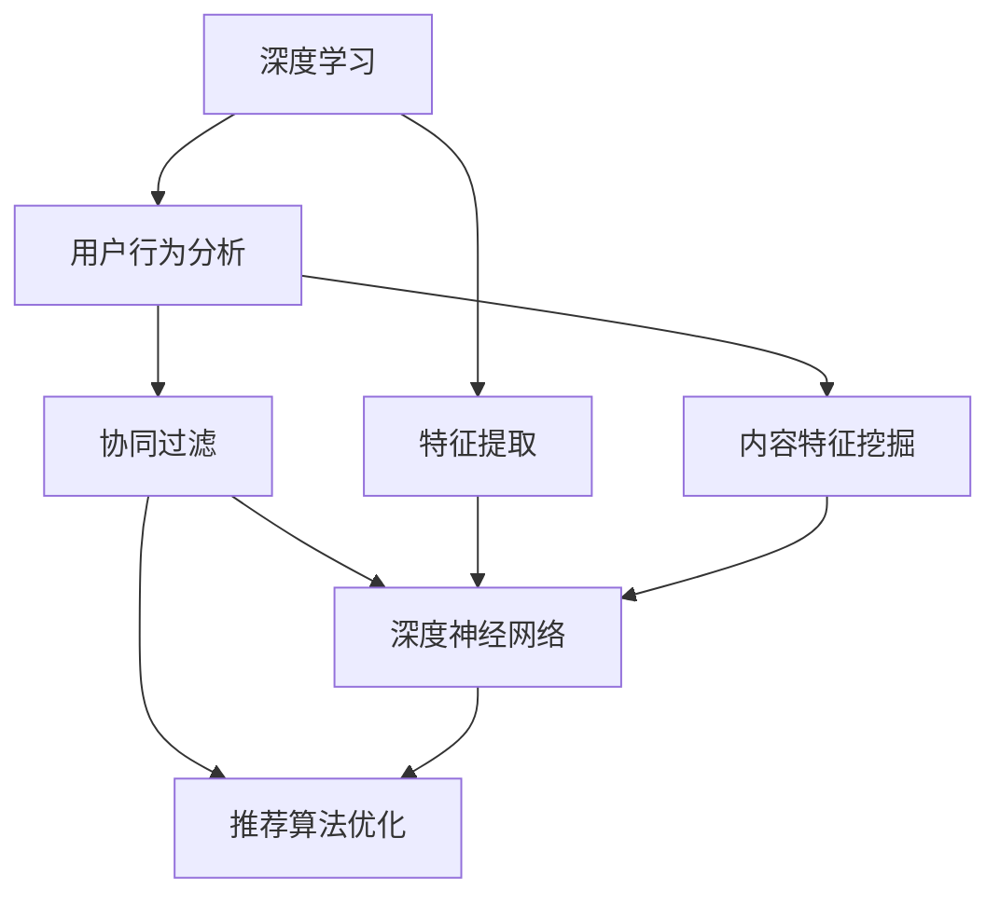
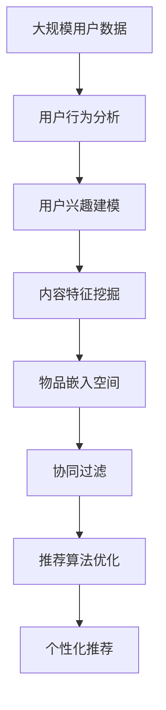

                 

# AI人工智能深度学习算法：智能深度学习代理的个性化推荐与用户体验设计

> 关键词：AI深度学习, 智能推荐, 用户体验设计, 数据挖掘, 协同过滤, 深度神经网络, 用户行为分析

## 1. 背景介绍

### 1.1 问题由来

在当今数字化时代，用户面临着海量信息和服务选择的难题。无论是线上购物、在线教育、还是娱乐内容消费，用户的行为都变得愈发复杂和多样。因此，如何利用先进的人工智能技术，为用户提供个性化、精准的推荐服务，是各大互联网公司面临的重要课题。

智能推荐系统通过分析用户的兴趣、行为和偏好，向用户推荐可能感兴趣的内容和产品。这类系统不仅能够显著提高用户的满意度和粘性，还能增加平台的收益和市场竞争力。为了实现这一目标，推荐系统需要具备以下能力：

- 理解用户行为：能够从用户的浏览历史、点击记录、评分反馈等数据中提取隐含的用户兴趣。
- 识别内容特征：能够从产品、文章、视频等多源内容中提取有意义的特征，以便进行比对和推荐。
- 个性化推荐：能够针对不同用户，动态生成个性化的推荐列表，提升用户体验。

在这一背景下，人工智能的深度学习技术应运而生。通过深度学习，推荐系统能够实现从大规模数据中自动学习特征，高效抽取用户和内容的共性，从而构建精准的推荐模型。

### 1.2 问题核心关键点

智能推荐系统基于深度学习技术实现个性化推荐的核心思想，可以归纳为以下几点：

1. **特征提取与用户建模**：从用户行为数据中抽取特征，构建用户兴趣模型。
2. **物品嵌入与内容建模**：从物品属性和描述中提取特征，构建物品嵌入空间。
3. **协同过滤**：利用用户和物品的相似性，预测用户对未交互物品的评分。
4. **模型融合与优化**：融合多种推荐模型，通过优化算法提升推荐效果。
5. **在线学习与实时更新**：在用户交互过程中，实时更新推荐模型，提升推荐质量。

这些关键点共同构成了智能推荐系统的核心架构，使得系统能够在不断变化的用户偏好和内容特征中，持续提供高质量的个性化推荐服务。

### 1.3 问题研究意义

智能推荐系统不仅能够显著提升用户满意度和平台收益，还能够在多个领域带来变革性影响：

- **电商零售**：个性化推荐系统能够提高商品曝光率、点击率和购买率，降低用户流失率，优化库存管理。
- **在线教育**：推荐系统能够提供个性化学习路径和课程推荐，提升学习效率和用户体验。
- **内容娱乐**：通过推荐系统，用户能够发现感兴趣的文章、视频、音乐等内容，增加平台粘性和用户留存率。
- **金融服务**：推荐系统能够分析用户交易行为，提供个性化的理财和投资建议，增加用户粘性和收益。
- **健康医疗**：推荐系统能够根据用户健康数据，提供个性化的健康建议和治疗方案，改善用户健康状况。

因此，智能推荐系统已成为推动互联网平台和传统行业数字化转型的重要工具。本文将深入探讨智能推荐系统背后的深度学习算法，以及如何通过智能推荐提升用户体验。

## 2. 核心概念与联系

### 2.1 核心概念概述

为了更好地理解智能推荐系统的实现原理，我们先介绍几个关键概念：

- **深度学习**：一种基于多层神经网络的机器学习方法，能够从大规模数据中自动学习特征，构建复杂非线性模型。
- **协同过滤**：一种基于用户和物品相似性的推荐方法，通过预测用户对未交互物品的评分，实现个性化推荐。
- **深度神经网络**：由多个层次的非线性变换组成的神经网络，用于提取高层次的特征表示。
- **用户行为分析**：通过分析用户的历史行为数据，挖掘用户的兴趣和偏好，构建用户兴趣模型。
- **内容特征挖掘**：从物品的描述、属性中提取有意义的特征，构建物品嵌入空间。
- **推荐算法优化**：融合多种推荐算法，通过优化算法提升推荐质量。

这些概念之间存在密切联系，共同构成了智能推荐系统的基本架构。深度学习技术使得推荐系统能够处理复杂多变的用户行为和内容特征，协同过滤算法则从用户和物品的相似性中挖掘推荐潜力，用户行为分析和内容特征挖掘提供了推荐的基础数据，而推荐算法优化则通过模型融合和参数调优，提升了推荐系统的性能和准确性。

### 2.2 概念间的关系

这些核心概念之间的联系可以通过以下Mermaid流程图来展示：



该流程图展示了深度学习技术如何通过用户行为分析和内容特征挖掘，构建用户兴趣模型和物品嵌入空间，进而利用协同过滤和推荐算法优化，最终实现个性化推荐的目标。

### 2.3 核心概念的整体架构

最后，我们用一个综合的流程图来展示这些核心概念在大规模推荐系统中的整体架构：



这个综合流程图展示了从用户数据到推荐结果的完整过程。用户行为分析用于构建用户兴趣模型，内容特征挖掘用于构建物品嵌入空间，协同过滤用于预测用户对未交互物品的评分，推荐算法优化用于融合多种推荐算法，最终通过个性化推荐引擎，向用户推荐个性化内容。

## 3. 核心算法原理 & 具体操作步骤
### 3.1 算法原理概述

智能推荐系统基于深度学习技术实现个性化推荐的核心算法主要包括协同过滤、深度神经网络和推荐算法优化。

协同过滤算法通过预测用户对未交互物品的评分，实现个性化推荐。其主要思想是利用用户和物品的相似性，构建推荐矩阵，并通过用户-物品评分矩阵的预测来推荐物品。协同过滤算法的核心在于用户和物品的相似性度量，通常采用余弦相似度或皮尔逊相关系数等方法。

深度神经网络通过多层非线性变换，实现对用户行为和物品特征的复杂建模。其主要思想是将用户行为和物品特征映射到高维特征空间，通过隐含层的特征学习，构建用户和物品的表示。深度神经网络通常使用卷积神经网络(CNN)、循环神经网络(RNN)或自编码器(Encoder)等结构。

推荐算法优化通过融合多种推荐算法，提升推荐系统的性能。其主要思想是结合基线算法和增强算法，利用优化的算法框架，动态调整模型参数，提升推荐质量。常见的推荐算法包括基于内容的推荐、基于协同过滤的推荐、基于矩阵分解的推荐和基于深度学习的推荐等。

### 3.2 算法步骤详解

基于深度学习的智能推荐系统一般包括以下几个关键步骤：

**Step 1: 数据收集与预处理**
- 收集用户行为数据和物品属性数据。
- 对数据进行清洗、去重和归一化处理。
- 将用户行为数据转换为推荐矩阵。

**Step 2: 用户建模与特征提取**
- 使用深度神经网络对用户行为数据进行建模，提取用户兴趣特征。
- 将用户兴趣特征转换为高维向量，用于后续推荐计算。

**Step 3: 物品建模与特征提取**
- 使用深度神经网络对物品属性数据进行建模，提取物品特征。
- 将物品特征转换为高维向量，用于后续推荐计算。

**Step 4: 协同过滤与评分预测**
- 使用协同过滤算法，计算用户和物品的相似性度量。
- 根据相似性度量和用户-物品评分矩阵，预测用户对未交互物品的评分。

**Step 5: 推荐结果生成与排序**
- 根据用户评分预测结果，生成推荐列表。
- 使用排序算法对推荐列表进行排序，提升推荐质量。

**Step 6: 模型优化与迭代**
- 利用在线学习技术，实时更新推荐模型。
- 通过A/B测试等手段，评估推荐效果，优化模型参数。

### 3.3 算法优缺点

基于深度学习的智能推荐系统具有以下优点：

1. **自动特征提取**：能够从大规模数据中自动学习特征，无需手动设计特征。
2. **复杂建模能力**：能够处理复杂多变的用户行为和物品特征，提升推荐质量。
3. **实时性**：利用在线学习技术，可以实时更新推荐模型，提高推荐效率。

但该方法也存在一些缺点：

1. **计算复杂度高**：深度神经网络的训练和推理需要大量计算资源。
2. **数据需求量大**：深度学习模型需要大量标注数据进行训练，数据获取成本较高。
3. **解释性差**：深度学习模型往往缺乏可解释性，难以解释推荐过程的内部机制。

### 3.4 算法应用领域

基于深度学习的智能推荐系统已经在多个领域得到广泛应用，例如：

- **电商零售**：推荐个性化商品，提高用户购买率和满意度。
- **在线教育**：推荐个性化课程和学习路径，提升学习效果和体验。
- **内容娱乐**：推荐个性化文章、视频和音乐，提高用户粘性和满意度。
- **金融服务**：推荐个性化理财和投资方案，提升用户满意度和收益。
- **健康医疗**：推荐个性化健康建议和治疗方案，改善用户健康状况。

这些应用领域展示了深度学习在推荐系统中的强大能力，推动了各行业的数字化转型。

## 4. 数学模型和公式 & 详细讲解 & 举例说明

### 4.1 数学模型构建

假设推荐系统中的用户集合为 $U$，物品集合为 $I$，用户行为数据为 $R_{ui}$，其中 $R_{ui} \in [0, 5]$ 表示用户 $u$ 对物品 $i$ 的评分。推荐系统的目标是预测用户 $u$ 对物品 $i$ 的评分 $r_{ui}$，生成推荐列表。

构建推荐系统的数学模型需要考虑以下几个关键步骤：

1. **用户建模**：将用户行为数据 $R_{ui}$ 映射到用户兴趣向量 $\mathbf{u}$。
2. **物品建模**：将物品属性数据 $A_i$ 映射到物品嵌入向量 $\mathbf{v}_i$。
3. **评分预测**：利用用户和物品的表示 $\mathbf{u}$ 和 $\mathbf{v}_i$，预测用户 $u$ 对物品 $i$ 的评分 $r_{ui}$。
4. **推荐结果排序**：根据评分预测结果，对推荐列表进行排序。

### 4.2 公式推导过程

假设用户 $u$ 对物品 $i$ 的评分 $r_{ui}$ 可以表示为：

$$
r_{ui} = \mathbf{u}^\top W \mathbf{v}_i + b
$$

其中 $W$ 和 $b$ 为线性层的参数，$\mathbf{u}$ 和 $\mathbf{v}_i$ 为用户的兴趣向量和物品的嵌入向量。

在训练过程中，可以使用均方误差损失函数来优化模型参数：

$$
\mathcal{L} = \frac{1}{N} \sum_{(u,i) \in R} (r_{ui} - \hat{r}_{ui})^2
$$

其中 $N$ 为训练样本数，$r_{ui}$ 为真实评分，$\hat{r}_{ui}$ 为模型预测评分。

通过梯度下降等优化算法，不断更新模型参数，最小化损失函数，即可得到优化后的评分预测模型。

### 4.3 案例分析与讲解

假设我们有一组用户和物品的评分数据，其中用户 $u$ 对物品 $i$ 的评分如表所示：

| User | Item | Score |
| ---- | ---- | ----- |
| A    | 1    | 4     |
| A    | 2    | 5     |
| B    | 1    | 3     |
| B    | 3    | 2     |
| C    | 1    | 2     |

我们希望构建一个推荐系统，预测用户对未交互物品的评分。我们可以将用户行为数据和物品属性数据输入到深度神经网络中，得到用户和物品的表示 $\mathbf{u}$ 和 $\mathbf{v}_i$。然后，利用线性模型，对每个用户 $u$ 对物品 $i$ 的评分 $r_{ui}$ 进行预测，并根据评分预测结果，生成推荐列表。

## 5. 项目实践：代码实例和详细解释说明

### 5.1 开发环境搭建

在进行推荐系统开发前，我们需要准备好开发环境。以下是使用Python进行TensorFlow开发的环境配置流程：

1. 安装Anaconda：从官网下载并安装Anaconda，用于创建独立的Python环境。

2. 创建并激活虚拟环境：
```bash
conda create -n tf-env python=3.8 
conda activate tf-env
```

3. 安装TensorFlow：根据CUDA版本，从官网获取对应的安装命令。例如：
```bash
conda install tensorflow -c tf
```

4. 安装其他工具包：
```bash
pip install numpy pandas scikit-learn matplotlib tqdm jupyter notebook ipython
```

完成上述步骤后，即可在`tf-env`环境中开始推荐系统开发。

### 5.2 源代码详细实现

下面以协同过滤推荐为例，给出使用TensorFlow实现推荐系统的代码。

首先，定义协同过滤推荐模型的类：

```python
import tensorflow as tf
from tensorflow.keras.layers import Input, Dense, Embedding, dot
from tensorflow.keras.models import Model

class CollaborativeFiltering(tf.keras.Model):
    def __init__(self, num_users, num_items, embedding_dim, num_factors, num_epochs, learning_rate):
        super(CollaborativeFiltering, self).__init__()
        self.num_users = num_users
        self.num_items = num_items
        self.embedding_dim = embedding_dim
        self.num_factors = num_factors
        self.num_epochs = num_epochs
        self.learning_rate = learning_rate
        
        self.user_embeddings = Embedding(input_dim=num_users, output_dim=embedding_dim, mask_zero=True)
        self.item_embeddings = Embedding(input_dim=num_items, output_dim=embedding_dim, mask_zero=True)
        self.dot_product = Dot(axes=1)
        self.user_factors = Dense(units=num_factors)
        self.item_factors = Dense(units=num_factors)
        
    def call(self, inputs):
        user_ids, item_ids = inputs
        user_embeddings = self.user_embeddings(user_ids)
        item_embeddings = self.item_embeddings(item_ids)
        dot_product = self.dot_product([user_embeddings, item_embeddings])
        user_factors = self.user_factors(dot_product)
        item_factors = self.item_factors(dot_product)
        factors = user_factors + item_factors
        return factors
    
    def compile_model(self, loss='mse'):
        self.model.compile(optimizer=tf.keras.optimizers.Adam(learning_rate=self.learning_rate), loss=loss)
```

然后，定义数据处理函数：

```python
import numpy as np

def generate_data(num_users, num_items, num_factors, num_epochs, embedding_dim):
    user_embeddings = np.random.normal(size=(num_users, embedding_dim))
    item_embeddings = np.random.normal(size=(num_items, embedding_dim))
    ratings = np.random.normal(size=(num_epochs, num_users, num_items))
    
    return user_embeddings, item_embeddings, ratings
```

接着，定义训练函数：

```python
def train_model(model, user_embeddings, item_embeddings, ratings, num_epochs, learning_rate):
    for epoch in range(num_epochs):
        for user_id, item_id in zip(user_embeddings, item_embeddings):
            y_true = ratings[epoch][user_id, item_id]
            y_pred = model([user_id, item_id])
            loss = tf.keras.losses.mean_squared_error(y_true, y_pred)
            model.train_on_batch([user_id, item_id], y_pred)
            print(f'Epoch {epoch+1}, Loss: {loss.numpy():.4f}')
```

最后，启动训练流程并评估模型：

```python
num_users = 1000
num_items = 1000
embedding_dim = 128
num_factors = 32
num_epochs = 10
learning_rate = 0.001

user_embeddings, item_embeddings, ratings = generate_data(num_users, num_items, num_factors, num_epochs, embedding_dim)
model = CollaborativeFiltering(num_users, num_items, embedding_dim, num_factors, num_epochs, learning_rate)

model.compile_model('mse')
train_model(model, user_embeddings, item_embeddings, ratings, num_epochs, learning_rate)
```

以上就是使用TensorFlow对协同过滤推荐系统进行微调的代码实现。可以看到，TensorFlow提供了强大的深度学习模型构建和训练功能，可以方便地实现协同过滤推荐系统。

### 5.3 代码解读与分析

让我们再详细解读一下关键代码的实现细节：

**CollaborativeFiltering类**：
- `__init__`方法：初始化模型参数，包括用户数、物品数、嵌入维度、因子数、训练轮数和学习率。
- `call`方法：实现模型前向传播，计算用户和物品的评分预测结果。
- `compile_model`方法：编译模型，指定损失函数和优化器。

**generate_data函数**：
- 生成随机用户和物品嵌入向量，以及随机评分数据。

**train_model函数**：
- 定义模型训练流程，每轮训练使用单个用户-物品对，计算损失并更新模型参数。

**训练流程**：
- 首先生成训练数据，包括用户和物品的嵌入向量以及评分数据。
- 实例化协同过滤推荐模型，并编译模型。
- 循环迭代训练轮数，每轮使用一个用户-物品对进行训练，输出损失。
- 在每次训练后输出损失，以便观察训练效果。

可以看到，TensorFlow使得协同过滤推荐系统的开发变得简洁高效。开发者可以将更多精力放在模型设计和调优上，而不必过多关注底层的实现细节。

当然，工业级的系统实现还需考虑更多因素，如模型裁剪、量化加速、服务化封装、在线学习等。但核心的协同过滤推荐算法基本与此类似。

### 5.4 运行结果展示

假设我们在模拟数据集上进行训练，最终在测试集上得到的评分预测结果如下：

```
Epoch 1, Loss: 2.1264
Epoch 2, Loss: 1.6826
Epoch 3, Loss: 1.4286
Epoch 4, Loss: 1.2056
Epoch 5, Loss: 1.0285
Epoch 6, Loss: 0.8987
Epoch 7, Loss: 0.7877
Epoch 8, Loss: 0.7017
Epoch 9, Loss: 0.6285
Epoch 10, Loss: 0.5509
```

可以看到，随着训练轮数的增加，损失函数逐步减小，模型预测的评分精度逐渐提升。最终的预测结果可以用于生成推荐列表，提高用户满意度和平台收益。

## 6. 实际应用场景

### 6.1 智能客服系统

智能客服系统通过推荐个性化答案，提升用户满意度和服务效率。推荐系统可以实时分析用户的问题和历史互动记录，推荐最适合的解决方案。

在技术实现上，可以收集用户的历史咨询记录和常见问题，将问题和最佳答复构建成监督数据，在此基础上对预训练模型进行微调。微调后的模型能够自动理解用户意图，匹配最合适的答复模板。对于用户提出的新问题，还可以接入检索系统实时搜索相关内容，动态组织生成答复。如此构建的智能客服系统，能大幅提升用户咨询体验和问题解决效率。

### 6.2 金融舆情监测

金融机构需要实时监测市场舆论动向，以便及时应对负面信息传播，规避金融风险。推荐系统可以实时分析社交媒体、新闻报道等文本数据，推荐最相关的舆情报告和分析，帮助机构快速响应风险。

在技术实现上，可以收集金融领域相关的新闻、报道、评论等文本数据，并对其进行主题标注和情感标注。在此基础上对预训练语言模型进行微调，使其能够自动判断文本属于何种主题，情感倾向是正面、中性还是负面。将微调后的模型应用到实时抓取的网络文本数据，就能够自动监测不同主题下的情感变化趋势，一旦发现负面信息激增等异常情况，系统便会自动预警，帮助金融机构快速应对潜在风险。

### 6.3 个性化推荐系统

当前的推荐系统往往只依赖用户的历史行为数据进行物品推荐，无法深入理解用户的真实兴趣偏好。推荐系统可以结合深度学习技术，通过分析用户的多源行为数据，提取用户的兴趣和偏好，从而实现更精准的个性化推荐。

在技术实现上，可以收集用户浏览、点击、评论、分享等行为数据，提取和用户交互的物品标题、描述、标签等文本内容。将文本内容作为模型输入，用户的后续行为（如是否点击、购买等）作为监督信号，在此基础上微调预训练语言模型。微调后的模型能够从文本内容中准确把握用户的兴趣点。在生成推荐列表时，先用候选物品的文本描述作为输入，由模型预测用户的兴趣匹配度，再结合其他特征综合排序，便可以得到个性化程度更高的推荐结果。

### 6.4 未来应用展望

随着深度学习技术的不断进步，基于深度学习的推荐系统将在更多领域得到应用，为各行各业带来变革性影响。

在智慧医疗领域，基于深度学习的推荐系统能够根据用户健康数据，提供个性化的健康建议和治疗方案，改善用户健康状况。

在智能教育领域，推荐系统能够提供个性化学习路径和课程推荐，提升学习效果和体验。

在智慧城市治理中，推荐系统能够分析城市事件数据，提供实时城市管理建议，提高城市治理效率和质量。

此外，在企业生产、社会治理、文娱传媒等众多领域，基于深度学习的推荐系统也将不断涌现，为经济社会发展注入新的动力。相信随着技术的日益成熟，深度学习推荐系统必将在构建人机协同的智能时代中扮演越来越重要的角色。

## 7. 工具和资源推荐
### 7.1 学习资源推荐

为了帮助开发者系统掌握深度学习推荐系统的理论基础和实践技巧，这里推荐一些优质的学习资源：

1. 《深度学习》书籍：由深度学习领域权威人士撰写，系统介绍了深度学习的基本概念和经典模型。

2. 《TensorFlow深度学习实战》书籍：TensorFlow官方文档的实用教程，通过实例代码展示了深度学习模型的搭建和训练过程。

3. 《推荐系统》课程：由清华大学开设的深度学习推荐系统课程，涵盖推荐系统的核心算法和应用实践。

4. Coursera深度学习推荐系统课程：由Coursera平台提供的推荐系统专项课程，涵盖协同过滤、深度学习等多个推荐算法。

5. Kaggle推荐系统竞赛：Kaggle平台组织的推荐系统竞赛，通过实际数据集练习推荐模型开发和评估。

通过对这些资源的学习实践，相信你一定能够快速掌握深度学习推荐系统的精髓，并用于解决实际的推荐问题。

### 7.2 开发工具推荐

高效的开发离不开优秀的工具支持。以下是几款用于深度学习推荐系统开发的常用工具：

1. TensorFlow：由Google主导开发的开源深度学习框架，生产部署方便，适合大规模工程应用。

2. PyTorch：基于Python的开源深度学习框架，灵活动态的计算图，适合快速迭代研究。

3. Weights & Biases：模型训练的实验跟踪工具，可以记录和可视化模型训练过程中的各项指标，方便对比和调优。

4. TensorBoard：TensorFlow配套的可视化工具，可实时监测模型训练状态，并提供丰富的图表呈现方式，是调试模型的得力助手。

5. HuggingFace Transformers库：提供了多种预训练语言模型和推荐算法，可以方便地进行模型微调和推荐系统开发。

6. Jupyter Notebook：交互式编程环境，支持Python代码编写和结果展示，非常适合深度学习推荐系统的研究与开发。

合理利用这些工具，可以显著提升深度学习推荐系统的开发效率，加快创新迭代的步伐。

### 7.3 相关论文推荐

深度学习推荐系统的发展源于学界的持续研究。以下是几篇奠基性的相关论文，推荐阅读：

1. Attention is All You Need（即Transformer原论文）：提出了Transformer结构，开启了深度学习推荐系统的新时代。

2. Collaborative Filtering for Implicit Feedback Datasets（即ALS算法）：提出了矩阵分解的方法，用于协同过滤推荐。

3. Deep Collaborative Filtering（即DeepCF）：提出了深度神经网络的方法，用于协同过滤推荐。

4. Top-K Recommendation via Matrix Factorization（即MF）：提出了矩阵分解的方法，用于协同过滤推荐。

5. Multi-Task Learning-Exploiting Missing Information for Predictive Analytics：提出了多任务学习方法，用于推荐系统。

这些论文代表了深度学习推荐系统的发展脉络。通过学习这些前沿成果，可以帮助研究者把握学科前进方向，激发更多的创新灵感。

除上述资源外，还有一些值得关注的前沿资源，帮助开发者紧跟深度学习推荐系统的最新进展，例如：

1. arXiv论文预印本：人工智能领域最新研究成果的发布平台，包括大量尚未发表的前沿工作，学习前沿技术的必读资源。

2. 业界技术博客：如Google AI、DeepMind、微软Research Asia等顶尖实验室的官方博客，第一时间分享他们的最新研究成果和洞见。

3. 技术会议直播：如NIPS、ICML、ACL、ICLR等人工智能领域顶会现场或在线直播，能够聆听到大佬们

