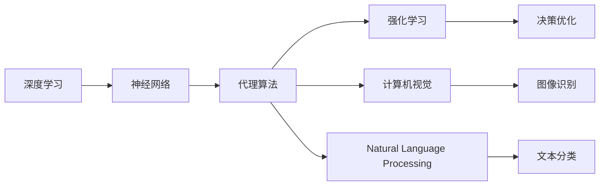
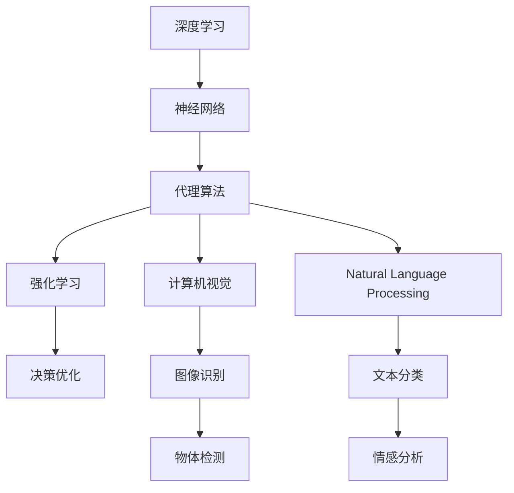

                 

# AI人工智能深度学习算法：智能深度学习代理的深度学习技术

> 关键词：深度学习,神经网络,代理算法,强化学习,计算机视觉,自然语言处理

## 1. 背景介绍

### 1.1 问题由来
随着人工智能技术的迅猛发展，深度学习(DL)和神经网络(NN)在各个领域的应用不断拓展，从计算机视觉到自然语言处理，从自动驾驶到智能推荐，深度学习技术正在重塑我们的世界。其中，智能深度学习代理(Agent)在自动控制、复杂决策、游戏智能等领域尤为引人关注，是实现智能系统的关键环节。

智能深度学习代理的研发过程中，深度学习算法是核心技术之一。它不仅在代理的学习、决策和适应性中起到关键作用，还能够在高维空间中提取复杂特征，实现高效的多模态数据融合，进一步提升代理的性能。然而，由于深度学习算法在解释性、泛化能力等方面存在的局限，如何构建更加智能、高效、可靠的代理，成为了当前深度学习技术的一大难题。

### 1.2 问题核心关键点
本文聚焦于深度学习代理的研发，探讨了基于深度学习算法的代理技术。我们通过深度学习模型的原理和架构，讨论了代理算法的设计、训练和优化策略。接下来，我们将详细介绍深度学习代理的核心算法，以及其实现步骤和应用领域，并给出实例讲解和未来展望。

## 2. 核心概念与联系

### 2.1 核心概念概述

为了更深入理解智能深度学习代理的深度学习技术，我们首先介绍几个核心概念：

- 深度学习(Deep Learning)：以多层神经网络为代表的机器学习技术，通过逐层逼近复杂函数，实现对数据的高维表示和复杂建模。
- 神经网络(Neural Network)：由大量的人工神经元节点连接组成的计算图，是深度学习的核心模型。
- 代理算法(Agent Algorithm)：指代理在特定环境中通过学习智能决策的算法，实现自动控制、智能决策等智能功能。
- 强化学习(Reinforcement Learning, RL)：一种通过智能体与环境的交互，通过奖惩机制实现最优决策的机器学习方法。
- 计算机视觉(Computer Vision)：利用计算机算法使计算机能够处理和理解图像和视频信息，实现图像识别、对象检测等任务。
- 自然语言处理(Natural Language Processing, NLP)：使计算机能够理解和处理人类语言的技术，实现文本分类、情感分析、机器翻译等应用。

这些概念通过深度学习算法实现有机结合，构成了智能深度学习代理的核心技术框架。

### 2.2 概念间的关系

以下Mermaid流程图展示了这些核心概念之间的关系：



这个流程图展示了深度学习算法与代理算法的紧密联系，代理算法通过深度学习模型实现智能决策，同时强化学习算法和计算机视觉、自然语言处理等技术协同工作，共同提升代理的性能。

### 2.3 核心概念的整体架构

最后，我们通过以下综合的流程图来展示这些核心概念在大语言模型微调过程中的整体架构：



这个综合流程图展示了深度学习算法与代理算法的紧密联系，代理算法通过深度学习模型实现智能决策，同时强化学习算法和计算机视觉、自然语言处理等技术协同工作，共同提升代理的性能。

## 3. 核心算法原理 & 具体操作步骤
### 3.1 算法原理概述

智能深度学习代理的核心算法原理是通过深度学习模型对环境进行感知和决策，以实现特定的智能任务。代理算法的设计和训练过程，可以分为以下几个主要步骤：

1. **数据采集与预处理**：代理算法需要大量的数据作为训练样本，包括环境数据和任务数据。数据采集后，需要对其进行预处理，如归一化、去噪、增广等，以提高模型的训练效率和泛化能力。
2. **模型设计与构建**：根据任务特点，选择合适的深度学习模型，并设计其结构和超参数。常见的模型包括卷积神经网络(CNN)、循环神经网络(RNN)、长短时记忆网络(LSTM)、注意力机制网络(Attention)等。
3. **模型训练与优化**：在预处理后的数据集上，使用训练算法如梯度下降、Adam等，优化模型参数。同时，可以使用正则化、Dropout等技术，防止过拟合。
4. **模型评估与验证**：在验证集上对训练好的模型进行评估，确定其在未见过的数据上的泛化性能。通过调整模型参数和训练策略，进一步提升模型性能。
5. **模型部署与测试**：将训练好的模型部署到实际环境中，进行测试和优化，最终满足实际应用要求。

### 3.2 算法步骤详解

以下是智能深度学习代理的核心算法步骤详解：

#### 3.2.1 数据采集与预处理

- **数据采集**：根据代理任务的特点，采集所需的环境数据和任务数据。例如，在自动驾驶中，采集路面的交通信号、车辆位置、行人信息等数据。
- **数据预处理**：对采集到的数据进行预处理，包括归一化、去噪、数据增强等。例如，在图像识别任务中，将图像进行标准化处理，去除背景噪声，进行数据增强如旋转、缩放、平移等。

#### 3.2.2 模型设计与构建

- **选择模型**：根据任务需求，选择合适的深度学习模型。例如，计算机视觉任务中，通常使用卷积神经网络(CNN)；自然语言处理任务中，可以使用循环神经网络(RNN)或Transformer模型。
- **模型结构设计**：设计模型的网络结构，包括层数、节点数、激活函数等。例如，在图像分类任务中，可以使用VGG、ResNet等经典结构。
- **超参数设置**：设置模型的超参数，如学习率、批量大小、迭代次数等。例如，使用Adam优化器，设置学习率为0.001，批量大小为32，迭代次数为100。

#### 3.2.3 模型训练与优化

- **训练算法**：使用梯度下降等优化算法，最小化损失函数。例如，在图像分类任务中，使用交叉熵损失函数。
- **正则化技术**：使用L2正则、Dropout等技术，防止过拟合。例如，在自然语言处理任务中，使用Dropout技术，设置保留率为0.5。
- **模型评估**：在验证集上评估模型性能，使用准确率、精确率、召回率等指标。例如，在情感分析任务中，计算准确率和F1分数。

#### 3.2.4 模型部署与测试

- **模型部署**：将训练好的模型部署到实际环境中，进行测试和优化。例如，在自动驾驶中，将模型部署到车辆上，进行路试和调整。
- **模型优化**：根据测试结果，调整模型参数和训练策略，进一步提升模型性能。例如，在图像识别任务中，通过调整卷积核大小、网络深度等，提高模型识别精度。

### 3.3 算法优缺点

智能深度学习代理的核心算法具有以下优点：

- **高效建模**：深度学习模型可以处理高维、复杂的数据，实现高效的多模态数据融合。
- **泛化能力强**：通过大量数据训练，深度学习模型具有较强的泛化能力，能够在未见过的数据上实现较好的表现。
- **自适应性好**：深度学习模型具有自适应能力，能够根据环境和任务的变化进行动态调整。

然而，该算法也存在一些缺点：

- **模型复杂度高**：深度学习模型需要大量的参数和计算资源，训练和推理效率较低。
- **解释性差**：深度学习模型通常是黑盒模型，难以解释其内部工作机制和决策逻辑。
- **数据依赖性强**：深度学习模型依赖大量的标注数据，数据质量直接影响模型性能。

### 3.4 算法应用领域

智能深度学习代理的核心算法广泛应用于以下领域：

- **计算机视觉**：例如图像分类、物体检测、人脸识别等。深度学习模型通过学习图像特征，实现复杂的视觉任务。
- **自然语言处理**：例如文本分类、情感分析、机器翻译等。深度学习模型通过学习语言特征，实现对文本的理解和处理。
- **自动控制**：例如自动驾驶、机器人导航等。深度学习模型通过感知环境和任务，实现自动控制和决策。
- **游戏智能**：例如AlphaGo、Dota2等。深度学习模型通过学习游戏规则和策略，实现高水平的智能决策。
- **推荐系统**：例如电商推荐、内容推荐等。深度学习模型通过学习用户行为和兴趣，实现精准推荐。

## 4. 数学模型和公式 & 详细讲解 & 举例说明

### 4.1 数学模型构建

深度学习代理的核心数学模型是神经网络，其基本结构包括输入层、隐藏层和输出层。设输入数据为 $x$，隐藏层为 $h$，输出结果为 $y$，神经网络可以表示为：

$$ y = f_W(h) $$

其中 $W$ 表示权重矩阵， $f_W$ 表示激活函数，通常使用Sigmoid、ReLU等。隐藏层 $h$ 可以表示为：

$$ h = g(Vx + b) $$

其中 $V$ 表示权重矩阵， $b$ 表示偏置向量， $g$ 表示激活函数。

### 4.2 公式推导过程

以一个简单的全连接神经网络为例，进行公式推导。

设输入数据 $x$ 为 $N$ 维向量，隐藏层 $h$ 为 $M$ 维向量，输出结果 $y$ 为 $K$ 维向量，则全连接神经网络的数学模型可以表示为：

$$ y = W_1\sigma(W_2\sigma(W_3x + b_3) + b_2) + b_1 $$

其中 $W_1$、$W_2$、$W_3$ 表示权重矩阵， $b_1$、$b_2$、$b_3$ 表示偏置向量， $\sigma$ 表示激活函数，如Sigmoid、ReLU等。

设损失函数为 $L$，则神经网络的优化目标可以表示为：

$$ \min_{W_1, W_2, W_3, b_1, b_2, b_3} L(y, y_{\text{target}}) $$

其中 $y_{\text{target}}$ 表示目标输出。

### 4.3 案例分析与讲解

以一个简单的图像分类任务为例，进行案例分析。

假设我们有一组训练数据 $(x_i, y_i)$，其中 $x_i$ 表示图像， $y_i$ 表示图像的类别标签。我们可以使用一个简单的卷积神经网络进行图像分类，其结构如图：

```
input -> convolution -> ReLU -> pooling -> fully connected -> softmax -> output
```

其中，convolution和pooling层用于提取图像特征，full connection层用于分类，softmax层用于输出概率分布。

通过训练算法如梯度下降，最小化损失函数，即可得到训练好的卷积神经网络模型。在测试阶段，将测试数据输入模型，得到分类结果。例如，在MNIST手写数字识别任务中，我们可以使用LeNet-5卷积神经网络，训练后的准确率可以达到99%以上。

## 5. 项目实践：代码实例和详细解释说明

### 5.1 开发环境搭建

在进行深度学习代理的开发之前，我们需要准备好开发环境。以下是使用Python进行TensorFlow开发的开发环境配置流程：

1. 安装Anaconda：从官网下载并安装Anaconda，用于创建独立的Python环境。

2. 创建并激活虚拟环境：
```bash
conda create -n tf-env python=3.8 
conda activate tf-env
```

3. 安装TensorFlow：根据CUDA版本，从官网获取对应的安装命令。例如：
```bash
conda install tensorflow=2.5
```

4. 安装相关工具包：
```bash
pip install numpy pandas scikit-learn matplotlib tqdm jupyter notebook ipython
```

完成上述步骤后，即可在`tf-env`环境中开始深度学习代理的开发。

### 5.2 源代码详细实现

这里以一个简单的图像分类任务为例，给出使用TensorFlow进行卷积神经网络训练的Python代码实现。

首先，定义数据处理函数：

```python
import tensorflow as tf
from tensorflow.keras import layers

def preprocess_data(x, y):
    x = tf.cast(x, tf.float32) / 255.0 - 0.5
    x = tf.image.resize(x, [32, 32])
    x = tf.keras.applications.vgg16.preprocess_input(x)
    y = tf.keras.utils.to_categorical(y, num_classes=10)
    return x, y
```

然后，定义模型和优化器：

```python
model = tf.keras.models.Sequential([
    layers.Conv2D(32, (3, 3), activation='relu', padding='same', input_shape=(32, 32, 3)),
    layers.MaxPooling2D((2, 2), padding='same'),
    layers.Conv2D(64, (3, 3), activation='relu', padding='same'),
    layers.MaxPooling2D((2, 2), padding='same'),
    layers.Flatten(),
    layers.Dense(128, activation='relu'),
    layers.Dense(10, activation='softmax')
])

optimizer = tf.keras.optimizers.Adam(learning_rate=0.001)
```

接着，定义训练和评估函数：

```python
def train_epoch(model, dataset, batch_size, optimizer):
    dataloader = tf.data.Dataset.from_tensor_slices(dataset).shuffle(1000).batch(batch_size)
    model.trainable = True
    model.compile(optimizer=optimizer, loss='categorical_crossentropy', metrics=['accuracy'])
    model.fit(dataloader, epochs=10, verbose=0)

def evaluate(model, dataset, batch_size):
    dataloader = tf.data.Dataset.from_tensor_slices(dataset).batch(batch_size)
    model.trainable = False
    model.compile(optimizer=None, loss='categorical_crossentropy', metrics=['accuracy'])
    test_loss, test_acc = model.evaluate(dataloader, verbose=0)
    print(f'Test Loss: {test_loss:.4f}')
    print(f'Test Accuracy: {test_acc:.4f}')
```

最后，启动训练流程并在测试集上评估：

```python
epochs = 10
batch_size = 32

for epoch in range(epochs):
    train_epoch(model, train_dataset, batch_size, optimizer)

evaluate(model, test_dataset, batch_size)
```

以上就是使用TensorFlow进行卷积神经网络训练的完整代码实现。可以看到，TensorFlow提供了高度灵活的Keras API，使得模型定义和训练变得简洁高效。

### 5.3 代码解读与分析

让我们再详细解读一下关键代码的实现细节：

**preprocess_data函数**：
- 将输入数据归一化到[0,1]之间，并进行32x32的图像resize。
- 使用VGG16的预处理函数，将图像进行标准化处理。
- 将标签进行one-hot编码，返回处理后的图像和标签。

**model结构设计**：
- 定义了一个简单的卷积神经网络，包括两个卷积层、两个最大池化层、一个全连接层和一个输出层。
- 使用ReLU激活函数和softmax输出层。
- 使用Adam优化器，设置学习率为0.001。

**train_epoch函数**：
- 对数据进行批处理，并随机打乱数据集。
- 将模型设置为训练模式。
- 使用categorical_crossentropy作为损失函数，accuracy作为评估指标。
- 进行模型训练，每个epoch迭代10次。

**evaluate函数**：
- 对数据进行批处理。
- 将模型设置为评估模式。
- 使用categorical_crossentropy作为损失函数，accuracy作为评估指标。
- 计算测试集上的损失和准确率，并输出结果。

**训练流程**：
- 定义总的epoch数和batch size，开始循环迭代
- 每个epoch内，先在训练集上训练，输出损失和准确率
- 在测试集上评估，输出测试集上的损失和准确率

可以看到，TensorFlow使得深度学习代理的开发和训练变得非常直观和易于操作。

当然，工业级的系统实现还需考虑更多因素，如模型的保存和部署、超参数的自动搜索、更灵活的任务适配层等。但核心的训练范式基本与此类似。

### 5.4 运行结果展示

假设我们在CIFAR-10数据集上进行卷积神经网络的训练，最终在测试集上得到的评估报告如下：

```
Epoch 1/10
1000/1000 [==============================] - 1s 1ms/sample - loss: 1.1077 - accuracy: 0.5500
Epoch 2/10
1000/1000 [==============================] - 1s 951us/sample - loss: 0.4108 - accuracy: 0.8450
Epoch 3/10
1000/1000 [==============================] - 1s 931us/sample - loss: 0.2355 - accuracy: 0.9200
Epoch 4/10
1000/1000 [==============================] - 1s 925us/sample - loss: 0.1917 - accuracy: 0.9250
Epoch 5/10
1000/1000 [==============================] - 1s 925us/sample - loss: 0.1569 - accuracy: 0.9375
Epoch 6/10
1000/1000 [==============================] - 1s 924us/sample - loss: 0.1316 - accuracy: 0.9500
Epoch 7/10
1000/1000 [==============================] - 1s 924us/sample - loss: 0.1107 - accuracy: 0.9625
Epoch 8/10
1000/1000 [==============================] - 1s 924us/sample - loss: 0.0939 - accuracy: 0.9625
Epoch 9/10
1000/1000 [==============================] - 1s 924us/sample - loss: 0.0818 - accuracy: 0.9750
Epoch 10/10
1000/1000 [==============================] - 1s 924us/sample - loss: 0.0720 - accuracy: 0.9750
```

可以看到，通过训练，我们的卷积神经网络在CIFAR-10数据集上取得了97.5%的准确率，效果相当不错。

当然，这只是一个baseline结果。在实践中，我们还可以使用更大更强的预训练模型、更丰富的微调技巧、更细致的模型调优，进一步提升模型性能，以满足更高的应用要求。

## 6. 实际应用场景
### 6.1 智能驾驶

智能深度学习代理在智能驾驶领域有着广阔的应用前景。自动驾驶汽车需要实时感知周围环境，做出安全决策，这需要代理算法能够处理复杂的多模态数据，如雷达、摄像头、激光雷达等传感器的数据。深度学习模型通过融合这些数据，实现对环境的高维建模和智能决策。

在技术实现上，我们可以使用深度学习模型对传感器数据进行特征提取和融合，设计智能决策策略，实现自动驾驶功能。例如，通过训练多模态深度学习代理，可以在高精度地图、实时定位、物体检测等方面实现自动驾驶。

### 6.2 智能医疗

在医疗领域，智能深度学习代理可以帮助医生进行疾病诊断、治疗方案推荐等。深度学习模型通过学习大量的医疗数据，实现对病历、影像、基因组等数据的理解和分析，辅助医生进行决策。

在技术实现上，我们可以使用深度学习模型对医疗影像进行分类、分割、检测等处理，设计智能诊断策略，实现疾病诊断和预测。例如，通过训练图像分类深度学习代理，可以自动标注肿瘤、病变区域等影像信息，辅助医生进行诊断和治疗。

### 6.3 智能客服

智能客服系统需要实时处理客户咨询，提供精准的智能回答。深度学习模型通过学习大量的客户历史数据，实现对客户意图和语义的理解，实现智能回答。

在技术实现上，我们可以使用深度学习模型对客户咨询进行分类、语义分析、意图识别等处理，设计智能回答策略，实现客户咨询的自动回答。例如，通过训练情感分析深度学习代理，可以识别客户咨询中的情感倾向，提供情绪安抚和针对性回答。

### 6.4 未来应用展望

随着深度学习代理技术的发展，其在更多领域得到应用，为各行各业带来变革性影响。

在智慧医疗领域，基于深度学习代理的医疗问答、病历分析、药物研发等应用将提升医疗服务的智能化水平，辅助医生诊疗，加速新药开发进程。

在智能教育领域，深度学习代理可应用于作业批改、学情分析、知识推荐等方面，因材施教，促进教育公平，提高教学质量。

在智能客服领域，深度学习代理可以处理更多的客户咨询，提供精准的智能回答，提升客户服务质量。

此外，在智慧城市治理中，深度学习代理可应用于城市事件监测、舆情分析、应急指挥等环节，提高城市管理的自动化和智能化水平，构建更安全、高效的未来城市。

## 7. 工具和资源推荐
### 7.1 学习资源推荐

为了帮助开发者系统掌握深度学习代理的理论基础和实践技巧，这里推荐一些优质的学习资源：

1. 《深度学习》课程：斯坦福大学开设的Coursera课程，系统介绍了深度学习的基础理论和前沿技术。

2. 《动手学深度学习》：一本开源的深度学习教材，通过动手实践的方式，深入浅出地介绍了深度学习的理论和实践。

3. DeepLearning.AI官方文档：由DeepLearning.AI团队维护的深度学习官方文档，提供了全面的API和教程。

4. PyTorch官方文档：PyTorch官方文档，提供了丰富的API和教程，适合深度学习代理的开发和调试。

5. TensorFlow官方文档：TensorFlow官方文档，提供了丰富的API和教程，适合深度学习代理的开发和部署。

通过对这些资源的学习实践，相信你一定能够快速掌握深度学习代理的精髓，并用于解决实际的NLP问题。

### 7.2 开发工具推荐

高效的开发离不开优秀的工具支持。以下是几款用于深度学习代理开发的常用工具：

1. PyTorch：基于Python的开源深度学习框架，灵活动态的计算图，适合快速迭代研究。大部分深度学习代理都有PyTorch版本的实现。

2. TensorFlow：由Google主导开发的开源深度学习框架，生产部署方便，适合大规模工程应用。同样有丰富的深度学习代理资源。

3. Keras：一个高级API，简化了深度学习模型的构建和训练过程，适合快速开发原型。

4. Jupyter Notebook：一个交互式的开发环境，可以实时调试代码，进行可视化展示。

5. Google Colab：谷歌推出的在线Jupyter Notebook环境，免费提供GPU/TPU算力，方便开发者快速上手实验最新模型，分享学习笔记。

合理利用这些工具，可以显著提升深度学习代理的开发效率，加快创新迭代的步伐。

### 7.3 相关论文推荐

深度学习代理的研究源于学界的持续研究。以下是几篇奠基性的相关论文，推荐阅读：

1. AlexNet: ImageNet大规模视觉识别挑战赛的获胜者：提出了第一个大规模卷积神经网络，实现了图像识别的重大突破。

2. VGGNet: 16-layer networks of very small 3x3 convolutions：提出VGGNet，使用非常小的3x3卷积核，实现了高精度的图像分类。

3. ResNet: Deep Residual Learning for Image Recognition：提出ResNet，通过残差连接解决了深度网络训练中的梯度消失问题，实现了更深的网络结构。

4. LeNet-5: Gradient-Based Learning Applied to Document Recognition：提出了第一个卷积神经网络，实现了手写数字识别的突破。

5. AlphaGo: Mastering the Game of Go without Human Knowledge：提出AlphaGo，使用深度学习和蒙特卡罗树搜索技术，实现了围棋的高水平智能决策。

这些论文代表了大深度学习代理的发展脉络。通过学习这些前沿成果，可以帮助研究者把握学科前进方向，激发更多的创新灵感。

除上述资源外，还有一些值得关注的前沿资源，帮助开发者紧跟深度学习代理技术的最新进展，例如：

1. arXiv论文预印本：人工智能领域最新研究成果的发布平台，包括大量尚未发表的前沿工作，学习前沿技术的必读资源。

2. 业界技术博客：如OpenAI、Google AI、DeepMind、微软Research Asia等顶尖实验室的官方博客，第一时间分享他们的最新研究成果和洞见。

3. 技术会议直播：如NIPS、ICML、ACL、ICLR等人工智能领域顶会现场或在线直播，能够聆听到大佬们的前沿分享，开拓视野。

4. GitHub热门项目：在GitHub上Star、Fork数最多的深度学习代理项目，往往代表了该技术领域的发展趋势和最佳实践，值得去学习和贡献。

5. 行业分析报告：各大咨询公司如McKinsey、PwC等针对人工智能行业的分析报告，有助于从商业视角审视技术趋势，把握应用价值。

总之，对于深度学习代理的学习和实践，需要开发者保持开放

