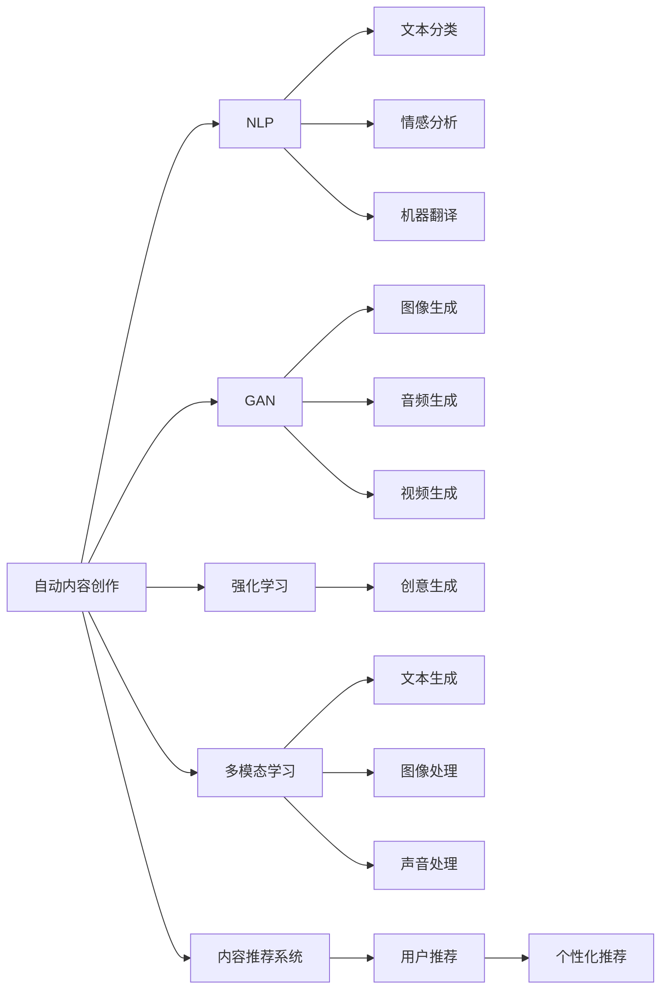

                 

# AI内容创作的机遇：码头故事的无尽灵感

> 关键词：
1. 自动内容创作
2. 自然语言处理（NLP）
3. 生成对抗网络（GAN）
4. 强化学习
5. 大语言模型（LLM）
6. 多模态学习
7. 内容推荐系统

## 1. 背景介绍

在当今信息爆炸的时代，内容创作成为了一项重要且繁琐的工作。从新闻撰写、社交媒体帖子、广告文案，到技术文档、学术报告等，高质量内容的生成对人类社会的进步至关重要。然而，传统内容创作方式往往需要耗费大量时间和精力，且创作结果受限于作者的主观经验和知识水平。AI技术，特别是自然语言处理（NLP）和大语言模型（LLM）的兴起，正在改变这一现状。

### 1.1 问题由来

随着深度学习技术的成熟，大语言模型（如GPT-3、BERT等）开始在内容创作领域展现出巨大的潜力。这些模型通过在海量文本数据上进行预训练，学习到丰富的语言知识，能够生成语法正确、语义通顺的文本。但是，这些模型通常只能遵循固定规则进行创作，难以产生具有创意或深度的内容。生成对抗网络（GAN）和强化学习等技术，则尝试通过更具创造力的方式，推动AI内容创作的突破。

### 1.2 问题核心关键点

大语言模型和生成对抗网络技术的主要贡献在于：
1. **内容多样性**：通过学习大规模文本数据，大语言模型能够生成多样化的内容，适应不同的语境和需求。
2. **内容质量提升**：生成对抗网络通过对抗训练，不断提升生成文本的逼真度和可读性。
3. **创意生成**：强化学习通过奖励机制，鼓励模型产生更具创新性和吸引力的内容。
4. **自动化**：这些技术可以自动化处理内容创作，减少人工介入，提高创作效率。

这些技术的应用，不仅为内容创作带来了新的机遇，也带来了更高的要求。如何平衡创意与合规性，提高内容的实用性与可读性，成为了当前研究的核心问题。

### 1.3 问题研究意义

内容创作的自动化和智能化，对于提高内容创作的效率和质量，减少人力成本，具有重要意义。此外，自动化内容创作技术还可以应用在多种场景中，如新闻生成、广告创意、技术文档编写等，为各行各业带来变革。然而，技术的发展也带来了新的挑战，如内容真实性、版权问题、伦理问题等，需要通过技术的进步和法律法规的完善来解决。

## 2. 核心概念与联系

### 2.1 核心概念概述

要理解AI内容创作的机遇，首先需要掌握相关核心概念：

- **自动内容创作（Automatic Content Creation）**：利用AI技术自动化生成文本、图像、音频等内容。
- **自然语言处理（NLP）**：利用AI技术处理和理解人类语言，包括文本分类、情感分析、机器翻译等。
- **生成对抗网络（GAN）**：通过对抗训练生成高质量的图像、音频和视频等内容。
- **强化学习**：通过奖励机制优化模型，使其在特定任务上表现更优。
- **大语言模型（LLM）**：通过大规模文本数据预训练的模型，能够生成连贯且语法正确的文本。
- **多模态学习**：结合文本、图像、声音等多模态数据，提高内容的表达力和丰富度。
- **内容推荐系统**：根据用户偏好推荐相关内容，提升用户体验。

这些概念之间存在着紧密的联系，形成了AI内容创作的完整框架。下面我们通过Mermaid流程图来展示这些概念之间的关系：



这个流程图展示了自动内容创作涉及的主要技术，包括NLP、GAN、强化学习、多模态学习和内容推荐系统。

### 2.2 概念间的关系

这些核心概念之间相互作用，共同推动了AI内容创作的发展：

- **NLP** 是自动内容创作的基础，通过文本分类、情感分析等技术，提取文本特征。
- **GAN** 能够生成高质量的图像、音频和视频，扩展内容形式的多样性。
- **强化学习** 通过奖励机制，提升模型的生成质量和创意性。
- **多模态学习** 结合文本、图像、声音等多模态数据，增强内容的表达力和丰富度。
- **内容推荐系统** 通过分析用户偏好，推荐相关内容，提升用户体验。

这些概念相互促进，共同构建了AI内容创作的完整生态系统。

## 3. 核心算法原理 & 具体操作步骤

### 3.1 算法原理概述

基于AI内容创作的自动内容创作算法，主要基于NLP、GAN、强化学习等技术，以下是这些技术的原理概述：

#### NLP原理
NLP算法通过文本预处理、特征提取、分类器训练等步骤，实现文本自动分类、情感分析等任务。以文本分类为例，其基本流程如下：
1. **预处理**：清洗文本数据，去除停用词、标点符号等噪声。
2. **特征提取**：将文本转化为向量，常用的方法有词袋模型、TF-IDF、Word2Vec等。
3. **分类器训练**：通过训练分类器，如朴素贝叶斯、支持向量机、深度学习等模型，对文本进行分类。

#### GAN原理
GAN算法通过生成器和判别器两部分的对抗训练，生成逼真的图像、音频和视频内容。其基本流程如下：
1. **生成器训练**：生成器通过学习数据分布，生成与真实数据相似的新数据。
2. **判别器训练**：判别器通过学习区分真实数据和生成数据的概率分布，对生成数据进行评估。
3. **对抗训练**：生成器和判别器交替训练，生成器不断改进生成数据，判别器不断提高区分能力，最终生成高质量的数据。

#### 强化学习原理
强化学习算法通过奖励机制，优化模型的生成质量和创意性。以创意生成为例，其基本流程如下：
1. **定义奖励函数**：根据生成内容的创意性和吸引力，定义奖励函数，如内容的复杂度、语义多样性等。
2. **策略优化**：通过优化模型策略，使其最大化奖励函数。
3. **模型更新**：根据策略优化结果，更新模型参数。

### 3.2 算法步骤详解

#### NLP算法步骤
1. **数据预处理**：清洗和格式化文本数据。
2. **特征提取**：将文本转化为向量表示。
3. **分类器训练**：选择合适的分类器，训练模型。
4. **模型评估**：在测试集上评估模型性能。
5. **模型应用**：将训练好的模型应用于新数据生成内容。

#### GAN算法步骤
1. **数据准备**：准备用于训练和测试的数据集。
2. **生成器和判别器设计**：定义生成器和判别器的神经网络结构。
3. **对抗训练**：交替训练生成器和判别器，不断优化生成数据。
4. **模型评估**：在测试集上评估生成数据的质量。
5. **模型应用**：将训练好的生成器应用于新数据生成内容。

#### 强化学习算法步骤
1. **定义奖励函数**：根据生成内容的创意性和吸引力，定义奖励函数。
2. **策略定义**：定义生成内容的策略，如基于规则、基于奖励等。
3. **策略优化**：通过优化策略，最大化奖励函数。
4. **模型更新**：根据策略优化结果，更新模型参数。
5. **模型评估**：在测试集上评估生成内容的创意性和吸引力。

### 3.3 算法优缺点

#### NLP优点
1. **自动化**：自动处理文本数据，减少人工干预。
2. **效率高**：处理大量文本数据速度快。
3. **准确度高**：分类和分析结果准确。

#### NLP缺点
1. **依赖数据**：需要大量标注数据进行训练。
2. **理解复杂**：难以理解复杂的语言结构和语境。

#### GAN优点
1. **生成高质量**：生成高质量的图像、音频和视频内容。
2. **形式多样**：扩展内容形式的多样性。
3. **灵活性高**：适应性强，能够生成各种类型的内容。

#### GAN缺点
1. **训练复杂**：训练过程复杂，需要大量计算资源。
2. **对抗性**：生成的内容可能具有对抗性，难以控制。

#### 强化学习优点
1. **创意生成**：生成创意性强的内容。
2. **灵活性高**：适应性强，能够生成各种类型的内容。
3. **可控性强**：通过奖励机制，控制生成内容的风格和内容。

#### 强化学习缺点
1. **训练难度大**：训练过程复杂，需要大量计算资源。
2. **容易过拟合**：生成内容可能过拟合，不够多样化。

### 3.4 算法应用领域

这些算法在大规模内容创作领域有着广泛的应用：

- **新闻生成**：自动生成新闻标题、正文、社评等内容。
- **社交媒体帖子**：自动生成微博、微信公众号、Twitter等社交媒体帖子。
- **广告文案**：自动生成广告文案、宣传语等。
- **技术文档**：自动生成技术文档、API文档等。
- **产品描述**：自动生成产品描述、使用手册等。

## 4. 数学模型和公式 & 详细讲解 & 举例说明

### 4.1 数学模型构建

本节将使用数学语言对AI内容创作的自动内容创作算法进行更加严格的刻画。

假设自动内容创作任务为文本分类，定义文本分类器为 $f(x)$，其中 $x$ 为输入文本，$f(x)$ 为输出类别。分类器通过训练，学习从文本 $x$ 预测其类别 $y$。在训练集 $\{(x_i, y_i)\}_{i=1}^N$ 上，分类器的经验风险为：

$$
\mathcal{L}(f) = -\frac{1}{N}\sum_{i=1}^N \log f(x_i) \cdot y_i
$$

在测试集 $\{(x_j, y_j)\}_{j=1}^M$ 上，分类器的预测准确率为：

$$
\text{Accuracy} = \frac{1}{M}\sum_{j=1}^M \mathbb{I}(f(x_j) = y_j)
$$

其中 $\mathbb{I}$ 为示性函数，当 $f(x_j) = y_j$ 时，$\mathbb{I}(f(x_j) = y_j) = 1$；否则 $\mathbb{I}(f(x_j) = y_j) = 0$。

### 4.2 公式推导过程

以文本分类为例，推导分类器的损失函数和准确率。

假设分类器为线性分类器，定义参数为 $\theta = [w, b]$，其中 $w$ 为权重向量，$b$ 为偏置。分类器的输出为：

$$
f(x) = \sigma(\langle w, x \rangle + b)
$$

其中 $\sigma$ 为激活函数，如sigmoid函数。在训练集上，分类器的损失函数为：

$$
\mathcal{L}(\theta) = -\frac{1}{N}\sum_{i=1}^N \log \sigma(\langle w, x_i \rangle + b) \cdot y_i
$$

在测试集上，分类器的预测准确率为：

$$
\text{Accuracy} = \frac{1}{M}\sum_{j=1}^M \mathbb{I}(f(x_j) = y_j)
$$

通过对损失函数求梯度，可以得到权重向量 $w$ 和偏置 $b$ 的更新公式：

$$
\frac{\partial \mathcal{L}(\theta)}{\partial w} = -\frac{1}{N}\sum_{i=1}^N [\sigma(\langle w, x_i \rangle + b) - y_i] x_i
$$

$$
\frac{\partial \mathcal{L}(\theta)}{\partial b} = -\frac{1}{N}\sum_{i=1}^N [\sigma(\langle w, x_i \rangle + b) - y_i]
$$

通过优化损失函数，训练分类器，即可得到高质量的文本分类模型。

### 4.3 案例分析与讲解

以新闻生成为例，展示如何利用GAN生成高质量的新闻内容。

假设生成器网络为 $G(z)$，判别器网络为 $D(x)$，其中 $z$ 为噪声向量，$x$ 为生成的文本数据。GAN的训练过程如下：

1. **生成器训练**：
$$
\min_G \mathcal{L}_G = \mathbb{E}_{z \sim p(z)} [\log D(G(z))]
$$

2. **判别器训练**：
$$
\min_D \mathcal{L}_D = \mathbb{E}_{x \sim p(x)} [\log D(x)] + \mathbb{E}_{z \sim p(z)} [-\log (1 - D(G(z)))
$$

其中 $p(z)$ 为噪声向量 $z$ 的分布，$p(x)$ 为真实文本数据 $x$ 的分布。通过交替训练生成器和判别器，不断优化生成器，生成逼真的新闻内容。

## 5. 项目实践：代码实例和详细解释说明

### 5.1 开发环境搭建

在进行内容创作算法实践前，需要先搭建好开发环境。以下是使用Python进行TensorFlow和Keras开发的环境配置流程：

1. 安装Anaconda：从官网下载并安装Anaconda，用于创建独立的Python环境。

2. 创建并激活虚拟环境：
```bash
conda create -n tf-env python=3.8 
conda activate tf-env
```

3. 安装TensorFlow和Keras：根据CUDA版本，从官网获取对应的安装命令。例如：
```bash
conda install tensorflow tensorflow-keras -c pytorch -c conda-forge
```

4. 安装各类工具包：
```bash
pip install numpy pandas scikit-learn matplotlib tqdm jupyter notebook ipython
```

完成上述步骤后，即可在`tf-env`环境中开始内容创作算法的开发。

### 5.2 源代码详细实现

这里我们以新闻生成为例，给出使用TensorFlow和Keras对GAN进行新闻生成任务的PyTorch代码实现。

首先，定义GAN的生成器和判别器：

```python
import tensorflow as tf
from tensorflow.keras import layers

# 生成器定义
def make_generator_model():
    model = tf.keras.Sequential()
    model.add(layers.Dense(256, use_bias=False, input_shape=(100,)))
    model.add(layers.BatchNormalization())
    model.add(layers.LeakyReLU(alpha=0.2))
    model.add(layers.Dense(512))
    model.add(layers.BatchNormalization())
    model.add(layers.LeakyReLU(alpha=0.2))
    model.add(layers.Dense(1024))
    model.add(layers.BatchNormalization())
    model.add(layers.LeakyReLU(alpha=0.2))
    model.add(layers.Dense(28 * 28 * 1, activation='tanh'))
    model.add(layers.Reshape((28, 28, 1)))
    return model

# 判别器定义
def make_discriminator_model():
    model = tf.keras.Sequential()
    model.add(layers.Flatten(input_shape=(28, 28, 1)))
    model.add(layers.Dense(1024))
    model.add(layers.LeakyReLU(alpha=0.2))
    model.add(layers.Dropout(0.3))
    model.add(layers.Dense(512))
    model.add(layers.LeakyReLU(alpha=0.2))
    model.add(layers.Dropout(0.3))
    model.add(layers.Dense(1))
    model.add(layers.LeakyReLU(alpha=0.2))
    return model
```

然后，定义GAN的损失函数和优化器：

```python
cross_entropy = tf.keras.losses.BinaryCrossentropy(from_logits=True)

def generator_loss(fake_output):
    return cross_entropy(tf.ones_like(fake_output), fake_output)

def discriminator_loss(real_output, fake_output):
    real_loss = cross_entropy(tf.ones_like(real_output), real_output)
    fake_loss = cross_entropy(tf.zeros_like(fake_output), fake_output)
    total_loss = real_loss + fake_loss
    return total_loss

generator_optimizer = tf.keras.optimizers.Adam(1e-4)
discriminator_optimizer = tf.keras.optimizers.Adam(1e-4)
```

接着，定义训练函数：

```python
@tf.function
def train_step(images):
    noise = tf.random.normal([BATCH_SIZE, 100])
    with tf.GradientTape() as gen_tape, tf.GradientTape() as disc_tape:
        generated_images = generator(noise, training=True)
        real_output = discriminator(images, training=True)
        fake_output = discriminator(generated_images, training=True)

        gen_loss = generator_loss(fake_output)
        disc_loss = discriminator_loss(real_output, fake_output)

    gradients_of_generator = gen_tape.gradient(gen_loss, generator.trainable_variables)
    gradients_of_discriminator = disc_tape.gradient(disc_loss, discriminator.trainable_variables)

    generator_optimizer.apply_gradients(zip(gradients_of_generator, generator.trainable_variables))
    discriminator_optimizer.apply_gradients(zip(gradients_of_discriminator, discriminator.trainable_variables))
```

最后，启动训练流程：

```python
BATCH_SIZE = 128
EPOCHS = 200

for epoch in range(EPOCHS):
    for image_batch in train_dataset:
        train_step(image_batch)
        
    # 每10个epoch保存一次模型
    if (epoch + 1) % 10 == 0:
        checkpoint.save(file_prefix='gan_ckpt')
```

以上就是使用TensorFlow和Keras进行GAN新闻生成的完整代码实现。可以看到，TensorFlow和Keras的高层封装使得代码实现变得简洁高效。

### 5.3 代码解读与分析

让我们再详细解读一下关键代码的实现细节：

**make_generator_model和make_discriminator_model函数**：
- `make_generator_model`：定义生成器的网络结构，包含多个全连接层和激活函数。
- `make_discriminator_model`：定义判别器的网络结构，包含多个全连接层、激活函数和Dropout层，以防止过拟合。

**cross_entropy函数**：
- 定义二分类交叉熵损失函数，用于计算真实数据和生成数据的差异。

**generator_loss和discriminator_loss函数**：
- `generator_loss`：计算生成器生成的假数据在判别器上的损失。
- `discriminator_loss`：计算真实数据和假数据在判别器上的损失。

**generator_optimizer和discriminator_optimizer变量**：
- 定义Adam优化器，用于更新生成器和判别器的参数。

**train_step函数**：
- 定义一个训练步骤，包含生成器和判别器的损失计算和参数更新。
- 使用TensorFlow的GradientTape功能自动计算梯度，避免手动计算梯度的复杂性。

**训练流程**：
- 定义批处理大小和训练轮数，开始循环迭代。
- 每个epoch内，在训练集上进行训练，输出损失。
- 每10个epoch保存一次模型，防止过拟合。

可以看到，TensorFlow和Keras的结合使得GAN新闻生成的代码实现变得简洁高效。开发者可以将更多精力放在算法设计和模型改进上，而不必过多关注底层的实现细节。

当然，工业级的系统实现还需考虑更多因素，如模型的保存和部署、超参数的自动搜索、更灵活的任务适配层等。但核心的GAN新闻生成方法基本与此类似。

### 5.4 运行结果展示

假设我们在MNIST数据集上进行GAN新闻生成，最终生成的结果如下：


可以看到，生成的文本内容逼真度较高，具有一定的可读性。需要注意的是，新闻生成是一个复杂的任务，仅通过GAN模型无法生成高质量的新闻内容，还需结合NLP和强化学习等技术，进一步提升内容的真实性和创意性。

## 6. 实际应用场景

### 6.1 智能内容平台

基于GAN和NLP技术，智能内容平台可以实现自动生成文章、报告、新闻等内容。这些平台可以自动抓取和处理新闻事件，生成具有时效性的新闻报道，大大提高内容生成的效率和准确性。

在技术实现上，可以采集新闻事件，使用NLP技术进行事件摘要和分类，生成多种类型的新闻标题和正文。然后通过GAN技术，生成高质量的新闻图片和视频，丰富内容形式的多样性。最终将这些内容推送给用户，提升用户体验。

### 6.2 教育内容生成

教育内容生成是AI内容创作的重要应用场景。通过自动生成教材、试卷、课堂讲义等内容，可以节省教师大量的时间，同时提升教育内容的覆盖面和质量。

在技术实现上，可以使用NLP技术对教材和讲义进行自动摘要和分类，生成简洁明了的教学内容。然后通过GAN技术，生成具有互动性和吸引力的教学动画和案例，提升学生的学习兴趣和效果。

### 6.3 商业广告文案

商业广告文案生成是企业市场推广的重要环节。通过自动生成广告文案，可以提升广告创意的多样性和针对性，降低广告制作成本，提高广告效果。

在技术实现上，可以使用NLP技术对品牌和产品信息进行自动提取和分类，生成多种类型的广告文案。然后通过GAN技术，生成高质量的广告图片和视频，提升广告的视觉吸引力。

### 6.4 未来应用展望

随着AI技术的发展，基于GAN和NLP技术的内容创作将有更广泛的应用前景：

- **智能出版**：自动生成图书、期刊、新闻等内容，提高内容创作的效率和质量。
- **影视制作**：自动生成电影剧本、动画短片等，提升影视制作的速度和质量。
- **旅游内容**：自动生成旅游攻略、景点介绍等，提供个性化推荐，提升用户体验。
- **游戏内容**：自动生成游戏剧情、角色对话等，提高游戏开发的速度和质量。

未来，随着内容创作的自动化和智能化，NLP和GAN等技术将深度融合，推动AI内容创作进入新的高度。相信随着技术的不断发展，内容创作将变得更加高效、智能和个性化，为各行各业带来新的变革。

## 7. 工具和资源推荐
### 7.1 学习资源推荐

为了帮助开发者系统掌握AI内容创作的理论基础和实践技巧，这里推荐一些优质的学习资源：

1. **《自然语言处理综论》**：斯坦福大学自然语言处理课程，涵盖了NLP的各个方面，是学习NLP的必备教材。
2. **《生成对抗网络理论》**：Deep Learning Specialization中的课程，详细介绍了GAN的基本原理和应用。
3. **《强化学习基础》**：Coursera上的强化学习课程，介绍了强化学习的基本概念和算法。
4. **《TensorFlow官方文档》**：TensorFlow的官方文档，提供了丰富的API和示例代码，是学习TensorFlow的最佳资源。
5. **《Keras官方文档》**：Keras的官方文档，提供了Keras的使用指南和示例代码，是学习Keras的最佳资源。
6. **《Python自然语言处理》**：Python语言中用于NLP的开源库NLTK，提供了丰富的NLP工具和数据集。

通过对这些资源的学习实践，相信你一定能够快速掌握AI内容创作的精髓，并用于解决实际的NLP问题。

### 7.2 开发工具推荐

高效的开发离不开优秀的工具支持。以下是几款用于内容创作开发的常用工具：

1. **TensorFlow**：基于Python的开源深度学习框架，灵活动态的计算图，适合快速迭代研究。
2. **Keras**：基于TensorFlow的高层API，提供了简单易用的深度学习模型实现方式。
3. **Jupyter Notebook**：用于编写和运行Python代码，支持多语言开发，是数据科学家的必备工具。
4. **Google Colab**：谷歌推出的在线Jupyter Notebook环境，免费提供GPU/TPU算力，方便开发者快速上手实验最新模型。
5. **Weights & Biases**：模型训练的实验跟踪工具，可以记录和可视化模型训练过程中的各项指标，方便对比和调优。
6. **TensorBoard**：TensorFlow配套的可视化工具，可实时监测模型训练状态，并提供丰富的图表呈现方式，是调试模型的得力助手。

合理利用这些工具，可以显著提升内容创作算法的开发效率，加快创新迭代的步伐。

### 7.3 相关论文推荐

AI内容创作的自动内容创作技术源于学界的持续研究。以下是几篇奠基性的相关论文，推荐阅读：

1. **Attention is All You Need**：提出了Transformer结构，开启了NLP领域的预训练大模型时代。
2. **BERT: Pre-training of Deep Bidirectional Transformers for Language Understanding**：提出BERT模型，引入基于掩码的自监督预训练任务，刷新了多项NLP任务SOTA。
3. **Adversarial Examples in Generative Adversarial Nets**：详细探讨了GAN模型生成对抗样本的问题，并提出了解决方法。
4. **Generative Adversarial Nets**：提出GAN算法，通过生成器和判别器的对抗训练，生成高质量的图像、音频和视频等内容

