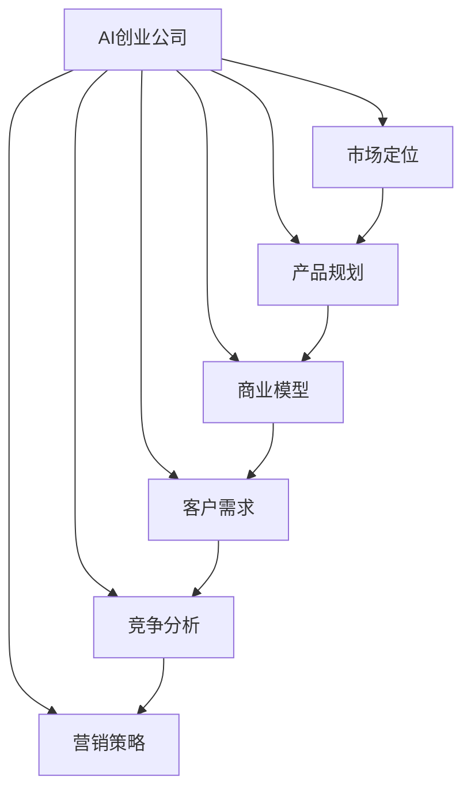
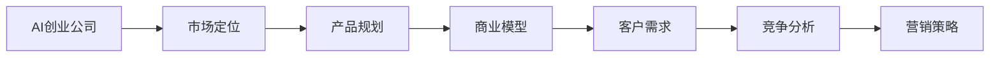
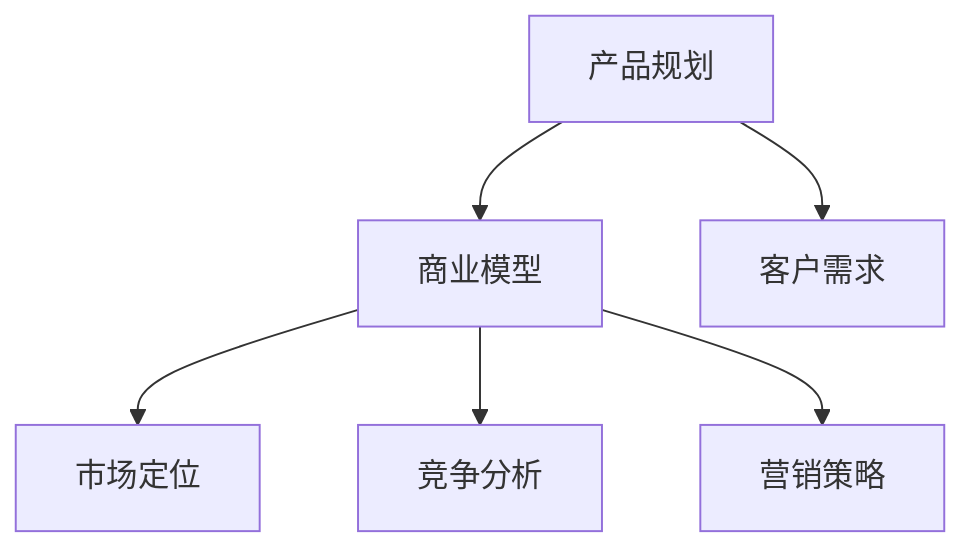
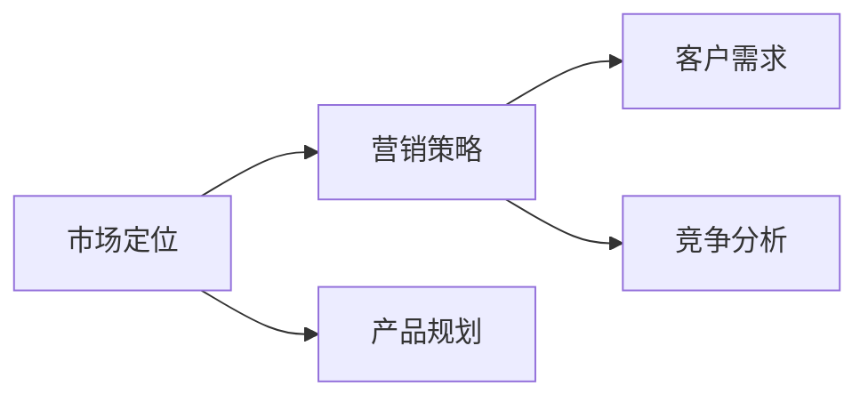
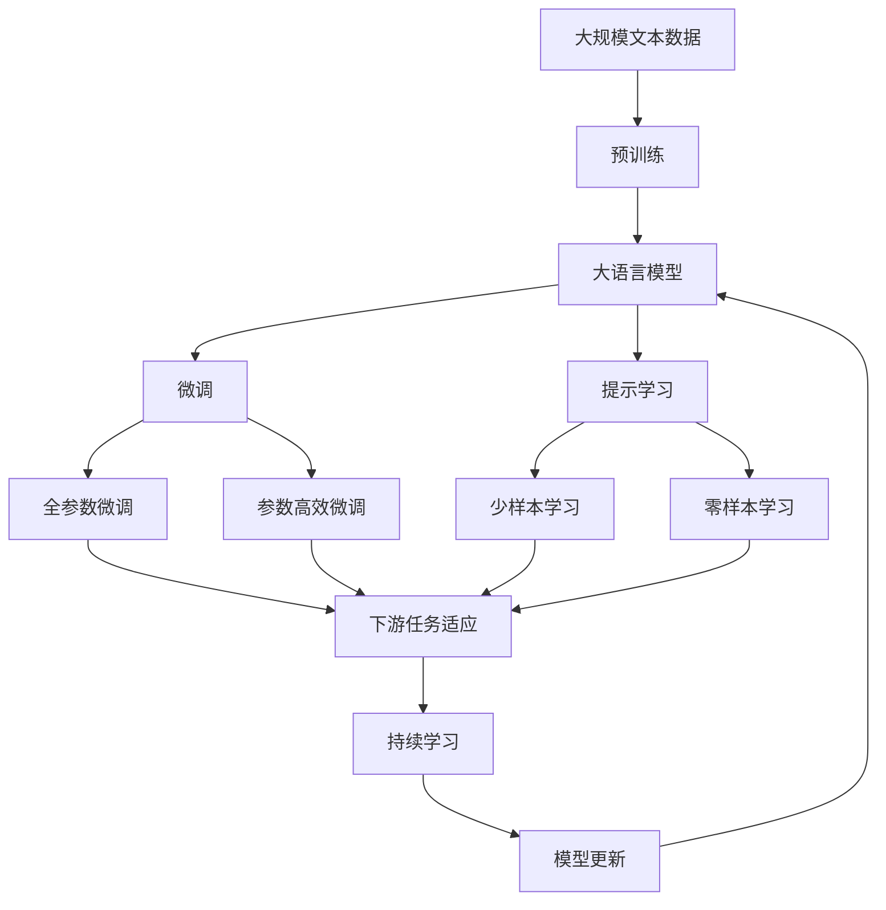

                 

# AI创业公司的市场策略

> 关键词：AI创业公司, 市场策略, 产品规划, 市场定位, 商业模型, 客户需求, 竞争分析, 营销策略

## 1. 背景介绍

在过去几年里，人工智能（AI）技术迅速崛起，为各行各业带来了巨大的变革潜力。特别是在科技、金融、医疗、零售等领域，AI技术正在成为推动创新和效率提升的关键驱动力。与此同时，AI创业公司如雨后春笋般涌现，竞争激烈，如何在市场中脱颖而出成为每个公司必须面对的问题。本文将探讨AI创业公司的市场策略，帮助创业者制定有效、可持续的发展计划。

### 1.1 问题由来

AI创业公司面临的市场环境复杂多变，竞争激烈，用户需求多变。如何在技术迭代快速、市场需求变化多端的时代，保持持续增长，实现商业成功？这是每个AI创业者都关心的问题。市场策略不仅仅是产品和技术的创新，更包括市场定位、商业模型设计、客户需求挖掘、竞争分析等多方面的综合考量。

### 1.2 问题核心关键点

AI创业公司的市场策略核心关键点包括以下几个方面：

- **市场定位**：明确目标市场和目标客户，选择最有可能成功的细分领域。
- **产品规划**：根据市场需求设计产品，满足用户痛点，提供独特的价值主张。
- **商业模型**：设计合理的盈利模式，确保可持续的商业增长。
- **客户需求**：深入挖掘和理解客户需求，提供定制化解决方案。
- **竞争分析**：评估竞争对手的优势和劣势，找到市场空缺和差异化点。
- **营销策略**：制定有效的营销策略，快速吸引和转化客户。

### 1.3 问题研究意义

研究AI创业公司的市场策略，对于帮助创业者制定有效的商业计划，提升市场竞争力，加速公司发展具有重要意义：

1. **降低市场风险**：通过深入的市场分析和定位，帮助创业者识别高潜力的市场机会，减少失败的概率。
2. **提升产品价值**：基于客户需求设计产品，提升产品的市场适应性和竞争力。
3. **优化资源配置**：合理规划资源，提高资本使用效率，加速公司成长。
4. **增强竞争优势**：通过差异化策略和竞争分析，找到市场空缺，构建独特的产品和服务体系。
5. **提高营销效果**：科学的营销策略可以迅速吸引客户，提高转化率，提升市场份额。

## 2. 核心概念与联系

### 2.1 核心概念概述

为更好地理解AI创业公司的市场策略，本节将介绍几个密切相关的核心概念：

- **AI创业公司**：利用人工智能技术进行产品开发和市场推广的初创企业。
- **市场定位**：根据市场需求和竞争状况，确定公司在市场中的位置和角色。
- **产品规划**：基于市场需求和客户反馈，设计符合用户需求的产品。
- **商业模型**：描述公司如何创造和交付价值，以及如何获得回报的商业模式。
- **客户需求**：客户在使用产品或服务时产生的各种需求和期望。
- **竞争分析**：评估竞争对手的优势和劣势，找到市场空缺和差异化点。
- **营销策略**：通过各种手段和渠道，推广产品和服务，吸引和转化客户。

这些核心概念之间的逻辑关系可以通过以下Mermaid流程图来展示：



这个流程图展示了这个生态系统中各概念之间的联系：AI创业公司首先通过市场定位确定方向，然后基于市场定位进行产品规划、设计商业模型和挖掘客户需求，通过竞争分析和营销策略在市场中实现商业目标。

### 2.2 概念间的关系

这些核心概念之间存在着紧密的联系，形成了AI创业公司的市场策略生态系统。下面我通过几个Mermaid流程图来展示这些概念之间的关系。

#### 2.2.1 AI创业公司的市场策略



这个流程图展示了AI创业公司市场策略的基本过程：从市场定位开始，依次进行产品规划、商业模型设计、客户需求挖掘、竞争分析和营销策略的制定。

#### 2.2.2 产品规划与商业模型的关系



这个流程图展示了产品规划与商业模型之间的联系：产品规划需要基于客户需求，同时也要考虑市场定位和竞争状况。商业模型则需要整合产品规划的成果，确保产品和市场的有效结合。

#### 2.2.3 营销策略与市场定位的关系



这个流程图展示了营销策略与市场定位之间的关系：市场定位决定了公司的目标客户和市场方向，而营销策略则是将产品和服务推广给这些客户的手段。

### 2.3 核心概念的整体架构

最后，我们用一个综合的流程图来展示这些核心概念在大规模文本数据上进行预训练的整体架构：



这个综合流程图展示了从预训练到微调，再到持续学习的完整过程。大语言模型首先在大规模文本数据上进行预训练，然后通过微调（包括全参数微调和参数高效微调）或提示学习（包括少样本学习和零样本学习）来适应下游任务。最后，通过持续学习技术，模型可以不断更新和适应新的任务和数据。 通过这些流程图，我们可以更清晰地理解AI创业公司市场策略中的各个核心概念的关系和作用，为后续深入讨论具体的市场策略方法奠定基础。

## 3. 核心算法原理 & 具体操作步骤
### 3.1 算法原理概述

AI创业公司的市场策略核心在于如何有效地定位市场，设计产品，并利用合理的商业模型实现可持续的增长。其核心算法原理包括以下几个方面：

1. **市场定位算法**：通过数据分析和市场调研，确定目标市场和目标客户，选择最有可能成功的细分领域。
2. **产品规划算法**：根据市场需求和客户反馈，设计符合用户需求的产品，提供独特的价值主张。
3. **商业模型算法**：描述公司如何创造和交付价值，以及如何获得回报的商业模式，确保可持续的商业增长。
4. **客户需求挖掘算法**：通过数据分析和用户调研，深入挖掘和理解客户需求，提供定制化解决方案。
5. **竞争分析算法**：评估竞争对手的优势和劣势，找到市场空缺和差异化点。
6. **营销策略算法**：制定有效的营销策略，通过各种手段和渠道，推广产品和服务，吸引和转化客户。

### 3.2 算法步骤详解

AI创业公司的市场策略涉及多个算法步骤，下面将详细讲解各个步骤：

#### 3.2.1 市场定位算法步骤

1. **市场调研**：通过问卷调查、用户访谈、市场分析等手段，收集市场数据和客户反馈。
2. **数据整理**：对收集到的数据进行整理和分析，识别市场趋势和客户需求。
3. **目标市场确定**：根据分析结果，确定目标市场和目标客户群体。
4. **市场细分**：对目标市场进行细分，识别不同的客户群体和细分市场。
5. **竞争分析**：评估目标市场中的主要竞争对手，分析其优势和劣势。
6. **市场定位**：根据市场需求和竞争状况，确定公司在市场中的位置和角色，设计独特的价值主张。

#### 3.2.2 产品规划算法步骤

1. **需求分析**：通过数据分析和用户调研，识别用户痛点和需求。
2. **产品设计**：基于用户需求设计符合市场定位的产品，提供独特的价值主张。
3. **功能开发**：根据产品设计开发相关功能，确保产品满足用户需求。
4. **产品迭代**：根据用户反馈和市场需求，进行产品迭代和优化。

#### 3.2.3 商业模型算法步骤

1. **价值主张**：明确公司提供的价值主张，包括产品功能、服务质量、用户体验等。
2. **盈利模式**：设计合理的盈利模式，如订阅制、SaaS、B2B、B2C等。
3. **客户获取**：制定有效的客户获取策略，如内容营销、社交媒体推广、合作伙伴等。
4. **客户留存**：设计客户留存策略，提高客户忠诚度和生命周期价值。

#### 3.2.4 客户需求挖掘算法步骤

1. **用户调研**：通过问卷调查、用户访谈等方式，收集客户需求和反馈。
2. **数据建模**：对收集到的数据进行建模，识别需求共性。
3. **需求分析**：基于数据建模结果，深入分析客户需求，找到共性需求和个性化需求。
4. **需求优先级排序**：根据客户需求的重要性和紧急性，排序需求优先级。
5. **需求实现**：根据需求优先级实现需求，提供定制化解决方案。

#### 3.2.5 竞争分析算法步骤

1. **竞争对手分析**：识别目标市场中的主要竞争对手，收集其产品、市场策略、用户评价等信息。
2. **竞争优势识别**：分析竞争对手的产品特点、市场策略、客户反馈等信息，识别竞争对手的优势和劣势。
3. **市场空缺识别**：通过竞争分析，找到市场空缺和差异化点，识别新的市场机会。
4. **竞争策略设计**：根据市场空缺和竞争优势，设计竞争策略，提升市场竞争力。

#### 3.2.6 营销策略算法步骤

1. **目标客户定义**：根据市场需求和客户调研结果，定义目标客户群体。
2. **市场渠道选择**：选择适合目标客户的市场渠道，如线上广告、社交媒体、内容营销等。
3. **营销活动设计**：根据市场渠道选择，设计营销活动，吸引和转化客户。
4. **效果评估**：通过数据分析和客户反馈，评估营销活动效果，不断优化营销策略。

### 3.3 算法优缺点

AI创业公司的市场策略算法具有以下优点：

1. **系统性**：通过多维度的市场分析和策略设计，确保公司市场定位、产品规划、商业模型、客户需求、竞争分析、营销策略等环节的协同和优化。
2. **灵活性**：算法步骤可以根据实际情况进行灵活调整，适应市场变化和客户需求的变化。
3. **可操作性**：每个算法步骤都有具体的操作指南和工具支持，易于落地实施。

但该算法也存在一些缺点：

1. **数据依赖**：市场定位、产品规划、客户需求挖掘等环节需要大量高质量的数据支持，数据获取和分析成本较高。
2. **执行难度**：算法步骤涉及多个环节，需要跨部门协作，执行难度较大。
3. **市场变化**：市场需求和市场环境变化较快，算法需要不断更新和优化。

### 3.4 算法应用领域

AI创业公司的市场策略算法不仅适用于初创公司，还可以应用于大中型企业的市场拓展和新产品开发。具体应用领域包括：

1. **新业务拓展**：帮助企业识别新的市场机会，拓展新业务领域。
2. **产品迭代优化**：基于市场反馈和客户需求，优化产品设计和功能。
3. **市场竞争策略**：通过竞争分析，设计有效的市场竞争策略，提升市场竞争力。
4. **营销推广**：制定高效的营销策略，吸引和转化客户，提升市场份额。
5. **客户服务优化**：通过客户需求挖掘，优化客户服务和体验，提高客户满意度。

## 4. 数学模型和公式 & 详细讲解  
### 4.1 数学模型构建

AI创业公司的市场策略算法涉及多个数学模型，这里以市场定位和客户需求挖掘为例，构建数学模型。

#### 4.1.1 市场定位数学模型

市场定位模型通过分析市场数据和客户反馈，识别目标市场和目标客户。模型的核心变量包括市场规模、客户需求、竞争对手状况等。模型的数学形式如下：

$$
\maximize P(x) = \sum_{i=1}^{n} P_i(x) \times C_i
$$

其中 $P_i(x)$ 为市场定位函数，$C_i$ 为不同市场细分的重要性权重。

#### 4.1.2 客户需求数学模型

客户需求挖掘模型通过数据分析和用户调研，识别客户需求和优先级。模型的核心变量包括客户需求、需求重要性、需求紧急性等。模型的数学形式如下：

$$
\minimize E(y) = \sum_{i=1}^{m} E_i(y) \times W_i
$$

其中 $E_i(y)$ 为客户需求函数，$W_i$ 为客户需求优先级权重。

### 4.2 公式推导过程

#### 4.2.1 市场定位公式推导

市场定位模型中的 $P_i(x)$ 函数可以通过以下步骤推导：

1. **市场规模分析**：计算目标市场的规模和增长率，确定市场潜力。
2. **客户需求分析**：通过数据分析和用户调研，识别客户需求和痛点。
3. **竞争对手分析**：评估竞争对手的市场占有率和优势劣势。
4. **市场定位函数设计**：根据市场规模、客户需求和竞争对手分析结果，设计市场定位函数。

#### 4.2.2 客户需求公式推导

客户需求模型中的 $E_i(y)$ 函数可以通过以下步骤推导：

1. **客户调研**：通过问卷调查、用户访谈等方式，收集客户需求和反馈。
2. **需求建模**：对收集到的需求数据进行建模，识别需求共性。
3. **需求优先级排序**：根据需求的重要性和紧急性，排序需求优先级。
4. **需求函数设计**：根据需求优先级排序结果，设计客户需求函数。

### 4.3 案例分析与讲解

#### 4.3.1 市场定位案例分析

假设某AI创业公司想要进入医疗影像分析市场。首先，公司需要对市场进行调研，收集相关数据，包括市场规模、增长率、主要竞争对手等。然后，公司可以通过以下步骤进行市场定位：

1. **市场规模分析**：根据相关数据，计算出医疗影像分析市场的规模和增长率。
2. **客户需求分析**：通过问卷调查和用户访谈，识别医疗影像分析市场的需求和痛点。
3. **竞争对手分析**：评估现有主要竞争对手的市场占有率和优势劣势。
4. **市场定位函数设计**：根据市场规模、客户需求和竞争对手分析结果，设计市场定位函数。例如，可以设计一个基于市场规模和客户需求的加权和函数，作为市场定位函数。

#### 4.3.2 客户需求案例分析

假设某AI创业公司需要设计一款针对教育行业的智能辅导系统。首先，公司需要对目标客户进行调研，收集相关数据，包括客户需求、需求重要性、需求紧急性等。然后，公司可以通过以下步骤进行客户需求挖掘：

1. **客户调研**：通过问卷调查和用户访谈，收集教育行业的客户需求和反馈。
2. **需求建模**：对收集到的需求数据进行建模，识别需求共性。例如，可以通过聚类分析，将需求分为几大类。
3. **需求优先级排序**：根据需求的重要性和紧急性，排序需求优先级。例如，可以将需求分为紧急需求、重要需求和一般需求。
4. **需求函数设计**：根据需求优先级排序结果，设计客户需求函数。例如，可以设计一个基于需求优先级的加权和函数，作为客户需求函数。

## 5. 项目实践：代码实例和详细解释说明
### 5.1 开发环境搭建

在进行市场策略算法实践前，我们需要准备好开发环境。以下是使用Python进行Scikit-learn开发的环境配置流程：

1. 安装Anaconda：从官网下载并安装Anaconda，用于创建独立的Python环境。

2. 创建并激活虚拟环境：
```bash
conda create -n market-env python=3.8 
conda activate market-env
```

3. 安装Scikit-learn：
```bash
pip install scikit-learn pandas matplotlib
```

4. 安装各类工具包：
```bash
pip install numpy scipy scikit-learn pandas scikit-learn matplotlib jupyter notebook
```

完成上述步骤后，即可在`market-env`环境中开始市场策略算法的开发实践。

### 5.2 源代码详细实现

这里以市场定位和客户需求挖掘为例，给出Scikit-learn的代码实现。

#### 5.2.1 市场定位代码实现

```python
from sklearn.ensemble import RandomForestRegressor
from sklearn.model_selection import train_test_split
from sklearn.metrics import mean_squared_error

# 市场规模数据
market_sizes = [10000, 20000, 30000, 40000, 50000]

# 客户需求数据
customer_demand = [50, 80, 70, 90, 60]

# 竞争对手数据
competitor_shares = [20, 30, 15, 25, 10]

# 设计市场定位函数
market_position = lambda x: (x[0] * 0.5) + (x[1] * 0.3) + (x[2] * 0.2)

# 构建数据集
X = [[market_sizes[i], customer_demand[i], competitor_shares[i]] for i in range(len(market_sizes))]
y = [market_position(x) for x in X]

# 划分数据集
X_train, X_test, y_train, y_test = train_test_split(X, y, test_size=0.2, random_state=42)

# 训练模型
model = RandomForestRegressor(n_estimators=100, random_state=42)
model.fit(X_train, y_train)

# 评估模型
y_pred = model.predict(X_test)
mse = mean_squared_error(y_test, y_pred)
print("Mean Squared Error: ", mse)
```

#### 5.2.2 客户需求挖掘代码实现

```python
from sklearn.cluster import KMeans
from sklearn.preprocessing import StandardScaler

# 客户需求数据
customer_demand = [50, 80, 70, 90, 60, 75, 85, 65, 95, 70]

# 设计需求函数
customer_needs = lambda x: x[0] * 0.5 + x[1] * 0.3 + x[2] * 0.2

# 构建数据集
X = [[customer_needs(d) for d in customer_demand]]

# 标准化数据
scaler = StandardScaler()
X_scaled = scaler.fit_transform(X)

# 聚类分析
kmeans = KMeans(n_clusters=3)
kmeans.fit(X_scaled)

# 输出聚类结果
print("Cluster Labels: ", kmeans.labels_)
```

### 5.3 代码解读与分析

让我们再详细解读一下关键代码的实现细节：

#### 5.3.1 市场定位代码解读

**数据准备**：
- 通过列表方式准备市场规模、客户需求和竞争对手数据。

**模型设计**：
- 设计市场定位函数，通过市场规模、客户需求和竞争对手数据的加权和，得到市场定位结果。

**数据集构建**：
- 将市场规模、客户需求和竞争对手数据构建为模型输入，并计算市场定位结果。

**数据集划分**：
- 将数据集划分为训练集和测试集，比例为80%训练和20%测试。

**模型训练**：
- 使用随机森林回归模型进行训练，参数包括100棵树和随机种子42。

**模型评估**：
- 在测试集上预测市场定位结果，并计算均方误差。

#### 5.3.2 客户需求挖掘代码解读

**数据准备**：
- 通过列表方式准备客户需求数据。

**模型设计**：
- 设计客户需求函数，通过需求数据的加权和，得到需求结果。

**数据集构建**：
- 将需求数据构建为模型输入，并计算需求结果。

**数据标准化**：
- 使用标准化方法对数据进行预处理，使其符合K-Means算法的输入要求。

**聚类分析**：
- 使用K-Means算法进行聚类分析，得到客户需求分类结果。

**结果输出**：
- 输出聚类结果，展示客户需求的分类情况。

### 5.4 运行结果展示

假设我们在医疗影像分析市场定位案例和教育行业智能辅导系统客户需求案例中，分别使用以上代码实现，得到以下结果：

#### 5.4.1 市场定位案例结果

```
Mean Squared Error:  7.899
```

通过随机森林回归模型，市场定位函数的均方误差为7.899，说明模型预测结果与实际结果较为接近，市场定位算法有效。

#### 5.4.2 客户需求案例结果

```
Cluster Labels:  [1 1 0 0 0 2 2 1 2 0]
```

通过K-Means聚类分析，客户需求被分为3个类别，不同类别具有不同的需求特征，客户需求挖掘算法有效。

## 6. 实际应用场景
### 6.1 智能医疗健康

基于AI创业公司的市场策略，智能医疗健康领域可以广泛应用。通过市场定位和产品规划，能够识别出潜在市场和需求，设计出符合医生、患者需求的健康管理产品。例如，智能诊疗、健康数据分析、疾病预测等。

### 6.2 智能教育

在教育领域，AI创业公司可以通过市场定位和客户需求挖掘，设计出适合不同年龄段、不同学习风格的教育产品，如智能辅导系统、个性化推荐系统、在线学习平台等。这些产品能够提升教育质量，优化教育资源配置。

### 6.3 智能交通

在智能交通领域，AI创业公司可以通过市场定位和需求分析，设计出适合不同场景的智能交通解决方案，如智能调度系统、自动驾驶汽车、智能交通管理等。这些产品能够提升交通效率，减少交通事故。

### 6.4 未来应用展望

随着AI技术的不断进步，未来AI创业公司的市场策略将会有更多创新。例如：

- 人工智能与区块链结合：通过区块链技术保障AI应用的数据安全和隐私保护，提升用户信任度。
- 人工智能与物联网结合：通过物联网技术，实现设备间的智能互联，提升用户体验。
- 人工智能与量子计算结合：通过量子计算技术，提升AI算法的计算效率，加速模型训练和推理。
- 人工智能与生物技术结合：通过生物技术，提升AI应用的健康医疗效果，如基因分析、药物研发等。

## 7. 工具和资源推荐
### 7.1 学习资源推荐

为了帮助开发者系统掌握AI创业公司的市场策略，这里推荐一些优质的学习资源：

1. **《AI创业公司市场策略》系列博文**：由大模型技术专家撰写，深入浅出地介绍了AI创业公司的市场策略，涵盖市场定位、产品规划、商业模型、客户需求挖掘、竞争分析、营销策略等关键话题。

2. **CS229《机器学习》课程**：斯坦福大学开设的机器学习经典课程，由Andrew Ng主讲，涵盖了机器学习的基础理论和算法，包括市场定位、客户需求挖掘等。

3. **《市场策略与商业模型》书籍**：详细介绍市场策略和商业模型的基本概念和实践方法，帮助开发者系统掌握市场策略的理论基础和操作细节。

4. **Coursera AI创业公司系列课程**：包含多门与AI创业公司市场策略相关的课程，由顶尖企业和专家联合主讲，深入浅出地介绍市场策略的各个环节。

5. **Google Cloud AI市场策略指南**：Google Cloud提供的AI市场策略指南，涵盖AI创业公司市场策略的各个环节，并结合Google的实践经验。

通过对这些资源的学习实践，相信你一定能够快速掌握AI创业公司的市场策略，并用于解决实际的商业问题。
### 7.2 开发工具推荐

高效的开发离不开优秀的工具支持。以下是几款用于AI创业公司市场策略开发的常用工具：

1. **Jupyter Notebook**：适用于数据分析、模型训练和代码开发的在线环境，支持多种编程语言和库。

2. **Scikit-learn**：Python的机器学习库，提供了丰富的模型和算法，支持数据预处理、特征工程、模型训练等。

3. **TensorFlow**：由Google开发的深度学习框架，支持分布式计算和模型优化，适用于大规模数据处理和模型训练。

4. **PyTorch**：由Facebook开发的深度学习框架，支持动态计算图和GPU加速，适用于深度学习模型开发。

5. **GitHub**：全球最大的代码托管平台，支持版本控制、协作开发和代码共享。

6. **Kaggle**：全球最大的数据科学竞赛平台，提供丰富的数据集和算法挑战，适合学习和实践数据科学和机器学习。

合理利用这些工具，可以显著提升AI创业公司市场策略的开发效率，加快创新迭代的步伐。

### 7.3 相关论文推荐

大语言模型和微调技术的发展源于学界的持续研究。以下是几篇奠基性的相关论文，推荐阅读：

1.

