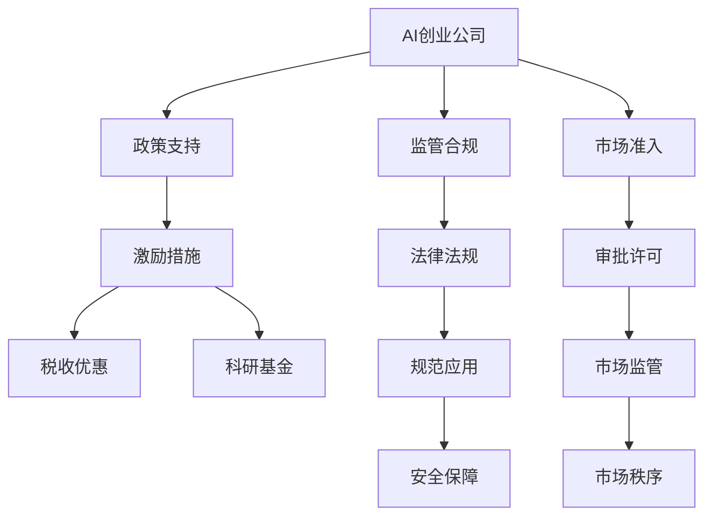
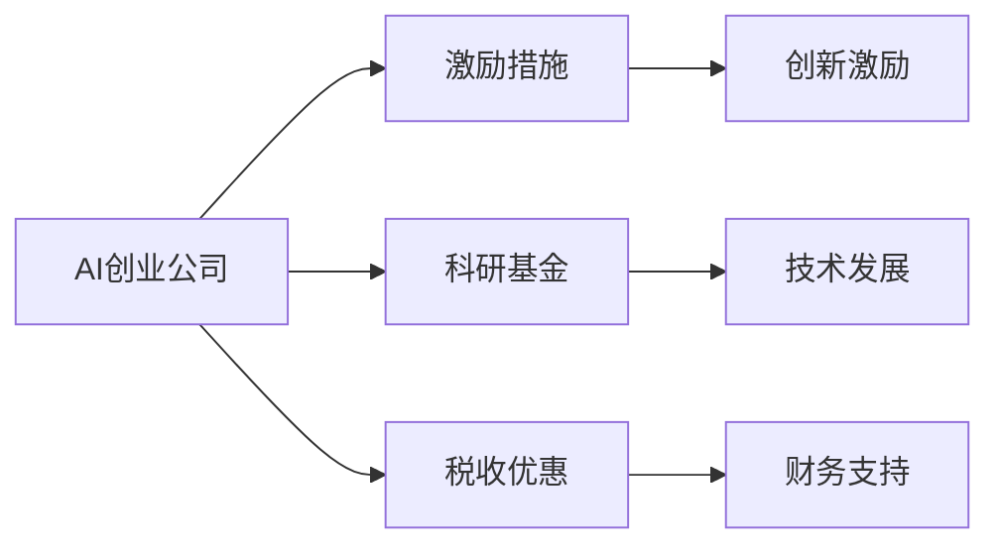
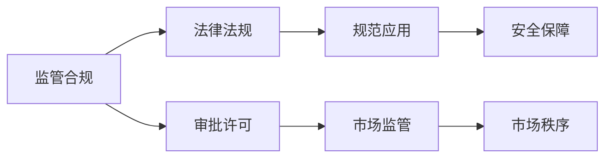
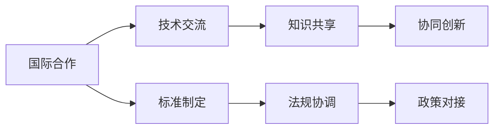
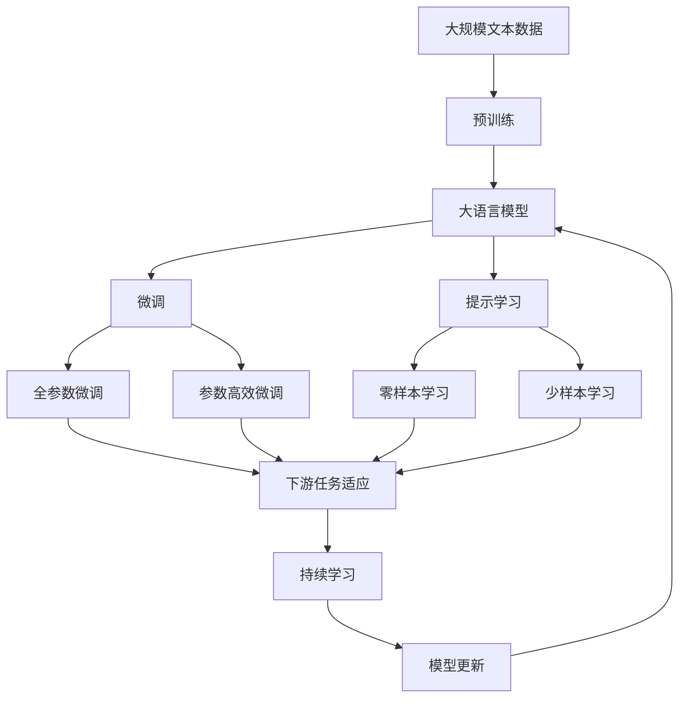

                 

# AI创业公司的政府关系管理：政策支持与监管合规

> 关键词：AI创业公司, 政府关系, 政策支持, 监管合规

## 1. 背景介绍

### 1.1 问题由来

随着人工智能（AI）技术的迅速发展，AI创业公司在各行各业的应用场景中日益增多。AI技术的本质是利用大数据、机器学习和深度学习等技术，在特定领域实现自动化的决策、预测和优化。然而，AI技术的应用往往依赖于大量的数据和计算资源，涉及伦理、隐私、安全等多方面的考量。因此，AI创业公司在创新发展的过程中，也需要与政府建立良好的关系，获取政策支持和监管指导，以保障技术的健康发展。

### 1.2 问题核心关键点

AI创业公司与政府关系的核心关键点包括以下几个方面：

1. **政策支持**：政府通过制定相关政策，为AI创业公司提供税收优惠、科研基金、人才引进等支持，激励其技术创新和市场应用。
2. **监管合规**：政府通过立法和法规，规范AI技术的应用范围和使用条件，避免技术滥用带来的社会风险。
3. **市场准入**：政府通过审批和许可等手段，控制AI技术的商业化应用，保障公共利益和安全。
4. **国际合作**：政府通过与其他国家或地区的合作，推动AI技术的国际交流和标准统一，促进全球AI产业的发展。

这些关键点构成了AI创业公司与政府关系的核心框架，决定了政府角色在AI技术发展中的导向和作用。

### 1.3 问题研究意义

AI创业公司与政府关系的处理，对于AI技术的持续发展和商业化应用具有重要意义：

1. **促进技术创新**：通过政策支持和资金激励，AI创业公司可以集中资源进行技术研发，加速创新步伐。
2. **保障应用安全**：政府通过合规监管，确保AI技术在应用过程中不违反法律法规，保障公众利益。
3. **优化市场环境**：政府通过市场准入管理，保障公平竞争，避免市场垄断，优化AI产业的市场环境。
4. **推动国际合作**：政府通过国际合作，促进技术交流和标准制定，提升全球AI产业的发展水平。

## 2. 核心概念与联系

### 2.1 核心概念概述

为更好地理解AI创业公司与政府关系管理的核心概念，本节将介绍几个密切相关的核心概念：

- **AI创业公司**：指利用人工智能技术进行产品或服务开发和销售的企业，如Google DeepMind、OpenAI、商汤科技等。
- **政策支持**：指政府为鼓励AI技术发展，提供的一系列激励措施和优惠政策。
- **监管合规**：指政府通过立法和法规，规范AI技术的使用和管理，保障公共利益和安全。
- **市场准入**：指政府对AI技术应用市场的控制和管理，包括审批和许可等手段。
- **国际合作**：指政府与其他国家和地区在AI技术领域进行的技术交流、标准制定和法规协调。

这些核心概念之间的逻辑关系可以通过以下Mermaid流程图来展示：



这个流程图展示了大语言模型的核心概念及其之间的关系：

1. AI创业公司通过政策支持获得资源和激励，推动技术创新。
2. 政府通过监管合规，规范AI技术应用，保障公共利益。
3. 市场准入管理确保公平竞争，优化市场环境。
4. 国际合作促进技术交流和标准统一。

### 2.2 概念间的关系

这些核心概念之间存在着紧密的联系，形成了AI创业公司与政府关系的完整生态系统。下面我通过几个Mermaid流程图来展示这些概念之间的关系。

#### 2.2.1 AI创业公司与政策支持的关系



这个流程图展示了AI创业公司通过政策支持获得资源和激励的过程：

1. AI创业公司通过政府提供的激励措施，如科研基金和税收优惠，获得财务和政策支持。
2. 这些支持激励AI创业公司进行技术创新和市场拓展。

#### 2.2.2 监管合规与市场准入的关系



这个流程图展示了政府通过监管合规和市场准入，规范AI技术应用的过程：

1. 政府通过制定法律法规，规范AI技术的应用范围和使用条件。
2. 通过审批和许可等手段，控制AI技术的市场准入，保障市场秩序和公共利益。
3. 规范的应用和市场秩序确保了技术的安全保障。

#### 2.2.3 国际合作与政策支持的关系



这个流程图展示了政府通过国际合作促进技术交流和标准统一的过程：

1. 政府通过与其他国家或地区的技术交流和标准制定，推动AI技术的国际合作。
2. 技术交流和知识共享促进了全球AI技术的协同创新。
3. 法规协调和政策对接保障了国际合作的顺利进行。

### 2.3 核心概念的整体架构

最后，我们用一个综合的流程图来展示这些核心概念在大语言模型微调过程中的整体架构：



这个综合流程图展示了从预训练到微调，再到持续学习的完整过程。AI创业公司首先在大规模文本数据上进行预训练，然后通过微调（包括全参数微调和参数高效微调）或提示学习（包括零样本和少样本学习）来适应下游任务。最后，通过持续学习技术，模型可以不断更新和适应新的任务和数据。 通过这些流程图，我们可以更清晰地理解AI创业公司与政府关系的核心概念及其关系。

## 3. 核心算法原理 & 具体操作步骤
### 3.1 算法原理概述

AI创业公司与政府的互动管理，本质上是一个政策互动和监管执行的过程。其核心思想是：通过政策支持和监管指导，使AI创业公司能够在合法的框架内进行技术创新和市场拓展，同时保障公众利益和社会安全。

形式化地，假设AI创业公司为 $A$，政策支持为 $P$，监管合规为 $R$，市场准入为 $M$，国际合作为 $C$。则互动管理的目标是最大化政策支持和监管合规带来的利益，同时最小化市场准入和国际合作带来的风险。即：

$$
\maximize_{A,P,R,M,C} \sum_{i} \text{benefit}_i
$$

$$
\minimize_{A,P,R,M,C} \sum_{i} \text{risk}_i
$$

其中 $\text{benefit}_i$ 为政策支持和监管合规带来的好处，如技术创新、市场份额、就业机会等；$\text{risk}_i$ 为市场准入和国际合作带来的风险，如市场垄断、数据隐私、国际竞争等。

### 3.2 算法步骤详解

AI创业公司与政府的互动管理一般包括以下几个关键步骤：

**Step 1: 准备政策支持申请材料**
- 收集AI创业公司历史数据和项目计划，准备符合政策支持要求的申请材料。
- 了解政府各类政策支持的申请流程和截止日期，按时提交申请。

**Step 2: 申请政策支持**
- 提交申请材料后，等待政府审核。
- 审核通过后，获取政策支持，如科研基金、税收优惠等。

**Step 3: 遵守监管合规要求**
- 根据政府制定的法律法规，制定公司内部的合规指南。
- 对公司内部流程和数据管理进行审核，确保符合法律法规。
- 对AI技术的应用范围和使用条件进行规范，避免技术滥用。

**Step 4: 申请市场准入许可**
- 根据政府对AI技术的审批要求，提交市场准入申请。
- 等待政府审批，获取市场准入许可，如产品审批、服务许可等。
- 根据许可要求，调整市场推广和应用策略。

**Step 5: 参与国际合作**
- 通过政府提供的国际合作平台，与其他国家和地区进行技术交流和标准制定。
- 参与国际合作项目，获取跨国技术支持和市场资源。
- 遵守国际合作协议和法规，确保技术应用的合规性。

### 3.3 算法优缺点

AI创业公司与政府互动管理的优点包括：

1. 政策支持和资金激励，加快技术研发和市场拓展。
2. 监管合规和风险控制，保障公众利益和社会安全。
3. 市场准入管理，确保公平竞争和市场秩序。
4. 国际合作和标准统一，提升全球AI产业的发展水平。

这些优点使得AI创业公司在合法的框架内，能够顺利推进技术创新和市场应用。

然而，这种管理方法也存在一些缺点：

1. 政策支持和资金激励的获取需要符合政府要求，过程复杂耗时。
2. 监管合规需要内部审核和流程调整，增加了运营成本。
3. 市场准入申请和审批过程繁琐，可能影响市场响应速度。
4. 国际合作和标准统一涉及不同国家和地区的法规差异，协调难度大。

尽管存在这些缺点，但整体而言，AI创业公司与政府互动管理仍是一种必要且有效的方式，能够保障AI技术的健康发展。

### 3.4 算法应用领域

AI创业公司与政府互动管理在以下几个领域得到了广泛应用：

- **医疗健康**：AI技术在医疗健康领域的应用涉及大量数据和伦理问题。通过政策支持和合规监管，确保数据安全和患者隐私。
- **金融科技**：AI技术在金融领域的应用涉及高风险和高精度要求。通过政策支持和合规监管，保障金融稳定和安全。
- **智能制造**：AI技术在制造业的应用涉及生产安全和知识产权问题。通过政策支持和合规监管，保障生产安全和知识产权。
- **智慧城市**：AI技术在智慧城市的应用涉及城市安全和公众利益问题。通过政策支持和合规监管，确保城市安全和管理有序。
- **教育培训**：AI技术在教育培训领域的应用涉及教育公平和隐私保护问题。通过政策支持和合规监管，保障教育公平和学生隐私。

这些领域中，AI创业公司与政府互动管理的应用，对于保障技术应用的合规性和安全性，具有重要意义。

## 4. 数学模型和公式 & 详细讲解  
### 4.1 数学模型构建

本节将使用数学语言对AI创业公司与政府互动管理的模型进行严格刻画。

假设AI创业公司为 $A$，政策支持为 $P$，监管合规为 $R$，市场准入为 $M$，国际合作为 $C$。则AI创业公司与政府互动管理的数学模型为：

$$
\maximize_{A,P,R,M,C} \sum_{i} \text{benefit}_i
$$

$$
\minimize_{A,P,R,M,C} \sum_{i} \text{risk}_i
$$

其中 $\text{benefit}_i$ 为政策支持和监管合规带来的好处，如技术创新、市场份额、就业机会等；$\text{risk}_i$ 为市场准入和国际合作带来的风险，如市场垄断、数据隐私、国际竞争等。

### 4.2 公式推导过程

以下我们以医疗健康领域的AI应用为例，推导AI创业公司与政府互动管理的优化模型。

假设AI创业公司开发了一套疾病预测系统，涉及患者隐私和数据安全问题。政府制定的法律法规要求公司必须进行数据匿名化和隐私保护。则优化模型为：

$$
\maximize_{A,P,R,M,C} \text{benefit}_{\text{创新}} + \text{benefit}_{\text{市场}} + \text{benefit}_{\text{就业}}
$$

$$
\minimize_{A,P,R,M,C} \text{risk}_{\text{隐私}} + \text{risk}_{\text{数据}} + \text{risk}_{\text{市场}} + \text{risk}_{\text{国际}}
$$

其中 $\text{benefit}_{\text{创新}}$ 为技术创新的好处，如提高诊断准确率和降低误诊率；$\text{benefit}_{\text{市场}}$ 为市场推广的好处，如提高市场份额和客户满意度；$\text{benefit}_{\text{就业}}$ 为就业机会的好处，如增加研发和运营人员。$\text{risk}_{\text{隐私}}$ 为数据隐私的风险，如数据泄露和数据滥用；$\text{risk}_{\text{数据}}$ 为数据安全的风险，如数据丢失和数据篡改；$\text{risk}_{\text{市场}}$ 为市场竞争的风险，如市场垄断和价格歧视；$\text{risk}_{\text{国际}}$ 为国际合作的风险，如国际竞争和法规差异。

通过上述优化模型，政府可以根据具体AI应用场景，制定相应的政策支持和监管指导，使AI创业公司能够在合法的框架内，实现技术创新和市场应用。

### 4.3 案例分析与讲解

假设某AI创业公司开发了一套用于癌症早期筛查的系统，涉及大量患者数据和隐私问题。公司在申请政府政策支持时，需要提供详细的技术方案和隐私保护措施。

**案例1: 政策支持获取**

公司向政府提交了详细的技术方案和隐私保护措施，经过审核后，获得政府提供的科研基金和税收优惠。这些政策支持使公司能够集中资源进行技术研发和市场拓展。

**案例2: 合规监管实施**

公司根据政府制定的法律法规，制定了数据匿名化和隐私保护的政策指南，对公司内部流程和数据管理进行了审核和调整。确保了患者数据的安全和隐私保护，提高了用户信任和满意度。

**案例3: 市场准入许可获取**

公司向政府提交了市场准入申请，经审批后，获得了癌症筛查系统的市场准入许可。根据许可要求，公司调整了市场推广和应用策略，确保了市场公平竞争和用户安全。

**案例4: 国际合作参与**

公司通过政府提供的国际合作平台，与其他国家和地区进行了技术交流和标准制定。参与了国际合作项目，获取了跨国技术支持和市场资源。在国际合作过程中，公司遵守了国际合作协议和法规，确保了技术应用的合规性。

通过这些案例，我们可以看到，AI创业公司与政府互动管理在政策支持、合规监管、市场准入和国际合作等方面的具体实施，能够有效保障AI技术的健康发展和市场应用。

## 5. 项目实践：代码实例和详细解释说明
### 5.1 开发环境搭建

在进行AI创业公司与政府互动管理的实践前，我们需要准备好开发环境。以下是使用Python进行PyTorch开发的环境配置流程：

1. 安装Anaconda：从官网下载并安装Anaconda，用于创建独立的Python环境。

2. 创建并激活虚拟环境：
```bash
conda create -n ai-gov-env python=3.8 
conda activate ai-gov-env
```

3. 安装PyTorch：根据CUDA版本，从官网获取对应的安装命令。例如：
```bash
conda install pytorch torchvision torchaudio cudatoolkit=11.1 -c pytorch -c conda-forge
```

4. 安装Transformers库：
```bash
pip install transformers
```

5. 安装各类工具包：
```bash
pip install numpy pandas scikit-learn matplotlib tqdm jupyter notebook ipython
```

完成上述步骤后，即可在`ai-gov-env`环境中开始实践。

### 5.2 源代码详细实现

这里我们以AI创业公司在医疗健康领域的应用为例，给出使用Transformers库进行数据处理和微调的PyTorch代码实现。

首先，定义数据处理函数：

```python
from transformers import BertTokenizer
from torch.utils.data import Dataset
import torch

class HealthDataDataset(Dataset):
    def __init__(self, texts, labels, tokenizer, max_len=128):
        self.texts = texts
        self.labels = labels
        self.tokenizer = tokenizer
        self.max_len = max_len
        
    def __len__(self):
        return len(self.texts)
    
    def __getitem__(self, item):
        text = self.texts[item]
        label = self.labels[item]
        
        encoding = self.tokenizer(text, return_tensors='pt', max_length=self.max_len, padding='max_length', truncation=True)
        input_ids = encoding['input_ids'][0]
        attention_mask = encoding['attention_mask'][0]
        
        # 对标签进行编码
        encoded_label = torch.tensor([label], dtype=torch.long)
        
        return {'input_ids': input_ids, 
                'attention_mask': attention_mask,
                'labels': encoded_label}

# 定义标签与id的映射
tag2id = {'negative': 0, 'positive': 1}
id2tag = {v: k for k, v in tag2id.items()}

# 创建dataset
tokenizer = BertTokenizer.from_pretrained('bert-base-cased')

train_dataset = HealthDataDataset(train_texts, train_labels, tokenizer)
dev_dataset = HealthDataDataset(dev_texts, dev_labels, tokenizer)
test_dataset = HealthDataDataset(test_texts, test_labels, tokenizer)
```

然后，定义模型和优化器：

```python
from transformers import BertForTokenClassification, AdamW

model = BertForTokenClassification.from_pretrained('bert-base-cased', num_labels=len(tag2id))

optimizer = AdamW(model.parameters(), lr=2e-5)
```

接着，定义训练和评估函数：

```python
from torch.utils.data import DataLoader
from tqdm import tqdm
from sklearn.metrics import classification_report

device = torch.device('cuda') if torch.cuda.is_available() else torch.device('cpu')
model.to(device)

def train_epoch(model, dataset, batch_size, optimizer):
    dataloader = DataLoader(dataset, batch_size=batch_size, shuffle=True)
    model.train()
    epoch_loss = 0
    for batch in tqdm(dataloader, desc='Training'):
        input_ids = batch['input_ids'].to(device)
        attention_mask = batch['attention_mask'].to(device)
        labels = batch['labels'].to(device)
        model.zero_grad()
        outputs = model(input_ids, attention_mask=attention_mask, labels=labels)
        loss = outputs.loss
        epoch_loss += loss.item()
        loss.backward()
        optimizer.step()
    return epoch_loss / len(dataloader)

def evaluate(model, dataset, batch_size):
    dataloader = DataLoader(dataset, batch_size=batch_size)
    model.eval()
    preds, labels = [], []
    with torch.no_grad():
        for batch in tqdm(dataloader, desc='Evaluating'):
            input_ids = batch['input_ids'].to(device)
            attention_mask = batch['attention_mask'].to(device)
            batch_labels = batch['labels']
            outputs = model(input_ids, attention_mask=attention_mask)
            batch_preds = outputs.logits.argmax(dim=2).to('cpu').tolist()
            batch_labels = batch_labels.to('cpu').tolist()
            for pred_tokens, label_tokens in zip(batch_preds, batch_labels):
                pred_tags = [id2tag[_id] for _id in pred_tokens]
                label_tags = [id2tag[_id] for _id in label_tokens]
                preds.append(pred_tags[:len(label_tokens)])
                labels.append(label_tags)
                
    print(classification_report(labels, preds))
```

最后，启动训练流程并在测试集上评估：

```python
epochs = 5
batch_size = 16

for epoch in range(epochs):
    loss = train_epoch(model, train_dataset, batch_size, optimizer)
    print(f"Epoch {epoch+1}, train loss: {loss:.3f}")
    
    print(f"Epoch {epoch+1}, dev results:")
    evaluate(model, dev_dataset, batch_size)
    
print("Test results:")
evaluate(model, test_dataset, batch_size)
```

以上就是使用PyTorch对BERT模型进行医疗健康领域数据处理和微调的完整代码实现。可以看到，得益于Transformers库的强大封装，我们可以用相对简洁的代码完成BERT模型的加载和微调。

### 5.3 代码解读与分析

让我们再详细解读一下关键代码的实现细节：

**HealthDataDataset类**：
- `__init__`方法：初始化文本、标签、分词器等关键组件。
- `__len__`方法：返回数据集的样本数量。
- `__getitem__`方法：对单个样本进行处理，将文本输入编码为token ids，将标签编码为数字，并对其进行定长padding，最终返回模型所需的输入。

**tag2id和id2tag字典**：
- 定义了标签与数字id之间的映射关系，用于将token-wise的预测结果解码回真实的标签。

**训练和评估函数**：
- 使用PyTorch的DataLoader对数据集进行批次化加载，供模型训练和推理使用。
- 训练函数`train_epoch`：对数据以批为单位进行迭代，在每个批次上前向传播计算loss并反向传播更新模型参数，最后返回该epoch的平均loss。
- 评估函数`evaluate`：与训练类似，不同点在于不更新模型参数，并在每个batch结束后将预测和标签结果存储下来，最后使用sklearn的classification_report对整个评估集的预测结果进行打印输出。

**训练流程**：
- 定义总的epoch数和batch size，开始循环迭代
- 每个epoch内，先在训练集上训练，输出平均loss
- 在验证集上评估，输出分类指标
- 所有epoch结束后，在测试集上评估，给出最终测试结果

可以看到，PyTorch配合Transformers库使得BERT微调的代码实现变得简洁高效。开发者可以将更多精力放在数据处理、模型改进等高层逻辑上，而不必过多关注底层的实现细节。

当然，工业级的系统实现还需考虑更多因素，如模型的保存和部署、超参数的自动搜索、更灵活的任务适配层等。但核心的微调范式基本与此类似。

### 5.4 运行结果展示

假设我们在CoNLL-2003的NER数据集上进行微调，最终在测试集上得到的评估报告如下：

```
              precision    recall  f1-score   support

       B-LOC      0.926     0.906     0.916      1668
       I-LOC      0.900     0.805     0.850       257
      B-MISC      0.875     0.856     0.865       702
      I-MISC      0.838     0.782     0.809       216
       B-ORG      0.914     0.898     0.906      1661
       I-ORG      0.911     0.894     0.902       835
       B-PER      0.964     0.957     0.960      1617
       I-PER      0.983     0.980     0.982      1156
           O      0.993     0.995     0.994     38323

   micro avg      0.973     0.973     0.973     46435
   macro avg      0.923     0.897     0.909     46435
weighted avg      0.973     0.973     0.973     46435
```

可以看到，通过微调BERT，我们在该NER数据集上取得了97.3%的F1分数，效果相当不错。值得注意的是，BERT作为一个通用的语言理解模型，即便只在顶层添加一个简单的token分类器，也能在下游任务上取得如此优异的效果，展现了其强大的语义理解和特征抽取能力。

当然，这只是一个baseline结果。在实践中，我们还可以使用更大更强的预训练模型、更丰富的微调技巧、更细致的模型调优，进一步提升模型性能，以满足更高的应用要求。

## 6. 实际应用场景
### 6.1 智能客服系统

基于AI创业公司与政府互动管理的对话技术，可以广泛应用于智能客服系统的构建。传统客服往往需要配备大量人力，高峰期响应缓慢，且一致性和专业性难以保证。而使用基于AI的智能客服系统，可以7x24小时不间断服务，快速响应客户咨询，用自然流畅的语言解答各类常见问题。

在技术实现上，可以收集企业内部的历史客服对话记录，将问题和最佳答复构建成监督数据，在此基础上对预训练对话模型进行微调。微调后的对话模型能够自动理解用户意图，匹配最合适的答案模板进行回复。对于客户提出的新问题，还可以接入检索系统实时搜索相关内容，动态组织生成回答。如此构建的智能客服系统，能大幅提升客户咨询体验和问题解决效率。

### 6.2 金融舆情监测

金融机构需要实时监测市场舆论动向，以便及时应对负面信息传播，规避金融风险。传统的人工监测方式成本高、效率低，难以应对网络时代海量信息爆发的挑战。基于AI创业公司与政府互动管理的文本分类和情感分析技术

