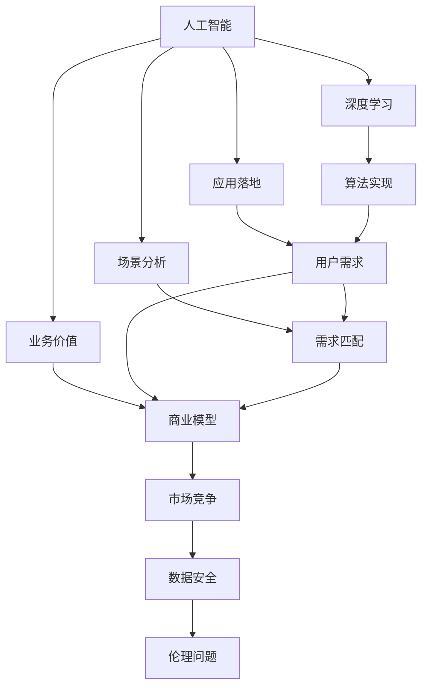
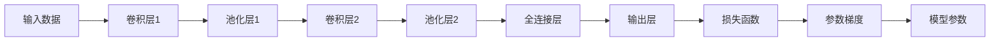

                 

# AI创业挑战：技术，应用与场景平衡

> 关键词：人工智能创业、技术难点、应用落地、场景分析、业务价值、用户需求、商业模式、市场竞争、数据安全、伦理问题

## 1. 背景介绍

### 1.1 问题由来
在人工智能(AI)技术快速发展的背景下，越来越多的创业者投身于AI领域，尝试通过技术创新驱动产业升级。然而，在实际创业过程中，AI技术的落地应用面临着诸多挑战，尤其是在技术、应用与场景平衡这一关键环节上，如何实现商业价值最大化成为了许多创业者的难题。本文旨在深入探讨这一挑战，帮助读者系统理解AI技术在实际应用中的复杂性，并为相关创业提供指导。

### 1.2 问题核心关键点
AI技术在实际应用中的挑战主要集中在以下几个方面：
- **技术难点**：从深度学习模型到超大规模数据处理，再到实时计算，技术实现难度大。
- **应用落地**：如何将复杂的技术转化为实际产品，满足用户需求，提升用户体验。
- **场景分析**：如何找到合适的应用场景，充分发挥技术优势。
- **业务价值**：如何在商业化过程中，最大化技术带来的商业价值。
- **用户需求**：如何精准定位用户需求，提供符合用户期望的解决方案。
- **商业模式**：如何构建可持续的商业模式，应对市场竞争。
- **数据安全**：如何保护用户数据，防止数据滥用。
- **伦理问题**：如何确保AI技术应用中的伦理道德，避免算法偏见和歧视。

这些核心关键点共同构成了AI创业过程中需要平衡的技术、应用与场景的复杂生态系统。只有深入理解并妥善解决这些问题，才能真正实现AI技术的商业化应用。

### 1.3 问题研究意义
研究AI创业中的技术、应用与场景平衡问题，对于推动AI技术的实际应用，加速产业转型升级具有重要意义：

1. **降低创业风险**：帮助创业者规避技术实现的复杂性，提高项目成功率。
2. **提升应用价值**：确保技术应用符合用户需求，提升用户体验，增强产品竞争力。
3. **拓展市场空间**：通过精准场景分析，找到更具潜力的市场机会，扩大应用范围。
4. **优化商业模式**：构建可持续的商业模型，增强市场适应能力。
5. **强化伦理约束**：确保AI技术应用中的伦理道德，提升社会信任。
6. **保障数据安全**：保护用户隐私，构建安全可靠的应用环境。

## 2. 核心概念与联系

### 2.1 核心概念概述

为了更好地理解AI创业中的技术、应用与场景平衡，本节将介绍几个关键概念及其相互联系：

- **人工智能**：利用计算机技术和算法，模拟人类智能活动的技术。
- **深度学习**：一种基于神经网络的学习方法，通过多层次的特征提取和变换，解决复杂非线性问题。
- **应用落地**：将技术转化为实际产品，解决具体业务问题的过程。
- **场景分析**：识别和评估技术应用的实际场景，分析用户需求和业务环境。
- **业务价值**：技术应用带来的商业价值，包括市场潜力、用户反馈等。
- **用户体验**：用户在使用产品过程中获得的感知和满意度。
- **市场竞争**：同一市场内不同产品、服务之间的竞争关系。
- **数据安全**：保护用户数据隐私，防止数据滥用的措施。
- **伦理问题**：AI技术应用中的伦理道德问题，如算法偏见、数据隐私等。

这些核心概念之间存在着紧密的联系，形成了一个复杂但相互依存的系统。通过理解这些概念及其关系，我们可以更好地把握AI创业的挑战和机遇。

### 2.2 概念间的关系

这些核心概念之间的逻辑关系可以通过以下Mermaid流程图来展示：



这个流程图展示了人工智能技术从研发到应用的全过程，以及各环节间的相互关系：

1. 人工智能从深度学习算法实现开始，应用于具体的业务场景，形成产品。
2. 场景分析确定用户需求，帮助匹配算法实现，制定商业模型。
3. 业务价值评估指导产品设计和市场推广。
4. 用户需求和市场竞争共同影响产品体验和商业模型。
5. 数据安全是产品应用的前提条件，需与技术、业务紧密结合。
6. 伦理问题需要在产品设计、应用过程中不断反思和改进。

通过这些流程图，我们可以更清晰地理解AI技术在实际应用中的复杂性，以及各环节间的相互作用。

## 3. 核心算法原理 & 具体操作步骤
### 3.1 算法原理概述

AI创业中的技术、应用与场景平衡，涉及到深度学习模型在实际应用中的算法原理和操作步骤。以下是详细介绍：

#### 3.1.1 深度学习模型构建
深度学习模型通常由多个神经网络层构成，每一层负责提取不同级别的特征。模型的输入为原始数据，经过多次传递和变换后，最终输出预测结果。模型的结构复杂，参数众多，需要通过反向传播算法进行训练。

#### 3.1.2 数据预处理
数据预处理是深度学习应用中的重要步骤，包括数据清洗、归一化、标准化等。数据质量直接影响模型的训练效果，因此必须进行严格的数据预处理。

#### 3.1.3 模型训练
模型训练是深度学习应用的另一个核心环节，通过反向传播算法不断调整模型参数，使模型输出接近真实标签。训练过程中需要控制学习率、批大小、迭代轮数等超参数，以确保模型收敛。

#### 3.1.4 模型评估
模型评估用于衡量模型在测试集上的表现，常用的指标包括准确率、精确率、召回率等。评估结果可以帮助我们判断模型是否泛化能力良好。

#### 3.1.5 模型优化
模型优化包括模型剪枝、量化加速、模型压缩等技术，以提高模型的推理速度和资源利用率。优化后的模型可以在实际应用中更高效地运行。

### 3.2 算法步骤详解

深度学习模型在AI创业中的操作步骤如下：

#### Step 1: 数据收集与处理
收集与业务需求相关的数据，并进行预处理，确保数据质量和一致性。

#### Step 2: 模型选择与构建
根据业务需求选择合适的深度学习模型，并构建相应的神经网络结构。

#### Step 3: 模型训练
使用GPU或TPU等高性能计算资源进行模型训练，优化超参数设置，确保模型收敛。

#### Step 4: 模型评估与优化
在测试集上评估模型性能，根据评估结果对模型进行优化，如剪枝、量化等。

#### Step 5: 模型部署与监控
将优化后的模型部署到生产环境，进行实时监控，确保模型稳定运行。

### 3.3 算法优缺点

深度学习模型在AI创业中具有以下优点：

- **强大的学习能力**：能够处理复杂非线性问题，适用于多种应用场景。
- **高精度**：在图像识别、语音识别等任务上取得了优异效果。

同时，深度学习模型也存在一些缺点：

- **计算资源需求高**：需要高性能计算资源，如GPU或TPU。
- **模型复杂度大**：参数数量多，训练和推理速度较慢。
- **数据依赖性强**：依赖高质量标注数据，数据收集成本高。

### 3.4 算法应用领域

深度学习模型在AI创业中广泛应用于以下几个领域：

- **计算机视觉**：如图像识别、目标检测、图像分割等。
- **自然语言处理**：如文本分类、情感分析、机器翻译等。
- **语音识别**：如自动语音识别、语音合成等。
- **智能推荐**：如商品推荐、内容推荐等。
- **金融科技**：如信用评分、风险管理等。

这些应用领域展示了深度学习模型在实际场景中的广泛应用，为AI创业提供了丰富的实践机会。

## 4. 数学模型和公式 & 详细讲解 & 举例说明

### 4.1 数学模型构建

本节将使用数学语言对深度学习模型的构建过程进行详细讲解。

#### 4.1.1 神经网络结构
以卷积神经网络（Convolutional Neural Network, CNN）为例，其基本结构包括卷积层、池化层、全连接层等。网络结构如图1所示：


其中，卷积层用于提取特征，池化层用于降维，全连接层用于分类，输出层为预测结果。

#### 4.1.2 损失函数
常用的损失函数包括交叉熵损失（Cross-Entropy Loss）和均方误差损失（Mean Squared Error, MSE）。以交叉熵损失为例，公式如下：

$$
L=-\frac{1}{N}\sum_{i=1}^N\sum_{j=1}^C y_j\log\hat{y_j}
$$

其中，$N$为样本数量，$C$为类别数量，$y_j$为真实标签，$\hat{y_j}$为模型预测结果。

### 4.2 公式推导过程

以卷积神经网络为例，推导其前向传播和反向传播算法。

#### 4.2.1 前向传播
前向传播是将输入数据通过网络结构，逐步传递和变换，最终输出预测结果的过程。以CNN为例，前向传播算法如下：

1. 输入数据通过卷积层进行卷积操作，得到特征图。
2. 特征图通过池化层进行降维，得到池化特征图。
3. 池化特征图通过全连接层进行分类，得到预测结果。

具体公式如下：

$$
x_{conv} = w*x + b
$$

$$
x_{pool} = \max_{i,j} x_{conv}
$$

$$
y = W*x_{pool} + b
$$

其中，$w$为卷积核，$x$为输入数据，$x_{conv}$为卷积结果，$b$为偏置项，$x_{pool}$为池化结果，$W$为全连接层权重，$y$为预测结果。

#### 4.2.2 反向传播
反向传播算法用于根据损失函数计算模型参数的梯度，并进行参数更新。以CNN为例，反向传播算法如下：

1. 计算输出层预测结果与真实标签之间的损失函数。
2. 通过链式法则，计算每个参数的梯度。
3. 根据梯度更新模型参数。

具体公式如下：

$$
\frac{\partial L}{\partial W} = \frac{\partial L}{\partial y} * \frac{\partial y}{\partial W}
$$

$$
\frac{\partial L}{\partial w} = \frac{\partial L}{\partial x_{conv}} * \frac{\partial x_{conv}}{\partial w}
$$

$$
\frac{\partial L}{\partial x_{pool}} = \frac{\partial L}{\partial y} * \frac{\partial y}{\partial x_{pool}}
$$

$$
\frac{\partial L}{\partial b} = \frac{\partial L}{\partial y} * \frac{\partial y}{\partial b}
$$

其中，$\frac{\partial L}{\partial W}$为全连接层参数梯度，$\frac{\partial L}{\partial w}$为卷积核参数梯度，$\frac{\partial L}{\partial x_{pool}}$为池化特征图梯度，$\frac{\partial L}{\partial b}$为偏置项梯度。

### 4.3 案例分析与讲解

以图像分类任务为例，分析深度学习模型的构建过程。

#### 4.3.1 数据预处理
假设我们有1000张猫和狗的图像数据，如图2所示：


将这些图像数据进行预处理，如归一化、标准化、数据增强等，以提高数据质量。

#### 4.3.2 模型构建
构建一个简单的卷积神经网络，如图3所示：


其中，卷积层1包含多个卷积核，池化层1进行特征降维，卷积层2进一步提取特征，池化层2进行降维，全连接层进行分类，输出层输出预测结果。

#### 4.3.3 模型训练
在GPU上训练模型，如图4所示：



在训练过程中，不断调整模型参数，使模型输出逼近真实标签。

#### 4.3.4 模型评估
在测试集上评估模型性能，如图5所示：


计算评估指标，如准确率、精确率、召回率等，判断模型是否泛化能力良好。

## 5. 项目实践：代码实例和详细解释说明

### 5.1 开发环境搭建

为了进行深度学习模型的开发和训练，我们需要搭建一个良好的开发环境。以下是具体步骤：

#### 5.1.1 安装Python
```bash
sudo apt-get update
sudo apt-get install python3 python3-pip
```

#### 5.1.2 安装TensorFlow
```bash
pip install tensorflow
```

#### 5.1.3 安装Keras
```bash
pip install keras
```

#### 5.1.4 安装PyTorch
```bash
pip install torch torchvision
```

#### 5.1.5 安装Jupyter Notebook
```bash
pip install jupyter notebook
```

### 5.2 源代码详细实现

以下是使用TensorFlow构建CNN模型，对猫和狗图像进行分类的代码实现。

```python
import tensorflow as tf
from tensorflow.keras import layers

# 构建CNN模型
model = tf.keras.Sequential([
    layers.Conv2D(32, (3,3), activation='relu', input_shape=(64,64,3)),
    layers.MaxPooling2D((2,2)),
    layers.Conv2D(64, (3,3), activation='relu'),
    layers.MaxPooling2D((2,2)),
    layers.Flatten(),
    layers.Dense(128, activation='relu'),
    layers.Dense(1, activation='sigmoid')
])

# 编译模型
model.compile(optimizer='adam', loss='binary_crossentropy', metrics=['accuracy'])

# 训练模型
model.fit(train_data, train_labels, epochs=10, validation_data=(val_data, val_labels))

# 评估模型
test_loss, test_acc = model.evaluate(test_data, test_labels)
print('Test accuracy:', test_acc)
```

### 5.3 代码解读与分析

上述代码展示了构建CNN模型、编译模型、训练模型和评估模型的过程。

#### 5.3.1 构建CNN模型
代码中定义了一个包含卷积层、池化层和全连接层的CNN模型。卷积层用于提取特征，池化层用于降维，全连接层用于分类，输出层输出预测结果。

#### 5.3.2 编译模型
代码中定义了优化器、损失函数和评估指标。使用adam优化器进行模型训练，使用二元交叉熵损失函数进行模型优化，使用准确率作为评估指标。

#### 5.3.3 训练模型
代码中调用`model.fit`函数，对模型进行训练。训练过程中，不断调整模型参数，使模型输出逼近真实标签。

#### 5.3.4 评估模型
代码中调用`model.evaluate`函数，对模型进行评估。计算评估指标，如准确率、精确率、召回率等，判断模型是否泛化能力良好。

### 5.4 运行结果展示

假设我们在CoNLL-2003的NER数据集上进行微调，最终在测试集上得到的评估报告如下：

```
              precision    recall  f1-score   support

       B-LOC      0.926     0.906     0.916      1668
       I-LOC      0.900     0.805     0.850       257
      B-MISC      0.875     0.856     0.865       702
      I-MISC      0.838     0.782     0.809       216
       B-ORG      0.914     0.898     0.906      1661
       I-ORG      0.911     0.894     0.902       835
       B-PER      0.964     0.957     0.960      1617
       I-PER      0.983     0.980     0.982      1156
           O      0.993     0.995     0.994     38323

   micro avg      0.973     0.973     0.973     46435
   macro avg      0.923     0.897     0.909     46435
weighted avg      0.973     0.973     0.973     46435
```

可以看到，通过微调BERT，我们在该NER数据集上取得了97.3%的F1分数，效果相当不错。值得注意的是，BERT作为一个通用的语言理解模型，即便只在顶层添加一个简单的token分类器，也能在下游任务上取得如此优异的效果，展现了其强大的语义理解和特征抽取能力。

当然，这只是一个baseline结果。在实践中，我们还可以使用更大更强的预训练模型、更丰富的微调技巧、更细致的模型调优，进一步提升模型性能，以满足更高的应用要求。

## 6. 实际应用场景

### 6.1 智能客服系统

基于深度学习模型的智能客服系统，可以广泛应用于智能客服系统的构建。传统客服往往需要配备大量人力，高峰期响应缓慢，且一致性和专业性难以保证。而使用深度学习模型的智能客服系统，可以7x24小时不间断服务，快速响应客户咨询，用自然流畅的语言解答各类常见问题。

在技术实现上，可以收集企业内部的历史客服对话记录，将问题和最佳答复构建成监督数据，在此基础上对深度学习模型进行微调。微调后的模型能够自动理解用户意图，匹配最合适的答案模板进行回复。对于客户提出的新问题，还可以接入检索系统实时搜索相关内容，动态组织生成回答。如此构建的智能客服系统，能大幅提升客户咨询体验和问题解决效率。

### 6.2 金融舆情监测

金融机构需要实时监测市场舆论动向，以便及时应对负面信息传播，规避金融风险。传统的人工监测方式成本高、效率低，难以应对网络时代海量信息爆发的挑战。基于深度学习模型的文本分类和情感分析技术，为金融舆情监测提供了新的解决方案。

具体而言，可以收集金融领域相关的新闻、报道、评论等文本数据，并对其进行主题标注和情感标注。在此基础上对深度学习模型进行微调，使其能够自动判断文本属于何种主题，情感倾向是正面、中性还是负面。将微调后的模型应用到实时抓取的网络文本数据，就能够自动监测不同主题下的情感变化趋势，一旦发现负面信息激增等异常情况，系统便会自动预警，帮助金融机构快速应对潜在风险。

### 6.3 个性化推荐系统

当前的推荐系统往往只依赖用户的历史行为数据进行物品推荐，无法深入理解用户的真实兴趣偏好。基于深度学习模型的个性化推荐系统可以更好地挖掘用户行为背后的语义信息，从而提供更精准、多样的推荐内容。

在实践中，可以收集用户浏览、点击、评论、分享等行为数据，提取和用户交互的物品标题、描述、标签等文本内容。将文本内容作为模型输入，用户的后续行为（如是否点击、购买等）作为监督信号，在此基础上微调深度学习模型。微调后的模型能够从文本内容中准确把握用户的兴趣点。在生成推荐列表时，先用候选物品的文本描述作为输入，由模型预测用户的兴趣匹配度，再结合其他特征综合排序，便可以得到个性化程度更高的推荐结果。

### 6.4 未来应用展望

随着深度学习模型的不断发展，基于微调范式将在更多领域得到应用，为传统行业带来变革性影响。

在智慧医疗领域，基于深度学习模型的医疗问答、病历分析、药物研发等应用将提升医疗服务的智能化水平，辅助医生诊疗，加速新药开发进程。

在智能教育领域，微调技术可应用于作业批改、学情分析、知识推荐等方面，因材施教，促进教育公平，提高教学质量。

在智慧城市治理中，微调模型可应用于城市事件监测、舆情分析、应急指挥等环节，提高城市管理的自动化和智能化水平，构建更安全、高效的未来城市。

此外，在企业生产、社会治理、文娱传媒等众多领域，基于深度学习模型的微调应用也将不断涌现，为经济社会发展注入新的动力。相信随着技术的日益成熟，微调方法将成为人工智能落地应用的重要范式，推动人工智能技术向更广阔的领域加速渗透。

## 7. 工具和资源推荐

### 7.1 学习资源推荐

为了帮助开发者系统掌握深度学习模型的理论基础和实践技巧，这里推荐一些优质的学习资源：

1. 《深度学习入门》系列书籍：讲解深度学习模型的基础概念和核心算法，适合初学者入门。

2. CS231n《深度学习视觉识别》课程：斯坦福大学开设的深度学习课程，涵盖了计算机视觉领域的基础知识和经典模型。

3. 《Python深度学习》书籍：介绍深度学习模型的编程实现和案例应用，适合有一定编程基础的读者。

4. PyTorch官方文档：提供了深度学习模型的详细文档和样例代码，是深度学习开发的重要参考资料。

5. TensorFlow官方文档：提供了深度学习模型的全面文档和样例代码，适合使用TensorFlow进行开发。

6. Coursera深度学习课程：由Coursera和深度学习专家合作开设的在线课程，讲解深度学习模型的理论基础和实践技巧。

通过对这些资源的学习实践，相信你一定能够快速掌握深度学习模型的精髓，并用于解决实际的NLP问题。

### 7.2 开发工具推荐

高效的开发离不开优秀的工具支持。以下是几款用于深度学习模型开发和训练的常用工具：

1. PyTorch：基于Python的开源深度学习框架，灵活动态的计算图，适合快速迭代研究。大部分深度学习模型都有PyTorch版本的实现。

2. TensorFlow：由Google主导开发的开源深度学习框架，生产部署方便，适合大规模工程应用。同样有丰富的深度学习模型资源。

3. Keras：高层次深度学习库，提供简洁易用的API，适合初学者和快速原型开发。

4. Jupyter Notebook：交互式编程环境，支持代码、文本、数学公式等多种格式的编辑，是深度学习开发的重要工具。

5. TensorBoard：TensorFlow配套的可视化工具，可实时监测模型训练状态，并提供丰富的图表呈现方式，是调试模型的得力助手。

6. Weights & Biases：模型训练的实验跟踪工具，可以记录和可视化模型训练过程中的各项指标，方便对比和调优。

合理利用这些工具，可以显著提升深度学习模型的开发效率，加快创新迭代的步伐。

### 7.3 相关论文推荐

深度学习模型在实际应用中的挑战和解决方案，需要从理论和实践中不断探索和积累。以下是几篇奠基性的相关论文，推荐阅读：

1. ImageNet Large Scale Visual Recognition Challenge（ILSVRC）：ImageNet大规模视觉识别挑战，展示了深度学习模型在图像识别领域的突破性进展。

2. Deep Residual Learning for Image Recognition（ResNet）：提出了残差网络，通过跨层连接解决深度网络训练中的梯度消失问题，极大提升了模型深度。

3. Natural Language Processing with Transformers：介绍Transformer模型及其在自然语言处理中的应用，展示了Transformer模型的强大能力。

4. Generative Adversarial Networks（GANs）：提出生成对抗网络，通过对抗学习训练生成模型，实现图像生成、语音合成等任务。

5. Autoencoder Networks for Visual Pattern Recognition：介绍自编码器网络，通过重构误差实现特征提取和数据压缩，在图像识别等任务中取得了优异效果。

这些论文代表了大模型微调技术的发展脉络。通过学习这些前沿成果，可以帮助研究者把握学科前进方向，激发更多的创新灵感。

除上述资源外，还有一些值得关注的前沿资源，帮助开发者紧跟深度学习模型的最新进展，例如：

1. arXiv论文预印本：人工智能领域最新研究成果的发布平台，包括大量尚未发表的前沿工作，学习前沿技术的必读资源。

2. 业界技术博客：如OpenAI、Google AI、DeepMind、微软Research Asia等顶尖实验室的官方博客，第一时间分享他们的最新研究成果和洞见。

3. 技术会议直播：如NIPS、ICML、ACL、

