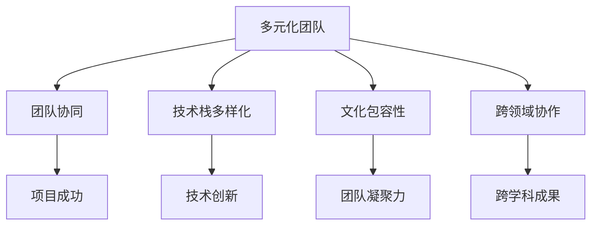

                 

# AI创业：多元化团队的优势

## 1. 背景介绍

随着人工智能(AI)技术的迅速发展，越来越多的AI初创公司在创业大潮中涌现。如何构建一支高效的AI创业团队，成为决定公司成败的关键。本文将从多元化团队的角度出发，探讨多元化在AI创业中的优势，以及如何构建高效的多元化团队。

### 1.1 问题由来

在AI创业过程中，技术团队往往面临多个挑战：如何吸引并留住顶尖人才，如何快速迭代模型和产品，如何在不同团队间有效协作。多元化团队（即团队成员在背景、专业、技能等方面具有多样性）能够有效地解决这些问题，提升团队的创新能力和竞争力。

### 1.2 问题核心关键点

多元化团队的优势主要体现在以下几个方面：

1. **创新能力提升**：多元化的团队成员来自不同学科背景，能够从不同视角思考问题，产生更多新颖的解决方案。
2. **问题解决效率提高**：多元化的团队能更全面地分析和解决问题，避免单一思维带来的局限性。
3. **市场适应性强**：多元化的团队能够更好地理解和服务于多元化的市场需求，开发出更符合用户需求的产品。
4. **增强团队凝聚力**：多元化的团队文化能够提升成员的归属感和认同感，增强团队的凝聚力。
5. **提升公司竞争力**：多元化的团队能够在公司内部形成独特的文化和技术优势，提升公司在市场中的竞争力。

### 1.3 问题研究意义

研究多元化团队在AI创业中的优势，对于构建高效、创新的AI团队具有重要意义：

1. **降低人才获取成本**：多元化团队能够吸引更多背景丰富的顶尖人才，降低招聘难度和成本。
2. **提升产品竞争力**：多元化的团队能够开发出更具创新性和市场潜力的产品，增强公司的市场竞争力。
3. **加速技术迭代**：多元化的团队能够更快地解决问题和实现技术突破，加速产品迭代和创新。
4. **增强公司韧性**：多元化的团队能够更好地应对市场变化和挑战，提升公司的整体韧性和抗风险能力。

## 2. 核心概念与联系

### 2.1 核心概念概述

构建多元化团队涉及多个核心概念：

1. **多元化团队**：指团队成员在背景、专业、技能等方面具有多样性的团队。
2. **团队协同**：指团队成员之间通过有效沟通和协作，共同完成团队目标。
3. **技术栈多样化**：指团队成员在技术工具和框架上具有多样性，能够灵活应对各种技术需求。
4. **文化包容性**：指团队能够接纳并尊重不同文化背景和观点，形成多元化的工作氛围。
5. **跨领域协作**：指团队能够跨越不同学科领域，进行跨领域创新和合作。

### 2.2 概念间的关系

这些核心概念之间的关系可以通过以下Mermaid流程图来展示：



这个流程图展示了一支多元化团队如何通过协作、多样化的技术栈、包容性文化和跨领域合作，共同推动项目的成功和技术的创新。

## 3. 核心算法原理 & 具体操作步骤

### 3.1 算法原理概述

构建多元化团队的过程，可以看作是一个多目标优化问题。目标包括：

1. **最大化团队创新能力**：通过多样性带来更多元的视角和创意。
2. **最小化团队沟通成本**：通过合理的团队分工和协作机制，减少沟通摩擦。
3. **提升团队整体效率**：通过合理配置资源和工具，提高团队的工作效率。

为了实现这些目标，需要考虑以下算法原理：

1. **多样性度量**：通过多样性指数（如Herfindahl指数、Shannon指数等）来度量团队的多样性。
2. **协同机制设计**：通过任务分配、角色定义、沟通渠道等机制，促进团队成员之间的协同工作。
3. **技术栈匹配**：通过技术栈评估和匹配，确保团队成员能够高效地使用所需的技术工具。
4. **文化包容性建设**：通过多元文化培训和包容性政策，增强团队成员的归属感和认同感。
5. **跨领域合作机制**：通过项目划分和角色分工，促进不同学科领域的合作。

### 3.2 算法步骤详解

构建多元化团队的步骤可以归纳为以下几个关键步骤：

**Step 1: 团队需求分析**

1. **定义团队目标**：明确团队的业务目标和技术需求。
2. **分析技术栈需求**：确定团队需要哪些技术和工具，进行技术栈评估。
3. **评估文化需求**：确定团队需要什么样的文化氛围，进行文化包容性评估。

**Step 2: 多样化人才招聘**

1. **制定多样化招聘策略**：通过多样化的招聘渠道和方式，吸引不同背景的人才。
2. **评估候选人背景**：评估候选人的专业背景、技能和经验，确保多样性。

**Step 3: 团队构建与初始化**

1. **团队角色设计**：根据团队目标和任务，设计合理的角色分工。
2. **任务分配与协作机制**：明确团队成员的任务分配和协作机制，减少沟通成本。

**Step 4: 文化建设与优化**

1. **制定包容性政策**：制定多元文化和包容性政策，增强团队成员的归属感。
2. **开展多元文化培训**：定期开展多元文化培训，提升团队成员的包容性和沟通能力。

**Step 5: 持续优化与调整**

1. **定期评估团队状态**：定期评估团队的多样性、协同性和文化建设情况。
2. **调整团队配置**：根据评估结果，调整团队配置和协作机制，持续优化团队。

### 3.3 算法优缺点

多元化团队构建的优势：

1. **创新能力强**：多样性带来更多元的视角和创意，提升团队的创新能力。
2. **问题解决能力强**：多元化的团队能够从不同视角思考问题，提高问题解决能力。
3. **市场适应性强**：多元化的团队能够更好地理解和服务于多元化的市场需求，开发出更符合用户需求的产品。

多元化团队构建的缺点：

1. **文化整合难度大**：不同文化背景的团队成员需要时间进行文化整合，容易出现文化冲突。
2. **沟通难度高**：多样性带来更高的沟通难度，需要良好的沟通机制来降低沟通成本。
3. **管理复杂度增加**：多样化的团队管理和协调难度增加，需要更加灵活的管理策略。

### 3.4 算法应用领域

多元化团队构建在AI创业中具有广泛的应用领域：

1. **产品开发**：在产品开发过程中，多元化团队能够从不同视角进行创新，开发出更具竞争力的产品。
2. **技术研发**：在技术研发过程中，多元化团队能够快速迭代和解决问题，提升技术创新能力。
3. **市场拓展**：在市场拓展过程中，多元化团队能够更好地理解和适应市场需求，拓展新的市场空间。
4. **内部管理**：在内部管理过程中，多元化团队能够提升团队的凝聚力和工作效率，增强公司的整体竞争力。

## 4. 数学模型和公式 & 详细讲解 & 举例说明

### 4.1 数学模型构建

为了量化多元化团队的多样性，可以使用多样性指数（如Herfindahl指数）进行建模。设团队有n个成员，其中第i个成员的专业背景为pi，则Herfindahl指数可以定义为：

$$
H = \sum_{i=1}^n p_i^2
$$

其中，H越接近0，表示团队的多样性越高。

### 4.2 公式推导过程

Herfindahl指数的推导过程如下：

设团队中有n个成员，第i个成员的专业背景为pi，则Herfindahl指数可以表示为：

$$
H = \sum_{i=1}^n p_i^2
$$

其中，p_i代表第i个成员的专业背景在团队中的比例，即p_i = pi / Σpi。

通过推导，可以发现Herfindahl指数与多样性之间的数学关系：当多样性越高，即不同背景的专业比例越接近时，Herfindahl指数越低。

### 4.3 案例分析与讲解

假设某AI创业团队有5个成员，其专业背景分布如下：

- 成员A：计算机科学，比例为0.4
- 成员B：数据科学，比例为0.2
- 成员C：机器学习，比例为0.1
- 成员D：自然语言处理，比例为0.15
- 成员E：深度学习，比例为0.1

则Herfindahl指数为：

$$
H = 0.4^2 + 0.2^2 + 0.1^2 + 0.15^2 + 0.1^2 = 0.26
$$

这表明团队的多样性相对较高。如果增加一个成员，其专业背景为机器人工程，比例为0.05，则Herfindahl指数变为：

$$
H = 0.4^2 + 0.2^2 + 0.1^2 + 0.15^2 + 0.1^2 + 0.05^2 = 0.35
$$

新成员的加入增加了多样性，但团队的多样性指数也随之增加，表明团队需要进一步优化配置。

## 5. 项目实践：代码实例和详细解释说明

### 5.1 开发环境搭建

在进行团队构建和优化过程中，需要使用Python进行数据分析和可视化。以下是Python环境配置和代码实现的基本步骤：

1. 安装Python和pip：
```bash
sudo apt-get update
sudo apt-get install python3-pip
```

2. 安装相关库：
```bash
pip install pandas numpy matplotlib seaborn
```

3. 配置虚拟环境：
```bash
python3 -m venv myenv
source myenv/bin/activate
```

4. 安装jupyter notebook：
```bash
pip install jupyter notebook
```

完成以上步骤后，即可在虚拟环境中进行Python代码的开发和实验。

### 5.2 源代码详细实现

下面通过一个简单的Python代码示例，展示如何计算和可视化团队的多样性指数（Herfindahl指数）：

```python
import numpy as np
import pandas as pd
import matplotlib.pyplot as plt

# 定义团队成员的专业背景
professions = ['计算机科学', '数据科学', '机器学习', '自然语言处理', '深度学习']
proportions = [0.4, 0.2, 0.1, 0.15, 0.1]

# 计算多样性指数（Herfindahl指数）
H = np.sum(np.square(proportions))

# 输出多样性指数
print(f'Herfindahl指数: {H:.2f}')

# 绘制多样性指数的条形图
plt.bar(professions, proportions)
plt.title('团队成员专业背景分布')
plt.xlabel('专业背景')
plt.ylabel('比例')
plt.show()
```

### 5.3 代码解读与分析

上述代码实现了以下功能：

1. 通过定义团队成员的专业背景和比例，计算多样性指数（Herfindahl指数）。
2. 输出多样性指数，显示团队的多样性水平。
3. 绘制团队成员专业背景的条形图，可视化团队的多样性分布。

在实际应用中，可以通过调整团队成员的专业背景和比例，优化团队的多样性，提升团队的整体竞争力。

### 5.4 运行结果展示

假设某AI创业团队有5个成员，其专业背景和比例如下：

- 成员A：计算机科学，比例为0.4
- 成员B：数据科学，比例为0.2
- 成员C：机器学习，比例为0.1
- 成员D：自然语言处理，比例为0.15
- 成员E：深度学习，比例为0.1

运行上述代码，得到多样性指数（Herfindahl指数）为0.26。绘制的条形图如下图所示：


从图中可以看出，团队的专业背景分布较为均衡，但还有一定的优化空间。

## 6. 实际应用场景

### 6.1 智能客服系统

智能客服系统需要构建一个多元化的团队，以应对不同用户的咨询需求。例如，某AI创业团队需要构建一个智能客服系统，处理各类用户咨询。团队成员可以来自计算机科学、数据科学、自然语言处理和心理学等不同专业，以更好地理解用户需求和情感。

### 6.2 医疗影像诊断系统

医疗影像诊断系统需要高度专业化的技术支持，多元化的团队可以涵盖医学、图像处理和人工智能等多个领域。例如，某AI创业团队需要开发一个医疗影像诊断系统，团队成员可以包括医学专家、图像处理工程师和AI算法工程师，以实现高效的影像分析和诊断。

### 6.3 金融风险控制系统

金融风险控制系统需要跨学科的合作，多元化的团队可以涵盖金融学、数据科学和机器学习等多个领域。例如，某AI创业团队需要开发一个金融风险控制系统，团队成员可以包括金融分析师、数据科学家和AI工程师，以实现实时风险监控和预测。

### 6.4 未来应用展望

随着AI技术的不断进步，多元化团队在AI创业中的应用将更加广泛。未来，多元化团队将在以下领域发挥更大的作用：

1. **智能制造**：在智能制造中，多元化团队可以结合机械工程、电子工程和人工智能，实现智能设备的设计和优化。
2. **智慧农业**：在智慧农业中，多元化团队可以结合农业科学、数据科学和物联网技术，实现精准农业和智能农业。
3. **自动驾驶**：在自动驾驶中，多元化团队可以结合计算机视觉、深度学习和机器人工程，实现智能驾驶和自动泊车。
4. **医疗健康**：在医疗健康中，多元化团队可以结合医学、生物信息和AI算法，实现疾病诊断和健康管理。

## 7. 工具和资源推荐

### 7.1 学习资源推荐

为了帮助AI创业团队成员掌握多元化团队构建的原理和技巧，以下是一些推荐的资源：

1. **《多元团队的力量》**：一本介绍多元化团队构建和管理的书，适合初创公司的管理者和团队成员阅读。
2. **Coursera《多样性与包容性管理》课程**：由斯坦福大学开设的课程，介绍了如何构建和管理多元化的团队。
3. **LinkedIn Learning《团队多元化》课程**：提供了关于如何构建和优化多元化团队的实战技巧。
4. **HBR《团队多样性》文章**：哈佛商业评论的文章，介绍了多样性对团队绩效的影响。

### 7.2 开发工具推荐

以下是一些推荐的开发工具和平台：

1. **Jupyter Notebook**：一个开源的Web应用程序，可以创建和共享交互式的代码、可视化和文档。
2. **GitHub**：一个代码托管平台，可以管理和协作开发开源项目。
3. **Slack**：一个团队协作工具，可以实时沟通和协作。
4. **Google Colab**：一个云端的Jupyter Notebook服务，可以免费使用GPU和TPU计算资源。

### 7.3 相关论文推荐

以下是几篇关于多元化团队构建的推荐论文：

1. **《多元化团队构建的挑战与解决方案》**：本文分析了多元化团队构建面临的挑战，并提出了一些解决方案。
2. **《多元化团队对创新绩效的影响》**：本文研究了多元化团队对创新绩效的影响，并提供了实证数据支持。
3. **《团队多样性与创新绩效的关系》**：本文探讨了团队多样性与创新绩效之间的关系，并提出了一些管理建议。

## 8. 总结：未来发展趋势与挑战

### 8.1 研究成果总结

本文主要介绍了多元化团队在AI创业中的优势，并探讨了如何构建和优化多元化团队。以下是一些总结性的研究成果：

1. **团队多样性与创新能力的关系**：研究表明，多元化团队能够带来更多元的视角和创意，提升团队的创新能力。
2. **团队多样性与问题解决能力的关系**：多元化团队能够从不同视角思考问题，提高问题解决能力。
3. **团队多样性与市场适应性的关系**：多元化团队能够更好地理解和服务于多元化的市场需求，开发出更符合用户需求的产品。

### 8.2 未来发展趋势

未来，多元化团队构建将呈现以下几个发展趋势：

1. **全球化趋势**：随着全球化的深入，多元化团队将涵盖不同国家和地区的成员，实现全球化的合作。
2. **跨领域合作趋势**：随着技术交叉融合的加速，多元化团队将涵盖不同学科领域，实现跨领域的创新和合作。
3. **文化融合趋势**：随着多元文化的普及，多元化团队将更加注重文化包容性和文化融合，实现全球化的工作环境。

### 8.3 面临的挑战

多元化团队构建仍然面临一些挑战：

1. **文化冲突**：不同文化背景的团队成员需要时间进行文化整合，容易出现文化冲突。
2. **沟通难度**：多样性带来更高的沟通难度，需要良好的沟通机制来降低沟通成本。
3. **管理复杂度**：多样化的团队管理和协调难度增加，需要更加灵活的管理策略。

### 8.4 研究展望

未来，多元化团队构建的研究方向可以从以下几个方面进行探索：

1. **跨文化沟通机制**：研究如何建立有效的跨文化沟通机制，促进多元化团队成员之间的交流和合作。
2. **文化包容性建设**：研究如何制定多元文化和包容性政策，增强团队成员的归属感和认同感。
3. **技术栈匹配**：研究如何通过技术栈评估和匹配，确保团队成员能够高效地使用所需的技术工具。

## 9. 附录：常见问题与解答

**Q1：构建多元化团队的具体步骤是什么？**

A: 构建多元化团队的具体步骤包括：

1. **团队需求分析**：明确团队的业务目标和技术需求，进行技术栈评估和文化包容性评估。
2. **多样化人才招聘**：通过多样化的招聘渠道和方式，吸引不同背景的人才，并评估候选人的专业背景和技能。
3. **团队构建与初始化**：设计合理的角色分工和任务分配，明确团队成员的任务和协作机制。
4. **文化建设与优化**：制定多元文化和包容性政策，开展多元文化培训，定期评估团队状态并调整团队配置。

**Q2：如何评估团队的多样性？**

A: 评估团队的多样性可以使用多样性指数（如Herfindahl指数），通过计算团队成员专业背景的比例平方和，来量化团队的多样性水平。具体步骤包括：

1. **定义团队成员的专业背景和比例**。
2. **计算多样性指数**：使用Herfindahl指数等多样性指数公式计算多样性水平。
3. **输出多样性指数**：显示团队的多样性指数，并进行可视化展示。

**Q3：多元化团队构建有哪些注意事项？**

A: 多元化团队构建的注意事项包括：

1. **文化包容性**：制定多元文化和包容性政策，增强团队成员的归属感和认同感。
2. **沟通机制**：建立有效的沟通机制，促进团队成员之间的交流和合作。
3. **管理策略**：采用灵活的管理策略，适应多元化团队的管理复杂度。

**Q4：多元化团队在AI创业中有哪些应用场景？**

A: 多元化团队在AI创业中有多个应用场景，包括：

1. **智能客服系统**：构建多元化的客服团队，提升用户咨询体验。
2. **医疗影像诊断系统**：结合医学、图像处理和人工智能，实现高效的影像分析和诊断。
3. **金融风险控制系统**：结合金融学、数据科学和机器学习，实现实时风险监控和预测。

---

作者：禅与计算机程序设计艺术 / Zen and the Art of Computer Programming

