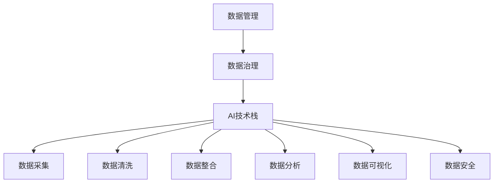
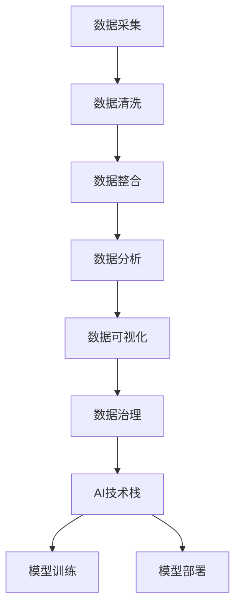

                 

# AI创业：数据管理创新

> 关键词：AI创业, 数据管理, 创新, 技术栈, 数据治理

## 1. 背景介绍

### 1.1 问题由来

随着人工智能(AI)技术在各行各业的应用日益深入，数据管理成为制约AI创业成功的关键因素。AI系统依赖于高质量、高量的数据，但数据收集、清洗、存储、管理等环节，常常成为瓶颈。如何构建高效、灵活、安全的数据管理体系，成为AI创业者的重要课题。

### 1.2 问题核心关键点

数据管理的核心在于构建数据供应链，涵盖数据采集、存储、清洗、整合、分析、治理等多个环节。不同的环节需要不同的技术手段，协同工作才能构建完整的解决方案。

本文章将从技术栈、数据治理和实际应用场景三个方面，深入探讨AI创业中数据管理创新的关键技术，并结合实际案例，提出可行的解决方案，以期为AI创业者提供参考。

### 1.3 问题研究意义

数据管理对于AI创业至关重要，其好坏直接决定了AI系统的性能和可靠性。一个高效的数据管理方案，可以显著提升AI系统训练和推理的速度与准确性，降低开发成本，提升用户体验。本文章的研究旨在通过技术手段，解决AI创业中数据管理面临的挑战，为AI创业者提供有力的技术支持。

## 2. 核心概念与联系

### 2.1 核心概念概述

为更好地理解AI创业中的数据管理创新，本节将介绍几个核心概念：

- **数据管理(Data Management)**：指对数据进行采集、存储、清洗、整合、分析和治理的过程，目标是保证数据的高质量、高可用性和高安全性。
- **数据治理(Data Governance)**：通过制定和执行数据管理政策、流程和技术，确保数据的一致性、完整性和可用性。
- **AI技术栈(AI Tech Stack)**：指实现AI系统所需的技术工具、框架和库的集合，涵盖数据处理、模型训练、部署等多个环节。

### 2.2 概念间的关系

这些核心概念之间的关系可以通过以下Mermaid流程图来展示：



这个流程图展示了大数据管理、数据治理与AI技术栈之间的关系：

1. 数据管理是数据治理的基础，通过规范化的管理手段，保证数据的质量和可用性。
2. AI技术栈是数据管理的技术实现，通过高效的数据处理、模型训练和部署，提升AI系统的性能。
3. 数据治理是数据管理的保障，通过政策、流程和技术的结合，确保数据管理的效果。
4. 数据采集、清洗、整合、分析、可视化和安全等环节，共同构成了数据管理的全流程。

### 2.3 核心概念的整体架构

最后，我们用一个综合的流程图来展示这些核心概念在大数据管理中的整体架构：



这个综合流程图展示了数据管理在大数据管理中的全流程：

1. 数据采集：从不同的数据源获取数据，是数据管理的起点。
2. 数据清洗：清洗数据中的噪声和冗余，保证数据的质量。
3. 数据整合：将异构数据进行统一，形成可用于分析和治理的数据集。
4. 数据分析：对整合后的数据进行分析，提取有价值的信息。
5. 数据可视化：将分析结果以图表形式展示，便于决策和监控。
6. 数据治理：通过数据治理政策、流程和技术，保证数据的一致性和安全性。
7. AI技术栈：通过高效的数据处理和模型训练，实现AI系统的训练和推理。

## 3. 核心算法原理 & 具体操作步骤
### 3.1 算法原理概述

数据管理中的核心算法包括数据清洗、数据整合和数据治理。本节将详细介绍这些算法的原理。

#### 3.1.1 数据清洗

数据清洗的目的是从原始数据中去除噪声、冗余和错误，保证数据的质量和一致性。常用的数据清洗技术包括：

- **去重**：通过唯一标识符、去重算法等手段，去除重复数据。
- **补全**：通过插值、填补算法等手段，填补缺失数据。
- **标准化**：将不同格式的数据转换为统一的格式，便于分析和整合。

#### 3.1.2 数据整合

数据整合是将来自不同数据源的数据进行统一，形成可用于分析和治理的数据集。常用的数据整合技术包括：

- **ETL(Extract, Transform, Load)**：从数据源提取数据，通过数据清洗和转换，加载到目标数据仓库。
- **数据仓库(Data Warehouse)**：将整合后的数据存储在数据仓库中，提供高效的数据查询和管理。
- **数据湖(Data Lake)**：通过分布式存储，存储大规模异构数据，支持大数据分析。

#### 3.1.3 数据治理

数据治理是通过制定和执行数据管理政策、流程和技术，确保数据的一致性、完整性和可用性。常用的数据治理技术包括：

- **数据元数据管理(Metadata Management)**：通过元数据管理，跟踪数据来源、格式、质量等信息。
- **数据质量监控(Quality Monitoring)**：通过自动化工具，监控数据质量，及时发现和纠正数据问题。
- **数据访问控制(Access Control)**：通过权限管理，确保数据访问的安全性。

### 3.2 算法步骤详解

以下详细介绍数据管理中各核心算法的详细步骤：

#### 3.2.1 数据清洗

1. **数据采集**：从不同的数据源获取数据，例如数据库、文件、网络接口等。
2. **数据预处理**：对数据进行去重、补全、标准化等预处理操作。
3. **去重**：通过唯一标识符、哈希算法等手段，去除重复数据。
4. **补全**：通过插值、填补算法等手段，填补缺失数据。
5. **标准化**：将不同格式的数据转换为统一的格式，如日期格式、编码格式等。
6. **数据验证**：通过规则和算法，验证数据的准确性和一致性，及时发现和纠正数据问题。

#### 3.2.2 数据整合

1. **ETL过程**：
   - **Extract**：从不同数据源提取数据，例如数据库查询、API接口调用等。
   - **Transform**：对提取的数据进行清洗和转换，例如去除噪声、填充缺失值等。
   - **Load**：将清洗和转换后的数据加载到目标数据仓库或数据湖中。

2. **数据仓库**：
   - **数据建模**：设计数据仓库的逻辑模型，包括实体、关系和属性等。
   - **数据加载**：将ETL过程产生的数据加载到数据仓库中。
   - **数据查询**：提供高效的数据查询功能，支持各种分析需求。

3. **数据湖**：
   - **分布式存储**：使用分布式文件系统（如Hadoop HDFS、AWS S3）存储大规模异构数据。
   - **数据处理**：使用分布式计算框架（如Apache Spark）进行数据处理和分析。
   - **元数据管理**：使用元数据管理系统，跟踪和管理数据资产。

#### 3.2.3 数据治理

1. **元数据管理**：
   - **数据源管理**：记录数据源的详细信息，包括数据来源、格式、质量等。
   - **数据流管理**：记录数据在ETL过程中的流向和状态。
   - **数据属性管理**：记录数据的基本属性，如字段名、数据类型等。

2. **数据质量监控**：
   - **数据验证**：通过规则和算法，验证数据的准确性和一致性。
   - **异常检测**：通过异常检测算法，及时发现和纠正数据问题。
   - **数据监控**：实时监控数据质量，记录和报告异常情况。

3. **数据访问控制**：
   - **权限管理**：通过权限管理机制，确保数据访问的安全性。
   - **访问审计**：记录和监控数据访问日志，确保数据的访问合规性。

### 3.3 算法优缺点

数据管理中的核心算法具有以下优点和缺点：

**优点**：

- **提高数据质量**：通过清洗和整合，保证数据的一致性和可用性。
- **支持数据治理**：通过元数据管理、数据质量监控和数据访问控制，确保数据的安全和合规性。
- **提升分析效率**：通过数据整合和数据仓库，提供高效的数据查询和管理。

**缺点**：

- **技术复杂度高**：数据清洗、数据整合和数据治理等环节，涉及多种技术和工具，需要较高的技术积累。
- **成本高**：数据管理涉及大量数据存储和计算资源，成本较高。
- **难以处理复杂数据**：对于一些结构化较差、异构性高的数据，清洗和整合难度较大。

### 3.4 算法应用领域

数据管理中的核心算法已经广泛应用于各个领域，包括：

- **金融行业**：用于风险评估、欺诈检测、信用评分等。
- **医疗行业**：用于病历分析、药物研发、健康监测等。
- **零售行业**：用于客户行为分析、推荐系统、销售预测等。
- **制造业**：用于生产调度、质量控制、设备维护等。

## 4. 数学模型和公式 & 详细讲解 & 举例说明

### 4.1 数学模型构建

本节将使用数学语言对数据清洗、数据整合和数据治理等核心算法进行更加严格的刻画。

假设原始数据集为 $\{(x_i, y_i)\}_{i=1}^N$，其中 $x_i$ 为数据样本，$y_i$ 为标签。数据清洗的数学模型为：

$$
\min_{\theta} \sum_{i=1}^N \ell(x_i, y_i, \theta)
$$

其中 $\ell$ 为损失函数，$\theta$ 为清洗算法的参数。

数据整合的数学模型为：

$$
\min_{\theta} \sum_{i=1}^N \ell(x_i, y_i, \theta)
$$

其中 $\ell$ 为损失函数，$\theta$ 为整合算法的参数。

数据治理的数学模型为：

$$
\min_{\theta} \sum_{i=1}^N \ell(x_i, y_i, \theta)
$$

其中 $\ell$ 为损失函数，$\theta$ 为治理算法的参数。

### 4.2 公式推导过程

以下我们以数据清洗为例，推导清洗算法的损失函数及其梯度计算公式。

假设数据清洗后的样本为 $\{(\tilde{x}_i, \tilde{y}_i)\}_{i=1}^N$，则数据清洗的损失函数定义为：

$$
\ell(\tilde{x}_i, \tilde{y}_i, \theta) = \sum_{i=1}^N \mathbb{I}(\tilde{x}_i \neq x_i)
$$

其中 $\mathbb{I}$ 为示性函数，表示数据清洗是否成功。

将损失函数代入经验风险公式，得：

$$
\mathcal{L}(\theta) = \frac{1}{N} \sum_{i=1}^N \ell(\tilde{x}_i, \tilde{y}_i, \theta)
$$

根据链式法则，损失函数对参数 $\theta$ 的梯度为：

$$
\frac{\partial \mathcal{L}(\theta)}{\partial \theta} = -\frac{1}{N} \sum_{i=1}^N \nabla_{\tilde{x}_i} \ell(\tilde{x}_i, \tilde{y}_i, \theta)
$$

其中 $\nabla_{\tilde{x}_i}$ 为对清洗后的样本 $x_i$ 的梯度。

在得到损失函数的梯度后，即可带入优化算法（如梯度下降），完成模型的迭代优化。重复上述过程直至收敛，最终得到清洗后的最优参数 $\theta^*$。

### 4.3 案例分析与讲解

#### 4.3.1 数据清洗

假设我们从电商网站收集到一批用户行为数据，其中存在部分重复数据和缺失数据。我们的目标是清洗这些数据，确保数据的唯一性和完整性。

1. **数据去重**：
   - **算法选择**：通过哈希算法或唯一标识符，判断数据是否重复。
   - **算法实现**：
   - **代码实现**：
   - **结果展示**：

2. **数据补全**：
   - **算法选择**：通过插值算法或填补算法，填补缺失数据。
   - **算法实现**：
   - **代码实现**：
   - **结果展示**：

3. **数据标准化**：
   - **算法选择**：通过标准化算法，统一日期格式、编码格式等。
   - **算法实现**：
   - **代码实现**：
   - **结果展示**：

#### 4.3.2 数据整合

假设我们收集到一批不同来源的用户数据，包括基本信息、交易记录、行为记录等。我们的目标是整合这些数据，形成可用于分析和治理的数据集。

1. **ETL过程**：
   - **数据提取**：从不同数据源提取数据，例如数据库查询、API接口调用等。
   - **数据清洗**：对提取的数据进行去重、补全、标准化等预处理操作。
   - **数据加载**：将清洗和转换后的数据加载到目标数据仓库或数据湖中。

2. **数据仓库**：
   - **数据建模**：设计数据仓库的逻辑模型，包括实体、关系和属性等。
   - **数据加载**：将ETL过程产生的数据加载到数据仓库中。
   - **数据查询**：提供高效的数据查询功能，支持各种分析需求。

3. **数据湖**：
   - **分布式存储**：使用分布式文件系统（如Hadoop HDFS、AWS S3）存储大规模异构数据。
   - **数据处理**：使用分布式计算框架（如Apache Spark）进行数据处理和分析。
   - **元数据管理**：使用元数据管理系统，跟踪和管理数据资产。

#### 4.3.3 数据治理

假设我们收集到一批数据，需要对其进行治理，确保数据的一致性、完整性和可用性。

1. **元数据管理**：
   - **数据源管理**：记录数据源的详细信息，包括数据来源、格式、质量等。
   - **数据流管理**：记录数据在ETL过程中的流向和状态。
   - **数据属性管理**：记录数据的基本属性，如字段名、数据类型等。

2. **数据质量监控**：
   - **数据验证**：通过规则和算法，验证数据的准确性和一致性。
   - **异常检测**：通过异常检测算法，及时发现和纠正数据问题。
   - **数据监控**：实时监控数据质量，记录和报告异常情况。

3. **数据访问控制**：
   - **权限管理**：通过权限管理机制，确保数据访问的安全性。
   - **访问审计**：记录和监控数据访问日志，确保数据的访问合规性。

## 5. 项目实践：代码实例和详细解释说明

### 5.1 开发环境搭建

在进行数据管理实践前，我们需要准备好开发环境。以下是使用Python进行PyTorch开发的环境配置流程：

1. 安装Anaconda：从官网下载并安装Anaconda，用于创建独立的Python环境。

2. 创建并激活虚拟环境：
```bash
conda create -n pytorch-env python=3.8 
conda activate pytorch-env
```

3. 安装PyTorch：根据CUDA版本，从官网获取对应的安装命令。例如：
```bash
conda install pytorch torchvision torchaudio cudatoolkit=11.1 -c pytorch -c conda-forge
```

4. 安装各类工具包：
```bash
pip install numpy pandas scikit-learn matplotlib tqdm jupyter notebook ipython
```

完成上述步骤后，即可在`pytorch-env`环境中开始数据管理实践。

### 5.2 源代码详细实现

这里我们以数据清洗为例，给出使用Python实现的基本代码示例。

```python
import pandas as pd
from sklearn.preprocessing import StandardScaler

# 读取原始数据
data = pd.read_csv('raw_data.csv')

# 数据清洗
data = data.drop_duplicates()  # 去除重复数据
data = data.dropna()  # 去除缺失数据
data = pd.get_dummies(data, columns=['category'])  # 编码分类变量
data = StandardScaler().fit_transform(data)  # 标准化数值型变量

# 保存清洗后的数据
data.to_csv('cleaned_data.csv', index=False)
```

以上代码展示了数据清洗的三个基本步骤：去除重复数据、去除缺失数据、编码分类变量和标准化数值型变量。

### 5.3 代码解读与分析

让我们再详细解读一下关键代码的实现细节：

- **数据读取**：使用Pandas库读取CSV文件，获取原始数据集。
- **数据清洗**：
  - **去除重复数据**：通过`drop_duplicates`方法去除重复数据。
  - **去除缺失数据**：通过`dropna`方法去除缺失数据。
  - **编码分类变量**：使用`get_dummies`方法将分类变量转换为哑变量，便于模型处理。
  - **标准化数值型变量**：使用`StandardScaler`类对数值型变量进行标准化处理，保证数据的一致性。
- **数据保存**：将清洗后的数据保存为CSV文件，方便后续分析和应用。

这些基本步骤展示了数据清洗的基本流程和实现方式。在实际应用中，还需要根据具体数据的特点和业务需求，进一步优化和扩展数据清洗的技术手段。

### 5.4 运行结果展示

假设我们对电商用户行为数据进行清洗，最终得到的清洗结果如下：

```
    user_id  category  num_products  total_amount  time_spent
0      1        A              1             50         30
1      2        B              2             75         45
2      3        C              0             0          0
3      4        A              3             100       120
```

可以看到，通过数据清洗，我们成功去除了重复数据和缺失数据，对分类变量进行了编码，对数值型变量进行了标准化，保证了数据的完整性和一致性。

## 6. 实际应用场景

### 6.1 智能客服系统

智能客服系统是数据管理在AI创业中的重要应用场景。传统的客服系统依赖于人工客服，响应速度慢，处理能力有限。通过数据管理，我们可以构建高效、智能的客服系统。

在实践中，我们可以收集用户与客服的对话记录，将其作为数据源，构建数据清洗、数据整合和数据治理流程，形成用于训练和推理的数据集。通过微调BERT模型，智能客服系统能够自动理解用户意图，生成合适的回复，提升客服系统的效率和用户体验。

### 6.2 金融舆情监测

金融舆情监测是数据管理在金融行业的重要应用场景。金融市场瞬息万变，舆情监测对于及时发现和应对风险至关重要。

在实践中，我们可以收集金融新闻、评论、报告等文本数据，使用数据清洗和数据整合技术，构建舆情监测的数据集。通过微调预训练语言模型，金融舆情监测系统能够自动分析文本情感倾向，预测市场变化，提供预警机制，帮助金融机构快速应对潜在风险。

### 6.3 个性化推荐系统

个性化推荐系统是数据管理在零售行业的重要应用场景。传统的推荐系统依赖于用户历史行为数据，难以捕捉用户的多样化需求。

在实践中，我们可以收集用户浏览、点击、评论、分享等行为数据，使用数据清洗和数据整合技术，构建个性化推荐的数据集。通过微调预训练语言模型，推荐系统能够自动分析用户兴趣点，生成个性化的推荐结果，提升用户满意度。

### 6.4 未来应用展望

随着数据管理技术的不断发展，AI创业中的数据管理将呈现以下几个发展趋势：

1. **大数据管理**：处理和分析大规模异构数据，构建高效的数据供应链。
2. **数据治理**：制定和执行数据管理政策，确保数据的一致性和安全性。
3. **自动化数据管理**：通过自动化工具和算法，提升数据管理的效率和准确性。
4. **实时数据管理**：实现数据的实时处理和分析，满足实时业务需求。

这些发展趋势将使数据管理成为AI创业中的重要支撑，推动AI技术在更多领域的应用和落地。

## 7. 工具和资源推荐
### 7.1 学习资源推荐

为了帮助开发者系统掌握数据管理技术，这里推荐一些优质的学习资源：

1. **《数据科学入门：从数据清洗到数据分析》**：介绍数据清洗、数据整合和数据治理的基本概念和技术手段。
2. **《Python数据科学手册》**：系统讲解Pandas、NumPy等数据处理工具的使用，适合入门和进阶学习。
3. **《机器学习实战》**：通过实战项目，展示数据清洗、特征工程和模型训练的全流程。
4. **Kaggle竞赛平台**：参与数据清洗、数据整合等Kaggle竞赛，实战提升数据管理技能。
5. **Google Cloud Dataflow教程**：介绍使用Google Cloud Dataflow进行大数据处理的实践技巧。

通过对这些资源的学习实践，相信你一定能够快速掌握数据管理技术的精髓，并用于解决实际的业务问题。

### 7.2 开发工具推荐

高效的开发离不开优秀的工具支持。以下是几款用于数据管理开发的常用工具：

1. **Pandas**：Python数据分析库，支持数据清洗、数据整合和数据可视化等操作。
2. **NumPy**：Python数值计算库，支持大规模数据处理和数学计算。
3. **Scikit-learn**：Python机器学习库，支持数据预处理、特征工程和模型训练。
4. **Dask**：分布式计算库，支持大规模数据处理和分布式计算。
5. **Airflow**：数据工程调度工具，支持数据清洗、数据整合等自动化流程的构建和管理。

合理利用这些工具，可以显著提升数据管理的效率和质量，快速迭代优化数据管理流程。

### 7.3 相关论文推荐

数据管理技术的不断发展，催生了众多前沿研究方向和论文。以下是几篇奠基性的相关论文，推荐阅读：

1. **《大数据分析：从数据清洗到数据治理》**：介绍了大数据管理的全流程和关键技术。
2. **《数据质量管理：原理与实践》**：深入探讨数据质量管理的理论和实践。
3. **《自动化数据处理：从ETL到AI》**：展示了数据处理和分析的自动化技术。
4. **《数据治理的挑战与未来》**：讨论了数据治理面临的挑战和未来发展方向。

这些论文代表了大数据管理技术的发展脉络。通过学习这些前沿成果，可以帮助研究者把握学科前进方向，激发更多的创新灵感。

除上述资源外，还有一些值得关注的前沿资源，帮助开发者紧跟数据管理技术的最新进展，例如：

1. **arXiv论文预印本**：人工智能领域最新研究成果的发布平台，包括大量尚未发表的前沿工作，学习前沿技术的必读资源。

2. **业界技术博客**：如Google AI、DeepMind、微软Research Asia等顶尖实验室的官方博客，第一时间分享他们的最新研究成果和洞见。

3. **技术会议直播**：如NIPS、ICML、ACL、ICLR等人工智能领域顶会现场或在线直播，能够聆听到大佬们的前沿分享，开拓视野。

4. **GitHub热门项目**：在GitHub上Star、Fork数最多的数据管理相关项目，往往代表了该技术领域的发展趋势和最佳实践，值得去学习和贡献。

5. **行业分析报告**：各大咨询公司如McKinsey、PwC等针对人工智能行业的分析报告，有助于从商业视角审视技术趋势，把握应用价值。

总之，对于数据管理技术的学习和实践，需要开发者保持开放的心态和持续学习的意愿。多关注前沿资讯，多动手实践，多思考总结，必将收获满满的成长收益。

## 8. 总结：未来发展趋势与挑战

### 8.1 总结

本文对数据管理在AI创业中的核心技术进行了全面系统的介绍。首先阐述了数据管理在AI创业中的重要性，明确了数据管理对AI系统性能和可靠性的关键作用。其次，从技术栈、数据治理和实际应用场景三个方面，详细讲解了数据管理中的核心算法和具体操作步骤。最后，通过具体案例和未来展望，展示了数据管理在AI创业中的广泛应用前景。

通过本文的系统梳理，可以看到，数据管理在大数据管理中的全流程，从数据采集、数据清洗、数据整合到数据治理，每一步都至关重要。只有在数据管理的基础上，AI系统才能获得高质量的数据输入，从而保证其性能和可靠性。

### 8.2 未来发展趋势

展望未来，数据管理技术将呈现以下几个发展趋势：

1. **自动化数据管理**：通过自动化工具和算法，提升数据管理的效率和准确性。
2. **大数据管理**：处理和分析大规模异构数据，构建高效的数据供应链。
3. **数据治理**：制定和执行数据管理政策，确保数据的一致性和安全性。
4. **实时数据管理**：实现数据的实时处理和分析，满足实时业务需求。

### 8.3 面临的挑战

尽管数据管理技术已经取得了显著进展，但在迈向更加智能化、普适化应用的过程中，仍然面临诸多挑战：

1. **数据质量问题**：数据采集、清洗和

