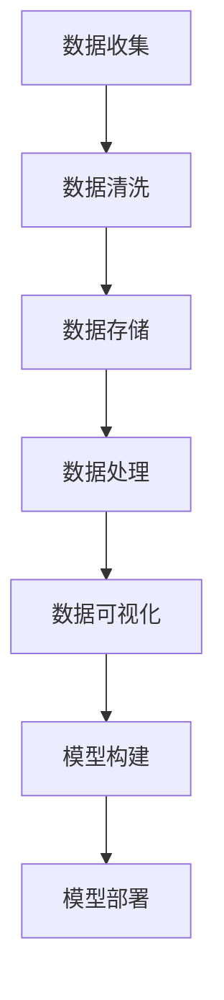

                 

# AI创业：数据管理的策略与工具分析探讨

## 1. 背景介绍

### 1.1 问题由来

在人工智能(AI)创业领域，数据管理是核心竞争力之一。高质量的数据不仅能显著提升AI模型的效果，还能缩短产品开发周期，降低成本。然而，数据管理涉及数据收集、存储、处理和应用等多个环节，复杂度极高，且对技术要求严格。许多AI创业公司因缺乏系统化、精细化的数据管理策略，导致项目进度缓慢、模型效果不达标，甚至项目失败。

因此，本文将从数据管理的策略和工具两方面，探讨AI创业中高效、可靠、经济的数据管理之道。首先，将详细介绍数据管理的核心概念和关联，然后深入分析基于监督学习的AI模型构建流程及其实际应用场景，最后推荐相关学习资源和工具，帮助读者构建高效的数据管理生态系统。

## 2. 核心概念与联系

### 2.1 核心概念概述

为更好地理解AI创业中的数据管理，本节将介绍几个核心概念：

- **数据收集(Data Collection)**：从原始数据源中获取数据的过程，包括网络爬虫、API接口、数据库查询等。数据收集是数据管理的起点，决定了数据的质量和多样性。
- **数据清洗(Data Cleaning)**：对数据进行去重、去噪、填补缺失值等预处理操作，以提升数据质量。数据清洗是确保数据准确性和一致性的重要步骤。
- **数据存储(Data Storage)**：将清洗后的数据保存到数据库或数据仓库中，以便后续分析和应用。数据存储需考虑安全性、可扩展性和访问效率。
- **数据处理(Data Processing)**：利用算法和技术手段对存储数据进行进一步处理，如特征提取、数据增强、降维等，以提取有价值的信息。数据处理是数据管理的核心环节，直接影响模型效果。
- **数据可视化(Data Visualization)**：将处理后的数据以图表、报表等形式呈现，帮助团队理解和探索数据特性。数据可视化是数据分析的重要工具，支持快速迭代和优化。
- **模型构建(Model Building)**：利用预处理后的数据训练AI模型，并进行调参优化，以获得最优效果。模型构建是数据管理的最终目标，需兼顾算法选择、模型优化和评估指标。
- **模型部署(Model Deployment)**：将训练好的模型集成到应用系统中，并进行实时推理。模型部署需确保模型性能和实时性，同时考虑可扩展性和维护性。

这些核心概念之间存在着紧密的联系，通过数据收集、清洗、存储、处理、可视化、模型构建和部署等步骤，完成数据管理的全流程。

### 2.2 概念间的关系

这些核心概念之间的关系可以通过以下Mermaid流程图来展示：



这个流程图展示了大数据管理的全流程：

1. 通过数据收集获取原始数据。
2. 对数据进行清洗，确保数据质量。
3. 将清洗后的数据保存到数据存储库中。
4. 利用数据处理技术，提取有价值的信息。
5. 通过数据可视化，帮助团队理解和探索数据特性。
6. 使用预处理后的数据，构建AI模型。
7. 将模型部署到应用系统中，进行实时推理。

通过这张流程图，我们可以更清晰地理解大数据管理的各个环节，以及它们之间的内在联系。

## 3. 核心算法原理 & 具体操作步骤
### 3.1 算法原理概述

在AI创业中，基于监督学习的模型构建是实现数据价值的重要手段。其核心思想是通过数据集中的样本输入和标签，利用机器学习算法训练出模型，使其能对新样本进行准确的预测或分类。

### 3.2 算法步骤详解

基于监督学习的AI模型构建一般包括以下几个关键步骤：

**Step 1: 数据准备**
- 收集、整理和预处理数据，确保数据质量。
- 数据清洗，去除重复、噪声和缺失数据。
- 数据划分，分为训练集、验证集和测试集，确保模型泛化性。

**Step 2: 模型选择与优化**
- 选择合适的模型结构，如线性回归、决策树、神经网络等。
- 设置模型参数，如学习率、正则化系数等，以优化模型性能。
- 利用交叉验证等技术，评估模型性能，并进行调参优化。

**Step 3: 模型训练**
- 将数据集分批次输入模型，进行前向传播和反向传播，计算损失函数。
- 利用优化算法，如梯度下降，更新模型参数，最小化损失函数。
- 在验证集上评估模型性能，避免过拟合。

**Step 4: 模型部署**
- 将训练好的模型集成到应用系统中。
- 进行模型推理，处理实时数据。
- 监控模型性能，根据反馈进行优化和更新。

### 3.3 算法优缺点

基于监督学习的AI模型构建方法具有以下优点：
- 模型效果稳定，准确率高。
- 算法成熟，实现简单。
- 适用性广，可用于分类、回归、聚类等多种任务。

同时，该方法也存在一些局限性：
- 数据依赖性强，标注成本高。
- 泛化能力有限，易受数据分布影响。
- 计算资源消耗大，训练时间长。

### 3.4 算法应用领域

基于监督学习的AI模型构建方法在多个领域得到了广泛应用，包括但不限于：

- 医疗诊断：利用历史病历和诊断结果，训练出医疗诊断模型，提高疾病预测和诊断准确率。
- 金融风控：通过用户行为数据和交易记录，训练出信用评分模型，预防金融欺诈。
- 自然语言处理：使用文本数据和标注信息，训练出语言理解模型，支持智能问答、情感分析等应用。
- 图像识别：结合图像数据和标签，训练出图像分类模型，实现自动驾驶、安防监控等任务。
- 推荐系统：利用用户行为和商品属性数据，训练出推荐模型，提升用户体验和业务转化率。

## 4. 数学模型和公式 & 详细讲解  
### 4.1 数学模型构建

假设我们有一个二分类问题，数据集为 $\{(x_i, y_i)\}_{i=1}^N$，其中 $x_i$ 为输入特征， $y_i \in \{0, 1\}$ 为标签。我们希望训练一个线性分类器，使其对新样本 $x$ 进行二分类预测。

线性分类器的一般形式为：

$$
f(x) = \begin{cases}
1, & \text{if} \quad w^T x + b > 0 \\
0, & \text{if} \quad w^T x + b \leq 0
\end{cases}
$$

其中 $w$ 为权重向量， $b$ 为偏置项， $x^T$ 表示向量的转置。

我们的目标是最小化预测错误，即最大化准确率。假设训练集中有 $N$ 个样本，错误率为 $L$，则损失函数为：

$$
L = \frac{1}{N} \sum_{i=1}^N \ell(y_i, f(x_i))
$$

其中 $\ell$ 为损失函数，常用的有0-1损失、交叉熵损失等。

### 4.2 公式推导过程

以交叉熵损失为例，其公式如下：

$$
\ell(y_i, f(x_i)) = -y_i \log(f(x_i)) - (1-y_i) \log(1-f(x_i))
$$

其中 $y_i$ 为真实标签， $f(x_i)$ 为模型预测结果。

将损失函数代入优化目标，我们有：

$$
\min_{w,b} \frac{1}{N} \sum_{i=1}^N [-y_i \log(f(x_i)) - (1-y_i) \log(1-f(x_i))]
$$

通过梯度下降等优化算法，求解上述最小化问题，即可得到最优权重 $w$ 和偏置 $b$。

### 4.3 案例分析与讲解

假设我们使用一个包含1000个样本的数据集进行训练，其中500个样本为正类，500个样本为负类。我们希望通过监督学习训练一个线性分类器，以最大化准确率。

首先，我们将数据集分为训练集和验证集，进行模型训练和验证。具体步骤如下：

1. 初始化权重向量 $w$ 和偏置项 $b$，通常从0开始。
2. 将训练集数据分批次输入模型，进行前向传播计算预测结果 $f(x)$。
3. 计算交叉熵损失，反向传播更新权重 $w$ 和偏置 $b$。
4. 在验证集上评估模型性能，根据准确率调整学习率等超参数。
5. 重复上述步骤直至模型收敛，得到最优模型参数。

## 5. 项目实践：代码实例和详细解释说明
### 5.1 开发环境搭建

在进行AI项目实践前，我们需要准备好开发环境。以下是使用Python进行Scikit-Learn开发的环境配置流程：

1. 安装Anaconda：从官网下载并安装Anaconda，用于创建独立的Python环境。

2. 创建并激活虚拟环境：
```bash
conda create -n myenv python=3.8 
conda activate myenv
```

3. 安装Scikit-Learn：
```bash
pip install scikit-learn
```

4. 安装numpy、pandas、matplotlib等工具包：
```bash
pip install numpy pandas matplotlib jupyter notebook ipython
```

完成上述步骤后，即可在`myenv`环境中开始AI项目实践。

### 5.2 源代码详细实现

这里我们以二分类问题为例，给出使用Scikit-Learn库进行监督学习的代码实现。

```python
import numpy as np
from sklearn.model_selection import train_test_split
from sklearn.linear_model import LogisticRegression
from sklearn.metrics import accuracy_score
from sklearn.model_selection import cross_val_score

# 构建数据集
X = np.array([[1, 2], [3, 4], [5, 6], [7, 8]])
y = np.array([0, 1, 1, 0])

# 划分数据集
X_train, X_test, y_train, y_test = train_test_split(X, y, test_size=0.2, random_state=42)

# 初始化模型
model = LogisticRegression()

# 训练模型
model.fit(X_train, y_train)

# 预测结果
y_pred = model.predict(X_test)

# 评估模型
accuracy = accuracy_score(y_test, y_pred)
print(f"Accuracy: {accuracy:.2f}")
```

以上代码实现了二分类问题的监督学习流程，具体步骤如下：

1. 构建数据集：创建输入特征 $X$ 和标签 $y$。
2. 划分数据集：将数据集分为训练集和测试集。
3. 初始化模型：使用Logistic Regression模型。
4. 训练模型：在训练集上训练模型。
5. 预测结果：在测试集上预测新样本。
6. 评估模型：计算准确率。

### 5.3 代码解读与分析

让我们再详细解读一下关键代码的实现细节：

**数据集构建**

```python
X = np.array([[1, 2], [3, 4], [5, 6], [7, 8]])
y = np.array([0, 1, 1, 0])
```

这里创建了一个包含4个样本的数据集，每个样本有两个特征和1个标签。

**数据集划分**

```python
X_train, X_test, y_train, y_test = train_test_split(X, y, test_size=0.2, random_state=42)
```

将数据集分为训练集和测试集，测试集占总数据的20%，随机种子设为42以确保结果可重复。

**模型初始化**

```python
model = LogisticRegression()
```

初始化Logistic Regression模型，模型将使用交叉熵损失函数和随机梯度下降优化算法进行训练。

**模型训练**

```python
model.fit(X_train, y_train)
```

在训练集上训练模型，最小化交叉熵损失函数。

**模型预测**

```python
y_pred = model.predict(X_test)
```

在测试集上预测新样本，并返回预测结果。

**模型评估**

```python
accuracy = accuracy_score(y_test, y_pred)
print(f"Accuracy: {accuracy:.2f}")
```

计算准确率，并打印输出。

可以看到，Scikit-Learn库提供了简单易用的API，使得数据集构建、模型训练、预测和评估等流程变得非常简单。开发者只需专注于模型设计和算法优化，即可快速完成AI项目开发。

### 5.4 运行结果展示

假设我们得到的模型准确率为0.8，则打印结果如下：

```
Accuracy: 0.80
```

这表明我们的模型在测试集上正确分类了80%的样本，表现良好。

## 6. 实际应用场景
### 6.1 医疗诊断

在医疗诊断领域，AI模型可以用于预测疾病的发生风险、诊断病情和治疗效果等。通过收集和整理病人的历史病历和检查结果，训练出医疗诊断模型，可以显著提高诊断准确率和诊疗效率。

在技术实现上，可以构建医疗数据库，收集病人的基本信息、检查结果、诊断记录等，并利用监督学习算法训练出疾病预测和诊断模型。在实际应用中，系统会根据病人提供的症状和检查结果，自动推荐诊断和治疗方案，提供快速准确的医疗服务。

### 6.2 金融风控

在金融风控领域，AI模型可以用于评估贷款申请人的信用风险、预测贷款违约概率等。通过收集和整理贷款申请人的信用记录、收入情况、消费习惯等数据，训练出信用评分模型，可以有效地预防金融欺诈和降低贷款风险。

在技术实现上，可以构建金融数据库，收集贷款申请人的历史数据，并利用监督学习算法训练出信用评分模型。在实际应用中，系统会根据贷款申请人的信息，自动计算信用评分，评估其还款能力，帮助金融机构做出贷款决策。

### 6.3 自然语言处理

在自然语言处理领域，AI模型可以用于文本分类、情感分析、机器翻译等任务。通过收集和整理文本数据，并利用监督学习算法训练出语言理解模型，可以实现高效、准确的文本处理和分析。

在技术实现上，可以构建文本数据库，收集各种文本数据，并利用监督学习算法训练出语言理解模型。在实际应用中，系统可以自动识别文本类型、情感倾向和关键词，提供智能问答、情感分析等服务，提升用户交互体验。

### 6.4 图像识别

在图像识别领域，AI模型可以用于图像分类、目标检测、图像分割等任务。通过收集和整理图像数据，并利用监督学习算法训练出图像分类模型，可以实现高精度的图像处理和识别。

在技术实现上，可以构建图像数据库，收集各种图像数据，并利用监督学习算法训练出图像分类模型。在实际应用中，系统可以自动识别图像中的物体、场景和文字，实现自动驾驶、安防监控等功能，提高生产效率和生活便利性。

## 7. 工具和资源推荐
### 7.1 学习资源推荐

为了帮助开发者系统掌握数据管理和监督学习的基础知识，这里推荐一些优质的学习资源：

1. 《Python数据科学手册》：由Jake VanderPlas编写，全面介绍了Python在数据科学和机器学习中的应用，是入门数据管理的必备指南。

2. 《机器学习实战》：由Peter Harrington编写，提供了大量实战案例，帮助读者深入理解机器学习算法和模型构建。

3. 《深度学习》（Goodfellow等著）：深度学习领域的经典教材，详细介绍了深度神经网络的设计和训练方法，是理解监督学习的基石。

4. 《自然语言处理综论》：由Daniel Jurafsky和James H. Martin编写，涵盖了自然语言处理的各个方面，是学习NLP的权威参考书。

5. Kaggle：全球最大的数据科学竞赛平台，提供大量数据集和实战案例，适合进阶学习和项目实践。

6. Coursera：提供大量数据科学和机器学习课程，由顶尖大学教授授课，涵盖从基础到高级的各个层次。

通过对这些资源的学习实践，相信你一定能够快速掌握数据管理和监督学习的精髓，并用于解决实际的AI项目问题。

### 7.2 开发工具推荐

高效的开发离不开优秀的工具支持。以下是几款用于AI数据管理和监督学习的常用工具：

1. Python：开源且易学习的编程语言，广泛应用于数据科学和机器学习领域。

2. Jupyter Notebook：交互式编程环境，支持代码片段和可视化图表，方便快速迭代和验证。

3. Scikit-Learn：开源的机器学习库，提供了各种常见的监督学习算法，如线性回归、逻辑回归、支持向量机等。

4. Pandas：数据处理库，支持数据清洗、数据透视、数据合并等操作，是数据管理的重要工具。

5. NumPy：科学计算库，支持高性能数值计算和矩阵运算，是数据处理和模型构建的基础。

6. TensorFlow：由Google开发的深度学习框架，支持分布式计算和模型优化，适合大规模深度学习项目。

7. PyTorch：由Facebook开发的深度学习框架，提供了动态计算图和高效的前向传播，适合研究型和应用型项目。

合理利用这些工具，可以显著提升数据管理和监督学习任务的开发效率，加快创新迭代的步伐。

### 7.3 相关论文推荐

数据管理和监督学习是机器学习领域的经典研究方向，以下是几篇奠基性的相关论文，推荐阅读：

1. "A Survey of Machine Learning Techniques for Health Data Mining"（健康数据挖掘的机器学习技术综述）：总结了机器学习在医疗领域的应用，包括分类、聚类、异常检测等任务。

2. "A Survey on Financial Credit Scoring Models"（金融信用评分模型的综述）：总结了机器学习在金融风控领域的应用，包括线性回归、决策树、集成学习等模型。

3. "A Survey of Machine Learning Approaches for Natural Language Processing"（自然语言处理领域的机器学习方法综述）：总结了机器学习在自然语言处理领域的应用，包括文本分类、情感分析、机器翻译等任务。

4. "A Survey of Machine Learning Approaches for Image Processing"（图像处理领域的机器学习方法综述）：总结了机器学习在图像处理领域的应用，包括图像分类、目标检测、图像分割等任务。

这些论文代表了大数据管理和监督学习的最新进展，通过学习这些前沿成果，可以帮助研究者把握学科前进方向，激发更多的创新灵感。

除上述资源外，还有一些值得关注的前沿资源，帮助开发者紧跟数据管理和监督学习技术的最新进展，例如：

1. arXiv论文预印本：人工智能领域最新研究成果的发布平台，包括大量尚未发表的前沿工作，学习前沿技术的必读资源。

2. 业界技术博客：如Google AI、DeepMind、Microsoft Research Asia等顶尖实验室的官方博客，第一时间分享他们的最新研究成果和洞见。

3. 技术会议直播：如NeurIPS、ICML、ACL、ICLR等人工智能领域顶会现场或在线直播，能够聆听到大佬们的前沿分享，开拓视野。

4. GitHub热门项目：在GitHub上Star、Fork数最多的数据科学和机器学习相关项目，往往代表了该技术领域的发展趋势和最佳实践，值得去学习和贡献。

5. 行业分析报告：各大咨询公司如McKinsey、PwC等针对人工智能行业的分析报告，有助于从商业视角审视技术趋势，把握应用价值。

总之，对于数据管理和监督学习技术的学习和实践，需要开发者保持开放的心态和持续学习的意愿。多关注前沿资讯，多动手实践，多思考总结，必将收获满满的成长收益。

## 8. 总结：未来发展趋势与挑战
### 8.1 研究成果总结

本文对数据管理和监督学习的策略与工具进行了全面系统的介绍。首先，阐述了数据管理在AI创业中的重要性，明确了数据管理策略对AI模型效果的影响。其次，从原理到实践，详细讲解了监督学习的数学模型和操作步骤，给出了AI项目开发的完整代码实例。同时，本文还广泛探讨了监督学习在多个行业领域的应用前景，展示了监督学习范式的巨大潜力。

通过本文的系统梳理，可以看到，监督学习在AI创业中起着至关重要的作用，极大地拓展了AI模型的应用边界，催生了更多的落地场景。借助大规模标注数据和先进的监督学习算法，AI模型可以更好地理解和处理现实世界中的复杂问题，带来显著的经济和社会效益。未来，伴随数据管理的持续优化和监督学习技术的不断发展，相信AI创业将迎来更加广阔的发展空间。

### 8.2 未来发展趋势

展望未来，数据管理和监督学习技术将呈现以下几个发展趋势：

1. 数据自动化获取：利用网络爬虫、API接口、传感器等技术，实现数据自动采集和清洗，提升数据收集效率。

2. 数据多元化处理：结合图像、音频、视频等多模态数据，进行更全面、深入的数据分析和处理，提高模型泛化能力。

3. 模型跨领域应用：利用迁移学习和多任务学习技术，将已有的模型迁移到新领域或新任务，提升模型适应性。

4. 模型自适应学习：引入强化学习和对抗训练技术，使模型能够根据反馈实时调整和优化，提高模型的稳健性和自适应能力。

5. 数据隐私保护：在数据管理过程中，严格遵守数据隐私保护法规和伦理要求，保护用户隐私，确保数据安全。

6. 数据治理机制：构建数据管理规范和治理机制，确保数据的质量和一致性，提升数据管理的可靠性。

以上趋势凸显了数据管理和监督学习的广阔前景。这些方向的探索发展，必将进一步提升AI模型的性能和应用范围，为人工智能技术的发展注入新的动力。

### 8.3 面临的挑战

尽管数据管理和监督学习技术已经取得了瞩目成就，但在迈向更加智能化、普适化应用的过程中，它们仍面临着诸多挑战：

1. 数据获取成本高：大规模标注数据获取成本高，且存在标注数据不平衡的问题。如何高效、经济地获取高质量数据，将是一大难题。

2. 数据质量不稳定：数据采集和清洗过程中可能出现错误，影响模型效果。如何保证数据质量，确保模型训练的准确性，仍然是一个挑战。

3. 数据隐私风险：数据管理过程中存在数据泄露和滥用风险，影响用户信任。如何在数据管理和应用中保护用户隐私，需要进一步加强技术和管理措施。

4. 模型泛化能力差：监督学习模型在数据分布发生变化时，泛化能力有限。如何构建鲁棒性更强的模型，提高模型的泛化能力和抗干扰能力，是未来需要解决的问题。

5. 数据治理复杂：数据管理和治理机制的建立和维护需要高度的专业知识和技能，成本较高。如何构建简单、高效的数据治理体系，提高数据管理的效率和质量，需要持续探索和优化。

6. 数据处理延迟高：大规模数据处理和分析过程需要消耗大量计算资源，处理延迟较高。如何提高数据处理效率，优化资源配置，提升数据管理的实时性，将是重要的优化方向。

正视数据管理和监督学习面临的这些挑战，积极应对并寻求突破，将是大数据管理和监督学习技术走向成熟的必由之路。相信随着技术的不断进步和创新，这些挑战终将一一被克服，数据管理和监督学习技术必将在构建智能系统的过程中发挥越来越重要的作用。

### 8.4 研究展望

面对数据管理和监督学习面临的种种挑战，未来的研究需要在以下几个方面寻求新的突破：

1. 探索无监督和半监督学习范式：摆脱对大规模标注数据的依赖，利用自监督学习、主动学习等技术，最大限度利用非结构化数据，实现更加灵活高效的数据管理。

2. 研究参数高效和计算高效的监督学习范式：开发更加参数高效的监督学习模型，在固定大部分模型参数的同时，只更新极少量的任务相关参数。同时优化监督学习模型的计算图，减少前向传播和反向传播的资源消耗，实现更加轻量级、实时性的部署。

3. 融合因果和对比学习范式：通过引入因果推断和对比学习思想，增强监督学习模型建立稳定因果关系的能力，学习更加普适、鲁棒的语言表征，从而提升模型泛化性和抗干扰能力。

4. 引入更多先验知识：将符号化的先验知识，如知识图谱、逻辑规则等，与神经网络模型进行巧妙融合，引导监督学习模型学习更准确、合理的语言模型。同时加强不同模态数据的整合，实现视觉、语音等多模态信息与文本信息的协同建模。

5. 结合因果分析和博弈论工具：将因果分析方法引入监督学习模型，识别出模型决策的关键特征，增强输出解释的因果性和逻辑性。借助博弈论工具刻画人机交互过程，主动探索并规避模型的脆弱点，提高系统稳定性。

6. 纳入伦理道德约束：在监督学习模型训练目标中引入伦理导向的评估指标，过滤和惩罚有偏见、有害的输出倾向。同时加强人工干预和审核，建立模型行为的监管机制，确保输出符合人类价值观和伦理道德。

这些研究方向的探索，必将引领数据管理和监督学习技术迈向更高的台阶，为构建安全、可靠、可解释、可控的智能系统铺平道路。面向未来，数据管理和监督学习技术还需要与其他人工智能技术进行更深入的融合，如知识表示、因果推理、强化学习等，多路径协同发力，共同推动人工智能技术的发展。只有勇于创新、敢于突破，才能不断拓展人工智能技术的应用边界，为人类带来更多福祉。

## 9. 附录：常见问题与解答

**Q1：AI创业中的数据管理是否只包括数据收集和清洗？**

A: 数据管理不仅包括数据收集和清洗，还涉及数据存储、处理、可视化等多个环节。数据管理是一个系统化的过程，需要综合考虑数据的各个方面，以确保数据的质量和一致性，为模型构建和应用提供可靠的基础。

**Q2：如何平衡

