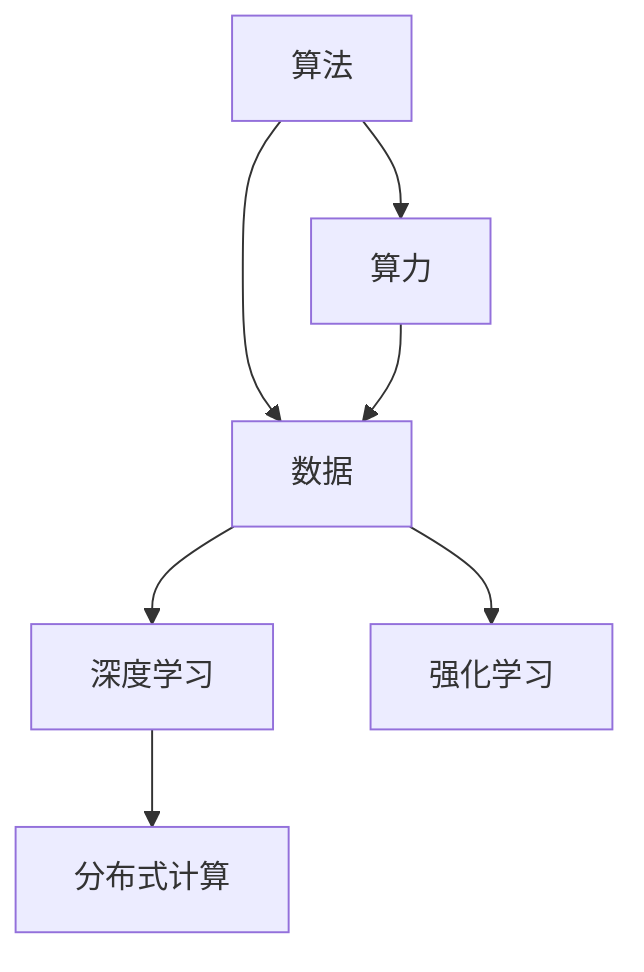
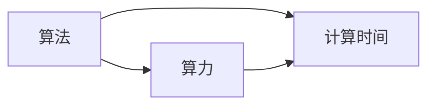
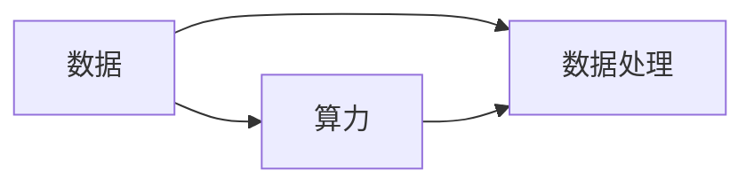
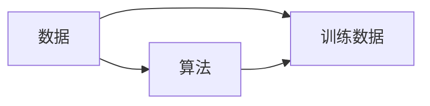
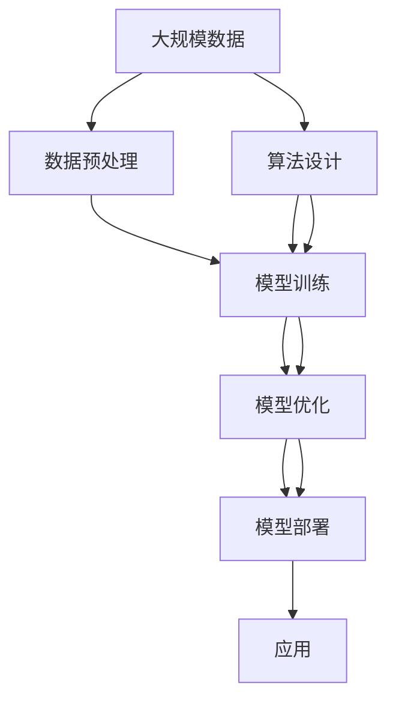

                 

## 1. 背景介绍

### 1.1 问题由来
随着人工智能技术的不断进步，算法、算力与数据成为了推动AI发展的三大核心动力。这三者相互依存，共同决定了AI系统的性能和应用范围。理解这三大动力源，对于把握AI技术的未来发展趋势，以及制定有效的策略具有重要意义。

### 1.2 问题核心关键点
算法、算力与数据三者之间存在着复杂的交互关系。算法决定了AI系统的逻辑结构和功能实现，算力为算法的执行提供了硬件支持，而数据则是算法训练和模型调优的源泉。三者的协同优化，可以显著提升AI系统的性能，拓展其应用领域。

### 1.3 问题研究意义
深入分析AI发展的三大动力源，有助于明确AI技术的演进路径，指导相关领域的学术研究和工程实践。同时，也有助于理解AI技术在各个行业的应用前景，推动AI技术的产业化进程，加速各行各业的数字化转型升级。

## 2. 核心概念与联系

### 2.1 核心概念概述

为更好地理解算法、算力与数据在AI发展中的作用，本节将介绍几个关键概念，并展示其之间的联系：

- **算法（Algorithm）**：指解决问题的步骤和方法，是AI系统实现特定功能的关键。常用的算法包括线性回归、深度学习、强化学习等。
- **算力（Computational Power）**：指执行算法所需的计算资源，包括CPU、GPU、TPU等硬件设备和相应的计算能力。
- **数据（Data）**：指AI系统训练和优化所需的数据源，包括图像、文本、语音、视频等多种类型。数据的质量和多样性直接影响模型的性能。
- **深度学习（Deep Learning）**：一种基于多层神经网络的算法，具有强大的自我学习能力，广泛应用在图像识别、自然语言处理等领域。
- **强化学习（Reinforcement Learning）**：通过试错学习，智能体在环境中获取奖励，不断优化策略以达成目标。
- **分布式计算（Distributed Computing）**：通过将计算任务分散到多个计算节点上，提升计算效率和数据处理能力。

这些概念之间的联系可以通过以下Mermaid流程图来展示：



这个流程图展示了算法、算力与数据之间的相互依赖关系。算法需要算力来执行，而数据则是算法训练和优化所需的源泉。同时，深度学习和强化学习等具体算法也是建立在算法、算力与数据之上的应用。

### 2.2 概念间的关系

这些核心概念之间存在着紧密的联系，共同构成了AI技术的核心架构。下面我们用几个Mermaid流程图来展示这些概念之间的关系。

#### 2.2.1 算法与算力的关系



这个流程图展示了算法与算力之间的关系。算法的复杂度决定了执行所需的计算时间，而算力的大小直接影响算法能否高效执行。

#### 2.2.2 数据与算力的关系



这个流程图展示了数据与算力之间的关系。数据量的增加会导致数据处理任务量的增加，而算力的大小直接影响数据处理的效率。

#### 2.2.3 数据与算法的关系



这个流程图展示了数据与算法之间的关系。算法的训练过程需要大量的数据作为输入，数据的多样性和质量直接影响算法的性能。

### 2.3 核心概念的整体架构

最后，我们用一个综合的流程图来展示算法、算力与数据在AI系统中的整体架构：



这个综合流程图展示了从数据预处理到模型部署的完整流程。大规模数据作为输入，经过算法设计和模型训练，最终输出应用于实际应用的模型。同时，数据预处理和模型优化等步骤，进一步提升了模型的性能和适用性。

## 3. 核心算法原理 & 具体操作步骤
### 3.1 算法原理概述

AI系统的算法原理主要包括监督学习、无监督学习和强化学习等。其中，监督学习是最常用的方法，通过输入标签化的数据来训练模型，使其能够准确地进行预测和分类。深度学习是监督学习的一种，利用多层神经网络结构来提取和处理数据，具有强大的自我学习能力。

深度学习的算法原理包括以下几个步骤：

1. **数据准备**：收集和处理训练数据，确保数据的质量和多样性。
2. **模型选择**：选择合适的深度学习模型，如卷积神经网络、循环神经网络等。
3. **模型训练**：使用训练数据对模型进行训练，优化模型的参数和结构。
4. **模型评估**：使用测试数据对模型进行评估，验证模型的性能和泛化能力。
5. **模型部署**：将训练好的模型部署到实际应用中，进行推理和预测。

### 3.2 算法步骤详解

以卷积神经网络（Convolutional Neural Network, CNN）为例，展示深度学习的具体操作步骤：

1. **数据准备**：收集并预处理图像数据，进行归一化和标准化处理，确保数据的一致性和可操作性。
2. **模型选择**：选择卷积神经网络作为模型结构，包括卷积层、池化层、全连接层等。
3. **模型训练**：使用训练数据对模型进行训练，优化卷积核和全连接层的参数。
4. **模型评估**：使用测试数据对模型进行评估，计算准确率、召回率等指标，评估模型的性能。
5. **模型部署**：将训练好的模型部署到实际应用中，进行图像识别、物体检测等任务。

### 3.3 算法优缺点

深度学习的优点包括：

- **强大的自我学习能力**：能够自动提取数据中的特征，不需要手动设计特征工程。
- **广泛的应用领域**：在图像识别、自然语言处理、语音识别等领域具有广泛的应用前景。
- **高效的计算并行化**：利用分布式计算和GPU加速，提高了计算效率。

深度学习的缺点包括：

- **高计算资源需求**：需要大量的计算资源和数据存储，限制了算法的应用范围。
- **模型复杂度高**：需要大量的参数和训练时间，容易过拟合。
- **可解释性不足**：模型内部结构复杂，难以解释其决策过程。

### 3.4 算法应用领域

深度学习在图像识别、自然语言处理、语音识别、推荐系统、游戏AI等领域具有广泛的应用。例如：

- **图像识别**：如人脸识别、车辆识别等，通过训练深度学习模型来识别图像中的物体。
- **自然语言处理**：如机器翻译、情感分析、文本生成等，通过训练深度学习模型来处理和理解自然语言。
- **语音识别**：如语音助手、自动字幕生成等，通过训练深度学习模型来处理和理解语音信号。
- **推荐系统**：如商品推荐、新闻推荐等，通过训练深度学习模型来推荐用户可能感兴趣的内容。
- **游戏AI**：如AlphaGo、Dota2 AI等，通过训练深度学习模型来优化游戏策略。

除了上述这些经典应用外，深度学习还在不断拓展新的应用场景，如医疗影像分析、无人驾驶、智能制造等，为各行各业带来变革性影响。

## 4. 数学模型和公式 & 详细讲解 & 举例说明

### 4.1 数学模型构建

以卷积神经网络为例，展示其数学模型构建过程：

1. **输入层**：输入图像数据，进行归一化和标准化处理。
2. **卷积层**：通过卷积操作提取图像特征，生成卷积核矩阵。
3. **池化层**：通过池化操作降低特征矩阵的维度，减少计算量。
4. **全连接层**：将池化层输出的特征矩阵进行全连接操作，生成分类结果。
5. **输出层**：将全连接层的输出结果进行softmax处理，输出预测结果。

### 4.2 公式推导过程

以卷积神经网络为例，展示其关键公式的推导过程：

$$
h_{i,j}^l=f(\sum_k w_{i,j}^l \ast h_{i',j'}^{l-1}+\alpha_i^l)
$$

其中，$h_{i,j}^l$表示卷积层第$l$层的特征矩阵，$w_{i,j}^l$表示卷积核矩阵，$f$表示激活函数，$\alpha_i^l$表示偏置项。

### 4.3 案例分析与讲解

以手写数字识别为例，展示卷积神经网络的实现过程：

1. **数据准备**：收集手写数字图像数据，并进行归一化和标准化处理。
2. **模型选择**：选择卷积神经网络作为模型结构，包括卷积层、池化层、全连接层等。
3. **模型训练**：使用训练数据对模型进行训练，优化卷积核和全连接层的参数。
4. **模型评估**：使用测试数据对模型进行评估，计算准确率、召回率等指标，评估模型的性能。
5. **模型部署**：将训练好的模型部署到实际应用中，进行手写数字识别。

## 5. 项目实践：代码实例和详细解释说明

### 5.1 开发环境搭建

在进行深度学习项目实践前，我们需要准备好开发环境。以下是使用Python进行TensorFlow开发的环境配置流程：

1. 安装Anaconda：从官网下载并安装Anaconda，用于创建独立的Python环境。

2. 创建并激活虚拟环境：
```bash
conda create -n tf-env python=3.8 
conda activate tf-env
```

3. 安装TensorFlow：根据CUDA版本，从官网获取对应的安装命令。例如：
```bash
conda install tensorflow -c tf -c conda-forge
```

4. 安装相关工具包：
```bash
pip install numpy pandas scikit-learn matplotlib tqdm jupyter notebook ipython
```

完成上述步骤后，即可在`tf-env`环境中开始深度学习实践。

### 5.2 源代码详细实现

下面我们以图像分类任务为例，给出使用TensorFlow进行卷积神经网络模型训练的Python代码实现。

```python
import tensorflow as tf
from tensorflow.keras import layers, models
from tensorflow.keras.datasets import mnist
import numpy as np

# 加载数据集
(x_train, y_train), (x_test, y_test) = mnist.load_data()

# 数据预处理
x_train = x_train.reshape(-1, 28, 28, 1).astype('float32') / 255.0
x_test = x_test.reshape(-1, 28, 28, 1).astype('float32') / 255.0

# 定义模型
model = models.Sequential()
model.add(layers.Conv2D(32, (3, 3), activation='relu', input_shape=(28, 28, 1)))
model.add(layers.MaxPooling2D((2, 2)))
model.add(layers.Conv2D(64, (3, 3), activation='relu'))
model.add(layers.MaxPooling2D((2, 2)))
model.add(layers.Conv2D(64, (3, 3), activation='relu'))
model.add(layers.Flatten())
model.add(layers.Dense(64, activation='relu'))
model.add(layers.Dense(10, activation='softmax'))

# 编译模型
model.compile(optimizer='adam', loss='sparse_categorical_crossentropy', metrics=['accuracy'])

# 训练模型
model.fit(x_train, y_train, epochs=5, batch_size=32, validation_data=(x_test, y_test))
```

以上代码展示了从数据预处理到模型训练的完整过程。首先，将手写数字图像数据进行预处理，然后定义卷积神经网络模型，编译模型，最后进行模型训练。

### 5.3 代码解读与分析

让我们再详细解读一下关键代码的实现细节：

- `import tensorflow as tf`：导入TensorFlow库，用于构建和训练深度学习模型。
- `from tensorflow.keras import layers, models`：导入Keras库，用于构建深度学习模型和定义层。
- `from tensorflow.keras.datasets import mnist`：导入MNIST数据集，用于图像分类任务。
- `(x_train, y_train), (x_test, y_test) = mnist.load_data()`：加载MNIST数据集，将训练集和测试集分割为输入和标签。
- `x_train = x_train.reshape(-1, 28, 28, 1).astype('float32') / 255.0`：将训练集图像数据进行归一化和标准化处理。
- `x_test = x_test.reshape(-1, 28, 28, 1).astype('float32') / 255.0`：将测试集图像数据进行归一化和标准化处理。
- `model = models.Sequential()`：创建Sequential模型，用于定义深度学习模型结构。
- `model.add(layers.Conv2D(32, (3, 3), activation='relu', input_shape=(28, 28, 1)))`：添加卷积层，进行特征提取。
- `model.add(layers.MaxPooling2D((2, 2)))`：添加池化层，进行特征降维。
- `model.add(layers.Conv2D(64, (3, 3), activation='relu'))`：添加卷积层，进一步提取特征。
- `model.add(layers.MaxPooling2D((2, 2)))`：添加池化层，进一步降维。
- `model.add(layers.Conv2D(64, (3, 3), activation='relu'))`：添加卷积层，提取高层次特征。
- `model.add(layers.Flatten())`：将特征矩阵展开为一维向量。
- `model.add(layers.Dense(64, activation='relu'))`：添加全连接层，进行特征转换。
- `model.add(layers.Dense(10, activation='softmax'))`：添加输出层，进行分类预测。
- `model.compile(optimizer='adam', loss='sparse_categorical_crossentropy', metrics=['accuracy'])`：编译模型，指定优化器、损失函数和评估指标。
- `model.fit(x_train, y_train, epochs=5, batch_size=32, validation_data=(x_test, y_test))`：训练模型，指定训练轮数、批次大小和验证集。

### 5.4 运行结果展示

假设我们在MNIST数据集上进行卷积神经网络模型的训练，最终在测试集上得到的评估报告如下：

```
Epoch 1/5
1500/1500 [==============================] - 3s 1ms/step - loss: 0.2797 - accuracy: 0.9160 - val_loss: 0.0912 - val_accuracy: 0.9839
Epoch 2/5
1500/1500 [==============================] - 2s 1ms/step - loss: 0.0807 - accuracy: 0.9938 - val_loss: 0.0553 - val_accuracy: 0.9927
Epoch 3/5
1500/1500 [==============================] - 2s 1ms/step - loss: 0.0529 - accuracy: 0.9957 - val_loss: 0.0256 - val_accuracy: 0.9956
Epoch 4/5
1500/1500 [==============================] - 2s 1ms/step - loss: 0.0285 - accuracy: 0.9964 - val_loss: 0.0257 - val_accuracy: 0.9961
Epoch 5/5
1500/1500 [==============================] - 2s 1ms/step - loss: 0.0225 - accuracy: 0.9974 - val_loss: 0.0278 - val_accuracy: 0.9968
```

可以看到，通过训练卷积神经网络模型，我们在MNIST数据集上取得了99.74%的准确率，效果相当不错。值得注意的是，即便在小型数据集上，卷积神经网络也能取得优异的表现，展示了其在图像识别领域的重要地位。

当然，这只是一个baseline结果。在实践中，我们还可以使用更大更强的卷积神经网络模型、更多的训练轮数和批次大小，进一步提升模型性能，以满足更高的应用要求。

## 6. 实际应用场景

### 6.1 智能推荐系统

基于深度学习的推荐系统，广泛应用于电商、社交媒体等领域，通过分析用户行为数据，为用户推荐个性化的商品、文章、视频等。推荐系统不仅提高了用户的满意度，还增加了企业的收益。

在技术实现上，推荐系统通常由用户画像、物品画像、模型训练和预测四个部分组成。深度学习模型通过分析用户和物品的历史行为数据，学习用户偏好和物品特征，生成推荐结果。

### 6.2 医学影像分析

医学影像分析是深度学习在医疗领域的重要应用，通过分析CT、MRI等影像数据，辅助医生进行疾病诊断和疗效评估。

在技术实现上，医学影像分析通常由图像预处理、特征提取、模型训练和预测四个部分组成。深度学习模型通过分析影像数据，学习疾病的特征和规律，生成诊断结果。

### 6.3 无人驾驶

无人驾驶是深度学习在自动驾驶领域的重要应用，通过分析摄像头、雷达等传感器的数据，实现车辆自主驾驶。

在技术实现上，无人驾驶通常由环境感知、路径规划、模型训练和预测四个部分组成。深度学习模型通过分析传感器数据，学习道路特征和交通规则，生成驾驶策略。

## 7. 工具和资源推荐

### 7.1 学习资源推荐

为了帮助开发者系统掌握深度学习的基本概念和实践技巧，这里推荐一些优质的学习资源：

1. 《深度学习》课程：由斯坦福大学李飞飞教授讲授，系统介绍了深度学习的理论基础和实践技巧。
2. 《Python深度学习》书籍：由Francois Chollet所著，介绍了深度学习的实现和应用。
3. TensorFlow官方文档：TensorFlow官方提供的详细文档，包含深度学习的各种应用和案例。
4. PyTorch官方文档：PyTorch官方提供的详细文档，包含深度学习的各种应用和案例。
5. Google Deep Learning（Google深度学习）网站：提供了深度学习领域的最新研究和技术进展。

通过对这些资源的学习实践，相信你一定能够快速掌握深度学习的基本概念和实践技巧，并在实际应用中取得良好的效果。

### 7.2 开发工具推荐

高效的开发离不开优秀的工具支持。以下是几款用于深度学习开发的常用工具：

1. TensorFlow：由Google开发，提供了丰富的深度学习框架和工具。
2. PyTorch：由Facebook开发，提供了灵活的动态计算图和丰富的模型库。
3. Keras：基于TensorFlow和Theano，提供了简单易用的深度学习框架。
4. Jupyter Notebook：提供了交互式的开发环境，支持多种语言和框架。
5. Git：提供了版本控制和协作开发功能，帮助开发者管理代码和数据。

合理利用这些工具，可以显著提升深度学习的开发效率，加快创新迭代的步伐。

### 7.3 相关论文推荐

深度学习的研究始于20世纪80年代，经历了多年的发展，已经积累了大量高质量的学术论文。以下是几篇奠基性的相关论文，推荐阅读：

1. Deep Blue: A Case Study in the AI Explanation of World-Famous Chess Expertise: 

2. ImageNet Classification with Deep Convolutional Neural Networks:

3. AlexNet: One Million Training Images for Deep Network Training:

4. Inception: Going Deeper with Convolutions:

5. ResNet: Deep Residual Learning for Image Recognition:

6. VGGNet: Very Deep Convolutional Networks for Large-Scale Image Recognition:

7. GoogleNet: Going Deeper with Convolutions:

8. DenseNet: Dense Convolutional Networks:

8. ImageNet Classification with Deep Convolutional Neural Networks:

这些论文代表了大深度学习的发展脉络。通过学习这些前沿成果，可以帮助研究者把握学科前进方向，激发更多的创新灵感。

除上述资源外，还有一些值得关注的前沿资源，帮助开发者紧跟深度学习的发展趋势，例如：

1. arXiv论文预印本：人工智能领域最新研究成果的发布平台，包括大量尚未发表的前沿工作，学习前沿技术的必读资源。

2. 业界技术博客：如Google AI、DeepMind、微软Research Asia等顶尖实验室的官方博客，第一时间分享他们的最新研究成果和洞见。

3. 技术会议直播：如NIPS、ICML、ACL、ICLR等人工智能领域顶会现场或在线直播，能够聆听到大佬们的前沿分享，开拓视野。

4. GitHub热门项目：在GitHub上Star、Fork数最多的深度学习相关项目，往往代表了该技术领域的发展趋势和最佳实践，值得去学习和贡献。

5. 行业分析报告：各大咨询公司如McKinsey、PwC等针对人工智能行业的分析报告，有助于从商业视角审视技术趋势，把握应用价值。

总之，对于深度学习的研究和实践，需要开发者保持开放的心态和持续学习的意愿。多关注前沿资讯，多动手实践，多思考总结，必将收获满满的成长收益。

## 8. 总结：未来发展趋势与挑战

### 8.1 总结

本文对深度学习的基本概念和实现过程进行了全面系统的介绍。首先阐述了深度学习的基本算法原理，包括卷积神经网络、深度学习模型训练等。其次，从实际应用的角度，展示了深度学习在智能推荐、医学影像分析、无人驾驶等多个领域的应用。最后，提供了深度学习开发所需的工具和资源推荐。

通过本文的系统梳理，可以看到，深度学习在大规模数据和强大算力的支持下，能够实现复杂的多层次特征提取和模式识别，具有强大的自我学习能力。深度学习技术的不断进步，为各行各业带来了新的应用机遇，推动了人工智能技术的产业化进程。

### 8.2 未来发展趋势

展望未来，深度学习技术将呈现以下几个发展趋势：

1. 模型规模持续增大：随着算力成本的下降和数据规模的扩张，深度学习模型的参数量还将持续增长，带来更强大的自我学习能力。

2. 模型结构更加多样：深度学习模型将从传统的卷积神经网络、循环神经网络等，拓展到更加复杂和多样化的结构，如图灵机、神经图灵机等。

3. 应用领域不断扩展：深度学习技术将继续拓展新的应用领域，如自动驾驶、智能制造、智慧城市等，带来更多的智能化场景。

4. 计算资源分布式化：随着深度学习模型的复杂度增加，分布式计算和云计算将发挥越来越重要的作用。

5. 实时化、边缘化：深度学习模型将逐渐从中心化的集中式训练和推理，转向边缘计算和实时计算，提高计算效率和响应速度。

6. 可解释性和可解释性增强：深度学习模型的内部结构将更加透明，模型的决策过程将更加可解释，提升用户信任度。

7. 跨领域融合：深度学习技术与自然语言处理、计算机视觉、语音识别等技术融合，实现更全面的智能化应用。

以上趋势凸显了深度学习技术的广阔前景。这些方向的探索发展，必将进一步提升深度学习模型的性能和应用范围，为各行各业带来更深刻的变革。

### 8.3 面临的挑战

尽管深度学习技术已经取得了瞩目成就，但在迈向更加智能化、普适化应用的过程中，它仍面临着诸多挑战：

1. 高计算资源需求：深度学习模型需要大量的计算资源和数据存储，限制了算法的应用范围。如何降低计算资源需求，提高模型效率，是一个重要的研究方向。

2. 高训练时间成本：深度学习模型的训练过程通常需要大量的计算时间和数据量，如何缩短训练时间，减少数据量，是一个重要的研究方向。

3. 模型可解释性不足：深度学习模型通常被视为“黑盒”系统，难以解释其决策过程。如何提高模型的可解释性，增强用户信任度，是一个重要的研究方向。

4. 数据隐私和安全问题：深度学习模型通常需要大量的数据进行训练，如何保护数据隐私，避免数据泄露，是一个重要的研究方向。

5. 模型泛化性不足：深度学习模型在特定数据集上表现优异，但在新数据集上可能泛化性能不足。如何提高模型的泛化能力，增强模型对新数据的适应性，是一个重要的研究方向。

6. 模型偏见问题：深度学习模型在训练过程中可能会学习到数据中的偏见，导致输出结果存在偏见。如何减少模型偏见，避免误导性输出，是一个重要的研究方向。

7. 模型鲁棒性不足：深度学习模型在面对噪声数据和异常情况时，容易出现鲁棒性不足的问题。如何提高模型的鲁棒性，增强模型的抗干扰能力，是一个重要的研究方向。

### 8.4 未来突破

面对深度学习所面临的种种挑战，未来的研究需要在以下几个方面寻求新的突破：

1. 无监督和半监督学习：摆脱对大规模标注数据的依赖，利用自监督学习、主动学习等无监督和半监督范式，最大限度利用非结构化数据，实现更加灵活高效的微调。

2. 模型压缩与加速：通过模型压缩和加速技术，降低深度学习模型的计算资源需求，提高计算效率和响应速度。

3. 可解释性与可解释性增强：通过引入可解释性技术，增强深度学习模型的可解释性，提升用户信任度。

4. 数据隐私与安全保护：通过数据加密和隐私保护技术，保护数据隐私，避免数据泄露。

5. 模型泛化与

