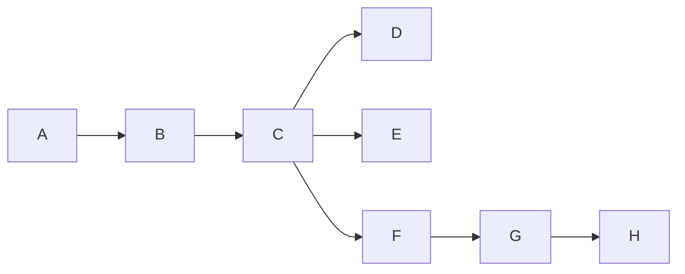
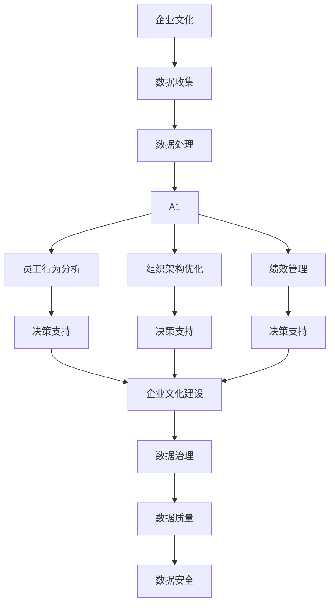

                 

# AI在企业文化建设中的创新应用

> 关键词：AI, 企业文化建设, 数据驱动, 员工行为分析, 组织架构优化, 绩效管理, 数据治理

## 1. 背景介绍

### 1.1 问题由来
随着信息技术的快速发展，企业经营管理模式正在经历深刻变革。数字化转型成为企业发展的新趋势，AI技术的引入更是为企业管理和企业文化建设带来了全新的机遇。AI通过自动化处理大量数据，精准分析员工行为，优化组织架构，提升绩效管理，帮助企业在数字化时代中保持竞争力。

### 1.2 问题核心关键点
AI在企业文化建设中的应用，主要体现在以下几个方面：
1. **数据驱动决策**：通过数据分析技术，企业可以更科学地制定和调整企业文化战略。
2. **员工行为分析**：AI可以实时监控员工行为，优化员工绩效，提升团队合作效率。
3. **组织架构优化**：AI技术能够分析组织结构，识别瓶颈，优化工作流程，提高管理效率。
4. **绩效管理**：利用AI对员工表现进行量化分析，提高绩效考核的科学性和公正性。
5. **数据治理**：AI技术助力企业数据标准化，提升数据质量，降低数据治理成本。

### 1.3 问题研究意义
AI在企业文化建设中的应用，有助于企业建立更加科学、透明、高效的企业文化，促进企业数字化转型，增强企业竞争力。通过AI技术，企业可以更好地理解和激励员工，优化资源配置，提升整体绩效，从而实现可持续发展。

## 2. 核心概念与联系

### 2.1 核心概念概述

为更好地理解AI在企业文化建设中的应用，本节将介绍几个密切相关的核心概念：

- **AI**：人工智能，通过模拟人类智能行为，使计算机系统具有学习、推理、决策等能力。
- **企业文化**：企业内部共同的价值观、信念、行为规范等，是企业核心竞争力的重要组成部分。
- **数据驱动决策**：通过收集、分析和应用数据，制定和调整企业战略，优化决策过程。
- **员工行为分析**：通过数据分析技术，实时监控和分析员工行为，提升工作效率和团队合作。
- **组织架构优化**：通过AI技术分析组织结构，识别瓶颈，优化流程，提升管理效率。
- **绩效管理**：通过AI量化员工表现，提升绩效考核的科学性和公正性，激励员工提升绩效。
- **数据治理**：通过AI技术标准化数据，提升数据质量，降低数据治理成本，确保数据安全。

这些核心概念之间存在着紧密的联系，形成了AI在企业文化建设中的应用生态系统。以下是一个简化的Mermaid流程图，展示这些概念之间的关系：



这个流程图展示了大语言模型微调过程中各个核心概念的相互关系：

1. 企业通过数据收集和处理，输入AI系统，进行员工行为分析、组织架构优化和绩效管理。
2. AI系统分析这些数据，生成决策支持信息，用于企业文化建设。
3. 数据治理确保数据质量和安全，进一步提升AI系统性能。

### 2.2 概念间的关系

这些核心概念之间存在着紧密的联系，形成了AI在企业文化建设中的应用生态系统。以下是一个综合的Mermaid流程图，展示这些概念之间的整体架构：



这个综合流程图展示了从数据收集到企业文化建设的完整流程：

1. 企业收集员工行为、组织架构、绩效管理等数据。
2. 数据经过处理，输入AI系统进行分析和优化。
3. AI系统生成决策支持信息，用于企业文化建设。
4. 数据治理确保数据质量和安全，进一步提升AI系统性能。

## 3. 核心算法原理 & 具体操作步骤
### 3.1 算法原理概述

AI在企业文化建设中的应用，主要依赖于数据分析和机器学习算法。其核心思想是通过收集和处理企业内部数据，利用AI技术进行行为分析、组织优化、绩效管理等，从而提升企业文化建设效果。

形式化地，假设企业内部有大量数据 $D=\{x_1, x_2, ..., x_N\}$，其中 $x_i$ 代表第 $i$ 个数据点，可以是员工行为记录、组织架构信息、绩效数据等。AI系统的目标是通过算法 $f$ 将这些数据映射为决策支持信息 $y=\{y_1, y_2, ..., y_M\}$，其中 $y_i$ 代表第 $i$ 个决策支持信息，用于指导企业文化建设。

具体的算法过程包括数据收集、数据处理、特征工程、模型训练和结果应用等步骤。通过这些步骤，AI系统能够从海量数据中提取有价值的信息，支持企业文化的科学决策。

### 3.2 算法步骤详解

AI在企业文化建设中的应用，主要包括以下几个关键步骤：

**Step 1: 数据收集与预处理**
- 收集企业内部员工行为、组织架构、绩效管理等数据。
- 进行数据清洗、去重、规范化等预处理操作，确保数据质量。

**Step 2: 特征工程**
- 设计合理的特征集，包括员工工作量、工作时间、项目参与度、绩效评分等。
- 利用统计学方法提取数据中的关键特征，如平均值、标准差、方差等。

**Step 3: 模型训练**
- 选择合适的机器学习算法，如随机森林、梯度提升树、神经网络等。
- 使用训练集进行模型训练，调整超参数，优化模型性能。

**Step 4: 结果应用**
- 将训练好的模型应用于员工行为分析、组织架构优化、绩效管理等任务。
- 实时监控和分析员工行为，优化工作流程，提升绩效管理。

**Step 5: 持续优化**
- 定期评估模型性能，收集新数据进行模型更新。
- 根据业务变化调整模型和算法，确保企业文化建设效果。

### 3.3 算法优缺点

AI在企业文化建设中的应用，具有以下优点：
1. 数据驱动：通过大量数据支持决策，减少主观因素影响。
2. 实时监控：能够实时监控员工行为，及时发现问题，快速调整策略。
3. 自动化操作：减轻人力资源部门的工作负担，提升管理效率。

同时，也存在一些缺点：
1. 数据隐私：收集和使用员工数据需遵守隐私保护法规，确保数据安全。
2. 模型复杂性：算法模型较为复杂，对数据质量要求高。
3. 结果解释：AI系统的决策过程不透明，难以解释模型内部机制。

### 3.4 算法应用领域

AI在企业文化建设中的应用，广泛覆盖以下几个领域：

- **员工行为分析**：通过监控员工工作行为，识别高绩效员工和需要改进的环节，提升团队合作效率。
- **组织架构优化**：利用AI分析组织结构，识别瓶颈和冗余，优化流程，提高管理效率。
- **绩效管理**：利用AI量化员工表现，提升绩效考核的科学性和公正性，激励员工提升绩效。
- **数据治理**：通过AI标准化数据，提升数据质量，降低数据治理成本，确保数据安全。

## 4. 数学模型和公式 & 详细讲解 & 举例说明

### 4.1 数学模型构建

假设企业内部有 $N$ 个员工，每个员工有 $M$ 个行为指标，即 $x_i=(x_{i1}, x_{i2}, ..., x_{iM})$。我们希望通过AI系统，将这些行为指标映射为员工绩效 $y_i$。可以构建以下线性回归模型：

$$
y_i = \beta_0 + \beta_1 x_{i1} + \beta_2 x_{i2} + ... + \beta_M x_{iM} + \epsilon_i
$$

其中，$\beta_0$ 为截距，$\beta_1, \beta_2, ..., \beta_M$ 为回归系数，$\epsilon_i$ 为随机误差项。

### 4.2 公式推导过程

为了得到回归系数 $\beta_0, \beta_1, ..., \beta_M$，我们需要最小化损失函数 $L$：

$$
L(\beta_0, \beta_1, ..., \beta_M) = \frac{1}{N} \sum_{i=1}^N (y_i - \hat{y}_i)^2
$$

其中，$\hat{y}_i$ 为模型预测值。

利用梯度下降法求解上述优化问题，得到：

$$
\beta_j = \frac{\sum_{i=1}^N (y_i - \hat{y}_i) x_{ij}}{\sum_{i=1}^N x_{ij}^2}, j=1,...,M
$$

代入 $x_{ij}$ 和 $y_i$ 的实际值，即可得到回归系数的估计值。

### 4.3 案例分析与讲解

以员工行为分析为例，假设某企业内部有500名员工，每个员工每天的工作行为记录如下：

| 员工ID | 工作时间(h) | 项目完成度 | 团队协作度 | 加班频率 | 绩效评分 |
| --- | --- | --- | --- | --- | --- |
| 1 | 8.5 | 0.85 | 0.7 | 0.2 | 4.2 |
| ... | ... | ... | ... | ... | ... |
| 500 | 8.3 | 0.78 | 0.6 | 0.3 | 3.8 |

我们可以将上述数据构建成特征矩阵 $X$ 和标签向量 $Y$：

$$
X = \begin{bmatrix}
8.5 & 0.85 & 0.7 & 0.2 & 4.2 \\
... & ... & ... & ... & ... \\
8.3 & 0.78 & 0.6 & 0.3 & 3.8 
\end{bmatrix}, Y = \begin{bmatrix}
4.2 \\
... \\
3.8
\end{bmatrix}
$$

利用上述线性回归模型，我们可以预测每个员工的行为，并根据预测结果优化组织架构、绩效管理等。

## 5. 项目实践：代码实例和详细解释说明
### 5.1 开发环境搭建

在进行AI在企业文化建设中的应用实践前，我们需要准备好开发环境。以下是使用Python进行Scikit-learn开发的环境配置流程：

1. 安装Anaconda：从官网下载并安装Anaconda，用于创建独立的Python环境。

2. 创建并激活虚拟环境：
```bash
conda create -n scikit-learn-env python=3.8 
conda activate scikit-learn-env
```

3. 安装Scikit-learn：
```bash
conda install scikit-learn
```

4. 安装其他工具包：
```bash
pip install numpy pandas matplotlib scikit-learn jupyter notebook
```

完成上述步骤后，即可在`scikit-learn-env`环境中开始AI在企业文化建设中的应用实践。

### 5.2 源代码详细实现

以下是使用Scikit-learn进行员工行为分析的Python代码实现。

首先，定义员工行为数据：

```python
import pandas as pd

# 读取数据
data = pd.read_csv('employee_behavior.csv')

# 数据处理
data = data.dropna()  # 删除缺失值
data = data.drop_duplicates()  # 去除重复记录

# 特征工程
X = data[['work_hours', 'project_completion_rate', 'team_cohesion', 'overtime_frequency']]
y = data['performance_score']
```

然后，定义机器学习模型并进行训练：

```python
from sklearn.linear_model import LinearRegression

# 初始化模型
model = LinearRegression()

# 训练模型
model.fit(X, y)
```

接着，定义模型评估函数：

```python
from sklearn.metrics import mean_squared_error, r2_score

def evaluate(model, X_test, y_test):
    y_pred = model.predict(X_test)
    mse = mean_squared_error(y_test, y_pred)
    r2 = r2_score(y_test, y_pred)
    return mse, r2
```

最后，启动模型训练并评估：

```python
# 分割数据集
from sklearn.model_selection import train_test_split

X_train, X_test, y_train, y_test = train_test_split(X, y, test_size=0.2, random_state=42)

# 模型训练
model.fit(X_train, y_train)

# 模型评估
mse, r2 = evaluate(model, X_test, y_test)
print(f'Mean Squared Error: {mse:.2f}')
print(f'R2 Score: {r2:.2f}')
```

以上就是使用Scikit-learn对员工行为进行回归分析的完整代码实现。可以看到，Scikit-learn提供了简洁易用的API，使得机器学习模型的开发和应用变得相对简单。

### 5.3 代码解读与分析

让我们再详细解读一下关键代码的实现细节：

**员工行为数据定义**：
- 使用Pandas库读取员工行为数据，并进行基本的预处理操作，包括删除缺失值和去除重复记录。

**特征工程**：
- 选择员工的工作时间、项目完成度、团队协作度和加班频率作为特征，用于训练回归模型。
- 使用Pandas的列操作，将特征矩阵 $X$ 和标签向量 $y$ 分离出来。

**模型训练与评估**：
- 使用Scikit-learn的LinearRegression模型进行回归训练。
- 定义评估函数，计算均方误差和决定系数。
- 使用train_test_split方法将数据集划分为训练集和测试集，进行模型训练和评估。

**训练流程**：
- 利用模型训练函数，对训练集进行模型训练。
- 调用评估函数，计算模型在测试集上的均方误差和决定系数。
- 输出评估结果，了解模型性能。

可以看到，Scikit-learn提供了全面的机器学习工具箱，包括数据预处理、模型训练、评估和优化等环节，使得AI在企业文化建设中的应用开发变得更加高效。

## 6. 实际应用场景

### 6.1 智能人力资源管理

AI在企业文化建设中的应用，可以显著提升人力资源管理的效率和效果。例如，利用员工行为分析技术，可以实时监控员工工作状态，识别高绩效员工和低效工作环节，从而优化招聘、培训、绩效考核等环节，提升整体人力资源管理水平。

具体而言，企业可以通过智能人力资源管理系统，实时收集员工行为数据，利用AI技术进行行为分析。系统自动输出员工绩效预测，并根据预测结果，进行相应的调整和优化。例如，对于低绩效员工，系统可以自动提醒人力资源部门进行辅导和培训；对于高绩效员工，系统可以自动推荐晋升机会或奖励方案。

### 6.2 智能员工关怀

员工行为分析还可以用于智能员工关怀。通过实时监控员工行为，企业可以及时发现员工情绪波动，采取相应的措施，提升员工满意度。

例如，如果系统发现某员工近期工作量过大，加班频繁，系统可以自动提醒管理层，调整工作任务，减轻员工负担。同时，系统还可以分析员工情绪变化，及时发现员工情绪低落的征兆，采取心理辅导、健康检查等措施，保障员工身心健康。

### 6.3 智能组织架构优化

利用AI技术，企业可以优化组织架构，提高管理效率。通过分析员工行为和绩效数据，企业可以识别出组织结构中的瓶颈和冗余环节，进行结构调整。

例如，企业可以定期分析员工行为和绩效数据，识别出某些部门或岗位的效率低下或人员过剩问题，及时进行人员调整或流程优化。系统可以自动生成组织结构调整建议，帮助管理层快速做出决策。

## 7. 工具和资源推荐
### 7.1 学习资源推荐

为了帮助开发者系统掌握AI在企业文化建设中的应用，这里推荐一些优质的学习资源：

1. **《人工智能基础》课程**：由Coursera提供的入门级AI课程，系统介绍了AI的基本概念和应用场景。

2. **《Python数据分析》书籍**：Python数据分析领域的经典书籍，介绍了如何使用Python进行数据分析和机器学习。

3. **Scikit-learn官方文档**：Scikit-learn的官方文档，提供了丰富的机器学习模型和算法，是学习AI在企业文化建设应用的必备资料。

4. **Kaggle竞赛平台**：Kaggle提供了大量AI和数据分析竞赛项目，可以实战演练员工行为分析和组织架构优化等任务。

5. **GitHub开源项目**：在GitHub上Star、Fork数最多的AI和数据分析项目，往往代表了该技术领域的发展趋势和最佳实践，值得去学习和贡献。

通过对这些资源的学习实践，相信你一定能够快速掌握AI在企业文化建设中的应用精髓，并用于解决实际的业务问题。

### 7.2 开发工具推荐

高效的开发离不开优秀的工具支持。以下是几款用于AI在企业文化建设应用开发的常用工具：

1. **Jupyter Notebook**：轻量级的数据分析和机器学习开发环境，支持Python、R等多种编程语言。

2. **Scikit-learn**：Python开源机器学习库，提供了丰富的机器学习算法和模型，适用于员工行为分析和绩效管理等任务。

3. **TensorFlow**：由Google开发的深度学习框架，支持大规模分布式训练，适用于高性能计算需求。

4. **H2O.ai**：开源机器学习平台，提供了自动化的机器学习算法和工具，适用于企业数据分析和预测建模。

5. **Tableau**：商业智能分析工具，可以将数据可视化，帮助企业管理层做出数据驱动的决策。

6. **Azure Machine Learning**：微软提供的云服务，支持大规模机器学习模型训练和部署，适用于企业级应用。

合理利用这些工具，可以显著提升AI在企业文化建设中的应用开发效率，加快创新迭代的步伐。

### 7.3 相关论文推荐

AI在企业文化建设中的应用，源于学界的持续研究。以下是几篇奠基性的相关论文，推荐阅读：

1. **《深度学习在人力资源管理中的应用》**：探讨了深度学习技术在员工行为分析、绩效管理等方面的应用。

2. **《基于数据驱动的组织架构优化》**：介绍了数据驱动的组织架构优化方法和技术。

3. **《智能员工关怀与员工行为分析》**：讨论了利用员工行为分析技术进行智能员工关怀的方法。

4. **《企业数据分析与机器学习》**：介绍了企业数据分析和机器学习的基本概念和应用场景。

5. **《大规模数据处理与存储》**：探讨了大规模数据处理和存储技术，为AI在企业文化建设中的应用提供了技术支撑。

这些论文代表了大语言模型微调技术的发展脉络。通过学习这些前沿成果，可以帮助研究者把握学科前进方向，激发更多的创新灵感。

除上述资源外，还有一些值得关注的前沿资源，帮助开发者紧跟AI在企业文化建设技术的最新进展，例如：

1. **arXiv论文预印本**：人工智能领域最新研究成果的发布平台，包括大量尚未发表的前沿工作，学习前沿技术的必读资源。

2. **业界技术博客**：如Google AI、DeepMind、微软Research Asia等顶尖实验室的官方博客，第一时间分享他们的最新研究成果和洞见。

3. **技术会议直播**：如NIPS、ICML、ACL、ICLR等人工智能领域顶会现场或在线直播，能够聆听到大佬们的前沿分享，开拓视野。

4. **GitHub热门项目**：在GitHub上Star、Fork数最多的AI和数据分析项目，往往代表了该技术领域的发展趋势和最佳实践，值得去学习和贡献。

5. **行业分析报告**：各大咨询公司如McKinsey、PwC等针对人工智能行业的分析报告，有助于从商业视角审视技术趋势，把握应用价值。

总之，对于AI在企业文化建设技术的学习和实践，需要开发者保持开放的心态和持续学习的意愿。多关注前沿资讯，多动手实践，多思考总结，必将收获满满的成长收益。

## 8. 总结：未来发展趋势与挑战
### 8.1 总结

本文对AI在企业文化建设中的应用进行了全面系统的介绍。首先阐述了AI在企业文化建设的背景和意义，明确了AI技术在员工行为分析、组织架构优化、绩效管理等方面的独特价值。其次，从原理到实践，详细讲解了AI在企业文化建设中的数学模型和算法，提供了完整的代码实现和应用案例。同时，本文还探讨了AI在企业文化建设中的实际应用场景，展示了AI技术在人力资源管理、智能员工关怀、组织架构优化等方面的应用前景。

通过本文的系统梳理，可以看到，AI在企业文化建设中的应用，为企业管理提供了新的思路和方法，推动了企业的数字化转型。未来，伴随AI技术的不断演进，AI在企业文化建设中的应用也将更加深入，帮助企业构建更加科学、透明、高效的企业文化。

### 8.2 未来发展趋势

展望未来，AI在企业文化建设中的应用将呈现以下几个发展趋势：

1. **数据驱动决策**：随着大数据技术的发展，企业将能够更加科学地制定和调整企业文化战略，提升决策效果。

2. **实时监控与分析**：AI技术将能够实时监控员工行为，及时发现问题，优化管理策略，提升工作效率。

3. **自动化操作**：AI系统将自动生成决策支持和建议，减轻人力资源部门的工作负担，提升管理效率。

4. **多模态融合**：AI技术将融合文本、图像、视频等多模态信息，提升对员工行为和绩效的全面理解。

5. **深度学习应用**：深度学习算法将进一步优化员工行为分析和组织架构优化等任务，提升AI系统的精度和效率。

6. **模型可解释性**：AI系统将更加注重模型解释性，帮助企业管理层理解模型的决策过程，提升决策的透明度和信任度。

以上趋势凸显了AI在企业文化建设中的广阔前景。这些方向的探索发展，必将进一步提升企业管理的科学性和智能化水平，促进企业数字化转型。

### 8.3 面临的挑战

尽管AI在企业文化建设中已经取得了显著成果，但在迈向更加智能化、普适化应用的过程中，仍面临诸多挑战：

1. **数据隐私保护**：收集和使用员工数据需遵守隐私保护法规，确保数据安全。

2. **模型复杂性**：AI系统的算法模型较为复杂，对数据质量要求高。

3. **结果解释性**：AI系统的决策过程不透明，难以解释模型内部机制。

4. **技术门槛**：AI技术的应用需要一定的技术储备和经验积累，中小型企业可能面临技术门槛问题。

5. **成本问题**：AI技术的应用需要一定的硬件和软件投资，对于部分企业可能存在成本负担问题。

6. **伦理道德**：AI系统的应用需考虑伦理道德问题，确保模型的决策公正性和透明性。

正视这些挑战，积极应对并寻求突破，将是大语言模型微调技术走向成熟的必由之路。相信随着学界和产业界的共同努力，这些挑战终将一一被克服，AI在企业文化建设的应用必将更加广泛和深入。

### 8.4 研究展望

面对AI在企业文化建设所面临的种种挑战，未来的研究需要在以下几个方面寻求新的突破：

1. **数据隐私保护**：探索新的数据隐私保护技术，如差分隐私、联邦学习等，确保员工数据的安全性和隐私性。

2. **模型可解释性**：引入可解释性技术，如LIME、SHAP等，提升AI系统的透明性和可信度。

3. **自动化操作**：开发更加自动化和智能化的AI系统，减轻人力资源部门的工作负担，提升管理效率。

4. **多模态融合**：融合文本、图像、视频等多模态信息，提升对员工行为和绩效的全面理解，增强AI系统的决策能力。

5. **知识图谱**：引入知识图谱技术，与AI系统结合，提升系统的知识整合能力和决策准确性。

6. **伦理道德**：在模型训练和应用过程中，引入伦理导向的评估指标，确保AI系统的决策公正性和透明性。

这些研究方向的探索，必将引领AI在企业文化建设技术迈向更高的台阶，为构建安全、可靠、可解释、可控的智能系统铺平道路。面向未来，AI在企业文化建设技术还需要与其他人工智能技术进行更深入的融合，如知识表示、因果推理、强化学习等，多路径协同发力，共同推动企业文化的科学化、智能化进程。只有勇于创新、敢于突破，才能不断拓展AI在企业文化建设的应用边界，让AI技术更好地造福人类社会。

## 9. 附录：常见问题与解答

**Q1：AI在企业文化建设中如何确保数据隐私？**

A: AI在企业文化建设中，需遵守隐私保护法规，确保员工数据的安全性。具体措施包括：

1. 数据匿名化：去除或模糊化敏感信息，如姓名、地址等。

2. 数据加密：对数据进行加密存储和传输，防止数据泄露。

3. 访问控制：严格控制数据访问权限，确保只有授权人员能够访问敏感数据。

4. 差分隐私：在数据分析过程中，引入噪声，保护数据隐私。

5. 联邦学习：在多个数据源之间分布式训练模型，避免数据集中存储。

**Q2：AI在企业文化建设中如何选择适当的模型和算法？**

A: 选择适当的模型和算法，需根据具体任务和数据特点进行综合考虑。常见的方法包括：

1. 数据驱动：根据数据分布和特征选择合适的模型，如回归、分类、聚类等。

2. 任务驱动：根据具体任务的需求选择合适的算法，如随机森林、梯度提升树、神经网络等。

3. 特征工程：设计合理的特征集，利用统计学方法提取关键特征，提升模型性能。

4. 

