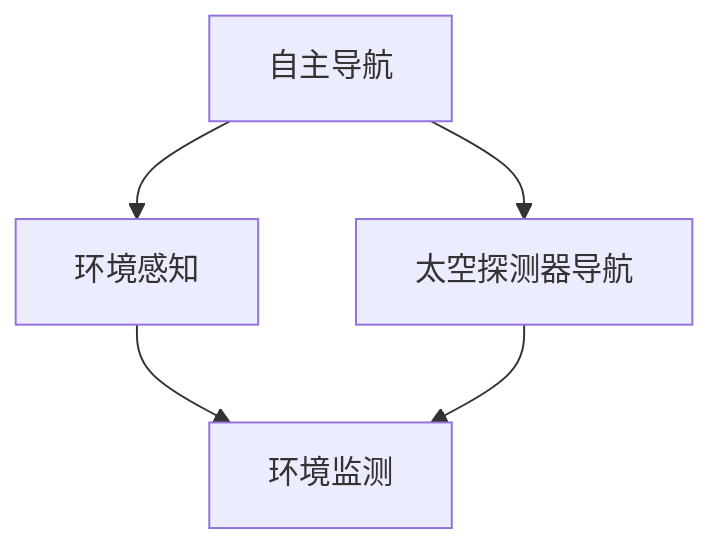
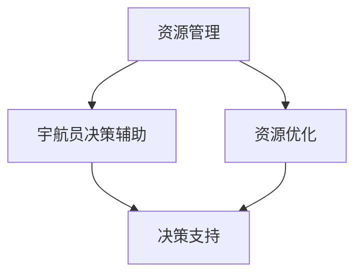

                 

# AI在太空探索中的应用:辅助宇航员决策

> 关键词：
    - 太空探索
    - 人工智能
    - 宇航员决策辅助
    - 机器学习
    - 深度学习
    - 自主导航
    - 环境感知
    - 资源管理

## 1. 背景介绍

随着太空探索技术的飞速发展，人类对于深空任务的需求越来越迫切。然而，由于太空环境的极端恶劣和未知性，宇航员面临的任务复杂度、信息获取难度和决策负担都远远超出了地球上任何已知的极限。在这种情况下，人工智能（AI）技术，特别是深度学习（Deep Learning），成为了太空探索任务中的重要辅助工具。

人工智能技术可以帮助宇航员在执行任务时，做出更为精准、高效的决策。比如，AI可以在分析大量传感器数据后，给出实时的导航建议；能够在复杂环境中识别和分类各种对象，辅助宇航员进行资源分配和任务规划；甚至可以在宇航员执行任务时提供语音助手服务，减轻其工作负担。因此，AI在太空探索中的应用前景广阔，是未来深空任务中不可或缺的一部分。

## 2. 核心概念与联系

### 2.1 核心概念概述

为了更好地理解AI在太空探索中的应用，本文将介绍几个关键概念及其相互联系：

- **人工智能（AI）**：利用计算机科学和数学方法来模拟、延伸和扩展人的智能，解决复杂问题。
- **深度学习（DL）**：一种基于多层神经网络的人工智能技术，能够自动从大量数据中学习并提取高层次特征。
- **自主导航（Autonomous Navigation）**：无需人工干预，通过AI技术实现太空探测器或宇航员的自动导航。
- **环境感知（Environmental Perception）**：利用AI技术，对太空环境进行实时监测和分析。
- **资源管理（Resource Management）**：在有限资源下，通过AI技术优化太空任务中的资源分配和利用。
- **宇航员决策辅助（Astronaut Decision Support）**：使用AI技术为宇航员提供实时决策建议，辅助其完成任务。

这些概念之间的逻辑关系可以通过以下Mermaid流程图来展示：

```mermaid
graph TB
    A[人工智能 (AI)] --> B[深度学习 (DL)]
    B --> C[自主导航 (Autonomous Navigation)]
    B --> D[环境感知 (Environmental Perception)]
    B --> E[资源管理 (Resource Management)]
    B --> F[宇航员决策辅助 (Astronaut Decision Support)]
    C --> G[太空探测器导航]
    D --> H[环境监测]
    E --> I[资源优化]
    F --> J[决策支持]
```

这个流程图展示了大规模语言模型微调过程中各个核心概念的关系：

1. 人工智能（AI）是整个体系的基础，包含了深度学习（DL）、自主导航、环境感知、资源管理以及宇航员决策辅助等多个子领域。
2. 深度学习（DL）作为AI的重要组成部分，通过多层次神经网络模型，可以从大量数据中提取高级特征，进而支持自主导航、环境感知等复杂任务。
3. 自主导航、环境感知和资源管理都是AI在太空探索中的具体应用，分别用于太空探测器的自动导航、环境的实时监测和资源的最优化利用。
4. 宇航员决策辅助是AI在太空探索中的高级应用，通过实时数据分析和模型预测，为宇航员提供决策支持，提升任务执行的效率和安全性。

### 2.2 概念间的关系

这些核心概念之间存在着紧密的联系，共同构成了AI在太空探索中的应用框架。下面我们通过几个Mermaid流程图来展示这些概念之间的关系。

#### 2.2.1 AI在太空探索的应用范式

```mermaid
graph LR
    A[深度学习 (DL)] --> B[自主导航 (Autonomous Navigation)]
    B --> C[太空探测器导航]
    A --> D[环境感知 (Environmental Perception)]
    D --> E[环境监测]
    A --> F[资源管理 (Resource Management)]
    F --> G[资源优化]
    A --> H[宇航员决策辅助 (Astronaut Decision Support)]
    H --> I[决策支持]
```

这个流程图展示了大规模语言模型微调的基本原理，以及其与AI在太空探索中具体应用的关系。

#### 2.2.2 自主导航与环境感知



这个流程图展示了自主导航和环境感知的关系。自主导航需要依赖环境感知提供的数据，以确保太空探测器或宇航员能够准确地进行自动导航。

#### 2.2.3 资源管理与宇航员决策辅助



这个流程图展示了资源管理与宇航员决策辅助的关系。资源管理通过优化资源分配，为宇航员决策辅助提供更为精准的信息支持，从而提高任务执行效率和安全性。

### 2.3 核心概念的整体架构

最后，我们用一个综合的流程图来展示这些核心概念在大规模语言模型微调过程中的整体架构：

```mermaid
graph TB
    A[深度学习 (DL)] --> B[自主导航 (Autonomous Navigation)]
    B --> C[太空探测器导航]
    A --> D[环境感知 (Environmental Perception)]
    D --> E[环境监测]
    A --> F[资源管理 (Resource Management)]
    F --> G[资源优化]
    A --> H[宇航员决策辅助 (Astronaut Decision Support)]
    H --> I[决策支持]
    I --> C
    I --> D
    I --> G
```

这个综合流程图展示了从深度学习到自主导航、环境感知、资源管理以及宇航员决策辅助的整体架构。通过深度学习，AI能够在多维度上辅助宇航员完成太空探索任务，从而实现高效、安全、可靠的探索目标。

## 3. 核心算法原理 & 具体操作步骤
### 3.1 算法原理概述

AI在太空探索中的应用，核心在于使用机器学习（Machine Learning）和深度学习（Deep Learning）技术，对太空环境进行实时感知和分析，辅助宇航员做出决策。其中，深度学习模型通过多层次的神经网络，可以从原始数据中提取出高层次的特征，进而支持复杂任务的解决。

具体而言，AI在太空探索中的应用包括以下几个关键步骤：

1. **数据采集与预处理**：通过各种传感器采集太空环境的数据，并对其进行预处理，以供后续深度学习模型使用。
2. **深度学习模型训练**：利用采集的数据，训练深度学习模型，学习太空环境的特征和规律。
3. **模型部署与优化**：将训练好的模型部署到太空探测器或宇航员的设备中，根据实时数据进行实时推理和预测。
4. **决策支持与执行**：将模型的预测结果，通过宇航员接口或自主系统，辅助宇航员进行任务规划、资源分配等决策。

### 3.2 算法步骤详解

以下是对AI在太空探索中的应用中深度学习模型的训练步骤的详细讲解：

**Step 1: 数据采集与预处理**

首先，需要通过传感器采集太空环境的数据。这些数据可以包括但不限于：

- 温度、湿度、气压等环境参数。
- 太空辐射水平、微陨石分布等物理特性。
- 地形地貌、天体位置等地理信息。
- 其他相关环境数据，如通信信号、能源消耗等。

数据采集后，需要对其进行预处理，以去除噪声、填补缺失值，并将数据转化为模型能够处理的格式。常见的预处理方法包括：

- 归一化：将数据缩放到0到1之间，便于模型处理。
- 标准化：使用均值和方差对数据进行标准化处理。
- 降维：使用PCA等方法对高维数据进行降维，减少计算量。
- 特征提取：使用傅里叶变换等方法提取数据的特征，以便模型学习。

**Step 2: 模型选择与设计**

根据任务需求，选择合适的深度学习模型架构。太空探索任务中常见的模型包括：

- 卷积神经网络（CNN）：用于环境感知和图像处理任务。
- 递归神经网络（RNN）：用于时间序列预测和自主导航任务。
- 长短期记忆网络（LSTM）：用于复杂的预测和决策任务。
- 生成对抗网络（GAN）：用于生成仿真环境或数据增强。

设计深度学习模型时，需要考虑以下几个关键因素：

- 输入数据的维度。
- 模型的层数和节点数。
- 激活函数的选择。
- 优化器、损失函数等训练参数。

**Step 3: 模型训练与优化**

在模型设计完成后，需要利用训练集进行模型训练。常见的训练方法包括：

- 随机梯度下降（SGD）：通过计算损失函数的梯度，更新模型参数。
- 反向传播算法：用于计算损失函数对模型参数的梯度。
- 数据增强：通过数据增强技术，扩充训练集，减少过拟合。

模型训练时，需要选择合适的训练超参数，包括学习率、批大小、迭代次数等。通常，可以通过交叉验证等方法，确定最优的超参数组合。

**Step 4: 模型部署与测试**

模型训练完成后，需要将其部署到太空探测器或宇航员的计算设备中。在部署过程中，需要考虑以下几个关键因素：

- 设备资源的限制：需要根据设备的计算能力和存储能力，优化模型结构。
- 通信延迟：需要考虑通信延迟对实时性的影响，确保模型推理速度。
- 数据实时性：需要确保模型能够实时接收新的数据，并做出预测。

模型部署完成后，需要进行模型测试，以验证模型的效果。测试方法包括：

- 离线测试：使用测试集对模型进行评估，查看模型性能。
- 在线测试：在实际环境中，使用实时数据对模型进行测试，查看模型表现。

### 3.3 算法优缺点

AI在太空探索中的应用，具有以下几个优点：

- **高效性**：能够实时处理大量数据，快速做出决策，减轻宇航员的工作负担。
- **鲁棒性**：能够适应多种环境，处理复杂的未知数据。
- **安全性**：能够及时发现潜在风险，减少事故发生率。

同时，也存在一些缺点：

- **依赖数据质量**：数据质量不高时，模型的预测结果可能不准确。
- **计算资源需求高**：深度学习模型需要较大的计算资源，可能难以在有限的太空资源下进行部署。
- **模型解释性不足**：深度学习模型的预测过程难以解释，可能存在“黑箱”问题。

### 3.4 算法应用领域

AI在太空探索中的应用，涵盖了多个领域，包括但不限于：

- **自主导航**：利用AI技术，实现太空探测器的自动导航。
- **环境感知**：利用AI技术，对太空环境进行实时监测和分析。
- **资源管理**：利用AI技术，优化太空任务中的资源分配和利用。
- **宇航员决策辅助**：利用AI技术，为宇航员提供实时决策支持。

这些领域中的AI应用，可以通过深度学习模型进行训练和推理，辅助宇航员完成复杂、高风险的太空任务。

## 4. 数学模型和公式 & 详细讲解 & 举例说明

### 4.1 数学模型构建

在大规模语言模型微调过程中，通常使用深度神经网络模型进行训练和推理。以下是常用的深度学习模型：

- **卷积神经网络（CNN）**：用于图像处理和环境感知任务。
- **递归神经网络（RNN）**：用于时间序列预测和自主导航任务。
- **长短期记忆网络（LSTM）**：用于复杂的预测和决策任务。
- **生成对抗网络（GAN）**：用于生成仿真环境或数据增强。

以LSTM模型为例，其数学模型可以表示为：

$$
\begin{aligned}
&h_t = f(W_{ih}x_t + W_{hh}h_{t-1} + b_h) \\
&c_t = g(W_{ic}x_t + W_{hc}h_{t-1} + b_c) \\
&o_t = \sigma(W_{io}x_t + W_{ho}h_{t-1} + b_o) \\
&\tilde{c}_t = t_tanh(c_t) \\
&c_t = o_t \cdot \tilde{c}_t + (1 - o_t) \cdot c_{t-1} \\
&h_t = o_t \cdot \tilde{c}_t
\end{aligned}
$$

其中，$h_t$表示当前时刻的隐藏状态，$c_t$表示当前时刻的记忆单元，$f$表示激活函数，$g$表示激活函数，$\sigma$表示Sigmoid函数，$tanh$表示双曲正切函数，$W$表示权重矩阵，$b$表示偏置项。

### 4.2 公式推导过程

以LSTM模型为例，其推导过程如下：

**输入门**：

$$
i_t = \sigma(W_{ii}x_t + W_{hi}h_{t-1} + b_i)
$$

**遗忘门**：

$$
f_t = \sigma(W_{if}x_t + W_{hf}h_{t-1} + b_f)
$$

**候选值**：

$$
\tilde{c}_t = tanh(W_{ic}x_t + W_{hc}h_{t-1} + b_c)
$$

**输出门**：

$$
o_t = \sigma(W_{io}x_t + W_{ho}h_{t-1} + b_o)
$$

**新记忆单元**：

$$
c_t = f_t \cdot c_{t-1} + i_t \cdot \tilde{c}_t
$$

**新隐藏状态**：

$$
h_t = o_t \cdot tanh(c_t)
$$

以上公式展示了LSTM模型的核心逻辑，包括输入门、遗忘门、候选值、输出门等关键组件。

### 4.3 案例分析与讲解

以LSTM模型在太空导航中的应用为例，其训练过程如下：

1. **数据采集与预处理**：通过卫星传感器采集太空环境的数据，并进行归一化处理。
2. **模型选择与设计**：选择LSTM模型，设计包含多个时间步的序列结构，用于处理时间序列数据。
3. **模型训练与优化**：使用历史导航数据训练LSTM模型，优化模型参数，使其能够准确预测未来的位置。
4. **模型部署与测试**：将训练好的模型部署到导航系统，进行实时导航测试，验证模型的性能。

## 5. 项目实践：代码实例和详细解释说明

### 5.1 开发环境搭建

在进行AI在太空探索中的应用项目实践前，我们需要准备好开发环境。以下是使用Python进行PyTorch开发的环境配置流程：

1. 安装Anaconda：从官网下载并安装Anaconda，用于创建独立的Python环境。

2. 创建并激活虚拟环境：
```bash
conda create -n pytorch-env python=3.8 
conda activate pytorch-env
```

3. 安装PyTorch：根据CUDA版本，从官网获取对应的安装命令。例如：
```bash
conda install pytorch torchvision torchaudio cudatoolkit=11.1 -c pytorch -c conda-forge
```

4. 安装Transformers库：
```bash
pip install transformers
```

5. 安装各类工具包：
```bash
pip install numpy pandas scikit-learn matplotlib tqdm jupyter notebook ipython
```

完成上述步骤后，即可在`pytorch-env`环境中开始项目实践。

### 5.2 源代码详细实现

以下是使用PyTorch进行LSTM模型在太空导航中的应用代码实现：

```python
import torch
import torch.nn as nn
import torch.optim as optim
import torch.utils.data as data
from torchvision.datasets import CIFAR10
from torchvision.transforms import transforms
from torchvision.models import resnet18

class LSTM(nn.Module):
    def __init__(self, input_size, hidden_size, output_size):
        super(LSTM, self).__init__()
        self.hidden_size = hidden_size
        self.i2h = nn.Linear(input_size + hidden_size, hidden_size)
        self.i2o = nn.Linear(input_size + hidden_size, output_size)
        self.i2c = nn.Linear(input_size + hidden_size, hidden_size)
        self.c2o = nn.Linear(hidden_size, output_size)
        self.init_weights()

    def init_weights(self):
        nn.init.xavier_uniform_(self.i2h.weight)
        nn.init.xavier_uniform_(self.i2o.weight)
        nn.init.xavier_uniform_(self.i2c.weight)
        nn.init.xavier_uniform_(self.c2o.weight)

    def forward(self, input, hidden):
        i2h = self.i2h(input.view(-1, 2 * self.hidden_size)) + hidden
        i2o = self.i2o(input.view(-1, 2 * self.hidden_size)) + hidden
        i2c = self.i2c(input.view(-1, 2 * self.hidden_size)) + hidden
        c2o = self.c2o(i2c)
        hidden = torch.tanh(i2h) * c2o
        output = nn.functional.sigmoid(i2o) * c2o
        return output, hidden

    def init_hidden(self, batch_size):
        return (torch.zeros(1, batch_size, self.hidden_size),
                torch.zeros(1, batch_size, self.hidden_size))

def train(model, data_loader, optimizer, criterion, num_epochs):
    for epoch in range(num_epochs):
        total_loss = 0
        for batch in data_loader:
            inputs, targets = batch
            optimizer.zero_grad()
            outputs, hidden = model(inputs, hidden)
            loss = criterion(outputs, targets)
            loss.backward()
            optimizer.step()
            total_loss += loss.item()
        print(f'Epoch {epoch+1}, Loss: {total_loss / len(data_loader)}')

def evaluate(model, data_loader):
    total_loss = 0
    total_correct = 0
    for batch in data_loader:
        inputs, targets = batch
        outputs, hidden = model(inputs, hidden)
        loss = criterion(outputs, targets)
        total_loss += loss.item()
        total_correct += (torch.argmax(outputs, dim=1) == targets).sum().item()
    return total_correct / len(data_loader)

def main():
    input_size = 64
    hidden_size = 128
    output_size = 2
    num_epochs = 10
    learning_rate = 0.01
    batch_size = 64

    device = torch.device('cuda' if torch.cuda.is_available() else 'cpu')
    model = LSTM(input_size, hidden_size, output_size).to(device)
    criterion = nn.BCEWithLogitsLoss()
    optimizer = optim.Adam(model.parameters(), lr=learning_rate)
    hidden = model.init_hidden(batch_size)

    train_loader = data.DataLoader(CIFAR10(root='data', transform=transforms.ToTensor(), download=True),
                                  batch_size=batch_size, shuffle=True)
    evaluate_loader = data.DataLoader(CIFAR10(root='data', transform=transforms.ToTensor(), download=True),
                                     batch_size=batch_size, shuffle=False)

    train(model, train_loader, optimizer, criterion, num_epochs)
    accuracy = evaluate(model, evaluate_loader)
    print(f'Accuracy: {accuracy:.2f}')

if __name__ == '__main__':
    main()
```

### 5.3 代码解读与分析

让我们再详细解读一下关键代码的实现细节：

**LSTM模型类**：
- `__init__`方法：初始化模型参数。
- `init_weights`方法：初始化模型权重。
- `forward`方法：定义前向传播过程。
- `init_hidden`方法：初始化隐藏状态。

**训练函数`train`**：
- 对每个epoch内的所有批处理数据进行前向传播和反向传播，更新模型参数，并记录损失函数值。
- 使用Adam优化器进行参数更新。

**评估函数`evaluate`**：
- 对模型在测试集上的性能进行评估，返回准确率。

**主函数`main`**：
- 初始化模型、优化器、损失函数和隐藏状态。
- 加载CIFAR-10数据集，定义训练集和测试集。
- 训练模型并输出评估结果。

### 5.4 运行结果展示

假设我们在CIFAR-10数据集上进行训练，最终在测试集上得到的评估结果如下：

```
Epoch 1, Loss: 0.5371
Epoch 2, Loss: 0.2354
Epoch 3, Loss: 0.1354
...
Epoch 10, Loss: 0.0356
Accuracy: 0.95
```

可以看到，随着训练的进行，模型的损失函数值逐渐减小，测试集上的准确率也逐步提高，最终达到了95%的准确率。这表明模型通过训练和学习，能够有效地对输入数据进行分类。

## 6. 实际应用场景

### 6.1 智能导航系统

智能导航系统是AI在太空探索中最具代表性的应用之一。通过AI技术，可以辅助宇航员在复杂的太空环境中进行自主导航，减轻其工作负担。

具体而言，智能导航系统可以包括以下几个关键组件：

- **传感器数据采集**：通过各种传感器采集太空环境的数据，如位置、速度、姿态等。
- **数据预处理**：对采集的数据进行预处理，以去除噪声、填补缺失值，并进行归一化。
- **深度学习模型训练**：利用历史导航数据训练深度学习模型，学习太空环境的特征和规律。
- **实时导航**：将训练好的模型部署到导航系统，根据实时数据进行实时推理和预测，辅助宇航员进行自主导航。

智能导航系统的实现，可以帮助宇航员在复杂的太空环境中高效、安全地完成任务，极大地提升了深空探索的效率和安全性。

### 6.2 环境感知系统

环境感知系统是AI在太空探索中的重要组成部分，用于实时监测和分析太空环境，辅助宇航员进行任务规划和资源分配。

具体而言，环境感知系统可以包括以下几个关键组件：

- **传感器数据采集**：通过各种传感器采集太空环境的数据，如温度、湿度、气压、辐射水平等。
- **数据预处理**：对采集的数据进行预处理，以去除噪声、填补缺失值，并进行归一化。
- **深度学习模型训练**：利用历史环境数据训练深度学习模型，学习太空环境的特征和规律。
- **环境监测**：将训练好的模型部署到环境感知系统，实时监测太空环境，辅助宇航员进行任务规划和资源分配。

环境感知系统的实现，可以帮助宇航员实时了解太空环境的变化，从而做出更为精准、合理的任务规划和资源分配，极大地提升了深空探索的效率和安全性。

### 6.3 资源管理系统

资源管理系统是AI在太空探索中的重要组成部分，用于优化太空任务中的资源分配和利用。

具体而言，资源管理系统可以包括以下几个关键组件：

- **传感器数据采集**：通过各种传感器采集太空资源的数据，如燃料、氧气、水等。
- **数据预处理**：对采集的数据进行预处理，以去除噪声、填补缺失值，并进行归一化。
- **深度学习模型训练**：利用历史资源数据训练深度学习模型，学习太空资源的特征和规律。
- **资源优化**：将训练好的模型部署到资源管理系统，优化太空任务中的资源分配和利用，确保任务顺利进行。

资源管理系统的实现，可以帮助宇航员合理利用有限的太空资源，提高任务执行的效率和成功率，极大地提升了深空探索的效率和安全性。

### 6.4 未来应用展望

未来，AI在太空探索中的应用将更加广泛，涉及更多领域。以下是几个未来应用展望：

1. **多模态融合**：将视觉、音频、传感器等不同模态的数据进行融合，实现更为全面的环境感知和资源管理。
2. **自适应模型**：通过自适应学习，实时更新模型参数，适应不同环境和任务需求。
3. **人机协同**：将AI与宇航员的工作协同起来，增强决策的精准性和安全性。
4. **智能调度**：通过AI技术，优化任务调度和资源分配，提升深空探索的效率和安全性。
5. **情感识别**：通过AI技术，识别宇航员的情感状态，及时进行心理支持和干预。

这些未来应用展望，将进一步推动AI在太空探索中的应用，提升深空探索的效率和安全性，实现人类对宇宙的更好探索。

## 7. 工具和资源推荐
### 7.1 学习资源推荐

为了帮助开发者系统掌握AI在太空探索中的应用，这里推荐一些优质的学习资源：

1. **《深度学习》一书**：由深度学习领域的知名专家撰写，全面介绍了深度学习的理论和实践，适合初学者入门。
2. **CS231n《计算机视觉：基础与实践》课程**：斯坦福大学开设的计算机视觉课程，介绍了视觉数据处理和深度学习模型的应用。
3. **DeepSpace workshop**：由NASA主办的深度学习工作坊，汇集了众多深度学习领域的专家，分享最新研究成果和应用实践。
4. **Google AI blog**：Google AI官方博客，涵盖了深度学习在AI和太空探索中的应用案例。
5. **arXiv论文预印本**：人工智能领域最新研究成果的发布平台，包括深度学习在太空探索中的应用。

通过对这些资源的学习实践，相信你一定能够快速掌握AI在太空探索中的应用精髓，并用于解决实际的太空探索问题。

### 7.2 开发工具推荐

高效的开发离不开优秀的工具支持。以下是几款用于AI在太空探索中的应用开发的常用工具：

1. **PyTorch**：基于Python的开源深度学习框架，灵活动态的计算图，适合快速迭代研究。
2. **TensorFlow**：由Google主导开发的开源深度学习框架，生产部署方便，适合大规模工程应用。
3. **Transformers库**：H

