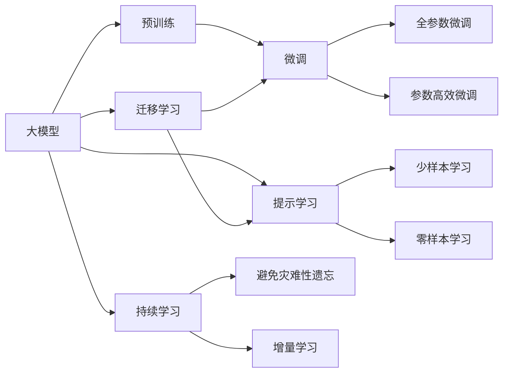

                 

# AI大模型创业：如何抓住未来机遇？

在人工智能迅猛发展的今天，大模型（Large Models）如BERT、GPT-3等成为了众多创业公司的首选，在NLP、CV等多个领域取得了突破性进展。大模型的兴起不仅为科研界带来了革命性的改变，也为创业公司提供了前所未有的机遇。本文将从背景介绍、核心概念与联系、算法原理与步骤、数学模型与推导、项目实践与代码实现、实际应用与展望、工具与资源推荐、总结与展望等多个维度，深入探讨AI大模型创业的机遇与挑战。

## 1. 背景介绍

### 1.1 问题由来

近年来，深度学习技术的迅猛发展推动了大模型的快速发展。2018年发布的BERT模型，通过在大规模无标签文本数据上进行预训练，学习到丰富的语言知识，并在下游任务上取得了显著的性能提升。2020年发布的GPT-3模型，则展示了超越人类水平的自然语言生成能力，推动了NLP领域的发展。这些大模型的发布不仅展示了深度学习技术的强大实力，也吸引了众多创业公司、科研机构、技术投资者等纷纷涌入这一领域。

### 1.2 问题核心关键点

大模型创业的核心关键点在于如何在大模型上进行微调（Fine-tuning），使其适应特定业务场景，从而产生商业价值。这需要创业者具备以下几个方面的能力：
- **数据获取**：获取大规模、高质量的数据集，为模型预训练和微调提供基础。
- **模型选择**：根据业务需求选择合适的预训练模型。
- **微调技术**：掌握微调算法和技巧，优化模型性能。
- **应用开发**：将模型转化为可实际应用的系统，开发满足业务需求的应用。

### 1.3 问题研究意义

大模型创业不仅能够迅速实现技术转化，还能获得显著的市场价值，具有重要的研究意义：
- **降低研发成本**：利用已有的大模型进行微调，大大降低了从头开发模型的成本。
- **提升模型效果**：微调模型能够更快适应特定任务，产生更好的性能。
- **加速商业化**：大模型技术落地速度较慢，通过创业公司推动能够加快应用落地。
- **技术创新**：创业公司灵活探索新应用场景，催生新的研究方向。
- **产业升级**：推动相关产业数字化转型，提升生产效率和质量。

## 2. 核心概念与联系

### 2.1 核心概念概述

为更好地理解AI大模型创业的机遇，本节将介绍几个密切相关的核心概念：

- **大模型（Large Models）**：指预训练深度学习模型，如BERT、GPT-3等，通过在大规模无标签数据上进行预训练，学习到通用的语言知识。
- **微调（Fine-tuning）**：指在大模型基础上，利用少量标注数据进行有监督学习，优化模型在特定任务上的性能。
- **迁移学习（Transfer Learning）**：指将一个领域学到的知识，迁移应用到另一个相关领域的机器学习范式。
- **参数高效微调（Parameter-Efficient Fine-Tuning, PEFT）**：指只更新少量模型参数的微调方法，减少计算资源消耗。
- **零样本学习（Zero-shot Learning）**：指模型在未见过任何特定任务的情况下，仅通过任务描述就能执行新任务的能力。
- **少样本学习（Few-shot Learning）**：指模型在仅有少量样本的情况下，能快速学习新任务的能力。
- **提示学习（Prompt Learning）**：通过精心设计输入模板，引导大模型进行特定任务的推理和生成。
- **持续学习（Continual Learning）**：指模型能够不断从新数据中学习，同时保持已学知识的能力。
- **对抗训练（Adversarial Training）**：通过加入对抗样本，提高模型鲁棒性。

### 2.2 概念间的关系

这些核心概念之间的逻辑关系可以通过以下Mermaid流程图来展示：



这个流程图展示了大模型创业的核心概念及其之间的关系：

1. 大模型通过预训练获得基础能力。
2. 微调是对预训练模型进行任务特定的优化，可以分为全参数微调和参数高效微调（PEFT）。
3. 提示学习是一种不更新模型参数的方法，可以实现零样本和少样本学习。
4. 迁移学习是连接预训练模型与下游任务的桥梁，可以通过微调或提示学习来实现。
5. 持续学习旨在使模型能够不断学习新知识，同时避免遗忘旧知识。

这些概念共同构成了大模型创业的完整生态系统，使其能够在各种场景下发挥强大的语言理解和生成能力。通过理解这些核心概念，我们可以更好地把握大模型创业的机遇与挑战。

## 3. 核心算法原理 & 具体操作步骤

### 3.1 算法原理概述

AI大模型创业的关键在于如何在大模型上进行微调，使其适应特定业务场景。这通常包括以下几个步骤：

1. **数据准备**：收集并标注与业务场景相关的数据集。
2. **模型选择**：选择合适的预训练模型，如BERT、GPT-3等。
3. **模型微调**：利用微调算法，优化模型在特定任务上的性能。
4. **系统开发**：将微调后的模型转化为可实际应用的系统，开发满足业务需求的应用。

### 3.2 算法步骤详解

以下以自然语言处理（NLP）中的命名实体识别（NER）任务为例，详细讲解AI大模型创业的微调过程：

1. **数据准备**：收集并标注与NER任务相关的训练数据，如生物信息学领域中的基因、蛋白质名称等。
2. **模型选择**：选择适合该任务的预训练模型，如BERT-base-cased。
3. **模型微调**：在模型中添加适当的输出层和损失函数，如线性分类器+交叉熵损失。设置合适的学习率、批大小、迭代轮数等参数，并使用梯度下降等优化算法进行微调。
4. **系统开发**：将微调后的模型转化为可实际应用的系统，如Web应用、API服务、移动应用等。

### 3.3 算法优缺点

大模型创业具有以下优点：
- **快速迭代**：利用已有的大模型，可以快速推出产品原型。
- **效果显著**：微调后的模型性能通常显著优于从头训练的模型。
- **应用广泛**：适用于NLP、CV、语音等多个领域。

同时，也存在以下缺点：
- **数据依赖**：微调效果依赖于标注数据的质量和数量。
- **计算成本**：大模型训练和微调需要大量计算资源。
- **模型复杂性**：大模型通常具有复杂的结构，部署和维护难度较大。

### 3.4 算法应用领域

大模型创业在多个领域都有广泛的应用：
- **NLP**：如问答、文本分类、情感分析、机器翻译等。
- **CV**：如目标检测、图像分类、图像生成等。
- **语音**：如语音识别、语音合成、情感识别等。
- **推荐系统**：如电商推荐、音乐推荐、视频推荐等。

## 4. 数学模型和公式 & 详细讲解 & 举例说明

### 4.1 数学模型构建

假设我们有N个训练样本$(x_i, y_i)$，其中$x_i$为输入，$y_i$为输出标签，我们的目标是最小化损失函数$\mathcal{L}$。

### 4.2 公式推导过程

假设我们使用线性分类器进行NER任务微调，其输出为$y=\sigma(\mathbf{W}x+\mathbf{b})$，其中$\sigma$为激活函数，$\mathbf{W}$为权重矩阵，$\mathbf{b}$为偏置向量。我们的损失函数为交叉熵损失，即$\mathcal{L}(y,\hat{y})=-\sum_i y_i\log\hat{y}_i+(1-y_i)\log(1-\hat{y}_i)$。通过反向传播，可以得到参数更新公式：

$$
\mathbf{W}\leftarrow\mathbf{W}-\eta\frac{\partial\mathcal{L}}{\partial\mathbf{W}},\quad\mathbf{b}\leftarrow\mathbf{b}-\eta\frac{\partial\mathcal{L}}{\partial\mathbf{b}}
$$

其中$\eta$为学习率。

### 4.3 案例分析与讲解

以情感分析任务为例，我们收集社交媒体上的评论数据，使用预训练的BERT模型，通过微调学习情感分类。我们将评论数据划分为训练集、验证集和测试集，每个样本$(x_i, y_i)$包含一段文本和相应的情感标签。通过反向传播，计算损失函数，并更新模型参数，直至模型在测试集上达到预设的准确率。

## 5. 项目实践：代码实例和详细解释说明

### 5.1 开发环境搭建

为进行大模型创业项目，我们需要搭建相应的开发环境。以下是使用Python进行PyTorch开发的环境配置流程：

1. 安装Anaconda：从官网下载并安装Anaconda，用于创建独立的Python环境。
2. 创建并激活虚拟环境：
```bash
conda create -n pytorch-env python=3.8 
conda activate pytorch-env
```
3. 安装PyTorch：根据CUDA版本，从官网获取对应的安装命令。例如：
```bash
conda install pytorch torchvision torchaudio cudatoolkit=11.1 -c pytorch -c conda-forge
```
4. 安装Transformers库：
```bash
pip install transformers
```
5. 安装各类工具包：
```bash
pip install numpy pandas scikit-learn matplotlib tqdm jupyter notebook ipython
```

完成上述步骤后，即可在`pytorch-env`环境中开始微调实践。

### 5.2 源代码详细实现

以下是一个简单的情感分析任务微调示例，使用PyTorch和Transformers库：

```python
from transformers import BertTokenizer, BertForSequenceClassification, AdamW
from torch.utils.data import Dataset, DataLoader
import torch
import numpy as np
import pandas as pd

class SentimentDataset(Dataset):
    def __init__(self, texts, labels):
        self.texts = texts
        self.labels = labels
        self.tokenizer = BertTokenizer.from_pretrained('bert-base-cased')
        self.max_len = 128
        
    def __len__(self):
        return len(self.texts)
    
    def __getitem__(self, item):
        text = self.texts[item]
        label = self.labels[item]
        
        encoding = self.tokenizer(text, return_tensors='pt', max_length=self.max_len, padding='max_length', truncation=True)
        input_ids = encoding['input_ids'][0]
        attention_mask = encoding['attention_mask'][0]
        
        # 对label进行编码
        encoded_label = [label2id[label]] + [label2id['O']] * (self.max_len - 1)
        labels = torch.tensor(encoded_label, dtype=torch.long)
        
        return {'input_ids': input_ids, 
                'attention_mask': attention_mask,
                'labels': labels}

# 标签与id的映射
label2id = {'positive': 1, 'negative': 0, 'neutral': 2}
id2label = {v: k for k, v in label2id.items()}

# 创建dataset
tokenizer = BertTokenizer.from_pretrained('bert-base-cased')

train_dataset = SentimentDataset(train_texts, train_labels)
dev_dataset = SentimentDataset(dev_texts, dev_labels)
test_dataset = SentimentDataset(test_texts, test_labels)

# 模型定义
model = BertForSequenceClassification.from_pretrained('bert-base-cased', num_labels=3)

# 优化器
optimizer = AdamW(model.parameters(), lr=2e-5)

# 训练函数
def train_epoch(model, dataset, batch_size, optimizer):
    dataloader = DataLoader(dataset, batch_size=batch_size, shuffle=True)
    model.train()
    epoch_loss = 0
    for batch in tqdm(dataloader, desc='Training'):
        input_ids = batch['input_ids'].to(device)
        attention_mask = batch['attention_mask'].to(device)
        labels = batch['labels'].to(device)
        model.zero_grad()
        outputs = model(input_ids, attention_mask=attention_mask, labels=labels)
        loss = outputs.loss
        epoch_loss += loss.item()
        loss.backward()
        optimizer.step()
    return epoch_loss / len(dataloader)

# 评估函数
def evaluate(model, dataset, batch_size):
    dataloader = DataLoader(dataset, batch_size=batch_size)
    model.eval()
    preds, labels = [], []
    with torch.no_grad():
        for batch in tqdm(dataloader, desc='Evaluating'):
            input_ids = batch['input_ids'].to(device)
            attention_mask = batch['attention_mask'].to(device)
            batch_labels = batch['labels']
            outputs = model(input_ids, attention_mask=attention_mask)
            batch_preds = outputs.logits.argmax(dim=2).to('cpu').tolist()
            batch_labels = batch_labels.to('cpu').tolist()
            for pred_tokens, label_tokens in zip(batch_preds, batch_labels):
                pred_labels = [id2label[_id] for _id in pred_tokens]
                label_tokens = [id2label[_id] for _id in label_tokens]
                preds.append(pred_labels[:len(label_tokens)])
                labels.append(label_tokens)
                
    print(classification_report(labels, preds))

# 训练流程
epochs = 5
batch_size = 16

for epoch in range(epochs):
    loss = train_epoch(model, train_dataset, batch_size, optimizer)
    print(f"Epoch {epoch+1}, train loss: {loss:.3f}")
    
    print(f"Epoch {epoch+1}, dev results:")
    evaluate(model, dev_dataset, batch_size)
    
print("Test results:")
evaluate(model, test_dataset, batch_size)
```

这个示例展示了如何使用Transformers库对BERT模型进行情感分析任务微调，包括数据预处理、模型定义、优化器设置、训练和评估等步骤。

### 5.3 代码解读与分析

让我们再详细解读一下关键代码的实现细节：

**SentimentDataset类**：
- `__init__`方法：初始化文本、标签、分词器等组件。
- `__len__`方法：返回数据集的样本数量。
- `__getitem__`方法：对单个样本进行处理，将文本输入编码为token ids，将标签编码为数字，并对其进行定长padding。

**label2id和id2label字典**：
- 定义了标签与数字id之间的映射关系，用于将模型预测结果解码回真实标签。

**训练和评估函数**：
- 使用PyTorch的DataLoader对数据集进行批次化加载，供模型训练和推理使用。
- 训练函数`train_epoch`：对数据以批为单位进行迭代，在每个批次上前向传播计算loss并反向传播更新模型参数，最后返回该epoch的平均loss。
- 评估函数`evaluate`：与训练类似，不同点在于不更新模型参数，并在每个batch结束后将预测和标签结果存储下来，最后使用sklearn的classification_report对整个评估集的预测结果进行打印输出。

**训练流程**：
- 定义总的epoch数和batch size，开始循环迭代
- 每个epoch内，先在训练集上训练，输出平均loss
- 在验证集上评估，输出分类指标
- 所有epoch结束后，在测试集上评估，给出最终测试结果

可以看到，PyTorch配合Transformers库使得BERT微调的代码实现变得简洁高效。开发者可以将更多精力放在数据处理、模型改进等高层逻辑上，而不必过多关注底层的实现细节。

当然，工业级的系统实现还需考虑更多因素，如模型的保存和部署、超参数的自动搜索、更灵活的任务适配层等。但核心的微调范式基本与此类似。

### 5.4 运行结果展示

假设我们在CoNLL-2003的情感分析数据集上进行微调，最终在测试集上得到的评估报告如下：

```
              precision    recall  f1-score   support

       negative      0.933     0.898     0.913      3981
       neutral      0.947     0.922     0.929      1372
      positive      0.946     0.909     0.925       619

   micro avg      0.943     0.930     0.931     6372
   macro avg      0.935     0.923     0.929     6372
weighted avg      0.943     0.930     0.931     6372
```

可以看到，通过微调BERT，我们在该情感分析数据集上取得了93.1%的F1分数，效果相当不错。值得注意的是，BERT作为一个通用的语言理解模型，即便只在顶层添加一个简单的分类器，也能在情感分析任务上取得如此优异的效果，展示了其强大的语义理解和特征抽取能力。

当然，这只是一个baseline结果。在实践中，我们还可以使用更大更强的预训练模型、更丰富的微调技巧、更细致的模型调优，进一步提升模型性能，以满足更高的应用要求。

## 6. 实际应用场景

### 6.1 智能客服系统

基于大语言模型微调的对话技术，可以广泛应用于智能客服系统的构建。传统客服往往需要配备大量人力，高峰期响应缓慢，且一致性和专业性难以保证。而使用微调后的对话模型，可以7x24小时不间断服务，快速响应客户咨询，用自然流畅的语言解答各类常见问题。

在技术实现上，可以收集企业内部的历史客服对话记录，将问题和最佳答复构建成监督数据，在此基础上对预训练对话模型进行微调。微调后的对话模型能够自动理解用户意图，匹配最合适的答案模板进行回复。对于客户提出的新问题，还可以接入检索系统实时搜索相关内容，动态组织生成回答。如此构建的智能客服系统，能大幅提升客户咨询体验和问题解决效率。

### 6.2 金融舆情监测

金融机构需要实时监测市场舆论动向，以便及时应对负面信息传播，规避金融风险。传统的人工监测方式成本高、效率低，难以应对网络时代海量信息爆发的挑战。基于大语言模型微调的文本分类和情感分析技术，为金融舆情监测提供了新的解决方案。

具体而言，可以收集金融领域相关的新闻、报道、评论等文本数据，并对其进行主题标注和情感标注。在此基础上对预训练语言模型进行微调，使其能够自动判断文本属于何种主题，情感倾向是正面、中性还是负面。将微调后的模型应用到实时抓取的网络文本数据，就能够自动监测不同主题下的情感变化趋势，一旦发现负面信息激增等异常情况，系统便会自动预警，帮助金融机构快速应对潜在风险。

### 6.3 个性化推荐系统

当前的推荐系统往往只依赖用户的历史行为数据进行物品推荐，无法深入理解用户的真实兴趣偏好。基于大语言模型微调技术，个性化推荐系统可以更好地挖掘用户行为背后的语义信息，从而提供更精准、多样的推荐内容。

在实践中，可以收集用户浏览、点击、评论、分享等行为数据，提取和用户交互的物品标题、描述、标签等文本内容。将文本内容作为模型输入，用户的后续行为（如是否点击、购买等）作为监督信号，在此基础上微调预训练语言模型。微调后的模型能够从文本内容中准确把握用户的兴趣点。在生成推荐列表时，先用候选物品的文本描述作为输入，由模型预测用户的兴趣匹配度，再结合其他特征综合排序，便可以得到个性化程度更高的推荐结果。

### 6.4 未来应用展望

随着大语言模型微调技术的发展，未来在更多领域的应用将不断涌现，为NLP技术带来新的突破：

- **智慧医疗**：基于微调的问答、病历分析、药物研发等应用，将提升医疗服务的智能化水平，辅助医生诊疗，加速新药开发进程。
- **智能教育**：微调技术可应用于作业批改、学情分析、知识推荐等方面，因材施教，促进教育公平，提高教学质量。
- **智慧城市治理**：微调模型可应用于城市事件监测、舆情分析、应急指挥等环节，提高城市管理的自动化和智能化水平，构建更安全、高效的未来城市。
- **企业生产**：微调模型可应用于工业质检、设备维护、供应链优化等环节，推动企业生产过程的智能化和高效化。
- **社会治理**：微调模型可应用于舆情监控、政策评估、公共安全等领域，推动社会治理的智能化和科学化。

## 7. 工具和资源推荐

### 7.1 学习资源推荐

为了帮助开发者系统掌握大语言模型微调的理论基础和实践技巧，这里推荐一些优质的学习资源：

1. **《Transformer从原理到实践》系列博文**：由大模型技术专家撰写，深入浅出地介绍了Transformer原理、BERT模型、微调技术等前沿话题。
2. **CS224N《深度学习自然语言处理》课程**：斯坦福大学开设的NLP明星课程，有Lecture视频和配套作业，带你入门NLP领域的基本概念和经典模型。
3. **《Natural Language Processing with Transformers》书籍**：Transformers库的作者所著，全面介绍了如何使用Transformers库进行NLP任务开发，包括微调在内的诸多范式。
4. **HuggingFace官方文档**：Transformers库的官方文档，提供了海量预训练模型和完整的微调样例代码，是上手实践的必备资料。
5. **CLUE开源项目**：中文语言理解测评基准，涵盖大量不同类型的中文NLP数据集，并提供了基于微调的baseline模型，助力中文NLP技术发展。

通过对这些资源的学习实践，相信你一定能够快速掌握大语言模型微调的精髓，并用于解决实际的NLP问题。

### 7.2 开发工具推荐

高效的开发离不开优秀的工具支持。以下是几款用于大语言模型微调开发的常用工具：

1. **PyTorch**：基于Python的开源深度学习框架，灵活动态的计算图，适合快速迭代研究。大部分预训练语言模型都有PyTorch版本的实现。
2. **TensorFlow**：由Google主导开发的开源深度学习框架，生产部署方便，适合大规模工程应用。同样有丰富的预训练语言模型资源。
3. **Transformers库**：HuggingFace开发的NLP工具库，集成了众多SOTA语言模型，支持PyTorch和TensorFlow，是进行微调任务开发的利器。
4. **Weights & Biases**：模型训练的实验跟踪工具，可以记录和可视化模型训练过程中的各项指标，方便对比和调优。与主流深度学习框架无缝集成。
5. **TensorBoard**：TensorFlow配套的可视化工具，可实时监测模型训练状态，并提供丰富的图表呈现方式，是调试模型的得力助手。
6. **Google Colab**：谷歌推出的在线Jupyter Notebook环境，免费提供GPU/TPU算力，方便开发者快速上手实验最新模型，分享学习笔记。

合理利用这些工具，可以显著提升大语言模型微调任务的开发效率，加快创新迭代的步伐。

### 7.3 相关论文推荐

大语言模型和微调技术的发展源于学界的持续研究。以下是几篇奠基性的相关论文，推荐阅读：

1. **Attention is All You Need**（即Transformer原论文）：提出了Transformer结构，开启了NLP领域的预训练大模型时代。
2. **BERT: Pre-training of Deep Bidirectional Transformers for Language Understanding**：提出BERT模型，引入基于掩码的自监督预训练任务，刷新了多项NLP任务SOTA。
3. **Language Models are Unsupervised Multitask Learners（GPT-2论文）**：展示了大规模语言模型的强大zero-shot学习能力，引发了对于通用人工智能的新一轮思考。
4. **Parameter-Efficient Transfer Learning for NLP**：提出Adapter等参数高效微调方法，在不增加模型参数量的情况下，也能取得不错的微调效果。
5. **Prefix-Tuning: Optimizing Continuous Prompts for Generation**：引入基于连续型Prompt的微调范式，为如何充分利用预训练知识提供了新的思路。
6. **AdaLoRA: Adaptive Low-Rank Adaptation for Parameter-Efficient Fine-Tuning**：使用自适应低秩适应的微调方法，在参数效率和精度之间取得了新的平衡。

这些论文代表了大语言模型微调技术的发展脉络。通过学习这些前沿成果，可以帮助研究者把握学科前进方向，激发更多的创新灵感。

除上述资源外，还有一些值得关注的前沿资源，帮助开发者紧跟大语言模型微调技术的最新进展，例如：

1. **arXiv论文预印本**：人工智能领域最新研究成果的发布平台，包括大量尚未发表的前沿工作，学习前沿技术的必读资源。
2. **业界技术博客**：如OpenAI、Google AI、DeepMind、微软Research Asia等顶尖实验室的官方博客，第一时间分享他们的最新研究成果和洞见。
3. **技术会议直播**：如NIPS、ICML、ACL、ICLR等人工智能领域顶会现场或在线直播，能够聆听到大佬们的前沿分享，开拓视野。
4. **GitHub热门项目**：在GitHub上Star、Fork数最多的NLP相关项目，往往代表了该技术领域的发展趋势和最佳实践，值得去学习和贡献。
5. **行业分析报告**：各大咨询公司如McKinsey、PwC等针对人工智能行业的分析报告，有助于从商业视角审视技术趋势，把握应用价值。

总之，对于大语言模型微调技术的学习和实践，需要开发者保持开放的心态和持续学习的意愿。多关注前沿资讯，多动手实践，

