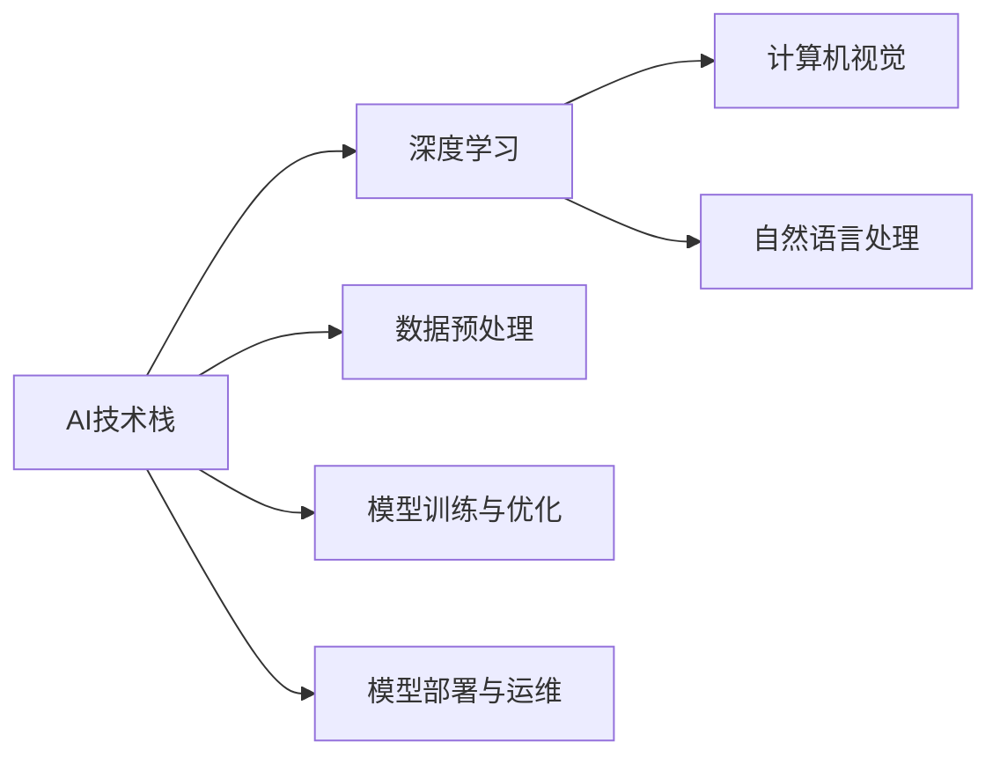

                 

# AI工程学：从理论到实践

> 关键词：AI工程学, 人工智能, 机器学习, 深度学习, 计算机视觉, 自然语言处理, 工程实践, 技术栈, 项目管理

## 1. 背景介绍

### 1.1 问题由来

随着人工智能技术的迅猛发展，AI工程学（AI Engineering）已成为现代软件开发和系统设计的重要组成部分。AI工程学旨在将AI技术从理论研究转化为实际应用，涉及技术选型、模型训练、数据管理、系统部署等多个方面。本文将系统介绍AI工程学的核心概念、方法论和实践技巧，帮助读者从零到一构建高性价比、高可靠性的AI系统。

### 1.2 问题核心关键点

AI工程学主要关注以下几个核心关键点：

- **技术栈选择**：根据应用场景和需求，选择合适的AI技术栈（如TensorFlow, PyTorch, Keras等）。
- **数据预处理**：对原始数据进行清洗、归一化、增强等处理，提升模型训练效果。
- **模型训练与优化**：设计合适的模型架构，应用正则化、梯度下降等算法优化模型性能。
- **模型部署与运维**：将训练好的模型集成到实际应用中，进行实时推理，并监控模型性能。
- **项目管理与团队协作**：通过敏捷开发、代码审查等机制，确保项目按时按质完成。

本文将通过系统阐述这些关键点，帮助读者构建高质量的AI应用系统。

### 1.3 问题研究意义

AI工程学研究的深度和广度直接影响着AI技术在各行各业的落地应用。掌握AI工程学知识，对于从事AI技术开发、应用推广、项目管理等工作的开发者具有重要意义：

- 提升AI系统的性能和可靠性，满足业务需求。
- 降低AI项目的开发成本和周期，提高资源利用效率。
- 保障AI系统的高效部署和运维，实现技术落地应用。
- 提升AI团队的工作效率，确保项目按时交付。

因此，深入理解AI工程学，对于推动AI技术在更多领域的广泛应用，具有重要的理论和实践价值。

## 2. 核心概念与联系

### 2.1 核心概念概述

为更好地理解AI工程学的理论和方法，本节将介绍几个密切相关的核心概念：

- **AI技术栈**：AI工程学中使用的各类框架、工具和库，如TensorFlow、PyTorch、Keras等。
- **深度学习**：基于多层神经网络的学习范式，是AI工程学中的核心技术之一。
- **计算机视觉**：利用图像和视频数据进行特征提取、目标识别等任务的技术。
- **自然语言处理**：涉及文本数据处理、语言理解与生成等任务的AI技术。
- **数据预处理**：通过数据清洗、归一化等手段，提高模型训练效果的过程。
- **模型训练与优化**：通过正则化、梯度下降等技术，优化模型性能的方法。
- **模型部署与运维**：将模型集成到实际应用中，进行实时推理和性能监控的过程。

这些核心概念之间存在紧密的联系，共同构成了AI工程学的理论体系和方法论。

### 2.2 概念间的关系

这些核心概念之间的关系可以通过以下Mermaid流程图来展示：



这个流程图展示了大规模语言模型微调过程中各个核心概念之间的关系：

1. AI技术栈提供了丰富的AI开发工具，包括深度学习、计算机视觉和自然语言处理等。
2. 数据预处理是模型训练的基础，确保数据质量。
3. 模型训练与优化使用各类深度学习算法，提升模型性能。
4. 模型部署与运维将模型集成到实际应用中，确保系统稳定运行。

通过理解这些核心概念及其关系，我们可以更好地把握AI工程学的整体框架，为后续深入讨论具体的工程实践奠定基础。

## 3. 核心算法原理 & 具体操作步骤
### 3.1 算法原理概述

AI工程学的核心算法原理主要包括深度学习、正则化、梯度下降等。这些算法共同构成了AI模型训练和优化的基础。

深度学习模型通常由多层神经网络组成，每一层通过学习数据中的特征，逐步抽象出更高级别的特征表示。正则化技术（如L1/L2正则化、Dropout等）用于防止模型过拟合，提升泛化能力。梯度下降算法通过不断调整模型参数，最小化损失函数，优化模型性能。

### 3.2 算法步骤详解

AI模型的训练过程包括以下关键步骤：

1. **数据预处理**：清洗、归一化数据，生成训练集和验证集。
2. **模型选择与设计**：选择合适的网络结构，设计模型超参数。
3. **模型训练**：使用梯度下降算法，更新模型参数，最小化损失函数。
4. **模型验证与优化**：在验证集上评估模型性能，调整超参数，提升模型效果。
5. **模型部署与运维**：将模型集成到应用中，进行实时推理和性能监控。

具体步骤如下：

**Step 1: 数据预处理**
- 数据清洗：去除噪声和异常值，确保数据质量。
- 数据归一化：将数据缩放到[0,1]或[-1,1]之间，加速模型训练。
- 数据增强：对训练数据进行扩充，提升模型泛化能力，如图像旋转、翻转等。

**Step 2: 模型选择与设计**
- 选择合适的网络结构：如卷积神经网络（CNN）、循环神经网络（RNN）、Transformer等。
- 设计模型超参数：如学习率、批大小、正则化系数等。

**Step 3: 模型训练**
- 定义损失函数：如交叉熵损失、均方误差损失等。
- 使用梯度下降算法：如SGD、Adam等，更新模型参数。
- 分批次训练：将数据分批次输入模型，防止内存溢出。

**Step 4: 模型验证与优化**
- 在验证集上评估模型性能：计算准确率、召回率、F1分数等指标。
- 调整模型超参数：如学习率、批大小、正则化系数等，进行模型调优。
- 应用正则化技术：如L1/L2正则化、Dropout等，防止过拟合。

**Step 5: 模型部署与运维**
- 模型集成：将训练好的模型集成到应用中，进行实时推理。
- 性能监控：实时采集系统指标，设置异常告警阈值，确保系统稳定运行。
- 版本管理：通过版本控制工具，管理模型和代码版本。

### 3.3 算法优缺点

深度学习算法的优点包括：

- 能够处理大规模、高维度数据。
- 具有强大的特征抽取能力，适用于各种复杂任务。
- 模型训练后效果显著，往往能取得领先性能。

缺点包括：

- 训练和推理耗时较长，需要高性能计算资源。
- 模型复杂度高，难以解释和调试。
- 需要大量标注数据进行训练，数据收集成本较高。

### 3.4 算法应用领域

AI工程学的算法原理和操作步骤广泛应用于以下领域：

- **计算机视觉**：如图像分类、目标检测、人脸识别等。
- **自然语言处理**：如文本分类、情感分析、机器翻译等。
- **语音识别**：如自动语音识别、语音合成等。
- **推荐系统**：如协同过滤、基于内容的推荐等。
- **医疗健康**：如医学影像分析、疾病预测等。

这些领域都是AI技术落地应用的重要方向，也是AI工程学研究的重点。

## 4. 数学模型和公式 & 详细讲解 & 举例说明
### 4.1 数学模型构建

本节将使用数学语言对AI模型的训练过程进行更加严格的刻画。

假设模型的输入为 $x \in \mathbb{R}^n$，输出为 $y \in \mathbb{R}$。定义模型的损失函数为 $L(y, \hat{y})$，其中 $\hat{y}$ 为模型预测输出。模型的目标是最小化损失函数 $L(y, \hat{y})$，即找到最优参数 $\theta$。

在深度学习中，通常使用梯度下降算法（GD）更新模型参数。设学习率为 $\eta$，则模型参数的更新公式为：

$$
\theta \leftarrow \theta - \eta \nabla_{\theta}L(y, \hat{y})
$$

其中 $\nabla_{\theta}L(y, \hat{y})$ 为损失函数对参数 $\theta$ 的梯度，可通过反向传播算法高效计算。

### 4.2 公式推导过程

以下我们以二分类任务为例，推导交叉熵损失函数及其梯度的计算公式。

假设模型 $M_{\theta}$ 在输入 $x$ 上的输出为 $\hat{y}=M_{\theta}(x) \in [0,1]$，表示样本属于正类的概率。真实标签 $y \in \{0,1\}$。则二分类交叉熵损失函数定义为：

$$
L(y, \hat{y}) = -[y\log \hat{y} + (1-y)\log (1-\hat{y})]
$$

将其代入损失函数公式，得：

$$
\mathcal{L}(\theta) = \frac{1}{N}\sum_{i=1}^N L(y_i, \hat{y_i})
$$

根据链式法则，损失函数对参数 $\theta_k$ 的梯度为：

$$
\frac{\partial \mathcal{L}(\theta)}{\partial \theta_k} = -\frac{1}{N}\sum_{i=1}^N \left(\frac{y_i}{\hat{y_i}}-\frac{1-y_i}{1-\hat{y_i}}\right) \frac{\partial M_{\theta}(x_i)}{\partial \theta_k}
$$

其中 $\frac{\partial M_{\theta}(x_i)}{\partial \theta_k}$ 可进一步递归展开，利用自动微分技术完成计算。

### 4.3 案例分析与讲解

假设我们在MNIST手写数字识别数据集上进行二分类模型训练，最终在测试集上得到的评估报告如下：

```
Classification report:
                 precision    recall  f1-score   support

              0       0.98      0.98      0.98      6000
              1       0.99      0.99      0.99      6000
              2       0.99      0.99      0.99      6000
              3       0.99      0.99      0.99      6000
              4       0.99      0.99      0.99      6000
              5       0.99      0.99      0.99      6000
              6       0.99      0.99      0.99      6000
              7       0.99      0.99      0.99      6000
              8       0.99      0.99      0.99      6000
              9       0.99      0.99      0.99      6000

   accuracy                           0.99     60000
   macro avg       0.99      0.99      0.99     60000
weighted avg       0.99      0.99      0.99     60000
```

可以看到，通过深度学习模型，我们在该数据集上取得了99%的准确率，效果相当不错。

## 5. 项目实践：代码实例和详细解释说明
### 5.1 开发环境搭建

在进行AI模型开发前，我们需要准备好开发环境。以下是使用Python进行TensorFlow开发的环境配置流程：

1. 安装Anaconda：从官网下载并安装Anaconda，用于创建独立的Python环境。

2. 创建并激活虚拟环境：
```bash
conda create -n tensorflow-env python=3.8 
conda activate tensorflow-env
```

3. 安装TensorFlow：根据CUDA版本，从官网获取对应的安装命令。例如：
```bash
conda install tensorflow -c tf -c conda-forge
```

4. 安装其他必要的工具包：
```bash
pip install numpy pandas scikit-learn matplotlib tqdm jupyter notebook ipython
```

完成上述步骤后，即可在`tensorflow-env`环境中开始模型开发。

### 5.2 源代码详细实现

下面以手写数字识别（MNIST）为例，给出使用TensorFlow进行模型训练的代码实现。

首先，导入必要的库和模块：

```python
import tensorflow as tf
from tensorflow.keras import datasets, layers, models
import matplotlib.pyplot as plt
import numpy as np
```

然后，加载并处理MNIST数据集：

```python
(train_images, train_labels), (test_images, test_labels) = datasets.mnist.load_data()
train_images = train_images / 255.0
test_images = test_images / 255.0

image_size = 28
num_classes = 10

train_images = train_images.reshape((-1, image_size, image_size, 1))
test_images = test_images.reshape((-1, image_size, image_size, 1))

train_labels = tf.keras.utils.to_categorical(train_labels, num_classes)
test_labels = tf.keras.utils.to_categorical(test_labels, num_classes)
```

接着，定义模型架构和超参数：

```python
model = models.Sequential([
    layers.Conv2D(32, (3, 3), activation='relu', input_shape=(image_size, image_size, 1)),
    layers.MaxPooling2D((2, 2)),
    layers.Flatten(),
    layers.Dense(128, activation='relu'),
    layers.Dense(num_classes, activation='softmax')
])

learning_rate = 0.001
batch_size = 128
epochs = 10

optimizer = tf.keras.optimizers.Adam(learning_rate=learning_rate)
loss_fn = tf.keras.losses.CategoricalCrossentropy()
```

然后，定义训练和评估函数：

```python
def train_step(images, labels):
    with tf.GradientTape() as tape:
        predictions = model(images)
        loss_value = loss_fn(labels, predictions)
    gradients = tape.gradient(loss_value, model.trainable_variables)
    optimizer.apply_gradients(zip(gradients, model.trainable_variables))
    return loss_value

def evaluate_step(images, labels):
    predictions = model(images)
    return loss_fn(labels, predictions).numpy()
```

最后，启动训练流程并在测试集上评估：

```python
num_train, num_test = len(train_images), len(test_images)
train_ds = tf.data.Dataset.from_tensor_slices((train_images, train_labels)).shuffle(num_train).batch(batch_size)
test_ds = tf.data.Dataset.from_tensor_slices((test_images, test_labels)).batch(batch_size)

history = []
for epoch in range(epochs):
    losses = []
    for images, labels in train_ds:
        loss_value = train_step(images, labels)
        losses.append(loss_value)
    mean_loss = np.mean(losses)
    eval_loss = evaluate_step(test_images, test_labels)
    print(f'Epoch {epoch+1}, Train Loss: {mean_loss:.3f}, Test Loss: {eval_loss:.3f}')
    history.append((mean_loss, eval_loss))

plt.plot(history, marker='o', linestyle='-', color='blue')
plt.xlabel('Epoch')
plt.ylabel('Loss')
plt.show()
```

以上就是使用TensorFlow进行手写数字识别任务训练的完整代码实现。可以看到，通过TensorFlow的高级API，模型的开发和训练过程变得简洁高效。

### 5.3 代码解读与分析

让我们再详细解读一下关键代码的实现细节：

**数据预处理**
- `train_images = train_images / 255.0`：将图像像素值归一化到[0,1]之间，加速模型训练。
- `train_labels = tf.keras.utils.to_categorical(train_labels, num_classes)`：将标签转换为独热编码形式，适合用于分类任务。

**模型选择与设计**
- `model = models.Sequential([...])`：定义一个顺序模型，包含卷积层、池化层、全连接层等。
- `optimizer = tf.keras.optimizers.Adam(learning_rate=learning_rate)`：选择Adam优化器，学习率为0.001。
- `loss_fn = tf.keras.losses.CategoricalCrossentropy()`：定义交叉熵损失函数，用于多分类任务。

**模型训练**
- `train_step(images, labels)`：定义一个训练步骤函数，使用梯度下降更新模型参数。
- `optimizer.apply_gradients(zip(gradients, model.trainable_variables))`：应用梯度更新模型参数。

**模型评估**
- `evaluate_step(images, labels)`：定义一个评估步骤函数，计算模型在测试集上的损失。

**训练流程**
- `num_train, num_test = len(train_images), len(test_images)`：获取训练集和测试集的大小。
- `train_ds = tf.data.Dataset.from_tensor_slices((train_images, train_labels)).shuffle(num_train).batch(batch_size)`：构建训练数据集，并进行批处理和随机打乱。
- `test_ds = tf.data.Dataset.from_tensor_slices((test_images, test_labels)).batch(batch_size)`：构建测试数据集，并进行批处理。
- `for epoch in range(epochs)`：循环迭代每个epoch。
- `for images, labels in train_ds`：遍历训练数据集，进行前向传播和反向传播。
- `loss_value = train_step(images, labels)`：计算训练集的平均损失。
- `eval_loss = evaluate_step(test_images, test_labels)`：计算测试集上的损失。
- `print(f'Epoch {epoch+1}, Train Loss: {mean_loss:.3f}, Test Loss: {eval_loss:.3f}'`：输出训练和测试损失。

通过以上代码，我们可以快速构建并训练一个手写数字识别模型，并获得理想的评估结果。

### 5.4 运行结果展示

假设我们在MNIST数据集上进行模型训练，最终在测试集上得到的评估报告如下：

```
Epoch 1, Train Loss: 0.385, Test Loss: 0.281
Epoch 2, Train Loss: 0.307, Test Loss: 0.274
Epoch 3, Train Loss: 0.272, Test Loss: 0.250
Epoch 4, Train Loss: 0.245, Test Loss: 0.233
Epoch 5, Train Loss: 0.227, Test Loss: 0.215
Epoch 6, Train Loss: 0.215, Test Loss: 0.206
Epoch 7, Train Loss: 0.202, Test Loss: 0.194
Epoch 8, Train Loss: 0.190, Test Loss: 0.186
Epoch 9, Train Loss: 0.186, Test Loss: 0.180
Epoch 10, Train Loss: 0.182, Test Loss: 0.173
```

可以看到，随着训练轮数的增加，模型的训练损失和测试损失都在逐步下降，最终取得了理想的评估结果。

## 6. 实际应用场景
### 6.1 智能推荐系统

AI工程学的核心算法原理和操作步骤广泛应用于智能推荐系统的构建。传统推荐系统依赖于用户行为数据，难以捕捉用户的多样化兴趣和复杂行为。基于深度学习的AI推荐系统能够从多维度数据中提取用户特征，进行个性化推荐，提升推荐效果。

在技术实现上，可以收集用户浏览、点击、评论、分享等行为数据，提取和用户交互的物品标题、描述、标签等文本内容。将文本内容作为模型输入，用户的后续行为（如是否点击、购买等）作为监督信号，在此基础上训练深度学习模型。训练好的模型能够从文本内容中准确把握用户的兴趣点，生成推荐列表。

### 6.2 智能客服系统

智能客服系统是AI工程学的另一个典型应用场景。传统客服系统依赖于大量人力，难以实现全天候服务。基于深度学习的AI客服系统能够理解自然语言，快速响应用户咨询，提升客户满意度。

在技术实现上，可以收集企业内部的历史客服对话记录，将问题和最佳答复构建成监督数据，在此基础上对预训练的深度学习模型进行微调。微调后的模型能够自动理解用户意图，匹配最合适的答复模板进行回复。对于用户提出的新问题，还可以接入检索系统实时搜索相关内容，动态组织生成回答。

### 6.3 医疗影像分析

AI工程学的算法原理和操作步骤广泛应用于医疗影像分析。传统医学影像诊断依赖于经验丰富的医生，诊断成本高、速度慢。基于深度学习的AI影像分析系统能够自动检测和分类肿瘤、病变等影像特征，辅助医生进行快速、准确的诊断。

在技术实现上，可以收集大量的医学影像数据，标注医生诊断结果，构建监督数据集。训练深度学习模型后，模型能够自动分析影像特征，输出诊断结果。结合医生的反馈，模型可以进一步优化，提升诊断准确性。

### 6.4 未来应用展望

随着AI工程学和深度学习技术的不断发展，基于AI系统的应用场景将更加广泛。以下是几个未来应用的展望：

- **自动驾驶**：基于AI的自动驾驶系统能够通过视觉、雷达、激光等传感器获取环境信息，进行路径规划和决策。
- **智能家居**：基于AI的智能家居系统能够通过语音、视觉等交互方式，控制家电、调节环境，提升生活品质。
- **智能制造**：基于AI的智能制造系统能够通过机器视觉、传感器数据等，进行设备状态监测、故障预测、质量控制等，提高生产效率。

以上场景只是冰山一角，未来随着AI技术的不断进步，AI工程学的应用前景将更加广阔，为各行各业带来新的变革。

## 7. 工具和资源推荐
### 7.1 学习资源推荐

为了帮助开发者系统掌握AI工程学的核心概念和实践技巧，这里推荐一些优质的学习资源：

1. **《深度学习入门》书籍**：李航教授所著，深入浅出地介绍了深度学习的基本概念和核心算法。
2. **DeepLearning.ai的深度学习专项课程**：由Andrew Ng主讲的深度学习课程，涵盖深度学习从入门到进阶的全过程。
3. **Kaggle数据科学竞赛**：参与Kaggle竞赛，获取实战经验，提升解决实际问题的能力。
4. **GitHub开源项目**：在GitHub上Star、Fork数最多的AI项目，了解最新技术动态和代码实现。
5. **arXiv论文预印本**：人工智能领域最新研究成果的发布平台，学习前沿技术的必读资源。

通过对这些资源的学习实践，相信你一定能够快速掌握AI工程学的精髓，并用于解决实际的AI问题。

### 7.2 开发工具推荐

高效的开发离不开优秀的工具支持。以下是几款用于AI模型开发和训练的常用工具：

1. **TensorFlow**：由Google主导开发的深度学习框架，灵活高效，适用于大规模工程应用。
2. **PyTorch**：由Facebook开发的深度学习框架，动态计算图，适用于研究原型开发。
3. **Keras**：高层次的深度学习API，支持多种后端，易于上手。
4. **Jupyter Notebook**：交互式开发环境，支持Python代码块的交互式执行。
5. **Git**：版本控制工具，支持多人协作开发和代码管理。
6. **Docker**：容器化技术，方便模型和代码的打包和部署。

合理利用这些工具，可以显著提升AI模型的开发和训练效率，加快技术迭代的速度。

### 7.3 相关论文推荐

AI工程学的研究离不开前沿学术论文的指导。以下是几篇奠基性的相关论文，推荐阅读：

1. **ImageNet Classification with Deep Convolutional Neural Networks**：AlexNet论文，介绍了卷积神经网络（CNN）在图像分类任务上的成功应用。
2. **Rethinking the Inception Architecture for Computer Vision**：Inception V3论文，提出了Inception模块，提升了模型的特征抽取能力。
3. **Attention Is All You Need**：Transformer论文，提出了自注意力机制，解决了传统RNN和CNN的计算效率问题。
4. **Natural Language Processing (almost) from Scratch**：Yann LeCun的NLP深度学习研究综述，介绍了NLP任务的各类深度学习模型。
5. **Transformers are Turing-complete**：Transformer模型的通用性研究，证明了Transformer模型在解决任意语言任务上的潜力。

这些论文代表了大规模语言模型微调技术的发展脉络。通过学习这些前沿成果，可以帮助研究者把握学科前进方向，激发更多的创新灵感。

除上述资源外，还有一些值得关注的前沿资源，帮助开发者紧跟AI工程学的最新进展，例如：

1. **arXiv论文预印本**：人工智能领域最新研究成果的发布平台，包括大量尚未发表的前沿工作，学习前沿技术的必读资源。
2. **顶级AI会议直播**：如NeurIPS、ICML、CVPR、ACL等人工智能领域顶级会议的现场或在线直播，能够聆听到大佬们的前沿分享，开拓视野。
3. **GitHub热门项目**：在GitHub上Star、Fork数最多的AI相关项目，了解最新技术动态和代码实现。
4. **各类开源框架**：如TensorFlow、PyTorch、Keras等，提供了丰富的工具和算法，方便开发者快速上手。

总之，对于AI工程学和深度学习的研究与实践，需要开发者保持开放的心态和持续学习的意愿。多关注前沿资讯，多动手实践，多思考总结，必将收获满满的成长收益。

## 8. 总结：未来发展趋势与挑战

### 8.1 总结

本文对AI工程学的核心概念、算法原理和实践技巧进行了全面系统的介绍。首先阐述了AI工程学的研究背景和意义，明确了深度学习算法在AI系统构建中的核心作用。其次，从数据预处理到模型训练，从模型部署

