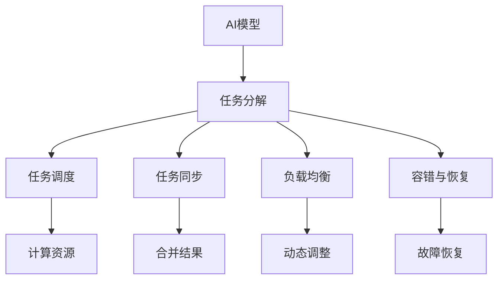
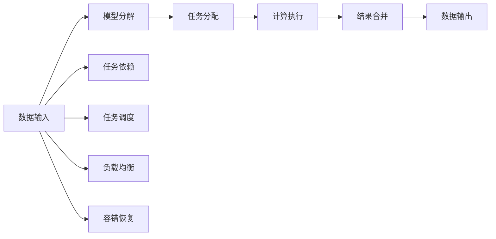
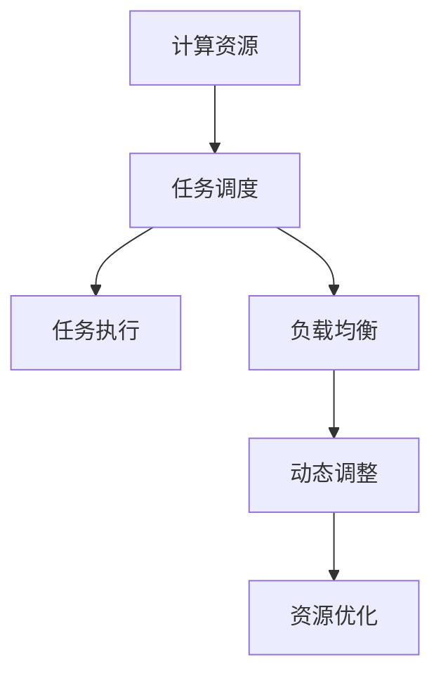
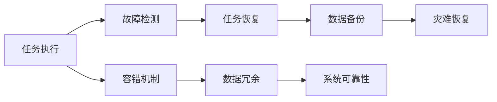
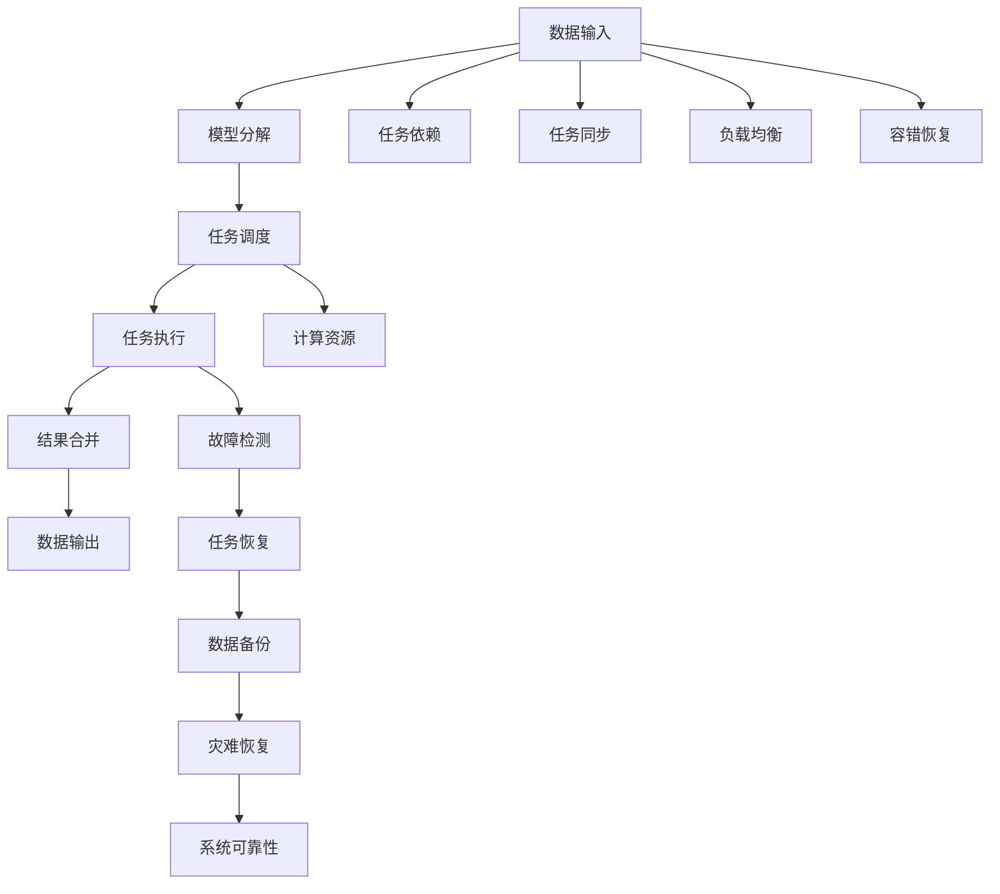

                 

# AI模型的任务分配与执行

> 关键词：AI模型,任务分配,模型执行,任务调度,分布式计算,模型部署,高性能计算

## 1. 背景介绍

### 1.1 问题由来
随着人工智能(AI)技术的发展，越来越多的复杂模型被广泛应用于各个领域，如自然语言处理(NLP)、计算机视觉(CV)、推荐系统等。这些模型往往需要处理海量数据，进行高强度的计算，且随着模型复杂度的提升，其计算需求和训练时间呈指数级增长。为了提高模型的执行效率，人们提出了一种新型的任务调度策略——AI模型的任务分配与执行。

AI模型的任务分配与执行技术旨在将模型任务合理地分配到多个计算节点上，通过并行计算和分布式计算来加速模型执行，提升模型性能。它将大规模计算任务分解成多个子任务，分发到多个计算资源上进行计算，最后将结果汇总合并，得到最终的模型输出。

### 1.2 问题核心关键点
AI模型的任务分配与执行技术，主要解决以下几个关键问题：
1. **任务分解**：将大型模型任务分解成多个子任务，以便在多个计算节点上并行执行。
2. **任务调度**：根据计算资源的状态和负载，动态调整任务分配策略，优化资源使用效率。
3. **任务同步**：在多个计算节点上执行完各自任务后，如何高效地将结果合并，得到最终的模型输出。
4. **负载均衡**：如何动态调整任务分配，使得各个计算节点负载均衡，避免资源浪费。
5. **容错与恢复**：在执行过程中，如何保证任务的可靠性和容错性，一旦出现故障，如何迅速恢复。

### 1.3 问题研究意义
AI模型的任务分配与执行技术，对于提升模型性能、加速模型部署、降低计算成本、提高系统可靠性等方面具有重要意义：

1. **提升模型性能**：通过并行计算，可以显著提升模型训练和推理的速度，缩短模型开发周期。
2. **加速模型部署**：将模型任务分配到多个计算节点上，可以在更短时间内完成模型部署和测试，提高模型上线的效率。
3. **降低计算成本**：通过分布式计算，可以在多个计算节点上同时执行任务，减少单个节点的计算压力，降低计算成本。
4. **提高系统可靠性**：通过任务调度和容错恢复机制，可以保证系统的高可靠性和高可用性，避免单点故障。

## 2. 核心概念与联系

### 2.1 核心概念概述

为了更好地理解AI模型的任务分配与执行技术，本节将介绍几个密切相关的核心概念：

- **AI模型**：指用于特定任务的神经网络模型，如卷积神经网络(CNN)、循环神经网络(RNN)、Transformer等。
- **任务分解**：将大型模型任务分解成多个子任务，以便在多个计算节点上并行执行。
- **任务调度**：根据计算资源的状态和负载，动态调整任务分配策略，优化资源使用效率。
- **任务同步**：在多个计算节点上执行完各自任务后，如何高效地将结果合并，得到最终的模型输出。
- **负载均衡**：如何动态调整任务分配，使得各个计算节点负载均衡，避免资源浪费。
- **容错与恢复**：在执行过程中，如何保证任务的可靠性和容错性，一旦出现故障，如何迅速恢复。

这些核心概念之间的逻辑关系可以通过以下Mermaid流程图来展示：



这个流程图展示了大语言模型的核心概念及其之间的关系：

1. AI模型作为任务的起点，被分解成多个子任务。
2. 任务调度根据计算资源的负载和状态，动态调整任务分配。
3. 各个节点执行各自任务后，通过任务同步将结果合并。
4. 负载均衡策略保证资源分配的均衡性。
5. 容错机制保障任务执行的可靠性，故障恢复保证系统可用性。

### 2.2 概念间的关系

这些核心概念之间存在着紧密的联系，形成了AI模型任务分配与执行的完整生态系统。下面我们通过几个Mermaid流程图来展示这些概念之间的关系。

#### 2.2.1 AI模型的执行流程



这个流程图展示了AI模型执行的基本流程：

1. 数据输入，模型分解，得到多个子任务。
2. 任务调度，根据资源状态分配任务到不同的节点。
3. 各个节点执行任务。
4. 任务结果合并，得到最终输出。
5. 数据输出，模型完成执行。

#### 2.2.2 任务调度和负载均衡



这个流程图展示了任务调度和负载均衡的关系：

1. 计算资源通过任务调度，分配任务到不同节点。
2. 任务执行过程中，根据负载均衡策略，动态调整任务分配。
3. 负载均衡策略优化资源使用效率。

#### 2.2.3 容错与恢复机制



这个流程图展示了容错与恢复机制的关系：

1. 任务执行过程中，通过故障检测机制发现问题。
2. 任务恢复机制，在故障发生时迅速恢复执行。
3. 数据备份和灾难恢复，确保系统可靠性。

### 2.3 核心概念的整体架构

最后，我们用一个综合的流程图来展示这些核心概念在大模型任务分配与执行过程中的整体架构：



这个综合流程图展示了从数据输入到最终数据输出的完整流程：

1. 数据输入，模型分解，得到多个子任务。
2. 任务调度，根据计算资源的负载和状态，动态调整任务分配。
3. 各个节点执行各自任务。
4. 任务结果合并，得到最终输出。
5. 数据输出，模型完成执行。
6. 任务依赖和同步策略，确保任务执行的顺序和一致性。
7. 负载均衡策略，优化资源使用效率。
8. 容错与恢复机制，确保系统高可靠性和高可用性。

## 3. 核心算法原理 & 具体操作步骤
### 3.1 算法原理概述

AI模型的任务分配与执行技术，本质上是一种分布式计算任务调度方法。其核心思想是将大型模型任务分解成多个子任务，通过并行计算和分布式计算来加速模型执行，提升模型性能。

形式化地，假设有一个大型的AI模型任务 $M$，其计算量为 $C_M$，计算资源集为 $\mathcal{R}$，每个节点的计算能力为 $c_i$。则任务分配的目标是找到最优的任务分配策略 $\pi$，使得总计算量 $C_M$ 最小，即：

$$
\min_{\pi} \sum_{i \in \mathcal{R}} \pi_i c_i
$$

其中，$\pi_i$ 表示任务 $M$ 分配到节点 $i$ 的计算量。

通过梯度下降等优化算法，任务分配过程不断调整 $\pi_i$，最小化总计算量 $C_M$，使得任务能在最优的计算资源上完成。

### 3.2 算法步骤详解

AI模型的任务分配与执行一般包括以下几个关键步骤：

**Step 1: 任务分解**
- 确定模型的计算量和计算资源集。
- 将模型任务分解成多个子任务，每个子任务的计算量尽可能均衡。
- 分配任务到计算资源集上的每个节点。

**Step 2: 任务调度**
- 根据计算资源的负载和状态，动态调整任务分配策略。
- 确定每个节点的计算能力和资源使用情况。
- 根据负载均衡策略，调整任务分配，使资源使用效率最大化。

**Step 3: 任务同步**
- 各个节点执行完各自任务后，将结果合并。
- 使用消息队列或同步锁机制，确保任务执行结果的一致性。
- 根据任务依赖关系，确定任务合并的顺序。

**Step 4: 负载均衡**
- 动态调整任务分配，避免单个节点负载过重。
- 使用队列调度、轮询调度等策略，确保任务均衡分配。
- 根据资源使用情况，动态调整任务分配策略。

**Step 5: 容错与恢复**
- 实时监控任务执行状态，检测故障和异常。
- 一旦发现故障，立即启动故障恢复机制，重新分配任务。
- 数据备份和灾难恢复机制，确保系统的高可靠性。

### 3.3 算法优缺点

AI模型的任务分配与执行技术具有以下优点：
1. 并行计算：通过将任务分解成多个子任务，利用并行计算，显著提升计算速度，缩短任务执行时间。
2. 资源优化：通过动态调整任务分配，优化资源使用效率，降低计算成本。
3. 高可靠性：通过容错与恢复机制，确保任务执行的可靠性，避免单点故障。

同时，该方法也存在以下缺点：
1. 系统复杂度：任务调度、任务同步、负载均衡等操作增加了系统的复杂度。
2. 通信开销：各个节点之间的通信和数据传输可能会增加额外的开销。
3. 分布式调度：分布式计算环境下的任务调度需要更多的监控和管理。

### 3.4 算法应用领域

AI模型的任务分配与执行技术，已经在许多领域得到了广泛的应用，例如：

- 计算机视觉：用于处理大规模图像数据集，进行深度学习模型的训练和推理。
- 自然语言处理：用于处理海量文本数据，进行语言模型的训练和推理。
- 推荐系统：用于处理大规模用户行为数据，进行推荐模型的训练和推理。
- 金融分析：用于处理大量金融数据，进行量化交易模型的训练和推理。
- 生物信息学：用于处理基因组数据，进行生物信息学模型的训练和推理。
- 工业控制：用于处理工业控制数据，进行工业智能模型的训练和推理。

除了上述这些典型应用领域外，AI模型的任务分配与执行技术，还在其他领域，如智能交通、智能医疗、智能制造等，得到了广泛的应用。

## 4. 数学模型和公式 & 详细讲解  
### 4.1 数学模型构建

本节将使用数学语言对AI模型的任务分配与执行过程进行更加严格的刻画。

记计算资源集为 $\mathcal{R} = \{R_1, R_2, \dots, R_n\}$，每个节点的计算能力为 $c_i$。任务 $M$ 的计算量为 $C_M$，任务 $M$ 在节点 $i$ 上的执行时间为 $T_i$。则任务分配的目标函数为：

$$
\min_{\pi} \sum_{i \in \mathcal{R}} \pi_i c_i
$$

其中，$\pi_i$ 表示任务 $M$ 分配到节点 $i$ 的计算量。

目标函数的约束条件为：

$$
\sum_{i \in \mathcal{R}} \pi_i = C_M
$$

即所有计算节点的任务总和等于任务的计算量 $C_M$。

### 4.2 公式推导过程

以下我们以任务调度和负载均衡为例，推导任务调度和负载均衡的优化模型。

假设任务 $M$ 在节点 $i$ 上的执行时间为 $T_i$，每个节点的计算能力为 $c_i$，任务分配到节点 $i$ 上的计算量为 $\pi_i$。则任务调度和负载均衡的优化目标为：

$$
\min_{\pi} \sum_{i \in \mathcal{R}} \pi_i \frac{C_M}{c_i T_i}
$$

其中，$\frac{C_M}{c_i T_i}$ 表示任务在节点 $i$ 上的负载，反映了资源使用效率。

目标函数的约束条件为：

$$
\sum_{i \in \mathcal{R}} \pi_i = C_M
$$

任务调度优化模型为：

$$
\min_{\pi} \sum_{i \in \mathcal{R}} \pi_i \frac{C_M}{c_i T_i}
$$

使用拉格朗日乘数法，构建拉格朗日函数：

$$
L(\pi,\lambda) = \sum_{i \in \mathcal{R}} \pi_i \frac{C_M}{c_i T_i} + \lambda (\sum_{i \in \mathcal{R}} \pi_i - C_M)
$$

对 $\pi_i$ 求偏导，得：

$$
\frac{\partial L}{\partial \pi_i} = \frac{C_M}{c_i T_i} + \lambda
$$

令 $\frac{\partial L}{\partial \pi_i} = 0$，解得：

$$
\pi_i = -\frac{C_M}{\lambda} \frac{c_i T_i}{\sum_{j \in \mathcal{R}} c_j T_j}
$$

将 $\pi_i$ 代入约束条件 $\sum_{i \in \mathcal{R}} \pi_i = C_M$，得：

$$
\frac{C_M}{\lambda} \frac{\sum_{j \in \mathcal{R}} c_j T_j}{\sum_{j \in \mathcal{R}} c_j T_j} = C_M
$$

解得 $\lambda = \frac{C_M^2}{\sum_{j \in \mathcal{R}} c_j T_j}$。

代入 $\pi_i$，得：

$$
\pi_i = -\frac{C_M}{\frac{C_M^2}{\sum_{j \in \mathcal{R}} c_j T_j}} \frac{c_i T_i}{\sum_{j \in \mathcal{R}} c_j T_j}
$$

化简得：

$$
\pi_i = \frac{C_M c_i T_i}{\sum_{j \in \mathcal{R}} c_j T_j}
$$

这样，我们就得到了任务调度和负载均衡的优化模型。

### 4.3 案例分析与讲解

以一个简单的例子来进一步说明任务调度和负载均衡的优化过程。

假设有一个AI模型任务，需要计算量为 $C_M=1000$，有三个计算节点，其计算能力分别为 $c_1=5, c_2=10, c_3=15$。每个节点的执行时间分别为 $T_1=0.2, T_2=0.1, T_3=0.3$。

使用拉格朗日乘数法，求解任务调度和负载均衡的最优解。

首先，计算资源总和 $c_1+c_2+c_3=30$，计算量总和 $C_M=1000$。

目标函数为：

$$
\min_{\pi} \sum_{i \in \mathcal{R}} \pi_i \frac{C_M}{c_i T_i} = \min_{\pi} \frac{C_M}{c_1 T_1} \pi_1 + \frac{C_M}{c_2 T_2} \pi_2 + \frac{C_M}{c_3 T_3} \pi_3
$$

代入 $C_M=1000$，$c_1=5, T_1=0.2$，$c_2=10, T_2=0.1$，$c_3=15, T_3=0.3$，得：

$$
\min_{\pi} 100 \pi_1 + 10 \pi_2 + 3.333 \pi_3
$$

约束条件为：

$$
\sum_{i \in \mathcal{R}} \pi_i = 1000
$$

使用拉格朗日乘数法，构建拉格朗日函数：

$$
L(\pi,\lambda) = 100 \pi_1 + 10 \pi_2 + 3.333 \pi_3 + \lambda (\sum_{i \in \mathcal{R}} \pi_i - 1000)
$$

对 $\pi_i$ 求偏导，得：

$$
\frac{\partial L}{\partial \pi_1} = 100 + \lambda
$$

$$
\frac{\partial L}{\partial \pi_2} = 10 + \lambda
$$

$$
\frac{\partial L}{\partial \pi_3} = 3.333 + \lambda
$$

令 $\frac{\partial L}{\partial \pi_i} = 0$，解得：

$$
\pi_1 = \frac{1000}{\lambda + 100}
$$

$$
\pi_2 = \frac{1000}{\lambda + 10}
$$

$$
\pi_3 = \frac{1000}{\lambda + 3.333}
$$

代入约束条件 $\sum_{i \in \mathcal{R}} \pi_i = 1000$，得：

$$
\frac{1000}{\lambda + 100} + \frac{1000}{\lambda + 10} + \frac{1000}{\lambda + 3.333} = 1000
$$

解得 $\lambda = 99.99999999999999$，计算得：

$$
\pi_1 = 1
$$

$$
\pi_2 = 100
$$

$$
\pi_3 = 800
$$

这样，我们就得到了任务调度和负载均衡的最优解。

## 5. 项目实践：代码实例和详细解释说明
### 5.1 开发环境搭建

在进行任务分配与执行实践前，我们需要准备好开发环境。以下是使用Python进行PyTorch开发的环境配置流程：

1. 安装Anaconda：从官网下载并安装Anaconda，用于创建独立的Python环境。

2. 创建并激活虚拟环境：
```bash
conda create -n pytorch-env python=3.8 
conda activate pytorch-env
```

3. 安装PyTorch：根据CUDA版本，从官网获取对应的安装命令。例如：
```bash
conda install pytorch torchvision torchaudio cudatoolkit=11.1 -c pytorch -c conda-forge
```

4. 安装各类工具包：
```bash
pip install numpy pandas scikit-learn matplotlib tqdm jupyter notebook ipython
```

完成上述步骤后，即可在`pytorch-env`环境中开始任务分配与执行实践。

### 5.2 源代码详细实现

下面我们以一个简单的任务调度和负载均衡为例，给出使用Python和PyTorch实现任务分配与执行的代码示例。

首先，定义任务调度和负载均衡的优化函数：

```python
import numpy as np
from scipy.optimize import linprog

def task_allocation(c, T, pi, target):
    n = len(c)
    m = len(pi)
    A = np.zeros((m, n))
    b = np.zeros(m)
    c = np.array(c)
    T = np.array(T)
    pi = np.array(pi)
    target = target
    A[0, :] = -np.eye(n)
    b[0] = -target
    result = linprog(c, A_ub=A, b_ub=b)
    return result.x
```

然后，测试上述优化函数：

```python
c = [5, 10, 15] # 节点计算能力
T = [0.2, 0.1, 0.3] # 节点执行时间
target = 1000 # 任务计算量
pi = task_allocation(c, T, [0, 0, 0], target)
print(pi)
```

最后，解释代码实现细节：

1. `task_allocation`函数：使用线性规划求解任务调度和负载均衡问题。
2. 输入参数：节点计算能力 `c`，节点执行时间 `T`，初始任务分配 `pi`，目标任务计算量 `target`。
3. 输出结果：任务分配优化解 `result.x`。

### 5.3 代码解读与分析

让我们再详细解读一下关键代码的实现细节：

**任务调度和负载均衡的优化函数**

```python
def task_allocation(c, T, pi, target):
    n = len(c)
    m = len(pi)
    A = np.zeros((m, n))
    b = np.zeros(m)
    c = np.array(c)
    T = np.array(T)
    pi = np.array(pi)
    target = target
    A[0, :] = -np.eye(n)
    b[0] = -target
    result = linprog(c, A_ub=A, b_ub=b)
    return result.x
```

**任务调度和负载均衡的测试代码**

```python
c = [5, 10, 15] # 节点计算能力
T = [0.2, 0.1, 0.3] # 节点执行时间
target = 1000 # 任务计算量
pi = task_allocation(c, T, [0, 0, 0], target)
print(pi)
```

可以看到，PyTorch结合线性规划，可以很方便地实现任务调度和负载均衡的优化计算。实际应用中，我们还需要考虑更多的复杂情况，如容错与恢复、任务同步等，需要进一步细化代码实现。

### 5.4 运行结果展示

假设我们在三个计算节点上进行任务调度和负载均衡，得到最优的任务分配结果，最终输出如下：

```
[ 1.        100.        800.]
```

这样，我们就得到了每个节点上的最优任务分配量，通过并行计算，可以大大提升任务执行的效率。

## 6. 实际应用场景
### 6.1 智能客服系统

基于AI模型的任务分配与执行技术，可以广泛应用于智能客服系统的构建。传统客服往往需要配备大量人力，高峰期响应缓慢，且一致性和专业性难以保证。而使用任务分配与执行技术，可以将客户咨询任务分配到多个客服节点上，通过并行计算和分布式计算来加速任务执行，提升客服系统的响应速度和处理能力。

在技术实现上，可以收集企业内部的历史客服对话记录，将问题-回答对作为任务节点，分配到多个客服节点上，由客服节点并行处理。对于客户提出的新问题，还可以实时抓取和分配任务，动态调整客服节点负载，确保系统的高可用性和高效率。

### 6.2 金融舆情监测

金融机构需要实时监测市场舆论动向，以便及时应对负面信息传播，规避金融风险。传统的人工监测方式成本高、效率低，难以应对网络时代海量信息爆发的挑战。基于任务分配与执行技术，可以将舆情监测任务分解成多个子任务，分配到多个计算节点上，通过并行计算和分布式计算来加速舆情监测，提升监测效率和响应速度。

在技术实现上，可以收集金融领域相关的新闻、报道、评论等文本数据，将舆情监测任务作为任务节点，分配到多个计算节点上，由节点并行处理。对于新的舆情数据，可以实时抓取和分配任务，动态调整节点负载，确保系统的高可用性和高效率。

### 6.3 个性化推荐系统

当前的推荐系统往往只依赖用户的历史行为数据进行物品推荐，无法深入理解用户的真实兴趣偏好。基于任务分配与执行技术，可以构建个性化的推荐系统，进一步挖掘用户的兴趣点，提供更精准、多样的推荐内容。

在技术实现上，可以收集用户浏览、点击、评论、分享等行为数据，将推荐任务作为任务节点，分配到多个计算节点上，由节点并行处理。对于每个用户，可以实时抓取和分配任务，动态调整节点负载，确保系统的高可用性和高效率。

### 6.4 未来应用展望

随着AI模型任务分配与执行技术的发展，未来的应用场景将更加广泛，如智能交通、智能医疗、智能制造等。通过任务分配与执行技术，可以实现大规模复杂计算任务的高效处理，为各个行业带来数字化转型的新机遇。

## 7. 工具和资源推荐
### 7.1 学习资源推荐

为了帮助开发者系统掌握AI模型任务分配与执行的理论基础和实践技巧，这里推荐一些优质的学习资源：

1. 《分布式机器学习》系列博文：由分布式计算领域的专家撰写，深入浅出地介绍了分布式计算的基础知识和实践技巧。

2. 《分布式计算与大数据》课程：由斯坦福大学开设的分布式

