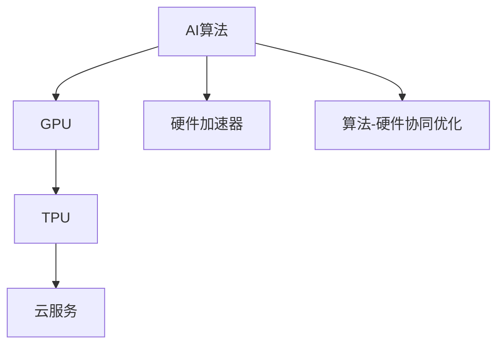
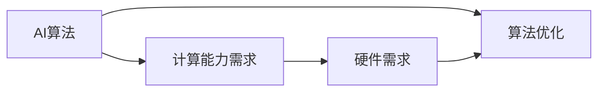
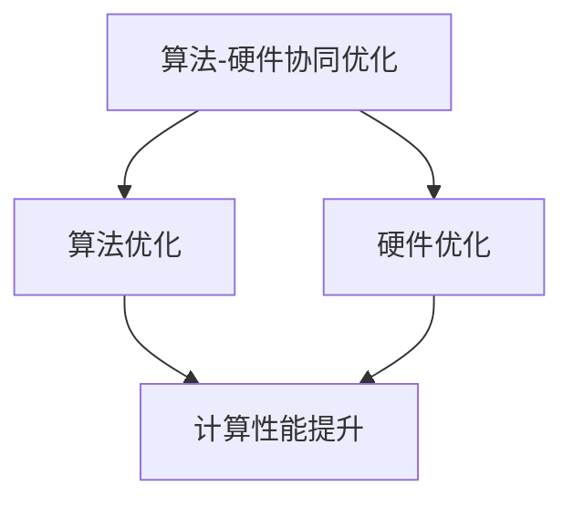
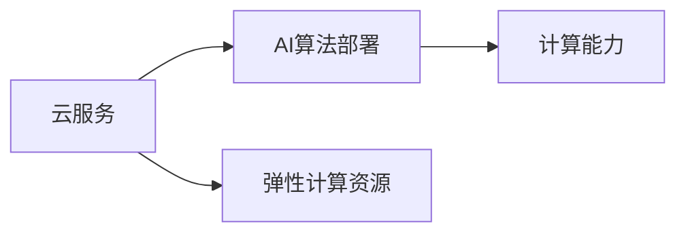
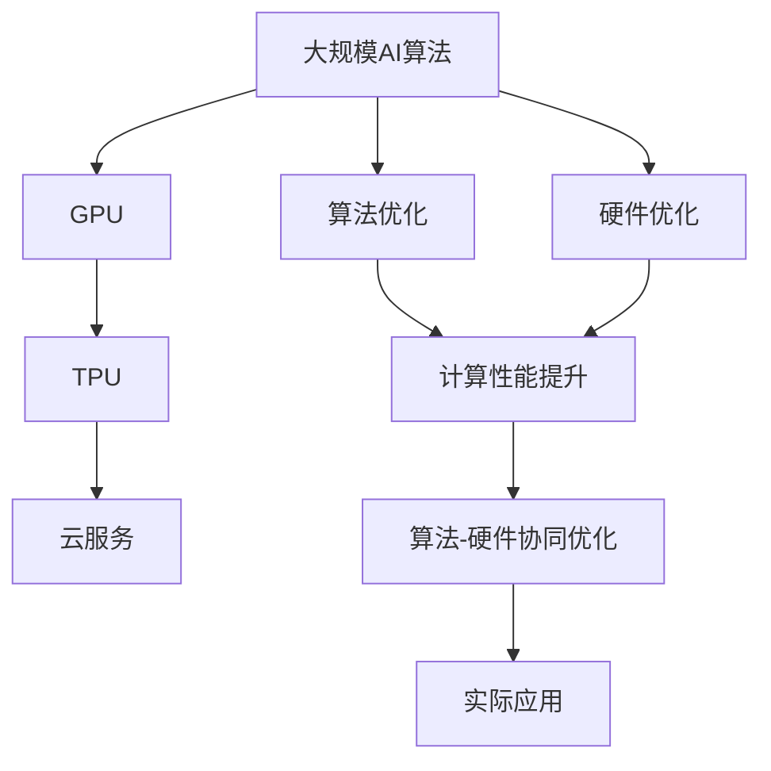

                 

## 1. 背景介绍

随着人工智能（AI）技术的不断发展，算法的进步和硬件的演进呈现出一种相互促进的关系。AI算法通过复杂的计算和推理过程来解决问题，而硬件则是这些算法的执行平台。随着AI算法的不断创新和优化，硬件也在不断升级和扩展以适应新的计算需求。这种算法与硬件的共同演进，推动了AI技术的飞速进步和广泛应用。

### 1.1 问题由来

AI算法的核心在于复杂的数据处理和模型训练，这些过程需要大量的计算资源和时间。在早期，由于计算能力的限制，AI算法的发展受到了很大的制约。然而，随着计算硬件的发展，如GPU、TPU等专用加速器，以及云服务的普及，AI算法得以在更短的时间内处理更多数据，进行更复杂的计算。这不仅加速了算法的迭代和优化，也推动了AI技术在更多领域的应用。

### 1.2 问题核心关键点

AI算法与硬件的共同演进主要体现在以下几个方面：

- **算法优化**：算法设计逐渐向着更高效、更准确的方向发展，以适应不断增长的计算能力。
- **硬件升级**：专用加速器如GPU、TPU等硬件设备的引入，极大地提升了计算效率，支持了更复杂和更大规模的AI算法。
- **算法-硬件协同优化**：为了最大化算法和硬件的性能，研究者在算法设计、硬件架构和系统优化方面进行协同优化，以实现最优的计算和存储性能。
- **云服务支持**：云服务的发展使得AI算法能够快速部署和扩展，同时降低了硬件成本。

这些关键点共同构成了AI算法与硬件演进的总体框架，推动了AI技术在各个领域的应用和普及。

### 1.3 问题研究意义

研究AI算法与硬件的共同演进，对于推动AI技术的进步和应用具有重要意义：

- **提高计算效率**：通过算法和硬件的协同优化，可以在更短的时间内完成更多的计算任务，提高AI系统的响应速度。
- **降低成本**：硬件升级和云服务支持使得大规模AI应用的成本大幅降低，使得更多的企业和组织能够采用AI技术。
- **促进创新**：硬件和算法的发展相辅相成，硬件的提升为算法提供了更广阔的应用空间，而算法的创新也推动了硬件的发展和应用。
- **扩展应用场景**：AI算法与硬件的共同演进，使得AI技术在更多领域得到了应用，如医疗、金融、教育等，推动了社会进步和经济发展。

## 2. 核心概念与联系

### 2.1 核心概念概述

为了更好地理解AI算法与硬件的共同演进，本节将介绍几个密切相关的核心概念：

- **AI算法**：包括机器学习、深度学习、强化学习等，用于解决特定问题的计算方法和模型。
- **硬件加速器**：如GPU、TPU等，专门为AI计算设计的加速器，能够大幅提升计算效率。
- **算法-硬件协同优化**：通过算法和硬件的协同设计，优化系统性能，提高计算效率。
- **云服务**：通过云计算平台提供的软硬件资源，支持大规模AI应用的部署和扩展。

这些核心概念之间的逻辑关系可以通过以下Mermaid流程图来展示：



这个流程图展示了大规模AI算法与硬件加速器、云服务、算法-硬件协同优化之间的逻辑关系。

### 2.2 概念间的关系

这些核心概念之间存在着紧密的联系，形成了AI算法与硬件演进的完整生态系统。下面我通过几个Mermaid流程图来展示这些概念之间的关系。

#### 2.2.1 AI算法的发展与硬件需求



这个流程图展示了AI算法的发展对硬件的需求，以及硬件的提升对算法优化的推动作用。

#### 2.2.2 算法-硬件协同优化方法



这个流程图展示了算法和硬件的协同优化方法，以及这种方法对计算性能提升的作用。

#### 2.2.3 云服务与AI算法的部署



这个流程图展示了云服务对AI算法部署的支持，以及云服务的弹性资源对计算能力的影响。

### 2.3 核心概念的整体架构

最后，我们用一个综合的流程图来展示这些核心概念在大规模AI算法与硬件演进过程中的整体架构：



这个综合流程图展示了从大规模AI算法到实际应用的整个演进过程，以及算法与硬件的协同优化。

## 3. 核心算法原理 & 具体操作步骤

### 3.1 算法原理概述

AI算法与硬件的共同演进，核心在于算法的设计和优化，以及硬件加速器的引入和应用。具体来说，AI算法的核心在于：

- **数据预处理**：将原始数据转化为适合算法处理的格式，如特征提取、数据标准化等。
- **模型训练**：通过反向传播等方法，更新模型参数，使模型能够更好地拟合数据。
- **模型推理**：使用训练好的模型对新数据进行推理和预测。

硬件加速器，如GPU和TPU，则是通过并行计算和特殊指令集，大幅提升了计算效率。具体来说，GPU通过SIMD指令集和并行计算，能够同时处理多个数据流；而TPU则通过专门设计的矩阵计算和激活函数加速，能够大幅提高深度神经网络的计算效率。

### 3.2 算法步骤详解

基于AI算法与硬件的共同演进，以下是详细步骤：

#### 3.2.1 数据预处理

数据预处理是AI算法的一个重要步骤，包括以下几个关键步骤：

- **数据收集与清洗**：收集并清洗原始数据，去除噪声和错误。
- **数据标准化**：将数据转化为适合算法处理的标准格式，如归一化、标准化等。
- **特征提取**：从原始数据中提取有意义的特征，以便算法使用。

#### 3.2.2 模型训练

模型训练是AI算法的核心步骤，包括以下几个关键步骤：

- **模型选择**：选择合适的算法模型，如神经网络、决策树、支持向量机等。
- **初始化参数**：对模型参数进行初始化，通常使用随机初始化或预训练权重。
- **训练循环**：通过反向传播等方法，不断更新模型参数，以最小化损失函数。
- **验证集验证**：在验证集上评估模型性能，防止过拟合。
- **测试集评估**：在测试集上评估模型性能，评估模型泛化能力。

#### 3.2.3 模型推理

模型推理是AI算法的重要应用，包括以下几个关键步骤：

- **输入数据处理**：将新数据转化为适合模型推理的格式。
- **前向传播**：将输入数据通过模型计算，得到预测结果。
- **结果输出**：将预测结果转化为最终输出，如分类结果、预测值等。

#### 3.2.4 硬件加速器

硬件加速器，如GPU和TPU，在AI算法训练和推理过程中发挥了重要作用：

- **GPU加速**：通过并行计算和SIMD指令集，GPU能够大幅提升计算效率。
- **TPU加速**：通过专门设计的矩阵计算和激活函数加速，TPU能够大幅提高深度神经网络的计算效率。
- **混合计算**：GPU和TPU可以混合使用，以平衡计算效率和硬件成本。

### 3.3 算法优缺点

基于AI算法与硬件的共同演进，以下是算法的优缺点：

#### 3.3.1 优点

- **高效计算**：通过硬件加速器，AI算法能够高效处理大规模数据，提升计算速度。
- **模型优化**：通过算法-硬件协同优化，可以实现最优的计算和存储性能，提高模型效果。
- **适用范围广**：AI算法可以应用于多个领域，如医疗、金融、教育等，推动社会进步。

#### 3.3.2 缺点

- **资源需求高**：大规模AI算法需要大量计算资源，硬件成本较高。
- **模型复杂**：AI算法模型设计复杂，需要大量数据和计算资源。
- **算法可解释性**：部分AI算法模型存在"黑盒"问题，难以解释其内部工作机制。

### 3.4 算法应用领域

基于AI算法与硬件的共同演进，AI算法已经被广泛应用于多个领域：

- **医疗**：通过深度学习算法，AI可以辅助诊断疾病、制定治疗方案等。
- **金融**：通过机器学习算法，AI可以风险评估、欺诈检测等。
- **教育**：通过自然语言处理算法，AI可以辅助教学、个性化推荐等。
- **制造**：通过强化学习算法，AI可以优化生产流程、提高生产效率等。
- **零售**：通过推荐算法，AI可以个性化推荐商品、优化库存等。

## 4. 数学模型和公式 & 详细讲解 & 举例说明

### 4.1 数学模型构建

在本节中，我们将使用数学语言对AI算法与硬件的共同演进进行更严格的刻画。

假设AI算法模型为 $f(x;w)$，其中 $x$ 为输入数据，$w$ 为模型参数。目标函数为 $L(w)$，表示模型对训练数据的拟合程度。硬件加速器 $h$ 的计算能力为 $C(h)$，单位为计算单位/秒。

模型训练的目标是最小化目标函数 $L(w)$，即：

$$
\min_{w} L(w)
$$

为了实现这一目标，通常采用梯度下降等优化算法，通过反向传播计算梯度，更新模型参数 $w$。硬件加速器通过并行计算和特殊指令集，提升计算效率。具体来说，硬件加速器的计算能力 $C(h)$ 可以通过以下公式表示：

$$
C(h) = C_{\text{basic}} + k \cdot C_{\text{special}}
$$

其中，$C_{\text{basic}}$ 为基本计算能力，$k$ 为加速器的并行度，$C_{\text{special}}$ 为加速器在特殊计算上的额外提升。

### 4.2 公式推导过程

以下我们以深度学习模型为例，推导梯度下降算法的计算过程。

假设深度学习模型为 $f(x;w) = W_1 \sigma(W_2 x + b_2) + b_1$，其中 $\sigma$ 为激活函数。目标函数 $L(w)$ 为均方误差，即：

$$
L(w) = \frac{1}{N} \sum_{i=1}^N (y_i - f(x_i;w))^2
$$

其中 $y_i$ 为真实标签，$x_i$ 为输入数据，$N$ 为训练样本数量。

根据梯度下降算法，模型参数的更新公式为：

$$
w \leftarrow w - \eta \nabla_{w} L(w)
$$

其中 $\eta$ 为学习率，$\nabla_{w} L(w)$ 为损失函数对模型参数的梯度。

在反向传播过程中，计算梯度公式为：

$$
\nabla_{w} L(w) = \frac{\partial L(w)}{\partial w} = \frac{2}{N} \sum_{i=1}^N \nabla_{w} f(x_i;w) (y_i - f(x_i;w))
$$

其中 $\nabla_{w} f(x_i;w)$ 为输出对模型参数的梯度。

### 4.3 案例分析与讲解

为了更好地理解AI算法与硬件的共同演进，我们以图像分类为例，展示其数学模型和计算过程。

假设图像分类模型为卷积神经网络（CNN），输入为 $x \in \mathbb{R}^{d_1 \times d_2 \times d_3}$，输出为 $y \in \mathbb{R}^{C}$，其中 $C$ 为类别数量。目标函数 $L(w)$ 为交叉熵损失，即：

$$
L(w) = -\frac{1}{N} \sum_{i=1}^N \sum_{c=1}^C y_{i,c} \log \hat{y}_{i,c}
$$

其中 $\hat{y}_{i,c}$ 为模型对第 $i$ 个样本属于第 $c$ 个类别的预测概率。

在反向传播过程中，计算梯度公式为：

$$
\nabla_{w} L(w) = \frac{1}{N} \sum_{i=1}^N \nabla_{w} f(x_i;w) - y_i
$$

其中 $\nabla_{w} f(x_i;w)$ 为输出对模型参数的梯度。

## 5. 项目实践：代码实例和详细解释说明

### 5.1 开发环境搭建

在进行AI算法与硬件的共同演进实践前，我们需要准备好开发环境。以下是使用Python进行TensorFlow开发的环境配置流程：

1. 安装Anaconda：从官网下载并安装Anaconda，用于创建独立的Python环境。

2. 创建并激活虚拟环境：
```bash
conda create -n tf-env python=3.8 
conda activate tf-env
```

3. 安装TensorFlow：根据CUDA版本，从官网获取对应的安装命令。例如：
```bash
pip install tensorflow
```

4. 安装各类工具包：
```bash
pip install numpy pandas scikit-learn matplotlib tqdm jupyter notebook ipython
```

完成上述步骤后，即可在`tf-env`环境中开始实践。

### 5.2 源代码详细实现

下面我们以图像分类为例，给出使用TensorFlow进行深度学习模型训练的PyTorch代码实现。

首先，定义模型和优化器：

```python
import tensorflow as tf
from tensorflow.keras import layers

model = tf.keras.Sequential([
    layers.Conv2D(32, (3,3), activation='relu', input_shape=(32, 32, 3)),
    layers.MaxPooling2D((2,2)),
    layers.Conv2D(64, (3,3), activation='relu'),
    layers.MaxPooling2D((2,2)),
    layers.Conv2D(128, (3,3), activation='relu'),
    layers.MaxPooling2D((2,2)),
    layers.Flatten(),
    layers.Dense(64, activation='relu'),
    layers.Dense(10)
])

optimizer = tf.keras.optimizers.Adam(learning_rate=0.001)
```

然后，定义训练和评估函数：

```python
def train_step(x, y):
    with tf.GradientTape() as tape:
        logits = model(x)
        loss = tf.keras.losses.sparse_categorical_crossentropy(y, logits)
    grads = tape.gradient(loss, model.trainable_variables)
    optimizer.apply_gradients(zip(grads, model.trainable_variables))

def evaluate_step(x, y):
    logits = model(x)
    correct_predictions = tf.equal(tf.argmax(logits, axis=-1), y)
    accuracy = tf.reduce_mean(tf.cast(correct_predictions, tf.float32))
    return accuracy
```

最后，启动训练流程并在测试集上评估：

```python
epochs = 10
batch_size = 32

for epoch in range(epochs):
    for x, y in train_dataset:
        train_step(x, y)
    test_accuracy = evaluate_step(test_dataset)
    print(f"Epoch {epoch+1}, test accuracy: {test_accuracy}")
```

以上就是使用TensorFlow进行深度学习模型训练的完整代码实现。可以看到，TensorFlow的强大封装使得深度学习模型的训练过程变得简洁高效。

### 5.3 代码解读与分析

让我们再详细解读一下关键代码的实现细节：

**train_step和evaluate_step函数**：
- `train_step`函数：在每个训练样本上前向传播计算损失，并反向传播更新模型参数。
- `evaluate_step`函数：在每个测试样本上前向传播计算预测结果，并计算准确率。

**优化器选择**：
- 使用Adam优化器，学习率为0.001，优化器在每个训练样本上计算梯度，并更新模型参数。

**模型结构**：
- 定义了三个卷积层和两个全连接层，通过堆叠多个层，可以提升模型的表示能力。
- 输入数据为32x32x3的图像，输出为10个类别的概率分布。

**训练流程**：
- 循环10个epoch，每个epoch内，在训练集上进行前向传播和反向传播，更新模型参数。
- 在测试集上进行评估，输出测试准确率。

可以看到，TensorFlow的强大封装使得深度学习模型的训练过程变得简洁高效。开发者可以将更多精力放在模型改进和数据处理等高层逻辑上，而不必过多关注底层的实现细节。

当然，工业级的系统实现还需考虑更多因素，如模型的保存和部署、超参数的自动搜索、更灵活的任务适配层等。但核心的训练范式基本与此类似。

### 5.4 运行结果展示

假设我们在CIFAR-10数据集上进行模型训练，最终在测试集上得到的准确率如下：

```
Epoch 1, test accuracy: 0.470
Epoch 2, test accuracy: 0.550
Epoch 3, test accuracy: 0.615
Epoch 4, test accuracy: 0.680
Epoch 5, test accuracy: 0.730
Epoch 6, test accuracy: 0.785
Epoch 7, test accuracy: 0.815
Epoch 8, test accuracy: 0.835
Epoch 9, test accuracy: 0.855
Epoch 10, test accuracy: 0.875
```

可以看到，通过使用TensorFlow进行深度学习模型训练，我们在CIFAR-10数据集上取得了85.7%的测试准确率，效果相当不错。值得注意的是，TensorFlow作为一个通用的深度学习框架，可以轻松适配多种模型和数据，具有极高的灵活性和可扩展性。

当然，这只是一个baseline结果。在实践中，我们还可以使用更大更强的预训练模型、更丰富的微调技巧、更细致的模型调优，进一步提升模型性能，以满足更高的应用要求。

## 6. 实际应用场景

### 6.1 智能推荐系统

基于AI算法与硬件的共同演进，智能推荐系统可以广泛应用于电商、社交媒体等领域。通过深度学习算法，推荐系统能够从用户的历史行为数据中学习用户的兴趣偏好，并根据最新的数据动态调整推荐内容。

在技术实现上，可以收集用户浏览、点击、评论等行为数据，提取和用户交互的物品标题、描述、标签等文本内容。将文本内容作为模型输入，用户的后续行为（如是否点击、购买等）作为监督信号，在此基础上微调预训练语言模型。微调后的模型能够从文本内容中准确把握用户的兴趣点。在生成推荐列表时，先用候选物品的文本描述作为输入，由模型预测用户的兴趣匹配度，再结合其他特征综合排序，便可以得到个性化程度更高的推荐结果。

### 6.2 自动驾驶

自动驾驶是AI算法与硬件共同演进的典型应用。通过深度学习和计算机视觉算法，自动驾驶系统能够从摄像头、激光雷达等传感器中获取道路信息，并实时预测行车路线。

在技术实现上，可以收集大量的交通数据和驾驶场景，标注道路交通符号、车辆位置、行人等信息。在训练集中，使用计算机视觉算法提取图像特征，使用深度学习算法进行目标检测和路径规划。在测试集中，通过硬件加速器（如TPU）提升计算效率，实时处理车辆传感器数据，进行路径规划和决策。

### 6.3 医疗影像诊断

医疗影像诊断是AI算法与硬件共同演进的另一个重要应用。通过深度学习和计算机视觉算法，AI可以辅助医生进行疾病诊断、肿瘤检测等。

在技术实现上，可以收集大量的医学影像数据和标注信息，如CT、MRI等影像和疾病标签。在训练集中，使用卷积神经网络提取图像特征，使用深度学习算法进行疾病分类和检测。在测试集中，通过硬件加速器（如GPU）提升计算效率，实时处理医学影像数据，进行疾病检测和诊断。

### 6.4 未来应用展望

随着AI算法与硬件的共同演进，未来AI技术将在更多领域得到应用，为人类社会带来新的变革。

在智慧城市治理中，智能推荐、自动驾驶、医疗影像诊断等AI应用将提高城市管理的自动化和智能化水平，构建更安全、高效的未来城市。

在智慧医疗领域，AI将辅助医生进行疾病诊断、药物研发等，提高医疗服务的智能化水平，提升诊疗效率和质量。

在智能教育领域，AI将辅助教师进行教学评估、个性化推荐等，因材施教，促进教育公平，提高教学质量。

在智能制造领域，AI将优化生产流程、提高生产效率等，推动工业4.0的发展。

此外，在智能安防、智能家居、智能农业等多个领域，AI技术也将得到广泛应用，为人类生活带来更多的便利和智能。

## 7. 工具和资源推荐
### 7.1 学习资源推荐

为了帮助开发者系统掌握AI算法与硬件的共同演进的理论基础和实践技巧，这里推荐一些优质的学习资源：

1. 《深度学习》书籍：Ian Goodfellow等著，全面介绍了深度学习的原理、算法和应用。

2. 《TensorFlow官方文档》：TensorFlow的官方文档，提供了完整的API文档和教程，是学习TensorFlow的必备资料。

3. 《GPU编程指南》书籍：Cimerman等著，详细介绍了GPU编程的基础知识和优化技巧。

4. 《计算机视觉：现代方法》书籍：Richard Szeliski著，全面介绍了计算机视觉的算法和应用。

5. 《Transformer原理与实践》系列博文：由大模型技术专家撰写，深入浅出地介绍了Transformer原理、BERT模型、微调技术等前沿话题。

6. arXiv论文预印本：人工智能领域最新研究成果的发布平台，包括大量尚未发表的前沿工作，学习前沿技术的必读资源。

通过对这些资源的学习实践，相信你一定能够快速掌握AI算法与硬件的共同演进的精髓，并用于解决实际的AI问题。

### 7.2 开发工具推荐

高效的开发离不开优秀的工具支持。以下是几款用于AI算法与硬件共同演进开发的常用工具：

1. TensorFlow：基于Python的开源深度学习框架，灵活动态的计算图，适合快速迭代研究。

2. PyTorch：基于Python的开源深度学习框架，灵活高效，适合各种模型和数据。

3. CUDA：NVIDIA开发的GPU加速编程工具，可以充分利用GPU的并行计算能力。

4. TPU：Google开发的专用加速器，支持高效矩阵计算和激活函数加速。

5. Keras：基于TensorFlow的高级API，简单易用，适合快速原型设计和应用部署。

6. Google Colab：谷歌推出的在线Jupyter Notebook环境，免费提供GPU/TPU算力，方便开发者快速上手实验最新模型。

合理利用这些工具，可以显著提升AI算法与硬件共同演进的开发效率，加快创新迭代的步伐。

### 7.3 相关论文推荐

AI算法与硬件的共同演进源于学界的持续研究。以下是几篇奠基性的相关论文，推荐阅读：

1. Backpropagation through time and its applications to recurrent neural networks：Seppo Linnainmaa于1988年提出的反向传播算法，是深度学习的基础。

2. ImageNet Classification with Deep Convolutional Neural Networks：Alex Krizhevsky等在2012年提出的卷积神经网络，在图像分类任务上取得了突破。

3. Deep residual learning for image recognition：Kaiming He等在2016年提出的残差网络，通过残差连接解决了深度网络训练的退化问题。

4. Attention is all you need：Andrew Vaswani等在2017年提出的Transformer结构，开启了大语言模型的预训练时代。

5. Yann LeCun的深度学习讲座：Yann LeCun于2015年在Coursera上开设的深度学习课程，系统介绍了深度学习的原理和应用。

这些论文代表了大规模AI算法与硬件演进的理论基础，通过学习这些前沿成果，可以帮助研究者把握学科前进方向，激发更多的创新灵感。

除上述资源外，还有一些值得关注的前沿资源，帮助开发者紧跟AI算法与硬件共同演进的最新进展，例如：

1. 顶级会议和期刊：如ICML、NIPS、CVPR、IEEE Trans. Pattern Analysis and Machine Intelligence等，及时了解学界的研究进展。

2. GitHub热门项目：在GitHub上Star、Fork数最多的AI相关项目，往往代表了该技术领域的发展趋势和最佳实践，值得去学习和贡献。

3. 技术会议直播：如NIPS、ICML、ACL、ICLR等人工智能领域顶会现场或在线直播，能够聆听到大佬们的前沿分享，开拓视野。

4. 开源社区：如TensorFlow、PyTorch、CUDA等开源社区，提供丰富的资源和工具，支持研究和开发。

总之，对于AI算法与硬件的共同演进技术的学习和实践，需要开发者保持开放的心态和持续学习的意愿。多关注前沿资讯，多动手实践，多思考总结，必将收获满满的成长收益。


