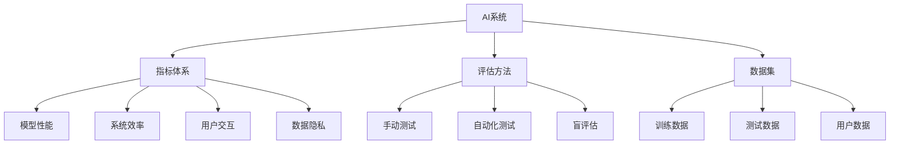

                 

# AI系统性能评估的详细方法

> 关键词：性能评估,系统评估,指标体系,模型调优,测试方法,深度学习

## 1. 背景介绍

在人工智能(AI)领域，构建高效的AI系统（如计算机视觉、自然语言处理、语音识别等）是推动技术进步和应用落地的关键。AI系统的性能评估不仅能够衡量其功能实现的效果，还能为模型调优、系统优化提供重要依据。随着AI技术的发展，构建和评估AI系统的复杂度不断提升，传统的评估方法已无法适应新需求。因此，本文将详细探讨AI系统性能评估的原理、方法及实践，以期为开发人员提供系统化、科学化的评估指导。

### 1.1 问题由来

随着深度学习技术和大规模数据集的广泛应用，AI系统在功能实现和性能表现上均取得了显著进展。然而，构建高效、可靠的AI系统，不仅需要高质量的数据和算法，还需要有效的性能评估方法，以确保系统在实际应用中的稳定性和可靠性。传统的手动测试和简单评估已无法满足当前复杂AI系统的需求，迫切需要更加系统化、科学化的评估方法。

### 1.2 问题核心关键点

AI系统性能评估的核心关键点包括：
- 构建全面的评估指标体系：包括模型性能、系统效率、用户交互、数据隐私等多方面。
- 设计合适的评估方法：如交叉验证、盲评估、对抗攻击等。
- 综合利用多种数据：通过人工标注、自动化工具、大数据分析等手段，全面评估系统性能。

## 2. 核心概念与联系

### 2.1 核心概念概述

为更好地理解AI系统性能评估的原理和流程，本节将介绍几个核心概念及其相互关系：

- **AI系统**：指利用深度学习、机器学习等技术构建的具备特定功能的应用系统，如自动驾驶、智能推荐系统、智能客服等。
- **性能评估**：指通过一系列科学、系统的测试方法和标准，对AI系统的各项性能指标进行量化和分析，以衡量其功能实现的效果和应用价值。
- **指标体系**：由一系列关键性能指标组成，用于全面衡量AI系统的各项功能表现和性能特性。
- **评估方法**：指用于进行性能评估的科学测试手段和工具，包括手动测试、自动化测试、盲评估等。
- **数据集**：用于评估AI系统性能的各类数据，包括训练数据、测试数据、用户数据等。

这些概念之间相互关联，共同构成了AI系统性能评估的基础框架。通过理解这些核心概念，可以更好地把握性能评估的全过程和关键步骤。

### 2.2 概念间的关系

这些核心概念之间的关系可以通过以下Mermaid流程图来展示：



这个流程图展示了AI系统性能评估的主要组成部分及其相互关系：

1. AI系统是评估的主体，其性能表现需要通过构建的指标体系进行衡量。
2. 评估方法用于实施具体的测试手段，包括手动测试、自动化测试、盲评估等。
3. 数据集提供了评估的基础，包括训练数据、测试数据和用户数据等。
4. 构建的指标体系包括了模型性能、系统效率、用户交互、数据隐私等多个方面。
5. 通过综合利用这些数据和评估方法，可以全面、科学地评估AI系统的各项性能。

## 3. 核心算法原理 & 具体操作步骤
### 3.1 算法原理概述

AI系统性能评估的原理基于系统科学、统计学和计算机科学等多个学科的理论和方法，通过构建综合性的评估指标体系，结合多种测试方法，对AI系统的各项性能进行量化和分析。

具体而言，评估过程包括以下几个关键步骤：

1. **指标定义**：根据AI系统的功能实现和应用场景，定义关键的性能指标，如模型精度、响应时间、用户体验等。
2. **数据收集**：通过手动测试、自动化测试、盲评估等手段，收集和整理用于评估的数据集。
3. **评估方法选择**：根据评估指标和数据特点，选择适合的评估方法，如交叉验证、盲评估、对抗攻击等。
4. **结果分析**：对评估结果进行统计分析和可视化展示，以全面了解AI系统的性能表现。

### 3.2 算法步骤详解

AI系统性能评估的具体步骤包括：

**Step 1: 构建评估指标体系**
- 定义系统应具备的各项关键功能，如分类、检测、生成等。
- 根据功能定义相应的性能指标，如精度、召回率、F1分数、生成质量等。
- 确定指标的权重，根据实际应用场景进行合理分配。

**Step 2: 收集评估数据集**
- 收集系统在训练、验证和测试集上的性能数据。
- 收集用户交互数据，如点击率、停留时间等。
- 收集系统性能数据，如响应时间、内存占用等。

**Step 3: 选择评估方法**
- 根据指标特性选择合适的评估方法，如交叉验证、盲评估、对抗攻击等。
- 设计实验流程，确保评估结果的公平性和可重复性。

**Step 4: 执行评估过程**
- 使用评估方法对系统进行测试，收集评估结果。
- 根据评估结果对系统进行优化，如模型调优、参数调整等。

**Step 5: 结果分析和优化**
- 对评估结果进行统计分析和可视化展示。
- 根据分析结果，提出系统优化建议。

### 3.3 算法优缺点

AI系统性能评估的主要优点包括：

- **全面性**：通过构建全面的指标体系和多种评估方法，可以全面评估AI系统的各项性能。
- **客观性**：使用科学、系统的评估方法和工具，减少主观偏见，保证评估结果的客观性。
- **可重复性**：评估流程和方法设计严谨，评估结果可重复，便于对比和优化。

缺点主要体现在：

- **复杂性**：构建和执行评估流程较为复杂，需要综合多方面的知识和技能。
- **数据依赖**：评估结果高度依赖于数据质量和数量，数据不足可能导致评估结果偏差。

### 3.4 算法应用领域

AI系统性能评估不仅适用于深度学习模型和算法的评估，还广泛应用于各种AI应用系统的测试和优化，如计算机视觉、自然语言处理、语音识别、智能推荐系统等。通过科学、系统的性能评估，可以发现系统的优势和不足，指导模型调优和系统优化，提升AI系统的整体性能和应用价值。

## 4. 数学模型和公式 & 详细讲解  
### 4.1 数学模型构建

在AI系统性能评估中，常见的数学模型包括：

- **混淆矩阵**：用于评估分类模型的性能，包括真阳性、假阳性、真阴性、假阴性等指标。
- **ROC曲线**：用于评估二分类模型的性能，ROC曲线下的面积（AUC）越高，模型的性能越好。
- **回归模型**：用于评估回归模型的性能，如均方误差（MSE）、平均绝对误差（MAE）等。
- **F1分数**：综合考虑精度和召回率，适用于不均衡数据集上的性能评估。

### 4.2 公式推导过程

以分类模型评估为例，使用混淆矩阵进行精度、召回率、F1分数的计算公式推导：

$$
\begin{array}{c}
\text{Precision} = \frac{TP}{TP+FP} \\
\text{Recall} = \frac{TP}{TP+FN} \\
\text{F1 score} = 2 \times \frac{Precision \times Recall}{Precision+Recall}
\end{array}
$$

其中，TP表示真正例，FP表示假正例，FN表示假反例。

### 4.3 案例分析与讲解

以智能推荐系统为例，通过评估模型的点击率、停留时间等指标，可以衡量其推荐效果。使用A/B测试方法，将新模型与旧模型进行对比，统计用户在两种模型下的点击率和停留时间，评估新模型的推荐性能。

## 5. 项目实践：代码实例和详细解释说明
### 5.1 开发环境搭建

在进行AI系统性能评估时，需要准备相应的开发环境，包括：

- **Python**：选择3.x版本，如Python 3.8。
- **深度学习框架**：如TensorFlow、PyTorch、Keras等，具体选择根据项目需求。
- **性能评估工具**：如scikit-learn、TensorBoard等。
- **自动化测试工具**：如Selenium、JUnit、Robot Framework等。

### 5.2 源代码详细实现

以下是使用Python和TensorFlow进行AI系统性能评估的代码实现示例：

```python
import tensorflow as tf
from sklearn.metrics import precision_score, recall_score, f1_score

# 定义模型和数据集
model = tf.keras.models.Sequential([
    tf.keras.layers.Dense(64, activation='relu', input_shape=(784,)),
    tf.keras.layers.Dense(10, activation='softmax')
])
(x_train, y_train), (x_test, y_test) = tf.keras.datasets.mnist.load_data()

# 编译和训练模型
model.compile(optimizer='adam', loss='sparse_categorical_crossentropy', metrics=['accuracy'])
model.fit(x_train, y_train, epochs=10, validation_data=(x_test, y_test))

# 评估模型性能
y_pred = model.predict(x_test)
y_pred = tf.argmax(y_pred, axis=1)
precision = precision_score(y_test, y_pred, average='macro')
recall = recall_score(y_test, y_pred, average='macro')
f1 = f1_score(y_test, y_pred, average='macro')
print(f'Precision: {precision:.2f}, Recall: {recall:.2f}, F1 score: {f1:.2f}')
```

### 5.3 代码解读与分析

上述代码实现了一个简单的全连接神经网络模型，使用MNIST数据集进行训练和评估。具体步骤包括：

1. **定义模型**：使用Sequential模型定义一个简单的全连接神经网络。
2. **加载数据集**：使用Keras内置的MNIST数据集加载训练集和测试集。
3. **编译和训练模型**：使用Adam优化器和交叉熵损失函数编译模型，并在训练集上进行10个epoch的训练。
4. **评估模型性能**：在测试集上进行预测，并使用scikit-learn库计算精度、召回率和F1分数，输出评估结果。

## 6. 实际应用场景
### 6.1 智能推荐系统

在智能推荐系统中，通过评估模型的点击率、停留时间、转化率等指标，可以全面评估推荐效果。使用A/B测试方法，对比新旧模型，统计用户在不同模型下的行为数据，评估新模型的推荐性能。

### 6.2 智能客服系统

智能客服系统的性能评估包括对话准确率、回答质量、用户满意度等指标。通过实际用户对话数据进行评估，使用BLEU、ROUGE等自动评估指标，衡量系统输出的对话质量和用户满意度。

### 6.3 自动驾驶系统

自动驾驶系统的性能评估包括路径规划准确性、避障能力、行车安全性等指标。使用模拟器和实际道路数据进行测试，评估系统在复杂环境中的表现。

## 7. 工具和资源推荐
### 7.1 学习资源推荐

为了帮助开发者掌握AI系统性能评估的原理和实践，以下推荐一些优质的学习资源：

1. **《AI系统性能评估与优化》书籍**：系统介绍AI系统性能评估的方法和流程，涵盖深度学习模型评估、自动化测试、盲评估等多个方面。
2. **CS231n课程**：斯坦福大学开设的计算机视觉课程，包含系统评估和性能评估的详细介绍。
3. **《深度学习实战》书籍**：介绍深度学习模型训练和评估的实战案例，包括模型调优、性能评估等。
4. **机器学习课程**：如Coursera上的《机器学习》课程，涵盖机器学习模型的评估方法和工具。

### 7.2 开发工具推荐

AI系统性能评估需要综合利用多种工具和技术，以下是一些推荐的工具：

1. **TensorFlow**：用于构建和训练深度学习模型，支持自动微分和可视化，方便评估模型性能。
2. **PyTorch**：用于构建和训练深度学习模型，支持动态计算图，方便模型调优和性能评估。
3. **Jupyter Notebook**：提供交互式编程环境，方便编写和运行评估代码。
4. **Selenium**：用于自动化测试，模拟用户交互行为，评估系统响应时间和用户体验。

### 7.3 相关论文推荐

为了深入了解AI系统性能评估的最新研究进展，以下推荐一些相关论文：

1. **《AI系统性能评估的最新进展》论文**：综述当前AI系统性能评估的研究方法和技术进展，包括模型调优、性能指标等。
2. **《深度学习模型评估与优化》论文**：讨论深度学习模型在实际应用中的性能评估和优化方法，涵盖模型调优、自动化测试、盲评估等多个方面。
3. **《智能推荐系统性能评估》论文**：介绍智能推荐系统的性能评估指标和方法，包括点击率、停留时间、转化率等。

## 8. 总结：未来发展趋势与挑战
### 8.1 研究成果总结

本文详细探讨了AI系统性能评估的原理、方法和实践，主要研究成果包括：

1. **构建全面指标体系**：定义了模型精度、系统效率、用户交互、数据隐私等多个关键指标，全面衡量AI系统的各项功能表现和性能特性。
2. **设计科学评估方法**：使用交叉验证、盲评估、对抗攻击等多种评估方法，确保评估结果的客观性和可重复性。
3. **实现系统化评估流程**：通过构建综合性的评估指标体系，结合多种测试方法，对AI系统的各项性能进行量化和分析。

### 8.2 未来发展趋势

未来，AI系统性能评估将呈现以下几个发展趋势：

1. **自动化和智能化评估**：通过自动化评估工具和人工智能技术，提高评估效率和准确性。
2. **多模态评估**：结合视觉、语音、文本等多模态数据进行全面评估，提升系统性能表现。
3. **实时评估**：使用实时监测和评估技术，及时发现系统异常和性能问题，确保系统稳定运行。

### 8.3 面临的挑战

尽管AI系统性能评估技术不断进步，但仍面临一些挑战：

1. **数据质量**：评估结果高度依赖于数据质量和数量，数据不足可能导致评估结果偏差。
2. **模型复杂性**：复杂的深度学习模型评估难度较大，需要综合多方面的知识和技能。
3. **安全性和隐私**：评估过程中涉及用户数据和隐私问题，如何确保数据安全是重要挑战。

### 8.4 研究展望

未来，AI系统性能评估需要在以下几个方面进行进一步研究和探索：

1. **自动化评估工具**：开发更多自动化评估工具，减少人工干预，提高评估效率和准确性。
2. **多模态评估方法**：研究多模态数据的融合和评估方法，提升系统性能表现。
3. **安全性和隐私保护**：研究如何在评估过程中保护用户数据和隐私，确保数据安全。

## 9. 附录：常见问题与解答

**Q1：如何选择合适的性能评估指标？**

A: 选择合适的性能评估指标应综合考虑系统的功能实现和应用场景。通常，可以通过与用户交互、业务目标等角度进行衡量，选择最适合的指标。例如，对于推荐系统，点击率、转化率、停留时间等指标较为关键。

**Q2：如何进行系统自动化评估？**

A: 系统自动化评估需要利用自动化测试工具，如Selenium、JUnit等，模拟用户行为，自动执行测试用例，收集评估数据。同时，结合日志分析工具，如ELK Stack、Prometheus等，实时监控系统性能和用户行为。

**Q3：如何处理评估数据中的异常值？**

A: 在评估数据中，异常值会对评估结果产生较大影响，需要进行处理。可以使用统计方法，如均值滤波、Z-score等，将异常值进行平滑处理。同时，结合领域知识，进行人工排查和处理。

**Q4：如何进行多模态数据融合评估？**

A: 多模态数据融合评估需要结合视觉、语音、文本等多模态数据进行综合评估。可以使用融合算法，如特征融合、模型融合等，将不同模态的数据进行整合，提升系统性能表现。

**Q5：如何确保评估数据的安全性？**

A: 在评估过程中，涉及用户数据和隐私问题，需要采取严格的保密措施。可以使用数据脱敏、访问控制等技术，确保数据安全和隐私保护。同时，结合数据使用协议，明确数据使用范围和权限。

---

作者：禅与计算机程序设计艺术 / Zen and the Art of Computer Programming

