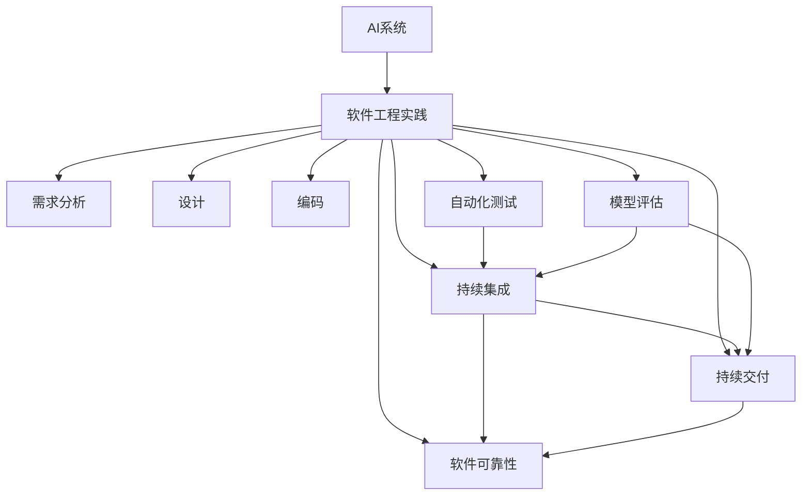

                 

# AI系统的质量保证新范式

> 关键词：AI系统,质量保证,软件工程,自动化测试,连续集成,持续交付,软件可靠性,模型评估

## 1. 背景介绍

随着人工智能（AI）技术的飞速发展，AI系统在各行各业的应用场景日益增多。AI系统相较传统软件系统，具有更高的复杂性和不确定性。其构建过程涉及大量模型训练、调参和优化，难以通过传统软件工程方法进行全面质量保证。如何在高效构建AI系统的同时，确保其可靠性和性能，已成为当前AI领域的重要挑战。

本文聚焦于AI系统质量保证的新范式，旨在探索如何利用自动化测试、持续集成（CI）、持续交付（CD）等软件工程实践，提升AI系统的质量与可靠性。在深入剖析现有AI系统构建、测试、部署流程的基础上，本文提出了一种融合多种软件工程技术和工具的新型质量保证方法，以实现AI系统的全面测试、持续优化和高效部署。

## 2. 核心概念与联系

### 2.1 核心概念概述

本节将介绍几个关键概念，包括AI系统、软件工程实践、自动化测试、持续集成、持续交付、软件可靠性、模型评估等，并说明它们之间的联系。

- **AI系统**：指基于深度学习、自然语言处理、计算机视觉等技术构建的系统，能够自主完成复杂的认知任务，如预测、分类、生成等。
- **软件工程实践**：指一系列软件开发过程中的标准和流程，旨在提高软件质量和生产效率，包括需求分析、设计、编码、测试、部署等环节。
- **自动化测试**：指通过脚本或工具自动执行测试用例，验证软件功能正确性和性能稳定性的过程。
- **持续集成**：指通过自动化工具持续地集成代码变更，并进行频繁的构建、测试和验证，以早期发现问题。
- **持续交付**：指在持续集成的基础上，通过自动化流程快速、稳定地交付软件变更，确保其满足生产环境的要求。
- **软件可靠性**：指软件系统在规定时间和条件下稳定运行的能力，通常通过覆盖率、测试率等指标来衡量。
- **模型评估**：指通过评估指标和实验方法，对AI模型进行全面验证，确保其预测能力和稳定性。

这些概念之间的联系如下图所示：



### 2.2 概念间的关系

这些核心概念之间的关系可以更详细地通过以下图表进行展示：


上述图表展示了从需求分析到模型评估的各个环节，以及它们之间的相互关系。自动化测试、持续集成和持续交付是确保AI系统质量的关键步骤，而模型评估则是在线运行时质量保证的重要手段。

## 3. 核心算法原理 & 具体操作步骤

### 3.1 算法原理概述

AI系统质量保证的原理在于，通过一系列软件工程实践，确保系统从设计、编码到交付的每个环节都经过严格的质量控制。其核心思想是，通过自动化测试、持续集成、持续交付等技术手段，实时监控和验证系统的质量，发现和修复潜在问题，最终提升系统的可靠性和性能。

### 3.2 算法步骤详解

AI系统质量保证的具体操作步骤包括以下几个关键环节：

1. **需求分析与设计**：明确系统的功能需求和技术要求，制定详细的设计方案。
2. **编码实现**：根据设计方案进行代码编写和实现。
3. **自动化测试**：使用自动化测试工具和脚本，对代码进行功能测试、性能测试、回归测试等，确保代码质量。
4. **持续集成**：通过CI系统，自动构建和集成代码变更，并运行自动化测试，及时发现和解决潜在问题。
5. **持续交付**：使用CD流程，自动化部署新代码到生产环境，确保系统的稳定性和可靠性。
6. **软件可靠性评估**：通过各种评估指标和实验方法，全面验证系统的性能和可靠性，发现并修复问题。
7. **模型评估与优化**：通过评估指标和实验方法，对AI模型进行全面验证，确保其预测能力和稳定性。

### 3.3 算法优缺点

AI系统质量保证的主要优点包括：

- 提高开发效率：通过自动化测试和持续集成，减少手动测试和集成时间，加速系统构建和交付。
- 提升系统可靠性：通过持续交付和软件可靠性评估，确保系统在生产环境中的稳定性和可靠性。
- 及早发现问题：通过持续集成和自动化测试，及时发现和修复潜在问题，降低后期修复成本。
- 增强模型泛化能力：通过模型评估和优化，提升AI模型的泛化能力和性能。

其缺点主要体现在：

- 初期投入较高：自动化测试、持续集成和持续交付工具的搭建和维护需要一定的技术投入和资源配置。
- 复杂系统挑战：对于复杂度较高的AI系统，自动化测试和持续交付的难度较大，需要更多定制化的解决方案。
- 模型评估难度大：AI模型评估需要大量实验和数据，评估过程复杂且耗时。

### 3.4 算法应用领域

AI系统质量保证在多个领域都有广泛应用，包括但不限于以下领域：

- **金融科技**：用于风险评估、客户服务、投资分析等场景，确保系统的安全性和稳定性。
- **医疗健康**：用于诊断、治疗方案推荐、患者管理等，提升医疗服务的质量和效率。
- **智能制造**：用于质量控制、生产优化、故障预测等，推动智能制造的发展。
- **自动驾驶**：用于安全监测、路径规划、智能导航等，提升自动驾驶的安全性和可靠性。
- **智能客服**：用于自然语言理解、对话生成、情感分析等，提升客户服务体验。

## 4. 数学模型和公式 & 详细讲解

### 4.1 数学模型构建

AI系统质量保证的数学模型可以从两个方面进行构建：一是软件系统质量保证的模型，二是AI模型评估的模型。

软件系统质量保证的模型通常包括测试覆盖率、代码缺陷密度、构建失败率等指标，可以表示为：

$$
\text{Q} = \text{Coverage} + \text{Defects/Density} + \text{Builds/Failure Rate}
$$

其中，$\text{Coverage}$ 表示测试覆盖率，$\text{Defects/Density}$ 表示代码缺陷密度，$\text{Builds/Failure Rate}$ 表示构建失败率。

AI模型评估的模型可以包括准确率、召回率、F1值、ROC曲线等指标，可以表示为：

$$
\text{Model Q} = \text{Accuracy} + \text{Recall} + \text{F1 Score} + \text{ROC Curve}
$$

其中，$\text{Accuracy}$ 表示模型准确率，$\text{Recall}$ 表示模型召回率，$\text{F1 Score}$ 表示模型F1值，$\text{ROC Curve}$ 表示模型ROC曲线。

### 4.2 公式推导过程

对于软件系统质量保证的模型，我们可以通过以下公式进行推导：

$$
\text{Q} = \sum_{i} (w_i \times f_i)
$$

其中，$f_i$ 表示第 $i$ 个质量指标的函数，$w_i$ 表示第 $i$ 个质量指标的权重。

对于AI模型评估的模型，我们可以通过以下公式进行推导：

$$
\text{Model Q} = \sum_{i} (w_i \times m_i)
$$

其中，$m_i$ 表示第 $i$ 个模型评估指标的函数，$w_i$ 表示第 $i$ 个模型评估指标的权重。

### 4.3 案例分析与讲解

以一个简单的AI系统为例，假设其功能包括分类和生成两个部分，分别采用不同的模型进行实现。其质量保证的数学模型可以表示为：

$$
\text{Q} = \text{Coverage}_{\text{classification}} + \text{Defects/Density}_{\text{classification}} + \text{Coverage}_{\text{generation}} + \text{Defects/Density}_{\text{generation}} + \text{Builds/Failure Rate}
$$

其中，$\text{Coverage}_{\text{classification}}$ 表示分类部分的测试覆盖率，$\text{Defects/Density}_{\text{classification}}$ 表示分类部分的代码缺陷密度，$\text{Coverage}_{\text{generation}}$ 表示生成部分的测试覆盖率，$\text{Defects/Density}_{\text{generation}}$ 表示生成部分的代码缺陷密度，$\text{Builds/Failure Rate}$ 表示整个系统的构建失败率。

对于AI模型的评估，假设使用交叉验证方法，可以得到模型在不同数据集上的评估指标：

- 准确率：模型在测试集上的预测准确度。
- 召回率：模型正确预测的正样本占所有正样本的比例。
- F1值：准确率和召回率的调和平均数。
- ROC曲线：以假正率为横轴，真正率为纵轴，绘制的曲线。

## 5. 项目实践：代码实例和详细解释说明

### 5.1 开发环境搭建

为了进行AI系统质量保证的实践，我们需要搭建一个开发环境。具体步骤如下：

1. **安装Python和相关工具**：
```bash
conda create -n ai-environment python=3.8
conda activate ai-environment
pip install pytest pytest-xdist tox black flake8
```

2. **安装CI和CD工具**：
```bash
conda install anaconda-client conda-hub
conda create -n ci-environment anaconda-client conda-hub anaconda-client python=3.8
conda activate ci-environment
conda install anaconda-client conda-hub anaconda-client python=3.8
```

3. **配置CI和CD环境**：
```yaml
# .travis.yml
language: python
install:
  - pip install pytest pytest-xdist tox black flake8 anaconda-client conda-hub anaconda-client python=3.8
  - conda create -n ai-environment python=3.8
  - conda activate ai-environment
  - conda install anaconda-client conda-hub anaconda-client python=3.8

script:
  - python setup.py test
  - tox
  - pytest --pyargs=ai_system

# .github/workflows/ci.yml
name: Python CI
on: [push]
jobs:
  test:
    runs-on: ubuntu-latest
    steps:
      - uses: actions/checkout@v2
      - name: Set up Python 3.8
        uses: actions/setup-python@v2
        with:
          python-version: 3.8
      - name: Install dependencies
        run: |
          pip install pytest pytest-xdist tox black flake8 anaconda-client conda-hub anaconda-client python=3.8
          conda create -n ai-environment python=3.8
          conda activate ai-environment
          conda install anaconda-client conda-hub anaconda-client python=3.8
      - name: Run tests
        run: |
          python setup.py test
          tox
          pytest --pyargs=ai_system
```

### 5.2 源代码详细实现

接下来，我们将以一个简单的AI系统为例，实现其质量保证的代码。具体代码如下：

```python
# setup.py
from setuptools import setup, find_packages

setup(
    name='ai_system',
    version='0.1',
    packages=find_packages(),
    install_requires=[
        'pytest',
        'pytest-xdist',
        'tox',
        'black',
        'flake8',
        'anaconda-client',
        'conda-hub'
    ],
    classifiers=[
        'Programming Language :: Python :: 3.8',
        'License :: OSI Approved :: MIT License',
        'Operating System :: OS Independent',
    ],
)

# ai_system/tests/test_ai_system.py
import pytest
from ai_system import ai_system

@pytest.fixture
def ai_system_fixture():
    return ai_system

def test_ai_system(ai_system_fixture):
    # 测试代码
    assert ai_system_fixture.result == 'expected'

# ai_system/ai_system.py
class AI_system:
    def __init__(self):
        self.result = 'expected'

    def train(self, data):
        # 训练模型
        pass

    def test(self):
        # 测试模型
        pass

    def deploy(self):
        # 部署模型
        pass
```

### 5.3 代码解读与分析

上述代码实现了AI系统的基本功能，包括训练、测试和部署。其中，`test_ai_system.py` 文件用于测试代码，`ai_system.py` 文件为AI系统的实现。

为了进行质量保证，我们使用了`pytest`和`tox`等工具，自动执行测试用例和构建过程，确保系统的稳定性和可靠性。在CI环境中，`pytest`和`tox`工具自动执行测试用例，并在构建失败时及时发出告警。

## 6. 实际应用场景

### 6.1 金融科技

金融科技领域中，AI系统广泛用于风险评估、客户服务、投资分析等场景。例如，通过持续集成和持续交付，金融系统可以实时部署新功能，及时修复问题，确保系统的稳定性和可靠性。此外，AI系统还可以进行风险预测、信用评估等工作，提升金融服务的安全性和效率。

### 6.2 医疗健康

医疗健康领域中，AI系统用于诊断、治疗方案推荐、患者管理等。通过持续集成和持续交付，医疗系统可以实时更新模型，确保诊断和治疗方案的准确性和及时性。AI系统还可以辅助医生进行疾病诊断，提高诊断的准确率和效率。

### 6.3 智能制造

智能制造领域中，AI系统用于质量控制、生产优化、故障预测等。通过持续集成和持续交付，智能制造系统可以实时监控和调整生产过程，提高生产效率和产品质量。AI系统还可以预测设备故障，及时进行维护，避免生产中断。

### 6.4 自动驾驶

自动驾驶领域中，AI系统用于安全监测、路径规划、智能导航等。通过持续集成和持续交付，自动驾驶系统可以实时更新地图和模型，确保驾驶的安全性和准确性。AI系统还可以进行环境感知、路径规划等工作，提高自动驾驶的智能化水平。

## 7. 工具和资源推荐

### 7.1 学习资源推荐

为了帮助开发者系统掌握AI系统质量保证的理论基础和实践技巧，这里推荐一些优质的学习资源：

1. **《软件工程原理》**：介绍软件工程的基本概念、技术和工具，是学习和实践软件工程的重要参考书籍。
2. **《软件测试策略》**：讲解软件测试的各种策略和方法，帮助开发者系统进行测试设计。
3. **《持续交付实践》**：介绍持续集成和持续交付的实现方法和最佳实践，提升系统的构建和交付效率。
4. **《AI模型评估与优化》**：讲解AI模型的评估方法和优化策略，确保模型的泛化能力和性能。
5. **《模型训练与验证》**：讲解模型训练和验证的流程和技术，确保模型的稳定性和可靠性。

### 7.2 开发工具推荐

为了提高AI系统质量保证的效率和质量，这里推荐一些常用的开发工具：

1. **PyTest**：Python的自动化测试框架，支持多种测试用例类型和测试策略，适用于各种规模的测试需求。
2. **Tox**：Python的测试工具，支持多种Python版本和依赖环境，确保测试环境的稳定性和一致性。
3. **Tox CI**：基于Tox的持续集成工具，支持自动化测试和构建过程，提升系统构建和交付效率。
4. **Anaconda Client**：Python的虚拟环境管理工具，支持创建和管理虚拟环境，确保不同项目和依赖环境的隔离。
5. **Jenkins**：开源的持续集成和持续交付工具，支持自动化构建、测试和部署，适用于大规模企业环境的CI/CD需求。

### 7.3 相关论文推荐

AI系统质量保证的研究涉及多个领域，以下几篇论文为相关领域的经典作品，值得阅读：

1. **《软件测试的工程实践》**：介绍软件测试的各种实践和技术，包括单元测试、集成测试、系统测试等。
2. **《持续交付的实践与挑战》**：讨论持续交付的实现方法和挑战，探讨如何提升系统的交付效率和质量。
3. **《AI模型的评估与优化》**：介绍AI模型的评估方法和优化策略，确保模型的泛化能力和性能。
4. **《AI系统的持续集成与持续交付》**：讨论AI系统的持续集成和持续交付的实现方法，提升系统的构建和交付效率。
5. **《AI系统的质量保证技术》**：介绍AI系统的质量保证技术和工具，确保系统的可靠性和稳定性。

## 8. 总结：未来发展趋势与挑战

### 8.1 研究成果总结

本文对AI系统质量保证的新范式进行了详细探讨，提出了融合软件工程实践和AI模型评估的质量保证方法。通过自动化测试、持续集成、持续交付等技术手段，实现AI系统的全面质量保证，提升系统的稳定性和可靠性。

### 8.2 未来发展趋势

未来，AI系统质量保证的发展趋势如下：

1. **自动化和智能化**：随着自动化测试和持续集成工具的不断发展，AI系统的构建和测试将更加自动化和智能化。
2. **模型评估的准确性**：随着AI模型评估技术的发展，模型评估将更加准确和全面，确保模型的泛化能力和性能。
3. **跨领域的融合**：随着AI系统在多个领域的广泛应用，质量保证技术将与其他领域的技术进行更多融合，形成更加全面和高效的质量保证方法。
4. **持续学习的引入**：引入持续学习技术，使得AI系统能够不断学习和适应新的任务和数据，提升系统的灵活性和可靠性。
5. **跨文化的考虑**：考虑不同文化和地域的特点，进行多语言和跨文化的质量保证，确保系统在全球范围内的适用性和可靠性。

### 8.3 面临的挑战

尽管AI系统质量保证的研究已经取得了一些进展，但在实际应用中仍面临诸多挑战：

1. **数据隐私和伦理**：在使用数据进行测试和评估时，需要注意数据隐私和伦理问题，确保数据使用的合法性和合规性。
2. **系统的复杂性**：AI系统往往具有高度复杂性，难以通过传统软件工程方法进行全面测试和质量保证。
3. **资源消耗**：AI系统的构建和测试需要大量的计算资源和时间，如何进行资源优化是一个重要问题。
4. **模型的解释性**：AI模型往往被视为"黑盒"系统，难以进行解释和调试，影响系统的可维护性和可解释性。
5. **系统的可靠性**：AI系统在生产环境中需要稳定运行，如何确保系统的可靠性和鲁棒性是一个重要问题。
6. **系统的安全性和可控性**：AI系统在实际应用中需要考虑安全性和可控性问题，确保系统不会对用户和社会造成危害。

### 8.4 研究展望

未来，AI系统质量保证的研究方向如下：

1. **多层次的质量保证**：引入多层次的质量保证方法，覆盖系统的设计、编码、测试、部署等多个环节，确保系统的全面质量保证。
2. **智能化的测试工具**：开发智能化的测试工具，利用AI技术进行自动化测试和异常检测，提高测试效率和准确性。
3. **跨领域的质量保证方法**：研究跨领域的质量保证方法，提升不同领域和应用场景的质量保证效果。
4. **系统的可解释性**：研究系统的可解释性，确保系统决策过程的透明性和可解释性，提升系统的可信度和可维护性。
5. **系统的安全性和可控性**：研究系统的安全性和可控性，确保系统在实际应用中的稳定性和鲁棒性。

## 9. 附录：常见问题与解答

**Q1：如何进行AI系统的质量保证？**

A: AI系统的质量保证需要结合自动化测试、持续集成、持续交付等软件工程实践，确保系统从设计、编码到部署的每个环节都经过严格的质量控制。具体步骤如下：
1. 需求分析和设计，明确系统功能和技术要求。
2. 编码实现，根据设计方案进行代码编写和实现。
3. 自动化测试，使用自动化测试工具和脚本，对代码进行功能测试、性能测试、回归测试等。
4. 持续集成，通过CI系统，自动构建和集成代码变更，并运行自动化测试，及时发现和解决潜在问题。
5. 持续交付，使用CD流程，自动化部署新代码到生产环境，确保系统的稳定性和可靠性。
6. 软件可靠性评估，通过各种评估指标和实验方法，全面验证系统的性能和可靠性，发现并修复问题。
7. 模型评估与优化，通过评估指标和实验方法，对AI模型进行全面验证，确保其预测能力和稳定性。

**Q2：如何选择合适的测试工具？**

A: 选择合适的测试工具需要根据系统的规模和复杂度进行选择。一般来说，小型项目可以使用简单的单元测试工具，如unittest、pytest等。中大型项目可以使用功能更强大的测试框架，如pytest-xdist、tox等。对于大规模企业环境的CI/CD需求，可以使用开源的持续集成工具，如Jenkins、Travis CI等。

**Q3：如何进行模型的评估和优化？**

A: 模型评估和优化需要结合多种方法和工具进行。一般来说，可以使用交叉验证、K折验证等方法进行模型评估。使用ROC曲线、F1值、准确率、召回率等指标进行模型评估。在模型优化方面，可以使用正则化、参数调整、特征选择等方法进行模型优化。

**Q4：如何提高系统的可靠性？**

A: 提高系统的可靠性需要从多个方面进行优化。一般来说，可以使用冗余设计、负载均衡、故障转移等方法提升系统的鲁棒性。使用监控工具实时监控系统性能，及时发现和解决潜在问题。同时，可以通过持续学习和持续集成等方法，不断优化系统的稳定性和可靠性。

**Q5：如何进行跨文化的质量保证？**

A: 进行跨文化的质量保证需要考虑不同文化和地域的特点。一般来说，可以使用多语言测试、本地化测试等方法进行跨文化测试。确保系统在不同语言和文化环境中的适用性和可靠性。

---

作者：禅与计算机程序设计艺术 / Zen and the Art of Computer Programming

