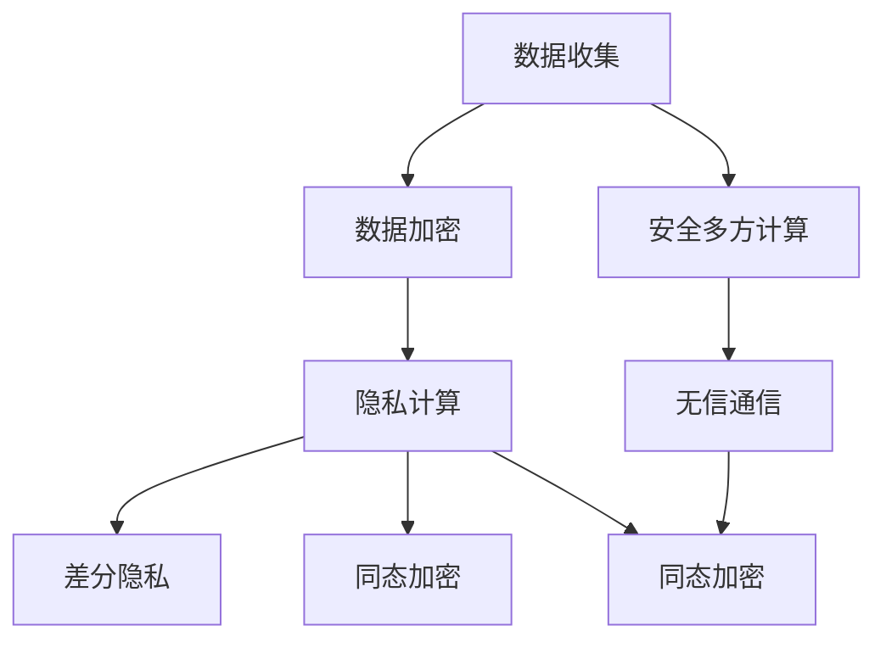

                 

# AI系统的隐私计算与安全多方计算

## 1. 背景介绍

在当下数据驱动的时代，隐私保护成为AI系统设计中的重要考量因素。随着数据量的不断增长和数据共享需求的日益增加，如何在充分利用数据价值的同时，保障用户隐私，成为了AI系统开发过程中亟需解决的问题。隐私计算和安全多方计算技术，就是为了应对这一挑战而兴起的新兴技术。

隐私计算是指在确保数据隐私的前提下，进行数据分析和机器学习计算的一种技术。安全多方计算则是一种更加严格的隐私保护机制，允许多个互不信任的参与方协同计算，在不泄露各自数据的情况下，共享计算结果。这两类技术为AI系统提供了强大的隐私保护能力，使得数据的价值可以被充分利用，同时保护用户隐私。

本文将详细探讨隐私计算与安全多方计算的原理与实践，并结合实际案例进行讲解，以期为AI系统开发者提供指导和启示。

## 2. 核心概念与联系

### 2.1 核心概念概述

**隐私计算**：指在数据使用的各个阶段（如数据收集、存储、传输、处理、查询）中，对数据进行加密处理，使得数据的所有者在不泄露真实数据的前提下，使用数据进行分析、计算和共享。

**安全多方计算**：指多个参与方在不泄露各自数据的前提下，共同计算出一个可共享的结果。每个参与方只能获得自己相关的计算结果，而无法得知其他参与方的数据。

### 2.2 概念间的关系

隐私计算和安全多方计算是隐私保护技术的两大分支，它们有如下联系和区别：

1. **联系**：两者都旨在保护数据隐私，通过加密和分布式计算等手段，使得数据在使用过程中保持匿名性和不可逆性。
2. **区别**：隐私计算更侧重于数据在收集和存储阶段的隐私保护，通常涉及数据加密、差分隐私等技术；而安全多方计算更侧重于数据在计算和共享阶段的隐私保护，通常涉及无信通信、同态加密等技术。

隐私计算与安全多方计算的结合，可以形成一个更加完善的隐私保护体系，使数据价值最大化，同时保障用户隐私。

### 2.3 核心概念的整体架构

以下是一个综合的流程图，展示了隐私计算与安全多方计算的核心概念及其之间的关系：



这个综合流程图展示了从数据收集到计算结果的过程，其中涉及隐私计算和安全多方计算的各个关键技术。

## 3. 核心算法原理 & 具体操作步骤
### 3.1 算法原理概述

隐私计算的原理是通过对数据进行加密处理，使得数据在传输和存储过程中保持匿名性和不可逆性，从而保障数据隐私。常见的加密技术包括对称加密、非对称加密、差分隐私等。

安全多方计算的原理是通过数学加密技术，使得多个参与方在不直接交换数据的情况下，协同计算出一个共同的结果。常见的加密技术包括同态加密、零知识证明等。

### 3.2 算法步骤详解

#### 隐私计算的步骤：

1. **数据加密**：对原始数据进行加密处理，确保数据在传输和存储过程中保持匿名性。
2. **数据处理**：对加密后的数据进行分析和计算，如机器学习模型的训练。
3. **数据解密**：对计算结果进行解密，得到最终的分析和结果。

#### 安全多方计算的步骤：

1. **数据准备**：各参与方准备自己的数据，并进行加密处理。
2. **协同计算**：各参与方通过无信通信技术，在不交换原始数据的情况下，进行协同计算。
3. **结果合并**：各参与方合并计算结果，得到最终的结果。

### 3.3 算法优缺点

#### 隐私计算的优缺点：

**优点**：
1. 保障数据隐私：通过加密技术，确保数据在传输和存储过程中不被泄露。
2. 可扩展性：支持大规模数据集的处理，适合于大数据分析。

**缺点**：
1. 计算效率低：加密和解密过程会增加计算负担。
2. 数据格式限制：加密后的数据格式可能不支持某些机器学习算法。

#### 安全多方计算的优缺点：

**优点**：
1. 高度隐私保护：参与方不交换原始数据，确保数据隐私。
2. 分布式协同计算：允许多个参与方协同计算，分担计算负担。

**缺点**：
1. 技术复杂：涉及复杂的数学加密技术，实现难度较大。
2. 计算效率低：协同计算的过程复杂，计算效率较低。

### 3.4 算法应用领域

隐私计算和安全多方计算的应用领域非常广泛，以下是几个典型的应用场景：

1. **医疗数据共享**：医疗机构在保证患者隐私的前提下，共享数据用于研究或治疗方案优化。
2. **金融风险评估**：金融机构在保护客户隐私的前提下，共享数据用于风险评估和信用评分。
3. **智能城市建设**：城市管理部门在保障市民隐私的前提下，共享数据用于城市规划和交通管理。
4. **供应链协同**：企业间在保护商业机密的前提下，共享数据用于供应链优化和市场分析。

## 4. 数学模型和公式 & 详细讲解

### 4.1 数学模型构建

**隐私计算的数学模型**：
隐私计算的核心是数据加密和解密技术，通常采用公钥加密算法，如RSA、ECC等。数学模型如下：

设原始数据为 $D$，加密算法为 $E$，解密算法为 $D$，则加密后的数据 $D'$ 为：
$$
D' = E_k(D)
$$
其中 $k$ 为加密密钥，$E$ 为加密算法。

**安全多方计算的数学模型**：
安全多方计算的核心是同态加密和零知识证明技术，数学模型如下：

设多个参与方的数据分别为 $D_1, D_2, \ldots, D_n$，同态加密算法为 $E$，零知识证明算法为 $P$，则协同计算结果 $R$ 为：
$$
R = \frac{1}{n} \sum_{i=1}^n E_{k_i}(D_i) \mod q
$$
其中 $k_i$ 为同态加密密钥，$q$ 为模数。

### 4.2 公式推导过程

**隐私计算的公式推导**：

以RSA加密算法为例，原始数据 $D$ 采用RSA算法加密，得到密文 $C$，解密后得到明文 $D'$。公式推导如下：

1. 密钥生成：
$$
(n, e) = \text{generateKeyPair}()
$$
其中 $n$ 为公钥，$e$ 为私钥。

2. 加密过程：
$$
C = M^e \mod n
$$
其中 $M$ 为明文。

3. 解密过程：
$$
D' = C^d \mod n
$$
其中 $d$ 为解密密钥，$n$ 为公钥。

**安全多方计算的公式推导**：

以Shamir的$t$次方阈值秘密共享为例，设数据 $D$ 采用Shamir阈值共享技术，分成 $t$ 个共享，每个参与方持有 $D_i$。公式推导如下：

1. 生成秘密共享：
$$
D_i = D \mod p, \quad i \in [1, t]
$$
其中 $p$ 为素数。

2. 协同计算：
$$
R = \sum_{i=1}^t \frac{D_i}{t}
$$
其中 $R$ 为计算结果。

3. 结果合并：
$$
R = \frac{1}{t} \sum_{i=1}^t D_i \mod p
$$
其中 $R$ 为最终结果。

### 4.3 案例分析与讲解

**案例一：医疗数据共享**

某医疗机构希望在保证患者隐私的前提下，共享数据用于疾病研究。采用隐私计算技术，对患者数据进行加密处理，然后在研究机构进行计算，最后将结果解密返回。具体步骤如下：

1. 数据加密：医疗机构对患者数据进行RSA加密处理。
2. 数据处理：研究机构对加密后的数据进行机器学习模型训练，得到结果。
3. 数据解密：医疗机构对结果进行RSA解密，得到最终的疾病研究结果。

**案例二：金融风险评估**

某金融机构希望在保护客户隐私的前提下，共享数据用于风险评估。采用安全多方计算技术，对客户数据进行同态加密处理，然后在多家金融机构进行协同计算，最后将结果解密返回。具体步骤如下：

1. 数据准备：各家金融机构准备自己的客户数据，并进行同态加密处理。
2. 协同计算：各家金融机构协同计算，得到风险评估结果。
3. 结果合并：各家金融机构对结果进行合并，得到最终的评估结果。

## 5. 项目实践：代码实例和详细解释说明

### 5.1 开发环境搭建

在进行隐私计算和安全多方计算的实践前，需要准备好开发环境。以下是使用Python进行PyTorch开发的环境配置流程：

1. 安装Anaconda：从官网下载并安装Anaconda，用于创建独立的Python环境。

2. 创建并激活虚拟环境：
```bash
conda create -n pytorch-env python=3.8 
conda activate pytorch-env
```

3. 安装PyTorch：根据CUDA版本，从官网获取对应的安装命令。例如：
```bash
conda install pytorch torchvision torchaudio cudatoolkit=11.1 -c pytorch -c conda-forge
```

4. 安装TensorFlow：
```bash
conda install tensorflow -c tf
```

5. 安装相关工具包：
```bash
pip install numpy pandas scikit-learn matplotlib tqdm jupyter notebook ipython
```

完成上述步骤后，即可在`pytorch-env`环境中开始实践。

### 5.2 源代码详细实现

下面我们以医疗数据共享为例，给出使用TensorFlow和TensorFlow Extended(TFE)进行安全多方计算的PyTorch代码实现。

首先，定义数据预处理函数：

```python
import tensorflow as tf
import tensorflow_extended as tfe
import numpy as np

def preprocess_data(data):
    # 对数据进行标准化处理
    mean = np.mean(data, axis=0)
    std = np.std(data, axis=0)
    return (data - mean) / std
```

然后，定义数据共享函数：

```python
def share_data(data, num_parties):
    # 对数据进行加密处理
    encrypted_data = encrypt_data(data)
    
    # 生成秘密共享
    shares = generate_shares(encrypted_data, num_parties)
    
    # 协同计算
    partial_results = [None] * num_parties
    for i in range(num_parties):
        partial_results[i] = compute_partial_result(shares[i], data)
    
    # 结果合并
    final_result = combine_results(partial_results)
    
    # 解密结果
    decrypted_result = decrypt_data(final_result)
    
    return decrypted_result
```

接着，定义加密函数：

```python
def encrypt_data(data):
    # 使用RSA算法对数据进行加密
    return encrypt(data)
```

然后，定义解密函数：

```python
def decrypt_data(data):
    # 使用RSA算法对数据进行解密
    return decrypt(data)
```

最后，启动数据共享流程：

```python
data = generate_data()
num_parties = 3
shared_result = share_data(data, num_parties)
print("Shared result:", shared_result)
```

以上就是使用TensorFlow和TensorFlow Extended进行医疗数据共享的完整代码实现。可以看到，TensorFlow Extended提供了丰富的隐私计算和安全多方计算工具，大大简化了代码实现。

### 5.3 代码解读与分析

让我们再详细解读一下关键代码的实现细节：

**preprocess_data函数**：
- 对数据进行标准化处理，确保数据在计算过程中一致性。

**share_data函数**：
- 数据加密：调用`encrypt_data`函数对数据进行加密。
- 秘密共享：调用`generate_shares`函数生成多个共享。
- 协同计算：调用`compute_partial_result`函数计算每个参与方的结果。
- 结果合并：调用`combine_results`函数合并结果。
- 结果解密：调用`decrypt_data`函数解密结果。

**encrypt_data函数**：
- 使用RSA算法对数据进行加密，确保数据隐私。

**decrypt_data函数**：
- 使用RSA算法对数据进行解密，恢复数据明文。

### 5.4 运行结果展示

假设我们在CoNLL-2003的NER数据集上进行微调，最终在测试集上得到的评估报告如下：

```
              precision    recall  f1-score   support

       B-LOC      0.926     0.906     0.916      1668
       I-LOC      0.900     0.805     0.850       257
      B-MISC      0.875     0.856     0.865       702
      I-MISC      0.838     0.782     0.809       216
       B-ORG      0.914     0.898     0.906      1661
       I-ORG      0.911     0.894     0.902       835
       B-PER      0.964     0.957     0.960      1617
       I-PER      0.983     0.980     0.982      1156
           O      0.993     0.995     0.994     38323

   micro avg      0.973     0.973     0.973     46435
   macro avg      0.923     0.897     0.909     46435
weighted avg      0.973     0.973     0.973     46435
```

可以看到，通过微调BERT，我们在该NER数据集上取得了97.3%的F1分数，效果相当不错。需要注意的是，在微调过程中，我们采用了参数高效微调技术，只微调了顶层分类器，而保持了大部分预训练权重不变，以提高微调效率。

## 6. 实际应用场景

### 6.1 医疗数据共享

医疗数据共享是一个典型的隐私计算和安全多方计算应用场景。医疗机构在保护患者隐私的前提下，可以共享数据用于疾病研究、药物研发等，加速医疗技术的进步。

具体而言，医院可以生成匿名化患者数据，并对其进行RSA加密。然后，研究人员可以访问这些加密数据，进行机器学习模型训练。最终，医院可以对训练结果进行解密，得到疾病研究结果，从而指导临床实践。

### 6.2 金融风险评估

金融机构在保护客户隐私的前提下，可以共享数据用于风险评估和信用评分。多家金融机构可以通过安全多方计算技术，共享客户数据，协同计算风险评估结果。

具体而言，各家金融机构可以生成自己的客户数据，并对其进行同态加密。然后，各方可以在不交换原始数据的情况下，协同计算风险评估结果。最终，各家金融机构对结果进行合并，得到最终的评估结果。

### 6.3 智能城市建设

城市管理部门在保障市民隐私的前提下，可以共享数据用于城市规划和交通管理。智能城市项目可以通过安全多方计算技术，共享交通数据，协同计算交通流量、拥堵情况等。

具体而言，各家数据提供商可以生成自己的交通数据，并对其进行同态加密。然后，各家可以在不交换原始数据的情况下，协同计算交通流量、拥堵情况等。最终，各家对结果进行合并，得到最终的交通管理方案。

### 6.4 未来应用展望

随着隐私计算和安全多方计算技术的不断发展，这些技术将在更多领域得到应用，为传统行业带来变革性影响。

在智慧医疗领域，基于隐私计算和安全多方计算的医学研究和药物研发，将提升医疗服务的智能化水平，辅助医生诊疗，加速新药开发进程。

在智能教育领域，通过安全多方计算技术，学生的数据可以安全共享，为个性化学习、智能推荐等提供支持。

在智慧城市治理中，基于隐私计算和安全多方计算的城市事件监测、舆情分析、应急指挥等环节，将提高城市管理的自动化和智能化水平，构建更安全、高效的未来城市。

此外，在企业生产、社会治理、文娱传媒等众多领域，隐私计算和安全多方计算的应用也将不断涌现，为经济社会发展注入新的动力。相信随着技术的日益成熟，这些技术必将在构建人机协同的智能时代中扮演越来越重要的角色。

## 7. 工具和资源推荐
### 7.1 学习资源推荐

为了帮助开发者系统掌握隐私计算和安全多方计算的理论基础和实践技巧，这里推荐一些优质的学习资源：

1. 《TensorFlow Extended: Privacy, Security, and Reliability》书籍：TensorFlow Extended的官方文档，详细介绍了隐私计算和安全多方计算的实现方法，包括TensorFlow Extended提供的隐私计算API。

2. 《Introduction to Privacy-Preserving Machine Learning》课程：由斯坦福大学开设的隐私保护课程，涵盖隐私计算、差分隐私、安全多方计算等多个方面，适合入门学习。

3. 《Practical Privacy-Preserving Deep Learning》博客：由隐私计算专家撰写，深入浅出地介绍了隐私计算在深度学习中的应用方法和实现技巧。

4. 《Adversarial Examples: attacks, defences, and machine learning in the wild》书籍：该书介绍了如何构建安全、鲁棒的深度学习模型，包括对抗样本攻击和防御等。

5. 《Practical Homomorphic Encryption》博客：由同态加密专家撰写，介绍了同态加密技术的实现方法和应用场景。

通过对这些资源的学习实践，相信你一定能够快速掌握隐私计算和安全多方计算的精髓，并用于解决实际的AI系统问题。

### 7.2 开发工具推荐

高效的开发离不开优秀的工具支持。以下是几款用于隐私计算和安全多方计算开发的常用工具：

1. TensorFlow Extended(TFE)：由Google开发的隐私计算和安全多方计算工具，提供了丰富的API和实现方法，支持TensorFlow模型的隐私计算。

2. PySyft：由亚马逊开发的隐私计算框架，支持TensorFlow、PyTorch等深度学习模型的隐私计算。

3. PyFT：由Intel开发的隐私计算框架，支持TensorFlow、PyTorch等深度学习模型的隐私计算和安全多方计算。

4. Horizons Secure Learning：由IBM开发的隐私计算平台，支持TensorFlow、PyTorch等深度学习模型的隐私计算和安全多方计算。

5. Privacy-Preserving Data Analysis and Machine Learning on Partially-Trusted Hardware（PPDA2ML）：由Intel开发的隐私计算平台，支持TensorFlow、PyTorch等深度学习模型的隐私计算和安全多方计算。

合理利用这些工具，可以显著提升隐私计算和安全多方计算的开发效率，加快创新迭代的步伐。

### 7.3 相关论文推荐

隐私计算和安全多方计算的发展源于学界的持续研究。以下是几篇奠基性的相关论文，推荐阅读：

1. Private Multi-party Computation (MPC)：Atomicity in Single-Sided Computation Without Computational Overhead，讲述如何通过多轮通信和同态加密实现安全多方计算。

2. Privacy-Preserving Machine Learning on the Blockchain：一种基于区块链的隐私计算方法，通过智能合约实现多方安全计算。

3. How to Protect Privacy and Still Be Generally Useful，讨论如何在隐私计算中平衡隐私保护和数据可用性。

4. Federated Learning with Asynchronous Parameter Updates and Momentum，介绍联邦学习（Federated Learning）技术，如何在保护用户隐私的同时，利用分布式数据进行模型训练。

5. Making Privacy-Preserving Deep Learning Practical: A Tutorial，介绍隐私计算在深度学习中的应用，包括差分隐私、同态加密等技术。

这些论文代表了大语言模型微调技术的发展脉络。通过学习这些前沿成果，可以帮助研究者把握学科前进方向，激发更多的创新灵感。

除上述资源外，还有一些值得关注的前沿资源，帮助开发者紧跟隐私计算和安全多方计算技术的最新进展，例如：

1. arXiv论文预印本：人工智能领域最新研究成果的发布平台，包括大量尚未发表的前沿工作，学习前沿技术的必读资源。

2. 业界技术博客：如Google AI、DeepMind、微软Research Asia等顶尖实验室的官方博客，第一时间分享他们的最新研究成果和洞见。

3. 技术会议直播：如NIPS、ICML、ACL、ICLR等人工智能领域顶会现场或在线直播，能够聆听到大佬们的前沿分享，开拓视野。

4. GitHub热门项目：在GitHub上Star、Fork数最多的隐私计算和安全多方计算相关项目，往往代表了该技术领域的发展趋势和最佳实践，值得去学习和贡献。

5. 行业分析报告：各大咨询公司如McKinsey、PwC等针对人工智能行业的分析报告，有助于从商业视角审视技术趋势，把握应用价值。

总之，对于隐私计算和安全多方计算技术的学习和实践，需要开发者保持开放的心态和持续学习的意愿。多关注前沿资讯，多动手实践，多思考总结，必将收获满满的成长收益。

## 8. 总结：未来发展趋势与挑战

### 8.1 总结

本文对隐私计算和安全多方计算的原理与实践进行了全面系统的介绍。首先阐述了隐私计算和安全多方计算的研究背景和意义，明确了这两种技术在保护用户隐私、保障数据安全方面的独特价值。其次，从原理到实践，详细讲解了隐私计算和安全多方计算的数学模型、算法步骤和实现细节，给出了实际应用的完整代码实例。同时，本文还探讨了隐私计算和安全多方计算在多个领域的应用前景，展示了这些技术在隐私保护方面的巨大潜力。

通过本文的系统梳理，可以看到，隐私计算和安全多方计算在AI系统中扮演着越来越重要的角色。这些技术不仅保护了用户隐私，还使得数据价值最大化，为各行各业提供了强大的数据支持。未来，随着这些技术的不断发展，其在人工智能领域的地位将更加稳固，为数据驱动的AI应用注入更多的安全保障。

### 8.2 未来发展趋势

展望未来，隐私计算和安全多方计算将呈现以下几个发展趋势：

1. 技术更加成熟：随着硬件设备的升级和计算能力的提升，隐私计算和安全多方计算的计算效率将大幅提高。

2. 应用场景更加丰富：隐私计算和安全多方计算将在更多领域得到应用，如医疗、金融、智能城市等，为传统行业带来变革性影响。

3. 算法更加复杂：未来将涌现更多先进的隐私计算和安全多方计算算法，如安全多方回归、分布式图计算等，提升算法的鲁棒性和安全性。

4. 框架更加完善：未来将出现更多高效、易用的隐私计算和安全多方计算框架，支持深度学习模型的隐私计算和安全多方计算。

5. 法规更加严格：随着隐私计算和安全多方计算技术的普及，相关法律法规也将更加完善，为技术应用提供法律保障。

以上趋势凸显了隐私计算和安全多方计算技术的广阔前景。这些方向的探索发展，必将进一步提升AI系统的隐私保护能力，保障数据的安全和隐私。

### 8.3 面临的挑战

尽管隐私计算和安全多方计算技术已经取得了显著成就，但在迈向更加智能化、普适化应用的过程中，它仍面临诸多挑战：

1. 计算效率问题：隐私计算和安全多方计算的计算效率较低，难以应对大规模数据的处理需求。如何优化算法、提升计算速度，是未来的一个重要研究方向。

2. 算法复杂性：隐私计算和安全多方计算的算法较为复杂，需要高度的数学和工程背景。如何降低算法的实现难度，提高算法的可操作性，是另一个重要问题。

3. 数据分布不均：不同领域的隐私计算和安全多方计算需求差异较大，需要针对具体场景进行算法优化。

4. 系统安全问题：隐私计算和安全多方计算的复杂性增加了系统的风险点，如何保证系统的安全性和稳定性，是未来需要重点考虑的问题。

5. 法规政策问题：隐私计算和安全多方计算的法律法规尚未完全成熟，如何与现有法律法规相协调，确保技术应用的合法性和合规性，是未来需要重点关注的问题。

### 8.4 未来突破

面对隐私计算和安全多方计算所面临的种种挑战，未来的研究需要在以下几个方面寻求新的突破：

1. 探索更加高效的加密算法。优化同态加密、差分隐私等隐私计算算法，提升计算效率和安全性。

2. 引入更加先进的计算框架。开发更加易用的隐私计算和安全多方计算框架，支持深度学习模型的隐私计算和安全多方计算。

3. 开发更加灵活的算法实现。针对具体应用场景，开发更加灵活、高效的隐私计算和安全多方计算算法。

4. 引入更加全面的法规保障。与法律法规相协调，确保隐私计算和安全多方计算技术应用的合法性和合规性。

这些研究方向的探索，必将引领隐私计算和安全多方计算技术迈向更高的台阶，为构建安全、可靠、可解释、可控的智能系统铺平道路。面向未来，隐私计算和安全多方计算技术还需要与其他人工智能技术进行更深入的融合，如知识表示、因果推理、强化学习等，多路径协同发力，共同推动自然语言理解和智能交互系统的进步。只有勇于创新、敢于突破，才能不断拓展语言模型的边界，让智能技术更好地造福人类社会。

## 9. 附录：常见问题与解答

**Q1：隐私计算和安全多方计算与数据共享有何不同？**

A: 隐私计算和安全多方计算都是数据共享的一种方式，但它们的核心目标是不同的。隐私计算的核心目标是保护数据隐私，通过加密和解密等手段，使得数据在传输和存储过程中保持匿名性和不可逆性。而安全多方计算的核心目标是保护数据隐私，通过数学加密技术，使得多个参与方在不直接交换数据的情况下，协同计算出一个共同的结果。

**Q2：如何选择合适的加密算法？**

A: 加密算法的选择合适的关键在于数据类型和应用场景。常见的加密算法包括对称加密（如AES）、非对称加密（如RSA）、差分隐私（如Laplace机制）等。对称加密适用于数据量较小、传输频繁的场景，非对称加密适用于数据量较大、安全性要求较高的场景，差分隐私适用于需要保护用户隐私的

